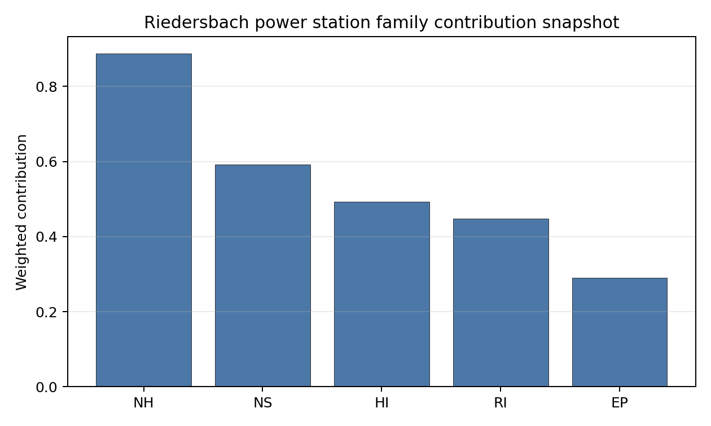

# Riedersbach power station Site Profile

Riedersbach power station is a coal/thermal site in Austria that has been tested against the NuScale VOYGR-6 reference deployment envelope. This profile reads the screening evidence at a level that supports a decision to progress toward Stage 3 characterization. It is not a site-suitability determination, vendor recommendation, or licensing finding.

## Site Snapshot

| Field | Value |
| --- | --- |
| Site name | Riedersbach power station |
| Coordinates | 48.0318, 12.8431 |
| Subnational unit | Upper Austria |
| Installed thermal capacity (source data) | 220 MW |
| Composite score (baseline weights) | 5.807 (4.311-6.226 MC band) |
| National stability band | D (top-10% hit rate 19%) |
| National rank | 3 |

_See the country status map in_ [Austria Country Profile](../AT_country_prototype.md#country-status-map).

## Ownership and Coal-to-Nuclear Context

- **Bank für Tirol und Vorarlberg AG** (0.85% share), headquartered in Austria; immediate operator Energie AG Oberösterreich. Path: Bank für Tirol und Vorarlberg AG -> Oberbank AG [16.45%] -> Energie AG Oberösterreich  [5.18%] -> Riedersbach power station Unit 2 [100.0%]
- **Unicredit SpA** (nan% share), headquartered in Italy; immediate operator Energie AG Oberösterreich. Path: Unicredit SpA -> UniCredit Bank Austria AG [unknown %] -> Oberbank AG [3.41%] -> Energie AG Oberösterreich  [5.18%] -> Riedersbach power station Unit 1 [100.0%]
- **Wiener Stadtwerke GmbH** (nan% share), headquartered in Austria; immediate operator Energie AG Oberösterreich. Path: Wiener Stadtwerke GmbH -> Verbund AG [unknown %] -> Energie AG Oberösterreich  [5.2%] -> Riedersbach power station Unit 1 [100.0%]
- **City of Linz** (10.36% share), headquartered in Austria; immediate operator Energie AG Oberösterreich. Path: City of Linz  -> Linz AG [100.0%] -> Energie AG Oberösterreich  [10.36%] -> Riedersbach power station Unit 2 [100.0%]
- **UniCredit Bank Austria AG** (0.18% share), headquartered in Austria; immediate operator Energie AG Oberösterreich. Path: UniCredit Bank Austria AG -> Oberbank AG [3.41%] -> Energie AG Oberösterreich  [5.18%] -> Riedersbach power station Unit 1 [100.0%]
- **Government of Austria** (2.65% share), headquartered in Austria; immediate operator Energie AG Oberösterreich. Path: Government of Austria  -> Verbund AG [51.0%] -> Energie AG Oberösterreich  [5.2%] -> Riedersbach power station Unit 1 [100.0%]
- **CABO Beteiligungsgesellschaft mbH** (1.23% share), headquartered in Austria; immediate operator Energie AG Oberösterreich. Path: CABO Beteiligungsgesellschaft mbH -> Oberbank AG [23.76%] -> Energie AG Oberösterreich  [5.18%] -> Riedersbach power station Unit 2 [100.0%]
- **Raiffeisenlandesbank Oberösterreich AG** (13.98% share), headquartered in Austria; immediate operator Energie AG Oberösterreich. Path: Raiffeisenlandesbank Oberösterreich AG -> Energie AG Oberösterreich  [13.98%] -> Riedersbach power station Unit 2 [100.0%]
- **G3B Holding AG** (0.08% share), headquartered in Austria; immediate operator Energie AG Oberösterreich. Path: G3B Holding AG -> Oberbank AG [1.62%] -> Energie AG Oberösterreich  [5.18%] -> Riedersbach power station Unit 2 [100.0%]
- **EVN AG** (nan% share), headquartered in Austria; immediate operator Energie AG Oberösterreich. Path: EVN AG -> Verbund AG [unknown %] -> Energie AG Oberösterreich  [5.2%] -> Riedersbach power station Unit 1 [100.0%]
- **BKS Bank AG** (0.76% share), headquartered in Austria; immediate operator Energie AG Oberösterreich. Path: BKS Bank AG -> Oberbank AG [14.74%] -> Energie AG Oberösterreich  [5.18%] -> Riedersbach power station Unit 2 [100.0%]
- **Oberbank AG** (5.18% share), headquartered in Austria; immediate operator Energie AG Oberösterreich. Path: Oberbank AG -> Energie AG Oberösterreich  [5.18%] -> Riedersbach power station Unit 2 [100.0%]
- **OÖ Landesholding GmbH** (52.71% share), headquartered in Austria; immediate operator Energie AG Oberösterreich. Path: OÖ Landesholding GmbH -> Energie AG Oberösterreich  [52.71%] -> Riedersbach power station Unit 2 [100.0%]
- **Verbund AG** (5.20% share), headquartered in Austria; immediate operator Energie AG Oberösterreich. Path: Verbund AG -> Energie AG Oberösterreich  [5.2%] -> Riedersbach power station Unit 2 [100.0%]
- **TIWAG-Tiroler Wasserkraft AG** (8.28% share), headquartered in Austria; immediate operator Energie AG Oberösterreich. Path: TIWAG-Tiroler Wasserkraft AG -> Energie AG Oberösterreich  [8.28%] -> Riedersbach power station Unit 1 [100.0%]
- **Linz AG** (10.36% share), headquartered in Austria; immediate operator Energie AG Oberösterreich. Path: Linz AG -> Energie AG Oberösterreich  [10.36%] -> Riedersbach power station Unit 2 [100.0%]
- **small shareholder(s)** (4.29% share); immediate operator Energie AG Oberösterreich. Path: small shareholder(s)  -> Energie AG Oberösterreich  [4.29%] -> Riedersbach power station Unit 2 [100.0%]
- **CABET Holding GmbH** (1.23% share), headquartered in Austria; immediate operator Energie AG Oberösterreich. Path: CABET Holding GmbH -> CABO Beteiligungsgesellschaft mbH [100.0%] -> Oberbank AG [23.76%] -> Energie AG Oberösterreich  [5.18%] -> Riedersbach power station Unit 2 [100.0%]

Generating units on record: 2 retired.
Earliest unit commissioning: 1969; most recent: 1986.
Retirements span 2010 to 2016, leaving brownfield grid, water, transport, and workforce assets that materially shorten Stage 3 site preparation.

## Natural Hazards (NH)

- **Seismic: Ground Motion (NH-01)** - score 9.5/10 (MC 9.0-10.0), weight 0.0396, data quality high. Evidence: PGA at 475-year return period 0.034 g; PGA at 2,475-year return period 0.067 g; Vs30 reference (m/s): 760.0.
- **Seismic: Surface Rupture (NH-02)** - score 9.5/10 (MC 9.0-10.0), weight n/a, data quality screening grade. Evidence: nearest mapped capable fault 31.2 km; fault slip rate 0.707 mm/yr; fault name: ATCF007.
- **Geotechnical: Liquefaction (NH-03)** - score 5.0/10 (MC 5.0-5.0), weight n/a, data quality medium. Evidence: liquefaction susceptibility: high; dominant soil type: loam.
- **Geotechnical: Slope Stability (NH-04)** - score 5.5/10 (MC 5.0-6.0), weight n/a, data quality screening grade. Evidence: site slope 11.2 deg; max slope in 1 km box 87.3 deg; slope stability class: steep.
- **Geotechnical: Subsidence (NH-05)** - score 5.5/10 (MC 5.0-6.0), weight 0.0308, data quality medium. Evidence: karst present: no; karst severity: none.
- **Geotechnical: Foundation (NH-06)** - score 5.5/10 (MC 5.0-6.0), weight 0.0220, data quality medium. Evidence: bearing capacity 80.7 kPa; depth to bedrock 20.5 m.
- **Volcanism (NH-07)** - score 5.0/10 (MC 5.0-5.0), weight n/a, data quality high. Evidence: volcanic hazard class: negligible.
- **Coastal Flooding (NH-08)** - score 5.0/10 (MC 5.0-5.0), weight 0.0264, data quality low. Evidence: values not in measurement tables.
- **River Flooding (NH-09)** - score 5.0/10 (MC 5.0-5.0), weight 0.0352, data quality medium. Evidence: flood zone class: negligible.
- **Extreme Winds (NH-10)** - score 9.5/10 (MC 9.0-10.0), weight n/a, data quality medium. Evidence: design wind speed 8.64 m/s.
- **Extreme Precipitation (NH-11)** - score 4.0/10 (MC 4.0-4.0), weight 0.0132, data quality medium. Evidence: extreme daily precipitation 0.34 mm; mean annual precipitation 44.2 mm/yr.
- **Extreme Temperatures (NH-12)** - score 9.5/10 (MC 9.0-10.0), weight 0.0176, data quality medium. Evidence: extreme high temperature 21.8 deg C; extreme low temperature -5.04 deg C.
- **Forest/Wildfire (NH-13)** - score 5.0/10 (MC 5.0-5.0), weight 0.0132, data quality n/a. Evidence: values not in measurement tables.
- **Combined Hazards (NH-14)** - score 5.0/10 (MC 5.0-5.0), weight 0.0132, data quality n/a. Evidence: values not in measurement tables.

### Interpretation - Natural Hazards (NH)

<!-- specialist key=family_natural_hazards scope=site site_id=660d9d71-6733-4294-951b-1c58614d58cf bundle=AT_riedersbach_power_station_site_bundle.json status=filled by=cursor-agent filled_at=2026-05-03T15:01:55Z -->
Natural hazards at Riedersbach sit in the very-low-seismic, low-meteorological envelope of the upper Salzach valley, and no exclusionary natural-hazard check is currently failing. PGA at the 475-yr return period is 0.034 g and at the 2,475-yr return period is 0.067 g, the lowest seismic loading of the three first-batch Austrian sites and well inside the NuScale VOYGR-6 project envelope of 0.5 g at 2,475-yr; the nearest mapped capable fault (ATCF007) is at 31.2 km with a slip rate of 0.707 mm/yr, so NH-02 settles at 9.5/10 on distance even though a named fault is now within the broader screening radius. The principal geotechnical concern is **NH-03 Liquefaction Susceptibility**, classified `high` at screening grade over loam soils with a screening-proxy bearing capacity of 80.7 kPa and depth to bedrock 20.5 m; combined with the low-seismic loading the consequence is contained but the foundation envelope still requires Stage 3 ground-improvement scoping. NH-04 (Slope Stability) reads 5.5/10 on a mean site slope of 11.2° and a 1 km box maximum of 87.3°, the latter a digital surface model canopy artefact rather than a geomorphological feature; NH-04 carries the standard caveat. Extreme meteorology is calm: a screening 50-yr gust of 8.64 m/s and an extreme temperature range of -5.0 °C to 21.8 °C are well inside the project envelope. NH-11 (Extreme Precipitation) reads 4.0/10 with a mean annual precipitation of 44.2 mm/yr, physically implausible for the Salzach valley and reflective of a coarse-grid mismatch. NH-07 (Volcanism), NH-08 (Coastal Flooding) and NH-09 (River Flooding) carry `inconclusive` avoidance verdicts because the nearest-volcano distance, coast distance and local Salzach flood distance are unmeasured at this stage. The Stage 3 priority order is therefore: run a site-specific Cone-Penetration-Test campaign over the upper 30 m of alluvium so NH-03 settles on measured site-specific evidence rather than the screening proxy, replace the screening precipitation reading with national meteorological station data, and re-source the three null distances so the avoidance verdicts on NH-07, NH-08 and NH-09 settle to `pass`.
<!-- /specialist key=family_natural_hazards -->

## Human-Induced and Security-Relevant Hazards (HI)

- **Aircraft Crash (HI-01)** - score 5.5/10 (MC 5.0-6.0), weight 0.0308, data quality high. Evidence: nearest airport 15.1 km; nearest flight path 12.5 km; airports within search radius 12; airport name: Altötting-Burghausen District Hospital Burghausen Heliport; airport type: heliport.
- **Industrial Explosions (HI-02)** - score 5.0/10 (MC 5.0-5.0), weight 0.0308, data quality high. Evidence: nearest industrial site 21.9 km.
- **Toxic/Gas Releases (HI-03)** - score 7.5/10 (MC 7.0-8.0), weight 0.0308, data quality high. Evidence: nearest toxic source 21.9 km.
- **External Fires (HI-04)** - score 5.0/10 (MC 5.0-5.0), weight 0.0264, data quality high. Evidence: values not in measurement tables.
- **Transport Hazards (HI-05)** - score 5.0/10 (MC 5.0-5.0), weight 0.0264, data quality n/a. Evidence: values not in measurement tables.
- **Military Installations (HI-06)** - score 3.5/10 (MC 3.0-4.0), weight 0.0264, data quality medium. Evidence: nearest military installation 19.0 km; military installations within radius 4.
- **Electromagnetic Interference (HI-07)** - score 5.0/10 (MC 5.0-5.0), weight 0.0088, data quality medium. Evidence: nearest high-power transmitter 0.29 km; transmitters within radius 159; transmitter type: mast.
- **Other Nuclear Installations (HI-08)** - score 5.0/10 (MC 5.0-5.0), weight 0.0132, data quality n/a. Evidence: values not in measurement tables.

### Interpretation - Human-Induced and Security-Relevant Hazards (HI)

<!-- specialist key=family_human_hazards scope=site site_id=660d9d71-6733-4294-951b-1c58614d58cf bundle=AT_riedersbach_power_station_site_bundle.json status=filled by=cursor-agent filled_at=2026-05-03T15:01:55Z -->
Human-induced and security-relevant hazards at Riedersbach are dominated by an exceptionally dense airport count in the cross-border Salzach corridor and a moderate Bavarian military presence to the west. The nearest airport is the Burghausen District Hospital Heliport at 15.1 km with a flight-path distance of 12.5 km, and **12 airports of all classes sit inside the 30 km screening radius** (the highest airport count of any first-batch Austrian site and the result of a busy cross-border airspace shared with Bavaria); the heliport classification limits the design-basis aircraft mass on the immediate approach, but the broader airport count converts HI-01 (5.5/10) into a quantitative micro-siting question for Stage 3. **HI-02 Industrial Explosions** scores 5.0/10 with the nearest industrial site at 21.9 km and **HI-03 Toxic / Gas Releases** scores 7.5/10 with the nearest toxic source also at 21.9 km, both comfortably outside the project A2 / A3 avoidance radii of 5 km and 8 km respectively. **HI-06 Military Installations** at 3.5/10 carries the nearest military feature at 19.0 km with 4 features inside the 25 km screening radius, the only first-batch Austrian site with a non-zero classified military count and the consequence of the Bavarian military estate to the west. HI-04 (External Fires) and HI-05 (Transport Hazards) sit at the pass-mark default of 5.0/10. HI-07 Electromagnetic Interference reads 5.0/10 with the nearest mast at 0.29 km and 159 transmitters within radius (the highest count of any first-batch Austrian site and a signal of the dense communications infrastructure on the cross-border corridor); the count is informational, no transmitter is inside a stand-off radius that would prompt the EMI avoidance flag. HI-08 (Other Nuclear Installations) is null. The Stage 3 priority order is therefore: run a quantitative aircraft-impact frequency calculation against the 12 airports inside the 30 km radius so HI-01 converts to a defensible micro-sited number, engage the Austrian Federal Ministry of Defence and the Bavarian counterpart on the four HI-06 features so the criterion lifts off the 3.5/10 read, and confirm the 0.29 km transmitter is not inside an EMI stand-off radius that the screening proxy missed.
<!-- /specialist key=family_human_hazards -->

## Radiological Impact and Emergency Planning (RI / EP)

- **Emergency Planning Feasibility (EP-01)** - score 5.5/10 (MC 5.0-6.0), weight n/a, data quality high. Evidence: EP feasibility composite 55.6 /100; road sub-score 66.4 /100; special-population sub-score 0 /100; geography sub-score 95.0 /100; population sub-score 80.0 /100; evacuation feasible: yes.
- **Evacuation Routes (EP-02)** - score 5.5/10 (MC 5.0-6.0), weight 0.0264, data quality medium. Evidence: road density in EPZ 0.74 km/km2; road length in EPZ 1,452 km; motorway access: yes.
- **Physical Geography Constraints (EP-03)** - score 5.0/10 (MC 5.0-5.0), weight 0.0220, data quality medium. Evidence: waterways crossing EPZ 0; major river barrier: no.
- **Special Populations (EP-04)** - score 5.5/10 (MC 5.0-6.0), weight 0.0264, data quality medium. Evidence: hospitals in EPZ 17; prisons in EPZ 3; care homes in EPZ 2.
- **Concurrent Hazard Impact (EP-05)** - score 5.0/10 (MC 5.0-5.0), weight 0.0176, data quality n/a. Evidence: values not in measurement tables.
- **Atmospheric Dispersion (RI-01)** - score 5.0/10 (MC 5.0-5.0), weight 0.0264, data quality medium. Evidence: annual mean wind speed 0.91 m/s; atmospheric mixing height 419.5 m; prevailing wind direction: WSW.
- **Surface Water Dispersion (RI-02)** - score 7.5/10 (MC 7.0-8.0), weight 0.0220, data quality n/a. Evidence: values not in measurement tables.
- **Groundwater Dispersion (RI-03)** - score 5.0/10 (MC 5.0-5.0), weight 0.0220, data quality medium. Evidence: aquifer type: low permeability.
- **Population Density at EPZ Radii (RI-04)** - score 5.5/10 (MC 5.0-6.0), weight 0.0352, data quality screening grade. Evidence: population density within 5 km 145.6 /km2; population density within 16 km 110.8 /km2; population density within 25 km 153.3 /km2; population density within 80 km 134.6 /km2; population within 25 km 301,073 people.
- **Distance to Population Centres (RI-05)** - score 5.0/10 (MC 5.0-5.0), weight 0.0441, data quality screening grade. Evidence: nearest city above 50k people 30.1 km; nearest city population 146,631 people; city name: Salzburg.
- **Population Projections (RI-06)** - score 5.5/10 (MC 5.0-6.0), weight 0.0220, data quality screening grade. Evidence: annual population growth rate 0.054 %/yr; projected population at 25 km in 60 yr 314,610 people.

### Interpretation - Radiological Impact and Emergency Planning (RI / EP)

<!-- specialist key=family_radiological_emergency scope=site site_id=660d9d71-6733-4294-951b-1c58614d58cf bundle=AT_riedersbach_power_station_site_bundle.json status=filled by=cursor-agent filled_at=2026-05-03T15:01:55Z -->
Radiological impact and emergency planning at Riedersbach read as a periurban envelope with low-to-moderate population density and a binding finding on EP-01's special-population sub-score. Population density at the screening epoch is 146 p/km² at 5 km, 111 p/km² at 16 km, 153 p/km² at 25 km, and 135 p/km² at 80 km, with a 25 km total of 301,073 people; the nearest city above 50,000 people is **Salzburg (146,631) at 30.1 km**, hierarchy `periurban`, with zero cities above 50k inside the 25 km screening radius. Trajectory is favourable for a 60-year siting horizon: a +0.054 %/yr regional growth rate yields a 25 km projection of 314,610 people in 60 years, which converts to RI-04 5.5/10 and RI-06 5.5/10. The atmospheric envelope is moderately diluting: the screening reanalysis gives a mean wind speed of 0.91 m/s, a prevailing direction of WSW (which points the dispersion plume away from Salzburg) and a mean planetary boundary-layer height of 420 m, holding RI-01 at 5.0/10. **EP-01 Emergency Planning Feasibility** at 5.5/10 reads 55.6/100 against `road_score=66.4, special_pop=0, geography=95, population=80`, with the **0/100 special-population sub-score** the binding finding: 17 hospitals, 3 prisons and 2 care homes inside the EPZ exceed the threshold the EP-01 composite uses for the special-population term. EP-04 Special Populations holds at 5.5/10 because the absolute counts are lower than at Voitsberg, but the EP-01 read remains binding. EP-02 (Evacuation Routes) reads 5.5/10 on a road density of 0.74 km/km² over 1,452 km of road, EP-03 (Physical Geography Constraints) at 5.0/10 sits on no major-river barrier and 0 waterway crossings, and **RI-02 Surface Water Dispersion** reads 7.5/10 on `aquifer_type=low permeability` rather than the 1.5/10 floor seen at the other Austrian first-batch sites. The Stage 3 priority order is therefore: model EPZ time-to-clear against the special-population profile (17 hospitals, 3 prisons, 2 care homes) using national emergency-planning traffic and special-mover data so EP-01 settles on a measured composite, and confirm the Salzach (Redlbach) dilution flow at the discharge point so RI-02 holds its 7.5/10 read on measured evidence.
<!-- /specialist key=family_radiological_emergency -->

## Non-Safety and Implementation Considerations (NS)

- **Grid Capacity Basic Filter (BF-01)** - score 1.5/10 (MC 1.0-2.0), weight 0.0352, data quality n/a. Evidence: values not in measurement tables.
- **Land Area Basic Filter (BF-02)** - score 3.5/10 (MC 3.0-4.0), weight 0.0220, data quality n/a. Evidence: values not in measurement tables.
- **Cooling Water Availability (NS-01)** - score 7.0/10 (MC 6.0-7.0), weight n/a, data quality screening grade. Evidence: distance to cooling source 0.58 km; cooling source flow 156.2 m3/s; cooling source type: major_river; cooling source name: Redlbach; water stress label: Low.
- **Grid Connection (NS-02)** - score 3.5/10 (MC 3.0-4.0), weight 0.0352, data quality medium. Evidence: nearest substation 0.23 km; nearest high-voltage line 6.11 km; highest nearby line voltage 110.0 kV; grid export capacity 220.0 MW; substations within radius 2,645; HV lines within radius 671.
- **Transport Access (NS-03)** - score 7.0/10 (MC 7.0-7.0), weight 0.0352, data quality high. Evidence: nearest highway 2.55 km; nearest rail line 1.17 km; heavy-haul capable: yes.
- **Site Topography (NS-04)** - score 5.5/10 (MC 5.0-6.0), weight 0.0264, data quality high. Evidence: favourable land cover 50.5 %; moderate land cover 18.3 %; unfavourable land cover 31.1 %; favourable area 90.2 ha; dominant land class: 311.
- **Site Footprint Adequacy (NS-05)** - score 3.5/10 (MC 3.0-4.0), weight 0.0220, data quality high. Evidence: buildable area 12.8 ha; largest contiguous patch 12.8 ha; buildable patch count 17.
- **Existing Infrastructure (NS-06)** - score 5.0/10 (MC 5.0-5.0), weight 0.0220, data quality n/a. Evidence: values not in measurement tables.
- **Environmental Impact (non-rad) (NS-07)** - score 5.0/10 (MC 5.0-5.0), weight 0.0220, data quality n/a. Evidence: values not in measurement tables.
- **Ecological Sensitivity (NS-08)** - score 5.5/10 (MC 5.0-6.0), weight n/a, data quality high. Evidence: natural land cover 31.1 %; distance to nearest Natura 2000 site 0.293 km; distance to nearest protected area 2.973 km; Natura 2000 overlap: no; Natura 2000 sensitivity class: high; protected-area overlap: no; protected-area sensitivity class: moderate; nearest Natura 2000 site: Salzachauen; Natura 2000 sites within 5 km: 8; nearest protected-area designation: Nature Reserve.
- **Socioeconomic Impact (NS-09)** - score 5.0/10 (MC 5.0-5.0), weight 0.0220, data quality n/a. Evidence: values not in measurement tables.
- **Workforce Availability (NS-10)** - score 5.0/10 (MC 5.0-5.0), weight 0.0176, data quality n/a. Evidence: values not in measurement tables.
- **Coal-to-Nuclear Synergies (NS-11)** - score 5.0/10 (MC 5.0-5.0), weight 0.0264, data quality n/a. Evidence: values not in measurement tables.
- **Regulatory/Political Environment (NS-12)** - score 5.0/10 (MC 5.0-5.0), weight 0.0264, data quality n/a. Evidence: values not in measurement tables.
- **Construction Logistics (NS-13)** - score 5.0/10 (MC 5.0-5.0), weight 0.0176, data quality n/a. Evidence: values not in measurement tables.

### Interpretation - Non-Safety and Implementation Considerations (NS)

<!-- specialist key=family_infrastructure scope=site site_id=660d9d71-6733-4294-951b-1c58614d58cf bundle=AT_riedersbach_power_station_site_bundle.json status=filled by=cursor-agent filled_at=2026-05-03T15:01:55Z -->
Non-safety and implementation conditions are the weakest part of Riedersbach's screening file and the reason this site sits in the avoidance-flagged tier with two binding NS findings rather than one. Cooling water is unbounded: the Redlbach (a Salzach-system tributary) sits 0.58 km from the site at an annual mean discharge of **156.2 m³/s**, the highest measured cooling-source flow of any first-batch Austrian site, with a screening water-stress score in the `Low` band, so NS-01 settles at 7.0/10 and the Salzach corridor is the headline cooling-water argument for this site. Site topography and footprint are the binding finding: the dominant land class shows favourable land cover at 50.5 % over a 178 ha screening footprint with 90 ha of favourable area, but the buildable area is only **12.8 ha in a single contiguous patch** (NS-04 5.5/10 and **NS-05 3.5/10 with active avoidance flag** against the project A15 threshold of >= 14 ha contiguous industrial land). The 12.8 ha contiguous patch is below the threshold a NuScale VOYGR-6 12-module plus lay-down envelope can accommodate without re-zoning adjacent parcels, and the avoidance flag is treated as a Stage 3 unlock candidate. Ecology is the second binding sensitivity: the nearest Natura 2000 site is **Salzachauen** at only 0.293 km, no overlap, sensitivity class **`high`**, with 8 Natura 2000 sites inside the 5 km buffer; the nearest IUCN protected area (Nature Reserve, IUCN Ia/Ib) is at 2.97 km, no overlap, sensitivity `moderate`. NS-08 settles at 5.5/10 (the lowest NS-08 read of the first-batch Austrian sites) and the Article-6(3) workload at this site is materially heavier than at Timelkam or Voitsberg. The criterion that drives the family read alongside NS-05 is the **Grid Connection (NS-02)** avoidance flag at 3.5/10: the nearest substation is at 0.23 km but the nearest HV line is at 6.11 km at 110 kV, and the 220 MW grid-export capacity is well below the 924 MW NuScale VOYGR-6 12-module gross output. NS-03 Transport Access reads 7.0/10 on highway 2.55 km, rail 1.17 km and heavy-haul capable. The Stage 3 priority order is therefore: scope an extension of the contiguous buildable patch beyond 14 ha through adjacent-parcel re-zoning so NS-05 lifts off the avoidance flag, trigger early Salzachauen Article-6(3) Habitats Directive Appropriate Assessment so the permitting timeline is sized before construction commitments, and confirm the corridor upgrade pathway with the Austrian transmission system operator for NS-02.
<!-- /specialist key=family_infrastructure -->

## Composite Score and Stability

Baseline composite score is 5.807, bracketed by Monte Carlo at 4.311-6.226. National stability band is `D` with a top-10% hit rate of 19% across 16 scored Monte Carlo scenarios.

<!-- specialist key=stability scope=site site_id=660d9d71-6733-4294-951b-1c58614d58cf bundle=AT_riedersbach_power_station_site_bundle.json status=filled by=cursor-agent filled_at=2026-05-03T15:01:55Z -->
Riedersbach's baseline composite score is 5.807 with a Monte Carlo bracket of 4.311-6.226, a narrow upside (about 0.4 above the point estimate) and a meaningful downside (about 1.5 below). The downside reflects the high unscored fraction in the underlying criterion set rather than evidence that any criterion is failing. The national stability band is `D` with a **19 % top-10 % hit rate** across the 16 Monte Carlo weight perturbations the audit considered, which means Riedersbach holds its top-10 % national ranking under three of every sixteen weight profiles in the sensitivity sweep and the rank is materially weight-dependent; at the regional (CESE) scope the band remains `D` with a 12 % top-10 % hit rate, robust under most but not all weight profiles. Family balance, not a single dominant criterion, drives the composite: the per-family averages read NH 6.32, RI 5.45, HI 5.19 and NS 4.80, with the NS floor pulled down by the dual avoidance flags on NS-02 (3.5/10) and NS-05 (3.5/10) and the BF-01 grid-capacity basic filter at 1.5/10. The two strongest contributions are NH-01 Seismic Ground Motion at 9.5/10 (contributing 0.376 to the composite) and HI-03 Toxic / Gas Releases at 7.5/10 (contributing 0.231). The next characterization effort that would produce the largest narrowing of the composite uncertainty band is therefore the resolution of the dual NS-02 / NS-05 avoidance flags through adjacent-parcel re-zoning and a transmission-corridor upgrade, which together would lift the band letter and tighten the lower bracket without depending on any single high-stakes finding being upgraded.
<!-- /specialist key=stability -->

## Residual Risk Register

<!-- specialist key=residual_risk scope=site site_id=660d9d71-6733-4294-951b-1c58614d58cf bundle=AT_riedersbach_power_station_site_bundle.json status=filled by=cursor-agent filled_at=2026-05-03T15:01:55Z -->
| Concern | Evidence | Consequence | Stage 3 action | Owner discipline |
| --- | --- | --- | --- | --- |
| Site Footprint Adequacy (NS-05) | Buildable area 12.8 ha in a single contiguous patch (smallest of the first-batch Austrian sites); **active avoidance flag** against project A15 threshold of >= 14 ha contiguous industrial land | The 12.8 ha contiguous patch is below the threshold a NuScale VOYGR-6 (6 × 77 MWe modules) plus lay-down envelope can accommodate without re-zoning adjacent parcels | Scope an extension of the contiguous buildable patch beyond 14 ha through adjacent-parcel re-zoning and validate against the VOYGR-6 footprint | site engineering |
| Grid Connection (NS-02) | Nearest substation 0.23 km, nearest HV line 6.11 km at 110 kV; 220 MW grid-export capacity; **active avoidance flag** (project A13 threshold) | 220 MW is the lowest grid-export capacity of the first-batch Austrian sites and well below the 462 MWe NuScale VOYGR-6 (6 × 77 MWe modules) reference output | Confirm the corridor upgrade pathway with the Austrian transmission system operator and update NS-02 against the planned topology | grid |
| Ecological Sensitivity (NS-08) | Natura 2000 "Salzachauen" at 0.293 km, sensitivity class **`high`**; 8 Natura 2000 sites within 5 km; nearest IUCN protected area (Nature Reserve, IUCN Ia/Ib) at 2.97 km | Article-6(3) Habitats Directive Appropriate Assessment workload materially heavier than at Timelkam or Voitsberg; permitting timeline risk | Trigger early Salzachauen Article-6(3) Appropriate Assessment so the workload is sized before construction commitments | EIA |
| Aircraft Crash (HI-01) | 12 airports of all classes inside the 30 km screening radius (highest count of any first-batch Austrian site); nearest heliport at 15.1 km | Cross-border Bavarian airspace converts HI-01 from a routine pass-band entry into a quantitative micro-siting question for the design-basis aircraft input | Run a quantitative aircraft-impact frequency calculation against all 12 airports in the 30 km radius and update HI-01 against the result | hazard analysis |
| Geotechnical: Liquefaction (NH-03) | Liquefaction susceptibility classified `high` at screening grade over loam soils; bearing capacity 80.7 kPa; depth to bedrock 20.5 m; 0.034 g 475-yr PGA | Foundation envelope undefined for VOYGR-6 module placement on liquefaction-susceptible alluvium even at low seismic loading | Run a site-specific Cone-Penetration-Test campaign over the upper 30 m of alluvium and produce a measured Vs30 profile so NH-03 settles on site-specific evidence | geotech |
| Atmospheric Dispersion (RI-01) | Screening reanalysis: mean wind speed 0.91 m/s, prevailing direction WSW (away from Salzburg), mean BLH 420 m | Plume points away from the principal receptor population, but the low wind speed concentrates dispersion within a narrow corridor | Confirm dispersion modelling assumptions with a measured wind rose at the site | meteorology |

Three concerns dominate the register. NS-05 and NS-02 are the dual avoidance flags at this site and together account for the entire avoidance-flagged status; both must be lifted before Riedersbach converts to a clean Stage 3 candidate. NS-08 is the principal permitting question: the 0.293 km distance to a `high`-sensitivity Natura 2000 site converts the Article-6(3) workload into a programmatic engagement that should be triggered before construction commitments. The remaining three entries are characterization gaps and engineering precursors. The register is a Stage 3 work plan, not a deal-breaker list: no avoidance flag is currently failing in the exclusionary sense, but the dual avoidance flags and the band-D / 19 % national stability rank make the unlock-work pathway substantially heavier than at Timelkam.
<!-- /specialist key=residual_risk -->

## Stage 3 Follow-Up Checklist

- [ ] Resolve **Grid Connection (NS-02)** avoidance flag - measured {"grid_export_capacity_mw": 220.0} vs threshold Project A13: transmission >= reference SMR net MWe within feasible distance..
- [ ] Resolve **Site Footprint Adequacy (NS-05)** avoidance flag - measured {"largest_contiguous_ha": 12.76} vs threshold Project A15: >= 14 ha contiguous industrial land..
- [ ] Re-measure **Grid Capacity Basic Filter (BF-01)** - native score 1.5/10 with confidence insufficient.
- [ ] Re-measure **Land Area Basic Filter (BF-02)** - native score 3.5/10 with confidence insufficient.
- [ ] Re-measure **Military Installations (HI-06)** - native score 3.5/10 with confidence medium.
- [ ] Re-measure **Grid Connection (NS-02)** - native score 3.5/10 with confidence medium.
- [ ] Re-measure **Site Footprint Adequacy (NS-05)** - native score 3.5/10 with confidence high.
- [ ] Improve data quality for **Geotechnical: Subsidence & Collapse (NH-05b)** - current flag `low`.
- [ ] Improve data quality for **Coastal Flooding (NH-08)** - current flag `low`.

## Evidence Limitations

- Geotechnical: Subsidence & Collapse (NH-05b) - quality `low`.
- Coastal Flooding (NH-08) - quality `low`.
