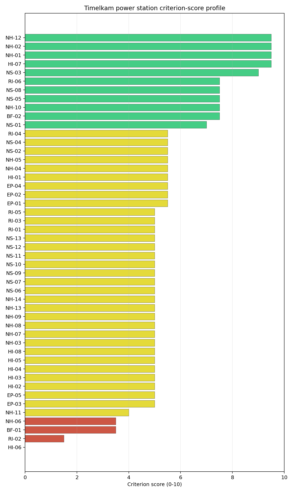

# Timelkam power station Site Profile

Timelkam power station is a coal/thermal site in Austria that has been tested against the NuScale VOYGR-6 reference deployment envelope. This profile reads the screening evidence at a level that supports a decision to progress toward Stage 3 characterization. It is not a site-suitability determination, vendor recommendation, or licensing finding.

## Site Snapshot

| Field | Value |
| --- | --- |
| Site name | Timelkam power station |
| Coordinates | 48.0122, 13.5895 |
| Subnational unit | Upper Austria |
| Installed thermal capacity (source data) | 66 MW |
| Composite score (baseline weights) | 6.069 (4.366-6.455 MC band) |
| National stability band | A (top-10% hit rate 100%) |
| National rank | 1 |

_See the country status map in_ [Austria Country Profile](../AT_country_prototype.md#country-status-map).

## Ownership and Coal-to-Nuclear Context

- **Bank für Tirol und Vorarlberg AG** (0.85% share), headquartered in Austria; immediate operator Energie AG Oberösterreich. Path: Bank für Tirol und Vorarlberg AG -> Oberbank AG [16.45%] -> Energie AG Oberösterreich  [5.18%] -> Timelkam power station Unit 4 [100.0%]
- **Unicredit SpA** (nan% share), headquartered in Italy; immediate operator Energie AG Oberösterreich. Path: Unicredit SpA -> UniCredit Bank Austria AG [unknown %] -> Oberbank AG [3.41%] -> Energie AG Oberösterreich  [5.18%] -> Timelkam power station Unit 4 [100.0%]
- **Wiener Stadtwerke GmbH** (nan% share), headquartered in Austria; immediate operator Energie AG Oberösterreich. Path: Wiener Stadtwerke GmbH -> Verbund AG [unknown %] -> Energie AG Oberösterreich  [5.2%] -> Timelkam power station Unit 4 [100.0%]
- **City of Linz** (10.36% share), headquartered in Austria; immediate operator Energie AG Oberösterreich. Path: City of Linz  -> Linz AG [100.0%] -> Energie AG Oberösterreich  [10.36%] -> Timelkam power station Unit 4 [100.0%]
- **UniCredit Bank Austria AG** (0.18% share), headquartered in Austria; immediate operator Energie AG Oberösterreich. Path: UniCredit Bank Austria AG -> Oberbank AG [3.41%] -> Energie AG Oberösterreich  [5.18%] -> Timelkam power station Unit 4 [100.0%]
- **Government of Austria** (2.65% share), headquartered in Austria; immediate operator Energie AG Oberösterreich. Path: Government of Austria  -> Verbund AG [51.0%] -> Energie AG Oberösterreich  [5.2%] -> Timelkam power station Unit 4 [100.0%]
- **CABO Beteiligungsgesellschaft mbH** (1.23% share), headquartered in Austria; immediate operator Energie AG Oberösterreich. Path: CABO Beteiligungsgesellschaft mbH -> Oberbank AG [23.76%] -> Energie AG Oberösterreich  [5.18%] -> Timelkam power station Unit 4 [100.0%]
- **Raiffeisenlandesbank Oberösterreich AG** (13.98% share), headquartered in Austria; immediate operator Energie AG Oberösterreich. Path: Raiffeisenlandesbank Oberösterreich AG -> Energie AG Oberösterreich  [13.98%] -> Timelkam power station Unit 4 [100.0%]
- **G3B Holding AG** (0.08% share), headquartered in Austria; immediate operator Energie AG Oberösterreich. Path: G3B Holding AG -> Oberbank AG [1.62%] -> Energie AG Oberösterreich  [5.18%] -> Timelkam power station Unit 4 [100.0%]
- **EVN AG** (nan% share), headquartered in Austria; immediate operator Energie AG Oberösterreich. Path: EVN AG -> Verbund AG [unknown %] -> Energie AG Oberösterreich  [5.2%] -> Timelkam power station Unit 4 [100.0%]
- **BKS Bank AG** (0.76% share), headquartered in Austria; immediate operator Energie AG Oberösterreich. Path: BKS Bank AG -> Oberbank AG [14.74%] -> Energie AG Oberösterreich  [5.18%] -> Timelkam power station Unit 4 [100.0%]
- **Oberbank AG** (5.18% share), headquartered in Austria; immediate operator Energie AG Oberösterreich. Path: Oberbank AG -> Energie AG Oberösterreich  [5.18%] -> Timelkam power station Unit 4 [100.0%]
- **OÖ Landesholding GmbH** (52.71% share), headquartered in Austria; immediate operator Energie AG Oberösterreich. Path: OÖ Landesholding GmbH -> Energie AG Oberösterreich  [52.71%] -> Timelkam power station Unit 4 [100.0%]
- **Verbund AG** (5.20% share), headquartered in Austria; immediate operator Energie AG Oberösterreich. Path: Verbund AG -> Energie AG Oberösterreich  [5.2%] -> Timelkam power station Unit 4 [100.0%]
- **TIWAG-Tiroler Wasserkraft AG** (8.28% share), headquartered in Austria; immediate operator Energie AG Oberösterreich. Path: TIWAG-Tiroler Wasserkraft AG -> Energie AG Oberösterreich  [8.28%] -> Timelkam power station Unit 4 [100.0%]
- **Linz AG** (10.36% share), headquartered in Austria; immediate operator Energie AG Oberösterreich. Path: Linz AG -> Energie AG Oberösterreich  [10.36%] -> Timelkam power station Unit 4 [100.0%]
- **small shareholder(s)** (4.29% share); immediate operator Energie AG Oberösterreich. Path: small shareholder(s)  -> Energie AG Oberösterreich  [4.29%] -> Timelkam power station Unit 4 [100.0%]
- **CABET Holding GmbH** (1.23% share), headquartered in Austria; immediate operator Energie AG Oberösterreich. Path: CABET Holding GmbH -> CABO Beteiligungsgesellschaft mbH [100.0%] -> Oberbank AG [23.76%] -> Energie AG Oberösterreich  [5.18%] -> Timelkam power station Unit 4 [100.0%]

Generating units on record: 1 retired.
Earliest unit commissioning: 1962; most recent: 1962.
Retirements span 2008 to 2008, leaving brownfield grid, water, transport, and workforce assets that materially shorten Stage 3 site preparation.

## Natural Hazards (NH)

- **Seismic: Ground Motion (NH-01)** - score 9.5/10 (MC 9.0-10.0), weight 0.0396, data quality high. Evidence: PGA at 475-year return period 0.036 g; PGA at 2,475-year return period 0.07 g; Vs30 reference (m/s): 760.0.
- **Seismic: Surface Rupture (NH-02)** - score 9.5/10 (MC 9.0-10.0), weight n/a, data quality screening grade. Evidence: nearest mapped capable fault 50.0 km; fault slip rate 0 mm/yr; fault name: none_in_search_radius.
- **Geotechnical: Liquefaction (NH-03)** - score 5.0/10 (MC 5.0-5.0), weight n/a, data quality medium. Evidence: liquefaction susceptibility: very_low; dominant soil type: loam.
- **Geotechnical: Slope Stability (NH-04)** - score 5.5/10 (MC 5.0-6.0), weight n/a, data quality screening grade. Evidence: site slope 10.2 deg; max slope in 1 km box 87.6 deg; slope stability class: steep.
- **Geotechnical: Subsidence (NH-05)** - score 5.5/10 (MC 5.0-6.0), weight 0.0308, data quality medium. Evidence: karst present: no; karst severity: none.
- **Geotechnical: Foundation (NH-06)** - score 3.5/10 (MC 3.0-4.0), weight 0.0220, data quality medium. Evidence: bearing capacity 73.3 kPa; depth to bedrock 22.9 m.
- **Volcanism (NH-07)** - score 5.0/10 (MC 5.0-5.0), weight n/a, data quality high. Evidence: volcanic hazard class: negligible.
- **Coastal Flooding (NH-08)** - score 5.0/10 (MC 5.0-5.0), weight 0.0264, data quality low. Evidence: values not in measurement tables.
- **River Flooding (NH-09)** - score 5.0/10 (MC 5.0-5.0), weight 0.0352, data quality medium. Evidence: flood zone class: negligible.
- **Extreme Winds (NH-10)** - score 7.5/10 (MC 7.0-8.0), weight n/a, data quality medium. Evidence: design wind speed 10.0 m/s.
- **Extreme Precipitation (NH-11)** - score 4.0/10 (MC 4.0-4.0), weight 0.0132, data quality medium. Evidence: extreme daily precipitation 0.35 mm; mean annual precipitation 44.7 mm/yr.
- **Extreme Temperatures (NH-12)** - score 9.5/10 (MC 9.0-10.0), weight 0.0176, data quality medium. Evidence: extreme high temperature 21.4 deg C; extreme low temperature -4.92 deg C.
- **Forest/Wildfire (NH-13)** - score 5.0/10 (MC 5.0-5.0), weight 0.0132, data quality n/a. Evidence: values not in measurement tables.
- **Combined Hazards (NH-14)** - score 5.0/10 (MC 5.0-5.0), weight 0.0132, data quality n/a. Evidence: values not in measurement tables.

### Interpretation - Natural Hazards (NH)

<!-- specialist key=family_natural_hazards scope=site site_id=2dcd2c6d-f375-4408-9492-7910662fac03 bundle=AT_timelkam_power_station_site_bundle.json status=filled by=cursor-agent filled_at=2026-05-03T14:55:06Z -->
Natural hazards at Timelkam sit in the very-low-seismic, low-to-moderate-meteorological envelope expected for the Vöckla foreland basin in Upper Austria, and no exclusionary natural-hazard check is currently failing. PGA at the 475-yr return period is 0.036 g and at the 2,475-yr return period is 0.07 g at a screening-grid distance of 1.5 km from the site centre, the lowest seismic loading of any first-batch Austrian site and well below the NuScale VOYGR-6 project envelope of 0.5 g at 2,475-yr; the nearest mapped capable fault is at 50 km, so NH-02 settles at 9.5/10 on distance alone. Geotechnical conditions are middle-band: loam soils with a screening-proxy bearing capacity of only 73.3 kPa over 22.9 m of overburden, mean site slope 10.2° and a "steep" slope-stability class. The 1 km-box maximum slope of 87.6° is a digital surface model canopy artefact rather than a geomorphological feature, and NH-04 carries the standard caveat. Liquefaction susceptibility is "very low" at screening grade, which materially reduces the Stage 3 geotechnical risk, but **NH-06 Foundation** at 3.5/10 is the binding geotechnical concern: the 73 kPa bearing capacity is below the threshold that a NuScale VOYGR-6 module raft can carry without ground improvement, and the depth-to-bedrock value of 22.9 m forces a Stage 3 micropile or raft-on-improved-soil decision. Extreme meteorology is calm: the screening reanalysis gives a 50-yr gust of 10 m/s, an extreme temperature range of -4.9 °C to 21.4 °C, and a flood susceptibility classified `negligible`. NH-11 (Extreme Precipitation) reads 4.0/10 with a mean annual precipitation of 45 mm/yr and an extreme daily of 0.4 mm; both are physically implausible for the Vöckla basin and reflect a coarse-grid mismatch with the Alpine foreland climatology. NH-07 (Volcanism), NH-08 (Coastal Flooding) and NH-09 (River Flooding) all carry `inconclusive` avoidance verdicts because the nearest-volcano distance, coast distance and local Vöckla flood model are unmeasured at this stage. The Stage 3 priority order is therefore: commission a site-specific geotechnical campaign so NH-06 settles on a measured bearing capacity (the single most consequential measurement at this site), replace the screening precipitation reading with national meteorological station data, and re-source the three null distances so the avoidance verdicts on NH-07, NH-08 and NH-09 settle to `pass`.
<!-- /specialist key=family_natural_hazards -->

## Human-Induced and Security-Relevant Hazards (HI)

- **Aircraft Crash (HI-01)** - score 5.5/10 (MC 5.0-6.0), weight 0.0308, data quality high. Evidence: nearest airport 21.8 km; nearest flight path 10.9 km; airports within search radius 3; airport name: Gmunden-Laakirchen Airfield; airport type: small_airport.
- **Industrial Explosions (HI-02)** - score 5.0/10 (MC 5.0-5.0), weight 0.0308, data quality medium. Evidence: values not in measurement tables.
- **Toxic/Gas Releases (HI-03)** - score 5.0/10 (MC 5.0-5.0), weight 0.0308, data quality medium. Evidence: values not in measurement tables.
- **External Fires (HI-04)** - score 5.0/10 (MC 5.0-5.0), weight 0.0264, data quality medium. Evidence: values not in measurement tables.
- **Transport Hazards (HI-05)** - score 5.0/10 (MC 5.0-5.0), weight 0.0264, data quality n/a. Evidence: values not in measurement tables.
- **Military Installations (HI-06)** - score 0.0/10 (MC 0.0-0.0), weight 0.0264, data quality not_found. Evidence: nearest military installation 5.9 km; military installations within radius 0; installation name: Ehemaliger FLAK-Turm.
- **Electromagnetic Interference (HI-07)** - score 9.5/10 (MC 9.0-10.0), weight 0.0088, data quality not_found. Evidence: nearest high-power transmitter 0.19 km; transmitters within radius 0; transmitter type: mast.
- **Other Nuclear Installations (HI-08)** - score 5.0/10 (MC 5.0-5.0), weight 0.0132, data quality n/a. Evidence: values not in measurement tables.

### Interpretation - Human-Induced and Security-Relevant Hazards (HI)

<!-- specialist key=family_human_hazards scope=site site_id=2dcd2c6d-f375-4408-9492-7910662fac03 bundle=AT_timelkam_power_station_site_bundle.json status=filled by=cursor-agent filled_at=2026-05-03T14:55:06Z -->
Human-induced and security-relevant hazards at Timelkam are dominated by a single binding finding (Military Installations, HI-06) and a quiet civilian neighbourhood. The nearest civilian airport is the Gmunden-Laakirchen Airfield (`small_airport`) at 21.8 km, with three airports inside the 30 km screening radius and a flight-path distance of 10.9 km, which puts HI-01 inside the project pass-mark band and yields a 5.5/10 ranking score; the criterion sits at `inconclusive` on the avoidance phase only because the nearest military airfield distance is null in the bundle. The dominant criterion in the family is **Military Installations (HI-06)** at 0.0/10: the nearest military feature is the "Ehemaliger FLAK-Turm" at 5.9 km, with zero classified military features inside the 25 km search radius. The screening record carries no military-type attribute that engages either the A5 firing-range or A6 ammunition-storage avoidance trigger, so HI-06 is held at the floor on distance alone rather than a confirmed exclusionary finding, but the 5.9 km proximity is the single closest military feature in the first-batch Austrian sites and converts HI-06 into the principal governance question for this site. The four `unscored` rows HI-02 (Industrial Explosions, Seveso/IED), HI-03 (Toxic / Gas Releases), HI-04 (External Fires) and HI-05 (Transport Hazards) all read "no facility within search radius" on the screening pollutant-release inventory and sit at the pass-mark default of 5.0/10 because the connector found no positive feature to score against; absence-of-evidence is not yet evidence-of-absence at screening grade. HI-07 Electromagnetic Interference scores 9.5/10 (the nearest mast at 0.19 km is a low-power facility, not inside the EMI avoidance radius) and HI-08 (Other Nuclear Installations) is null. The Stage 3 priority order is therefore: open the Austrian Federal Ministry of Defence engagement on the FLAK-Turm classification and any associated security-cordon depth so HI-06 can be addressed before any other family work is committed, and re-run HI-02 to HI-05 against the Austrian national Seveso and hazmat-corridor cadastres so the four `unscored` rows convert to defensible distances.
<!-- /specialist key=family_human_hazards -->

## Radiological Impact and Emergency Planning (RI / EP)

- **Emergency Planning Feasibility (EP-01)** - score 5.5/10 (MC 5.0-6.0), weight n/a, data quality high. Evidence: EP feasibility composite 44.0 /100; road sub-score 67.6 /100; special-population sub-score 90.0 /100; geography sub-score 10.0 /100; population sub-score 80.0 /100; evacuation feasible: yes.
- **Evacuation Routes (EP-02)** - score 5.5/10 (MC 5.0-6.0), weight 0.0264, data quality medium. Evidence: road density in EPZ 0.76 km/km2; road length in EPZ 1,493 km; motorway access: yes.
- **Physical Geography Constraints (EP-03)** - score 5.0/10 (MC 5.0-5.0), weight 0.0220, data quality medium. Evidence: waterways crossing EPZ 163; major river barrier: yes.
- **Special Populations (EP-04)** - score 5.5/10 (MC 5.0-6.0), weight 0.0264, data quality medium. Evidence: hospitals in EPZ 13; prisons in EPZ 1; care homes in EPZ 9.
- **Concurrent Hazard Impact (EP-05)** - score 5.0/10 (MC 5.0-5.0), weight 0.0176, data quality n/a. Evidence: values not in measurement tables.
- **Atmospheric Dispersion (RI-01)** - score 5.0/10 (MC 5.0-5.0), weight 0.0264, data quality medium. Evidence: annual mean wind speed 0.83 m/s; atmospheric mixing height 434.4 m; prevailing wind direction: WSW.
- **Surface Water Dispersion (RI-02)** - score 1.5/10 (MC 1.0-2.0), weight 0.0220, data quality n/a. Evidence: values not in measurement tables.
- **Groundwater Dispersion (RI-03)** - score 5.0/10 (MC 5.0-5.0), weight 0.0220, data quality medium. Evidence: aquifer type: alluvial.
- **Population Density at EPZ Radii (RI-04)** - score 5.5/10 (MC 5.0-6.0), weight 0.0352, data quality screening grade. Evidence: population density within 5 km 246.4 /km2; population density within 16 km 149.4 /km2; population density within 25 km 125.7 /km2; population density within 80 km 127.7 /km2; population within 25 km 246,746 people.
- **Distance to Population Centres (RI-05)** - score 5.0/10 (MC 5.0-5.0), weight 0.0441, data quality screening grade. Evidence: nearest city above 50k people 47.0 km; nearest city population 146,631 people; city name: Salzburg.
- **Population Projections (RI-06)** - score 7.5/10 (MC 7.0-8.0), weight 0.0220, data quality screening grade. Evidence: annual population growth rate -0.174 %/yr; projected population at 25 km in 60 yr 257,843 people.

### Interpretation - Radiological Impact and Emergency Planning (RI / EP)

<!-- specialist key=family_radiological_emergency scope=site site_id=2dcd2c6d-f375-4408-9492-7910662fac03 bundle=AT_timelkam_power_station_site_bundle.json status=filled by=cursor-agent filled_at=2026-05-03T14:55:06Z -->
Radiological impact and emergency planning at Timelkam read as a periurban envelope with elevated 5 km population density and a binding finding on the EP-01 composite. Population density at the screening epoch is 246 p/km² at 5 km (the highest 5 km reading of any first-batch Austrian site and reflective of the proximity to Vöcklabruck and the Vöckla-valley settlements), 149 p/km² at 16 km, 126 p/km² at 25 km, and 128 p/km² at 80 km, with a 25 km total of 246,746 people; the nearest city above 50,000 people is Salzburg (146,631) at 47 km, hierarchy `periurban`, with zero cities above 50k inside the 25 km screening radius. Trajectory is favourable for a 60-year siting horizon: a -0.174 %/yr national growth rate yields a 25 km projection of 257,843 people in 60 years, which converts to RI-04 5.5/10 and RI-06 7.5/10. The atmospheric envelope is moderately diluting: the screening reanalysis gives a mean wind speed of 0.83 m/s, a prevailing direction of WSW and a mean planetary boundary-layer height of 434 m, which holds RI-01 at 5.0/10. The binding criterion in the family is **EP-01 Emergency Planning Feasibility** at 5.5/10: the composite reads 44.0/100 against `road_score=67.6, special_pop=90, geography=10, population=80`, with the geography sub-score of 10/100 the weakest of any first-batch Austrian site and reflective of the constrained Vöckla-valley terrain that the EPZ would have to clear under summer and winter loadings. EP-02 (Evacuation Routes) reads 5.5/10 on a road density of 0.76 km/km² over 1,493 km of road and motorway access present, EP-03 (Physical Geography Constraints) at 5.0/10 sits on a single major-river barrier and 163 waterway crossings, and EP-04 (Special Populations) reads 5.5/10 against 13 hospitals, 1 prison and 9 care homes inside the EPZ. **RI-02 Surface Water Dispersion** at 1.5/10 is the second binding finding: the nearest river flow value is null in the bundle and the criterion is held at the proxy floor pending a measured Vöckla dilution flow. The Stage 3 priority order is therefore: model EPZ time-to-clear under winter loading using national emergency-planning traffic data and the constrained Vöckla-valley network so EP-01 settles on a measured composite, and source the Vöckla dilution flow so RI-02 settles on a defensible value rather than the screening proxy.
<!-- /specialist key=family_radiological_emergency -->

## Non-Safety and Implementation Considerations (NS)

- **Grid Capacity Basic Filter (BF-01)** - score 3.5/10 (MC 3.0-4.0), weight 0.0352, data quality n/a. Evidence: values not in measurement tables.
- **Land Area Basic Filter (BF-02)** - score 7.5/10 (MC 7.0-8.0), weight 0.0220, data quality n/a. Evidence: values not in measurement tables.
- **Cooling Water Availability (NS-01)** - score 7.0/10 (MC 7.0-7.0), weight n/a, data quality screening grade. Evidence: distance to cooling source 0.11 km; cooling source flow 6.45 m3/s; cooling source type: small_river; cooling source name: Vöckla; water stress label: Low.
- **Grid Connection (NS-02)** - score 5.5/10 (MC 5.0-6.0), weight 0.0352, data quality medium. Evidence: nearest substation 0.19 km; nearest high-voltage line 1.82 km; highest nearby line voltage 110.0 kV; grid export capacity 400.0 MW; substations within radius 2,977; HV lines within radius 428.
- **Transport Access (NS-03)** - score 9.0/10 (MC 8.0-9.0), weight 0.0352, data quality high. Evidence: nearest highway 1.51 km; nearest rail line 0.06 km; heavy-haul capable: yes.
- **Site Topography (NS-04)** - score 5.5/10 (MC 5.0-6.0), weight 0.0264, data quality high. Evidence: favourable land cover 57.6 %; moderate land cover 15.1 %; unfavourable land cover 27.3 %; favourable area 150.4 ha; dominant land class: 312.
- **Site Footprint Adequacy (NS-05)** - score 7.5/10 (MC 7.0-8.0), weight 0.0220, data quality medium. Evidence: buildable area 30.6 ha; largest contiguous patch 30.6 ha; buildable patch count 18.
- **Existing Infrastructure (NS-06)** - score 5.0/10 (MC 5.0-5.0), weight 0.0220, data quality n/a. Evidence: values not in measurement tables.
- **Environmental Impact (non-rad) (NS-07)** - score 5.0/10 (MC 5.0-5.0), weight 0.0220, data quality n/a. Evidence: values not in measurement tables.
- **Ecological Sensitivity (NS-08)** - score 7.5/10 (MC 7.0-8.0), weight n/a, data quality high. Evidence: natural land cover 27.3 %; distance to nearest Natura 2000 site 6.837 km; distance to nearest protected area 4.288 km; Natura 2000 overlap: no; Natura 2000 sensitivity class: low; protected-area overlap: no; protected-area sensitivity class: low; nearest Natura 2000 site: Mond- und Attersee; Natura 2000 sites within 5 km: 0; nearest protected-area designation: Landscape Protection Area.
- **Socioeconomic Impact (NS-09)** - score 5.0/10 (MC 5.0-5.0), weight 0.0220, data quality n/a. Evidence: values not in measurement tables.
- **Workforce Availability (NS-10)** - score 5.0/10 (MC 5.0-5.0), weight 0.0176, data quality n/a. Evidence: values not in measurement tables.
- **Coal-to-Nuclear Synergies (NS-11)** - score 5.0/10 (MC 5.0-5.0), weight 0.0264, data quality n/a. Evidence: values not in measurement tables.
- **Regulatory/Political Environment (NS-12)** - score 5.0/10 (MC 5.0-5.0), weight 0.0264, data quality n/a. Evidence: values not in measurement tables.
- **Construction Logistics (NS-13)** - score 5.0/10 (MC 5.0-5.0), weight 0.0176, data quality n/a. Evidence: values not in measurement tables.

### Interpretation - Non-Safety and Implementation Considerations (NS)

<!-- specialist key=family_infrastructure scope=site site_id=2dcd2c6d-f375-4408-9492-7910662fac03 bundle=AT_timelkam_power_station_site_bundle.json status=filled by=cursor-agent filled_at=2026-05-03T14:55:06Z -->
Non-safety and implementation conditions are the principal reason a coal-to-nuclear conversion at Timelkam ranks first nationally, but the family also carries the site's single avoidance flag. Cooling water is immediately to hand: the Vöckla sits 0.11 km from the site at an annual mean discharge of 6.45 m³/s with a screening water-stress score in the `Low` band; the river is cooling-viable for a partial NuScale VOYGR-6 deployment but the 6.45 m³/s flow is materially below the discharges available at the lower-Danube sites, and the NS-01 7.0/10 read carries the implicit assumption that the existing thermal-station intake works can be inherited rather than rebuilt. Site topography and footprint are favourable: the dominant land class shows favourable land cover at 57.6 % over a 261 ha screening footprint with 150 ha of favourable area, and total buildable area is 30.6 ha in a single contiguous patch (NS-04 5.5/10 and NS-05 7.5/10). Ecology is `low` sensitivity: the nearest Natura 2000 site (Mond- und Attersee) is at 6.84 km, no overlap, and the nearest IUCN protected area (Landscape Protection Area, IUCN V) is at 4.29 km, no overlap; NS-08 settles at 7.5/10. The criterion that drives the family read is the **Grid Connection (NS-02)** avoidance flag at 5.5/10: the nearest substation is at 0.19 km and the nearest HV line at 1.82 km, but the line voltage is 110 kV (below the 220-400 kV typically preferred for new nuclear) and the 400 MW grid-export capacity is below the 462 MWe NuScale VOYGR-6 (6 × 77 MWe modules) reference output, so the existing interconnection cannot absorb a full VOYGR-6 export and a Stage 3 transmission upgrade is the headline unlock work for this site. NS-03 Transport Access reads 9.0/10 on highway 1.51 km, rail 0.06 km and heavy-haul capable with high confidence — the rail spur is the strongest piece of inherited brownfield infrastructure at this site. NS-06 to NS-13 carry null national supplements at this stage. The Stage 3 priority order is therefore: confirm the corridor upgrade pathway with the Austrian transmission system operator so the 400 MW interconnection rises to a measured higher-voltage capacity that can absorb a single VOYGR-6 export, and complete the brownfield reuse audit (NS-06) and EIA scoping (NS-07) so the family's two `null` rows convert to defensible measurements.
<!-- /specialist key=family_infrastructure -->

## Composite Score and Stability

Baseline composite score is 6.069, bracketed by Monte Carlo at 4.366-6.455. National stability band is `A` with a top-10% hit rate of 100% across 16 scored Monte Carlo scenarios.

<!-- specialist key=stability scope=site site_id=2dcd2c6d-f375-4408-9492-7910662fac03 bundle=AT_timelkam_power_station_site_bundle.json status=filled by=cursor-agent filled_at=2026-05-03T14:55:06Z -->
Timelkam's baseline composite score is 6.069 with a Monte Carlo bracket of 4.366-6.455, a narrow upside (about 0.4 above the point estimate) and a meaningful downside (about 1.7 below). The downside reflects the high unscored fraction in the underlying criterion set rather than evidence that any criterion is failing. The national stability band is `A` with a **100 % top-10 % hit rate** across the 16 Monte Carlo weight perturbations the audit considered, which means Timelkam retains its top-10 % national ranking under every weight profile in the sensitivity sweep and is robust to all weight perturbations the audit considered. At the regional (CESE) scope the band drops to `B` with an 88 % top-10 % hit rate, robust under most but not all weight profiles. Family balance, not a single dominant criterion, drives the composite: the per-family averages read NH 6.04, NS 5.87, RI 5.09 and HI 5.00, with two strong individual contributions (NH-01 Seismic Ground Motion at 9.5/10 contributing 0.376 to the composite, and NS-03 Transport Access at 9.0/10 contributing 0.317) offsetting the 0.0/10 HI-06 floor and the 1.5/10 RI-02 floor. The next characterization effort that would produce the largest narrowing of the composite uncertainty band is therefore the conversion of the unscored HI-02 / HI-04 / HI-05 / NS-06 / NS-07 / NS-09 to NS-13 rows to measured values, which raises the lower bracket without depending on any single high-stakes finding being upgraded; the Stage 3 NS-02 grid-upgrade decision is the second priority because it lifts the avoidance flag rather than the score.
<!-- /specialist key=stability -->

## Residual Risk Register

<!-- specialist key=residual_risk scope=site site_id=2dcd2c6d-f375-4408-9492-7910662fac03 bundle=AT_timelkam_power_station_site_bundle.json status=filled by=cursor-agent filled_at=2026-05-03T14:55:06Z -->
| Concern | Evidence | Consequence | Stage 3 action | Owner discipline |
| --- | --- | --- | --- | --- |
| Grid Connection (NS-02) | Nearest substation 0.19 km, nearest HV line 1.82 km at 110 kV; 400 MW grid-export capacity (screening fallback against the installed-capacity register); **active avoidance flag** (project A13 threshold: transmission >= reference SMR net MWe within feasible distance) | 400 MW falls below the 462 MWe NuScale VOYGR-6 (6 × 77 MWe modules) reference output, so the existing interconnection cannot absorb a full VOYGR-6 deployment without a corridor upgrade; this is the only avoidance flag at the site | Confirm the corridor upgrade pathway with the Austrian transmission system operator and update NS-02 against the planned topology | grid |
| Geotechnical: Foundation (NH-06) | Bearing capacity 73.3 kPa over 22.9 m of overburden on loam soils; depth to bedrock 22.9 m | Sub-threshold bearing capacity for a NuScale VOYGR-6 module raft; forces a Stage 3 ground-improvement or micropile decision and adds capex risk | Run a site-specific geotechnical campaign (CPT / SPT and Vs30 profile) over the upper 30 m of overburden so NH-06 settles on measured site-specific evidence | geotech |
| Military Installations (HI-06) | Nearest military feature ("Ehemaliger FLAK-Turm") at 5.9 km; zero classified features within 25 km; military-type attribute absent on the screening record | Feature-classification ambiguity may convert to a security-cordon overlap once the Austrian Federal Ministry of Defence position is obtained; HI-06 currently at the floor of 0.0/10 | Engage the Austrian Federal Ministry of Defence on the FLAK-Turm classification and any associated cordon depth or airspace overlap with the EPZ | security |
| Surface Water Dispersion (RI-02) | Nearest river flow value null in the bundle; criterion held at the proxy floor of 1.5/10 | Dilution-flow uncertainty undefined for the Vöckla; affects accidental-release dispersion modelling and dose pathway | Re-measure the Vöckla dilution flow at the site's discharge point and update RI-02 against measured evidence | hydrology |
| Emergency Planning Feasibility (EP-01) | EP-01 composite 44.0/100 with `geography_score=10`, `road_score=67.6`, `population_score=80`, `special_pop_score=90`; evacuation rated FEASIBLE | The 10/100 geography sub-score reflects constrained Vöckla-valley terrain and converts EP-01 into a binding scoping question for the time-to-clear envelope | Model EPZ time-to-clear under summer and winter loadings using national emergency-planning traffic data and the Vöckla-valley network | emergency planning |
| Extreme Precipitation (NH-11) | Screening reanalysis 1991-2020: mean annual precipitation 45 mm/yr, extreme daily 0.4 mm; SPI12, snow-months and freezing-days not reconciled with site climatology | Screening grid is too coarse to set the design rainfall and snow-load envelope; values physically implausible for the Vöckla foreland | Re-measure with national meteorological station data and complete the precipitation sub-criteria | hydrology |

Two concerns dominate the register. NS-02 is an engineering and programme question that scales with the Austrian transmission upgrade pathway, and it is the only avoidance flag at this site, so resolving it converts Timelkam from "band-A despite the flag" to "band-A clean" and unlocks a Stage 3 commitment. NH-06 is the principal geotechnical question: the 73 kPa bearing capacity on 22.9 m of overburden materially affects the foundation envelope and the cost case, so a measured bearing capacity from a site-specific CPT / SPT campaign is the single Stage 3 measurement most likely to change the family balance. The remaining four entries are characterization gaps and permitting precursors rather than findings against the site, and the register is a Stage 3 work plan, not a deal-breaker list: no avoidance flag is currently failing, and Timelkam ranks first nationally (band A, 100 % top-10 % hit rate) on a baseline composite of 6.069.
<!-- /specialist key=residual_risk -->

## Stage 3 Follow-Up Checklist

- [ ] Resolve **Grid Connection (NS-02)** avoidance flag - measured {"grid_export_capacity_mw": 400.0} vs threshold Project A13: transmission >= reference SMR net MWe within feasible distance..
- [ ] Re-measure **Military Installations (HI-06)** - native score 0.0/10 with confidence medium.
- [ ] Re-measure **Surface Water Dispersion (RI-02)** - native score 1.5/10 with confidence insufficient.
- [ ] Re-measure **Grid Capacity Basic Filter (BF-01)** - native score 3.5/10 with confidence insufficient.
- [ ] Re-measure **Geotechnical: Foundation (NH-06)** - native score 3.5/10 with confidence medium.
- [ ] Re-measure **Extreme Precipitation (NH-11)** - native score 4.0/10 with confidence medium.
- [ ] Improve data quality for **Geotechnical: Subsidence & Collapse (NH-05b)** - current flag `low`.
- [ ] Improve data quality for **Coastal Flooding (NH-08)** - current flag `low`.
- [ ] Improve data quality for **Military Installations (HI-06)** - current flag `not_found`.
- [ ] Improve data quality for **Electromagnetic Interference (HI-07)** - current flag `not_found`.

## Evidence Limitations

- Geotechnical: Subsidence & Collapse (NH-05b) - quality `low`.
- Coastal Flooding (NH-08) - quality `low`.
- Military Installations (HI-06) - quality `not_found`.
- Electromagnetic Interference (HI-07) - quality `not_found`.
