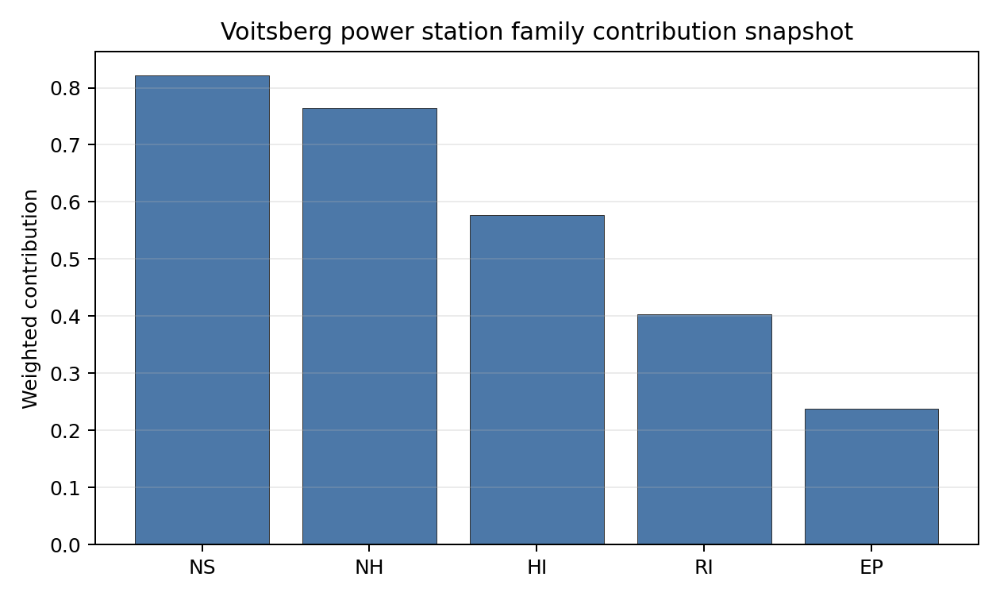

# Voitsberg power station Site Profile

Voitsberg power station is a coal/thermal site in Austria that has been tested against the NuScale VOYGR-6 reference deployment envelope. This profile reads the screening evidence at a level that supports a decision to progress toward Stage 3 characterization. It is not a site-suitability determination, vendor recommendation, or licensing finding.

## Site Snapshot

| Field | Value |
| --- | --- |
| Site name | Voitsberg power station |
| Coordinates | 47.0475, 15.1603 |
| Subnational unit | Styria |
| Installed thermal capacity (source data) | 330 MW |
| Composite score (baseline weights) | 5.894 (4.377-6.315 MC band) |
| National stability band | D (top-10% hit rate 6%) |
| National rank | 2 |

_See the country status map in_ [Austria Country Profile](../AT_country_prototype.md#country-status-map).

## Ownership and Coal-to-Nuclear Context

- **Wiener Stadtwerke GmbH** (nan% share), headquartered in Austria; immediate operator Verbund AG. Path: Wiener Stadtwerke GmbH -> Verbund AG [unknown %] -> Voitsberg power station Unit 3 [100.0%]
- **Government of Austria** (51.00% share), headquartered in Austria; immediate operator Verbund AG. Path: Government of Austria  -> Verbund AG [51.0%] -> Voitsberg power station Unit 3 [100.0%]
- **EVN AG** (nan% share), headquartered in Austria; immediate operator Verbund AG. Path: EVN AG -> Verbund AG [unknown %] -> Voitsberg power station Unit 3 [100.0%]
- **Verbund AG** (100.00% share), headquartered in Austria; immediate operator Verbund AG. Path: Verbund AG -> Voitsberg power station Unit 3 [100.0%]
- **TIWAG-Tiroler Wasserkraft AG** (4.00% share), headquartered in Austria; immediate operator Verbund AG. Path: TIWAG-Tiroler Wasserkraft AG -> Verbund AG [4.0%] -> Voitsberg power station Unit 3 [100.0%]
- **small shareholder(s)** (19.00% share); immediate operator Verbund AG. Path: small shareholder(s)  -> Verbund AG [19.0%] -> Voitsberg power station Unit 3 [100.0%]

Generating units on record: 1 retired.
Earliest unit commissioning: 1983; most recent: 1983.
Retirements span 2006 to 2006, leaving brownfield grid, water, transport, and workforce assets that materially shorten Stage 3 site preparation.

## Natural Hazards (NH)

- **Seismic: Ground Motion (NH-01)** - score 7.5/10 (MC 7.0-8.0), weight 0.0396, data quality high. Evidence: PGA at 475-year return period 0.083 g; PGA at 2,475-year return period 0.16 g; Vs30 reference (m/s): 760.0.
- **Seismic: Surface Rupture (NH-02)** - score 9.5/10 (MC 9.0-10.0), weight n/a, data quality screening grade. Evidence: nearest mapped capable fault 31.5 km; fault slip rate 0.382 mm/yr; fault name: ATCF00D.
- **Geotechnical: Liquefaction (NH-03)** - score 5.0/10 (MC 5.0-5.0), weight n/a, data quality medium. Evidence: liquefaction susceptibility: very_low; dominant soil type: loam.
- **Geotechnical: Slope Stability (NH-04)** - score 7.5/10 (MC 7.0-8.0), weight n/a, data quality screening grade. Evidence: site slope 9.03 deg; max slope in 1 km box 45.0 deg; slope stability class: moderate.
- **Geotechnical: Subsidence (NH-05)** - score 5.5/10 (MC 5.0-6.0), weight 0.0308, data quality medium. Evidence: karst present: no; karst severity: moderate; formation type: carbonate (Continuous carbonate rocks).
- **Geotechnical: Foundation (NH-06)** - score 3.5/10 (MC 3.0-4.0), weight 0.0220, data quality medium. Evidence: bearing capacity 73.3 kPa; depth to bedrock 24.3 m.
- **Volcanism (NH-07)** - score 5.0/10 (MC 5.0-5.0), weight n/a, data quality high. Evidence: volcanic hazard class: negligible.
- **Coastal Flooding (NH-08)** - score 5.0/10 (MC 5.0-5.0), weight 0.0264, data quality low. Evidence: values not in measurement tables.
- **River Flooding (NH-09)** - score 5.0/10 (MC 5.0-5.0), weight 0.0352, data quality medium. Evidence: flood zone class: negligible.
- **Extreme Winds (NH-10)** - score 9.5/10 (MC 9.0-10.0), weight n/a, data quality medium. Evidence: design wind speed 6.83 m/s.
- **Extreme Precipitation (NH-11)** - score 4.0/10 (MC 4.0-4.0), weight 0.0132, data quality medium. Evidence: extreme daily precipitation 0.24 mm; mean annual precipitation 31.8 mm/yr.
- **Extreme Temperatures (NH-12)** - score 9.5/10 (MC 9.0-10.0), weight 0.0176, data quality medium. Evidence: extreme high temperature 21.2 deg C; extreme low temperature -5.52 deg C.
- **Forest/Wildfire (NH-13)** - score 5.0/10 (MC 5.0-5.0), weight 0.0132, data quality n/a. Evidence: values not in measurement tables.
- **Combined Hazards (NH-14)** - score 5.0/10 (MC 5.0-5.0), weight 0.0132, data quality n/a. Evidence: values not in measurement tables.

### Interpretation - Natural Hazards (NH)

<!-- specialist key=family_natural_hazards scope=site site_id=99d712ac-7993-4186-8a0e-2e88bae7e90f bundle=AT_voitsberg_power_station_site_bundle.json status=pending -->
> _Specialist interpretation pending: Interpretation - Natural Hazards (NH). Cursor agent fills via `python -m scripts.run_specialist_pass show --country <CC> --site-name <name> --key family_natural_hazards` then `... patch --country <CC> --site-name <name> --key family_natural_hazards --text-file <draft.md>`._
<!-- /specialist key=family_natural_hazards -->

## Human-Induced and Security-Relevant Hazards (HI)

- **Aircraft Crash (HI-01)** - score 5.5/10 (MC 5.0-6.0), weight 0.0308, data quality high. Evidence: nearest airport 22.1 km; nearest flight path 11.0 km; airports within search radius 3; airport name: Graz Airport; airport type: large_airport.
- **Industrial Explosions (HI-02)** - score 5.0/10 (MC 5.0-5.0), weight 0.0308, data quality high. Evidence: nearest industrial site 19.6 km.
- **Toxic/Gas Releases (HI-03)** - score 7.5/10 (MC 7.0-8.0), weight 0.0308, data quality high. Evidence: nearest toxic source 19.6 km.
- **External Fires (HI-04)** - score 5.0/10 (MC 5.0-5.0), weight 0.0264, data quality high. Evidence: values not in measurement tables.
- **Transport Hazards (HI-05)** - score 5.0/10 (MC 5.0-5.0), weight 0.0264, data quality n/a. Evidence: values not in measurement tables.
- **Military Installations (HI-06)** - score 3.5/10 (MC 3.0-4.0), weight 0.0264, data quality not_found. Evidence: nearest military installation 16.2 km; military installations within radius 0; installation name: Feliferhof.
- **Electromagnetic Interference (HI-07)** - score 9.5/10 (MC 9.0-10.0), weight 0.0088, data quality not_found. Evidence: nearest high-power transmitter 0.72 km; transmitters within radius 0; transmitter type: communication.
- **Other Nuclear Installations (HI-08)** - score 5.0/10 (MC 5.0-5.0), weight 0.0132, data quality n/a. Evidence: values not in measurement tables.

### Interpretation - Human-Induced and Security-Relevant Hazards (HI)

<!-- specialist key=family_human_hazards scope=site site_id=99d712ac-7993-4186-8a0e-2e88bae7e90f bundle=AT_voitsberg_power_station_site_bundle.json status=pending -->
> _Specialist interpretation pending: Interpretation - Human-Induced and Security-Relevant Hazards (HI). Cursor agent fills via `python -m scripts.run_specialist_pass show --country <CC> --site-name <name> --key family_human_hazards` then `... patch --country <CC> --site-name <name> --key family_human_hazards --text-file <draft.md>`._
<!-- /specialist key=family_human_hazards -->

## Radiological Impact and Emergency Planning (RI / EP)

- **Emergency Planning Feasibility (EP-01)** - score 5.5/10 (MC 5.0-6.0), weight n/a, data quality high. Evidence: EP feasibility composite 55.4 /100; road sub-score 65.4 /100; special-population sub-score 0 /100; geography sub-score 95.0 /100; population sub-score 80.0 /100; evacuation feasible: yes.
- **Evacuation Routes (EP-02)** - score 5.5/10 (MC 5.0-6.0), weight 0.0264, data quality medium. Evidence: road density in EPZ 0.723 km/km2; road length in EPZ 1,420 km; motorway access: yes.
- **Physical Geography Constraints (EP-03)** - score 5.0/10 (MC 5.0-5.0), weight 0.0220, data quality medium. Evidence: waterways crossing EPZ 0; major river barrier: no.
- **Special Populations (EP-04)** - score 3.5/10 (MC 3.0-4.0), weight 0.0264, data quality medium. Evidence: hospitals in EPZ 38; prisons in EPZ 4; care homes in EPZ 4.
- **Concurrent Hazard Impact (EP-05)** - score 5.0/10 (MC 5.0-5.0), weight 0.0176, data quality n/a. Evidence: values not in measurement tables.
- **Atmospheric Dispersion (RI-01)** - score 5.0/10 (MC 5.0-5.0), weight 0.0264, data quality medium. Evidence: annual mean wind speed 0.64 m/s; atmospheric mixing height 395.1 m; prevailing wind direction: W.
- **Surface Water Dispersion (RI-02)** - score 1.5/10 (MC 1.0-2.0), weight 0.0220, data quality n/a. Evidence: values not in measurement tables.
- **Groundwater Dispersion (RI-03)** - score 5.0/10 (MC 5.0-5.0), weight 0.0220, data quality medium. Evidence: aquifer type: alluvial.
- **Population Density at EPZ Radii (RI-04)** - score 5.5/10 (MC 5.0-6.0), weight 0.0352, data quality screening grade. Evidence: population density within 5 km 233.2 /km2; population density within 16 km 103.2 /km2; population density within 25 km 230.0 /km2; population density within 80 km 89.3 /km2; population within 25 km 451,536 people.
- **Distance to Population Centres (RI-05)** - score 5.0/10 (MC 5.0-5.0), weight 0.0441, data quality screening grade. Evidence: nearest city above 50k people 21.4 km; nearest city population 269,997 people; city name: Graz.
- **Population Projections (RI-06)** - score 3.5/10 (MC 3.0-4.0), weight 0.0220, data quality screening grade. Evidence: annual population growth rate 0.503 %/yr; projected population at 25 km in 60 yr 471,844 people.

### Interpretation - Radiological Impact and Emergency Planning (RI / EP)

<!-- specialist key=family_radiological_emergency scope=site site_id=99d712ac-7993-4186-8a0e-2e88bae7e90f bundle=AT_voitsberg_power_station_site_bundle.json status=pending -->
> _Specialist interpretation pending: Interpretation - Radiological Impact and Emergency Planning (RI / EP). Cursor agent fills via `python -m scripts.run_specialist_pass show --country <CC> --site-name <name> --key family_radiological_emergency` then `... patch --country <CC> --site-name <name> --key family_radiological_emergency --text-file <draft.md>`._
<!-- /specialist key=family_radiological_emergency -->

## Non-Safety and Implementation Considerations (NS)

- **Grid Capacity Basic Filter (BF-01)** - score 3.5/10 (MC 3.0-4.0), weight 0.0352, data quality n/a. Evidence: values not in measurement tables.
- **Land Area Basic Filter (BF-02)** - score 7.5/10 (MC 7.0-8.0), weight 0.0220, data quality n/a. Evidence: values not in measurement tables.
- **Cooling Water Availability (NS-01)** - score 6.0/10 (MC 6.0-6.0), weight n/a, data quality screening grade. Evidence: distance to cooling source 3.73 km; cooling source flow 7.51 m3/s; cooling source type: river; cooling source name: Tregistbach; water stress label: Low.
- **Grid Connection (NS-02)** - score 5.5/10 (MC 5.0-6.0), weight 0.0352, data quality medium. Evidence: nearest substation 2.1 km; nearest high-voltage line 1.74 km; highest nearby line voltage 110.0 kV; grid export capacity 330.0 MW; substations within radius 1,416; HV lines within radius 618.
- **Transport Access (NS-03)** - score 9.0/10 (MC 8.0-9.0), weight 0.0352, data quality high. Evidence: nearest highway 0.89 km; nearest rail line 0.85 km; heavy-haul capable: yes.
- **Site Topography (NS-04)** - score 5.5/10 (MC 5.0-6.0), weight 0.0264, data quality high. Evidence: favourable land cover 51.2 %; moderate land cover 10.2 %; unfavourable land cover 29.0 %; favourable area 22.1 ha; dominant land class: 112.
- **Site Footprint Adequacy (NS-05)** - score 7.5/10 (MC 7.0-8.0), weight 0.0220, data quality medium. Evidence: buildable area 41.4 ha; largest contiguous patch 41.4 ha; buildable patch count 12.
- **Existing Infrastructure (NS-06)** - score 5.0/10 (MC 5.0-5.0), weight 0.0220, data quality n/a. Evidence: values not in measurement tables.
- **Environmental Impact (non-rad) (NS-07)** - score 5.0/10 (MC 5.0-5.0), weight 0.0220, data quality n/a. Evidence: values not in measurement tables.
- **Ecological Sensitivity (NS-08)** - score 7.5/10 (MC 7.0-8.0), weight n/a, data quality high. Evidence: natural land cover 29.0 %; distance to nearest Natura 2000 site 8.901 km; distance to nearest protected area 2.933 km; Natura 2000 overlap: no; Natura 2000 sensitivity class: low; protected-area overlap: no; protected-area sensitivity class: moderate; nearest Natura 2000 site: Oberlauf des Schirningbaches mit Zubringerbächen sowie Unterlauf des Enzenbaches; Natura 2000 sites within 5 km: 0; nearest protected-area designation: Landscape Protection Area.
- **Socioeconomic Impact (NS-09)** - score 5.0/10 (MC 5.0-5.0), weight 0.0220, data quality n/a. Evidence: values not in measurement tables.
- **Workforce Availability (NS-10)** - score 5.0/10 (MC 5.0-5.0), weight 0.0176, data quality n/a. Evidence: values not in measurement tables.
- **Coal-to-Nuclear Synergies (NS-11)** - score 5.0/10 (MC 5.0-5.0), weight 0.0264, data quality n/a. Evidence: values not in measurement tables.
- **Regulatory/Political Environment (NS-12)** - score 5.0/10 (MC 5.0-5.0), weight 0.0264, data quality n/a. Evidence: values not in measurement tables.
- **Construction Logistics (NS-13)** - score 5.0/10 (MC 5.0-5.0), weight 0.0176, data quality n/a. Evidence: values not in measurement tables.

### Interpretation - Non-Safety and Implementation Considerations (NS)

<!-- specialist key=family_infrastructure scope=site site_id=99d712ac-7993-4186-8a0e-2e88bae7e90f bundle=AT_voitsberg_power_station_site_bundle.json status=pending -->
> _Specialist interpretation pending: Interpretation - Non-Safety and Implementation Considerations (NS). Cursor agent fills via `python -m scripts.run_specialist_pass show --country <CC> --site-name <name> --key family_infrastructure` then `... patch --country <CC> --site-name <name> --key family_infrastructure --text-file <draft.md>`._
<!-- /specialist key=family_infrastructure -->

## Composite Score and Stability

Baseline composite score is 5.894, bracketed by Monte Carlo at 4.377-6.315. National stability band is `D` with a top-10% hit rate of 6% across 16 scored Monte Carlo scenarios.

<!-- specialist key=stability scope=site site_id=99d712ac-7993-4186-8a0e-2e88bae7e90f bundle=AT_voitsberg_power_station_site_bundle.json status=pending -->
> _Specialist interpretation pending: Composite stability and sensitivity (plain-English read). Cursor agent fills via `python -m scripts.run_specialist_pass show --country <CC> --site-name <name> --key stability` then `... patch --country <CC> --site-name <name> --key stability --text-file <draft.md>`._
<!-- /specialist key=stability -->

## Residual Risk Register

<!-- specialist key=residual_risk scope=site site_id=99d712ac-7993-4186-8a0e-2e88bae7e90f bundle=AT_voitsberg_power_station_site_bundle.json status=pending -->
> _Specialist interpretation pending: Residual risk register (specialist synthesis). Cursor agent fills via `python -m scripts.run_specialist_pass show --country <CC> --site-name <name> --key residual_risk` then `... patch --country <CC> --site-name <name> --key residual_risk --text-file <draft.md>`._
<!-- /specialist key=residual_risk -->

## Stage 3 Follow-Up Checklist

- [ ] Resolve **Grid Connection (NS-02)** avoidance flag - measured {"grid_export_capacity_mw": 330.0} vs threshold Project A13: transmission >= reference SMR net MWe within feasible distance..
- [ ] Re-measure **Surface Water Dispersion (RI-02)** - native score 1.5/10 with confidence insufficient.
- [ ] Re-measure **Grid Capacity Basic Filter (BF-01)** - native score 3.5/10 with confidence insufficient.
- [ ] Re-measure **Special Populations (EP-04)** - native score 3.5/10 with confidence medium.
- [ ] Re-measure **Military Installations (HI-06)** - native score 3.5/10 with confidence medium.
- [ ] Re-measure **Geotechnical: Foundation (NH-06)** - native score 3.5/10 with confidence medium.
- [ ] Improve data quality for **Geotechnical: Subsidence & Collapse (NH-05b)** - current flag `low`.
- [ ] Improve data quality for **Coastal Flooding (NH-08)** - current flag `low`.
- [ ] Improve data quality for **Military Installations (HI-06)** - current flag `not_found`.
- [ ] Improve data quality for **Electromagnetic Interference (HI-07)** - current flag `not_found`.

## Evidence Limitations

- Geotechnical: Subsidence & Collapse (NH-05b) - quality `low`.
- Coastal Flooding (NH-08) - quality `low`.
- Military Installations (HI-06) - quality `not_found`.
- Electromagnetic Interference (HI-07) - quality `not_found`.
