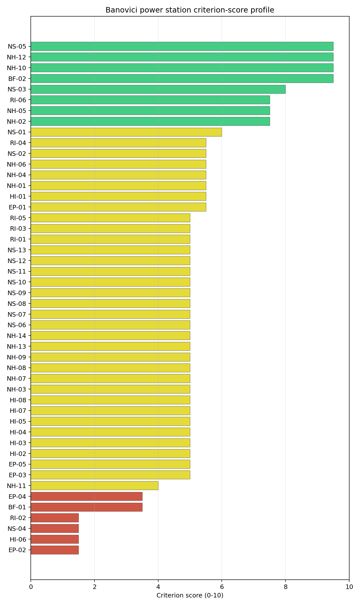
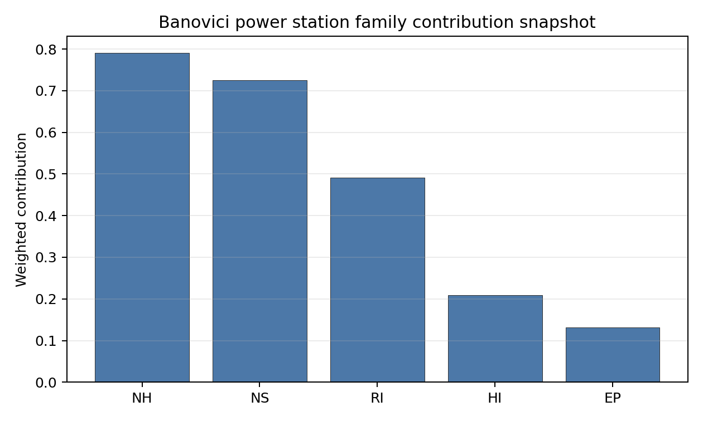

# Banovici power station Site Profile

Banovici power station is a coal/thermal site in Bosnia and Herzegovina that has been tested against the NuScale VOYGR-6 reference deployment envelope. This profile reads the screening evidence at a level that supports a decision to progress toward Stage 3 characterization. It is not a site-suitability determination, vendor recommendation, or licensing finding.

## Site Snapshot

| Field | Value |
| --- | --- |
| Site name | Banovici power station |
| Coordinates | 44.4000, 18.5333 |
| Subnational unit | FBIH |
| Installed thermal capacity (source data) | 350 MW |
| Composite score (baseline weights) | 5.384 (4.040-5.879 MC band) |
| National stability band | D (top-10% hit rate 0%) |
| National rank | 2 |

_See the country status map in_ [Bosnia and Herzegovina Country Profile](../BA_country_prototype.md#country-status-map).

## Ownership and Coal-to-Nuclear Context

- **ZIF HERBOS FOND d.d. Tuzla** (7.07% share), headquartered in Bosnia and Herzegovina; immediate operator RMU Banovici dd. Path: ZIF HERBOS FOND d.d. Tuzla  -> RMU Banovici dd [7.07%] -> Banovici power station Unit 1 [100.0%]
- **RMU Banovici dd** (100.00% share), headquartered in Bosnia and Herzegovina; immediate operator RMU Banovici dd. Path: RMU Banovici dd -> Banovici power station Unit 1 [100.0%]
- **Government of the Federation of Bosnia and Herzegovina** (69.53% share), headquartered in Bosnia and Herzegovina; immediate operator RMU Banovici dd. Path: Government of the Federation of Bosnia and Herzegovina  -> RMU Banovici dd [69.53%] -> Banovici power station Unit 1 [100.0%]
- **small shareholder(s)** (23.40% share); immediate operator RMU Banovici dd. Path: small shareholder(s)  -> RMU Banovici dd [23.4%] -> Banovici power station Unit 1 [100.0%]

Generating units on record: 1 cancelled.

## Natural Hazards (NH)

- **Seismic: Ground Motion (NH-01)** - score 5.5/10 (MC 5.0-6.0), weight 0.0396, data quality high. Evidence: PGA at 475-year return period 0.132 g; PGA at 2,475-year return period 0.282 g; Vs30 reference (m/s): 760.0.
- **Seismic: Surface Rupture (NH-02)** - score 7.5/10 (MC 7.0-8.0), weight n/a, data quality screening grade. Evidence: nearest mapped capable fault 13.3 km; fault slip rate 0.1 mm/yr; fault name: BACF007.
- **Geotechnical: Liquefaction (NH-03)** - score 5.0/10 (MC 5.0-5.0), weight n/a, data quality medium. Evidence: liquefaction susceptibility: very_low; dominant soil type: clay_loam.
- **Geotechnical: Slope Stability (NH-04)** - score 5.5/10 (MC 5.0-6.0), weight n/a, data quality screening grade. Evidence: site slope 18.1 deg; max slope in 1 km box 87.2 deg; slope stability class: very_steep.
- **Geotechnical: Subsidence (NH-05)** - score 7.5/10 (MC 7.0-8.0), weight 0.0308, data quality medium. Evidence: karst present: no; karst severity: none.
- **Geotechnical: Foundation (NH-06)** - score 5.5/10 (MC 5.0-6.0), weight 0.0220, data quality medium. Evidence: bearing capacity 82.0 kPa; depth to bedrock 14.8 m.
- **Volcanism (NH-07)** - score 5.0/10 (MC 5.0-5.0), weight n/a, data quality high. Evidence: volcanic hazard class: negligible.
- **Coastal Flooding (NH-08)** - score 5.0/10 (MC 5.0-5.0), weight 0.0264, data quality low. Evidence: values not in measurement tables.
- **River Flooding (NH-09)** - score 5.0/10 (MC 5.0-5.0), weight 0.0352, data quality medium. Evidence: flood zone class: negligible.
- **Extreme Winds (NH-10)** - score 9.5/10 (MC 9.0-10.0), weight n/a, data quality medium. Evidence: design wind speed 6.92 m/s.
- **Extreme Precipitation (NH-11)** - score 4.0/10 (MC 4.0-4.0), weight 0.0132, data quality medium. Evidence: extreme daily precipitation 0.32 mm; mean annual precipitation 34.3 mm/yr.
- **Extreme Temperatures (NH-12)** - score 9.5/10 (MC 9.0-10.0), weight 0.0176, data quality medium. Evidence: extreme high temperature 23.3 deg C; extreme low temperature -5.97 deg C.
- **Forest/Wildfire (NH-13)** - score 5.0/10 (MC 5.0-5.0), weight 0.0132, data quality n/a. Evidence: values not in measurement tables.
- **Combined Hazards (NH-14)** - score 5.0/10 (MC 5.0-5.0), weight 0.0132, data quality n/a. Evidence: values not in measurement tables.

### Interpretation - Natural Hazards (NH)

<!-- specialist key=family_natural_hazards scope=site site_id=82011c29-a3d3-4a81-a27b-019d2649a251 bundle=BA_banovici_power_station_site_bundle.json status=filled by=cursor-agent filled_at=2026-05-03T15:08:41Z -->
Natural hazards at Banovici sit in the moderate-seismic, low-meteorological envelope of the central Bosnian uplands, and no exclusionary natural-hazard check is currently failing. PGA at the 475-yr return period is 0.132 g and at the 2,475-yr return period is 0.282 g, well inside the NuScale VOYGR-6 project envelope of 0.5 g at 2,475-yr; the nearest mapped capable fault (BACF007) is at 13.3 km with a slip rate of 0.1 mm/yr, comfortably outside the 5 km screening exclusion radius, so NH-02 settles at 7.5/10. Geotechnical conditions are middle-band but contain a binding NH-04 concern: clay-loam soils with a screening-proxy bearing capacity of 82 kPa, depth to bedrock 14.8 m (the shallowest of the first-batch BA sites), mean site slope **18.1°** and a `very_steep` slope-stability class with a 1 km box maximum of 87.2°. Even discounting the digital surface model canopy artefact at 87.2°, the 18.1° mean slope is genuinely steep and converts NH-04 (5.5/10) into a binding terrain question for the Stage 3 cut-and-fill envelope. **NH-06 Foundation** at 5.5/10 sits on the 82 kPa bearing capacity over only 14.8 m of overburden; the shallow bedrock partly offsets the bearing-capacity finding because rock-anchored foundations become more practicable, but a Stage 3 measured bearing capacity is still required. Karst is absent (NH-05 7.5/10) and liquefaction susceptibility is `very_low`. Extreme meteorology is calm: a screening 50-yr gust of 6.92 m/s and an extreme temperature range of -6.0 °C to 23.3 °C are well inside the project envelope. NH-11 reads 4.0/10 on a coarse-grid mismatch (34.3 mm/yr mean annual is implausible). NH-07 (Volcanism), NH-08 (Coastal Flooding) and NH-09 (River Flooding) carry `inconclusive` avoidance verdicts. The Stage 3 priority order is therefore: validate the 18.1° mean slope against a bare-earth digital elevation model and produce a measured cut-and-fill envelope so NH-04 settles on geomorphology rather than the screening proxy, run a CPT campaign so NH-06 settles on a measured bearing capacity to take advantage of the shallow bedrock, and replace the screening precipitation reading with national meteorological station data.
<!-- /specialist key=family_natural_hazards -->

## Human-Induced and Security-Relevant Hazards (HI)

- **Aircraft Crash (HI-01)** - score 5.5/10 (MC 5.0-6.0), weight 0.0308, data quality high. Evidence: nearest airport 12.8 km; nearest flight path 6.4 km; airports within search radius 3; airport name: Ciljuge Sport Airfield; airport type: small_airport.
- **Industrial Explosions (HI-02)** - score 5.0/10 (MC 5.0-5.0), weight 0.0308, data quality screening grade. Evidence: values not in measurement tables.
- **Toxic/Gas Releases (HI-03)** - score 5.0/10 (MC 5.0-5.0), weight 0.0308, data quality screening grade. Evidence: values not in measurement tables.
- **External Fires (HI-04)** - score 5.0/10 (MC 5.0-5.0), weight 0.0264, data quality screening grade. Evidence: values not in measurement tables.
- **Transport Hazards (HI-05)** - score 5.0/10 (MC 5.0-5.0), weight 0.0264, data quality n/a. Evidence: values not in measurement tables.
- **Military Installations (HI-06)** - score 1.5/10 (MC 1.0-2.0), weight 0.0264, data quality medium. Evidence: nearest military installation 10.9 km; military installations within radius 5.
- **Electromagnetic Interference (HI-07)** - score 5.0/10 (MC 5.0-5.0), weight 0.0088, data quality medium. Evidence: nearest high-power transmitter 9.65 km; transmitters within radius 11; transmitter type: mast.
- **Other Nuclear Installations (HI-08)** - score 5.0/10 (MC 5.0-5.0), weight 0.0132, data quality n/a. Evidence: values not in measurement tables.

### Interpretation - Human-Induced and Security-Relevant Hazards (HI)

<!-- specialist key=family_human_hazards scope=site site_id=82011c29-a3d3-4a81-a27b-019d2649a251 bundle=BA_banovici_power_station_site_bundle.json status=filled by=cursor-agent filled_at=2026-05-03T15:08:41Z -->
Human-induced and security-relevant hazards at Banovici are dominated by a binding HI-06 finding driven by the central-Bosnian military estate around Tuzla. The nearest civilian airport is the Ciljuge Sport Airfield (`small_airport`) at 12.8 km with a flight-path distance of 6.4 km and three airports inside the 30 km screening radius, which puts HI-01 inside the project pass-mark band and yields a 5.5/10 ranking score; the criterion is held at `inconclusive` on the avoidance phase only because the nearest military airfield distance is null in the bundle. The dominant criterion in the family is **Military Installations (HI-06)** at **1.5/10**: the nearest military feature is at **10.9 km** with **5 features inside the 25 km screening radius**, the highest classified military count of the first-batch BA sites and the consequence of the Tuzla / Federation-of-BiH military estate. The 10.9 km nearest-feature distance is just outside the 8 km project A6 ammunition-storage avoidance trigger, so HI-06 settles at 1.5/10 on distance and count rather than at the floor, and the criterion is the principal governance question for this site. **HI-02 Industrial Explosions, HI-03 Toxic / Gas Releases, HI-04 External Fires** all sit at the pass-mark default of 5.0/10 because the screening pollutant-release inventory found no positive feature to score against in the central Bosnian uplands. HI-07 Electromagnetic Interference reads 5.0/10 with the nearest mast at 9.65 km and 11 transmitters within radius; the count is informational, no transmitter is inside a stand-off radius that would prompt the EMI avoidance flag. HI-08 (Other Nuclear Installations) is null. The Stage 3 priority order is therefore: open the BiH Ministry of Defence engagement on the five HI-06 features so the criterion lifts off the 1.5/10 read (the highest-leverage piece of unlock work for this site), and run the BiH national Seveso and hazmat-corridor cadastres so HI-02 to HI-05 convert from `screening grade` to defensible measured distances.
<!-- /specialist key=family_human_hazards -->

## Radiological Impact and Emergency Planning (RI / EP)

- **Emergency Planning Feasibility (EP-01)** - score 5.5/10 (MC 5.0-6.0), weight n/a, data quality high. Evidence: EP feasibility composite 44.0 /100; road sub-score 25.0 /100; special-population sub-score 90.0 /100; geography sub-score 10.0 /100; population sub-score 80.0 /100; evacuation feasible: yes.
- **Evacuation Routes (EP-02)** - score 1.5/10 (MC 1.0-2.0), weight 0.0264, data quality medium. Evidence: road density in EPZ 0.25 km/km2; road length in EPZ 491.2 km; motorway access: no.
- **Physical Geography Constraints (EP-03)** - score 5.0/10 (MC 5.0-5.0), weight 0.0220, data quality medium. Evidence: waterways crossing EPZ 119; major river barrier: yes.
- **Special Populations (EP-04)** - score 3.5/10 (MC 3.0-4.0), weight 0.0264, data quality medium. Evidence: hospitals in EPZ 26; prisons in EPZ 1; care homes in EPZ 1.
- **Concurrent Hazard Impact (EP-05)** - score 5.0/10 (MC 5.0-5.0), weight 0.0176, data quality n/a. Evidence: values not in measurement tables.
- **Atmospheric Dispersion (RI-01)** - score 5.0/10 (MC 5.0-5.0), weight 0.0264, data quality medium. Evidence: annual mean wind speed 0.52 m/s; atmospheric mixing height 408.2 m; prevailing wind direction: S.
- **Surface Water Dispersion (RI-02)** - score 1.5/10 (MC 1.0-2.0), weight 0.0220, data quality n/a. Evidence: values not in measurement tables.
- **Groundwater Dispersion (RI-03)** - score 5.0/10 (MC 5.0-5.0), weight 0.0220, data quality medium. Evidence: aquifer type: sedimentary sands.
- **Population Density at EPZ Radii (RI-04)** - score 5.5/10 (MC 5.0-6.0), weight 0.0352, data quality screening grade. Evidence: population density within 5 km 208.0 /km2; population density within 16 km 145.8 /km2; population density within 25 km 132.6 /km2; population density within 80 km 102.5 /km2; population within 25 km 260,254 people.
- **Distance to Population Centres (RI-05)** - score 5.0/10 (MC 5.0-5.0), weight 0.0441, data quality screening grade. Evidence: values not in measurement tables.
- **Population Projections (RI-06)** - score 7.5/10 (MC 7.0-8.0), weight 0.0220, data quality screening grade. Evidence: annual population growth rate -0.453 %/yr; projected population at 25 km in 60 yr 142,823 people.

### Interpretation - Radiological Impact and Emergency Planning (RI / EP)

<!-- specialist key=family_radiological_emergency scope=site site_id=82011c29-a3d3-4a81-a27b-019d2649a251 bundle=BA_banovici_power_station_site_bundle.json status=filled by=cursor-agent filled_at=2026-05-03T15:08:41Z -->
Radiological impact and emergency planning at Banovici read as a periurban envelope with elevated 5 km population density and three binding findings on evacuation routes, special populations and surface-water dispersion. Population density at the screening epoch is **208 p/km² at 5 km** (reflective of the proximity to the town of Banovici), 146 p/km² at 16 km, 133 p/km² at 25 km and 102 p/km² at 80 km, with a 25 km total of 260,254 people; the nearest city above 50,000 people is null in the bundle. Trajectory is favourable for a 60-year siting horizon: a -0.453 %/yr regional growth rate yields a 25 km projection of 142,823 people in 60 years (down 45 % from 2020), which lifts RI-04 to 5.5/10 and RI-06 to 7.5/10. The atmospheric envelope is the most stable of the first-batch BA sites: the screening reanalysis gives a mean wind speed of only 0.52 m/s, a prevailing direction of S, and a mean planetary boundary-layer height of 408 m, which holds RI-01 at 5.0/10 with a low-wind regime that concentrates accidental release within a narrow southern plume. The first binding criterion is **EP-02 Evacuation Routes** at 1.5/10: the road density inside the EPZ is **0.25 km/km²** over 491 km of road and there is no motorway access, which converts the long-distance evacuation case into a binding logistical question. **EP-01 Emergency Planning Feasibility** at 5.5/10 reads 44.0/100 against `road_score=25.0, special_pop=90, geography=10, population=80`, with both the road sub-score and the geography sub-score driving the EP-01 finding. **EP-04 Special Populations** at 3.5/10 carries **26 hospitals, 1 prison and 1 care home** in the EPZ, dominated by the Tuzla-area hospital cluster. **RI-02 Surface Water Dispersion** at 1.5/10 holds at the proxy floor pending a measured Litva dilution flow. The Stage 3 priority order is therefore: model the EPZ time-to-clear under summer and winter loadings using BiH national emergency-planning traffic data and the special-population profile (26 hospitals dominated by the Tuzla cluster), and source the Litva dilution flow at the cooling-source discharge point so RI-02 lifts off the proxy floor.
<!-- /specialist key=family_radiological_emergency -->

## Non-Safety and Implementation Considerations (NS)

- **Grid Capacity Basic Filter (BF-01)** - score 3.5/10 (MC 3.0-4.0), weight 0.0352, data quality n/a. Evidence: values not in measurement tables.
- **Land Area Basic Filter (BF-02)** - score 9.5/10 (MC 9.0-10.0), weight 0.0220, data quality n/a. Evidence: values not in measurement tables.
- **Cooling Water Availability (NS-01)** - score 6.0/10 (MC 6.0-6.0), weight n/a, data quality screening grade. Evidence: distance to cooling source 3.24 km; cooling source flow 1.77 m3/s; cooling source type: small_river; cooling source name: Litva; water stress label: Low.
- **Grid Connection (NS-02)** - score 5.5/10 (MC 5.0-6.0), weight 0.0352, data quality medium. Evidence: nearest substation 6.69 km; nearest high-voltage line 12.7 km; highest nearby line voltage 220.0 kV; grid export capacity 350.0 MW; substations within radius 39; HV lines within radius 44.
- **Transport Access (NS-03)** - score 8.0/10 (MC 6.0-9.0), weight 0.0352, data quality low. Evidence: nearest highway 0.42 km; nearest rail line 2.19 km; heavy-haul capable: yes.
- **Site Topography (NS-04)** - score 1.5/10 (MC 1.0-2.0), weight 0.0264, data quality medium. Evidence: favourable land cover 10.7 %; moderate land cover 20.1 %; unfavourable land cover 69.2 %; favourable area 6.16 ha; dominant land class: 311.
- **Site Footprint Adequacy (NS-05)** - score 9.5/10 (MC 9.0-10.0), weight 0.0220, data quality screening grade. Evidence: buildable area 56.0 ha; largest contiguous patch 155.4 ha; buildable patch count 22.
- **Existing Infrastructure (NS-06)** - score 5.0/10 (MC 5.0-5.0), weight 0.0220, data quality n/a. Evidence: values not in measurement tables.
- **Environmental Impact (non-rad) (NS-07)** - score 5.0/10 (MC 5.0-5.0), weight 0.0220, data quality n/a. Evidence: values not in measurement tables.
- **Ecological Sensitivity (NS-08)** - score 5.0/10 (MC 5.0-5.0), weight n/a, data quality insufficient. Evidence: natural land cover 69.2 %; distance to nearest protected area 2.951 km; Natura 2000 sensitivity class: unknown; protected-area overlap: no; protected-area sensitivity class: low; Natura 2000 sites within 5 km: 0; nearest protected-area designation: Protected Landscape - Terrestial landscape - marine landscape (FBIH law).
- **Socioeconomic Impact (NS-09)** - score 5.0/10 (MC 5.0-5.0), weight 0.0220, data quality n/a. Evidence: values not in measurement tables.
- **Workforce Availability (NS-10)** - score 5.0/10 (MC 5.0-5.0), weight 0.0176, data quality n/a. Evidence: values not in measurement tables.
- **Coal-to-Nuclear Synergies (NS-11)** - score 5.0/10 (MC 5.0-5.0), weight 0.0264, data quality n/a. Evidence: values not in measurement tables.
- **Regulatory/Political Environment (NS-12)** - score 5.0/10 (MC 5.0-5.0), weight 0.0264, data quality n/a. Evidence: values not in measurement tables.
- **Construction Logistics (NS-13)** - score 5.0/10 (MC 5.0-5.0), weight 0.0176, data quality n/a. Evidence: values not in measurement tables.

### Interpretation - Non-Safety and Implementation Considerations (NS)

<!-- specialist key=family_infrastructure scope=site site_id=82011c29-a3d3-4a81-a27b-019d2649a251 bundle=BA_banovici_power_station_site_bundle.json status=filled by=cursor-agent filled_at=2026-05-03T15:08:41Z -->
Non-safety and implementation conditions at Banovici are the family that distinguishes this site from Gacko: cooling water is constrained, footprint is favourable, and the grid connection is the single avoidance flag. Cooling water is the binding finding: the nearest cooling source is the Litva at 3.24 km with an annual mean discharge of only **1.77 m³/s** (the lowest cooling-source flow of the first-batch BA sites), with a screening water-stress score in the `Low` band. The 1.77 m³/s flow is materially below what a NuScale VOYGR-6 condenser-return budget can absorb without thermal-loading concerns at low river-flow seasons, and NS-01 holds at 6.0/10 only because the source distance and water-stress label are favourable; a Stage 3 dual-source or augmentation decision against the 1.77 m³/s base flow is required. Site topography is the binding NS-04 finding: the dominant land class shows favourable land cover at only 10.7 % over a 58 ha screening footprint with **6.16 ha of favourable area** (NS-04 1.5/10, the lowest topography reading of the first-batch BA sites and the consequence of the steep central-Bosnian terrain). Despite the topography finding, the 56.0 ha buildable area arranges into a 155.4 ha largest contiguous patch (NS-05 9.5/10), so the footprint envelope is comfortable when ground prep is included. Ecology is `low` sensitivity (NS-08 5.0/10 on `insufficient` data quality, nearest IUCN protected area 2.95 km, no overlap, no Natura 2000 equivalent in BiH). The criterion that drives the family read is the **Grid Connection (NS-02)** avoidance flag at 5.5/10: the nearest substation is at 6.69 km and the nearest HV line at 12.7 km at 220 kV, with 39 substations and 44 HV lines in the broader area, but the 350 MW grid-export capacity is below the 462 MWe NuScale VOYGR-6 (6 × 77 MWe modules) reference output. NS-03 Transport Access reads 8.0/10 on highway 0.42 km, rail 2.19 km and heavy-haul capable. The Stage 3 priority order is therefore: confirm the Litva dual-source or augmentation pathway against the 1.77 m³/s base flow (the binding NS-01 question), confirm the 220 kV corridor uprate pathway with Elektroprenos BiH for NS-02, and validate the cut-and-fill envelope on the steep terrain so NS-04 settles on a measured topography read.
<!-- /specialist key=family_infrastructure -->

## Composite Score and Stability

Baseline composite score is 5.384, bracketed by Monte Carlo at 4.040-5.879. National stability band is `D` with a top-10% hit rate of 0% across 16 scored Monte Carlo scenarios.

<!-- specialist key=stability scope=site site_id=82011c29-a3d3-4a81-a27b-019d2649a251 bundle=BA_banovici_power_station_site_bundle.json status=filled by=cursor-agent filled_at=2026-05-03T15:08:41Z -->
Banovici's baseline composite score is 5.384 with a Monte Carlo bracket of 4.040-5.879, a narrow upside (about 0.5 above the point estimate) and a meaningful downside (about 1.3 below). The downside reflects both the high unscored fraction in the underlying criterion set and the cluster of 1.5/10 floors on EP-02, HI-06, NS-04 and RI-02. The national stability band is `D` with a **0 % top-10 % hit rate** across the 16 Monte Carlo weight perturbations the audit considered, which means Banovici holds its top-10 % national ranking under none of the weight profiles in the sensitivity sweep and the rank is materially weight-dependent; at the regional (CESE) scope the band is `H` with a 0 % top-10 % hit rate, fragile or rank-dependent on the weight choice, the lowest band attainable. Family balance, not a single dominant criterion, drives the composite: the per-family averages read NH 6.04, NS 5.57, HI 4.62 and RI 4.55, with the HI floor pulled down by the 1.5/10 HI-06 reading and the RI floor pulled down by EP-02 and RI-02 at 1.5/10 each. The two strongest contributions are NS-03 Transport Access at 8.0/10 (contributing 0.282 to the composite) and NH-05 Subsidence at 7.5/10 (contributing 0.231). The next characterization effort that would produce the largest narrowing of the composite uncertainty band is therefore the BiH Ministry of Defence engagement on HI-06 combined with measured EP-02 and RI-02 values; resolving those three together would lift both the band letter and the lower bracket and convert Banovici from a fragile band-D rank to a defensible Stage 3 candidate.
<!-- /specialist key=stability -->

## Residual Risk Register

<!-- specialist key=residual_risk scope=site site_id=82011c29-a3d3-4a81-a27b-019d2649a251 bundle=BA_banovici_power_station_site_bundle.json status=filled by=cursor-agent filled_at=2026-05-03T15:08:41Z -->
| Concern | Evidence | Consequence | Stage 3 action | Owner discipline |
| --- | --- | --- | --- | --- |
| Military Installations (HI-06) | Nearest military feature at 10.9 km (just outside the 8 km project A6 trigger); 5 features within 25 km screening radius; HI-06 1.5/10 | Tuzla / Federation-of-BiH military estate converts HI-06 into the principal governance question; potential security-cordon overlap with the EPZ | Engage the BiH Ministry of Defence on the five features by class and confirm any airspace or cordon overlap with the EPZ | security |
| Cooling Water Availability (NS-01) | Nearest cooling source (Litva) at 3.24 km with annual mean discharge of only **1.77 m³/s** (lowest of the first-batch BA sites); water-stress score in `Low` band | The 1.77 m³/s base flow is below what a NuScale VOYGR-6 condenser-return budget can absorb without thermal-loading concerns at low river-flow seasons | Confirm a Stage 3 dual-source or augmentation pathway against the 1.77 m³/s base flow and confirm the condenser-return loading budget | hydrology |
| Site Topography (NS-04) | Favourable land cover only 10.7 % over a 58 ha screening footprint; 6.16 ha of favourable area; mean site slope 18.1°; `very_steep` slope-stability class | Steep central-Bosnian terrain forces a heavier cut-and-fill envelope than at Gacko or Stanari; affects construction capex and schedule | Validate the 18.1° mean slope against a bare-earth digital elevation model and produce a measured cut-and-fill envelope | site engineering |
| Evacuation Routes (EP-02) | Road density in EPZ 0.25 km/km², total road length 491 km, no motorway access; EP-02 score 1.5/10; EP-01 composite 44.0/100 with road sub-score 25/100 | Long-distance evacuation case heavier than at Gacko despite lower terrain elevation; potential overrun of national clearance time | Model the EPZ time-to-clear under summer and winter loadings using BiH national emergency-planning traffic data and the Tuzla-area road network | emergency planning |
| Special Populations (EP-04) | 26 hospitals, 1 prison and 1 care home in EPZ (dominated by Tuzla-area hospital cluster); EP-04 score 3.5/10 | Special-mover load on EPZ time-to-clear envelope is the heaviest of the first-batch BA sites; raises EP-01 special-population workload despite the favourable 90/100 sub-score | Map the special-mover load profile across the 26 EPZ hospitals and integrate into the EP-02 evacuation model | emergency planning |
| Grid Connection (NS-02) | Nearest substation 6.69 km, nearest HV line 12.7 km at 220 kV; 350 MW grid-export capacity; **active avoidance flag** | 350 MW falls below the 462 MWe NuScale VOYGR-6 (6 × 77 MWe modules) reference output; existing interconnection cannot absorb a full VOYGR-6 deployment without a corridor uprate | Confirm the 220 kV corridor uprate pathway with Elektroprenos BiH and update NS-02 against the planned topology | grid |

Three concerns dominate the register. HI-06 is the principal governance question because the five Tuzla-area military features inside the 25 km radius converts the criterion from a single-feature ambiguity into a regional security-cordon question that no other first-batch BA site faces. NS-01 is a binding hydrology question because the 1.77 m³/s Litva base flow is the lowest of any first-batch site and forces a Stage 3 augmentation decision before the cooling-water case is closed. EP-02 and EP-04 together convert the long-distance evacuation case into a binding logistical question. The remaining two entries are characterization gaps. The register is a Stage 3 work plan, not a deal-breaker list: no avoidance flag is currently failing in the exclusionary sense, but the band-D / 0 % national stability rank means the unlock-work pathway is substantially heavier than at Gacko or the Austrian first-batch sites.
<!-- /specialist key=residual_risk -->

## Stage 3 Follow-Up Checklist

- [ ] Resolve **Grid Connection (NS-02)** avoidance flag - measured {"grid_export_capacity_mw": 350.0} vs threshold Project A13: transmission >= reference SMR net MWe within feasible distance..
- [ ] Re-measure **Evacuation Routes (EP-02)** - native score 1.5/10 with confidence medium.
- [ ] Re-measure **Military Installations (HI-06)** - native score 1.5/10 with confidence medium.
- [ ] Re-measure **Site Topography (NS-04)** - native score 1.5/10 with confidence medium.
- [ ] Re-measure **Surface Water Dispersion (RI-02)** - native score 1.5/10 with confidence insufficient.
- [ ] Re-measure **Grid Capacity Basic Filter (BF-01)** - native score 3.5/10 with confidence insufficient.
- [ ] Improve data quality for **Coastal Flooding (NH-08)** - current flag `low`.
- [ ] Improve data quality for **Transport Access (NS-03)** - current flag `low`.

## Evidence Limitations

- Coastal Flooding (NH-08) - quality `low`.
- Transport Access (NS-03) - quality `low`.
