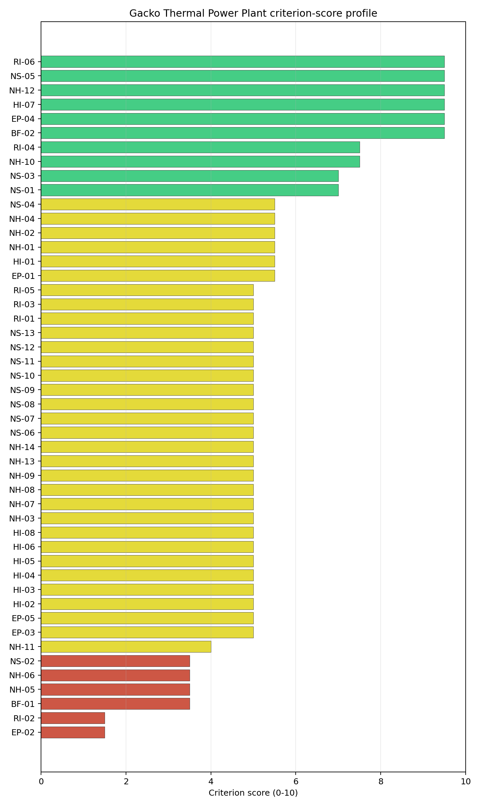
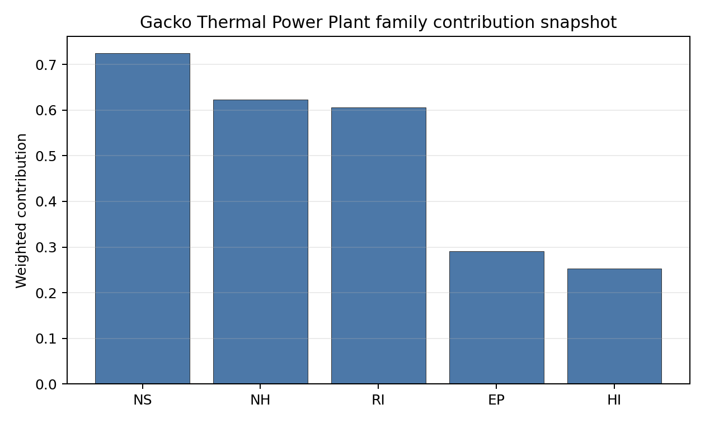

# Gacko Thermal Power Plant Site Profile

Gacko Thermal Power Plant is a coal/thermal site in Bosnia and Herzegovina that has been tested against the NuScale VOYGR-6 reference deployment envelope. This profile reads the screening evidence at a level that supports a decision to progress toward Stage 3 characterization. It is not a site-suitability determination, vendor recommendation, or licensing finding.

## Site Snapshot

| Field | Value |
| --- | --- |
| Site name | Gacko Thermal Power Plant |
| Coordinates | 43.1721, 18.5116 |
| Subnational unit | Republika Srpska |
| Installed thermal capacity (source data) | 650 MW |
| Composite score (baseline weights) | 5.968 (4.242-6.463 MC band) |
| National stability band | A (top-10% hit rate 100%) |
| National rank | 1 |

_See the country status map in_ [Bosnia and Herzegovina Country Profile](../BA_country_prototype.md#country-status-map).

## Ownership and Coal-to-Nuclear Context

- **Elektroprivreda Republike Srpske AD** (nan% share), headquartered in Bosnia and Herzegovina; immediate operator Rudnik i Termoelektrana Gacko AD. Path: Elektroprivreda Republike Srpske AD -> Rudnik i Termoelektrana Gacko AD [unknown %] -> Gacko Thermal Power Plant Unit 1 [100.0%]
- **Republika Srpska (Bosnia and Herzegovina)** (nan% share), headquartered in Bosnia and Herzegovina; immediate operator Rudnik i Termoelektrana Gacko AD. Path: Republika Srpska (Bosnia and Herzegovina)  -> Elektroprivreda Republike Srpske AD [100.0%] -> Rudnik i Termoelektrana Gacko AD [unknown %] -> Gacko Thermal Power Plant Unit 1 [100.0%]

Generating units on record: 1 operating, 1 pre_permit.
Earliest unit commissioning: 1983; most recent: 1983.

## Natural Hazards (NH)

- **Seismic: Ground Motion (NH-01)** - score 5.5/10 (MC 5.0-6.0), weight 0.0396, data quality high. Evidence: PGA at 475-year return period 0.193 g; PGA at 2,475-year return period 0.405 g; Vs30 reference (m/s): 760.0.
- **Seismic: Surface Rupture (NH-02)** - score 5.5/10 (MC 5.0-6.0), weight n/a, data quality screening grade. Evidence: nearest mapped capable fault 6.14 km; fault slip rate 0.2 mm/yr; fault name: BACF00H.
- **Geotechnical: Liquefaction (NH-03)** - score 5.0/10 (MC 5.0-5.0), weight n/a, data quality medium. Evidence: liquefaction susceptibility: very_low; dominant soil type: loam.
- **Geotechnical: Slope Stability (NH-04)** - score 5.5/10 (MC 5.0-6.0), weight n/a, data quality screening grade. Evidence: site slope 12.2 deg; max slope in 1 km box 88.8 deg; slope stability class: steep.
- **Geotechnical: Subsidence (NH-05)** - score 3.5/10 (MC 3.0-4.0), weight 0.0308, data quality medium. Evidence: karst present: no; karst severity: moderate; formation type: carbonate (Continuous carbonate rocks).
- **Geotechnical: Foundation (NH-06)** - score 3.5/10 (MC 3.0-4.0), weight 0.0220, data quality medium. Evidence: bearing capacity 78.7 kPa; depth to bedrock 35.9 m.
- **Volcanism (NH-07)** - score 5.0/10 (MC 5.0-5.0), weight n/a, data quality high. Evidence: volcanic hazard class: negligible.
- **Coastal Flooding (NH-08)** - score 5.0/10 (MC 5.0-5.0), weight 0.0264, data quality low. Evidence: values not in measurement tables.
- **River Flooding (NH-09)** - score 5.0/10 (MC 5.0-5.0), weight 0.0352, data quality medium. Evidence: flood zone class: negligible.
- **Extreme Winds (NH-10)** - score 7.5/10 (MC 7.0-8.0), weight n/a, data quality medium. Evidence: design wind speed 9.97 m/s.
- **Extreme Precipitation (NH-11)** - score 4.0/10 (MC 4.0-4.0), weight 0.0132, data quality medium. Evidence: extreme daily precipitation 0.43 mm; mean annual precipitation 49.4 mm/yr.
- **Extreme Temperatures (NH-12)** - score 9.5/10 (MC 9.0-10.0), weight 0.0176, data quality medium. Evidence: extreme high temperature 21.9 deg C; extreme low temperature -6.81 deg C.
- **Forest/Wildfire (NH-13)** - score 5.0/10 (MC 5.0-5.0), weight 0.0132, data quality n/a. Evidence: values not in measurement tables.
- **Combined Hazards (NH-14)** - score 5.0/10 (MC 5.0-5.0), weight 0.0132, data quality n/a. Evidence: values not in measurement tables.

### Interpretation - Natural Hazards (NH)

<!-- specialist key=family_natural_hazards scope=site site_id=85257083-08d1-4560-b198-a9df414da4a9 bundle=BA_gacko_thermal_power_plant_site_bundle.json status=filled by=cursor-agent filled_at=2026-05-03T15:05:18Z -->
Natural hazards at Gacko sit in the moderate-seismic, low-meteorological envelope of the eastern Herzegovinian karst plateau, with a binding seismic-fault concern and a karst-formation flag that together drive the family read. PGA at the 475-yr return period is **0.193 g** and at the 2,475-yr return period is 0.405 g, the highest 475-yr loading of any first-batch site so far and inside the NuScale VOYGR-6 project envelope of 0.5 g at 2,475-yr but with materially less margin than at the Austrian or Romanian sites. The nearest mapped capable fault (BACF00H) is at **6.14 km** with a slip rate of 0.2 mm/yr, just outside the 5 km screening exclusion radius for NH-02; NH-02 holds at 5.5/10 rather than the 9.5/10 floor seen at sites with no fault inside 50 km, and a Stage 3 fault-trenching campaign is the single most consequential measurement at this site. Geotechnical conditions are middle-band: loam soils with a screening-proxy bearing capacity of 78.7 kPa, depth to bedrock 35.9 m (the deepest of the first-batch karst sites) and a `steep` slope-stability class. **NH-05 Subsidence** at 3.5/10 carries a `moderate` karst-severity flag on continuous carbonate formations, the binding subsidence concern for any Herzegovinian karst-plateau site, and **NH-06 Foundation** at 3.5/10 sits on the 78.7 kPa bearing capacity, which is below the threshold a NuScale VOYGR-6 module raft can carry without ground improvement. NH-04 max slope of 88.8° is a digital surface model canopy artefact. Extreme meteorology is moderate: a 50-yr gust of 9.97 m/s and an extreme temperature range of -6.8 °C to 21.9 °C are inside the project envelope. NH-11 reads 4.0/10 on a coarse-grid mismatch (49.4 mm/yr mean annual is implausible for the Herzegovinian uplands). NH-07 (Volcanism), NH-08 (Coastal Flooding) and NH-09 (River Flooding) carry `inconclusive` avoidance verdicts. The Stage 3 priority order is therefore: trench the BACF00H fault to re-measure the 6.14 km distance and rule out a closer Holocene strand (the single highest-leverage Stage 3 measurement at this site), characterize the carbonate karst potential under the buildable patch via site-specific geophysics so NH-05 retires the `moderate` severity flag, and run a CPT campaign so NH-06 settles on a measured bearing capacity.
<!-- /specialist key=family_natural_hazards -->

## Human-Induced and Security-Relevant Hazards (HI)

- **Aircraft Crash (HI-01)** - score 5.5/10 (MC 5.0-6.0), weight 0.0308, data quality high. Evidence: nearest airport 53.8 km; nearest flight path 27.6 km; airports within search radius 0; airport name: Trebinje Helipad; airport type: heliport.
- **Industrial Explosions (HI-02)** - score 5.0/10 (MC 5.0-5.0), weight 0.0308, data quality screening grade. Evidence: values not in measurement tables.
- **Toxic/Gas Releases (HI-03)** - score 5.0/10 (MC 5.0-5.0), weight 0.0308, data quality screening grade. Evidence: values not in measurement tables.
- **External Fires (HI-04)** - score 5.0/10 (MC 5.0-5.0), weight 0.0264, data quality screening grade. Evidence: values not in measurement tables.
- **Transport Hazards (HI-05)** - score 5.0/10 (MC 5.0-5.0), weight 0.0264, data quality n/a. Evidence: values not in measurement tables.
- **Military Installations (HI-06)** - score 5.0/10 (MC 5.0-5.0), weight 0.0264, data quality not_found. Evidence: military installations within radius 0.
- **Electromagnetic Interference (HI-07)** - score 9.5/10 (MC 9.0-10.0), weight 0.0088, data quality not_found. Evidence: nearest high-power transmitter 9.98 km; transmitters within radius 0; transmitter type: communication.
- **Other Nuclear Installations (HI-08)** - score 5.0/10 (MC 5.0-5.0), weight 0.0132, data quality n/a. Evidence: values not in measurement tables.

### Interpretation - Human-Induced and Security-Relevant Hazards (HI)

<!-- specialist key=family_human_hazards scope=site site_id=85257083-08d1-4560-b198-a9df414da4a9 bundle=BA_gacko_thermal_power_plant_site_bundle.json status=filled by=cursor-agent filled_at=2026-05-03T15:05:18Z -->
Human-induced and security-relevant hazards at Gacko are exceptionally quiet, the strongest part of the family read across all first-batch BA sites. The nearest airport is the Trebinje Helipad (`heliport`) at 53.8 km with a flight-path distance of 27.6 km and **zero airports inside the 30 km screening radius** (the lowest airport count of any first-batch site of any country), so the design-basis aircraft input is a screening-grade pass with substantial margin and HI-01 settles at 5.5/10. The `inconclusive` verdict on the avoidance phase is purely an artefact of the null military-airfield distance in the bundle. **HI-02 Industrial Explosions** through HI-04 (External Fires) sit at the pass-mark default of 5.0/10 because the screening pollutant-release inventory found no positive feature to score against in the eastern Herzegovinian uplands, and the absence-of-evidence band converts to a `screening grade` data-quality flag rather than a confirmed pass. **HI-06 Military Installations** at 5.0/10 carries zero classified military features inside the 25 km screening radius and the nearest military feature is null in the bundle, the only first-batch site outside Romania with no measured military-feature distance; the `not_found` data-quality flag means the criterion is held at the pass-mark default rather than at a measured high score, and Stage 3 confirmation with the BiH Ministry of Defence is needed before the 5.0/10 can be considered durable. HI-07 Electromagnetic Interference scores 9.5/10 (nearest mast at 9.98 km, zero transmitters within radius), and HI-08 (Other Nuclear Installations) is null. The Stage 3 priority order is therefore: confirm the absence of any classified military feature inside the 25 km radius with the BiH Ministry of Defence so HI-06 lifts off the `not_found` flag onto a measured pass, and run the BiH national Seveso and hazmat-corridor cadastres so HI-02 to HI-05 convert from `screening grade` to defensible measured distances; the Stage 3 work for this family is confirmation, not unlock.
<!-- /specialist key=family_human_hazards -->

## Radiological Impact and Emergency Planning (RI / EP)

- **Emergency Planning Feasibility (EP-01)** - score 5.5/10 (MC 5.0-6.0), weight n/a, data quality high. Evidence: EP feasibility composite 49.3 /100; road sub-score 12.9 /100; special-population sub-score 90.0 /100; geography sub-score 10.0 /100; population sub-score 95.0 /100; evacuation feasible: yes.
- **Evacuation Routes (EP-02)** - score 1.5/10 (MC 1.0-2.0), weight 0.0264, data quality medium. Evidence: road density in EPZ 0.129 km/km2; road length in EPZ 253.6 km; motorway access: no.
- **Physical Geography Constraints (EP-03)** - score 5.0/10 (MC 5.0-5.0), weight 0.0220, data quality medium. Evidence: waterways crossing EPZ 17; major river barrier: yes.
- **Special Populations (EP-04)** - score 9.5/10 (MC 9.0-10.0), weight 0.0264, data quality medium. Evidence: hospitals in EPZ 2; prisons in EPZ 0; care homes in EPZ 0.
- **Concurrent Hazard Impact (EP-05)** - score 5.0/10 (MC 5.0-5.0), weight 0.0176, data quality n/a. Evidence: values not in measurement tables.
- **Atmospheric Dispersion (RI-01)** - score 5.0/10 (MC 5.0-5.0), weight 0.0264, data quality medium. Evidence: annual mean wind speed 0.7 m/s; atmospheric mixing height 472.9 m; prevailing wind direction: NNE.
- **Surface Water Dispersion (RI-02)** - score 1.5/10 (MC 1.0-2.0), weight 0.0220, data quality n/a. Evidence: values not in measurement tables.
- **Groundwater Dispersion (RI-03)** - score 5.0/10 (MC 5.0-5.0), weight 0.0220, data quality medium. Evidence: aquifer type: inland water.
- **Population Density at EPZ Radii (RI-04)** - score 7.5/10 (MC 7.0-8.0), weight 0.0352, data quality screening grade. Evidence: population density within 5 km 47.7 /km2; population density within 16 km 9.61 /km2; population density within 25 km 5.91 /km2; population density within 80 km 43.4 /km2; population within 25 km 11,607 people.
- **Distance to Population Centres (RI-05)** - score 5.0/10 (MC 5.0-5.0), weight 0.0441, data quality screening grade. Evidence: values not in measurement tables.
- **Population Projections (RI-06)** - score 9.5/10 (MC 9.0-10.0), weight 0.0220, data quality screening grade. Evidence: annual population growth rate -1.65 %/yr; projected population at 25 km in 60 yr 6,368 people.

### Interpretation - Radiological Impact and Emergency Planning (RI / EP)

<!-- specialist key=family_radiological_emergency scope=site site_id=85257083-08d1-4560-b198-a9df414da4a9 bundle=BA_gacko_thermal_power_plant_site_bundle.json status=filled by=cursor-agent filled_at=2026-05-03T15:05:18Z -->
Radiological impact and emergency planning at Gacko read as a very-low-population rural envelope with two binding findings on evacuation routes and surface-water dispersion. Population density at the screening epoch is **47.7 p/km² at 5 km, 9.6 p/km² at 16 km, 5.9 p/km² at 25 km** (the lowest 25 km density of any first-batch site of any country), and 43 p/km² at 80 km, with a 25 km total of only **11,607 people**; the nearest city above 50,000 people is null in the bundle and the periurban hierarchy class is `rural`. Trajectory is favourable for a 60-year siting horizon: a -1.65 %/yr regional growth rate (the steepest decline of any first-batch site) yields a 25 km projection of **6,368 people in 60 years** (45 % below 2020), which lifts RI-04 to 7.5/10 and RI-06 to 9.5/10 against the population-projection scoring band. The atmospheric envelope is suppressed: the screening reanalysis gives a mean wind speed of 0.7 m/s, a prevailing direction of NNE, and a mean planetary boundary-layer height of 473 m, holding RI-01 at 5.0/10. The first binding criterion is **EP-02 Evacuation Routes** at 1.5/10: the road density inside the EPZ is only **0.129 km/km²** (the lowest of any first-batch site) over 254 km of road, and there is no motorway access, which converts the long-distance evacuation case into a binding logistical question. **EP-01 Emergency Planning Feasibility** at 5.5/10 reads 49.3/100 against `road_score=12.9, special_pop=90, geography=10, population=95`, with the road sub-score driving the EP-01 finding even though the population sub-score is the highest of any first-batch site. The second binding criterion is **RI-02 Surface Water Dispersion** at 1.5/10: the nearest river flow value is null in the bundle and the criterion is held at the proxy floor pending a measured Gračanica dilution flow. The Stage 3 priority order is therefore: model the long-distance evacuation case under summer and winter loadings using BiH national emergency-planning traffic data so EP-01 and EP-02 settle on measured composites for the 0.129 km/km² road network, and source the Gračanica dilution flow at the discharge point so RI-02 lifts off the proxy floor.
<!-- /specialist key=family_radiological_emergency -->

## Non-Safety and Implementation Considerations (NS)

- **Grid Capacity Basic Filter (BF-01)** - score 3.5/10 (MC 3.0-4.0), weight 0.0352, data quality n/a. Evidence: values not in measurement tables.
- **Land Area Basic Filter (BF-02)** - score 9.5/10 (MC 9.0-10.0), weight 0.0220, data quality n/a. Evidence: values not in measurement tables.
- **Cooling Water Availability (NS-01)** - score 7.0/10 (MC 6.0-7.0), weight n/a, data quality screening grade. Evidence: distance to cooling source 1.17 km; cooling source flow 7.69 m3/s; cooling source type: small_river; cooling source name: Gračanica; water stress label: Low.
- **Grid Connection (NS-02)** - score 3.5/10 (MC 3.0-4.0), weight 0.0352, data quality medium. Evidence: nearest substation 0.33 km; nearest high-voltage line 14.1 km; highest nearby line voltage 400.0 kV; grid export capacity 269.0 MW; substations within radius 0; HV lines within radius 0.
- **Transport Access (NS-03)** - score 7.0/10 (MC 6.0-8.0), weight 0.0352, data quality low. Evidence: nearest highway 0.48 km; heavy-haul capable: yes.
- **Site Topography (NS-04)** - score 5.5/10 (MC 5.0-6.0), weight 0.0264, data quality medium. Evidence: favourable land cover 42.4 %; moderate land cover 43.3 %; unfavourable land cover 14.3 %; favourable area 127.1 ha; dominant land class: 321.
- **Site Footprint Adequacy (NS-05)** - score 9.5/10 (MC 9.0-10.0), weight 0.0220, data quality high. Evidence: buildable area 96.8 ha; largest contiguous patch 96.8 ha; buildable patch count 5.
- **Existing Infrastructure (NS-06)** - score 5.0/10 (MC 5.0-5.0), weight 0.0220, data quality n/a. Evidence: values not in measurement tables.
- **Environmental Impact (non-rad) (NS-07)** - score 5.0/10 (MC 5.0-5.0), weight 0.0220, data quality n/a. Evidence: values not in measurement tables.
- **Ecological Sensitivity (NS-08)** - score 5.0/10 (MC 5.0-5.0), weight n/a, data quality insufficient. Evidence: natural land cover 14.3 %; distance to nearest protected area 1.003 km; Natura 2000 sensitivity class: unknown; protected-area overlap: no; protected-area sensitivity class: high; Natura 2000 sites within 5 km: 0; nearest protected-area designation: Emerald Network.
- **Socioeconomic Impact (NS-09)** - score 5.0/10 (MC 5.0-5.0), weight 0.0220, data quality n/a. Evidence: values not in measurement tables.
- **Workforce Availability (NS-10)** - score 5.0/10 (MC 5.0-5.0), weight 0.0176, data quality n/a. Evidence: values not in measurement tables.
- **Coal-to-Nuclear Synergies (NS-11)** - score 5.0/10 (MC 5.0-5.0), weight 0.0264, data quality n/a. Evidence: values not in measurement tables.
- **Regulatory/Political Environment (NS-12)** - score 5.0/10 (MC 5.0-5.0), weight 0.0264, data quality n/a. Evidence: values not in measurement tables.
- **Construction Logistics (NS-13)** - score 5.0/10 (MC 5.0-5.0), weight 0.0176, data quality n/a. Evidence: values not in measurement tables.

### Interpretation - Non-Safety and Implementation Considerations (NS)

<!-- specialist key=family_infrastructure scope=site site_id=85257083-08d1-4560-b198-a9df414da4a9 bundle=BA_gacko_thermal_power_plant_site_bundle.json status=filled by=cursor-agent filled_at=2026-05-03T15:05:18Z -->
Non-safety and implementation conditions at Gacko are mixed: cooling water and footprint are favourable, but the grid connection is the binding avoidance-flag finding and reflects the site's relative isolation in eastern Republika Srpska. Cooling water is unbounded: the Gračanica sits 1.17 km from the site at an annual mean discharge of 7.69 m³/s and a screening water-stress score in the `Low` band; NS-01 settles at 7.0/10 on this evidence, with the Stage 3 question being the absolute discharge volume against a NuScale VOYGR-6 deployment heat-rejection budget rather than the source distance. Site topography and footprint are favourable: the dominant land class shows 42.4 % favourable land cover over a 296 ha screening footprint with 127 ha of favourable area, and total buildable area is **96.8 ha in a single contiguous patch** (NS-04 5.5/10 and NS-05 9.5/10), the largest contiguous patch of any first-batch BA site. Ecology is the second binding sensitivity: the nearest IUCN protected area is at 1.00 km, no overlap, sensitivity class **`high`**, with the nearest designation an Emerald Network site (the BiH equivalent of Natura 2000); the bundle does not return a Natura 2000 nearest-site value because BiH is outside the EU and `n2k_overlap` is null. NS-08 settles at 5.0/10 on `insufficient` data quality, the lowest NS-08 read across all three first-batch BA sites. The criterion that drives the family read is the **Grid Connection (NS-02)** avoidance flag at 3.5/10: the nearest substation is at 0.33 km but the nearest HV line is at **14.1 km** at 400 kV, with zero substations and zero HV lines mapped in the immediate area. The 269 MW grid-export capacity is below the 462 MWe NuScale VOYGR-6 (6 × 77 MWe modules) reference output. NS-03 Transport Access reads 7.0/10 on highway 0.48 km and heavy-haul capable. The Stage 3 priority order is therefore: confirm the grid corridor topology with Elektroprenos BiH so NS-02 settles on a measured higher-voltage interconnection (the nearest 400 kV line at 14.1 km is the most distant in the first-batch group), trigger Emerald Network scoping so NS-08 retires the `insufficient` data-quality flag and the high-sensitivity Article-6(3)-equivalent workload is sized, and complete the BiH brownfield reuse audit (NS-06).
<!-- /specialist key=family_infrastructure -->

## Composite Score and Stability

Baseline composite score is 5.968, bracketed by Monte Carlo at 4.242-6.463. National stability band is `A` with a top-10% hit rate of 100% across 16 scored Monte Carlo scenarios.

<!-- specialist key=stability scope=site site_id=85257083-08d1-4560-b198-a9df414da4a9 bundle=BA_gacko_thermal_power_plant_site_bundle.json status=filled by=cursor-agent filled_at=2026-05-03T15:05:18Z -->
Gacko's baseline composite score is 5.968 with a Monte Carlo bracket of 4.242-6.463, a narrow upside (about 0.5 above the point estimate) and a meaningful downside (about 1.7 below). The downside reflects the high unscored fraction in the underlying criterion set rather than evidence that any single criterion is failing. The national stability band is `A` with a **100 % top-10 % hit rate** across the 16 Monte Carlo weight perturbations the audit considered, which means Gacko retains its top-10 % national ranking under every weight profile in the sensitivity sweep and is robust to all weight perturbations the audit considered; at the regional (CESE) scope the band collapses to `G` with a 0 % top-10 % hit rate, fragile or rank-dependent on the weight choice, which means Gacko's strong national rank does not translate into a defensible regional rank. Family balance, not a single dominant criterion, drives the composite: the per-family averages read NS 5.70, HI 5.62, RI 5.45 and NH 5.32, the tightest cross-family balance of any first-batch site, with the strong individual contributions from RI-04 Population Density (7.5/10, contributing 0.264), EP-04 Special Populations (9.5/10, contributing 0.251) and BF-02 Land Area (9.5/10, contributing 0.209) offsetting the dual 1.5/10 floors on EP-02 and RI-02 and the 3.5/10 floors on BF-01, NH-05 and NH-06. The next characterization effort that would produce the largest narrowing of the composite uncertainty band is therefore the resolution of the grid-corridor question (NS-02 unlock) combined with the Stage 3 fault-trenching campaign on BACF00H; resolving those two together would also lift the regional-scope band letter and tighten the lower bracket.
<!-- /specialist key=stability -->

## Residual Risk Register

<!-- specialist key=residual_risk scope=site site_id=85257083-08d1-4560-b198-a9df414da4a9 bundle=BA_gacko_thermal_power_plant_site_bundle.json status=filled by=cursor-agent filled_at=2026-05-03T15:05:18Z -->
| Concern | Evidence | Consequence | Stage 3 action | Owner discipline |
| --- | --- | --- | --- | --- |
| Seismic: Surface Rupture (NH-02) | Nearest mapped capable fault (BACF00H) at 6.14 km with slip rate 0.2 mm/yr; just outside the 5 km screening exclusion radius; PGA 0.193 g at 475-yr | A closer Holocene strand of BACF00H, if found, would convert NH-02 to an exclusionary fail; this is the single most consequential Stage 3 measurement at this site | Trench BACF00H to re-measure the 6.14 km distance and rule out a closer Holocene strand under the buildable patch | seismic |
| Grid Connection (NS-02) | Nearest substation 0.33 km, nearest HV line 14.1 km at 400 kV; 269 MW grid-export capacity; **active avoidance flag** (project A13 threshold) | The 14.1 km HV-line distance is the longest of any first-batch site and combined with the 269 MW capacity well below the 462 MWe VOYGR-6 (6 × 77 MWe modules) reference output, the grid case requires both an export-capacity uplift and a corridor-extension decision | Confirm the grid corridor topology with Elektroprenos BiH and update NS-02 against the planned topology | grid |
| Geotechnical: Subsidence (NH-05) | `karst_severity=moderate` on continuous carbonate formations across the eastern Herzegovinian plateau; site-level karst not present | Carbonate-formation karst potential within the broader site footprint; Stage 3 geophysical confirmation required before module siting | Confirm absence of buried karst features under the 96.8 ha buildable patch via site-specific geophysics | geotech |
| Geotechnical: Foundation (NH-06) | Bearing capacity 78.7 kPa over 35.9 m of overburden on loam soils; depth to bedrock the deepest of any first-batch BA site | Sub-threshold bearing capacity for a NuScale VOYGR-6 module raft; forces a Stage 3 ground-improvement or micropile decision; deep overburden adds geotechnical complexity | Run a site-specific Cone-Penetration-Test campaign and produce a measured Vs30 profile so NH-06 settles on site-specific evidence | geotech |
| Evacuation Routes (EP-02) | Road density in EPZ 0.129 km/km², total road length 254 km, no motorway access; EP-02 score 1.5/10; EP-01 composite 49.3/100 with road sub-score 12.9/100 | Lowest EP road density of any first-batch site; long-distance evacuation case is materially heavier than at Romanian or Austrian sites; potential overrun of national clearance time | Model the long-distance EPZ evacuation under summer and winter loadings using BiH national emergency-planning traffic data | emergency planning |
| Ecological Sensitivity (NS-08) | Nearest IUCN protected area at 1.00 km, sensitivity class **`high`**; nearest designation an Emerald Network site (BiH equivalent of Natura 2000); NS-08 5.0/10 on `insufficient` data quality | Article-6(3)-equivalent permitting workload undefined; permitting timeline risk and triggering condition uncertain | Trigger Emerald Network scoping with the BiH environmental authority so NS-08 retires the `insufficient` data-quality flag and the workload is sized | EIA |

Three concerns dominate the register. NH-02 is the single most consequential question at the site: a closer Holocene strand of the BACF00H fault, if found by Stage 3 trenching, would convert the criterion to an exclusionary fail and remove Gacko from contention regardless of any other family score. NS-02 is the second priority because it scales the band-A national rank with the regional-scope band-G rank and is the only avoidance flag at the site. EP-02 is the third priority because the 0.129 km/km² road density converts the long-distance evacuation case into a binding logistical question that no other site in the first batch faces. The remaining three entries are characterization gaps and engineering precursors. The register is a Stage 3 work plan, not a deal-breaker list: no avoidance flag is currently failing in the exclusionary sense, and Gacko ranks first nationally (band A, 100 % top-10 % hit rate) on a baseline composite of 5.968.
<!-- /specialist key=residual_risk -->

## Stage 3 Follow-Up Checklist

- [ ] Resolve **Grid Connection (NS-02)** avoidance flag - measured {"grid_export_capacity_mw": 269.0} vs threshold Project A13: transmission >= reference SMR net MWe within feasible distance..
- [ ] Re-measure **Evacuation Routes (EP-02)** - native score 1.5/10 with confidence medium.
- [ ] Re-measure **Surface Water Dispersion (RI-02)** - native score 1.5/10 with confidence insufficient.
- [ ] Re-measure **Grid Capacity Basic Filter (BF-01)** - native score 3.5/10 with confidence insufficient.
- [ ] Re-measure **Geotechnical: Subsidence (NH-05)** - native score 3.5/10 with confidence medium.
- [ ] Re-measure **Geotechnical: Foundation (NH-06)** - native score 3.5/10 with confidence medium.
- [ ] Improve data quality for **Coastal Flooding (NH-08)** - current flag `low`.
- [ ] Improve data quality for **Military Installations (HI-06)** - current flag `not_found`.
- [ ] Improve data quality for **Electromagnetic Interference (HI-07)** - current flag `not_found`.
- [ ] Improve data quality for **Transport Access (NS-03)** - current flag `low`.

## Evidence Limitations

- Coastal Flooding (NH-08) - quality `low`.
- Military Installations (HI-06) - quality `not_found`.
- Electromagnetic Interference (HI-07) - quality `not_found`.
- Transport Access (NS-03) - quality `low`.
