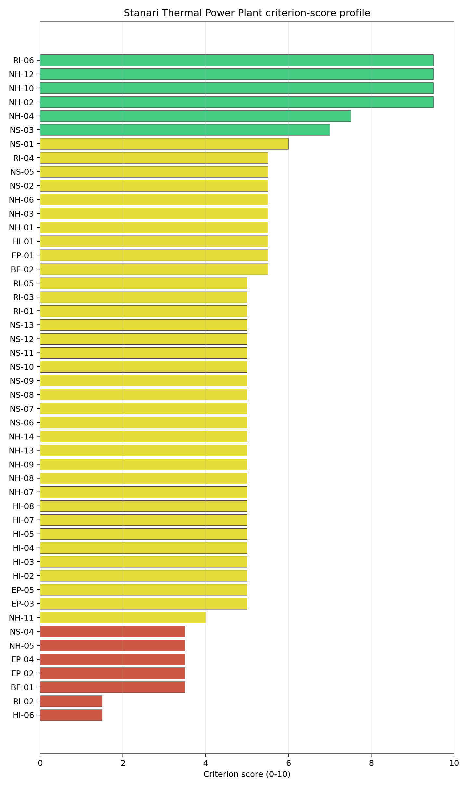
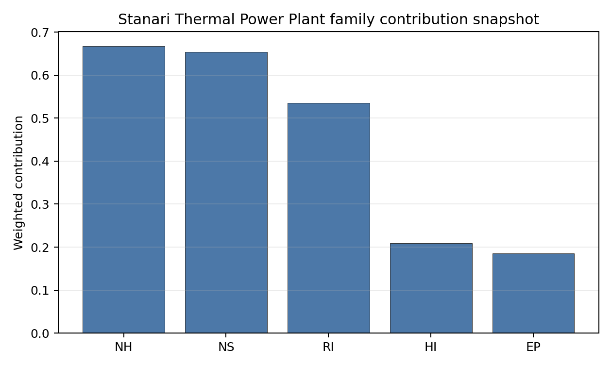

# Stanari Thermal Power Plant Site Profile

Stanari Thermal Power Plant is a coal/thermal site in Bosnia and Herzegovina that has been tested against the NuScale VOYGR-6 reference deployment envelope. This profile reads the screening evidence at a level that supports a decision to progress toward Stage 3 characterization. It is not a site-suitability determination, vendor recommendation, or licensing finding.

## Site Snapshot

| Field | Value |
| --- | --- |
| Site name | Stanari Thermal Power Plant |
| Coordinates | 44.7539, 17.7924 |
| Subnational unit | Republika Srpska |
| Installed thermal capacity (source data) | 300 MW |
| Composite score (baseline weights) | 5.162 (3.943-5.737 MC band) |
| National stability band | D (top-10% hit rate 0%) |
| National rank | 3 |

_See the country status map in_ [Bosnia and Herzegovina Country Profile](../BA_country_prototype.md#country-status-map).

## Ownership and Coal-to-Nuclear Context

- **Stanari Investments Ltd** (100.00% share), headquartered in United Kingdom; immediate operator EFT Rudnik i Termoelektrana Stanari doo. Path: Stanari Investments Ltd -> EFT Rudnik i Termoelektrana Stanari doo [100.0%] -> Stanari Thermal Power Plant -- [100.0%]
- **natural person(s)** (nan% share); immediate operator EFT Rudnik i Termoelektrana Stanari doo. Path: natural person(s)  -> Stanari Investments Ltd [unknown %] -> EFT Rudnik i Termoelektrana Stanari doo [100.0%] -> Stanari Thermal Power Plant -- [100.0%]

Generating units on record: 1 operating.
Earliest unit commissioning: 2016; most recent: 2016.

## Natural Hazards (NH)

- **Seismic: Ground Motion (NH-01)** - score 5.5/10 (MC 5.0-6.0), weight 0.0396, data quality high. Evidence: PGA at 475-year return period 0.136 g; PGA at 2,475-year return period 0.284 g; Vs30 reference (m/s): 760.0.
- **Seismic: Surface Rupture (NH-02)** - score 9.5/10 (MC 9.0-10.0), weight n/a, data quality screening grade. Evidence: nearest mapped capable fault 29.9 km; fault slip rate 0.1 mm/yr; fault name: BACF005.
- **Geotechnical: Liquefaction (NH-03)** - score 5.5/10 (MC 5.0-6.0), weight n/a, data quality medium. Evidence: liquefaction susceptibility: moderate; dominant soil type: clay_loam.
- **Geotechnical: Slope Stability (NH-04)** - score 7.5/10 (MC 7.0-8.0), weight n/a, data quality screening grade. Evidence: site slope 9.99 deg; max slope in 1 km box 84.6 deg; slope stability class: moderate.
- **Geotechnical: Subsidence (NH-05)** - score 3.5/10 (MC 3.0-4.0), weight 0.0308, data quality medium. Evidence: karst present: no; karst severity: none.
- **Geotechnical: Foundation (NH-06)** - score 5.5/10 (MC 5.0-6.0), weight 0.0220, data quality medium. Evidence: bearing capacity 88.7 kPa; depth to bedrock 21.4 m.
- **Volcanism (NH-07)** - score 5.0/10 (MC 5.0-5.0), weight n/a, data quality high. Evidence: volcanic hazard class: negligible.
- **Coastal Flooding (NH-08)** - score 5.0/10 (MC 5.0-5.0), weight 0.0264, data quality low. Evidence: values not in measurement tables.
- **River Flooding (NH-09)** - score 5.0/10 (MC 5.0-5.0), weight 0.0352, data quality medium. Evidence: flood zone class: negligible.
- **Extreme Winds (NH-10)** - score 9.5/10 (MC 9.0-10.0), weight n/a, data quality medium. Evidence: design wind speed 6.04 m/s.
- **Extreme Precipitation (NH-11)** - score 4.0/10 (MC 4.0-4.0), weight 0.0132, data quality medium. Evidence: extreme daily precipitation 0.31 mm; mean annual precipitation 34.5 mm/yr.
- **Extreme Temperatures (NH-12)** - score 9.5/10 (MC 9.0-10.0), weight 0.0176, data quality medium. Evidence: extreme high temperature 24.7 deg C; extreme low temperature -4.96 deg C.
- **Forest/Wildfire (NH-13)** - score 5.0/10 (MC 5.0-5.0), weight 0.0132, data quality n/a. Evidence: values not in measurement tables.
- **Combined Hazards (NH-14)** - score 5.0/10 (MC 5.0-5.0), weight 0.0132, data quality n/a. Evidence: values not in measurement tables.

### Interpretation - Natural Hazards (NH)

<!-- specialist key=family_natural_hazards scope=site site_id=e75c63e5-ef2f-4e08-8f8c-3da41215af9d bundle=BA_stanari_thermal_power_plant_site_bundle.json status=pending -->
> _Specialist interpretation pending: Interpretation - Natural Hazards (NH). Cursor agent fills via `python -m scripts.run_specialist_pass show --country <CC> --site-name <name> --key family_natural_hazards` then `... patch --country <CC> --site-name <name> --key family_natural_hazards --text-file <draft.md>`._
<!-- /specialist key=family_natural_hazards -->

## Human-Induced and Security-Relevant Hazards (HI)

- **Aircraft Crash (HI-01)** - score 5.5/10 (MC 5.0-6.0), weight 0.0308, data quality high. Evidence: nearest airport 33.5 km; nearest flight path 16.7 km; airports within search radius 0; airport name: Koprivna Begovac Airfield; airport type: small_airport.
- **Industrial Explosions (HI-02)** - score 5.0/10 (MC 5.0-5.0), weight 0.0308, data quality screening grade. Evidence: values not in measurement tables.
- **Toxic/Gas Releases (HI-03)** - score 5.0/10 (MC 5.0-5.0), weight 0.0308, data quality screening grade. Evidence: values not in measurement tables.
- **External Fires (HI-04)** - score 5.0/10 (MC 5.0-5.0), weight 0.0264, data quality screening grade. Evidence: values not in measurement tables.
- **Transport Hazards (HI-05)** - score 5.0/10 (MC 5.0-5.0), weight 0.0264, data quality n/a. Evidence: values not in measurement tables.
- **Military Installations (HI-06)** - score 1.5/10 (MC 1.0-2.0), weight 0.0264, data quality medium. Evidence: nearest military installation 10.5 km; military installations within radius 6.
- **Electromagnetic Interference (HI-07)** - score 5.0/10 (MC 5.0-5.0), weight 0.0088, data quality medium. Evidence: nearest high-power transmitter 16.4 km; transmitters within radius 18; transmitter type: minaret.
- **Other Nuclear Installations (HI-08)** - score 5.0/10 (MC 5.0-5.0), weight 0.0132, data quality n/a. Evidence: values not in measurement tables.

### Interpretation - Human-Induced and Security-Relevant Hazards (HI)

<!-- specialist key=family_human_hazards scope=site site_id=e75c63e5-ef2f-4e08-8f8c-3da41215af9d bundle=BA_stanari_thermal_power_plant_site_bundle.json status=pending -->
> _Specialist interpretation pending: Interpretation - Human-Induced and Security-Relevant Hazards (HI). Cursor agent fills via `python -m scripts.run_specialist_pass show --country <CC> --site-name <name> --key family_human_hazards` then `... patch --country <CC> --site-name <name> --key family_human_hazards --text-file <draft.md>`._
<!-- /specialist key=family_human_hazards -->

## Radiological Impact and Emergency Planning (RI / EP)

- **Emergency Planning Feasibility (EP-01)** - score 5.5/10 (MC 5.0-6.0), weight n/a, data quality high. Evidence: EP feasibility composite 57.8 /100; road sub-score 49.4 /100; special-population sub-score 90.0 /100; geography sub-score 95.0 /100; population sub-score 95.0 /100; evacuation feasible: yes.
- **Evacuation Routes (EP-02)** - score 3.5/10 (MC 3.0-4.0), weight 0.0264, data quality medium. Evidence: road density in EPZ 0.457 km/km2; road length in EPZ 897.0 km; motorway access: yes.
- **Physical Geography Constraints (EP-03)** - score 5.0/10 (MC 5.0-5.0), weight 0.0220, data quality medium. Evidence: waterways crossing EPZ 0; major river barrier: no.
- **Special Populations (EP-04)** - score 3.5/10 (MC 3.0-4.0), weight 0.0264, data quality medium. Evidence: hospitals in EPZ 26; prisons in EPZ 0; care homes in EPZ 0.
- **Concurrent Hazard Impact (EP-05)** - score 5.0/10 (MC 5.0-5.0), weight 0.0176, data quality n/a. Evidence: values not in measurement tables.
- **Atmospheric Dispersion (RI-01)** - score 5.0/10 (MC 5.0-5.0), weight 0.0264, data quality medium. Evidence: annual mean wind speed 0.5 m/s; atmospheric mixing height 394.6 m; prevailing wind direction: SSW.
- **Surface Water Dispersion (RI-02)** - score 1.5/10 (MC 1.0-2.0), weight 0.0220, data quality n/a. Evidence: values not in measurement tables.
- **Groundwater Dispersion (RI-03)** - score 5.0/10 (MC 5.0-5.0), weight 0.0220, data quality medium. Evidence: aquifer type: sedimentary sands.
- **Population Density at EPZ Radii (RI-04)** - score 5.5/10 (MC 5.0-6.0), weight 0.0352, data quality screening grade. Evidence: population density within 5 km 51.5 /km2; population density within 16 km 52.5 /km2; population density within 25 km 86.6 /km2; population density within 80 km 85.1 /km2; population within 25 km 170,016 people.
- **Distance to Population Centres (RI-05)** - score 5.0/10 (MC 5.0-5.0), weight 0.0441, data quality screening grade. Evidence: values not in measurement tables.
- **Population Projections (RI-06)** - score 9.5/10 (MC 9.0-10.0), weight 0.0220, data quality screening grade. Evidence: annual population growth rate -1.266 %/yr; projected population at 25 km in 60 yr 93,305 people.

### Interpretation - Radiological Impact and Emergency Planning (RI / EP)

<!-- specialist key=family_radiological_emergency scope=site site_id=e75c63e5-ef2f-4e08-8f8c-3da41215af9d bundle=BA_stanari_thermal_power_plant_site_bundle.json status=pending -->
> _Specialist interpretation pending: Interpretation - Radiological Impact and Emergency Planning (RI / EP). Cursor agent fills via `python -m scripts.run_specialist_pass show --country <CC> --site-name <name> --key family_radiological_emergency` then `... patch --country <CC> --site-name <name> --key family_radiological_emergency --text-file <draft.md>`._
<!-- /specialist key=family_radiological_emergency -->

## Non-Safety and Implementation Considerations (NS)

- **Grid Capacity Basic Filter (BF-01)** - score 3.5/10 (MC 3.0-4.0), weight 0.0352, data quality n/a. Evidence: values not in measurement tables.
- **Land Area Basic Filter (BF-02)** - score 5.5/10 (MC 5.0-6.0), weight 0.0220, data quality n/a. Evidence: values not in measurement tables.
- **Cooling Water Availability (NS-01)** - score 6.0/10 (MC 6.0-6.0), weight n/a, data quality screening grade. Evidence: distance to cooling source 4.1 km; cooling source flow 6.98 m3/s; cooling source type: river; cooling source name: Ostružnja; water stress label: Low.
- **Grid Connection (NS-02)** - score 5.5/10 (MC 5.0-6.0), weight 0.0352, data quality medium. Evidence: nearest substation 0.29 km; nearest high-voltage line 10.9 km; highest nearby line voltage 400.0 kV; grid export capacity 300.0 MW; substations within radius 49; HV lines within radius 25.
- **Transport Access (NS-03)** - score 7.0/10 (MC 5.0-9.0), weight 0.0352, data quality low. Evidence: nearest highway 7.77 km; nearest rail line 1.55 km; heavy-haul capable: yes.
- **Site Topography (NS-04)** - score 3.5/10 (MC 3.0-4.0), weight 0.0264, data quality medium. Evidence: favourable land cover 24.4 %; moderate land cover 35.9 %; unfavourable land cover 39.7 %; favourable area 53.8 ha; dominant land class: 311.
- **Site Footprint Adequacy (NS-05)** - score 5.5/10 (MC 5.0-6.0), weight 0.0220, data quality high. Evidence: buildable area 26.6 ha; largest contiguous patch 26.6 ha; buildable patch count 19.
- **Existing Infrastructure (NS-06)** - score 5.0/10 (MC 5.0-5.0), weight 0.0220, data quality n/a. Evidence: values not in measurement tables.
- **Environmental Impact (non-rad) (NS-07)** - score 5.0/10 (MC 5.0-5.0), weight 0.0220, data quality n/a. Evidence: values not in measurement tables.
- **Ecological Sensitivity (NS-08)** - score 5.0/10 (MC 5.0-5.0), weight n/a, data quality insufficient. Evidence: natural land cover 39.7 %; Natura 2000 sensitivity class: unknown; protected-area overlap: no; protected-area sensitivity class: none; Natura 2000 sites within 5 km: 0.
- **Socioeconomic Impact (NS-09)** - score 5.0/10 (MC 5.0-5.0), weight 0.0220, data quality n/a. Evidence: values not in measurement tables.
- **Workforce Availability (NS-10)** - score 5.0/10 (MC 5.0-5.0), weight 0.0176, data quality n/a. Evidence: values not in measurement tables.
- **Coal-to-Nuclear Synergies (NS-11)** - score 5.0/10 (MC 5.0-5.0), weight 0.0264, data quality n/a. Evidence: values not in measurement tables.
- **Regulatory/Political Environment (NS-12)** - score 5.0/10 (MC 5.0-5.0), weight 0.0264, data quality n/a. Evidence: values not in measurement tables.
- **Construction Logistics (NS-13)** - score 5.0/10 (MC 5.0-5.0), weight 0.0176, data quality n/a. Evidence: values not in measurement tables.

### Interpretation - Non-Safety and Implementation Considerations (NS)

<!-- specialist key=family_infrastructure scope=site site_id=e75c63e5-ef2f-4e08-8f8c-3da41215af9d bundle=BA_stanari_thermal_power_plant_site_bundle.json status=pending -->
> _Specialist interpretation pending: Interpretation - Non-Safety and Implementation Considerations (NS). Cursor agent fills via `python -m scripts.run_specialist_pass show --country <CC> --site-name <name> --key family_infrastructure` then `... patch --country <CC> --site-name <name> --key family_infrastructure --text-file <draft.md>`._
<!-- /specialist key=family_infrastructure -->

## Composite Score and Stability

Baseline composite score is 5.162, bracketed by Monte Carlo at 3.943-5.737. National stability band is `D` with a top-10% hit rate of 0% across 16 scored Monte Carlo scenarios.

<!-- specialist key=stability scope=site site_id=e75c63e5-ef2f-4e08-8f8c-3da41215af9d bundle=BA_stanari_thermal_power_plant_site_bundle.json status=pending -->
> _Specialist interpretation pending: Composite stability and sensitivity (plain-English read). Cursor agent fills via `python -m scripts.run_specialist_pass show --country <CC> --site-name <name> --key stability` then `... patch --country <CC> --site-name <name> --key stability --text-file <draft.md>`._
<!-- /specialist key=stability -->

## Residual Risk Register

<!-- specialist key=residual_risk scope=site site_id=e75c63e5-ef2f-4e08-8f8c-3da41215af9d bundle=BA_stanari_thermal_power_plant_site_bundle.json status=pending -->
> _Specialist interpretation pending: Residual risk register (specialist synthesis). Cursor agent fills via `python -m scripts.run_specialist_pass show --country <CC> --site-name <name> --key residual_risk` then `... patch --country <CC> --site-name <name> --key residual_risk --text-file <draft.md>`._
<!-- /specialist key=residual_risk -->

## Stage 3 Follow-Up Checklist

- [ ] Resolve **Grid Connection (NS-02)** avoidance flag - measured {"grid_export_capacity_mw": 300.0} vs threshold Project A13: transmission >= reference SMR net MWe within feasible distance..
- [ ] Re-measure **Military Installations (HI-06)** - native score 1.5/10 with confidence medium.
- [ ] Re-measure **Surface Water Dispersion (RI-02)** - native score 1.5/10 with confidence insufficient.
- [ ] Re-measure **Grid Capacity Basic Filter (BF-01)** - native score 3.5/10 with confidence insufficient.
- [ ] Re-measure **Evacuation Routes (EP-02)** - native score 3.5/10 with confidence medium.
- [ ] Re-measure **Special Populations (EP-04)** - native score 3.5/10 with confidence medium.
- [ ] Improve data quality for **Coastal Flooding (NH-08)** - current flag `low`.
- [ ] Improve data quality for **Transport Access (NS-03)** - current flag `low`.

## Evidence Limitations

- Coastal Flooding (NH-08) - quality `low`.
- Transport Access (NS-03) - quality `low`.
