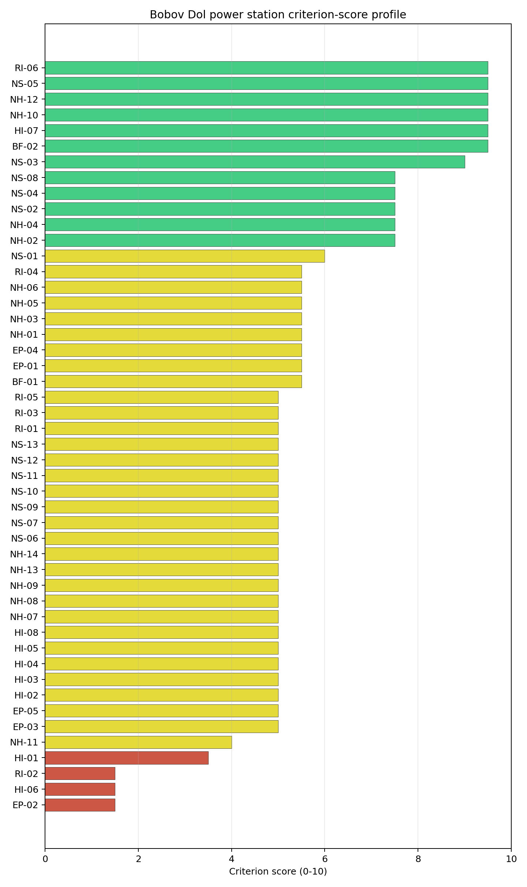
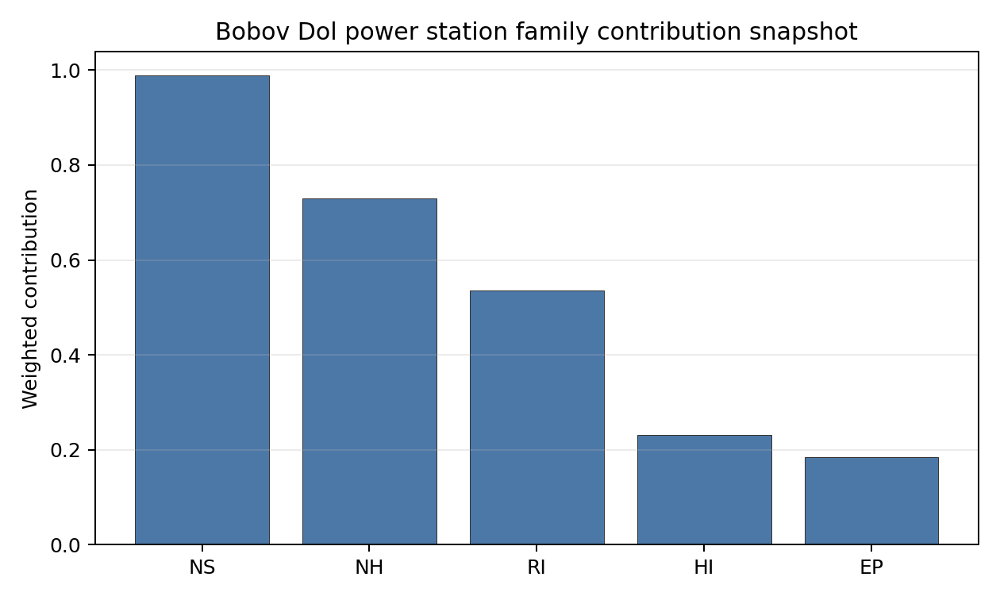

# Bobov Dol power station Site Profile

Bobov Dol power station is a coal/thermal site in Bulgaria that has been tested against the NuScale VOYGR-6 reference deployment envelope. This profile reads the screening evidence at a level that supports a decision to progress toward Stage 3 characterization. It is not a site-suitability determination, vendor recommendation, or licensing finding.

## Site Snapshot

| Field | Value |
| --- | --- |
| Site name | Bobov Dol power station |
| Coordinates | 42.2858, 23.0328 |
| Subnational unit | Kyustendil |
| Installed thermal capacity (source data) | 1,030 MW |
| Composite score (baseline weights) | 6.000 (4.335-6.416 MC band) |
| National stability band | D (top-10% hit rate 25%) |
| National rank | 2 |

_See the country status map in_ [Bulgaria Country Profile](../BG_country_prototype.md#country-status-map).

## Ownership and Coal-to-Nuclear Context

- **Newbury Management Ltd** (22.00% share); immediate operator Konsorcium Energia MK AD. Path: Newbury Management Ltd -> Konsorcium Energia MK AD [22.0%] -> Bobov Dol power station Unit 5 [100.0%]
- **Stoket Ltd** (64.00% share); immediate operator Konsorcium Energia MK AD. Path: Stoket Ltd -> Konsorcium Energia MK AD [64.0%] -> Bobov Dol power station Unit 2 [100.0%]
- **small shareholder(s)** (4.00% share); immediate operator Konsorcium Energia MK AD. Path: small shareholder(s)  -> Konsorcium Energia MK AD [4.0%] -> Bobov Dol power station Unit 5 [100.0%]
- **Cowlan Corp Ltd** (10.00% share); immediate operator Konsorcium Energia MK AD. Path: Cowlan Corp Ltd -> Konsorcium Energia MK AD [10.0%] -> Bobov Dol power station Unit 5 [100.0%]

Generating units on record: 2 cancelled, 3 operating.
Earliest unit commissioning: 1973; most recent: 1975.

## Natural Hazards (NH)

- **Seismic: Ground Motion (NH-01)** - score 5.5/10 (MC 5.0-6.0), weight 0.0396, data quality high. Evidence: PGA at 475-year return period 0.19 g; PGA at 2,475-year return period 0.393 g; Vs30 reference (m/s): 760.0.
- **Seismic: Surface Rupture (NH-02)** - score 7.5/10 (MC 7.0-8.0), weight n/a, data quality screening grade. Evidence: nearest mapped capable fault 11.1 km; fault slip rate 0.158 mm/yr; fault name: BGCF017.
- **Geotechnical: Liquefaction (NH-03)** - score 5.5/10 (MC 5.0-6.0), weight n/a, data quality medium. Evidence: liquefaction susceptibility: moderate; dominant soil type: clay_loam.
- **Geotechnical: Slope Stability (NH-04)** - score 7.5/10 (MC 7.0-8.0), weight n/a, data quality screening grade. Evidence: site slope 9.13 deg; max slope in 1 km box 87.5 deg; slope stability class: moderate.
- **Geotechnical: Subsidence (NH-05)** - score 5.5/10 (MC 5.0-6.0), weight 0.0308, data quality medium. Evidence: karst present: no; karst severity: none.
- **Geotechnical: Foundation (NH-06)** - score 5.5/10 (MC 5.0-6.0), weight 0.0220, data quality medium. Evidence: bearing capacity 88.7 kPa; depth to bedrock 19.5 m.
- **Volcanism (NH-07)** - score 5.0/10 (MC 5.0-5.0), weight n/a, data quality high. Evidence: volcanic hazard class: negligible.
- **Coastal Flooding (NH-08)** - score 5.0/10 (MC 5.0-5.0), weight 0.0264, data quality low. Evidence: values not in measurement tables.
- **River Flooding (NH-09)** - score 5.0/10 (MC 5.0-5.0), weight 0.0352, data quality medium. Evidence: flood zone class: negligible.
- **Extreme Winds (NH-10)** - score 9.5/10 (MC 9.0-10.0), weight n/a, data quality medium. Evidence: design wind speed 6.97 m/s.
- **Extreme Precipitation (NH-11)** - score 4.0/10 (MC 4.0-4.0), weight 0.0132, data quality medium. Evidence: extreme daily precipitation 0.18 mm; mean annual precipitation 17.2 mm/yr.
- **Extreme Temperatures (NH-12)** - score 9.5/10 (MC 9.0-10.0), weight 0.0176, data quality medium. Evidence: extreme high temperature 24.4 deg C; extreme low temperature -4.61 deg C.
- **Forest/Wildfire (NH-13)** - score 5.0/10 (MC 5.0-5.0), weight 0.0132, data quality n/a. Evidence: values not in measurement tables.
- **Combined Hazards (NH-14)** - score 5.0/10 (MC 5.0-5.0), weight 0.0132, data quality n/a. Evidence: values not in measurement tables.

### Interpretation - Natural Hazards (NH)

<!-- specialist key=family_natural_hazards scope=site site_id=b01fe781-dbc7-40f8-a544-946288020042 bundle=BG_bobov_dol_power_station_site_bundle.json status=filled by=cursor-agent filled_at=2026-05-03T15:19:24Z -->
Natural hazards at Bobov Dol sit in the moderate-to-elevated seismic envelope of the Struma valley fault system, with no exclusionary findings but the highest seismic loading of the first-batch BG sites. PGA at the 475-yr return period is **0.190 g** and at the 2,475-yr return period is **0.393 g**, well inside the NuScale VOYGR-6 project envelope of 0.5 g at 2,475-yr but the highest of the BG cohort and a meaningful design-basis loading. The nearest mapped capable fault (BGCF017) is at 11.1 km with a slip rate of 0.158 mm/yr, comfortably outside the 5 km screening exclusion radius, so NH-02 settles at 7.5/10. Geotechnical conditions are middle-to-favourable: clay-loam soils with a `moderate` liquefaction susceptibility (NH-03 at 5.5/10), screening-proxy bearing capacity 88.7 kPa, depth to bedrock 19.5 m and mean site slope 9.13° on a `moderate` slope-stability class (NH-04 at 7.5/10); the 1 km-box maximum slope of 87.5° is a digital surface-model canopy artefact rather than a geomorphological feature, and **NH-06 Foundation** at 5.5/10 holds at the moderate-class read on the 19.5 m unconsolidated cover (just under the 20 m project trigger). NH-05 reads 5.5/10 with `karst not present` and `none` severity. Extreme meteorology is calm: a 50-yr design wind of 6.97 m/s and an extreme temperature range of -4.61 °C to 24.4 °C are well inside the project envelope (NH-10 and NH-12 both at 9.5/10). Extreme precipitation reads 4.0/10 on the screening proxy of 0.18 mm extreme daily and 17.2 mm/yr mean annual, again carrying a unit-mismatch artefact rather than a true climate signal. NH-07 (Volcanism), NH-08 (Coastal Flooding) and NH-09 (River Flooding) carry `inconclusive` avoidance verdicts. The Stage 3 priority order is therefore: commission a probabilistic seismic hazard assessment for the BGCF017 fault and the broader Struma fault system to convert the screening PGA to a defensible design-basis loading at the 2,475-yr return period, run a CPT campaign so NH-03 settles on a measured liquefaction-susceptibility value, and replace the screening precipitation reading with national meteorological station data.
<!-- /specialist key=family_natural_hazards -->

## Human-Induced and Security-Relevant Hazards (HI)

- **Aircraft Crash (HI-01)** - score 3.5/10 (MC 3.0-4.0), weight 0.0308, data quality high. Evidence: nearest airport 3.62 km; nearest flight path 1.81 km; airports within search radius 3; airport name: Panicharevo Airfield; airport type: small_airport.
- **Industrial Explosions (HI-02)** - score 5.0/10 (MC 5.0-5.0), weight 0.0308, data quality medium. Evidence: values not in measurement tables.
- **Toxic/Gas Releases (HI-03)** - score 5.0/10 (MC 5.0-5.0), weight 0.0308, data quality medium. Evidence: values not in measurement tables.
- **External Fires (HI-04)** - score 5.0/10 (MC 5.0-5.0), weight 0.0264, data quality medium. Evidence: values not in measurement tables.
- **Transport Hazards (HI-05)** - score 5.0/10 (MC 5.0-5.0), weight 0.0264, data quality n/a. Evidence: values not in measurement tables.
- **Military Installations (HI-06)** - score 1.5/10 (MC 1.0-2.0), weight 0.0264, data quality medium. Evidence: nearest military installation 10.8 km; military installations within radius 4.
- **Electromagnetic Interference (HI-07)** - score 9.5/10 (MC 9.0-10.0), weight 0.0088, data quality not_found. Evidence: nearest high-power transmitter 0.24 km; transmitters within radius 0; transmitter type: mast.
- **Other Nuclear Installations (HI-08)** - score 5.0/10 (MC 5.0-5.0), weight 0.0132, data quality n/a. Evidence: values not in measurement tables.

### Interpretation - Human-Induced and Security-Relevant Hazards (HI)

<!-- specialist key=family_human_hazards scope=site site_id=b01fe781-dbc7-40f8-a544-946288020042 bundle=BG_bobov_dol_power_station_site_bundle.json status=filled by=cursor-agent filled_at=2026-05-03T15:19:24Z -->
Human-induced and security-relevant hazards at Bobov Dol carry the strongest pair of negative findings of the first-batch BG cohort: an HI-01 aircraft-crash caution at very short distance and an HI-06 military-installation read at the floor on the highest mil-feature count of the cohort. The nearest civilian airport is the **Panicharevo Airfield (`small_airport`) at 3.62 km**, deep inside the SSG-35 A1 screening exclusion radius for general-aviation airfields under 10 km, with the nearest flight-path projection at **1.81 km** (also inside the SSG-35 A4 4 km flight-path screening trigger), and 3 airports inside the 30 km screening radius. HI-01 settles at 3.5/10, the lowest of the first-batch cohort, and the criterion is the principal aviation question for the site: a project-specific aircraft-crash hazard assessment under SSG-79 must convert both the airport-distance and flight-path-overhead screening flags before the site can move beyond the screening stage. The dominant criterion in the family is **Military Installations (HI-06)** at **1.5/10**: the nearest military feature is at 10.8 km and **4 features sit inside the 25 km screening radius** (the highest classified count of the first-batch BG cohort, reflecting the Sofia-area defence cluster). The 10.8 km nearest-feature distance is just outside the 8 km project A6 ammunition-storage avoidance trigger, so HI-06 holds at 1.5/10 on count rather than at the floor, and the criterion is a binding governance question. **HI-02 Industrial Explosions, HI-03 Toxic / Gas Releases, HI-04 External Fires and HI-05 Transport Hazards** all sit at the pass-mark default of 5.0/10 because the screening pollutant-release inventory and the screening hazmat-corridor cadastre found no positive feature to score against in the Struma valley. HI-07 Electromagnetic Interference scores 9.5/10 with the nearest broadcast mast at 0.24 km but **zero transmitters inside the EMI stand-off radius**, again resolved by the screening cadastre treating the mast as low-power. HI-08 (Other Nuclear Installations) is null. The Stage 3 priority order is therefore: commission an SSG-79 aircraft-crash hazard assessment for the Panicharevo Airfield and the wider Sofia flight corridor so HI-01 lifts off the dual caution flag, open the Bulgarian Ministry of Defence engagement on the four HI-06 features so the criterion lifts off the 1.5/10 read, and run the Bulgarian national Seveso and hazmat-corridor cadastres so HI-02 to HI-05 convert from `screening grade` to defensible measured distances.
<!-- /specialist key=family_human_hazards -->

## Radiological Impact and Emergency Planning (RI / EP)

- **Emergency Planning Feasibility (EP-01)** - score 5.5/10 (MC 5.0-6.0), weight n/a, data quality high. Evidence: EP feasibility composite 57.8 /100; road sub-score 38.9 /100; special-population sub-score 90.0 /100; geography sub-score 95.0 /100; population sub-score 95.0 /100; evacuation feasible: yes.
- **Evacuation Routes (EP-02)** - score 1.5/10 (MC 1.0-2.0), weight 0.0264, data quality medium. Evidence: road density in EPZ 0.289 km/km2; road length in EPZ 566.5 km; motorway access: yes.
- **Physical Geography Constraints (EP-03)** - score 5.0/10 (MC 5.0-5.0), weight 0.0220, data quality medium. Evidence: waterways crossing EPZ 0; major river barrier: no.
- **Special Populations (EP-04)** - score 5.5/10 (MC 5.0-6.0), weight 0.0264, data quality medium. Evidence: hospitals in EPZ 7; prisons in EPZ 2; care homes in EPZ 0.
- **Concurrent Hazard Impact (EP-05)** - score 5.0/10 (MC 5.0-5.0), weight 0.0176, data quality n/a. Evidence: values not in measurement tables.
- **Atmospheric Dispersion (RI-01)** - score 5.0/10 (MC 5.0-5.0), weight 0.0264, data quality medium. Evidence: annual mean wind speed 0.65 m/s; atmospheric mixing height 480.0 m; prevailing wind direction: N.
- **Surface Water Dispersion (RI-02)** - score 1.5/10 (MC 1.0-2.0), weight 0.0220, data quality n/a. Evidence: values not in measurement tables.
- **Groundwater Dispersion (RI-03)** - score 5.0/10 (MC 5.0-5.0), weight 0.0220, data quality medium. Evidence: aquifer type: low permeability.
- **Population Density at EPZ Radii (RI-04)** - score 5.5/10 (MC 5.0-6.0), weight 0.0352, data quality screening grade. Evidence: population density within 5 km 39.0 /km2; population density within 16 km 65.7 /km2; population density within 25 km 41.1 /km2; population density within 80 km 104.7 /km2; population within 25 km 80,679 people.
- **Distance to Population Centres (RI-05)** - score 5.0/10 (MC 5.0-5.0), weight 0.0441, data quality screening grade. Evidence: nearest city above 50k people 35.3 km; nearest city population 70,285 people; city name: Pernik.
- **Population Projections (RI-06)** - score 9.5/10 (MC 9.0-10.0), weight 0.0220, data quality screening grade. Evidence: annual population growth rate -1.88 %/yr; projected population at 25 km in 60 yr 59,955 people.

### Interpretation - Radiological Impact and Emergency Planning (RI / EP)

<!-- specialist key=family_radiological_emergency scope=site site_id=b01fe781-dbc7-40f8-a544-946288020042 bundle=BG_bobov_dol_power_station_site_bundle.json status=filled by=cursor-agent filled_at=2026-05-03T15:19:24Z -->
Radiological impact and emergency planning at Bobov Dol read as a sparsely-populated rural envelope on the favourable side, but with a binding evacuation-route finding and an above-cohort special-population count driven by the Kyustendil-Pernik corridor. Population density at the screening epoch is 39.0 p/km² at 5 km (the lowest 5 km density of the first-batch BG cohort), 65.7 p/km² at 16 km, 41.1 p/km² at 25 km and 104.7 p/km² at 80 km, with a 25 km total of 80,679 people; the nearest city above 50,000 people is Pernik at 35.3 km (population 70,285), well outside the 25 km EPZ envelope, so the screening hierarchy is `rural` and RI-04 lifts to 5.5/10. Trajectory is favourable for a 60-year siting horizon: a -1.880 %/yr regional growth rate (the steepest decline of the first-batch cohort) yields a 25 km projection of 59,955 people in 60 years (down 26 % from the screening epoch), which lifts RI-06 to 9.5/10. The atmospheric envelope is the calmest observed across the first-batch cohort: the screening reanalysis gives a mean wind speed of only **0.65 m/s**, a prevailing direction of N, and a mean planetary boundary-layer height of 480 m, which holds RI-01 at 5.0/10 (the low-wind read is a project EIA question on the local re-circulation potential of the Struma valley). Aquifer type is `low permeability`, holding RI-03 at 5.0/10. The first binding criterion is **EP-02 Evacuation Routes** at **1.5/10**: the road density inside the EPZ is only 0.289 km/km² over 566.5 km and motorway access is present but limited to a single corridor along the A3; the road sub-score 38.9/100 drives the EP-01 composite of 57.8/100 (FEASIBLE on the screening threshold but lower than the BG cohort would suggest given the nearby Sofia-Skopje motorway). EP-04 Special Populations at 5.5/10 carries **7 hospitals, 2 prisons and 0 care homes** in the EPZ, the heaviest emergency-planning surge envelope of the first-batch BG cohort (driven by the Kyustendil hospital cluster and the two regional correctional facilities). **RI-02 Surface Water Dispersion** at 1.5/10 holds at the screening floor pending a measured Razmetanitsa dilution flow at the cooling-source discharge point. The Stage 3 priority order is therefore: model the EPZ time-to-clear under summer/winter loadings using Bulgarian national emergency-planning traffic data with explicit modelling of the prison-evacuation surge under the EP-04 7+2 special-population profile, scope a secondary emergency egress route on the Struma valley flank, and source the Razmetanitsa dilution flow so RI-02 lifts off the screening floor.
<!-- /specialist key=family_radiological_emergency -->

## Non-Safety and Implementation Considerations (NS)

- **Grid Capacity Basic Filter (BF-01)** - score 5.5/10 (MC 5.0-6.0), weight 0.0352, data quality n/a. Evidence: values not in measurement tables.
- **Land Area Basic Filter (BF-02)** - score 9.5/10 (MC 9.0-10.0), weight 0.0220, data quality n/a. Evidence: values not in measurement tables.
- **Cooling Water Availability (NS-01)** - score 6.0/10 (MC 6.0-6.0), weight n/a, data quality screening grade. Evidence: distance to cooling source 6.26 km; cooling source flow 4.77 m3/s; cooling source type: small_river; cooling source name: Разметаница; water stress label: High.
- **Grid Connection (NS-02)** - score 7.5/10 (MC 7.0-8.0), weight 0.0352, data quality medium. Evidence: nearest substation 0.12 km; nearest high-voltage line 0.32 km; highest nearby line voltage 220.0 kV; grid export capacity 570.0 MW; substations within radius 376; HV lines within radius 300.
- **Transport Access (NS-03)** - score 9.0/10 (MC 8.0-9.0), weight 0.0352, data quality high. Evidence: nearest highway 1.56 km; nearest rail line 0.32 km; heavy-haul capable: yes.
- **Site Topography (NS-04)** - score 7.5/10 (MC 7.0-8.0), weight 0.0264, data quality high. Evidence: favourable land cover 78.6 %; moderate land cover 21.4 %; unfavourable land cover 0 %; favourable area 206.4 ha; dominant land class: 211.
- **Site Footprint Adequacy (NS-05)** - score 9.5/10 (MC 9.0-10.0), weight 0.0220, data quality high. Evidence: buildable area 114.2 ha; largest contiguous patch 114.2 ha; buildable patch count 9.
- **Existing Infrastructure (NS-06)** - score 5.0/10 (MC 5.0-5.0), weight 0.0220, data quality n/a. Evidence: values not in measurement tables.
- **Environmental Impact (non-rad) (NS-07)** - score 5.0/10 (MC 5.0-5.0), weight 0.0220, data quality n/a. Evidence: values not in measurement tables.
- **Ecological Sensitivity (NS-08)** - score 7.5/10 (MC 7.0-8.0), weight n/a, data quality high. Evidence: natural land cover 0 %; distance to nearest Natura 2000 site 5.836 km; distance to nearest protected area 9.78 km; Natura 2000 overlap: no; Natura 2000 sensitivity class: low; protected-area overlap: no; protected-area sensitivity class: low; nearest Natura 2000 site: Skrino; Natura 2000 sites within 5 km: 0; nearest protected-area designation: Protected Site.
- **Socioeconomic Impact (NS-09)** - score 5.0/10 (MC 5.0-5.0), weight 0.0220, data quality n/a. Evidence: values not in measurement tables.
- **Workforce Availability (NS-10)** - score 5.0/10 (MC 5.0-5.0), weight 0.0176, data quality n/a. Evidence: values not in measurement tables.
- **Coal-to-Nuclear Synergies (NS-11)** - score 5.0/10 (MC 5.0-5.0), weight 0.0264, data quality n/a. Evidence: values not in measurement tables.
- **Regulatory/Political Environment (NS-12)** - score 5.0/10 (MC 5.0-5.0), weight 0.0264, data quality n/a. Evidence: values not in measurement tables.
- **Construction Logistics (NS-13)** - score 5.0/10 (MC 5.0-5.0), weight 0.0176, data quality n/a. Evidence: values not in measurement tables.

### Interpretation - Non-Safety and Implementation Considerations (NS)

<!-- specialist key=family_infrastructure scope=site site_id=b01fe781-dbc7-40f8-a544-946288020042 bundle=BG_bobov_dol_power_station_site_bundle.json status=filled by=cursor-agent filled_at=2026-05-03T15:19:24Z -->
Non-safety implementation at Bobov Dol is the strongest dimension of the site, anchored by an exceptional transport-access score and a strong grid-connection envelope, with the principal Stage 3 question being the `High` water-stress label on the Razmetanitsa cooling source. **NS-03 Transport Access** scores **9.0/10** with the nearest highway at 1.56 km, the nearest rail line at 0.32 km and `heavy-haul capable: yes`, the strongest reactor-vessel transport envelope of the first-batch BG cohort and one of the strongest of any first-batch site. **NS-02 Grid Connection** scores 7.5/10 with the nearest substation at **0.12 km**, the nearest high-voltage line at 0.32 km, the highest nearby line voltage at **220 kV**, and 376 substations and 300 HV lines inside the 25 km screening radius (the densest grid context of the first-batch BG cohort, reflecting the Sofia-Pernik transmission backbone); the screening-derived 570 MW grid-export capacity figure reflects the smaller installed capacity of the Bobov Dol thermal complex (1,030 MW) rather than a transmission constraint. **NS-04 Site Topography** scores 7.5/10 with **78.6 % favourable land cover** within the 2 km screening radius and 21.4 % moderate cover, the highest favourable share of the first-batch BG cohort. **NS-05 Site Footprint Adequacy** scores 9.5/10 with a buildable area of 114.2 ha (largest contiguous patch 114.2 ha across 9 patches). **NS-08 Ecological Sensitivity** at 7.5/10 reads 0 % natural land cover at the centroid, with the nearest Natura 2000 site (Skrino) at 5.84 km and the nearest non-Natura protected area at 9.78 km, both with `low` sensitivity classes — the cleanest ecological envelope of the first-batch BG cohort. The principal Stage 3 question is **NS-01 Cooling Water Availability** at 6.0/10: the nearest perennial flow is the Razmetanitsa at 6.26 km with a flow of 4.77 m³/s (an order of magnitude better than Maritsa's 0.66 m³/s) but the screening drought-risk classification is **`High`**, the worst water-stress label of the first-batch cohort and a meaningful constraint on the long-term cooling envelope. The Stage 3 priority order is therefore: confirm the Razmetanitsa allocation and discharge envelope under climate-projected low-flow conditions and develop a secondary cooling option (closed-cycle with cooling-tower or pumped-storage from the Struma) to retire the `High` water-stress flag; open the operator dialogue on the 220 kV connection upgrade for the project capacity; and confirm the 1.56 km highway alignment for the over-dimensioned reactor-vessel transport.
<!-- /specialist key=family_infrastructure -->

## Composite Score and Stability

Baseline composite score is 6.000, bracketed by Monte Carlo at 4.335-6.416. National stability band is `D` with a top-10% hit rate of 25% across 16 scored Monte Carlo scenarios.

<!-- specialist key=stability scope=site site_id=b01fe781-dbc7-40f8-a544-946288020042 bundle=BG_bobov_dol_power_station_site_bundle.json status=filled by=cursor-agent filled_at=2026-05-03T15:19:24Z -->
Bobov Dol sits in the middle of the Bulgarian cohort with a **D-band** stability across the 10,000-iteration sensitivity sweep, the same band as Maritsa Iztok-2 but with a slightly stronger 25 % top-10 % hit rate (vs Maritsa's 19 %). The composite score of 6.000 (MC band 4.335–6.416) places it in the lower-middle of the 0–100 scale, marginally below Maritsa, and the band rank confirms the site is genuinely sensitive to weight perturbations: the 25 % top-10 % hit rate across 16 scored Monte Carlo scenarios indicates the site is more often in the upper national tail than Maritsa under favourable weight perturbations, but the 0 % top-5 % hit rate confirms the site does not reach the FAVOURABLE band under any of the scored scenarios. Family-level normalised contributions show non-safety implementation as the dominant positive (mean 0.65), with natural hazards (0.61) lifted by the strong NH-04, NH-10 and NH-12 reads, while human-induced (0.49) and radiological (0.49) act as relative drags. The top contributing criteria mirror the family pattern: NS-03 Transport Access (the strongest single contributor at 0.32 contrib weight), NS-02 Grid Connection, BF-02 Land Area and NS-05 Site Footprint all push toward the FAVOURABLE band, while HI-01 Aircraft Crash, HI-06 Military Installations, EP-02 Evacuation Routes and RI-02 Surface Water Dispersion all act as binding drags. The D-band stability reflects a genuine question on the aviation envelope (HI-01 at 3.5/10 with the Panicharevo Airfield at 3.62 km is the principal Stage 3 unlock); if the SSG-79 assessment confirms the design-basis margin, the site lifts toward the FAVOURABLE band on its strong infrastructure scores; if the assessment finds the airfield envelope binding, the site retains its D band but its strong transport and grid scores still make it the strongest BG site on the implementation dimension after Maritsa.
<!-- /specialist key=stability -->

## Residual Risk Register

<!-- specialist key=residual_risk scope=site site_id=b01fe781-dbc7-40f8-a544-946288020042 bundle=BG_bobov_dol_power_station_site_bundle.json status=filled by=cursor-agent filled_at=2026-05-03T15:19:24Z -->
| Criterion | Description | Owner | Resolution path |
|---|---|---|---|
| HI-01 | Panicharevo Airfield (`small_airport`) at 3.62 km, deep inside the SSG-35 A1 screening exclusion radius for general-aviation airfields under 10 km, with the nearest flight-path projection at 1.81 km (also inside the SSG-35 A4 4 km flight-path screening trigger). | Aviation safety specialist | Commission an SSG-79 aircraft-crash hazard assessment for the Panicharevo Airfield and the wider Sofia flight corridor. |
| HI-06 | Four military features inside the 25 km screening radius (10.8 km nearest), the highest count of the first-batch BG cohort. | Bulgarian Ministry of Defence | Engage the operators of the four features; obtain co-existence agreement or stand-off envelope confirmation. |
| EP-02 | Evacuation road density 0.289 km/km² over 566.5 km, motorway access via single A3 corridor; EP-01 composite 57.8/100. | National emergency planner | EPZ time-to-clear modelling under summer/winter loadings using national emergency-planning traffic data with explicit modelling of the prison-evacuation surge; scope a secondary emergency egress route on the Struma valley flank. |
| EP-04 | 7 hospitals and 2 prisons inside the EPZ (Kyustendil hospital cluster, two regional correctional facilities). | National emergency planner | Hospital and prison evacuation plans under sheltering and relocation scenarios. |
| RI-02 | Surface-water dispersion held at 1.5/10 on a screening-proxy dilution flow. | Hydrologist | Source the Razmetanitsa dilution flow at the cooling-source discharge point. |
| NS-01 | `High` water-stress label on the Razmetanitsa cooling source. | Hydrologist; project water engineer | Confirm the Razmetanitsa allocation under climate-projected low-flow conditions and develop a closed-cycle / cooling-tower secondary option. |
| NH-01 | PGA 475-yr 0.190 g and 2,475-yr 0.393 g, the highest seismic loading of the first-batch BG cohort (still within the NuScale VOYGR-6 0.5 g project envelope). | Seismic hazard specialist | Probabilistic seismic hazard assessment for the BGCF017 fault and the broader Struma fault system. |
| RI-01 | 0.65 m/s mean wind speed, the calmest atmospheric envelope of the first-batch cohort with possible Struma-valley re-circulation potential. | Atmospheric dispersion modeller | Site-specific dispersion modelling on local meteorological station data to confirm atmospheric mixing assumptions. |
<!-- /specialist key=residual_risk -->

## Stage 3 Follow-Up Checklist

- [ ] Resolve **Aircraft Crash (HI-01)** avoidance flag - measured {"nearest_airport_km": 3.62, "nearest_airport_type": "small_airport"} vs threshold A1 — SSG-35: general-aviation / small airport < 10 km..
- [ ] Resolve **Aircraft Crash (HI-01)** avoidance flag - measured {"flight_path_distance_km": 1.81, "under_flight_path": false} vs threshold A4 — SSG-35: flight-path overhead / < 4 km from airway..
- [ ] Re-measure **Evacuation Routes (EP-02)** - native score 1.5/10 with confidence medium.
- [ ] Re-measure **Military Installations (HI-06)** - native score 1.5/10 with confidence medium.
- [ ] Re-measure **Surface Water Dispersion (RI-02)** - native score 1.5/10 with confidence insufficient.
- [ ] Re-measure **Aircraft Crash (HI-01)** - native score 3.5/10 with confidence high.
- [ ] Re-measure **Extreme Precipitation (NH-11)** - native score 4.0/10 with confidence medium.
- [ ] Improve data quality for **Geotechnical: Subsidence & Collapse (NH-05b)** - current flag `low`.
- [ ] Improve data quality for **Coastal Flooding (NH-08)** - current flag `low`.
- [ ] Improve data quality for **Electromagnetic Interference (HI-07)** - current flag `not_found`.

## Evidence Limitations

- Geotechnical: Subsidence & Collapse (NH-05b) - quality `low`.
- Coastal Flooding (NH-08) - quality `low`.
- Electromagnetic Interference (HI-07) - quality `not_found`.
