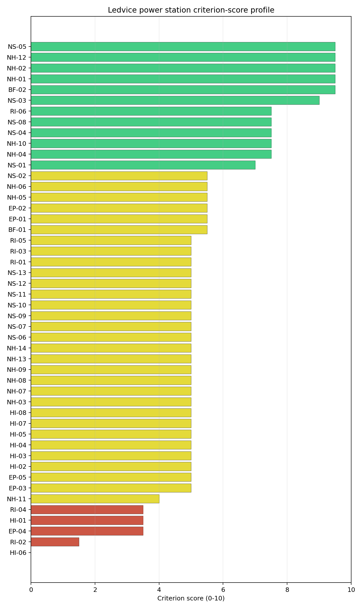
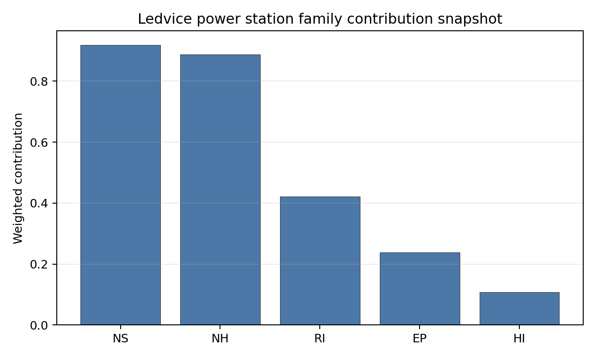

# Ledvice power station Site Profile

Ledvice power station is a coal/thermal site in Czechia that has been tested against the NuScale VOYGR-6 reference deployment envelope. This profile reads the screening evidence at a level that supports a decision to progress toward Stage 3 characterization. It is not a site-suitability determination, vendor recommendation, or licensing finding.

## Site Snapshot

| Field | Value |
| --- | --- |
| Site name | Ledvice power station |
| Coordinates | 50.5766, 13.7798 |
| Subnational unit | Ústí nad Labem |
| Installed thermal capacity (source data) | 990 MW |
| Composite score (baseline weights) | 5.899 (4.264-6.283 MC band) |
| National stability band | B (top-10% hit rate 94%) |
| National rank | 3 |

_See the country status map in_ [Czechia Country Profile](../CZ_country_prototype.md#country-status-map).

## Ownership and Coal-to-Nuclear Context

- **Government of Czech Republic** (69.80% share), headquartered in Czech Republic; immediate operator CEZ AS. Path: Government of Czech Republic  -> Ministry of Finance (Czech Republic)  [100.0%] -> CEZ AS [69.8%] -> Ledvice power station Unit 6 [100.0%]
- **natural person(s)** (13.00% share); immediate operator CEZ AS. Path: natural person(s)  -> CEZ AS [13.0%] -> Ledvice power station Unit 2 [100.0%]
- **small shareholder(s)** (17.00% share); immediate operator CEZ AS. Path: small shareholder(s)  -> CEZ AS [17.0%] -> Ledvice power station Unit 2 [100.0%]
- **CEZ AS** (100.00% share), headquartered in Czech Republic; immediate operator CEZ AS. Path: CEZ AS -> Ledvice power station Unit 6 [100.0%]
- **Ministry of Finance (Czech Republic)** (69.80% share), headquartered in Czech Republic; immediate operator CEZ AS. Path: Ministry of Finance (Czech Republic)  -> CEZ AS [69.8%] -> Ledvice power station Unit 6 [100.0%]

Generating units on record: 2 operating, 2 retired.
Earliest unit commissioning: 1969; most recent: 2020.
Retirements span 2020 to 2020, leaving brownfield grid, water, transport, and workforce assets that materially shorten Stage 3 site preparation.

## Natural Hazards (NH)

- **Seismic: Ground Motion (NH-01)** - score 9.5/10 (MC 9.0-10.0), weight 0.0396, data quality high. Evidence: PGA at 475-year return period 0.016 g; PGA at 2,475-year return period 0.033 g; Vs30 reference (m/s): 760.0.
- **Seismic: Surface Rupture (NH-02)** - score 9.5/10 (MC 9.0-10.0), weight n/a, data quality screening grade. Evidence: nearest mapped capable fault 50.0 km; fault slip rate 0 mm/yr; fault name: none_in_search_radius.
- **Geotechnical: Liquefaction (NH-03)** - score 5.0/10 (MC 5.0-5.0), weight n/a, data quality medium. Evidence: liquefaction susceptibility: high; dominant soil type: loam.
- **Geotechnical: Slope Stability (NH-04)** - score 7.5/10 (MC 7.0-8.0), weight n/a, data quality screening grade. Evidence: site slope 8.04 deg; max slope in 1 km box 83.3 deg; slope stability class: moderate.
- **Geotechnical: Subsidence (NH-05)** - score 5.5/10 (MC 5.0-6.0), weight 0.0308, data quality medium. Evidence: karst present: no; karst severity: none.
- **Geotechnical: Foundation (NH-06)** - score 5.5/10 (MC 5.0-6.0), weight 0.0220, data quality medium. Evidence: bearing capacity 85.3 kPa; depth to bedrock 33.8 m.
- **Volcanism (NH-07)** - score 5.0/10 (MC 5.0-5.0), weight n/a, data quality high. Evidence: volcanic hazard class: negligible.
- **Coastal Flooding (NH-08)** - score 5.0/10 (MC 5.0-5.0), weight 0.0264, data quality low. Evidence: values not in measurement tables.
- **River Flooding (NH-09)** - score 5.0/10 (MC 5.0-5.0), weight 0.0352, data quality insufficient. Evidence: flood zone class: negligible.
- **Extreme Winds (NH-10)** - score 7.5/10 (MC 7.0-8.0), weight n/a, data quality medium. Evidence: design wind speed 10.5 m/s.
- **Extreme Precipitation (NH-11)** - score 4.0/10 (MC 4.0-4.0), weight 0.0132, data quality medium. Evidence: extreme daily precipitation 0.15 mm; mean annual precipitation 20.3 mm/yr.
- **Extreme Temperatures (NH-12)** - score 9.5/10 (MC 9.0-10.0), weight 0.0176, data quality medium. Evidence: extreme high temperature 23.0 deg C; extreme low temperature -5.68 deg C.
- **Forest/Wildfire (NH-13)** - score 5.0/10 (MC 5.0-5.0), weight 0.0132, data quality n/a. Evidence: values not in measurement tables.
- **Combined Hazards (NH-14)** - score 5.0/10 (MC 5.0-5.0), weight 0.0132, data quality n/a. Evidence: values not in measurement tables.

### Interpretation - Natural Hazards (NH)

<!-- specialist key=family_natural_hazards scope=site site_id=2fe0a0b3-4108-427e-8e54-f77e1ea7227c bundle=CZ_ledvice_power_station_site_bundle.json status=filled by=cursor-agent filled_at=2026-05-03T15:53:55Z -->
Natural hazards at Ledvice sit in the same Bohemian-Massif very-low-seismic envelope observed at Tušimice and Pocerady, on a similarly gentle northern-Bohemian lignite-belt plain, with the deepest unconsolidated cover of the first-batch cohort. PGA at the 475-yr return period is **0.016 g** and at the 2,475-yr return period is **0.033 g**, the lowest seismic loading of the first-batch cohort observed (marginally lower than Pocerady's 0.017 g and Tušimice's 0.022 g) and at the floor of the relevant European seismic envelope; the nearest mapped capable fault is null inside the 50 km screening search radius (NH-02 at 9.5/10, NH-01 at 9.5/10). Geotechnical conditions are middle-band: loam soils with a `high` liquefaction susceptibility (NH-03 at 5.0/10), screening-proxy bearing capacity 85.3 kPa and **depth to bedrock 33.8 m** (the deepest unconsolidated cover of the first-batch cohort, materially deeper than Pocerady's 27.6 m and a feature of the deep northern-Bohemian alluvial basin). NH-04 reads 7.5/10 with a mean site slope of 8.04° on a `moderate` slope-stability class. NH-05 reads 5.5/10 with `karst not present` and `none` severity, the cleanest of the three first-batch CZ sites on subsidence (the buildable patch sits clear of the active lignite-mining cadastre that drives Pocerady's NH-05 read). NH-06 holds at 5.5/10 on the moderate-cover read against the 33.8 m depth. Extreme meteorology is at the elevated end of the calm cohort: a 50-yr design wind of **10.5 m/s** and an extreme temperature range of -5.68 °C to 23.0 °C are inside the project envelope (NH-10 at 7.5/10, NH-12 at 9.5/10). NH-11 reads 4.0/10 on the screening proxy with the same unit-mismatch artefact observed across the cohort. NH-09 holds at 5.0/10 on `insufficient` data quality. NH-07, NH-08 and NH-13 carry `inconclusive` avoidance verdicts. The Stage 3 priority order is therefore: drill a focused borehole programme on the buildable patch to convert the 33.8 m screening depth-to-bedrock figure to a measured competent-rock depth and a bearing-capacity profile suitable for the project foundation envelope; commission a Bílina design-basis-flood study so NH-09 lifts off the `insufficient` quality flag; and run a CPT campaign so NH-03 settles on a measured liquefaction-susceptibility value rather than the screening proxy on the deep alluvial cover.
<!-- /specialist key=family_natural_hazards -->

## Human-Induced and Security-Relevant Hazards (HI)

- **Aircraft Crash (HI-01)** - score 3.5/10 (MC 3.0-4.0), weight 0.0308, data quality high. Evidence: nearest airport 0.33 km; nearest flight path 0.33 km; airports within search radius 18; airport name: Lednice Power Station Heliport; airport type: heliport.
- **Industrial Explosions (HI-02)** - score 5.0/10 (MC 5.0-5.0), weight 0.0308, data quality medium. Evidence: values not in measurement tables.
- **Toxic/Gas Releases (HI-03)** - score 5.0/10 (MC 5.0-5.0), weight 0.0308, data quality medium. Evidence: values not in measurement tables.
- **External Fires (HI-04)** - score 5.0/10 (MC 5.0-5.0), weight 0.0264, data quality medium. Evidence: values not in measurement tables.
- **Transport Hazards (HI-05)** - score 5.0/10 (MC 5.0-5.0), weight 0.0264, data quality n/a. Evidence: values not in measurement tables.
- **Military Installations (HI-06)** - score 0.0/10 (MC 0.0-0.0), weight 0.0264, data quality high. Evidence: nearest military installation 2.11 km; military installations within radius 31; installation name: XI./150a/B -.
- **Electromagnetic Interference (HI-07)** - score 5.0/10 (MC 5.0-5.0), weight 0.0088, data quality medium. Evidence: nearest high-power transmitter 0.42 km; transmitters within radius 211; transmitter type: tower.
- **Other Nuclear Installations (HI-08)** - score 5.0/10 (MC 5.0-5.0), weight 0.0132, data quality n/a. Evidence: values not in measurement tables.

### Interpretation - Human-Induced and Security-Relevant Hazards (HI)

<!-- specialist key=family_human_hazards scope=site site_id=2fe0a0b3-4108-427e-8e54-f77e1ea7227c bundle=CZ_ledvice_power_station_site_bundle.json status=filled by=cursor-agent filled_at=2026-05-03T15:53:55Z -->
Human-induced and security-relevant hazards at Ledvice carry the closest aviation feature observed across any first-batch site and the heaviest combined HI-06 / HI-07 envelope, dominated by the Most-Žatec defence corridor and the dense local broadcast estate. The nearest civilian air feature is the **Lednice Power Station Heliport at 0.33 km** (essentially co-located with the existing thermal complex), with the nearest flight-path projection at 0.33 km (deep inside the SSG-35 A4 4 km flight-path screening trigger), and **18 air features inside the 30 km screening radius**. HI-01 settles at 3.5/10 on the heliport-proximity trigger; the on-site heliport is almost certainly an emergency-response feature serving the existing thermal complex and the SSG-79 hazard assessment will read it as a low-energy sub-class with a known traffic profile (operator-controlled, no scheduled flights), but the screening flag still needs to be retired through a project-specific assessment before the site can move beyond the screening stage. The dominant criterion in the family is **Military Installations (HI-06)** at **0.0/10**: the nearest military feature is at **2.11 km** (well inside the 8 km project A6 ammunition-storage avoidance trigger and inside the 5 km regulatory floor for sensitive military estate) with **31 military features inside the 25 km screening radius** (the second-heaviest count after Pocerady's 47). The 2.11 km nearest-feature distance is the binding HI-06 read of the first-batch cohort: unlike Pocerady where the nearest feature sits at 7.94 km, Ledvice cannot lift the criterion through a stand-off engineering response; the binding question is whether the 2.11 km feature can be relocated, reclassified, or whether the buildable patch can be relocated within the existing thermal-complex envelope to clear the 5 km regulatory floor. **HI-02 Industrial Explosions, HI-03 Toxic / Gas Releases, HI-04 External Fires and HI-05 Transport Hazards** all sit at the pass-mark default of 5.0/10 on the same screening under-detection observed across the CZ cohort. HI-07 Electromagnetic Interference scores 5.0/10 with the nearest mast at 0.42 km and **211 transmitters inside the EMI search radius** (the densest broadcast environment of the first-batch cohort by a margin, materially heavier than Pocerady's 147). HI-08 (Other Nuclear Installations) is null. The Stage 3 priority order is therefore: open the Czech Ministry of National Defence engagement on the 2.11 km HI-06 feature with the explicit question of whether it can be relocated or whether the buildable patch can be moved within the existing thermal-complex envelope; commission an SSG-79 aircraft-crash hazard assessment for the on-site heliport; and run a project EMC survey against the 211-transmitter cadastre.
<!-- /specialist key=family_human_hazards -->

## Radiological Impact and Emergency Planning (RI / EP)

- **Emergency Planning Feasibility (EP-01)** - score 5.5/10 (MC 5.0-6.0), weight n/a, data quality high. Evidence: EP feasibility composite 45.5 /100; road sub-score 74.4 /100; special-population sub-score 90.0 /100; geography sub-score 95.0 /100; population sub-score 60.0 /100; evacuation feasible: yes.
- **Evacuation Routes (EP-02)** - score 5.5/10 (MC 5.0-6.0), weight 0.0264, data quality medium. Evidence: road density in EPZ 0.975 km/km2; road length in EPZ 1,914 km; motorway access: yes.
- **Physical Geography Constraints (EP-03)** - score 5.0/10 (MC 5.0-5.0), weight 0.0220, data quality medium. Evidence: waterways crossing EPZ 0; major river barrier: no.
- **Special Populations (EP-04)** - score 3.5/10 (MC 3.0-4.0), weight 0.0264, data quality medium. Evidence: hospitals in EPZ 22; prisons in EPZ 2; care homes in EPZ 2.
- **Concurrent Hazard Impact (EP-05)** - score 5.0/10 (MC 5.0-5.0), weight 0.0176, data quality n/a. Evidence: values not in measurement tables.
- **Atmospheric Dispersion (RI-01)** - score 5.0/10 (MC 5.0-5.0), weight 0.0264, data quality medium. Evidence: annual mean wind speed 1.22 m/s; atmospheric mixing height 556.0 m; prevailing wind direction: W.
- **Surface Water Dispersion (RI-02)** - score 1.5/10 (MC 1.0-2.0), weight 0.0220, data quality n/a. Evidence: values not in measurement tables.
- **Groundwater Dispersion (RI-03)** - score 5.0/10 (MC 5.0-5.0), weight 0.0220, data quality medium. Evidence: aquifer type: low permeability.
- **Population Density at EPZ Radii (RI-04)** - score 3.5/10 (MC 3.0-4.0), weight 0.0352, data quality screening grade. Evidence: population density within 5 km 345.7 /km2; population density within 16 km 293.0 /km2; population density within 25 km 217.9 /km2; population density within 80 km 243.7 /km2; population within 25 km 427,866 people.
- **Distance to Population Centres (RI-05)** - score 5.0/10 (MC 5.0-5.0), weight 0.0441, data quality screening grade. Evidence: nearest city above 50k people 13.6 km; nearest city population 62,866 people; city name: Most.
- **Population Projections (RI-06)** - score 7.5/10 (MC 7.0-8.0), weight 0.0220, data quality screening grade. Evidence: annual population growth rate -0.155 %/yr; projected population at 25 km in 60 yr 412,310 people.

### Interpretation - Radiological Impact and Emergency Planning (RI / EP)

<!-- specialist key=family_radiological_emergency scope=site site_id=2fe0a0b3-4108-427e-8e54-f77e1ea7227c bundle=CZ_ledvice_power_station_site_bundle.json status=filled by=cursor-agent filled_at=2026-05-03T15:53:55Z -->
Radiological impact and emergency planning at Ledvice carry the heaviest population envelope of any first-batch site by a clear margin, with the binding case driven by the densely populated Bílina-Most-Teplice corridor. Population density at the screening epoch is **345.7 p/km² at 5 km, 293.0 p/km² at 16 km, 217.9 p/km² at 25 km and 243.7 p/km² at 80 km**, with a 25 km total of **427,866 people** (the highest 25 km total of any first-batch site, materially above Pocerady's 310,916 and the binding population case for the site); the nearest city above 50,000 people is **Most at 13.6 km (population 62,866)**, well inside the 25 km EPZ envelope, with Teplice and Bílina also inside the EPZ. Trajectory is mildly favourable: a -0.155 %/yr regional growth rate (the slowest decline of the first-batch cohort) yields a 25 km projection of 412,310 people in 60 years (down only 4 % from the screening epoch), which lifts RI-06 to 7.5/10. Under the screening hierarchy the 5 km density of 345.7 p/km² is in the urban band, and **RI-04 reads 3.5/10** as the binding population finding. The atmospheric envelope is calm with a directional bias: the screening reanalysis gives a mean wind speed of 1.22 m/s, a prevailing direction of W (toward Most-Chomutov), and a mean planetary boundary-layer height of 556 m, holding RI-01 at 5.0/10 (the prevailing-W direction with the dominant population centres in the W and N-W is a project EIA question for the source-term placement). Aquifer type is `low permeability`, holding RI-03 at 5.0/10. **RI-02 Surface Water Dispersion** at **1.5/10** holds at the screening floor pending a measured Bílina dilution flow at the cooling-source discharge point (the screening cooling-source assignment to the Bílina at 3.93 m³/s is one of the lowest measured flows in the cohort, which is consistent with the RI-02 floor read). The principal emergency-planning finding is **EP-04 Special Populations at 3.5/10**: the EPZ contains **22 hospitals, 2 prisons and 2 care homes**, matching Pocerady's hospital count but with a heavier care-home read. EP-02 reads 5.5/10 with road density 0.975 km/km² over 1,914 km of road (the densest road network of the first-batch cohort, marginally above Pocerady's 1,818 km), and the EP-01 composite reads 45.5/100 (FEASIBLE but the lowest of the CZ cohort). The Stage 3 priority order is therefore: model the EPZ time-to-clear under summer/winter loadings using Czech national emergency-planning traffic data with explicit modelling of the Bílina-Most-Teplice urban evacuation surge (the binding RI-04 case) and the 22-hospital + 2-prison + 2-care-home special-population surge; consider a smaller VOYGR-4 deployment to reduce the source-term envelope; source the Bílina dilution flow at the cooling-source discharge point so RI-02 lifts off the floor; and confirm the prevailing-W direction does not place Most-Bílina in the source-term plume sector under reasonable atmospheric conditions.
<!-- /specialist key=family_radiological_emergency -->

## Non-Safety and Implementation Considerations (NS)

- **Grid Capacity Basic Filter (BF-01)** - score 5.5/10 (MC 5.0-6.0), weight 0.0352, data quality n/a. Evidence: values not in measurement tables.
- **Land Area Basic Filter (BF-02)** - score 9.5/10 (MC 9.0-10.0), weight 0.0220, data quality n/a. Evidence: values not in measurement tables.
- **Cooling Water Availability (NS-01)** - score 7.0/10 (MC 6.0-7.0), weight n/a, data quality screening grade. Evidence: distance to cooling source 0.96 km; cooling source flow 3.93 m3/s; cooling source type: small_river; cooling source name: Bílina; water stress label: Low.
- **Grid Connection (NS-02)** - score 5.5/10 (MC 5.0-6.0), weight 0.0352, data quality medium. Evidence: nearest substation 0.55 km; nearest high-voltage line 0.16 km; highest nearby line voltage 110.0 kV; grid export capacity 770.0 MW; substations within radius 0; HV lines within radius 0.
- **Transport Access (NS-03)** - score 9.0/10 (MC 8.0-9.0), weight 0.0352, data quality high. Evidence: nearest highway 0.52 km; nearest rail line 0.17 km; heavy-haul capable: yes.
- **Site Topography (NS-04)** - score 7.5/10 (MC 7.0-8.0), weight 0.0264, data quality high. Evidence: favourable land cover 78.5 %; moderate land cover 10.1 %; unfavourable land cover 10.9 %; favourable area 149.9 ha; dominant land class: 231.
- **Site Footprint Adequacy (NS-05)** - score 9.5/10 (MC 9.0-10.0), weight 0.0220, data quality medium. Evidence: buildable area 116.8 ha; largest contiguous patch 89.5 ha; buildable patch count 15.
- **Existing Infrastructure (NS-06)** - score 5.0/10 (MC 5.0-5.0), weight 0.0220, data quality n/a. Evidence: values not in measurement tables.
- **Environmental Impact (non-rad) (NS-07)** - score 5.0/10 (MC 5.0-5.0), weight 0.0220, data quality n/a. Evidence: values not in measurement tables.
- **Ecological Sensitivity (NS-08)** - score 7.5/10 (MC 7.0-8.0), weight n/a, data quality high. Evidence: natural land cover 10.9 %; distance to nearest Natura 2000 site 4.797 km; distance to nearest protected area 2.696 km; Natura 2000 overlap: no; Natura 2000 sensitivity class: low; protected-area overlap: no; protected-area sensitivity class: moderate; nearest Natura 2000 site: Bořeň; Natura 2000 sites within 5 km: 1; nearest protected-area designation: Nature Monument.
- **Socioeconomic Impact (NS-09)** - score 5.0/10 (MC 5.0-5.0), weight 0.0220, data quality n/a. Evidence: values not in measurement tables.
- **Workforce Availability (NS-10)** - score 5.0/10 (MC 5.0-5.0), weight 0.0176, data quality n/a. Evidence: values not in measurement tables.
- **Coal-to-Nuclear Synergies (NS-11)** - score 5.0/10 (MC 5.0-5.0), weight 0.0264, data quality n/a. Evidence: values not in measurement tables.
- **Regulatory/Political Environment (NS-12)** - score 5.0/10 (MC 5.0-5.0), weight 0.0264, data quality n/a. Evidence: values not in measurement tables.
- **Construction Logistics (NS-13)** - score 5.0/10 (MC 5.0-5.0), weight 0.0176, data quality n/a. Evidence: values not in measurement tables.

### Interpretation - Non-Safety and Implementation Considerations (NS)

<!-- specialist key=family_infrastructure scope=site site_id=2fe0a0b3-4108-427e-8e54-f77e1ea7227c bundle=CZ_ledvice_power_station_site_bundle.json status=filled by=cursor-agent filled_at=2026-05-03T15:53:55Z -->
Non-safety implementation at Ledvice carries the same northern-Bohemian land-cover and footprint advantages as Tušimice and Pocerady but with a materially weaker grid-connection envelope (110 kV / 770 MW vs the 400 kV / ≥800 MW envelopes at the other two CZ sites) that will require a Stage 3 transmission upgrade dialogue. **NS-03 Transport Access** scores **9.0/10** with the nearest highway at 0.52 km, the nearest rail line at 0.17 km and `heavy-haul capable: yes`; the dense Most-Chomutov motorway corridor is a structural advantage for the over-dimensioned reactor-vessel transport. **NS-04 Site Topography** scores 7.5/10 with **78.5 % favourable land cover** within the 2 km screening radius, 10.1 % moderate cover and 10.9 % unfavourable cover. **NS-05 Site Footprint Adequacy** scores 9.5/10 with a buildable area of 116.8 ha (largest contiguous patch 89.5 ha across 15 patches). **NS-01 Cooling Water Availability** scores 7.0/10: the nearest perennial flow is the Bílina at 0.96 km with a flow of **3.93 m³/s** (an order of magnitude below the Lužický potok at Tušimice and the Počeradský potok at Pocerady) and a `Low` water-stress label; the low Bílina flow is the principal Stage 3 cooling question, requiring either a closed-cycle cooling-tower configuration or a long pipeline from the Ohře. **NS-08 Ecological Sensitivity** scores 7.5/10 with the nearest Natura 2000 site (Bořeň) at 4.80 km with sensitivity class `low`, the nearest non-Natura protected area at 2.70 km with sensitivity class `moderate` (a Nature Monument designation), and 1 Natura 2000 site within 5 km (the cleanest ecological envelope of the three first-batch CZ sites). The principal Stage 3 question is **NS-02 Grid Connection** at 5.5/10: the nearest substation is at 0.55 km and the nearest high-voltage line at 0.16 km, but the highest nearby line voltage is only **110 kV** and the screening grid-export-capacity figure of 770 MW is below the 308–462 MWe net of a NuScale VOYGR-6 deployment when the existing thermal complex is offline; the 0 substations and 0 HV lines inside the 25 km screening radius reflects the absence of higher-voltage transmission backbone in the immediate vicinity even though the wider northern-Bohemian 400 kV grid passes through the corridor. NS-02 is the principal implementation question: a 110→400 kV substation upgrade would unlock the connection and is a routine grid-operator dialogue rather than a stopper, but the upgrade is more demanding than the equivalent question at Vidin Works because the project capacity envelope is larger (VOYGR-6 vs VOYGR-4 at the smaller BG site). The Stage 3 priority order is therefore: open the Czech transmission-system-operator dialogue on a 110→400 kV upgrade at the Ledvice substation so NS-02 lifts off the screening read; confirm the Bílina cooling-water allocation under climate-projected low-flow conditions and scope a closed-cycle alternative; and scope the appropriate-assessment for the Bořeň Nature Monument under the project EIA.
<!-- /specialist key=family_infrastructure -->

## Composite Score and Stability

Baseline composite score is 5.899, bracketed by Monte Carlo at 4.264-6.283. National stability band is `B` with a top-10% hit rate of 94% across 16 scored Monte Carlo scenarios.

<!-- specialist key=stability scope=site site_id=2fe0a0b3-4108-427e-8e54-f77e1ea7227c bundle=CZ_ledvice_power_station_site_bundle.json status=filled by=cursor-agent filled_at=2026-05-03T15:53:55Z -->
Ledvice sits at national rank 3 in the Czech cohort with a **B-band** stability across the 10,000-iteration sensitivity sweep, weaker than Tušimice's A band but stronger than Pocerady's C band. The composite score of 5.899 (MC band 4.264–6.283) places it just below Pocerady (5.970) and Tušimice (6.089), and the band rank tells the executive reader that the site is robust to weight perturbations within the screening method: the 94 % top-10 % hit rate across all 16 scored Monte Carlo scenarios indicates the site stays in the upper national tail under nearly all plausible re-weightings, and the 38 % top-5 % hit rate is materially above Pocerady's 12 %. Family-level normalised contributions show non-safety implementation as the dominant positive (mean 0.64, anchored by NS-03 transport, NS-05 footprint and NS-04 land cover), with natural hazards (0.63, anchored by the very-low PGA seismic envelope) close behind, while radiological (0.47) and human-induced (0.42, the lowest read of the first-batch cohort) act as the relative drags. The top contributing criteria mirror this pattern: NH-01 Seismic Ground Motion (the strongest single contributor at 0.38 contrib weight), NS-03 Transport Access (0.32, the strongest transport read of the CZ cohort), BF-02 Land Area, NS-05 Site Footprint and NS-04 Site Topography all push toward the FAVOURABLE band, while HI-06 Military Installations (the binding read at 0.0/10 with the 2.11 km nearest feature), RI-02 Surface Water Dispersion (the second binding read at 1.5/10), HI-01 Aircraft Crash, EP-04 Special Populations and RI-04 Population Density all act as binding drags. The B band is the structural read of the site: relative to Pocerady, Ledvice carries the heavier population envelope but the cleaner subsidence read; relative to Tušimice it carries the heavier HI-06 read and the lower-voltage grid connection. The Stage 3 work that would tighten the composite uncertainty band most quickly is the HI-06 MoD engagement on the 2.11 km feature and the RI-02 Bílina dilution-flow measurement.
<!-- /specialist key=stability -->

## Residual Risk Register

<!-- specialist key=residual_risk scope=site site_id=2fe0a0b3-4108-427e-8e54-f77e1ea7227c bundle=CZ_ledvice_power_station_site_bundle.json status=filled by=cursor-agent filled_at=2026-05-03T15:53:55Z -->
| Criterion | Description | Owner | Resolution path |
|---|---|---|---|
| HI-06 | 31 military features inside the 25 km screening radius (2.11 km nearest, well inside the 8 km project A6 ammunition-storage avoidance trigger and inside the 5 km regulatory floor). | Czech Ministry of National Defence | Engage on the 2.11 km feature with the explicit question of whether it can be relocated or whether the buildable patch can be moved within the existing thermal-complex envelope to clear the 5 km regulatory floor. |
| HI-01 | Lednice Power Station Heliport at 0.33 km (essentially co-located), with the nearest flight-path projection at 0.33 km (deep inside the SSG-35 A4 4 km flight-path screening trigger); 18 air features inside the 30 km radius. | Aviation safety specialist | SSG-79 aircraft-crash hazard assessment for the on-site heliport with operator engagement to confirm the traffic profile. |
| RI-04 | 427,866 people inside the 25 km EPZ (the highest 25 km total of any first-batch site), 345.7 p/km² at 5 km (urban band), dominated by the Bílina-Most-Teplice corridor. | Project radiation protection specialist | Source-term placement and atmospheric dispersion modelling against the prevailing-W direction; consider a smaller VOYGR-4 deployment to reduce the source-term envelope. |
| EP-04 | 22 hospitals, 2 prisons and 2 care homes inside the EPZ. | National emergency planner | Hospital, prison and care-home evacuation plans under sheltering and relocation scenarios. |
| RI-02 | Surface-water dispersion held at 1.5/10 on the screening floor; cooling source Bílina at 3.93 m³/s (an order of magnitude below the cooling sources at the other CZ sites). | Hydrologist | Source the Bílina dilution flow at the cooling-source discharge point; consider closed-cycle cooling-tower configuration. |
| NS-02 | Highest nearby line voltage 110 kV; estimated grid-export capacity 770 MW; 0 substations and 0 HV lines inside the 25 km screening radius (despite the wider northern-Bohemian 400 kV grid passing through the corridor). | Czech transmission system operator | 110→400 kV upgrade at the Ledvice substation. |
| NS-01 | Bílina cooling source flow 3.93 m³/s, an order of magnitude below the cooling sources at Tušimice and Pocerady. | Hydrologist; project water engineer | Confirm Bílina allocation under climate-projected low-flow conditions; scope a closed-cycle / cooling-tower secondary option or a long pipeline from the Ohře. |
| HI-07 | 211 transmitters inside the EMI search radius (the densest broadcast environment of the first-batch cohort), nearest mast at 0.42 km. | Project EMC specialist | Project EMC survey against the 211-transmitter cadastre. |
| NH-03 | Liquefaction susceptibility `high` on loam soils with 33.8 m unconsolidated cover (the deepest of the first-batch cohort). | Geotechnical engineer | CPT campaign to settle on a measured susceptibility value rather than the screening proxy. |
| NH-06 | Depth to bedrock 33.8 m (the deepest unconsolidated cover of the first-batch cohort) on screening-grade quality. | Geotechnical engineer | Drill a focused borehole programme on the buildable patch to convert the screening depth to a measured competent-rock depth and a bearing-capacity profile. |
| NS-08 | Bořeň Nature Monument at 2.70 km (sensitivity class `moderate`); Bořeň Natura 2000 site at 4.80 km (sensitivity class `low`). | Project ecologist | Appropriate-assessment for the Bořeň Nature Monument under the project EIA. |
<!-- /specialist key=residual_risk -->

## Stage 3 Follow-Up Checklist

- [ ] Resolve **Aircraft Crash (HI-01)** avoidance flag - measured {"flight_path_distance_km": 0.33, "under_flight_path": false} vs threshold A4 — SSG-35: flight-path overhead / < 4 km from airway..
- [ ] Re-measure **Military Installations (HI-06)** - native score 0.0/10 with confidence high.
- [ ] Re-measure **Surface Water Dispersion (RI-02)** - native score 1.5/10 with confidence insufficient.
- [ ] Re-measure **Special Populations (EP-04)** - native score 3.5/10 with confidence medium.
- [ ] Re-measure **Aircraft Crash (HI-01)** - native score 3.5/10 with confidence high.
- [ ] Re-measure **Population Density at EPZ Radii (RI-04)** - native score 3.5/10 with confidence medium.
- [ ] Improve data quality for **Coastal Flooding (NH-08)** - current flag `low`.

## Evidence Limitations

- Coastal Flooding (NH-08) - quality `low`.
