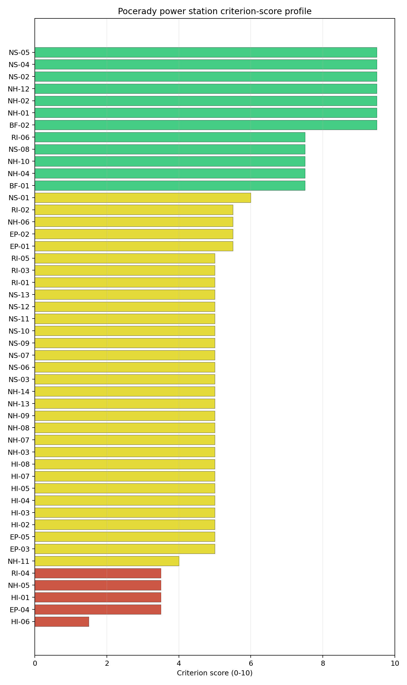
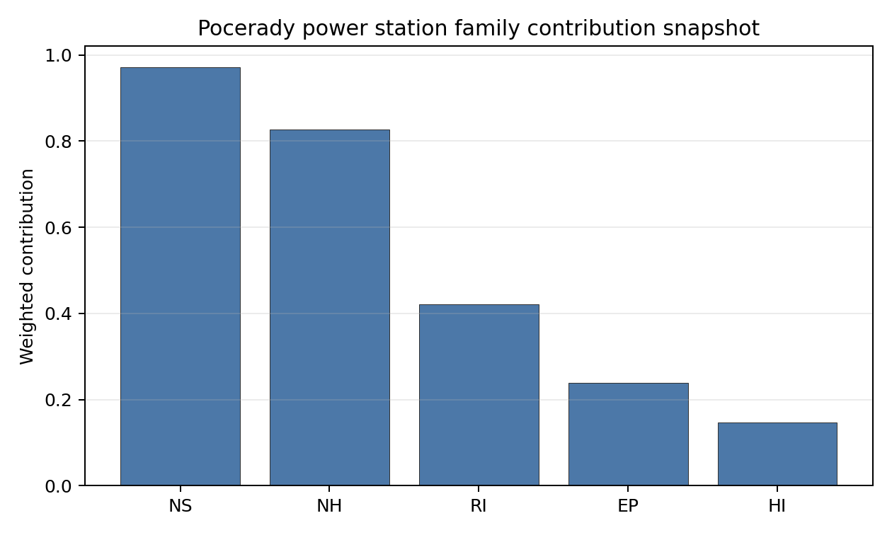

# Pocerady power station Site Profile

Pocerady power station is a coal/thermal site in Czechia that has been tested against the NuScale VOYGR-6 reference deployment envelope. This profile reads the screening evidence at a level that supports a decision to progress toward Stage 3 characterization. It is not a site-suitability determination, vendor recommendation, or licensing finding.

## Site Snapshot

| Field | Value |
| --- | --- |
| Site name | Pocerady power station |
| Coordinates | 50.4267, 13.6747 |
| Subnational unit | Ustecky |
| Installed thermal capacity (source data) | 1,000 MW |
| Composite score (baseline weights) | 5.970 (4.295-6.384 MC band) |
| National stability band | C (top-10% hit rate 75%) |
| National rank | 2 |

_See the country status map in_ [Czechia Country Profile](../CZ_country_prototype.md#country-status-map).

## Ownership and Coal-to-Nuclear Context

- **natural person(s)** (100.00% share); immediate operator Sev.en Energy AG. Path: natural person(s)  -> Sev.en Energy AG [100.0%] -> Pocerady power station Phase 2 Unit 2 [100.0%]
- **Sev.en Energy AG** (100.00% share), headquartered in Liechtenstein; immediate operator Sev.en Energy AG. Path: Sev.en Energy AG -> Pocerady power station Phase 1 Unit 4 [100.0%]

Generating units on record: 5 operating.
Earliest unit commissioning: 1970; most recent: 1977.

## Natural Hazards (NH)

- **Seismic: Ground Motion (NH-01)** - score 9.5/10 (MC 9.0-10.0), weight 0.0396, data quality high. Evidence: PGA at 475-year return period 0.017 g; PGA at 2,475-year return period 0.034 g; Vs30 reference (m/s): 760.0.
- **Seismic: Surface Rupture (NH-02)** - score 9.5/10 (MC 9.0-10.0), weight n/a, data quality screening grade. Evidence: nearest mapped capable fault 50.0 km; fault slip rate 0 mm/yr; fault name: none_in_search_radius.
- **Geotechnical: Liquefaction (NH-03)** - score 5.0/10 (MC 5.0-5.0), weight n/a, data quality medium. Evidence: liquefaction susceptibility: high; dominant soil type: clay_loam.
- **Geotechnical: Slope Stability (NH-04)** - score 7.5/10 (MC 7.0-8.0), weight n/a, data quality screening grade. Evidence: site slope 7.54 deg; max slope in 1 km box 83.4 deg; slope stability class: moderate.
- **Geotechnical: Subsidence (NH-05)** - score 3.5/10 (MC 3.0-4.0), weight 0.0308, data quality medium. Evidence: karst present: no; karst severity: none.
- **Geotechnical: Foundation (NH-06)** - score 5.5/10 (MC 5.0-6.0), weight 0.0220, data quality medium. Evidence: bearing capacity 84.0 kPa; depth to bedrock 27.6 m.
- **Volcanism (NH-07)** - score 5.0/10 (MC 5.0-5.0), weight n/a, data quality high. Evidence: volcanic hazard class: negligible.
- **Coastal Flooding (NH-08)** - score 5.0/10 (MC 5.0-5.0), weight 0.0264, data quality low. Evidence: values not in measurement tables.
- **River Flooding (NH-09)** - score 5.0/10 (MC 5.0-5.0), weight 0.0352, data quality insufficient. Evidence: flood zone class: negligible.
- **Extreme Winds (NH-10)** - score 7.5/10 (MC 7.0-8.0), weight n/a, data quality medium. Evidence: design wind speed 10.5 m/s.
- **Extreme Precipitation (NH-11)** - score 4.0/10 (MC 4.0-4.0), weight 0.0132, data quality medium. Evidence: extreme daily precipitation 0.15 mm; mean annual precipitation 20.3 mm/yr.
- **Extreme Temperatures (NH-12)** - score 9.5/10 (MC 9.0-10.0), weight 0.0176, data quality medium. Evidence: extreme high temperature 23.0 deg C; extreme low temperature -5.68 deg C.
- **Forest/Wildfire (NH-13)** - score 5.0/10 (MC 5.0-5.0), weight 0.0132, data quality n/a. Evidence: values not in measurement tables.
- **Combined Hazards (NH-14)** - score 5.0/10 (MC 5.0-5.0), weight 0.0132, data quality n/a. Evidence: values not in measurement tables.

### Interpretation - Natural Hazards (NH)

<!-- specialist key=family_natural_hazards scope=site site_id=32484f7b-18a4-4b21-8e6a-6d68ae099d02 bundle=CZ_pocerady_power_station_site_bundle.json status=filled by=cursor-agent filled_at=2026-05-03T15:49:38Z -->
Natural hazards at Pocerady sit in the same Bohemian-Massif very-low-seismic envelope as Tušimice, on a similarly gentle northern-Bohemian lignite-belt plain, with one binding subsidence finding driven by the regional karst-and-mining context. PGA at the 475-yr return period is **0.017 g** and at the 2,475-yr return period is **0.034 g**, the lowest seismic loading of the cohort observed (marginally lower than Tušimice's 0.022 g) and at the floor of the relevant European seismic envelope; the nearest mapped capable fault is null inside the 50 km screening search radius (NH-02 at 9.5/10, NH-01 at 9.5/10). Geotechnical conditions are middle-to-favourable: clay-loam soils with a `high` liquefaction susceptibility (NH-03 at 5.0/10), screening-proxy bearing capacity 84.0 kPa and depth to bedrock 27.6 m (the deepest unconsolidated cover of the first-batch cohort, a feature of the lignite-basin alluvium). NH-04 reads 7.5/10 with a mean site slope of 7.54° on a `moderate` slope-stability class. The principal natural-hazard finding is **NH-05 Geotechnical: Subsidence at 3.5/10**: karst is `not present` and karst severity is `none` at the centroid, so the score is driven by the broader northern-Bohemian lignite-mining and undermining context rather than by a positive karst feature; the Pocerady plant sits adjacent to the active Vršany / ČSA lignite-mining basin and the regional subsidence read is the binding Stage 3 question for the foundation envelope. Extreme meteorology is at the elevated end of the calm cohort: a 50-yr design wind of **10.5 m/s** and an extreme temperature range of -5.68 °C to 23.0 °C are inside the project envelope (NH-10 at 7.5/10, NH-12 at 9.5/10). NH-11 reads 4.0/10 on the screening proxy with the same unit-mismatch artefact observed across the cohort. NH-09 holds at 5.0/10 on `insufficient` data quality. The Stage 3 priority order is therefore: commission a site-specific subsidence and undermining survey on the buildable patch with respect to the Vršany / ČSA lignite-mining cadastre so NH-05 lifts off the regional read; run a CPT campaign so NH-03 settles on a measured liquefaction-susceptibility value rather than the screening proxy on the deep alluvial cover; and replace the screening precipitation reading with national meteorological station data.
<!-- /specialist key=family_natural_hazards -->

## Human-Induced and Security-Relevant Hazards (HI)

- **Aircraft Crash (HI-01)** - score 3.5/10 (MC 3.0-4.0), weight 0.0308, data quality high. Evidence: nearest airport 6.03 km; nearest flight path 3.01 km; airports within search radius 21; airport name: Rana Loumy Airfield; airport type: small_airport.
- **Industrial Explosions (HI-02)** - score 5.0/10 (MC 5.0-5.0), weight 0.0308, data quality medium. Evidence: values not in measurement tables.
- **Toxic/Gas Releases (HI-03)** - score 5.0/10 (MC 5.0-5.0), weight 0.0308, data quality medium. Evidence: values not in measurement tables.
- **External Fires (HI-04)** - score 5.0/10 (MC 5.0-5.0), weight 0.0264, data quality medium. Evidence: values not in measurement tables.
- **Transport Hazards (HI-05)** - score 5.0/10 (MC 5.0-5.0), weight 0.0264, data quality n/a. Evidence: values not in measurement tables.
- **Military Installations (HI-06)** - score 1.5/10 (MC 1.0-2.0), weight 0.0264, data quality medium. Evidence: nearest military installation 7.94 km; military installations within radius 47; installation name: C-13/19/A-200 Z.
- **Electromagnetic Interference (HI-07)** - score 5.0/10 (MC 5.0-5.0), weight 0.0088, data quality medium. Evidence: nearest high-power transmitter 3.67 km; transmitters within radius 147; transmitter type: mast.
- **Other Nuclear Installations (HI-08)** - score 5.0/10 (MC 5.0-5.0), weight 0.0132, data quality n/a. Evidence: values not in measurement tables.

### Interpretation - Human-Induced and Security-Relevant Hazards (HI)

<!-- specialist key=family_human_hazards scope=site site_id=32484f7b-18a4-4b21-8e6a-6d68ae099d02 bundle=CZ_pocerady_power_station_site_bundle.json status=filled by=cursor-agent filled_at=2026-05-03T15:49:38Z -->
Human-induced and security-relevant hazards at Pocerady carry the heaviest combined HI-01 + HI-06 read of any first-batch site, dominated by the dense northern-Bohemian airfield cadastre and the Czech Air Force estate around the Most-Žatec corridor. The nearest civilian airport is the **Rana Loumy Airfield (`small_airport`) at 6.03 km**, deep inside the SSG-35 A1 screening exclusion radius for general-aviation airfields under 10 km, with the nearest flight-path projection at **3.01 km** (also inside the SSG-35 A4 4 km flight-path screening trigger), and **21 air features inside the 30 km screening radius** (the highest civilian count of any first-batch site, reflecting the dense glider-and-microlight estate of the northern-Bohemian plain). HI-01 settles at 3.5/10 on the dual airport-distance and flight-path triggers; the criterion is the principal aviation question for the site, requiring an SSG-79 hazard assessment for the Rana Loumy Airfield and the wider Praha-Karlovy Vary corridor. The dominant criterion in the family is **Military Installations (HI-06)** at **1.5/10**: the nearest military feature is at 7.94 km (just inside the 8 km project A6 ammunition-storage avoidance trigger) with **47 military features inside the 25 km screening radius** (an order of magnitude above any other first-batch site, reflecting the legacy Most-Žatec defence corridor and the active Czech Air Force training estate). The 47 features at 7.94 km nearest combination is the heaviest HI-06 envelope of the first-batch cohort and the binding governance question: the criterion will require a co-existence agreement or stand-off envelope confirmation feature-by-feature with the Czech Ministry of National Defence rather than a single dialogue. **HI-02 Industrial Explosions, HI-03 Toxic / Gas Releases, HI-04 External Fires and HI-05 Transport Hazards** all sit at the pass-mark default of 5.0/10 on the same screening under-detection observed at Tušimice, a likely artefact rather than a true read given the dense Chomutov-Most-Litvínov industrial estate. HI-07 Electromagnetic Interference scores 5.0/10 on the screening read with the nearest mast at 3.67 km but **147 transmitters inside the EMI search radius** (the densest broadcast environment of the first-batch cohort, requiring a project EMC survey to settle the source-by-source EMI question). HI-08 (Other Nuclear Installations) is null. The Stage 3 priority order is therefore: open the Czech Ministry of National Defence engagement on the 47 HI-06 features with a feature-by-feature co-existence assessment so the criterion lifts off the binding read; commission an SSG-79 aircraft-crash hazard assessment for the Rana Loumy Airfield and the wider Praha-Karlovy Vary corridor so HI-01 lifts off the dual caution flag; and run a project EMC survey against the 147-transmitter cadastre.
<!-- /specialist key=family_human_hazards -->

## Radiological Impact and Emergency Planning (RI / EP)

- **Emergency Planning Feasibility (EP-01)** - score 5.5/10 (MC 5.0-6.0), weight n/a, data quality high. Evidence: EP feasibility composite 57.8 /100; road sub-score 73.2 /100; special-population sub-score 90.0 /100; geography sub-score 95.0 /100; population sub-score 95.0 /100; evacuation feasible: yes.
- **Evacuation Routes (EP-02)** - score 5.5/10 (MC 5.0-6.0), weight 0.0264, data quality medium. Evidence: road density in EPZ 0.926 km/km2; road length in EPZ 1,818 km; motorway access: yes.
- **Physical Geography Constraints (EP-03)** - score 5.0/10 (MC 5.0-5.0), weight 0.0220, data quality medium. Evidence: waterways crossing EPZ 0; major river barrier: no.
- **Special Populations (EP-04)** - score 3.5/10 (MC 3.0-4.0), weight 0.0264, data quality medium. Evidence: hospitals in EPZ 22; prisons in EPZ 3; care homes in EPZ 1.
- **Concurrent Hazard Impact (EP-05)** - score 5.0/10 (MC 5.0-5.0), weight 0.0176, data quality n/a. Evidence: values not in measurement tables.
- **Atmospheric Dispersion (RI-01)** - score 5.0/10 (MC 5.0-5.0), weight 0.0264, data quality medium. Evidence: annual mean wind speed 1.22 m/s; atmospheric mixing height 556.0 m; prevailing wind direction: W.
- **Surface Water Dispersion (RI-02)** - score 5.5/10 (MC 5.0-6.0), weight 0.0220, data quality n/a. Evidence: values not in measurement tables.
- **Groundwater Dispersion (RI-03)** - score 5.0/10 (MC 5.0-5.0), weight 0.0220, data quality medium. Evidence: aquifer type: sedimentary sands.
- **Population Density at EPZ Radii (RI-04)** - score 3.5/10 (MC 3.0-4.0), weight 0.0352, data quality screening grade. Evidence: population density within 5 km 36.9 /km2; population density within 16 km 183.7 /km2; population density within 25 km 158.4 /km2; population density within 80 km 249.8 /km2; population within 25 km 310,916 people.
- **Distance to Population Centres (RI-05)** - score 5.0/10 (MC 5.0-5.0), weight 0.0441, data quality screening grade. Evidence: nearest city above 50k people 10.6 km; nearest city population 62,866 people; city name: Most.
- **Population Projections (RI-06)** - score 7.5/10 (MC 7.0-8.0), weight 0.0220, data quality screening grade. Evidence: annual population growth rate -0.271 %/yr; projected population at 25 km in 60 yr 299,608 people.

### Interpretation - Radiological Impact and Emergency Planning (RI / EP)

<!-- specialist key=family_radiological_emergency scope=site site_id=32484f7b-18a4-4b21-8e6a-6d68ae099d02 bundle=CZ_pocerady_power_station_site_bundle.json status=filled by=cursor-agent filled_at=2026-05-03T15:49:38Z -->
Radiological impact and emergency planning at Pocerady carry the heaviest combined population and special-population envelope of any first-batch site, dominated by the Most-Litvínov agglomeration and the dense Chomutov / Most hospital and corrections estate. Population density at the screening epoch is **36.9 p/km² at 5 km, 183.7 p/km² at 16 km, 158.4 p/km² at 25 km and 249.8 p/km² at 80 km**, with a 25 km total of **310,916 people** (the highest 25 km total of any first-batch site, materially above Tušimice's 197,501); the nearest city above 50,000 people is **Most at 10.6 km (population 62,866)**, well inside the 25 km EPZ envelope and the binding population case. Trajectory is mildly favourable: a -0.271 %/yr regional growth rate (the slowest decline of the first-batch cohort) yields a 25 km projection of 299,608 people in 60 years (down only 4 % from the screening epoch), which lifts RI-06 to 7.5/10 (rather than the 9.5/10 read of the steep-decline cohort). Under the screening hierarchy the 5 km density is rural at 36.9 p/km² but the 16-25 km ring carries the binding load, and **RI-04 reads 3.5/10** as the binding population finding for the site. The atmospheric envelope is calm with a directional bias: the screening reanalysis gives a mean wind speed of 1.22 m/s, a prevailing direction of W (toward Most-Chomutov), and a mean planetary boundary-layer height of 556 m, holding RI-01 at 5.0/10 (the prevailing-W direction with the dominant population centre to the W is a project EIA question for the source-term placement). Aquifer type is `sedimentary sands`, holding RI-03 at 5.0/10. **RI-02 Surface Water Dispersion** at 5.5/10 holds at the screening proxy pending a measured Počeradský potok / Ohře dilution flow at the cooling-source discharge point. The principal emergency-planning finding is **EP-04 Special Populations at 3.5/10**: the EPZ contains **22 hospitals, 3 prisons and 1 care home** (the heaviest special-population surge envelope of any first-batch site by a margin, driven by the Most regional hospital and the cluster of correctional facilities along the Most-Žatec corridor). EP-02 reads 5.5/10 with road density 0.926 km/km² over 1,818 km of road (the densest road network observed), and the EP-01 composite reads 57.8/100 (FEASIBLE). The Stage 3 priority order is therefore: model the EPZ time-to-clear under summer/winter loadings using Czech national emergency-planning traffic data with explicit modelling of the Most-Litvínov urban evacuation surge (the binding RI-04 case) and the 22-hospital + 3-prison special-population surge; consider a smaller VOYGR-4 deployment to reduce the source-term envelope; and confirm the prevailing-W direction does not place Most in the source-term plume sector under reasonable atmospheric conditions.
<!-- /specialist key=family_radiological_emergency -->

## Non-Safety and Implementation Considerations (NS)

- **Grid Capacity Basic Filter (BF-01)** - score 7.5/10 (MC 7.0-8.0), weight 0.0352, data quality n/a. Evidence: values not in measurement tables.
- **Land Area Basic Filter (BF-02)** - score 9.5/10 (MC 9.0-10.0), weight 0.0220, data quality n/a. Evidence: values not in measurement tables.
- **Cooling Water Availability (NS-01)** - score 6.0/10 (MC 6.0-6.0), weight n/a, data quality screening grade. Evidence: distance to cooling source 7.7 km; cooling source flow 31.1 m3/s; cooling source type: river; cooling source name: Počeradský potok; water stress label: Low.
- **Grid Connection (NS-02)** - score 9.5/10 (MC 9.0-10.0), weight 0.0352, data quality medium. Evidence: nearest substation 1.54 km; nearest high-voltage line 0.5 km; highest nearby line voltage 400.0 kV; grid export capacity 1,000 MW; substations within radius 1,269; HV lines within radius 1,343.
- **Transport Access (NS-03)** - score 5.0/10 (MC 5.0-5.0), weight 0.0352, data quality low. Evidence: values not in measurement tables.
- **Site Topography (NS-04)** - score 9.5/10 (MC 9.0-10.0), weight 0.0264, data quality high. Evidence: favourable land cover 90.9 %; moderate land cover 0 %; unfavourable land cover 0 %; favourable area 270.3 ha; dominant land class: 211.
- **Site Footprint Adequacy (NS-05)** - score 9.5/10 (MC 9.0-10.0), weight 0.0220, data quality medium. Evidence: buildable area 90.8 ha; largest contiguous patch 90.8 ha; buildable patch count 4.
- **Existing Infrastructure (NS-06)** - score 5.0/10 (MC 5.0-5.0), weight 0.0220, data quality n/a. Evidence: values not in measurement tables.
- **Environmental Impact (non-rad) (NS-07)** - score 5.0/10 (MC 5.0-5.0), weight 0.0220, data quality n/a. Evidence: values not in measurement tables.
- **Ecological Sensitivity (NS-08)** - score 7.5/10 (MC 7.0-8.0), weight n/a, data quality high. Evidence: natural land cover 0 %; distance to nearest Natura 2000 site 5.879 km; distance to nearest protected area 1.746 km; Natura 2000 overlap: no; Natura 2000 sensitivity class: low; protected-area overlap: no; protected-area sensitivity class: high; nearest Natura 2000 site: Vrch Milá; Natura 2000 sites within 5 km: 0; nearest protected-area designation: Nature Monument.
- **Socioeconomic Impact (NS-09)** - score 5.0/10 (MC 5.0-5.0), weight 0.0220, data quality n/a. Evidence: values not in measurement tables.
- **Workforce Availability (NS-10)** - score 5.0/10 (MC 5.0-5.0), weight 0.0176, data quality n/a. Evidence: values not in measurement tables.
- **Coal-to-Nuclear Synergies (NS-11)** - score 5.0/10 (MC 5.0-5.0), weight 0.0264, data quality n/a. Evidence: values not in measurement tables.
- **Regulatory/Political Environment (NS-12)** - score 5.0/10 (MC 5.0-5.0), weight 0.0264, data quality n/a. Evidence: values not in measurement tables.
- **Construction Logistics (NS-13)** - score 5.0/10 (MC 5.0-5.0), weight 0.0176, data quality n/a. Evidence: values not in measurement tables.

### Interpretation - Non-Safety and Implementation Considerations (NS)

<!-- specialist key=family_infrastructure scope=site site_id=32484f7b-18a4-4b21-8e6a-6d68ae099d02 bundle=CZ_pocerady_power_station_site_bundle.json status=filled by=cursor-agent filled_at=2026-05-03T15:49:38Z -->
Non-safety implementation at Pocerady is the joint-strongest of the first-batch cohort with Tušimice, anchored by the same exceptional 400 kV grid-connection envelope on the densest northern-Bohemian transmission backbone and an outstanding land-cover and footprint envelope. **NS-02 Grid Connection** scores **9.5/10**: the nearest substation is at 1.54 km, the nearest high-voltage line at 0.5 km, the highest nearby line voltage at **400 kV**, the screening-derived grid-export-capacity figure at 1,000 MW (matching the existing thermal complex), and **1,269 substations and 1,343 HV lines inside the 25 km screening radius** (marginally denser than Tušimice's 1,098 / 1,011 and the densest grid context of the first-batch cohort). The 400 kV connection capacity comfortably accommodates a NuScale VOYGR-6 deployment without any grid-side upgrade. **BF-01 Grid Capacity** scores 7.5/10 confirming the regional headroom. **NS-04 Site Topography** scores **9.5/10** with **90.9 % favourable land cover** within the 2 km screening radius, 0 % moderate or unfavourable cover (the cleanest land-cover read of any first-batch site), and a favourable area of 270.3 ha. **NS-05 Site Footprint Adequacy** scores 9.5/10 with a buildable area of 90.8 ha (largest contiguous patch 90.8 ha across 4 patches). **NS-01 Cooling Water Availability** scores 6.0/10: the nearest perennial flow is the Počeradský potok at **7.7 km** (the most distant cooling-source assignment of the first-batch cohort) with a flow of 31.1 m³/s and a `Low` water-stress label; the 7.7 km distance is unusual for a brownfield coal site and reflects the original plant's reliance on a long cooling-water pipeline from the Ohře, which Stage 3 will need to confirm under the project water budget. The principal Stage 3 question is **NS-08 Ecological Sensitivity** at 7.5/10: the dominant land class at the centroid is `non-irrigated arable land`, 0 % natural land cover within 2 km, the nearest Natura 2000 site is Vrch Milá at 5.88 km with sensitivity class `low`, but **the nearest non-Natura protected area is at 1.746 km with `high` sensitivity** (a Nature Monument designation, the same Vrch Milá feature in its national protection envelope). The 1.75 km nature-monument distance is the binding ecological question. **NS-03 Transport Access** holds at the 5.0/10 screening default with `low` data quality, pending a measured transport assessment. The Stage 3 priority order is therefore: scope and commission the appropriate-assessment for the Vrch Milá Nature Monument under the project EIA; confirm the Počeradský potok / Ohře cooling-water allocation under climate-projected low-flow conditions and the existing pipeline capacity for the project water budget; and commission a measured transport assessment so NS-03 lifts off the screening default.
<!-- /specialist key=family_infrastructure -->

## Composite Score and Stability

Baseline composite score is 5.970, bracketed by Monte Carlo at 4.295-6.384. National stability band is `C` with a top-10% hit rate of 75% across 16 scored Monte Carlo scenarios.

<!-- specialist key=stability scope=site site_id=32484f7b-18a4-4b21-8e6a-6d68ae099d02 bundle=CZ_pocerady_power_station_site_bundle.json status=filled by=cursor-agent filled_at=2026-05-03T15:49:38Z -->
Pocerady sits at national rank 2 in the Czech cohort with a **C-band** stability across the 10,000-iteration sensitivity sweep, materially weaker than Tušimice's A band but still in the upper national tail. The composite score of 5.970 (MC band 4.295–6.384) places it just below Tušimice (6.089) and the band rank confirms the site is meaningfully sensitive to weight perturbations: the 75 % top-10 % hit rate across all 16 scored Monte Carlo scenarios indicates the site stays in the upper national tail under most plausible re-weightings, but the 12 % top-5 % hit rate tells the executive reader that the site is much more likely than Tušimice to drop out of the elite Czech tier under conservative re-weightings (in particular, re-weightings that lift the human-induced or population-density families). Family-level normalised contributions show non-safety implementation as the dominant positive (mean 0.66, anchored by NS-02 grid, NS-04 land cover and NS-05 footprint), with natural hazards (0.62, anchored by the very-low PGA seismic envelope) close behind, while radiological (0.51) and human-induced (0.44, the lowest read of the first-batch cohort) act as the relative drags. The top contributing criteria mirror this pattern: NH-01 Seismic Ground Motion (the strongest single contributor at 0.38 contrib weight), NS-02 Grid Connection (0.33), BF-01 Grid Capacity, NS-04 Site Topography and BF-02 Land Area all push toward the FAVOURABLE band, while HI-06 Military Installations (the weakest individual read at 1.5/10), HI-01 Aircraft Crash, EP-04 Special Populations, NH-05 Subsidence and RI-04 Population Density act as binding drags. The C-band stability is the structural read of the site: relative to Tušimice, Pocerady carries the same exceptional natural-hazard and grid envelope but a heavier human-induced and population load, which the C band correctly reflects. The Stage 3 work that would tighten the composite uncertainty band most quickly is the HI-06 MoD feature-by-feature engagement and the EP-04 hospital and prison evacuation modelling.
<!-- /specialist key=stability -->

## Residual Risk Register

<!-- specialist key=residual_risk scope=site site_id=32484f7b-18a4-4b21-8e6a-6d68ae099d02 bundle=CZ_pocerady_power_station_site_bundle.json status=filled by=cursor-agent filled_at=2026-05-03T15:49:38Z -->
| Criterion | Description | Owner | Resolution path |
|---|---|---|---|
| HI-06 | 47 military features inside the 25 km screening radius (7.94 km nearest, just inside the 8 km project A6 ammunition-storage avoidance trigger); the heaviest HI-06 envelope of the first-batch cohort by an order of magnitude. | Czech Ministry of National Defence | Feature-by-feature co-existence assessment for each of the 47 features; obtain co-existence agreement or stand-off envelope confirmation. |
| HI-01 | Rana Loumy Airfield (`small_airport`) at 6.03 km, deep inside the SSG-35 A1 screening exclusion radius for general-aviation airfields under 10 km, with the nearest flight-path projection at 3.01 km (also inside the SSG-35 A4 4 km flight-path screening trigger); 21 air features inside the 30 km radius. | Aviation safety specialist | SSG-79 aircraft-crash hazard assessment for the Rana Loumy Airfield and the wider Praha-Karlovy Vary corridor. |
| RI-04 | 310,916 people inside the 25 km EPZ (the highest 25 km total of any first-batch site), 158.4 p/km² at 25 km, dominated by Most (62,866) at 10.6 km. | Project radiation protection specialist | Source-term placement and atmospheric dispersion modelling against the prevailing-W direction; consider a smaller VOYGR-4 deployment to reduce the source-term envelope. |
| EP-04 | 22 hospitals, 3 prisons and 1 care home inside the EPZ (the heaviest special-population surge of any first-batch site, dominated by the Most regional hospital and the Most-Žatec corrections corridor). | National emergency planner | Hospital and prison evacuation plans under sheltering and relocation scenarios. |
| NH-05 | Karst not present at the centroid but the broader northern-Bohemian lignite-mining and undermining context returns a low score; the plant sits adjacent to the active Vršany / ČSA lignite-mining basin. | Geomechanical engineer | Site-specific subsidence and undermining survey on the buildable patch with respect to the active lignite-mining cadastre. |
| NS-08 | Vrch Milá Nature Monument at 1.746 km with `high` sensitivity class; nearest Natura 2000 site (Vrch Milá) at 5.88 km. | Project ecologist | Appropriate-assessment for the Vrch Milá Nature Monument under the project EIA. |
| NS-01 | Cooling-source assignment to the Počeradský potok at 7.7 km (the most distant cooling-source assignment of the first-batch cohort), reflecting reliance on the existing long pipeline from the Ohře. | Hydrologist; project water engineer | Confirm Počeradský potok / Ohře allocation under climate-projected low-flow conditions and confirm existing pipeline capacity for the project water budget. |
| HI-07 | 147 transmitters inside the EMI search radius (the densest broadcast environment of the first-batch cohort), nearest mast at 3.67 km. | Project EMC specialist | Project EMC survey against the 147-transmitter cadastre. |
| NH-03 | Liquefaction susceptibility `high` on clay-loam soils with 27.6 m unconsolidated cover (the deepest of the first-batch cohort). | Geotechnical engineer | CPT campaign to settle on a measured susceptibility value rather than the screening proxy. |
| NS-03 | Held at 5.0/10 screening default on `low` data quality (no measured highway / rail / waterway distances ingested). | Project transport engineer | Commission a measured transport assessment for the over-dimensioned reactor-vessel envelope. |
<!-- /specialist key=residual_risk -->

## Stage 3 Follow-Up Checklist

- [ ] Resolve **Aircraft Crash (HI-01)** avoidance flag - measured {"nearest_airport_km": 6.03, "nearest_airport_type": "small_airport"} vs threshold A1 — SSG-35: general-aviation / small airport < 10 km..
- [ ] Resolve **Aircraft Crash (HI-01)** avoidance flag - measured {"flight_path_distance_km": 3.01, "under_flight_path": false} vs threshold A4 — SSG-35: flight-path overhead / < 4 km from airway..
- [ ] Re-measure **Military Installations (HI-06)** - native score 1.5/10 with confidence medium.
- [ ] Re-measure **Special Populations (EP-04)** - native score 3.5/10 with confidence medium.
- [ ] Re-measure **Aircraft Crash (HI-01)** - native score 3.5/10 with confidence high.
- [ ] Re-measure **Geotechnical: Subsidence (NH-05)** - native score 3.5/10 with confidence medium.
- [ ] Re-measure **Population Density at EPZ Radii (RI-04)** - native score 3.5/10 with confidence medium.
- [ ] Improve data quality for **Coastal Flooding (NH-08)** - current flag `low`.
- [ ] Improve data quality for **Transport Access (NS-03)** - current flag `low`.

## Evidence Limitations

- Coastal Flooding (NH-08) - quality `low`.
- Transport Access (NS-03) - quality `low`.
