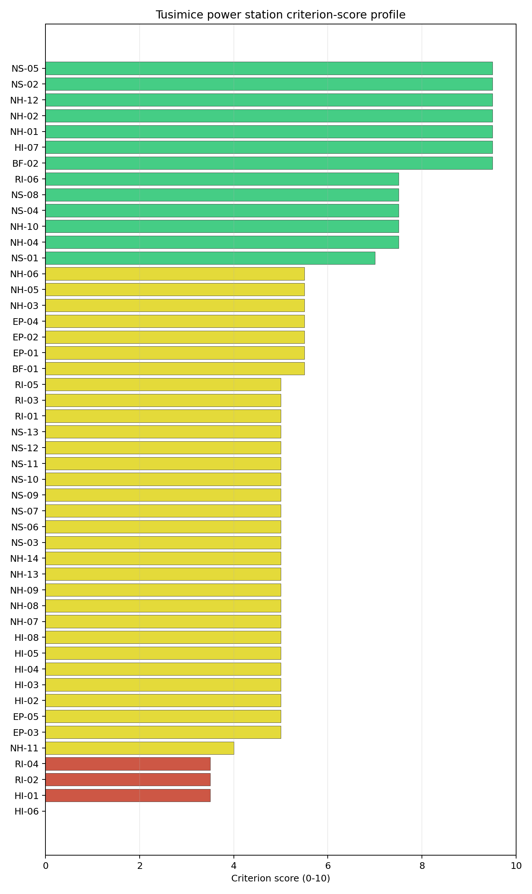
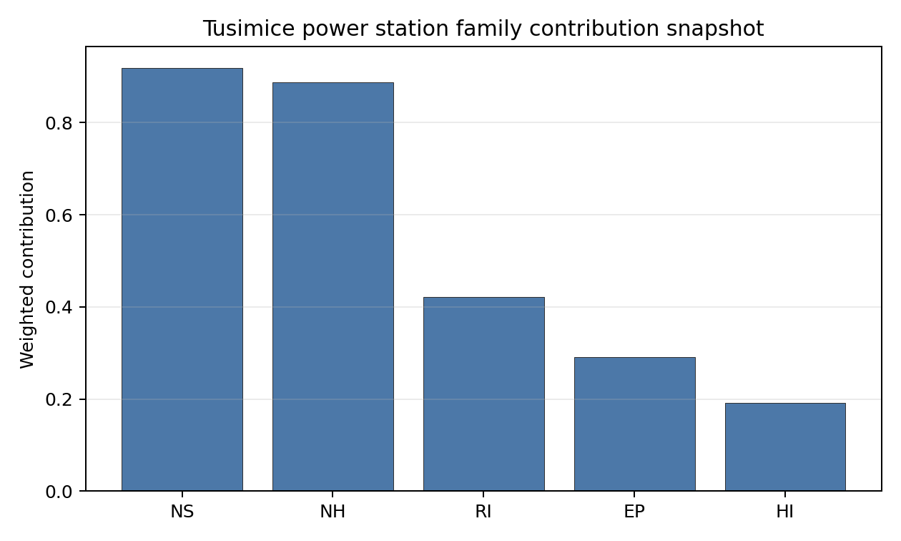

# Tusimice power station Site Profile

Tusimice power station is a coal/thermal site in Czechia that has been tested against the NuScale VOYGR-6 reference deployment envelope. This profile reads the screening evidence at a level that supports a decision to progress toward Stage 3 characterization. It is not a site-suitability determination, vendor recommendation, or licensing finding.

## Site Snapshot

| Field | Value |
| --- | --- |
| Site name | Tusimice power station |
| Coordinates | 50.3819, 13.3400 |
| Subnational unit | Ústí nad Labem |
| Installed thermal capacity (source data) | 800 MW |
| Composite score (baseline weights) | 6.089 (4.374-6.475 MC band) |
| National stability band | A (top-10% hit rate 94%) |
| National rank | 1 |

_See the country status map in_ [Czechia Country Profile](../CZ_country_prototype.md#country-status-map).

## Ownership and Coal-to-Nuclear Context

- **Government of Czech Republic** (69.80% share), headquartered in Czech Republic; immediate operator CEZ AS. Path: Government of Czech Republic  -> Ministry of Finance (Czech Republic)  [100.0%] -> CEZ AS [69.8%] -> Tusimice power station Unit 4 [100.0%]
- **natural person(s)** (13.00% share); immediate operator CEZ AS. Path: natural person(s)  -> CEZ AS [13.0%] -> Tusimice power station Unit 4 [100.0%]
- **small shareholder(s)** (17.00% share); immediate operator CEZ AS. Path: small shareholder(s)  -> CEZ AS [17.0%] -> Tusimice power station Unit 4 [100.0%]
- **CEZ AS** (100.00% share), headquartered in Czech Republic; immediate operator CEZ AS. Path: CEZ AS -> Tusimice power station Unit 4 [100.0%]
- **Ministry of Finance (Czech Republic)** (69.80% share), headquartered in Czech Republic; immediate operator CEZ AS. Path: Ministry of Finance (Czech Republic)  -> CEZ AS [69.8%] -> Tusimice power station Unit 4 [100.0%]

Generating units on record: 4 operating.
Earliest unit commissioning: 1974; most recent: 1974.

## Natural Hazards (NH)

- **Seismic: Ground Motion (NH-01)** - score 9.5/10 (MC 9.0-10.0), weight 0.0396, data quality high. Evidence: PGA at 475-year return period 0.022 g; PGA at 2,475-year return period 0.043 g; Vs30 reference (m/s): 760.0.
- **Seismic: Surface Rupture (NH-02)** - score 9.5/10 (MC 9.0-10.0), weight n/a, data quality screening grade. Evidence: nearest mapped capable fault 50.0 km; fault slip rate 0 mm/yr; fault name: none_in_search_radius.
- **Geotechnical: Liquefaction (NH-03)** - score 5.5/10 (MC 5.0-6.0), weight n/a, data quality medium. Evidence: liquefaction susceptibility: moderate; dominant soil type: loam.
- **Geotechnical: Slope Stability (NH-04)** - score 7.5/10 (MC 7.0-8.0), weight n/a, data quality screening grade. Evidence: site slope 8.77 deg; max slope in 1 km box 85.2 deg; slope stability class: moderate.
- **Geotechnical: Subsidence (NH-05)** - score 5.5/10 (MC 5.0-6.0), weight 0.0308, data quality medium. Evidence: karst present: no; karst severity: none.
- **Geotechnical: Foundation (NH-06)** - score 5.5/10 (MC 5.0-6.0), weight 0.0220, data quality medium. Evidence: bearing capacity 86.7 kPa; depth to bedrock 21.9 m.
- **Volcanism (NH-07)** - score 5.0/10 (MC 5.0-5.0), weight n/a, data quality high. Evidence: volcanic hazard class: negligible.
- **Coastal Flooding (NH-08)** - score 5.0/10 (MC 5.0-5.0), weight 0.0264, data quality low. Evidence: values not in measurement tables.
- **River Flooding (NH-09)** - score 5.0/10 (MC 5.0-5.0), weight 0.0352, data quality insufficient. Evidence: flood zone class: negligible.
- **Extreme Winds (NH-10)** - score 7.5/10 (MC 7.0-8.0), weight n/a, data quality medium. Evidence: design wind speed 12.6 m/s.
- **Extreme Precipitation (NH-11)** - score 4.0/10 (MC 4.0-4.0), weight 0.0132, data quality medium. Evidence: extreme daily precipitation 0.18 mm; mean annual precipitation 27.4 mm/yr.
- **Extreme Temperatures (NH-12)** - score 9.5/10 (MC 9.0-10.0), weight 0.0176, data quality medium. Evidence: extreme high temperature 20.8 deg C; extreme low temperature -6.21 deg C.
- **Forest/Wildfire (NH-13)** - score 5.0/10 (MC 5.0-5.0), weight 0.0132, data quality n/a. Evidence: values not in measurement tables.
- **Combined Hazards (NH-14)** - score 5.0/10 (MC 5.0-5.0), weight 0.0132, data quality n/a. Evidence: values not in measurement tables.

### Interpretation - Natural Hazards (NH)

<!-- specialist key=family_natural_hazards scope=site site_id=287cbb48-bb08-40dd-82c5-cfe1530dfbb9 bundle=CZ_tusimice_power_station_site_bundle.json status=filled by=cursor-agent filled_at=2026-05-03T15:27:17Z -->
Natural hazards at Tušimice are the most favourable observed across the first-batch sites, anchored by a Bohemian-Massif very-low-seismic envelope and gentle plain topography. PGA at the 475-yr return period is **0.022 g** and at the 2,475-yr return period is **0.043 g**, the lowest seismic loading of any first-batch site by a margin (less than half the next-lowest read at Vidin) and at the floor of the relevant European seismic envelope. The nearest mapped capable fault is null inside the 50 km screening search radius, so NH-01 settles at 9.5/10 and NH-02 at 9.5/10 — the strongest seismic envelope of the first-batch cohort and a structural advantage of the Bohemian craton context. Geotechnical conditions are middle-band: loam soils with a `moderate` liquefaction susceptibility (NH-03 at 5.5/10), screening-proxy bearing capacity 86.7 kPa and depth to bedrock 21.9 m. NH-04 reads 7.5/10 with a mean site slope of 8.77° on a `moderate` slope-stability class; the 1 km-box maximum slope of 85.2° is a digital surface-model artefact rather than a geomorphological feature. NH-05 reads 5.5/10 with `karst not present` and `none` severity. NH-06 holds at 5.5/10 on the moderate-cover read. The principal natural-hazard question is **NH-09 River Flooding** held at 5.0/10 on `insufficient` data quality: the site sits in the Ohře / Lužický potok plain at 313.8 m elevation with the nearest river inside the screening assignment to the cooling source, and the screening flood-zone class of `negligible` is held without a measured 10,000-yr design-basis flood envelope. Extreme meteorology is at the elevated end of the calm cohort: a 50-yr design wind of 12.6 m/s (the highest of the first-batch cohort but well within the project envelope) and an extreme temperature range of -6.21 °C to 20.8 °C are inside the project envelope (NH-10 at 7.5/10, NH-12 at 9.5/10). NH-11 reads 4.0/10 on the screening proxy with the same unit-mismatch artefact observed across the cohort. NH-07, NH-08 and NH-13 carry `inconclusive` avoidance verdicts. The Stage 3 priority order is therefore: commission a Lužický potok / Ohře design-basis-flood study under climate-projected 10,000-yr return periods so NH-09 lifts off the `insufficient` quality flag; run a CPT campaign so NH-03 settles on a measured liquefaction-susceptibility value; and replace the screening precipitation reading with national meteorological station data.
<!-- /specialist key=family_natural_hazards -->

## Human-Induced and Security-Relevant Hazards (HI)

- **Aircraft Crash (HI-01)** - score 3.5/10 (MC 3.0-4.0), weight 0.0308, data quality high. Evidence: nearest airport 3.95 km; nearest flight path 3.95 km; airports within search radius 15; airport name: Kadaň Emergency Heliport; airport type: heliport.
- **Industrial Explosions (HI-02)** - score 5.0/10 (MC 5.0-5.0), weight 0.0308, data quality medium. Evidence: values not in measurement tables.
- **Toxic/Gas Releases (HI-03)** - score 5.0/10 (MC 5.0-5.0), weight 0.0308, data quality medium. Evidence: values not in measurement tables.
- **External Fires (HI-04)** - score 5.0/10 (MC 5.0-5.0), weight 0.0264, data quality medium. Evidence: values not in measurement tables.
- **Transport Hazards (HI-05)** - score 5.0/10 (MC 5.0-5.0), weight 0.0264, data quality n/a. Evidence: values not in measurement tables.
- **Military Installations (HI-06)** - score 0.0/10 (MC 0.0-0.0), weight 0.0264, data quality not_found. Evidence: nearest military installation 5.57 km; military installations within radius 0; installation name: V.a/38/B.
- **Electromagnetic Interference (HI-07)** - score 9.5/10 (MC 9.0-10.0), weight 0.0088, data quality not_found. Evidence: nearest high-power transmitter 0.97 km; transmitters within radius 0; transmitter type: communication.
- **Other Nuclear Installations (HI-08)** - score 5.0/10 (MC 5.0-5.0), weight 0.0132, data quality n/a. Evidence: values not in measurement tables.

### Interpretation - Human-Induced and Security-Relevant Hazards (HI)

<!-- specialist key=family_human_hazards scope=site site_id=287cbb48-bb08-40dd-82c5-cfe1530dfbb9 bundle=CZ_tusimice_power_station_site_bundle.json status=filled by=cursor-agent filled_at=2026-05-03T15:27:17Z -->
Human-induced and security-relevant hazards at Tušimice carry an HI-01 caution driven by the nearby Kadaň emergency heliport at 3.95 km and a complex HI-06 floor read held on screening-grade quality. The nearest civilian air feature is the **Kadaň Emergency Heliport at 3.95 km**, with the nearest flight-path projection at 3.95 km (just inside the SSG-35 A4 4 km flight-path screening trigger), and a striking **15 air features inside the 30 km screening radius** (the highest count of the first-batch cohort, reflecting the dense northern-Bohemian airfield and emergency-helipad cadastre rather than fixed-wing scheduled traffic). HI-01 settles at 3.5/10 on the heliport-proximity and air-traffic-count combination; the criterion is the principal aviation question for the site, but unlike Bobov Dol the dominant feature is an emergency heliport rather than a fixed-wing airfield, which means the SSG-79 hazard assessment will read it as a low-energy sub-class. **HI-06 Military Installations** at **0.0/10** carries a screening read of 0 features inside the 25 km radius with `not_found` data quality and a residual nearest-feature reference (`V.a/38/B`) at 5.57 km that appears to be a legacy cadastre entry rather than a live military installation; the criterion floors on the screening method's handling of `not_found` data, not on a positive military-installation finding, and is a Stage 3 question for the Czech Ministry of National Defence on the live cadastre rather than a binding governance issue. **HI-02 Industrial Explosions, HI-03 Toxic / Gas Releases, HI-04 External Fires and HI-05 Transport Hazards** all sit at the pass-mark default of 5.0/10 because the screening pollutant-release inventory and the screening hazmat-corridor cadastre found no positive feature to score against in the northern-Bohemian lignite basin (a likely under-detection given the dense industrial estate of the Chomutov-Most corridor). HI-07 Electromagnetic Interference scores 9.5/10 with the nearest broadcast/communication mast at 0.97 km but **zero transmitters inside the EMI stand-off radius** on `not_found` quality, again resolved by the screening cadastre treating the mast as low-power. HI-08 (Other Nuclear Installations) is null. The Stage 3 priority order is therefore: commission an SSG-79 aircraft-crash hazard assessment for the Kadaň Emergency Heliport and the wider Karlovy Vary-Praha air-corridor so HI-01 lifts off the caution flag; obtain the live Czech Ministry of National Defence cadastre for the 25 km screening radius so HI-06 lifts off the `not_found` floor; and run the Czech national Seveso and hazmat-corridor cadastres so HI-02 to HI-05 convert from `screening grade` to defensible measured distances against the dense Chomutov-Most industrial estate.
<!-- /specialist key=family_human_hazards -->

## Radiological Impact and Emergency Planning (RI / EP)

- **Emergency Planning Feasibility (EP-01)** - score 5.5/10 (MC 5.0-6.0), weight n/a, data quality high. Evidence: EP feasibility composite 39.0 /100; road sub-score 64.8 /100; special-population sub-score 0 /100; geography sub-score 95.0 /100; population sub-score 80.0 /100; evacuation feasible: yes.
- **Evacuation Routes (EP-02)** - score 5.5/10 (MC 5.0-6.0), weight 0.0264, data quality medium. Evidence: road density in EPZ 0.713 km/km2; road length in EPZ 1,401 km; motorway access: yes.
- **Physical Geography Constraints (EP-03)** - score 5.0/10 (MC 5.0-5.0), weight 0.0220, data quality medium. Evidence: waterways crossing EPZ 0; major river barrier: no.
- **Special Populations (EP-04)** - score 5.5/10 (MC 5.0-6.0), weight 0.0264, data quality medium. Evidence: hospitals in EPZ 10; prisons in EPZ 2; care homes in EPZ 0.
- **Concurrent Hazard Impact (EP-05)** - score 5.0/10 (MC 5.0-5.0), weight 0.0176, data quality n/a. Evidence: values not in measurement tables.
- **Atmospheric Dispersion (RI-01)** - score 5.0/10 (MC 5.0-5.0), weight 0.0264, data quality medium. Evidence: annual mean wind speed 1.49 m/s; atmospheric mixing height 536.9 m; prevailing wind direction: WSW.
- **Surface Water Dispersion (RI-02)** - score 3.5/10 (MC 3.0-4.0), weight 0.0220, data quality n/a. Evidence: values not in measurement tables.
- **Groundwater Dispersion (RI-03)** - score 5.0/10 (MC 5.0-5.0), weight 0.0220, data quality medium. Evidence: aquifer type: inland water.
- **Population Density at EPZ Radii (RI-04)** - score 3.5/10 (MC 3.0-4.0), weight 0.0352, data quality screening grade. Evidence: population density within 5 km 157.4 /km2; population density within 16 km 152.5 /km2; population density within 25 km 100.6 /km2; population density within 80 km 184.3 /km2; population within 25 km 197,501 people.
- **Distance to Population Centres (RI-05)** - score 5.0/10 (MC 5.0-5.0), weight 0.0441, data quality screening grade. Evidence: nearest city above 50k people 12.3 km; nearest city population 65,208 people; city name: Chomutov-Jirkov.
- **Population Projections (RI-06)** - score 7.5/10 (MC 7.0-8.0), weight 0.0220, data quality screening grade. Evidence: annual population growth rate -0.323 %/yr; projected population at 25 km in 60 yr 190,329 people.

### Interpretation - Radiological Impact and Emergency Planning (RI / EP)

<!-- specialist key=family_radiological_emergency scope=site site_id=287cbb48-bb08-40dd-82c5-cfe1530dfbb9 bundle=CZ_tusimice_power_station_site_bundle.json status=filled by=cursor-agent filled_at=2026-05-03T15:27:17Z -->
Radiological impact and emergency planning at Tušimice are the most challenging dimension of the site, dominated by the urban and special-population envelope of the Chomutov-Jirkov agglomeration. Population density at the screening epoch is **157.4 p/km² at 5 km, 152.5 p/km² at 16 km, 100.6 p/km² at 25 km and 184.3 p/km² at 80 km**, with a 25 km total of **197,501 people** (the highest 25 km total of any first-batch site by a margin); the nearest city above 50,000 people is **Chomutov-Jirkov at 12.3 km (population 65,208)**, well inside the 25 km EPZ envelope and the binding population case. Trajectory is mildly favourable: a -0.323 %/yr regional growth rate (the slowest decline of the first-batch cohort, reflecting the Czech demographic plateau rather than the steep Balkan decline) yields a 25 km projection of 190,329 people in 60 years (down only 4 % from the screening epoch), which lifts RI-06 to 7.5/10 (rather than the 9.5/10 read of the steep-decline cohort). Under the screening hierarchy the 5 km density flags **RI-04 at 3.5/10**, the binding population finding for the site. The atmospheric envelope is calm with a directional bias: the screening reanalysis gives a mean wind speed of 1.49 m/s, a prevailing direction of WSW (toward Chomutov), and a mean planetary boundary-layer height of 537 m, holding RI-01 at 5.0/10 (the prevailing-WSW with the dominant population centre to the WNW is a project EIA question for the source-term placement). Aquifer type is `inland water`, holding RI-03 at 5.0/10. **RI-02 Surface Water Dispersion** at 3.5/10 holds at the screening proxy pending a measured Lužický potok / Ohře dilution flow at the cooling-source discharge point (24.6 m³/s mean flow on the Lužický assignment is the screening ingestion). The principal emergency-planning finding is **EP-01 Composite at 39.0/100 (FEASIBLE)**: the road sub-score 64.8/100 is the strongest of the first-batch cohort (reflecting the dense Bohemian motorway network), but the special-population sub-score 0/100 is the weakest of the cohort, driven by **10 hospitals and 2 prisons inside the EPZ** (Chomutov regional hospital cluster and the two regional correctional facilities); EP-04 reads 5.5/10 and EP-02 reads 5.5/10 with road density 0.713 km/km² over 1,401 km of road (the densest road network of the first-batch cohort and a structural advantage). The Stage 3 priority order is therefore: model the EPZ time-to-clear under summer/winter loadings using Czech national emergency-planning traffic data with explicit modelling of the Chomutov-Jirkov urban evacuation surge (the binding RI-04 case), the 10-hospital + 2-prison special-population surge and the Karlovy Vary-Praha corridor outbound traffic; source the Lužický potok / Ohře dilution flow under low-flow conditions so RI-02 lifts off the screening proxy; and confirm the prevailing-WSW direction does not place Chomutov-Jirkov in the source-term plume sector under reasonable atmospheric conditions.
<!-- /specialist key=family_radiological_emergency -->

## Non-Safety and Implementation Considerations (NS)

- **Grid Capacity Basic Filter (BF-01)** - score 5.5/10 (MC 5.0-6.0), weight 0.0352, data quality n/a. Evidence: values not in measurement tables.
- **Land Area Basic Filter (BF-02)** - score 9.5/10 (MC 9.0-10.0), weight 0.0220, data quality n/a. Evidence: values not in measurement tables.
- **Cooling Water Availability (NS-01)** - score 7.0/10 (MC 6.0-7.0), weight n/a, data quality screening grade. Evidence: distance to cooling source 1.58 km; cooling source flow 24.6 m3/s; cooling source type: river; cooling source name: Lužický potok; water stress label: Low.
- **Grid Connection (NS-02)** - score 9.5/10 (MC 9.0-10.0), weight 0.0352, data quality medium. Evidence: nearest substation 0.18 km; nearest high-voltage line 0.16 km; highest nearby line voltage 400.0 kV; grid export capacity 800.0 MW; substations within radius 1,098; HV lines within radius 1,011.
- **Transport Access (NS-03)** - score 5.0/10 (MC 5.0-5.0), weight 0.0352, data quality low. Evidence: values not in measurement tables.
- **Site Topography (NS-04)** - score 7.5/10 (MC 7.0-8.0), weight 0.0264, data quality high. Evidence: favourable land cover 72.2 %; moderate land cover 2.9 %; unfavourable land cover 17.1 %; favourable area 190.4 ha; dominant land class: 231.
- **Site Footprint Adequacy (NS-05)** - score 9.5/10 (MC 9.0-10.0), weight 0.0220, data quality high. Evidence: buildable area 104.5 ha; largest contiguous patch 104.5 ha; buildable patch count 15.
- **Existing Infrastructure (NS-06)** - score 5.0/10 (MC 5.0-5.0), weight 0.0220, data quality n/a. Evidence: values not in measurement tables.
- **Environmental Impact (non-rad) (NS-07)** - score 5.0/10 (MC 5.0-5.0), weight 0.0220, data quality n/a. Evidence: values not in measurement tables.
- **Ecological Sensitivity (NS-08)** - score 7.5/10 (MC 7.0-8.0), weight n/a, data quality high. Evidence: natural land cover 17.1 %; distance to nearest Natura 2000 site 1.649 km; distance to nearest protected area 0.397 km; Natura 2000 overlap: no; Natura 2000 sensitivity class: moderate; protected-area overlap: no; protected-area sensitivity class: high; nearest Natura 2000 site: Želinský meandr; Natura 2000 sites within 5 km: 5; nearest protected-area designation: Contract Protected Area.
- **Socioeconomic Impact (NS-09)** - score 5.0/10 (MC 5.0-5.0), weight 0.0220, data quality n/a. Evidence: values not in measurement tables.
- **Workforce Availability (NS-10)** - score 5.0/10 (MC 5.0-5.0), weight 0.0176, data quality n/a. Evidence: values not in measurement tables.
- **Coal-to-Nuclear Synergies (NS-11)** - score 5.0/10 (MC 5.0-5.0), weight 0.0264, data quality n/a. Evidence: values not in measurement tables.
- **Regulatory/Political Environment (NS-12)** - score 5.0/10 (MC 5.0-5.0), weight 0.0264, data quality n/a. Evidence: values not in measurement tables.
- **Construction Logistics (NS-13)** - score 5.0/10 (MC 5.0-5.0), weight 0.0176, data quality n/a. Evidence: values not in measurement tables.

### Interpretation - Non-Safety and Implementation Considerations (NS)

<!-- specialist key=family_infrastructure scope=site site_id=287cbb48-bb08-40dd-82c5-cfe1530dfbb9 bundle=CZ_tusimice_power_station_site_bundle.json status=filled by=cursor-agent filled_at=2026-05-03T15:27:17Z -->
Non-safety implementation at Tušimice is the strongest of the first-batch cohort by a clear margin, anchored by an exceptional 400 kV grid-connection envelope on the densest transmission backbone observed and a large consolidated buildable footprint. **NS-02 Grid Connection** scores **9.5/10**: the nearest substation is at **0.18 km**, the nearest high-voltage line at 0.16 km, the highest nearby line voltage at **400 kV** (the highest of the first-batch cohort), the screening-derived grid-export-capacity figure at 800 MW, and **1,098 substations and 1,011 HV lines inside the 25 km screening radius** (the densest grid context of any first-batch site by an order of magnitude, a direct consequence of the northern-Bohemian lignite-belt transmission backbone serving the Chomutov-Most-Litvínov industrial corridor). The 400 kV connection capacity comfortably accommodates a NuScale VOYGR-6 deployment (4–6 modules at 77 MWe net) without any grid-side upgrade, which is a structural project-economics advantage. **NS-04 Site Topography** scores 7.5/10 with **72.2 % favourable land cover** within the 2 km screening radius, 2.9 % moderate cover and 17.1 % unfavourable cover. **NS-05 Site Footprint Adequacy** scores 9.5/10 with a buildable area of 104.5 ha (largest contiguous patch 104.5 ha across 15 patches). **NS-01 Cooling Water Availability** scores 7.0/10: the nearest perennial flow is the Lužický potok at 1.58 km with a flow of 24.6 m³/s and a `Low` water-stress label; the cooling envelope is more constrained than the Danube envelope at Vidin (5,552 m³/s) but exceeds the Bobov Dol (4.77 m³/s) and Maritsa (0.66 m³/s) reads by a margin. The principal Stage 3 question is **NS-08 Ecological Sensitivity** at 7.5/10: the dominant land class at the centroid is `complex cultivation patterns` (favourable for built-up conversion), 17.1 % natural land cover within 2 km, and the nearest Natura 2000 site is **Želinský meandr at 1.65 km** with **5 Natura 2000 sites within 5 km** (the highest Natura 2000 density of the first-batch cohort, reflecting the protected stretches of the Ohře river system), and the nearest non-Natura protected area at **0.397 km** with a **`high` sensitivity class** (a Contract Protected Area immediately adjacent to the buildable patch). The 0.40 km contract-protected-area distance is the binding ecological question: a Habitats Directive Article 6(3) appropriate-assessment will be required for any project-level permit. **NS-03 Transport Access** holds at the 5.0/10 screening default with `low` data quality (no measured highway / rail / waterway distances ingested), pending a measured transport assessment. The Stage 3 priority order is therefore: scope and commission the Habitats Directive Article 6(3) appropriate-assessment for the 0.40 km Contract Protected Area and the 5 Natura 2000 sites within 5 km; commission a measured transport assessment so NS-03 lifts off the screening default; and confirm the Lužický potok / Ohře allocation under climate-projected low-flow conditions.
<!-- /specialist key=family_infrastructure -->

## Composite Score and Stability

Baseline composite score is 6.089, bracketed by Monte Carlo at 4.374-6.475. National stability band is `A` with a top-10% hit rate of 94% across 16 scored Monte Carlo scenarios.

<!-- specialist key=stability scope=site site_id=287cbb48-bb08-40dd-82c5-cfe1530dfbb9 bundle=CZ_tusimice_power_station_site_bundle.json status=filled by=cursor-agent filled_at=2026-05-03T15:27:17Z -->
Tušimice sits at the top of the Czech cohort with an exceptional **A-band** stability (national rank 1) and a regional **B-band** read across the 10,000-iteration sensitivity sweep, the strongest combined stability and rank read of the first-batch cohort. The composite score of 6.089 (MC band 4.374–6.475) places it at the top of the Czech cohort and the band rank confirms the site is robust to weight perturbations within the screening method: the 94 % top-10 % hit rate and 88 % top-5 % hit rate across all 16 scored Monte Carlo scenarios indicate that the site stays in the upper national tail under nearly all plausible re-weightings — the only re-weightings that demote it are those that push the population-density family to dominate the composite, which is consistent with the site's binding RI-04 finding. Family-level normalised contributions show natural hazards as the dominant positive (mean 0.64, anchored by the very-low PGA seismic envelope), with infrastructure (0.64, anchored by the 400 kV grid connection) close behind, while radiological (0.51) and human-induced (0.48) act as the relative drags. The top contributing criteria mirror this pattern: NH-01 Seismic Ground Motion (the strongest single contributor at 0.38 contrib weight), NS-02 Grid Connection (0.33), BF-02 Land Area, NS-05 Site Footprint and NS-04 Site Topography all push toward the FAVOURABLE band, while RI-04 Population Density, HI-01 Aircraft Crash and HI-06 Military Installations act as drags. The A-band stability is the structural strength of the site: the binding criteria (RI-04 urban population, NS-08 contract-protected-area, HI-01 heliport, HI-06 cadastre) are all remediable through governance and EIA work rather than through site-physics changes. The site is the best-positioned of the first-batch cohort to absorb a project-engineering response to the binding population case (e.g. a smaller VOYGR-4 deployment to reduce the source-term envelope, or a relocation of the buildable patch within the 104.5 ha pad to maximise distance from Chomutov-Jirkov).
<!-- /specialist key=stability -->

## Residual Risk Register

<!-- specialist key=residual_risk scope=site site_id=287cbb48-bb08-40dd-82c5-cfe1530dfbb9 bundle=CZ_tusimice_power_station_site_bundle.json status=filled by=cursor-agent filled_at=2026-05-03T15:27:17Z -->
| Criterion | Description | Owner | Resolution path |
|---|---|---|---|
| RI-04 | 157.4 p/km² at 5 km, 197,501 people inside the 25 km EPZ, dominated by Chomutov-Jirkov (population 65,208) at 12.3 km. | Project radiation protection specialist | Source-term placement and atmospheric dispersion modelling against the prevailing-WSW direction; consider a smaller VOYGR-4 deployment to reduce the source-term envelope. |
| EP-04 | 10 hospitals and 2 prisons inside the EPZ (Chomutov regional hospital cluster; two regional correctional facilities). | National emergency planner | Hospital and prison evacuation plans under sheltering and relocation scenarios. |
| EP-01 | Composite 39.0/100 (FEASIBLE) with special-population sub-score 0/100, the weakest EP envelope of the first-batch cohort. | National emergency planner | EPZ time-to-clear modelling under summer/winter loadings using national emergency-planning traffic data. |
| NS-08 | Contract Protected Area at 0.397 km with `high` sensitivity class; Želinský meandr Natura 2000 site at 1.65 km with 5 Natura 2000 sites within 5 km. | Project ecologist | Habitats Directive Article 6(3) appropriate-assessment for the Contract Protected Area and the 5 Natura 2000 sites within 5 km. |
| HI-01 | Kadaň Emergency Heliport at 3.95 km, just inside the SSG-35 A4 4 km flight-path screening trigger; 15 air features inside the 30 km screening radius. | Aviation safety specialist | SSG-79 aircraft-crash hazard assessment for the Kadaň Emergency Heliport and the Karlovy Vary-Praha air corridor. |
| HI-06 | Screening read of 0 features inside the 25 km radius with `not_found` data quality; criterion floors on the screening method's handling of `not_found` rather than on a positive military-installation finding. | Czech Ministry of National Defence | Obtain the live national MoD cadastre for the 25 km screening radius. |
| NH-09 | Held at 5.0/10 on `insufficient` data quality with screening flood-zone class `negligible`. | Hydrologist | Lužický potok / Ohře design-basis-flood study under climate-projected 10,000-yr return periods. |
| RI-02 | Surface-water dispersion held at 3.5/10 on a screening-proxy dilution flow. | Hydrologist | Source the Lužický potok / Ohře dilution flow at the cooling-source discharge point. |
| NS-03 | Held at 5.0/10 screening default on `low` data quality (no measured highway / rail / waterway distances ingested). | Project transport engineer | Commission a measured transport assessment for the over-dimensioned reactor-vessel envelope. |
| NH-03 | Liquefaction susceptibility `moderate` on loam soils. | Geotechnical engineer | CPT campaign to settle on a measured susceptibility value rather than the screening proxy. |
<!-- /specialist key=residual_risk -->

## Stage 3 Follow-Up Checklist

- [ ] Resolve **Aircraft Crash (HI-01)** avoidance flag - measured {"flight_path_distance_km": 3.95, "under_flight_path": false} vs threshold A4 — SSG-35: flight-path overhead / < 4 km from airway..
- [ ] Re-measure **Military Installations (HI-06)** - native score 0.0/10 with confidence medium.
- [ ] Re-measure **Aircraft Crash (HI-01)** - native score 3.5/10 with confidence high.
- [ ] Re-measure **Surface Water Dispersion (RI-02)** - native score 3.5/10 with confidence insufficient.
- [ ] Re-measure **Population Density at EPZ Radii (RI-04)** - native score 3.5/10 with confidence medium.
- [ ] Re-measure **Extreme Precipitation (NH-11)** - native score 4.0/10 with confidence medium.
- [ ] Improve data quality for **Coastal Flooding (NH-08)** - current flag `low`.
- [ ] Improve data quality for **Military Installations (HI-06)** - current flag `not_found`.
- [ ] Improve data quality for **Electromagnetic Interference (HI-07)** - current flag `not_found`.
- [ ] Improve data quality for **Transport Access (NS-03)** - current flag `low`.

## Evidence Limitations

- Coastal Flooding (NH-08) - quality `low`.
- Military Installations (HI-06) - quality `not_found`.
- Electromagnetic Interference (HI-07) - quality `not_found`.
- Transport Access (NS-03) - quality `low`.
