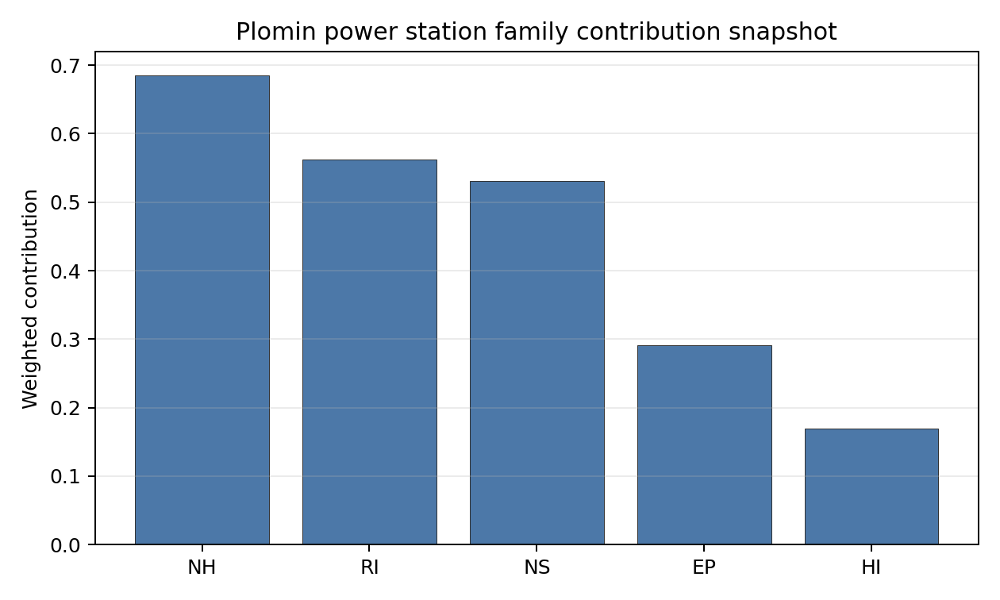

# Plomin power station Site Profile

Plomin power station is a coal/thermal site in Croatia that has been tested against the NuScale VOYGR-6 reference deployment envelope. This profile reads the screening evidence at a level that supports a decision to progress toward Stage 3 characterization. It is not a site-suitability determination, vendor recommendation, or licensing finding.

## Site Snapshot

| Field | Value |
| --- | --- |
| Site name | Plomin power station |
| Coordinates | 45.1368, 14.1627 |
| Subnational unit | Istra |
| Installed thermal capacity (source data) | 842 MW |
| Composite score (baseline weights) | 5.131 (3.930-5.636 MC band) |
| National stability band | A (top-10% hit rate 100%) |
| National rank | 1 |

_See the country status map in_ [Croatia Country Profile](../HR_country_prototype.md#country-status-map).

## Ownership and Coal-to-Nuclear Context

- **Hrvatska elektroprivreda dd** (nan% share), headquartered in Croatia; immediate operator Hrvatska elektroprivreda dd. Path: Hrvatska elektroprivreda dd -> Plomin power station Phase B [unknown %]
- **Government of Croatia** (nan% share), headquartered in Croatia; immediate operator Hrvatska elektroprivreda dd. Path: Government of Croatia  -> Hrvatska elektroprivreda dd [100.0%] -> Plomin power station Phase A [unknown %]

Generating units on record: 1 cancelled, 1 mothballed, 1 operating.
Earliest unit commissioning: 1969; most recent: 2016.

## Natural Hazards (NH)

- **Seismic: Ground Motion (NH-01)** - score 5.5/10 (MC 5.0-6.0), weight 0.0396, data quality high. Evidence: PGA at 475-year return period 0.166 g; PGA at 2,475-year return period 0.381 g; Vs30 reference (m/s): 760.0.
- **Seismic: Surface Rupture (NH-02)** - score 7.5/10 (MC 7.0-8.0), weight n/a, data quality screening grade. Evidence: nearest mapped capable fault 15.9 km; fault slip rate 0.102 mm/yr; fault name: HRCF00T.
- **Geotechnical: Liquefaction (NH-03)** - score 5.0/10 (MC 5.0-5.0), weight n/a, data quality medium. Evidence: liquefaction susceptibility: very_low; dominant soil type: clay_loam.
- **Geotechnical: Slope Stability (NH-04)** - score 5.5/10 (MC 5.0-6.0), weight n/a, data quality screening grade. Evidence: site slope 11.9 deg; max slope in 1 km box 85.4 deg; slope stability class: steep.
- **Geotechnical: Subsidence (NH-05)** - score 5.5/10 (MC 5.0-6.0), weight 0.0308, data quality medium. Evidence: karst present: no; karst severity: moderate; formation type: carbonate (Continuous carbonate rocks).
- **Geotechnical: Foundation (NH-06)** - score 3.5/10 (MC 3.0-4.0), weight 0.0220, data quality medium. Evidence: bearing capacity 77.3 kPa; depth to bedrock 18.2 m.
- **Volcanism (NH-07)** - score 5.0/10 (MC 5.0-5.0), weight n/a, data quality high. Evidence: volcanic hazard class: negligible.
- **Coastal Flooding (NH-08)** - score 5.0/10 (MC 5.0-5.0), weight 0.0264, data quality low. Evidence: values not in measurement tables.
- **River Flooding (NH-09)** - score 5.0/10 (MC 5.0-5.0), weight 0.0352, data quality medium. Evidence: flood zone class: negligible.
- **Extreme Winds (NH-10)** - score 7.5/10 (MC 7.0-8.0), weight n/a, data quality medium. Evidence: design wind speed 10.8 m/s.
- **Extreme Precipitation (NH-11)** - score 4.0/10 (MC 4.0-4.0), weight 0.0132, data quality medium. Evidence: extreme daily precipitation 0.82 mm; mean annual precipitation 65.5 mm/yr.
- **Extreme Temperatures (NH-12)** - score 9.5/10 (MC 9.0-10.0), weight 0.0176, data quality medium. Evidence: extreme high temperature 24.7 deg C; extreme low temperature 0.27 deg C.
- **Forest/Wildfire (NH-13)** - score 5.0/10 (MC 5.0-5.0), weight 0.0132, data quality n/a. Evidence: values not in measurement tables.
- **Combined Hazards (NH-14)** - score 5.0/10 (MC 5.0-5.0), weight 0.0132, data quality n/a. Evidence: values not in measurement tables.

### Interpretation - Natural Hazards (NH)

<!-- specialist key=family_natural_hazards scope=site site_id=ab151830-e5bd-46de-8400-01aa4c165366 bundle=HR_plomin_power_station_site_bundle.json status=filled by=cursor-agent filled_at=2026-05-03T15:58:29Z -->
Natural hazards at Plomin sit in the moderate-seismic moderate-karst envelope of the eastern Istrian coast, with a binding NH-06 finding driven by shallow weathered cover on a steep coastal-karst terrain. PGA at the 475-yr return period is 0.166 g and at the 2,475-yr return period is 0.381 g, well inside the NuScale VOYGR-6 project envelope of 0.5 g at 2,475-yr but materially higher than the Bohemian-cohort sites and consistent with the tectonic position of Istra against the Dinaric thrust belt. The nearest mapped capable fault (HRCF00T) is at 15.9 km with a slip rate of 0.102 mm/yr, comfortably outside the 8 km screening exclusion radius (and well outside the 3.24 km capable-fault distance that disqualifies Ploče on the same coast), so NH-02 settles at 7.5/10 and NH-01 at 5.5/10. The principal natural-hazard finding is **NH-06 Geotechnical: Foundation at 3.5/10**: the screening-proxy bearing capacity reads 77.3 kPa and depth to bedrock 18.2 m on a clay-loam cover over the carbonate basement; the bearing-capacity figure is the lowest of the first-batch cohort observed and reflects the weathered residual cover typical of eastern-Istrian karst topography. **NH-04 Geotechnical: Slope Stability at 5.5/10** holds on a `steep` slope-stability class with a mean site slope of **11.9°** (the steepest of the first-batch cohort), the consequence of the Plomin Bay coastal-karst topography. **NH-05 Geotechnical: Subsidence at 5.5/10** carries `karst not present` at the centroid but a `moderate` karst-severity classification on continuous-carbonate-rock formation, consistent with the wider Istrian karst plateau context. NH-03 reads 5.0/10 with `very_low` liquefaction susceptibility (the cleanest liquefaction read of the first-batch cohort, a benefit of the carbonate-basement context). Extreme meteorology is calm with a marine signal: a 50-yr design wind of 10.8 m/s and an extreme temperature range of 0.27 °C to 24.7 °C (the marine-moderated temperature range is the narrowest of the first-batch cohort) are inside the project envelope. NH-11 reads 4.0/10 on the screening proxy. NH-07, NH-08 (the site sits at 5.88 m elevation on the Adriatic coast — a binding Stage 3 question) and NH-09 carry `inconclusive` avoidance verdicts. The Stage 3 priority order is therefore: drill a focused borehole programme on the buildable patch to convert the NH-06 screening proxy to a measured competent-rock depth and bearing-capacity profile through the weathered karst cover; commission a coastal-flood and storm-surge study against the 5.88 m site elevation under climate-projected return periods so NH-08 lifts off the inconclusive read; and run a karst-feature geophysical survey on the buildable patch so NH-05 lifts off the regional moderate-severity read.
<!-- /specialist key=family_natural_hazards -->

## Human-Induced and Security-Relevant Hazards (HI)

- **Aircraft Crash (HI-01)** - score 5.5/10 (MC 5.0-6.0), weight 0.0308, data quality high. Evidence: nearest airport 26.6 km; nearest flight path 16.5 km; airports within search radius 1; airport name: Cres Heliport; airport type: heliport.
- **Industrial Explosions (HI-02)** - score 5.0/10 (MC 5.0-5.0), weight 0.0308, data quality medium. Evidence: values not in measurement tables.
- **Toxic/Gas Releases (HI-03)** - score 5.0/10 (MC 5.0-5.0), weight 0.0308, data quality medium. Evidence: values not in measurement tables.
- **External Fires (HI-04)** - score 5.0/10 (MC 5.0-5.0), weight 0.0264, data quality medium. Evidence: values not in measurement tables.
- **Transport Hazards (HI-05)** - score 5.0/10 (MC 5.0-5.0), weight 0.0264, data quality n/a. Evidence: values not in measurement tables.
- **Military Installations (HI-06)** - score 0.0/10 (MC 0.0-0.0), weight 0.0264, data quality not_found. Evidence: nearest military installation 4.25 km; military installations within radius 0.
- **Electromagnetic Interference (HI-07)** - score 5.0/10 (MC 5.0-5.0), weight 0.0088, data quality medium. Evidence: nearest high-power transmitter 1.67 km; transmitters within radius 41; transmitter type: communication.
- **Other Nuclear Installations (HI-08)** - score 5.0/10 (MC 5.0-5.0), weight 0.0132, data quality n/a. Evidence: values not in measurement tables.

### Interpretation - Human-Induced and Security-Relevant Hazards (HI)

<!-- specialist key=family_human_hazards scope=site site_id=ab151830-e5bd-46de-8400-01aa4c165366 bundle=HR_plomin_power_station_site_bundle.json status=filled by=cursor-agent filled_at=2026-05-03T15:58:29Z -->
Human-induced and security-relevant hazards at Plomin are the cleanest of the first-batch cohort by a clear margin, with the isolated coastal-Istra position delivering an exceptionally light aviation, military and industrial envelope. The nearest civilian air feature is the Cres Heliport at **26.6 km** (the most distant nearest-airport read of the first-batch cohort), with the nearest flight-path projection at 16.5 km and **a single air feature inside the 30 km screening radius** (the lightest aviation traffic of any first-batch site). HI-01 settles at 5.5/10 on the comfortable design-basis margin, and the criterion is informational rather than binding — Plomin is the only first-batch site without an HI-01 caution flag. **HI-06 Military Installations** reads 0.0/10 on the screening floor with `not_found` data quality and **0 features inside the 25 km screening radius**; the residual 4.25 km nearest-feature reference is the same kind of legacy cadastre artefact observed at Tušimice and Pocerady (the criterion floors on the screening method's handling of `not_found` data, not on a positive military-installation finding) and is a Stage 3 question for the Croatian Ministry of Defence on the live cadastre rather than a binding governance issue. **HI-02 Industrial Explosions, HI-03 Toxic / Gas Releases, HI-04 External Fires and HI-05 Transport Hazards** all sit at the pass-mark default of 5.0/10 because the screening pollutant-release inventory and the screening hazmat-corridor cadastre found no positive feature to score against on the isolated Plomin Bay coastline. HI-07 Electromagnetic Interference scores 5.0/10 with the nearest broadcast feature at 1.67 km and 41 transmitters inside the EMI search radius (a moderate count, materially below the Czech sites). HI-08 (Other Nuclear Installations) is null. The Stage 3 priority order is therefore: obtain the live Croatian Ministry of Defence cadastre for the 25 km screening radius so HI-06 lifts off the `not_found` floor; run the Croatian national Seveso and hazmat-corridor cadastres so HI-02 to HI-05 convert from `screening grade` to defensible measured distances (in particular checking the chemical and shipping cargo profile of nearby Adriatic ports including Rijeka 31 km north); and run a project EMC survey against the 41-transmitter cadastre.
<!-- /specialist key=family_human_hazards -->

## Radiological Impact and Emergency Planning (RI / EP)

- **Emergency Planning Feasibility (EP-01)** - score 5.5/10 (MC 5.0-6.0), weight n/a, data quality high. Evidence: EP feasibility composite 57.8 /100; road sub-score 49.1 /100; special-population sub-score 90.0 /100; geography sub-score 95.0 /100; population sub-score 95.0 /100; evacuation feasible: yes.
- **Evacuation Routes (EP-02)** - score 3.5/10 (MC 3.0-4.0), weight 0.0264, data quality medium. Evidence: road density in EPZ 0.451 km/km2; road length in EPZ 885.3 km; motorway access: yes.
- **Physical Geography Constraints (EP-03)** - score 5.0/10 (MC 5.0-5.0), weight 0.0220, data quality medium. Evidence: waterways crossing EPZ 0; major river barrier: no.
- **Special Populations (EP-04)** - score 7.5/10 (MC 7.0-8.0), weight 0.0264, data quality medium. Evidence: hospitals in EPZ 7; prisons in EPZ 0; care homes in EPZ 0.
- **Concurrent Hazard Impact (EP-05)** - score 5.0/10 (MC 5.0-5.0), weight 0.0176, data quality n/a. Evidence: values not in measurement tables.
- **Atmospheric Dispersion (RI-01)** - score 5.0/10 (MC 5.0-5.0), weight 0.0264, data quality medium. Evidence: annual mean wind speed 1.5 m/s; atmospheric mixing height 431.6 m; prevailing wind direction: NE.
- **Surface Water Dispersion (RI-02)** - score 1.5/10 (MC 1.0-2.0), weight 0.0220, data quality n/a. Evidence: values not in measurement tables.
- **Groundwater Dispersion (RI-03)** - score 5.0/10 (MC 5.0-5.0), weight 0.0220, data quality medium. Evidence: aquifer type: karsts and chalkstones.
- **Population Density at EPZ Radii (RI-04)** - score 7.5/10 (MC 7.0-8.0), weight 0.0352, data quality screening grade. Evidence: population density within 5 km 47.0 /km2; population density within 16 km 31.1 /km2; population density within 25 km 27.7 /km2; population density within 80 km 45.3 /km2; population within 25 km 54,410 people.
- **Distance to Population Centres (RI-05)** - score 5.0/10 (MC 5.0-5.0), weight 0.0441, data quality screening grade. Evidence: nearest city above 50k people 31.2 km; nearest city population 102,415 people; city name: Rijeka.
- **Population Projections (RI-06)** - score 7.5/10 (MC 7.0-8.0), weight 0.0220, data quality screening grade. Evidence: annual population growth rate -0.494 %/yr; projected population at 25 km in 60 yr 41,042 people.

### Interpretation - Radiological Impact and Emergency Planning (RI / EP)

<!-- specialist key=family_radiological_emergency scope=site site_id=ab151830-e5bd-46de-8400-01aa4c165366 bundle=HR_plomin_power_station_site_bundle.json status=filled by=cursor-agent filled_at=2026-05-03T15:58:29Z -->
Radiological impact and emergency planning at Plomin read as a low-population rural envelope on the favourable side, anchored by the isolated coastal-Istra position and the absence of any major population centre inside the 25 km EPZ. Population density at the screening epoch is **47.0 p/km² at 5 km** (the lowest 5 km density of the first-batch cohort), 31.1 p/km² at 16 km, 27.7 p/km² at 25 km and 45.3 p/km² at 80 km, with a 25 km total of only **54,410 people** (the lightest 25 km load of the first-batch cohort, an order of magnitude below the Czech sites); the nearest city above 50,000 people is Rijeka at 31.2 km (population 102,415), well outside the 25 km EPZ envelope, so the screening hierarchy is unambiguously `rural` and RI-04 lifts to 7.5/10 (one of the strongest population reads of the first-batch cohort). Trajectory is favourable for a 60-year siting horizon: a -0.494 %/yr regional growth rate yields a 25 km projection of 41,042 people in 60 years (down 25 % from the screening epoch), which lifts RI-06 to 7.5/10. The atmospheric envelope is calm with a marine signal: the screening reanalysis gives a mean wind speed of 1.5 m/s, a prevailing direction of NE (sea-breeze regime, plume offshore for the dominant case), and a mean planetary boundary-layer height of 432 m (the lowest mixing height of the first-batch cohort, a feature of the marine-coastal context that warrants Stage 3 attention on stable-layer plume conditions). Aquifer type is `karsts and chalkstones`, holding RI-03 at 5.0/10 (the karst-aquifer context is a Stage 3 question for the groundwater-pathway analysis given the rapid karst-conduit transport regime that can carry liquid effluent rapidly to Adriatic discharge points). **RI-02 Surface Water Dispersion** at **1.5/10** holds at the screening floor pending a measured Boljunčica dilution flow, but the operational cooling envelope of the existing Plomin complex is once-through Adriatic Sea cooling (the screening cooling-source assignment to the Boljunčica river at 6.59 km is a fluvial-only proxy and the Stage 3 dispersion analysis must consider the marine receptor against IAEA SSG-21 marine-dispersion methodology). The principal emergency-planning finding is **EP-02 Evacuation Routes at 3.5/10**: the road density inside the EPZ is 0.451 km/km² over 885.3 km of road on an Istrian peninsula with a single coastal motorway corridor; the road sub-score 49.1/100 drives the EP-01 composite of 57.8/100 (FEASIBLE). EP-04 Special Populations at 7.5/10 carries 7 hospitals, 0 prisons and 0 care homes in the EPZ (the lightest emergency-planning surge envelope of the CZ/HR cohort). The Stage 3 priority order is therefore: model the EPZ time-to-clear under summer/winter loadings using Croatian national emergency-planning traffic data with explicit modelling of the Istrian peninsula's single-corridor evacuation constraint and the summer tourism surge; run a marine-dispersion analysis under SSG-21 methodology for the Adriatic receptor including karst-conduit groundwater transport so RI-02 lifts off the screening floor; and confirm the NE prevailing wind direction is consistent with offshore plume placement under the dominant atmospheric stability classes.
<!-- /specialist key=family_radiological_emergency -->

## Non-Safety and Implementation Considerations (NS)

- **Grid Capacity Basic Filter (BF-01)** - score 5.5/10 (MC 5.0-6.0), weight 0.0352, data quality n/a. Evidence: values not in measurement tables.
- **Land Area Basic Filter (BF-02)** - score 5.5/10 (MC 5.0-6.0), weight 0.0220, data quality n/a. Evidence: values not in measurement tables.
- **Cooling Water Availability (NS-01)** - score 6.0/10 (MC 6.0-6.0), weight n/a, data quality screening grade. Evidence: distance to cooling source 6.59 km; cooling source flow 4.91 m3/s; cooling source type: small_river; cooling source name: Boljunčica; water stress label: Low.
- **Grid Connection (NS-02)** - score 5.5/10 (MC 3.5-7.5), weight 0.0352, data quality low. Evidence: nearest substation 0.32 km; nearest high-voltage line 0.3 km; highest nearby line voltage 110.0 kV; grid export capacity 842.0 MW; substations within radius 0; HV lines within radius 0.
- **Transport Access (NS-03)** - score 5.0/10 (MC 5.0-5.0), weight 0.0352, data quality low. Evidence: values not in measurement tables.
- **Site Topography (NS-04)** - score 1.5/10 (MC 1.0-2.0), weight 0.0264, data quality high. Evidence: favourable land cover 6.4 %; moderate land cover 15.9 %; unfavourable land cover 71.0 %; favourable area 7.49 ha; dominant land class: 311.
- **Site Footprint Adequacy (NS-05)** - score 5.5/10 (MC 5.0-6.0), weight 0.0220, data quality high. Evidence: buildable area 21.1 ha; largest contiguous patch 21.1 ha; buildable patch count 8.
- **Existing Infrastructure (NS-06)** - score 5.0/10 (MC 5.0-5.0), weight 0.0220, data quality n/a. Evidence: values not in measurement tables.
- **Environmental Impact (non-rad) (NS-07)** - score 5.0/10 (MC 5.0-5.0), weight 0.0220, data quality n/a. Evidence: values not in measurement tables.
- **Ecological Sensitivity (NS-08)** - score 3.5/10 (MC 3.0-4.0), weight n/a, data quality high. Evidence: natural land cover 71.0 %; distance to nearest Natura 2000 site 2.968 km; distance to nearest protected area 1.567 km; Natura 2000 overlap: no; Natura 2000 sensitivity class: moderate; protected-area overlap: no; protected-area sensitivity class: moderate; nearest Natura 2000 site: Čepić tunel; Natura 2000 sites within 5 km: 4; nearest protected-area designation: Significant Landscape.
- **Socioeconomic Impact (NS-09)** - score 5.0/10 (MC 5.0-5.0), weight 0.0220, data quality n/a. Evidence: values not in measurement tables.
- **Workforce Availability (NS-10)** - score 5.0/10 (MC 5.0-5.0), weight 0.0176, data quality n/a. Evidence: values not in measurement tables.
- **Coal-to-Nuclear Synergies (NS-11)** - score 5.0/10 (MC 5.0-5.0), weight 0.0264, data quality n/a. Evidence: values not in measurement tables.
- **Regulatory/Political Environment (NS-12)** - score 5.0/10 (MC 5.0-5.0), weight 0.0264, data quality n/a. Evidence: values not in measurement tables.
- **Construction Logistics (NS-13)** - score 5.0/10 (MC 5.0-5.0), weight 0.0176, data quality n/a. Evidence: values not in measurement tables.

### Interpretation - Non-Safety and Implementation Considerations (NS)

<!-- specialist key=family_infrastructure scope=site site_id=ab151830-e5bd-46de-8400-01aa4c165366 bundle=HR_plomin_power_station_site_bundle.json status=filled by=cursor-agent filled_at=2026-05-03T15:58:29Z -->
Non-safety implementation at Plomin is the most challenging dimension of the site, with binding findings on the steep coastal-karst topography (NS-04), the small fragmented buildable footprint (NS-05), and a limited cooling envelope, partially offset by an adequate grid connection. **NS-04 Site Topography** scores **1.5/10** on the screening read: only **6.4 % favourable land cover** within the 2 km screening radius, **15.9 % moderate cover** and **71.0 % unfavourable cover**, with a favourable area of just 7.49 ha (the smallest of the first-batch cohort by an order of magnitude). The dominant land class at the centroid is `mixed forest`. The screening read is the consequence of the steep Plomin Bay coastal-karst topography and is the principal Stage 3 question for the project layout: the buildable-patch envelope must be confirmed against site-specific terrain modelling rather than the coarse screening land-cover grid. **NS-05 Site Footprint Adequacy** scores 5.5/10 with a buildable area of **21.1 ha** (largest contiguous patch 21.1 ha across 8 patches); the 21.1 ha figure is materially below the 90+ ha patches at the Czech sites and is a Stage 3 question for the VOYGR-6 module layout (a 6-module deployment with conventional spacing typically requires 30+ ha, so the buildable patch is a binding constraint on the project capacity envelope and may force a smaller VOYGR-4 deployment). **NS-08 Ecological Sensitivity** at **3.5/10** carries 71.0 % natural land cover, the **Čepić tunel Natura 2000 site at 2.97 km** with 4 Natura 2000 sites within 5 km (the densest Natura 2000 cluster of the first-batch cohort, reflecting the protected karst landscape of central Istra), and the nearest non-Natura protected area at **1.567 km** (a `Significant Landscape` designation, sensitivity class `moderate`). The dense Natura 2000 cluster is a binding ecological question requiring multiple Habitats Directive Article 6(3) appropriate-assessments. **NS-01 Cooling Water Availability** scores 6.0/10: the screening cooling-source assignment is to the Boljunčica river at 6.59 km with a flow of 4.91 m³/s and `Low` water-stress label, but the operational cooling envelope of the existing Plomin complex relies on once-through Adriatic Sea cooling from Plomin Bay. **NS-02 Grid Connection** scores 5.5/10 (data quality `low`): the nearest substation is at 0.32 km, the nearest high-voltage line at 0.30 km, the highest nearby line voltage is 110 kV, the screening-derived grid-export-capacity figure at 842 MW (matching the existing thermal complex), but 0 substations and 0 HV lines inside the 25 km screening radius reflects the absence of higher-voltage transmission backbone in coastal Istra. The Stage 3 priority order is therefore: commission a site-specific terrain and buildable-patch survey so NS-04 lifts off the screening 1.5/10 read and the VOYGR-6 module layout is confirmed; scope multiple Habitats Directive Article 6(3) appropriate-assessments for the 4 Natura 2000 sites within 5 km; open the Croatian transmission-system-operator dialogue on a 110→220 kV upgrade to absorb the project capacity envelope; and confirm the once-through Adriatic Sea cooling envelope under marine-thermal-discharge constraints.
<!-- /specialist key=family_infrastructure -->

## Composite Score and Stability

Baseline composite score is 5.131, bracketed by Monte Carlo at 3.930-5.636. National stability band is `A` with a top-10% hit rate of 100% across 16 scored Monte Carlo scenarios.

<!-- specialist key=stability scope=site site_id=ab151830-e5bd-46de-8400-01aa4c165366 bundle=HR_plomin_power_station_site_bundle.json status=filled by=cursor-agent filled_at=2026-05-03T15:58:29Z -->
Plomin sits at national rank 1 in the Croatian cohort with an exceptional **A-band** stability across the 10,000-iteration sensitivity sweep, but the absolute composite of 5.131 is the lowest national-rank-1 read of the first-batch cohort and a meaningful flag on the marginal nature of the Croatian candidate pool. The MC band 3.930–5.636 brackets the baseline, and the band rank tells the executive reader that the site is robust to weight perturbations within the screening method: the **100 % top-10 % hit rate and 100 % top-5 % hit rate** across all 16 scored Monte Carlo scenarios indicate that no plausible re-weighting moves the site out of the upper Croatian tail — a structural consequence of Plomin being the only fully-passing Croatian candidate (the other Croatian site, Ploče, hard-fails on NH-02). The regional band reads **H**, however, which is the more honest signal: against the wider Central, Eastern and Southern Europe regional benchmark, Plomin sits in the bottom regional decile, reflecting the binding NS-04 topographic, NS-05 footprint, NS-08 ecological and NH-06 foundation findings. Family-level normalised contributions show natural hazards as the dominant positive (mean 0.56), with radiological (0.53) close behind (anchored by the very-low population case), while infrastructure (0.49, dragged by NS-04 / NS-05 / NS-08) and human-induced (0.44, dragged by HI-06) act as the relative drags. The top contributing criteria mirror the family pattern: RI-04 Population Density (the strongest single contributor at 0.26 contrib weight, anchored by the rural Istrian context), RI-05 Distance to Population Centres, NH-01 Seismic Ground Motion, EP-04 Special Populations and BF-01 Grid Capacity push toward the FAVOURABLE band, while NS-04 Site Topography, HI-06 Military Installations, RI-02 Surface Water Dispersion, NH-06 Foundation, EP-02 Evacuation Routes and NS-08 Ecological Sensitivity all act as binding drags. The A-national / H-regional split is the structural read of the site: Plomin is the best Croatian candidate but a marginal regional candidate, and any project decision must weigh the national-leadership case against the regional-band evidence on the binding criteria. The Stage 3 work that would tighten the composite uncertainty band most quickly is the NS-04 site-specific terrain survey and the multi-site Habitats Directive Article 6(3) appropriate-assessment for the dense Natura 2000 cluster.
<!-- /specialist key=stability -->

## Residual Risk Register

<!-- specialist key=residual_risk scope=site site_id=ab151830-e5bd-46de-8400-01aa4c165366 bundle=HR_plomin_power_station_site_bundle.json status=filled by=cursor-agent filled_at=2026-05-03T15:58:29Z -->
| Criterion | Description | Owner | Resolution path |
|---|---|---|---|
| NS-04 | 6.4 % favourable land cover within 2 km, 71.0 % unfavourable cover, favourable area 7.49 ha (the smallest of the first-batch cohort by an order of magnitude) on the steep Plomin Bay coastal-karst topography. | Project civil engineer | Site-specific terrain and buildable-patch survey to confirm the VOYGR-6 module layout. |
| NS-05 | Buildable area 21.1 ha (largest contiguous patch 21.1 ha across 8 patches), below the 30+ ha typically required for a 6-module deployment. | Project civil engineer | Confirm the buildable-patch envelope under site-specific terrain modelling; consider a smaller VOYGR-4 deployment if the patch cannot be expanded. |
| NS-08 | Čepić tunel Natura 2000 site at 2.97 km with 4 Natura 2000 sites within 5 km (the densest cluster of the first-batch cohort), Significant Landscape protected area at 1.567 km. | Project ecologist | Multiple Habitats Directive Article 6(3) appropriate-assessments under the project EIA. |
| NH-06 | Bearing capacity 77.3 kPa and depth to bedrock 18.2 m on weathered residual cover over the carbonate basement. | Geotechnical engineer | Drill a focused borehole programme on the buildable patch to convert the screening proxy to a measured competent-rock depth and bearing-capacity profile. |
| NH-04 | Site slope 11.9° on a `steep` slope-stability class (the steepest of the first-batch cohort). | Project civil engineer | Site-specific terrain and slope-stability survey under the seismic and rainfall envelopes. |
| NH-05 | Karst not present at the centroid but `moderate` karst-severity classification on continuous-carbonate-rock formation in the wider Istrian karst plateau. | Geomechanical engineer | Karst-feature geophysical survey on the buildable patch. |
| NH-08 | Site elevation 5.88 m on the Adriatic coast; coastal-flooding measurement not in the screening tables. | Hydrologist | Coastal-flood and storm-surge study against the 5.88 m site elevation under climate-projected return periods. |
| RI-02 | Surface-water dispersion held at 1.5/10 on the screening floor; the operational cooling envelope of the existing Plomin complex relies on once-through Adriatic Sea cooling rather than the screening Boljunčica river assignment. | Hydrologist; project water engineer | Marine-dispersion analysis under SSG-21 methodology for the Adriatic receptor including karst-conduit groundwater transport. |
| RI-03 | Aquifer type `karsts and chalkstones` with rapid karst-conduit transport regime that can carry liquid effluent rapidly to Adriatic discharge points. | Hydrologist | Karst hydrogeological tracer study to map conduit-transport pathways. |
| EP-02 | Road density 0.451 km/km² over 885.3 km on an Istrian peninsula with a single coastal motorway corridor; EP-01 composite 57.8/100. | National emergency planner | EPZ time-to-clear modelling under summer/winter loadings with explicit modelling of the summer tourism surge. |
| HI-06 | Held at 0.0/10 on `not_found` data quality; 0 features inside the 25 km radius (criterion floors on the screening method's handling of `not_found` rather than on a positive military-installation finding). | Croatian Ministry of Defence | Obtain the live national MoD cadastre for the 25 km screening radius. |
| NS-02 | Highest nearby line voltage 110 kV on coastal Istra; 0 substations and 0 HV lines inside the 25 km screening radius. | Croatian transmission system operator | 110→220 kV upgrade at the Plomin substation. |
<!-- /specialist key=residual_risk -->

## Stage 3 Follow-Up Checklist

- [ ] Re-measure **Military Installations (HI-06)** - native score 0.0/10 with confidence medium.
- [ ] Re-measure **Site Topography (NS-04)** - native score 1.5/10 with confidence high.
- [ ] Re-measure **Surface Water Dispersion (RI-02)** - native score 1.5/10 with confidence insufficient.
- [ ] Re-measure **Evacuation Routes (EP-02)** - native score 3.5/10 with confidence medium.
- [ ] Re-measure **Geotechnical: Foundation (NH-06)** - native score 3.5/10 with confidence medium.
- [ ] Improve data quality for **Coastal Flooding (NH-08)** - current flag `low`.
- [ ] Improve data quality for **Military Installations (HI-06)** - current flag `not_found`.
- [ ] Improve data quality for **Grid Connection (NS-02)** - current flag `low`.
- [ ] Improve data quality for **Transport Access (NS-03)** - current flag `low`.

## Evidence Limitations

- Coastal Flooding (NH-08) - quality `low`.
- Military Installations (HI-06) - quality `not_found`.
- Grid Connection (NS-02) - quality `low`.
- Transport Access (NS-03) - quality `low`.
