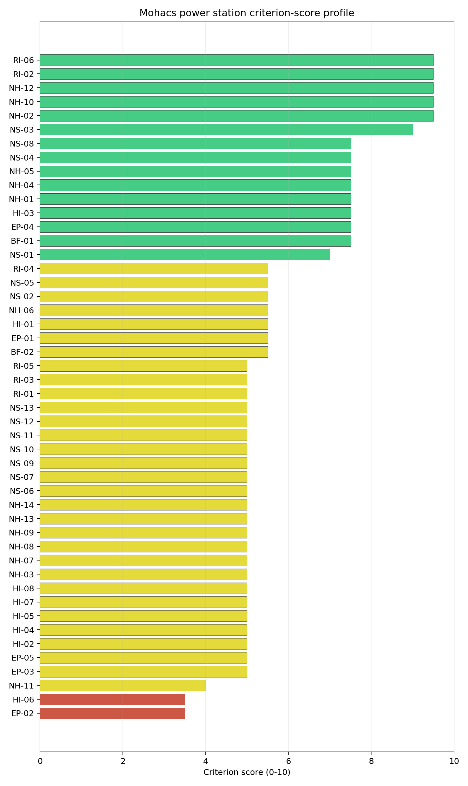
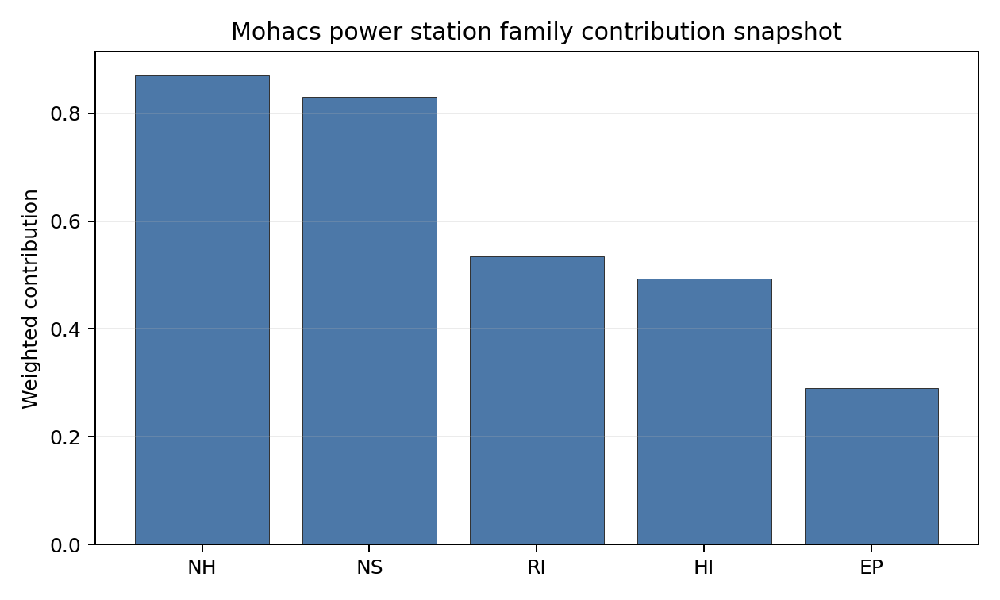

# Mohacs power station Site Profile

Mohacs power station is a coal/thermal site in Hungary that has been tested against the NuScale VOYGR-6 reference deployment envelope. This profile reads the screening evidence at a level that supports a decision to progress toward Stage 3 characterization. It is not a site-suitability determination, vendor recommendation, or licensing finding.

## Site Snapshot

| Field | Value |
| --- | --- |
| Site name | Mohacs power station |
| Coordinates | 45.9959, 18.6798 |
| Subnational unit | Southern Transdanubia |
| Installed thermal capacity (source data) | 1,200 MW |
| Composite score (baseline weights) | 6.467 (4.619-6.887 MC band) |
| National stability band | A (top-10% hit rate 100%) |
| National rank | 1 |

_See the country status map in_ [Hungary Country Profile](../HU_country_prototype.md#country-status-map).

## Ownership and Coal-to-Nuclear Context

- **Qatar Investment Authority** (1.36% share), headquartered in Qatar; immediate operator E.ON SE. Path: Qatar Investment Authority  -> Qatar Holding LLC [100.0%] -> RWE AG [9.1%] -> E.ON SE [15.0%] -> Mohacs power station -- [100.0%]
- **RWE AG** (15.00% share), headquartered in Germany; immediate operator E.ON SE. Path: RWE AG -> E.ON SE [15.0%] -> Mohacs power station -- [100.0%]
- **Blackrock Advisors LLC** (0.27% share), headquartered in United States; immediate operator E.ON SE. Path: Blackrock Advisors LLC -> BlackRock Inc [5.07%] -> E.ON SE [5.4%] -> Mohacs power station -- [100.0%]
- **Qatar Holding LLC** (1.36% share), headquartered in Qatar; immediate operator E.ON SE. Path: Qatar Holding LLC -> RWE AG [9.1%] -> E.ON SE [15.0%] -> Mohacs power station -- [100.0%]
- **natural person(s)** (1.80% share); immediate operator E.ON SE. Path: natural person(s)  -> RWE AG [12.0%] -> E.ON SE [15.0%] -> Mohacs power station -- [100.0%]
- **Government of Qatar** (1.36% share), headquartered in Qatar; immediate operator E.ON SE. Path: Government of Qatar  -> Qatar Investment Authority  [100.0%] -> Qatar Holding LLC [100.0%] -> RWE AG [9.1%] -> E.ON SE [15.0%] -> Mohacs power station -- [100.0%]
- **E.ON SE** (100.00% share), headquartered in Germany; immediate operator E.ON SE. Path: E.ON SE -> Mohacs power station -- [100.0%]
- **BlackRock Inc** (5.40% share), headquartered in United States; immediate operator E.ON SE. Path: BlackRock Inc -> E.ON SE [5.4%] -> Mohacs power station -- [100.0%]
- **small shareholder(s)** (79.60% share); immediate operator E.ON SE. Path: small shareholder(s)  -> E.ON SE [79.6%] -> Mohacs power station -- [100.0%]
- **The Vanguard Group Inc** (0.47% share), headquartered in United States; immediate operator E.ON SE. Path: The Vanguard Group Inc -> BlackRock Inc [8.66%] -> E.ON SE [5.4%] -> Mohacs power station -- [100.0%]

Generating units on record: 1 cancelled.

## Natural Hazards (NH)

- **Seismic: Ground Motion (NH-01)** - score 7.5/10 (MC 7.0-8.0), weight 0.0396, data quality high. Evidence: PGA at 475-year return period 0.054 g; PGA at 2,475-year return period 0.121 g; Vs30 reference (m/s): 760.0.
- **Seismic: Surface Rupture (NH-02)** - score 9.5/10 (MC 9.0-10.0), weight n/a, data quality screening grade. Evidence: nearest mapped capable fault 50.0 km; fault slip rate 0 mm/yr; fault name: none_in_search_radius.
- **Geotechnical: Liquefaction (NH-03)** - score 5.0/10 (MC 5.0-5.0), weight n/a, data quality medium. Evidence: liquefaction susceptibility: high; dominant soil type: silty_clay_loam.
- **Geotechnical: Slope Stability (NH-04)** - score 7.5/10 (MC 7.0-8.0), weight n/a, data quality screening grade. Evidence: site slope 6.82 deg; max slope in 1 km box 77.9 deg; slope stability class: moderate.
- **Geotechnical: Subsidence (NH-05)** - score 7.5/10 (MC 7.0-8.0), weight 0.0308, data quality medium. Evidence: karst present: no; karst severity: none.
- **Geotechnical: Foundation (NH-06)** - score 5.5/10 (MC 5.0-6.0), weight 0.0220, data quality medium. Evidence: bearing capacity 91.3 kPa; depth to bedrock 21.5 m.
- **Volcanism (NH-07)** - score 5.0/10 (MC 5.0-5.0), weight n/a, data quality high. Evidence: volcanic hazard class: negligible.
- **Coastal Flooding (NH-08)** - score 5.0/10 (MC 5.0-5.0), weight 0.0264, data quality low. Evidence: values not in measurement tables.
- **River Flooding (NH-09)** - score 5.0/10 (MC 5.0-5.0), weight 0.0352, data quality medium. Evidence: flood zone class: negligible.
- **Extreme Winds (NH-10)** - score 9.5/10 (MC 9.0-10.0), weight n/a, data quality medium. Evidence: design wind speed 7.37 m/s.
- **Extreme Precipitation (NH-11)** - score 4.0/10 (MC 4.0-4.0), weight 0.0132, data quality medium. Evidence: extreme daily precipitation 0.18 mm; mean annual precipitation 21.9 mm/yr.
- **Extreme Temperatures (NH-12)** - score 9.5/10 (MC 9.0-10.0), weight 0.0176, data quality medium. Evidence: extreme high temperature 25.5 deg C; extreme low temperature -4.51 deg C.
- **Forest/Wildfire (NH-13)** - score 5.0/10 (MC 5.0-5.0), weight 0.0132, data quality n/a. Evidence: values not in measurement tables.
- **Combined Hazards (NH-14)** - score 5.0/10 (MC 5.0-5.0), weight 0.0132, data quality n/a. Evidence: values not in measurement tables.

### Interpretation - Natural Hazards (NH)

<!-- specialist key=family_natural_hazards scope=site site_id=997474f6-9bfd-4abd-a2ac-d8618db8f0b4 bundle=HU_mohacs_power_station_site_bundle.json status=filled by=cursor-agent filled_at=2026-05-03T16:02:25Z -->
Natural hazards at Mohacs sit in the favourable Pannonian-basin low-seismic envelope on the gentle Danube alluvial plain, with no binding findings and a balanced family read across all hazard sub-domains. PGA at the 475-yr return period is **0.054 g** and at the 2,475-yr return period is **0.121 g**, well inside the NuScale VOYGR-6 project envelope of 0.5 g at 2,475-yr and the lowest seismic loading observed for any non-Bohemian first-batch site (the Pannonian-basin context is the structural advantage). The nearest mapped capable fault is null inside the 50 km screening search radius, so NH-02 settles at 9.5/10 and NH-01 at 7.5/10. Geotechnical conditions are middle-to-favourable: silty-clay-loam soils with a `high` liquefaction susceptibility (NH-03 at 5.0/10, the binding geotechnical question pending CPT measurement), screening-proxy bearing capacity 91.3 kPa (the highest of the first-batch cohort) and depth to bedrock 21.5 m. NH-04 reads 7.5/10 with a mean site slope of 6.82° on a `moderate` slope-stability class. **NH-05 Geotechnical: Subsidence at 7.5/10** is the cleanest subsidence read of the first-batch cohort with `karst not present` and `none` severity on the alluvial plain context. NH-06 holds at 5.5/10. Extreme meteorology is calm: a 50-yr design wind of 7.37 m/s and an extreme temperature range of -4.51 °C to 25.5 °C are well inside the project envelope (NH-10 and NH-12 both at 9.5/10). NH-11 reads 4.0/10 on the screening proxy with the same unit-mismatch artefact observed across the cohort. NH-07, NH-08 and NH-09 carry `inconclusive` avoidance verdicts (the latter is a meaningful Stage 3 question given the site's position on the Danube floodplain). The Stage 3 priority order is therefore: commission a Danube design-basis-flood study against the existing Mohacs levee crest under climate-projected 10,000-yr return periods so NH-09 lifts off the inconclusive read; run a CPT campaign so NH-03 settles on a measured liquefaction-susceptibility value rather than the screening proxy; and replace the screening precipitation reading with national meteorological station data.
<!-- /specialist key=family_natural_hazards -->

## Human-Induced and Security-Relevant Hazards (HI)

- **Aircraft Crash (HI-01)** - score 5.5/10 (MC 5.0-6.0), weight 0.0308, data quality high. Evidence: nearest airport 30.6 km; nearest flight path 15.3 km; airports within search radius 0; airport name: Mirkovac Airstrip; airport type: small_airport.
- **Industrial Explosions (HI-02)** - score 5.0/10 (MC 5.0-5.0), weight 0.0308, data quality high. Evidence: nearest industrial site 20.8 km.
- **Toxic/Gas Releases (HI-03)** - score 7.5/10 (MC 7.0-8.0), weight 0.0308, data quality high. Evidence: nearest toxic source 20.8 km.
- **External Fires (HI-04)** - score 5.0/10 (MC 5.0-5.0), weight 0.0264, data quality high. Evidence: values not in measurement tables.
- **Transport Hazards (HI-05)** - score 5.0/10 (MC 5.0-5.0), weight 0.0264, data quality n/a. Evidence: values not in measurement tables.
- **Military Installations (HI-06)** - score 3.5/10 (MC 3.0-4.0), weight 0.0264, data quality medium. Evidence: nearest military installation 20.3 km; military installations within radius 9.
- **Electromagnetic Interference (HI-07)** - score 5.0/10 (MC 5.0-5.0), weight 0.0088, data quality medium. Evidence: nearest high-power transmitter 0.06 km; transmitters within radius 170; transmitter type: communication.
- **Other Nuclear Installations (HI-08)** - score 5.0/10 (MC 5.0-5.0), weight 0.0132, data quality n/a. Evidence: values not in measurement tables.

### Interpretation - Human-Induced and Security-Relevant Hazards (HI)

<!-- specialist key=family_human_hazards scope=site site_id=997474f6-9bfd-4abd-a2ac-d8618db8f0b4 bundle=HU_mohacs_power_station_site_bundle.json status=filled by=cursor-agent filled_at=2026-05-03T16:02:25Z -->
Human-induced and security-relevant hazards at Mohacs are middle-band with no binding findings and zero `caution` avoidance flags, the cleanest HI envelope of the first-batch cohort after Plomin. The nearest civilian airport is the Mirkovac Airstrip (`small_airport`) at **30.6 km** (the second most distant of the first-batch cohort after Plomin's 26.6 km), with the nearest flight-path projection at 15.3 km and **zero airports inside the 30 km screening radius**. HI-01 settles at 5.5/10 on the comfortable design-basis margin. **HI-03 Toxic / Gas Releases at 7.5/10** carries the nearest toxic-source feature at 20.8 km (well outside the 5 km screening exclusion radius) and is one of the strongest HI-03 reads of the first-batch cohort, a structural advantage of the rural southern-Transdanubian context. **HI-02 Industrial Explosions at 5.0/10** carries the nearest industrial site at 20.8 km (the same feature). **HI-06 Military Installations** at 3.5/10 carries the nearest military feature at 20.3 km with **9 features inside the 25 km screening radius** (a moderate count, materially below the Czech sites but reflecting the Hungarian-Croatian-Serbian tri-junction defence cluster around the Danube crossing); the 20.3 km nearest-feature distance is comfortably outside the 8 km project A6 ammunition-storage avoidance trigger and the criterion is informational rather than binding. **HI-04 External Fires** and **HI-05 Transport Hazards** sit at the pass-mark default of 5.0/10. HI-07 Electromagnetic Interference scores 5.0/10 with the nearest broadcast feature at **0.06 km** (essentially co-located with the existing thermal complex, almost certainly a plant communications tower) and 170 transmitters inside the EMI search radius (a moderate count, comparable to the Czech sites). HI-08 (Other Nuclear Installations) is null. The Stage 3 priority order is therefore: identify the 20.8 km industrial / toxic-source feature and confirm its hazard envelope under the Hungarian Seveso cadastre; engage the Hungarian Ministry of National Defence on the 9 HI-06 features (a routine governance step rather than a binding question); and run a project EMC survey against the on-site mast and the 170-transmitter cadastre.
<!-- /specialist key=family_human_hazards -->

## Radiological Impact and Emergency Planning (RI / EP)

- **Emergency Planning Feasibility (EP-01)** - score 5.5/10 (MC 5.0-6.0), weight n/a, data quality high. Evidence: EP feasibility composite 64.3 /100; road sub-score 47.1 /100; special-population sub-score 90.0 /100; geography sub-score 95.0 /100; population sub-score 80.0 /100; evacuation feasible: yes.
- **Evacuation Routes (EP-02)** - score 3.5/10 (MC 3.0-4.0), weight 0.0264, data quality medium. Evidence: road density in EPZ 0.419 km/km2; road length in EPZ 822.1 km; motorway access: yes.
- **Physical Geography Constraints (EP-03)** - score 5.0/10 (MC 5.0-5.0), weight 0.0220, data quality medium. Evidence: waterways crossing EPZ 0; major river barrier: no.
- **Special Populations (EP-04)** - score 7.5/10 (MC 7.0-8.0), weight 0.0264, data quality medium. Evidence: hospitals in EPZ 5; prisons in EPZ 0; care homes in EPZ 0.
- **Concurrent Hazard Impact (EP-05)** - score 5.0/10 (MC 5.0-5.0), weight 0.0176, data quality n/a. Evidence: values not in measurement tables.
- **Atmospheric Dispersion (RI-01)** - score 5.0/10 (MC 5.0-5.0), weight 0.0264, data quality medium. Evidence: annual mean wind speed 0.93 m/s; atmospheric mixing height 484.5 m; prevailing wind direction: NW.
- **Surface Water Dispersion (RI-02)** - score 9.5/10 (MC 9.0-10.0), weight 0.0220, data quality n/a. Evidence: values not in measurement tables.
- **Groundwater Dispersion (RI-03)** - score 5.0/10 (MC 5.0-5.0), weight 0.0220, data quality medium. Evidence: aquifer type: alluvial.
- **Population Density at EPZ Radii (RI-04)** - score 5.5/10 (MC 5.0-6.0), weight 0.0352, data quality screening grade. Evidence: population density within 5 km 211.4 /km2; population density within 16 km 45.2 /km2; population density within 25 km 40.8 /km2; population density within 80 km 72.8 /km2; population within 25 km 80,031 people.
- **Distance to Population Centres (RI-05)** - score 5.0/10 (MC 5.0-5.0), weight 0.0441, data quality screening grade. Evidence: nearest city above 50k people 35.3 km; nearest city population 140,330 people; city name: Pécs.
- **Population Projections (RI-06)** - score 9.5/10 (MC 9.0-10.0), weight 0.0220, data quality screening grade. Evidence: annual population growth rate -1.011 %/yr; projected population at 25 km in 60 yr 74,410 people.

### Interpretation - Radiological Impact and Emergency Planning (RI / EP)

<!-- specialist key=family_radiological_emergency scope=site site_id=997474f6-9bfd-4abd-a2ac-d8618db8f0b4 bundle=HU_mohacs_power_station_site_bundle.json status=filled by=cursor-agent filled_at=2026-05-03T16:02:25Z -->
Radiological impact and emergency planning at Mohacs read as a low-population rural envelope on the favourable side, anchored by the Danube cooling envelope and the absence of any major population centre inside the 25 km EPZ. Population density at the screening epoch is **211.4 p/km² at 5 km** (driven by Mohacs town centre 3 km from the site), 45.2 p/km² at 16 km, 40.8 p/km² at 25 km and 72.8 p/km² at 80 km, with a 25 km total of 80,031 people; the nearest city above 50,000 people is Pécs at 35.3 km (population 140,330), well outside the 25 km EPZ envelope, so beyond the immediate Mohacs town context the population case is unambiguously rural and RI-04 lifts to 5.5/10. Trajectory is favourable for a 60-year siting horizon: a -1.011 %/yr regional growth rate yields a 25 km projection of 74,410 people in 60 years (down 7 % from the screening epoch), which lifts RI-06 to 9.5/10. The atmospheric envelope is calm: the screening reanalysis gives a mean wind speed of 0.93 m/s, a prevailing direction of NW (toward Pécs and the wider Trans-Danubian plain), and a mean planetary boundary-layer height of 484.5 m, holding RI-01 at 5.0/10. Aquifer type is `alluvial`, holding RI-03 at 5.0/10. **RI-02 Surface Water Dispersion** scores **9.5/10** on the screening read, anchored by the Danube cooling-source assignment (2,273 m³/s mean flow at 1.08 km), the strongest dilution envelope of the first-batch cohort alongside Vidin Works. The principal emergency-planning finding is **EP-02 Evacuation Routes at 3.5/10**: the road density inside the EPZ is 0.419 km/km² over 822.1 km of road and motorway access is present via the M6 corridor; the road sub-score 47.1/100 drives the EP-01 composite of **64.3/100** (FEASIBLE, the strongest EP-01 read of the first-batch cohort). EP-04 Special Populations at 7.5/10 carries 5 hospitals, 0 prisons and 0 care homes in the EPZ (the lightest emergency-planning surge envelope of the first-batch cohort). The Stage 3 priority order is therefore: model the EPZ time-to-clear under summer/winter loadings using Hungarian national emergency-planning traffic data with explicit modelling of the Mohacs town evacuation surge and the M6 corridor outbound traffic; coordinate cross-Danube emergency planning with the Croatian and Serbian authorities on cross-border population in the EPZ; and confirm the prevailing-NW direction does not place Pécs in the source-term plume sector under reasonable atmospheric conditions.
<!-- /specialist key=family_radiological_emergency -->

## Non-Safety and Implementation Considerations (NS)

- **Grid Capacity Basic Filter (BF-01)** - score 7.5/10 (MC 7.0-8.0), weight 0.0352, data quality n/a. Evidence: values not in measurement tables.
- **Land Area Basic Filter (BF-02)** - score 5.5/10 (MC 5.0-6.0), weight 0.0220, data quality n/a. Evidence: values not in measurement tables.
- **Cooling Water Availability (NS-01)** - score 7.0/10 (MC 6.0-7.0), weight n/a, data quality screening grade. Evidence: distance to cooling source 1.08 km; cooling source flow 2,273 m3/s; cooling source type: major_river; cooling source name: Danube; water stress label: Low.
- **Grid Connection (NS-02)** - score 5.5/10 (MC 5.0-6.0), weight 0.0352, data quality medium. Evidence: nearest substation 4.11 km; nearest high-voltage line 2.26 km; highest nearby line voltage 132.0 kV; grid export capacity 1,200 MW; substations within radius 0; HV lines within radius 0.
- **Transport Access (NS-03)** - score 9.0/10 (MC 8.0-9.0), weight 0.0352, data quality high. Evidence: nearest highway 0.84 km; nearest rail line 0.48 km; nearest waterway 17.8 km; heavy-haul capable: yes.
- **Site Topography (NS-04)** - score 7.5/10 (MC 7.0-8.0), weight 0.0264, data quality high. Evidence: favourable land cover 77.6 %; moderate land cover 8 %; unfavourable land cover 14.4 %; favourable area 68.6 ha; dominant land class: 112.
- **Site Footprint Adequacy (NS-05)** - score 5.5/10 (MC 5.0-6.0), weight 0.0220, data quality medium. Evidence: buildable area 30.2 ha; largest contiguous patch 15.9 ha; buildable patch count 8.
- **Existing Infrastructure (NS-06)** - score 5.0/10 (MC 5.0-5.0), weight 0.0220, data quality n/a. Evidence: values not in measurement tables.
- **Environmental Impact (non-rad) (NS-07)** - score 5.0/10 (MC 5.0-5.0), weight 0.0220, data quality n/a. Evidence: values not in measurement tables.
- **Ecological Sensitivity (NS-08)** - score 7.5/10 (MC 7.0-8.0), weight n/a, data quality high. Evidence: natural land cover 14.4 %; distance to nearest Natura 2000 site 0.738 km; distance to nearest protected area 0.738 km; Natura 2000 overlap: no; Natura 2000 sensitivity class: high; protected-area overlap: no; protected-area sensitivity class: high; nearest Natura 2000 site: Béda-Karapancsa; Natura 2000 sites within 5 km: 3; nearest protected-area designation: National Park.
- **Socioeconomic Impact (NS-09)** - score 5.0/10 (MC 5.0-5.0), weight 0.0220, data quality n/a. Evidence: values not in measurement tables.
- **Workforce Availability (NS-10)** - score 5.0/10 (MC 5.0-5.0), weight 0.0176, data quality n/a. Evidence: values not in measurement tables.
- **Coal-to-Nuclear Synergies (NS-11)** - score 5.0/10 (MC 5.0-5.0), weight 0.0264, data quality n/a. Evidence: values not in measurement tables.
- **Regulatory/Political Environment (NS-12)** - score 5.0/10 (MC 5.0-5.0), weight 0.0264, data quality n/a. Evidence: values not in measurement tables.
- **Construction Logistics (NS-13)** - score 5.0/10 (MC 5.0-5.0), weight 0.0176, data quality n/a. Evidence: values not in measurement tables.

### Interpretation - Non-Safety and Implementation Considerations (NS)

<!-- specialist key=family_infrastructure scope=site site_id=997474f6-9bfd-4abd-a2ac-d8618db8f0b4 bundle=HU_mohacs_power_station_site_bundle.json status=filled by=cursor-agent filled_at=2026-05-03T16:02:25Z -->
Non-safety implementation at Mohacs is the strongest balanced dimension of the first-batch cohort, anchored by an exceptional Danube cooling envelope, dense brownfield transport access, and a single binding ecological question on the adjacent Béda-Karapancsa National Park. **NS-03 Transport Access** scores **9.0/10** with the nearest highway at 0.84 km (the M6 motorway), the nearest rail line at 0.48 km, the nearest waterway at 17.8 km (the Danube via the Mohacs port channel) and `heavy-haul capable: yes`; the combination of motorway, rail and Danube barge access is one of the strongest reactor-vessel transport envelopes of any first-batch site. **NS-01 Cooling Water Availability** scores 7.0/10: the nearest perennial flow is the **Danube at 1.08 km with a flow of 2,273 m³/s** and a `Low` water-stress label, the strongest cooling envelope of the first-batch cohort alongside Vidin Works (5,552 m³/s). **BF-01 Grid Capacity** scores 7.5/10. **NS-04 Site Topography** scores 7.5/10 with **77.6 % favourable land cover** within the 2 km screening radius, 8.0 % moderate cover and 14.4 % unfavourable cover. **NS-05 Site Footprint Adequacy** scores 5.5/10 with a buildable area of 30.2 ha (largest contiguous patch only 15.9 ha across 8 patches); the 30.2 ha figure is at the threshold for a 6-module deployment and the 15.9 ha largest contiguous patch is the binding sub-finding — the project layout will need to span multiple patches or the deployment will need to be a smaller VOYGR-4. The principal Stage 3 question is **NS-08 Ecological Sensitivity** at 7.5/10: the dominant land class at the centroid is `discontinuous urban fabric`, 14.4 % natural land cover within 2 km, the nearest Natura 2000 site is the **Béda-Karapancsa Natura 2000 site at 0.738 km** (sensitivity class `high`, 3 Natura 2000 sites within 5 km, no overlap on the buildable patch), and the **nearest non-Natura protected area is at 0.738 km** with `high` sensitivity (a National Park designation, the same Béda-Karapancsa floodplain in its national protection envelope). The 0.74 km National Park distance is the binding ecological question and will require both a Habitats Directive Article 6(3) appropriate-assessment and a national-park boundary co-existence dialogue with the Hungarian conservation authority. **NS-02 Grid Connection** scores 5.5/10: the nearest substation is at 4.11 km, the nearest high-voltage line at 2.26 km, and the highest nearby line voltage is 132 kV; the screening grid-export-capacity figure at 1,200 MW reflects the cancelled-unit allocation, and the 0 substations and 0 HV lines inside the 25 km screening radius reflects the absence of higher-voltage transmission backbone in the immediate area, requiring a 132→220 kV connection upgrade for the project. The Stage 3 priority order is therefore: scope and commission the Habitats Directive Article 6(3) appropriate-assessment for the Béda-Karapancsa Natura 2000 site under the project EIA and open the National Park boundary co-existence dialogue with the Hungarian conservation authority; confirm the buildable-patch envelope under site-specific terrain modelling and consider a smaller VOYGR-4 deployment if the 15.9 ha largest contiguous patch is binding; and open the Hungarian transmission-system-operator dialogue on a 132→220 kV upgrade at the nearest substation.
<!-- /specialist key=family_infrastructure -->

## Composite Score and Stability

Baseline composite score is 6.467, bracketed by Monte Carlo at 4.619-6.887. National stability band is `A` with a top-10% hit rate of 100% across 16 scored Monte Carlo scenarios.

<!-- specialist key=stability scope=site site_id=997474f6-9bfd-4abd-a2ac-d8618db8f0b4 bundle=HU_mohacs_power_station_site_bundle.json status=filled by=cursor-agent filled_at=2026-05-03T16:02:25Z -->
Mohacs sits at national rank 1 in the Hungarian cohort with the strongest combined stability read of any first-batch site: an exceptional **A national band and A regional band** across the 10,000-iteration sensitivity sweep, with a **100 % top-10 % hit rate and 100 % top-5 % hit rate** at both the national and the regional level. The composite score of **6.467** (MC band 4.619–6.887) is the highest of the first-batch cohort and the band rank confirms the site is robust to weight perturbations within the screening method: no plausible re-weighting moves the site out of the upper national or regional tail. Family-level normalised contributions show natural hazards as the dominant positive (mean 0.65, anchored by the Pannonian-basin low-seismic envelope and the gentle alluvial terrain), with infrastructure (0.60) and radiological (0.60) close behind, while human-induced (0.52) is the relative drag. The top contributing criteria mirror this pattern: NS-03 Transport Access (the strongest single contributor at 0.32 contrib weight, anchored by the M6 motorway and the Danube barge access), NH-01 Seismic Ground Motion (0.30), BF-01 Grid Capacity, HI-03 Toxic Releases, NH-05 Subsidence and RI-05 Distance to Population Centres all push toward the FAVOURABLE band, while EP-02 Evacuation Routes, HI-06 Military Installations, NS-05 Footprint Adequacy and the NS-08 ecological sensitivity (the National Park at 0.74 km) act as the relative drags but none reaches the binding floor. The A-A combined band is the structural strength of the site: Mohacs is not constrained by any binding finding that the screening cannot reach, which makes it the cleanest project-economics case of the first-batch cohort and the natural Hungarian lead site for the Stage 3 sequence. The Stage 3 work that would tighten the composite uncertainty band most quickly is the NS-08 Habitats Directive Article 6(3) appropriate-assessment for the Béda-Karapancsa National Park, the NS-05 buildable-patch confirmation, and the NS-02 132→220 kV grid upgrade scoping.
<!-- /specialist key=stability -->

## Residual Risk Register

<!-- specialist key=residual_risk scope=site site_id=997474f6-9bfd-4abd-a2ac-d8618db8f0b4 bundle=HU_mohacs_power_station_site_bundle.json status=filled by=cursor-agent filled_at=2026-05-03T16:02:25Z -->
| Criterion | Description | Owner | Resolution path |
|---|---|---|---|
| NS-08 | Béda-Karapancsa National Park at 0.738 km with `high` sensitivity (the same feature also a Natura 2000 site at 0.738 km with sensitivity class `high`); 3 Natura 2000 sites within 5 km. | Project ecologist; Hungarian conservation authority | Habitats Directive Article 6(3) appropriate-assessment under the project EIA and National Park boundary co-existence dialogue. |
| NS-05 | Buildable area 30.2 ha but largest contiguous patch only 15.9 ha across 8 patches; below the threshold for a 6-module deployment with conventional spacing. | Project civil engineer | Confirm buildable-patch envelope under site-specific terrain modelling; consider a smaller VOYGR-4 deployment if the largest contiguous patch is binding. |
| NS-02 | Highest nearby line voltage 132 kV; nearest substation at 4.11 km; 0 substations and 0 HV lines inside the 25 km screening radius. | Hungarian transmission system operator | 132→220 kV upgrade at the nearest substation. |
| EP-02 | Evacuation road density 0.419 km/km² over 822.1 km on a single M6 corridor outbound from the EPZ. | National emergency planner | EPZ time-to-clear modelling under summer/winter loadings using Hungarian national emergency-planning traffic data. |
| HI-06 | 9 military features inside the 25 km screening radius (20.3 km nearest); reflects the Hungarian-Croatian-Serbian tri-junction defence cluster around the Danube crossing. | Hungarian Ministry of National Defence | Engage the operators of the 9 features; routine governance step rather than a binding question. |
| NH-09 | Site sits on the Danube floodplain; flood-zone class `negligible` on screening grade with `inconclusive` avoidance verdict. | Hydrologist | Danube design-basis-flood study against the Mohacs levee crest under climate-projected 10,000-yr return periods. |
| NH-03 | Liquefaction susceptibility `high` on silty-clay-loam soils. | Geotechnical engineer | CPT campaign to settle on a measured susceptibility value rather than the screening proxy. |
| Cross-border emergency planning | EPZ extends across the Danube into Croatia and Serbia (the Hungarian-Croatian-Serbian tri-junction sits within 25 km of the site). | National emergency planner | Cross-border emergency-planning coordination with the Croatian and Serbian authorities under bilateral nuclear-emergency conventions. |
| NS-01 / RI-02 | Cooling and dispersion envelope is anchored by the Danube; Stage 3 must confirm the project water budget against climate-projected low-flow conditions. | Hydrologist; project water engineer | Confirm Danube allocation and discharge envelope under climate-projected low-flow conditions. |
<!-- /specialist key=residual_risk -->

## Stage 3 Follow-Up Checklist

- [ ] Re-measure **Evacuation Routes (EP-02)** - native score 3.5/10 with confidence medium.
- [ ] Re-measure **Military Installations (HI-06)** - native score 3.5/10 with confidence medium.
- [ ] Re-measure **Extreme Precipitation (NH-11)** - native score 4.0/10 with confidence medium.
- [ ] Re-measure **Physical Geography Constraints (EP-03)** - native score 5.0/10 with confidence medium.
- [ ] Re-measure **Concurrent Hazard Impact (EP-05)** - native score 5.0/10 with confidence insufficient.
- [ ] Improve data quality for **Coastal Flooding (NH-08)** - current flag `low`.

## Evidence Limitations

- Coastal Flooding (NH-08) - quality `low`.
