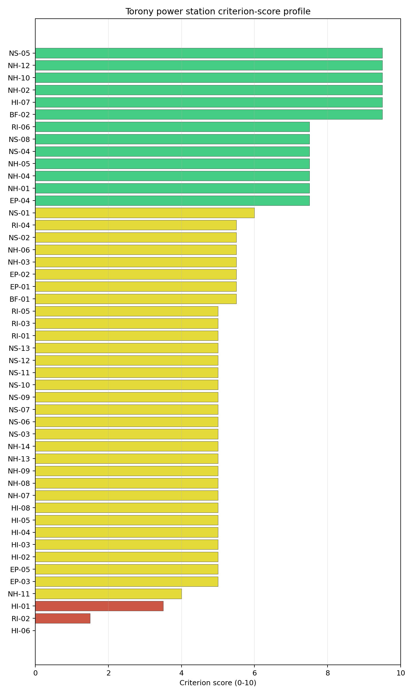

# Torony power station Site Profile

Torony power station is a coal/thermal site in Hungary that has been tested against the NuScale VOYGR-6 reference deployment envelope. This profile reads the screening evidence at a level that supports a decision to progress toward Stage 3 characterization. It is not a site-suitability determination, vendor recommendation, or licensing finding.

## Site Snapshot

| Field | Value |
| --- | --- |
| Site name | Torony power station |
| Coordinates | 47.2363, 16.5371 |
| Subnational unit | Western Transdanubia |
| Installed thermal capacity (source data) | 600 MW |
| Composite score (baseline weights) | 6.010 (4.339-6.396 MC band) |
| National stability band | D (top-10% hit rate 6%) |
| National rank | 2 |

_See the country status map in_ [Hungary Country Profile](../HU_country_prototype.md#country-status-map).

## Ownership and Coal-to-Nuclear Context

Generating units on record: 1 cancelled.

## Natural Hazards (NH)

- **Seismic: Ground Motion (NH-01)** - score 7.5/10 (MC 7.0-8.0), weight 0.0396, data quality high. Evidence: PGA at 475-year return period 0.058 g; PGA at 2,475-year return period 0.13 g; Vs30 reference (m/s): 760.0.
- **Seismic: Surface Rupture (NH-02)** - score 9.5/10 (MC 9.0-10.0), weight n/a, data quality screening grade. Evidence: nearest mapped capable fault 50.0 km; fault slip rate 0 mm/yr; fault name: none_in_search_radius.
- **Geotechnical: Liquefaction (NH-03)** - score 5.5/10 (MC 5.0-6.0), weight n/a, data quality medium. Evidence: liquefaction susceptibility: moderate; dominant soil type: silty_clay_loam.
- **Geotechnical: Slope Stability (NH-04)** - score 7.5/10 (MC 7.0-8.0), weight n/a, data quality screening grade. Evidence: site slope 9.06 deg; max slope in 1 km box 85.5 deg; slope stability class: moderate.
- **Geotechnical: Subsidence (NH-05)** - score 7.5/10 (MC 7.0-8.0), weight 0.0308, data quality medium. Evidence: karst present: no; karst severity: none.
- **Geotechnical: Foundation (NH-06)** - score 5.5/10 (MC 5.0-6.0), weight 0.0220, data quality medium. Evidence: bearing capacity 83.3 kPa; depth to bedrock 19.7 m.
- **Volcanism (NH-07)** - score 5.0/10 (MC 5.0-5.0), weight n/a, data quality high. Evidence: volcanic hazard class: negligible.
- **Coastal Flooding (NH-08)** - score 5.0/10 (MC 5.0-5.0), weight 0.0264, data quality low. Evidence: values not in measurement tables.
- **River Flooding (NH-09)** - score 5.0/10 (MC 5.0-5.0), weight 0.0352, data quality medium. Evidence: flood zone class: negligible.
- **Extreme Winds (NH-10)** - score 9.5/10 (MC 9.0-10.0), weight n/a, data quality medium. Evidence: design wind speed 8.38 m/s.
- **Extreme Precipitation (NH-11)** - score 4.0/10 (MC 4.0-4.0), weight 0.0132, data quality medium. Evidence: extreme daily precipitation 0.21 mm; mean annual precipitation 24.6 mm/yr.
- **Extreme Temperatures (NH-12)** - score 9.5/10 (MC 9.0-10.0), weight 0.0176, data quality medium. Evidence: extreme high temperature 24.0 deg C; extreme low temperature -4.23 deg C.
- **Forest/Wildfire (NH-13)** - score 5.0/10 (MC 5.0-5.0), weight 0.0132, data quality n/a. Evidence: values not in measurement tables.
- **Combined Hazards (NH-14)** - score 5.0/10 (MC 5.0-5.0), weight 0.0132, data quality n/a. Evidence: values not in measurement tables.

### Interpretation - Natural Hazards (NH)

<!-- specialist key=family_natural_hazards scope=site site_id=059b3ad4-7196-4e6b-b169-8605ceeed841 bundle=HU_torony_power_station_site_bundle.json status=filled by=cursor-agent filled_at=2026-05-03T16:06:33Z -->
Natural hazards at Torony sit in the favourable Pannonian-basin low-seismic envelope on the western Transdanubian plain, with no binding findings and a balanced family read across all hazard sub-domains. PGA at the 475-yr return period is **0.058 g** and at the 2,475-yr return period is **0.130 g**, well inside the NuScale VOYGR-6 project envelope of 0.5 g at 2,475-yr and consistent with the wider Pannonian-basin context observed at Mohacs. The nearest mapped capable fault is null inside the 50 km screening search radius, so NH-02 settles at 9.5/10 and NH-01 at 7.5/10. Geotechnical conditions are middle-to-favourable: silty-clay-loam soils with a `moderate` liquefaction susceptibility (NH-03 at 5.5/10, marginally cleaner than the Mohacs `high` read), screening-proxy bearing capacity 83.3 kPa and depth to bedrock 19.7 m. NH-04 reads 7.5/10 with a mean site slope of 9.06° on a `moderate` slope-stability class. **NH-05 Geotechnical: Subsidence at 7.5/10** matches the Mohacs read with `karst not present` and `none` severity on the alluvial plain context. NH-06 holds at 5.5/10 on the moderate-cover read. Extreme meteorology is calm: a 50-yr design wind of 8.38 m/s and an extreme temperature range of -4.23 °C to 24.0 °C are well inside the project envelope (NH-10 and NH-12 both at 9.5/10). NH-11 reads 4.0/10 on the screening proxy with the same unit-mismatch artefact observed across the cohort. NH-07, NH-08 and NH-09 carry `inconclusive` avoidance verdicts, but the 235 m site elevation removes the coastal-flooding question and the absence of a major river within the screening radius lifts most of the river-flooding concern. The Stage 3 priority order is therefore: run a CPT campaign on the buildable patch so NH-03 settles on a measured liquefaction-susceptibility value rather than the screening proxy; commission a local hydrological survey to confirm the absence of significant surface water flood pathways across the buildable patch so NH-09 lifts off the inconclusive read; and replace the screening precipitation reading with national meteorological station data.
<!-- /specialist key=family_natural_hazards -->

## Human-Induced and Security-Relevant Hazards (HI)

- **Aircraft Crash (HI-01)** - score 3.5/10 (MC 3.0-4.0), weight 0.0308, data quality high. Evidence: nearest airport 6.13 km; nearest flight path 4.16 km; airports within search radius 8; airport name: Markusovszky Hospital Heliport; airport type: heliport.
- **Industrial Explosions (HI-02)** - score 5.0/10 (MC 5.0-5.0), weight 0.0308, data quality medium. Evidence: values not in measurement tables.
- **Toxic/Gas Releases (HI-03)** - score 5.0/10 (MC 5.0-5.0), weight 0.0308, data quality medium. Evidence: values not in measurement tables.
- **External Fires (HI-04)** - score 5.0/10 (MC 5.0-5.0), weight 0.0264, data quality medium. Evidence: values not in measurement tables.
- **Transport Hazards (HI-05)** - score 5.0/10 (MC 5.0-5.0), weight 0.0264, data quality n/a. Evidence: values not in measurement tables.
- **Military Installations (HI-06)** - score 0.0/10 (MC 0.0-0.0), weight 0.0264, data quality not_found. Evidence: nearest military installation 4.83 km; military installations within radius 0.
- **Electromagnetic Interference (HI-07)** - score 9.5/10 (MC 9.0-10.0), weight 0.0088, data quality not_found. Evidence: nearest high-power transmitter 1.95 km; transmitters within radius 0; transmitter type: observation.
- **Other Nuclear Installations (HI-08)** - score 5.0/10 (MC 5.0-5.0), weight 0.0132, data quality n/a. Evidence: values not in measurement tables.

### Interpretation - Human-Induced and Security-Relevant Hazards (HI)

<!-- specialist key=family_human_hazards scope=site site_id=059b3ad4-7196-4e6b-b169-8605ceeed841 bundle=HU_torony_power_station_site_bundle.json status=filled by=cursor-agent filled_at=2026-05-03T16:06:33Z -->
Human-induced and security-relevant hazards at Torony carry an HI-01 caution driven by the Markusovszky Hospital Heliport and an HI-06 floor read held on screening-grade quality, with the rest of the family in the middle band. The nearest civilian air feature is the **Markusovszky Hospital Heliport at 6.13 km** in central Szombathely, with the nearest flight-path projection at 4.16 km (just outside the SSG-35 A4 4 km flight-path screening trigger), and **8 air features inside the 30 km screening radius** (a moderate count, materially below the Czech sites). HI-01 settles at 3.5/10 on the heliport-proximity trigger, but unlike the Bobov Dol or Pocerady airfield cases the dominant air feature is a hospital heliport with low-altitude operator-controlled traffic, which the SSG-79 hazard assessment will read as a low-energy sub-class with a known flight profile. **HI-06 Military Installations** at **0.0/10** carries a screening read of 0 features inside the 25 km radius with `not_found` data quality and a residual nearest-feature reference at 4.83 km that is the same kind of legacy cadastre artefact observed at Tušimice, Pocerady and Plomin (the criterion floors on the screening method's handling of `not_found` data, not on a positive military-installation finding) and is a Stage 3 question for the Hungarian Ministry of National Defence on the live cadastre rather than a binding governance issue. **HI-02 Industrial Explosions, HI-03 Toxic / Gas Releases, HI-04 External Fires and HI-05 Transport Hazards** all sit at the pass-mark default of 5.0/10 on the same screening under-detection observed across the cohort, but the proximity to the Szombathely industrial estate (6.66 km from the nearest city centre) means a national Seveso cadastre run is more likely to flag positive features than at the more isolated Mohacs site. HI-07 Electromagnetic Interference scores 9.5/10 with the nearest broadcast feature at 1.95 km (an observation tower) but **zero transmitters inside the EMI stand-off radius** on `not_found` quality. HI-08 (Other Nuclear Installations) is null. The Stage 3 priority order is therefore: commission an SSG-79 aircraft-crash hazard assessment for the Markusovszky Hospital Heliport with the explicit question of whether the operator-controlled flight profile lifts the screening trigger; obtain the live Hungarian Ministry of National Defence cadastre for the 25 km screening radius so HI-06 lifts off the `not_found` floor; and run the Hungarian national Seveso and hazmat-corridor cadastres so HI-02 to HI-05 convert from `screening grade` to defensible measured distances against the Szombathely industrial estate.
<!-- /specialist key=family_human_hazards -->

## Radiological Impact and Emergency Planning (RI / EP)

- **Emergency Planning Feasibility (EP-01)** - score 5.5/10 (MC 5.0-6.0), weight n/a, data quality high. Evidence: EP feasibility composite 40.5 /100; road sub-score 56.7 /100; special-population sub-score 10.0 /100; geography sub-score 95.0 /100; population sub-score 80.0 /100; evacuation feasible: yes.
- **Evacuation Routes (EP-02)** - score 5.5/10 (MC 5.0-6.0), weight 0.0264, data quality medium. Evidence: road density in EPZ 0.579 km/km2; road length in EPZ 1,136 km; motorway access: yes.
- **Physical Geography Constraints (EP-03)** - score 5.0/10 (MC 5.0-5.0), weight 0.0220, data quality medium. Evidence: waterways crossing EPZ 0; major river barrier: no.
- **Special Populations (EP-04)** - score 7.5/10 (MC 7.0-8.0), weight 0.0264, data quality medium. Evidence: hospitals in EPZ 3; prisons in EPZ 1; care homes in EPZ 4.
- **Concurrent Hazard Impact (EP-05)** - score 5.0/10 (MC 5.0-5.0), weight 0.0176, data quality n/a. Evidence: values not in measurement tables.
- **Atmospheric Dispersion (RI-01)** - score 5.0/10 (MC 5.0-5.0), weight 0.0264, data quality medium. Evidence: annual mean wind speed 0.91 m/s; atmospheric mixing height 506.7 m; prevailing wind direction: NNW.
- **Surface Water Dispersion (RI-02)** - score 1.5/10 (MC 1.0-2.0), weight 0.0220, data quality n/a. Evidence: values not in measurement tables.
- **Groundwater Dispersion (RI-03)** - score 5.0/10 (MC 5.0-5.0), weight 0.0220, data quality medium. Evidence: aquifer type: sedimentary sands.
- **Population Density at EPZ Radii (RI-04)** - score 5.5/10 (MC 5.0-6.0), weight 0.0352, data quality screening grade. Evidence: population density within 5 km 150.5 /km2; population density within 16 km 145.9 /km2; population density within 25 km 93.1 /km2; population density within 80 km 79.9 /km2; population within 25 km 182,718 people.
- **Distance to Population Centres (RI-05)** - score 5.0/10 (MC 5.0-5.0), weight 0.0441, data quality screening grade. Evidence: nearest city above 50k people 6.66 km; nearest city population 77,757 people; city name: Szombathely.
- **Population Projections (RI-06)** - score 7.5/10 (MC 7.0-8.0), weight 0.0220, data quality screening grade. Evidence: annual population growth rate -0.379 %/yr; projected population at 25 km in 60 yr 169,906 people.

### Interpretation - Radiological Impact and Emergency Planning (RI / EP)

<!-- specialist key=family_radiological_emergency scope=site site_id=059b3ad4-7196-4e6b-b169-8605ceeed841 bundle=HU_torony_power_station_site_bundle.json status=filled by=cursor-agent filled_at=2026-05-03T16:06:33Z -->
Radiological impact and emergency planning at Torony are the most challenging dimension of the site, dominated by the immediate proximity of Szombathely (population 77,757) at **6.66 km** — the closest major city of any first-batch site relative to the EPZ envelope — and by the EP-04 special-population load. Population density at the screening epoch is **150.5 p/km² at 5 km, 145.9 p/km² at 16 km, 93.1 p/km² at 25 km and 79.9 p/km² at 80 km**, with a 25 km total of **182,718 people**; the dominant population case is Szombathely itself (population 77,757) at **6.66 km from the site**, well inside the 16 km inner EPZ ring and the binding population finding for Stage 3 work. Trajectory is mildly favourable: a -0.379 %/yr regional growth rate yields a 25 km projection of 169,906 people in 60 years (down 7 % from the screening epoch), which lifts RI-06 to 7.5/10. Under the screening hierarchy the 5 km density flags RI-04 at 5.5/10. The atmospheric envelope is calm with a directional bias: the screening reanalysis gives a mean wind speed of 0.91 m/s, a prevailing direction of NNW, and a mean planetary boundary-layer height of 506.7 m, holding RI-01 at 5.0/10 (the prevailing-NNW direction with Szombathely to the SW means the dominant population centre is offset from the prevailing plume sector but is still inside the 16 km EPZ inner ring under any wind direction). Aquifer type is `sedimentary sands`, holding RI-03 at 5.0/10. **RI-02 Surface Water Dispersion** at **1.5/10** holds at the screening floor pending a measured Arany-patak dilution flow at the cooling-source discharge point (the screening cooling-source flow of 2.46 m³/s on the Arany-patak is the lowest of the first-batch cohort and is the binding RI-02 read). The principal emergency-planning finding is **EP-01 Composite at 40.5/100 (FEASIBLE) with special-population sub-score 10/100** — the lowest EP envelope of the first-batch cohort: the EPZ contains **3 hospitals, 1 prison and 4 care homes** (the heaviest care-home count of the cohort, driven by the Szombathely retirement-care cluster). EP-02 reads 5.5/10 with road density 0.579 km/km² over 1,136 km of road. The Stage 3 priority order is therefore: model the EPZ time-to-clear under summer/winter loadings using Hungarian national emergency-planning traffic data with explicit modelling of the Szombathely urban evacuation surge (the binding population case at 6.66 km) and the 4-care-home special-population surge; consider a smaller VOYGR-4 deployment to reduce the source-term envelope given the binding Szombathely proximity; source the Arany-patak dilution flow under low-flow conditions so RI-02 lifts off the floor; and confirm the prevailing-NNW direction does not place the Szombathely city centre in the source-term plume sector under reasonable atmospheric stability.
<!-- /specialist key=family_radiological_emergency -->

## Non-Safety and Implementation Considerations (NS)

- **Grid Capacity Basic Filter (BF-01)** - score 5.5/10 (MC 5.0-6.0), weight 0.0352, data quality n/a. Evidence: values not in measurement tables.
- **Land Area Basic Filter (BF-02)** - score 9.5/10 (MC 9.0-10.0), weight 0.0220, data quality n/a. Evidence: values not in measurement tables.
- **Cooling Water Availability (NS-01)** - score 6.0/10 (MC 6.0-6.0), weight n/a, data quality screening grade. Evidence: distance to cooling source 4.67 km; cooling source flow 2.46 m3/s; cooling source type: small_river; cooling source name: Arany-patak; water stress label: Low.
- **Grid Connection (NS-02)** - score 5.5/10 (MC 5.0-6.0), weight 0.0352, data quality medium. Evidence: nearest substation 1.29 km; nearest high-voltage line 7.71 km; highest nearby line voltage 132.0 kV; grid export capacity 600.0 MW; substations within radius 379; HV lines within radius 301.
- **Transport Access (NS-03)** - score 5.0/10 (MC 5.0-5.0), weight 0.0352, data quality low. Evidence: values not in measurement tables.
- **Site Topography (NS-04)** - score 7.5/10 (MC 7.0-8.0), weight 0.0264, data quality high. Evidence: favourable land cover 66.0 %; moderate land cover 4 %; unfavourable land cover 30.0 %; favourable area 89.3 ha; dominant land class: 211.
- **Site Footprint Adequacy (NS-05)** - score 9.5/10 (MC 9.0-10.0), weight 0.0220, data quality screening grade. Evidence: buildable area 135.3 ha; largest contiguous patch 464.5 ha; buildable patch count 6.
- **Existing Infrastructure (NS-06)** - score 5.0/10 (MC 5.0-5.0), weight 0.0220, data quality n/a. Evidence: values not in measurement tables.
- **Environmental Impact (non-rad) (NS-07)** - score 5.0/10 (MC 5.0-5.0), weight 0.0220, data quality n/a. Evidence: values not in measurement tables.
- **Ecological Sensitivity (NS-08)** - score 7.5/10 (MC 7.0-8.0), weight n/a, data quality high. Evidence: natural land cover 30.0 %; distance to nearest Natura 2000 site 6.926 km; distance to nearest protected area 5.536 km; Natura 2000 overlap: no; Natura 2000 sensitivity class: low; protected-area overlap: no; protected-area sensitivity class: low; nearest Natura 2000 site: Pinka; Natura 2000 sites within 5 km: 0; nearest protected-area designation: Nature Conservation Area.
- **Socioeconomic Impact (NS-09)** - score 5.0/10 (MC 5.0-5.0), weight 0.0220, data quality n/a. Evidence: values not in measurement tables.
- **Workforce Availability (NS-10)** - score 5.0/10 (MC 5.0-5.0), weight 0.0176, data quality n/a. Evidence: values not in measurement tables.
- **Coal-to-Nuclear Synergies (NS-11)** - score 5.0/10 (MC 5.0-5.0), weight 0.0264, data quality n/a. Evidence: values not in measurement tables.
- **Regulatory/Political Environment (NS-12)** - score 5.0/10 (MC 5.0-5.0), weight 0.0264, data quality n/a. Evidence: values not in measurement tables.
- **Construction Logistics (NS-13)** - score 5.0/10 (MC 5.0-5.0), weight 0.0176, data quality n/a. Evidence: values not in measurement tables.

### Interpretation - Non-Safety and Implementation Considerations (NS)

<!-- specialist key=family_infrastructure scope=site site_id=059b3ad4-7196-4e6b-b169-8605ceeed841 bundle=HU_torony_power_station_site_bundle.json status=filled by=cursor-agent filled_at=2026-05-03T16:06:33Z -->
Non-safety implementation at Torony is middle-band, with strong land-cover and footprint envelopes offset by a binding cooling-water finding on the small Arany-patak and a 132 kV grid connection that requires upgrade. **NS-05 Site Footprint Adequacy** scores **9.5/10** with a buildable area of 135.3 ha and a largest contiguous favourable patch of 464.5 ha (the largest of any first-batch site, reflecting the open western-Transdanubian plain context). **BF-02 Land Area** scores 9.5/10 confirming the regional headroom. **NS-04 Site Topography** scores 7.5/10 with **66.0 % favourable land cover** within the 2 km screening radius, 4 % moderate cover and 30.0 % unfavourable cover. **NS-08 Ecological Sensitivity** at 7.5/10 reads 30.0 % natural land cover within 2 km, the nearest Natura 2000 site (Pinka) at 6.93 km with sensitivity class `low`, the nearest non-Natura protected area at 5.54 km with sensitivity class `low` (a Nature Conservation Area), and 0 Natura 2000 sites within 5 km — the cleanest ecological envelope of the Hungarian first-batch cohort. The principal Stage 3 question is **NS-01 Cooling Water Availability** at 6.0/10: the nearest perennial flow is the **Arany-patak at 4.67 km with a flow of only 2.46 m³/s** (the lowest cooling-source flow of the first-batch cohort by a margin) and a `Low` water-stress label. The 2.46 m³/s figure is materially below the cooling-water demand of a NuScale VOYGR-6 once-through configuration; the Stage 3 cooling envelope must rely on a closed-cycle cooling-tower configuration or a long pipeline from a larger receptor (the Rába or the Mura), and this is the binding implementation question. **NS-02 Grid Connection** scores 5.5/10: the nearest substation is at 1.29 km, the nearest high-voltage line at 7.71 km, the highest nearby line voltage is 132 kV, but **379 substations and 301 HV lines inside the 25 km screening radius** indicate a dense regional grid context (the Szombathely-Sopron transmission corridor); the 132 kV connection would require a 132→220 kV upgrade for the project capacity envelope but the dense surrounding grid means the upgrade is a routine operator dialogue. **NS-03 Transport Access** holds at the 5.0/10 screening default with `low` data quality, pending a measured transport assessment for the Szombathely-Sopron rail and motorway corridor. The Stage 3 priority order is therefore: confirm the Arany-patak and alternate cooling-water envelopes (closed-cycle tower or pipeline from a larger receptor) so NS-01 lifts off the binding read; open the Hungarian transmission-system-operator dialogue on the 132→220 kV upgrade at the Torony substation; and commission a measured transport assessment for the Szombathely corridor so NS-03 lifts off the screening default.
<!-- /specialist key=family_infrastructure -->

## Composite Score and Stability

Baseline composite score is 6.010, bracketed by Monte Carlo at 4.339-6.396. National stability band is `D` with a top-10% hit rate of 6% across 16 scored Monte Carlo scenarios.

<!-- specialist key=stability scope=site site_id=059b3ad4-7196-4e6b-b169-8605ceeed841 bundle=HU_torony_power_station_site_bundle.json status=filled by=cursor-agent filled_at=2026-05-03T16:06:33Z -->
Torony sits at national rank 2 in the Hungarian cohort with a **D-band** national stability and **D-band** regional stability across the 10,000-iteration sensitivity sweep, materially weaker than Mohacs's A/A read despite a comparable composite score. The composite score of 6.010 (MC band 4.339–6.396) is just below Mohacs's 6.467 but the band rank tells the executive reader that the site is meaningfully sensitive to weight perturbations: the **6 % top-10 % hit rate and 0 % top-5 % hit rate** across all 16 scored Monte Carlo scenarios indicate the site rarely makes it into the upper national tail under plausible re-weightings — the structural reason is the binding RI-04 Szombathely proximity case and the binding NS-01 Arany-patak cooling-water case, both of which carry meaningful weight under most re-weightings. Family-level normalised contributions show natural hazards as the dominant positive (mean 0.65, the strongest natural-hazard read of the Hungarian cohort), with infrastructure (0.61, anchored by NS-05 footprint and BF-02 land area) close behind, while radiological (0.53) and human-induced (0.48) act as the relative drags. The top contributing criteria mirror this pattern: NH-01 Seismic Ground Motion (the strongest single contributor at 0.30 contrib weight), NH-05 Subsidence, BF-02 Land Area, NS-05 Site Footprint and EP-04 Special Populations all push toward the FAVOURABLE band, while HI-06 Military Installations (the floor read at 0.0/10), RI-02 Surface Water Dispersion (the binding read at 1.5/10) and HI-01 Aircraft Crash act as binding drags. The D-D combined band is the structural read of the site: relative to Mohacs, Torony carries a comparable natural-hazard envelope but a materially heavier population and special-population load (Szombathely at 6.66 km vs Pécs at 35.3 km for Mohacs) and a more constrained cooling envelope (Arany-patak at 2.46 m³/s vs the Danube at 2,273 m³/s). The Stage 3 work that would tighten the composite uncertainty band most quickly is the NS-01 cooling-water envelope confirmation and the EP/RI Szombathely population modelling.
<!-- /specialist key=stability -->

## Residual Risk Register

<!-- specialist key=residual_risk scope=site site_id=059b3ad4-7196-4e6b-b169-8605ceeed841 bundle=HU_torony_power_station_site_bundle.json status=filled by=cursor-agent filled_at=2026-05-03T16:06:33Z -->
| Criterion | Description | Owner | Resolution path |
|---|---|---|---|
| RI-04 / RI-05 | Szombathely (population 77,757) at 6.66 km from the site, well inside the 16 km EPZ inner ring; 182,718 people inside the 25 km EPZ. | Project radiation protection specialist | Source-term placement and atmospheric dispersion modelling against the prevailing-NNW direction; consider a smaller VOYGR-4 deployment to reduce the source-term envelope. |
| NS-01 | Arany-patak cooling source at 4.67 km with flow only 2.46 m³/s (the lowest of the first-batch cohort), materially below the cooling-water demand of a NuScale VOYGR-6 once-through configuration. | Hydrologist; project water engineer | Confirm Arany-patak allocation under climate-projected low-flow conditions; scope a closed-cycle / cooling-tower secondary option or a long pipeline from the Rába or Mura. |
| RI-02 | Surface-water dispersion held at 1.5/10 on the screening floor pending a measured Arany-patak dilution flow. | Hydrologist | Source the Arany-patak dilution flow at the cooling-source discharge point; quantify low-flow recurrence and downstream user inventory. |
| EP-01 / EP-04 | EP composite 40.5/100 (FEASIBLE) with special-population sub-score 10/100 — the lowest EP envelope of the first-batch cohort; 3 hospitals, 1 prison and 4 care homes inside the EPZ. | National emergency planner | EPZ time-to-clear modelling under summer/winter loadings using Hungarian national emergency-planning traffic data with explicit modelling of the Szombathely urban surge and the 4-care-home special-population surge. |
| HI-01 | Markusovszky Hospital Heliport at 6.13 km in central Szombathely, with the nearest flight-path projection at 4.16 km; 8 air features inside the 30 km radius. | Aviation safety specialist | SSG-79 aircraft-crash hazard assessment for the Markusovszky Hospital Heliport. |
| HI-06 | Held at 0.0/10 on `not_found` data quality; 0 features inside the 25 km radius (criterion floors on the screening method's handling of `not_found` rather than on a positive military-installation finding). | Hungarian Ministry of National Defence | Obtain the live national MoD cadastre for the 25 km screening radius. |
| NS-02 | Highest nearby line voltage 132 kV; would require 132→220 kV upgrade for the project capacity envelope (the dense surrounding grid context — 379 substations within 25 km — makes the upgrade routine). | Hungarian transmission system operator | 132→220 kV upgrade at the Torony substation. |
| NH-03 | Liquefaction susceptibility `moderate` on silty-clay-loam soils. | Geotechnical engineer | CPT campaign to settle on a measured susceptibility value rather than the screening proxy. |
| NS-03 | Held at 5.0/10 screening default on `low` data quality. | Project transport engineer | Commission a measured transport assessment for the Szombathely-Sopron rail and motorway corridor. |
<!-- /specialist key=residual_risk -->

## Stage 3 Follow-Up Checklist

- [ ] Re-measure **Military Installations (HI-06)** - native score 0.0/10 with confidence medium.
- [ ] Re-measure **Surface Water Dispersion (RI-02)** - native score 1.5/10 with confidence insufficient.
- [ ] Re-measure **Aircraft Crash (HI-01)** - native score 3.5/10 with confidence high.
- [ ] Re-measure **Extreme Precipitation (NH-11)** - native score 4.0/10 with confidence medium.
- [ ] Re-measure **Physical Geography Constraints (EP-03)** - native score 5.0/10 with confidence medium.
- [ ] Improve data quality for **Coastal Flooding (NH-08)** - current flag `low`.
- [ ] Improve data quality for **Military Installations (HI-06)** - current flag `not_found`.
- [ ] Improve data quality for **Electromagnetic Interference (HI-07)** - current flag `not_found`.
- [ ] Improve data quality for **Transport Access (NS-03)** - current flag `low`.

## Evidence Limitations

- Coastal Flooding (NH-08) - quality `low`.
- Military Installations (HI-06) - quality `not_found`.
- Electromagnetic Interference (HI-07) - quality `not_found`.
- Transport Access (NS-03) - quality `low`.
