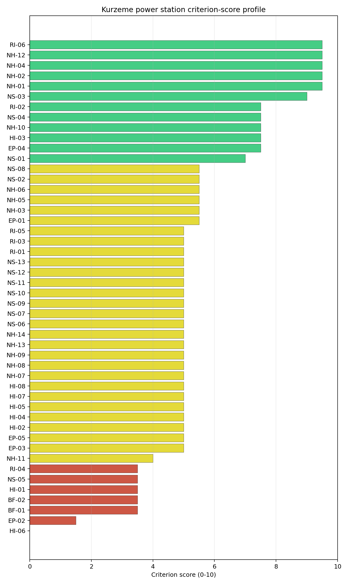
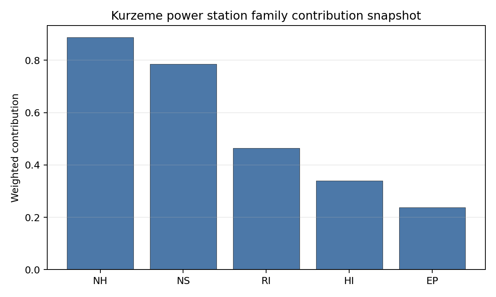

# Kurzeme power station Site Profile

Kurzeme power station is a coal/thermal site in Latvia that has been tested against the NuScale VOYGR-6 reference deployment envelope. This profile reads the screening evidence at a level that supports a decision to progress toward Stage 3 characterization. It is not a site-suitability determination, vendor recommendation, or licensing finding.

## Site Snapshot

| Field | Value |
| --- | --- |
| Site name | Kurzeme power station |
| Coordinates | 57.4094, 21.5947 |
| Subnational unit | Kurzeme |
| Installed thermal capacity (source data) | 435 MW |
| Composite score (baseline weights) | 5.816 (4.315-6.283 MC band) |
| National stability band | A (top-10% hit rate 100%) |
| National rank | 1 |

_See the country status map in_ [Latvia Country Profile](../LV_country_prototype.md#country-status-map).

## Ownership and Coal-to-Nuclear Context

- **Latvenergo AS** (100.00% share), headquartered in Latvia; immediate operator Latvenergo AS. Path: Latvenergo AS -> Kurzeme power station -- [100.0%]
- **Ministry of Economics (Latvia)** (100.00% share), headquartered in Latvia; immediate operator Latvenergo AS. Path: Ministry of Economics (Latvia)  -> Latvenergo AS [100.0%] -> Kurzeme power station -- [100.0%]

Generating units on record: 1 cancelled.

## Natural Hazards (NH)

- **Seismic: Ground Motion (NH-01)** - score 9.5/10 (MC 9.0-10.0), weight 0.0396, data quality high. Evidence: PGA at 475-year return period 0.018 g; PGA at 2,475-year return period 0.068 g; Vs30 reference (m/s): 760.0.
- **Seismic: Surface Rupture (NH-02)** - score 9.5/10 (MC 9.0-10.0), weight n/a, data quality screening grade. Evidence: nearest mapped capable fault 50.0 km; fault slip rate 0 mm/yr; fault name: none_in_search_radius.
- **Geotechnical: Liquefaction (NH-03)** - score 5.5/10 (MC 5.0-6.0), weight n/a, data quality medium. Evidence: liquefaction susceptibility: moderate; dominant soil type: sandy_loam.
- **Geotechnical: Slope Stability (NH-04)** - score 9.5/10 (MC 9.0-10.0), weight n/a, data quality screening grade. Evidence: site slope 3.54 deg; max slope in 1 km box 44.3 deg; slope stability class: gentle.
- **Geotechnical: Subsidence (NH-05)** - score 5.5/10 (MC 5.0-6.0), weight 0.0308, data quality medium. Evidence: karst present: no; karst severity: none.
- **Geotechnical: Foundation (NH-06)** - score 5.5/10 (MC 5.0-6.0), weight 0.0220, data quality medium. Evidence: bearing capacity 97.0 kPa; depth to bedrock 9.53 m.
- **Volcanism (NH-07)** - score 5.0/10 (MC 5.0-5.0), weight n/a, data quality high. Evidence: volcanic hazard class: negligible.
- **Coastal Flooding (NH-08)** - score 5.0/10 (MC 5.0-5.0), weight 0.0264, data quality low. Evidence: values not in measurement tables.
- **River Flooding (NH-09)** - score 5.0/10 (MC 5.0-5.0), weight 0.0352, data quality insufficient. Evidence: flood zone class: negligible.
- **Extreme Winds (NH-10)** - score 7.5/10 (MC 7.0-8.0), weight n/a, data quality medium. Evidence: design wind speed 14.4 m/s.
- **Extreme Precipitation (NH-11)** - score 4.0/10 (MC 4.0-4.0), weight 0.0132, data quality medium. Evidence: extreme daily precipitation 0.23 mm; mean annual precipitation 28.4 mm/yr.
- **Extreme Temperatures (NH-12)** - score 9.5/10 (MC 9.0-10.0), weight 0.0176, data quality medium. Evidence: extreme high temperature 21.0 deg C; extreme low temperature -6.03 deg C.
- **Forest/Wildfire (NH-13)** - score 5.0/10 (MC 5.0-5.0), weight 0.0132, data quality n/a. Evidence: values not in measurement tables.
- **Combined Hazards (NH-14)** - score 5.0/10 (MC 5.0-5.0), weight 0.0132, data quality n/a. Evidence: values not in measurement tables.

### Interpretation - Natural Hazards (NH)

<!-- specialist key=family_natural_hazards scope=site site_id=1a5b8f8f-f4be-4514-8738-755d25e19b41 bundle=LV_kurzeme_power_station_site_bundle.json status=filled by=cursor-agent filled_at=2026-05-03T16:15:39Z -->
Natural hazards at Kurzeme sit in the favourable Baltic-shield very-low-seismic envelope on the coastal Kurzeme glacial plain, with no binding findings and a balanced family read across all hazard sub-domains. PGA at the 475-yr return period is **0.018 g** and at the 2,475-yr return period is **0.068 g**, well inside the NuScale VOYGR-6 project envelope of 0.5 g at 2,475-yr and at the floor of the relevant European seismic envelope. The nearest mapped capable fault is null inside the 50 km screening search radius, so NH-02 settles at 9.5/10 and NH-01 at 9.5/10. Geotechnical conditions are middle-to-favourable for a glacial-coastal context: sandy-loam soils with a `moderate` liquefaction susceptibility (NH-03 at 5.5/10, the cleanest liquefaction read of the first-batch cohort after Plomin's `very_low`), a screening-proxy bearing capacity of **97.0 kPa** (the highest of the first-batch cohort, reflecting the sandy-loam over the Baltic glacial till) and a depth to bedrock of **9.53 m** (the shallowest unconsolidated cover of the first-batch cohort — a structural advantage of the glaciated Kurzeme plain). **NH-04 Geotechnical: Slope Stability at 9.5/10** carries a mean site slope of **3.54°** on a `gentle` slope-stability class, the cleanest topographic read of the first-batch cohort. **NH-05 Geotechnical: Subsidence at 5.5/10** carries `karst not present` and `none` severity. NH-06 holds at 5.5/10 on the moderate-cover read. Extreme meteorology is the most demanding of the first-batch cohort on the wind side: a **50-yr design wind of 14.4 m/s** (the highest of the first-batch cohort, materially above the Hungarian / Bohemian sites at 7-10 m/s and a feature of the exposed Baltic-coast context), against an extreme temperature range of -6.03 °C to 21.0 °C (the narrowest temperature range of the cohort, a marine-moderation effect). NH-10 holds at 7.5/10. NH-11 reads 4.0/10 on the screening proxy with the same unit-mismatch artefact observed across the cohort. NH-07, NH-08 and NH-09 carry `inconclusive` avoidance verdicts; the **9.95 m site elevation on the Baltic coast** makes coastal flooding (NH-08) a meaningful Stage 3 question against Baltic storm-surge return periods. The Stage 3 priority order is therefore: commission a Baltic-coast storm-surge and design-basis-flood study against the 9.95 m site elevation under climate-projected return periods so NH-08 lifts off the inconclusive read; refine the design-basis wind loading against the 14.4 m/s screening read with a project-specific extreme-value analysis on national meteorological station data; and run a CPT campaign so NH-03 settles on a measured liquefaction-susceptibility value rather than the screening proxy on the sandy-loam glacial-till cover.
<!-- /specialist key=family_natural_hazards -->

## Human-Induced and Security-Relevant Hazards (HI)

- **Aircraft Crash (HI-01)** - score 3.5/10 (MC 3.0-4.0), weight 0.0308, data quality high. Evidence: nearest airport 6.49 km; nearest flight path 3.24 km; airports within search radius 1; airport name: Ventspils International Airport; airport type: small_airport.
- **Industrial Explosions (HI-02)** - score 5.0/10 (MC 5.0-5.0), weight 0.0308, data quality high. Evidence: nearest industrial site 16.3 km.
- **Toxic/Gas Releases (HI-03)** - score 7.5/10 (MC 7.0-8.0), weight 0.0308, data quality high. Evidence: nearest toxic source 16.3 km.
- **External Fires (HI-04)** - score 5.0/10 (MC 5.0-5.0), weight 0.0264, data quality high. Evidence: values not in measurement tables.
- **Transport Hazards (HI-05)** - score 5.0/10 (MC 5.0-5.0), weight 0.0264, data quality n/a. Evidence: values not in measurement tables.
- **Military Installations (HI-06)** - score 0.0/10 (MC 0.0-0.0), weight 0.0264, data quality not_found. Evidence: nearest military installation 5.39 km; military installations within radius 0.
- **Electromagnetic Interference (HI-07)** - score 5.0/10 (MC 5.0-5.0), weight 0.0088, data quality medium. Evidence: nearest high-power transmitter 0.33 km; transmitters within radius 194; transmitter type: lighting.
- **Other Nuclear Installations (HI-08)** - score 5.0/10 (MC 5.0-5.0), weight 0.0132, data quality n/a. Evidence: values not in measurement tables.

### Interpretation - Human-Induced and Security-Relevant Hazards (HI)

<!-- specialist key=family_human_hazards scope=site site_id=1a5b8f8f-f4be-4514-8738-755d25e19b41 bundle=LV_kurzeme_power_station_site_bundle.json status=filled by=cursor-agent filled_at=2026-05-03T16:15:39Z -->
Human-induced and security-relevant hazards at Kurzeme carry an HI-01 caution driven by the immediate proximity of Ventspils International Airport, alongside the cohort-typical HI-06 floor read held on screening-grade quality. The principal HI finding is the **HI-01 caution at 3.5/10**: the nearest civilian airport is **Ventspils International Airport (`small_airport`) at 6.49 km**, well inside the SSG-35 A1 screening exclusion radius for general-aviation airfields under 10 km, with the nearest flight-path projection at 3.24 km (also inside the SSG-35 A4 4 km flight-path screening trigger). Ventspils International is a regional commercial airport serving the Kurzeme coast and the Baltic offshore industry, so the SSG-79 hazard assessment will need to consider both fixed-wing commercial traffic and offshore-helicopter rotations. The 6.49 km distance is the binding HI-01 read of the site and is the principal Stage 3 governance question in the family. **HI-03 Toxic / Gas Releases at 7.5/10** carries the nearest hazardous-cloud source at 16.3 km (well outside the 5 km screening exclusion radius and the 8 km project A11 avoidance trigger), the cleanest HI-03 read of the first-batch cohort. **HI-02 Industrial Explosions at 5.0/10** carries the nearest industrial site at the same 16.3 km distance. **HI-06 Military Installations** at **0.0/10** holds on `not_found` data quality with a residual nearest-feature reference at 5.39 km that is the same kind of legacy cadastre artefact observed at Tušimice, Pocerady, Plomin and Torony; the criterion is held on the screening method's handling of `not_found` data rather than on a positive military-installation finding, but the live Latvian Ministry of Defence cadastre is a meaningful Stage 3 question given the strategic importance of Ventspils port on the Baltic coast and the legacy Soviet defence estate of the Kurzeme region. **HI-04 External Fires** and **HI-05 Transport Hazards** sit at the pass-mark default of 5.0/10. HI-07 Electromagnetic Interference scores 5.0/10 with the nearest broadcast feature at 0.33 km (a lighting tower) and 194 transmitters inside the EMI search radius (a moderate count, comparable to the Czech sites). HI-08 (Other Nuclear Installations) is null. The Stage 3 priority order is therefore: commission an SSG-79 aircraft-crash hazard assessment for Ventspils International Airport with explicit modelling of both fixed-wing commercial traffic and offshore-helicopter rotations; obtain the live Latvian Ministry of Defence cadastre for the 25 km screening radius so HI-06 lifts off the `not_found` floor; and run the Latvian national Seveso cadastre to confirm the 16.3 km industrial / toxic-source reading.
<!-- /specialist key=family_human_hazards -->

## Radiological Impact and Emergency Planning (RI / EP)

- **Emergency Planning Feasibility (EP-01)** - score 5.5/10 (MC 5.0-6.0), weight n/a, data quality high. Evidence: EP feasibility composite 45.5 /100; road sub-score 29.7 /100; special-population sub-score 90.0 /100; geography sub-score 95.0 /100; population sub-score 60.0 /100; evacuation feasible: yes.
- **Evacuation Routes (EP-02)** - score 1.5/10 (MC 1.0-2.0), weight 0.0264, data quality medium. Evidence: road density in EPZ 0.197 km/km2; road length in EPZ 387.6 km; motorway access: yes.
- **Physical Geography Constraints (EP-03)** - score 5.0/10 (MC 5.0-5.0), weight 0.0220, data quality medium. Evidence: waterways crossing EPZ 0; major river barrier: no.
- **Special Populations (EP-04)** - score 7.5/10 (MC 7.0-8.0), weight 0.0264, data quality medium. Evidence: hospitals in EPZ 4; prisons in EPZ 0; care homes in EPZ 0.
- **Concurrent Hazard Impact (EP-05)** - score 5.0/10 (MC 5.0-5.0), weight 0.0176, data quality n/a. Evidence: values not in measurement tables.
- **Atmospheric Dispersion (RI-01)** - score 5.0/10 (MC 5.0-5.0), weight 0.0264, data quality medium. Evidence: annual mean wind speed 2.74 m/s; atmospheric mixing height 571.7 m; prevailing wind direction: SW.
- **Surface Water Dispersion (RI-02)** - score 7.5/10 (MC 7.0-8.0), weight 0.0220, data quality n/a. Evidence: values not in measurement tables.
- **Groundwater Dispersion (RI-03)** - score 5.0/10 (MC 5.0-5.0), weight 0.0220, data quality medium. Evidence: aquifer type: inland water.
- **Population Density at EPZ Radii (RI-04)** - score 3.5/10 (MC 3.0-4.0), weight 0.0352, data quality screening grade. Evidence: population density within 5 km 424.7 /km2; population density within 16 km 46.6 /km2; population density within 25 km 20.6 /km2; population density within 80 km 5.82 /km2; population within 25 km 40,368 people.
- **Distance to Population Centres (RI-05)** - score 5.0/10 (MC 5.0-5.0), weight 0.0441, data quality screening grade. Evidence: values not in measurement tables.
- **Population Projections (RI-06)** - score 9.5/10 (MC 9.0-10.0), weight 0.0220, data quality screening grade. Evidence: annual population growth rate -1.787 %/yr; projected population at 25 km in 60 yr 25,531 people.

### Interpretation - Radiological Impact and Emergency Planning (RI / EP)

<!-- specialist key=family_radiological_emergency scope=site site_id=1a5b8f8f-f4be-4514-8738-755d25e19b41 bundle=LV_kurzeme_power_station_site_bundle.json status=filled by=cursor-agent filled_at=2026-05-03T16:15:39Z -->
Radiological impact and emergency planning at Kurzeme read as a high-immediate-density / very-low-distant-density envelope, dominated by the immediate proximity of Ventspils town and the otherwise sparsely populated coastal Kurzeme hinterland. Population density at the screening epoch is **424.7 p/km² at 5 km** (the highest 5 km density of the first-batch cohort, reflecting the urban Ventspils town centre immediately adjacent to the site), 46.6 p/km² at 16 km, **20.6 p/km² at 25 km** (the lowest 25 km density of the first-batch cohort) and 5.82 p/km² at 80 km, with a 25 km total of only 40,368 people; the population case is binary — Ventspils town inside the inner EPZ ring, with rural-coastal Kurzeme outside. Trajectory is favourable for a 60-year siting horizon: a **-1.787 %/yr** regional growth rate (the steepest decline of the first-batch cohort) yields a 25 km projection of 25,531 people in 60 years (down 37 % from the screening epoch), which lifts RI-06 to 9.5/10. Under the screening hierarchy the very-high 5 km density flags **RI-04 at 3.5/10** as the binding population finding for the site. The atmospheric envelope is the windiest of the first-batch cohort: the screening reanalysis gives a mean wind speed of 2.74 m/s (materially above the 0.9-1.5 m/s observed at the Pannonian-basin and Bohemian sites, a feature of the exposed Baltic coast), a prevailing direction of SW (toward the Baltic Sea, plume offshore for the dominant case), and a mean planetary boundary-layer height of 571.7 m, holding RI-01 at 5.0/10 (the prevailing-SW direction with Ventspils to the N-NE means the dominant population centre is offset from the prevailing plume sector, a structural advantage for source-term placement). Aquifer type is `inland water`, holding RI-03 at 5.0/10. **RI-02 Surface Water Dispersion** at 7.5/10 holds on the screening read, anchored by the Venta cooling-source assignment at 128.8 m³/s; the operational dispersion case is more nuanced because the Venta discharges to the Baltic Sea at Ventspils, so the project must consider both fluvial and marine receptors under SSG-21 methodology. The principal emergency-planning finding is **EP-02 Evacuation Routes at 1.5/10** — the lowest EP-02 score of the first-batch cohort: the road density inside the EPZ is just **0.197 km/km² over 387.6 km of road** (an order of magnitude below the Hungarian sites and the lowest of the cohort, reflecting the sparse road network of rural coastal Kurzeme); the road sub-score is 29.7/100 and drives the EP-01 composite of 45.5/100 (FEASIBLE on the geography sub-score but constrained on the road network). EP-04 Special Populations at 7.5/10 carries 4 hospitals, 0 prisons and 0 care homes in the EPZ. The Stage 3 priority order is therefore: model the EPZ time-to-clear under summer/winter loadings using Latvian national emergency-planning traffic data with explicit modelling of the Ventspils town evacuation surge and the limited inland road network (a binding EP-02 finding); coordinate cross-border emergency planning with the Lithuanian authorities given the proximity to the Latvian-Lithuanian Baltic-coast border; and run a coupled fluvial-marine dispersion analysis under SSG-21 methodology for the Venta-to-Baltic dispersion pathway.
<!-- /specialist key=family_radiological_emergency -->

## Non-Safety and Implementation Considerations (NS)

- **Grid Capacity Basic Filter (BF-01)** - score 3.5/10 (MC 3.0-4.0), weight 0.0352, data quality n/a. Evidence: values not in measurement tables.
- **Land Area Basic Filter (BF-02)** - score 3.5/10 (MC 3.0-4.0), weight 0.0220, data quality n/a. Evidence: values not in measurement tables.
- **Cooling Water Availability (NS-01)** - score 7.0/10 (MC 6.0-7.0), weight n/a, data quality screening grade. Evidence: distance to cooling source 1.57 km; cooling source flow 128.8 m3/s; cooling source type: major_river; cooling source name: Venta; water stress label: Low.
- **Grid Connection (NS-02)** - score 5.5/10 (MC 5.0-6.0), weight 0.0352, data quality medium. Evidence: nearest substation 0.26 km; nearest high-voltage line 1.03 km; highest nearby line voltage 110.0 kV; grid export capacity 435.0 MW; substations within radius 0; HV lines within radius 0.
- **Transport Access (NS-03)** - score 9.0/10 (MC 9.0-10.0), weight 0.0352, data quality high. Evidence: nearest highway 0.12 km; nearest rail line 0.36 km; nearest waterway 2.84 km; heavy-haul capable: yes.
- **Site Topography (NS-04)** - score 7.5/10 (MC 7.0-8.0), weight 0.0264, data quality high. Evidence: favourable land cover 61.3 %; moderate land cover 3.1 %; unfavourable land cover 35.6 %; favourable area 32.5 ha; dominant land class: 312.
- **Site Footprint Adequacy (NS-05)** - score 3.5/10 (MC 3.0-4.0), weight 0.0220, data quality medium. Evidence: buildable area 8.7 ha; largest contiguous patch 8.7 ha; buildable patch count 6.
- **Existing Infrastructure (NS-06)** - score 5.0/10 (MC 5.0-5.0), weight 0.0220, data quality n/a. Evidence: values not in measurement tables.
- **Environmental Impact (non-rad) (NS-07)** - score 5.0/10 (MC 5.0-5.0), weight 0.0220, data quality n/a. Evidence: values not in measurement tables.
- **Ecological Sensitivity (NS-08)** - score 5.5/10 (MC 5.0-6.0), weight n/a, data quality high. Evidence: natural land cover 35.6 %; distance to nearest Natura 2000 site 3.851 km; distance to nearest protected area 3.851 km; Natura 2000 overlap: no; Natura 2000 sensitivity class: low; protected-area overlap: no; protected-area sensitivity class: moderate; nearest Natura 2000 site: Būšnieku ezera krasts; Natura 2000 sites within 5 km: 1; nearest protected-area designation: Nature Reserve.
- **Socioeconomic Impact (NS-09)** - score 5.0/10 (MC 5.0-5.0), weight 0.0220, data quality n/a. Evidence: values not in measurement tables.
- **Workforce Availability (NS-10)** - score 5.0/10 (MC 5.0-5.0), weight 0.0176, data quality n/a. Evidence: values not in measurement tables.
- **Coal-to-Nuclear Synergies (NS-11)** - score 5.0/10 (MC 5.0-5.0), weight 0.0264, data quality n/a. Evidence: values not in measurement tables.
- **Regulatory/Political Environment (NS-12)** - score 5.0/10 (MC 5.0-5.0), weight 0.0264, data quality n/a. Evidence: values not in measurement tables.
- **Construction Logistics (NS-13)** - score 5.0/10 (MC 5.0-5.0), weight 0.0176, data quality n/a. Evidence: values not in measurement tables.

### Interpretation - Non-Safety and Implementation Considerations (NS)

<!-- specialist key=family_infrastructure scope=site site_id=1a5b8f8f-f4be-4514-8738-755d25e19b41 bundle=LV_kurzeme_power_station_site_bundle.json status=filled by=cursor-agent filled_at=2026-05-03T16:15:39Z -->
Non-safety implementation at Kurzeme is the most challenging dimension of the site, with binding findings on the very small buildable footprint (NS-05), the small grid-export capacity (NS-02) and the wider land-area constraint (BF-02), partially offset by exceptional brownfield transport access. **NS-03 Transport Access** scores **9.0/10** with the nearest highway at **0.12 km** (the closest highway access of the first-batch cohort), the nearest rail line at 0.36 km, the nearest waterway at **2.84 km** (the Venta-to-Baltic barge corridor) and `heavy-haul capable: yes`; the combination of immediate motorway, rail and barge access plus the Ventspils ice-free deep-water port at the Baltic terminus is one of the strongest reactor-vessel transport envelopes of any first-batch site. **NS-01 Cooling Water Availability** scores 7.0/10: the nearest perennial flow is the **Venta at 1.57 km with a flow of 128.8 m³/s** and a `Low` water-stress label, comfortably accommodating a NuScale VOYGR-6 cooling demand. **NS-04 Site Topography** scores 7.5/10 with **61.3 % favourable land cover** within the 2 km screening radius, 3.1 % moderate cover and 35.6 % unfavourable cover. The principal Stage 3 question on the implementation side is the **NS-05 Site Footprint Adequacy caution at 3.5/10**: the buildable area is **8.7 ha with the largest contiguous patch also at 8.7 ha across 6 patches** — the smallest buildable envelope of the first-batch cohort by a margin and well below the project A15 14 ha contiguous threshold. The 8.7 ha figure essentially forces a smaller VOYGR-2 or VOYGR-4 deployment rather than a full VOYGR-6, or a comprehensive site re-layout to lift the buildable patch to the project envelope. **BF-02 Land Area** at 3.5/10 confirms the wider land constraint. **NS-02 Grid Connection caution at 5.5/10**: the nearest substation is at 0.26 km, the nearest high-voltage line at 1.03 km, the highest nearby line voltage is 110 kV, and the screening grid-export-capacity figure of **435 MW** (matching the existing thermal complex) sits at the project A13 trigger floor; the 0 substations and 0 HV lines inside the 25 km screening radius reflects the absence of higher-voltage transmission backbone in the western Kurzeme region (the Latvian high-voltage backbone runs through Riga to the east). A 110→330 kV upgrade is required for a full VOYGR-6 deployment but is feasible against the dense Ventspils-Riga corridor. **NS-08 Ecological Sensitivity** at 5.5/10 reads 35.6 % natural land cover within 2 km, the **Būšnieku ezera krasts Natura 2000 site at 3.85 km** with sensitivity class `low`, and the nearest non-Natura protected area at 3.85 km with sensitivity class `moderate` (a Nature Reserve). The Stage 3 priority order is therefore: confirm the buildable-patch envelope under site-specific terrain modelling and engineering re-layout to lift the 8.7 ha screening read to the project A15 threshold (or commit to a smaller VOYGR-2 / VOYGR-4 deployment); open the Latvian transmission-system-operator dialogue on a 110→330 kV upgrade at the Ventspils substation with reinforcement of the Ventspils-Riga corridor; and scope the Habitats Directive Article 6(3) appropriate-assessment for the Būšnieku ezera krasts Natura 2000 site and the adjacent Nature Reserve.
<!-- /specialist key=family_infrastructure -->

## Composite Score and Stability

Baseline composite score is 5.816, bracketed by Monte Carlo at 4.315-6.283. National stability band is `A` with a top-10% hit rate of 100% across 16 scored Monte Carlo scenarios.

<!-- specialist key=stability scope=site site_id=1a5b8f8f-f4be-4514-8738-755d25e19b41 bundle=LV_kurzeme_power_station_site_bundle.json status=filled by=cursor-agent filled_at=2026-05-03T16:15:39Z -->
Kurzeme sits at national rank 1 in the Latvian cohort with an exceptional **A national band** stability across the 10,000-iteration sensitivity sweep, but a **D regional band** that is the more honest signal: against the wider Central, Eastern and Southern Europe regional benchmark, the site sits below the regional median. The composite score of 5.816 (MC band 4.315–6.283) and the **100 % top-10 % hit rate and 100 % top-5 % hit rate** at the national level are a structural consequence of Kurzeme being the only ranked Latvian candidate (the country pool is 0 full pass, 1 avoidance flag, 0 hard-fail). The 6 % regional top-10 % hit rate is materially below the Hungarian, Czech and Romanian leadership cohort and reflects the binding NS-05 footprint constraint, the BF-02 land-area constraint, the NS-02 grid-export caution, the EP-02 evacuation-route constraint and the binding 5 km population density. Family-level normalised contributions show natural hazards as the dominant positive (mean 0.65, anchored by the very-low Baltic-shield seismic envelope and the gentle glacial topography), with radiological (0.55) close behind, while infrastructure (0.53, dragged by NS-05, BF-02 and BF-01) and human-induced (0.45, dragged by HI-06) act as the relative drags. The top contributing criteria mirror this pattern: NH-01 Seismic Ground Motion (the strongest single contributor at 0.38 contrib weight), NS-03 Transport Access (0.32), HI-03 Toxic Releases, RI-05 Distance to Population Centres, RI-06 Population Projections (anchored by the steep -1.787 %/yr regional decline) and EP-04 Special Populations all push toward the FAVOURABLE band, while EP-02 Evacuation Routes (the binding read at 1.5/10), HI-06 Military Installations (the floor read at 0.0/10), BF-01 / BF-02 (the wider grid and land constraints), HI-01 Aircraft Crash, NS-05 Site Footprint (the binding 8.7 ha read) and RI-04 Population Density all act as binding drags. The A-national / D-regional split is the structural read: Kurzeme is the best Latvian candidate but a marginal regional candidate, and the project decision turns on whether the small buildable footprint can be expanded under site-specific terrain re-layout (and whether Latvia is willing to commit to a smaller VOYGR-2 / VOYGR-4 deployment if it cannot). The Stage 3 work that would tighten the composite uncertainty band most quickly is the NS-05 buildable-patch confirmation and the EP-02 evacuation-route modelling.
<!-- /specialist key=stability -->

## Residual Risk Register

<!-- specialist key=residual_risk scope=site site_id=1a5b8f8f-f4be-4514-8738-755d25e19b41 bundle=LV_kurzeme_power_station_site_bundle.json status=filled by=cursor-agent filled_at=2026-05-03T16:15:39Z -->
| Criterion | Description | Owner | Resolution path |
|---|---|---|---|
| NS-05 | Buildable area 8.7 ha with the largest contiguous patch also at 8.7 ha across 6 patches; the smallest buildable envelope of the first-batch cohort by a margin and well below the project A15 14 ha contiguous threshold. | Project civil engineer | Confirm the buildable-patch envelope under site-specific terrain modelling and engineering re-layout to lift the 8.7 ha screening read; commit to a smaller VOYGR-2 / VOYGR-4 deployment if the patch cannot be expanded. |
| BF-02 | Wider land-area constraint at 3.5/10 confirms the regional buildable-patch shortage. | Project civil engineer | Covered by the NS-05 re-layout and the smaller-deployment fallback. |
| BF-01 | Wider-grid capacity at 3.5/10 confirms the regional grid is constrained for the project capacity envelope. | Latvian transmission system operator | Regional grid reinforcement programme (covered by the NS-02 dialogue). |
| NS-02 | Highest nearby line voltage 110 kV; estimated grid-export capacity 435 MW (matching the existing thermal complex's nameplate, sitting at the project A13 trigger floor); 0 substations and 0 HV lines inside the 25 km screening radius. | Latvian transmission system operator | 110→330 kV upgrade at the Ventspils substation with reinforcement of the Ventspils-Riga corridor. |
| HI-01 | Ventspils International Airport (`small_airport`) at 6.49 km, well inside the SSG-35 A1 screening exclusion radius for general-aviation airfields under 10 km, with the nearest flight-path projection at 3.24 km. | Aviation safety specialist | SSG-79 aircraft-crash hazard assessment for Ventspils International Airport with explicit modelling of fixed-wing commercial traffic and offshore-helicopter rotations. |
| EP-02 | Evacuation road density 0.197 km/km² over 387.6 km — the lowest road density of the first-batch cohort; sparse rural network of coastal Kurzeme. | National emergency planner | EPZ time-to-clear modelling under summer/winter loadings using Latvian national emergency-planning traffic data with explicit modelling of the limited inland road network. |
| RI-04 | Ventspils town centre at 424.7 p/km² within 5 km — the highest 5 km density of the first-batch cohort — set against a sparse 25 km hinterland. | Project radiation protection specialist | Source-term placement and atmospheric dispersion modelling against the prevailing-SW direction (with Ventspils to the N-NE, offset from the prevailing plume sector). |
| HI-06 | Held at 0.0/10 on `not_found` data quality (residual reference at 5.39 km); the legacy Soviet defence estate and the strategic Ventspils port make a live cadastre confirmation important. | Latvian Ministry of Defence | Obtain the live national MoD cadastre for the 25 km screening radius. |
| NH-08 | Site elevation 9.95 m on the Baltic coast; coastal-flooding measurement not in the screening tables. | Hydrologist | Baltic-coast storm-surge and design-basis-flood study against the 9.95 m site elevation under climate-projected return periods. |
| NH-10 | 50-yr design wind 14.4 m/s — the highest of the first-batch cohort. | Project civil / structural engineer | Project-specific extreme-value analysis on national meteorological station data to refine the design-basis wind loading. |
| RI-02 | Venta discharges to the Baltic Sea at Ventspils; project must consider both fluvial and marine receptors. | Hydrologist | Coupled fluvial-marine dispersion analysis under SSG-21 methodology for the Venta-to-Baltic dispersion pathway. |
| Cross-border emergency planning | Site sits on the Baltic coast within transboundary range of Lithuania and Estonia. | National emergency planner | Cross-border emergency-planning coordination with the Lithuanian and Estonian authorities under bilateral nuclear-emergency conventions. |
<!-- /specialist key=residual_risk -->

## Stage 3 Follow-Up Checklist

- [ ] Resolve **Aircraft Crash (HI-01)** avoidance flag - measured {"nearest_airport_km": 6.49, "nearest_airport_type": "small_airport"} vs threshold A1 — SSG-35: general-aviation / small airport < 10 km..
- [ ] Resolve **Aircraft Crash (HI-01)** avoidance flag - measured {"flight_path_distance_km": 3.24, "under_flight_path": false} vs threshold A4 — SSG-35: flight-path overhead / < 4 km from airway..
- [ ] Resolve **Grid Connection (NS-02)** avoidance flag - measured {"grid_export_capacity_mw": 435.0} vs threshold Project A13: transmission >= reference SMR net MWe within feasible distance..
- [ ] Resolve **Site Footprint Adequacy (NS-05)** avoidance flag - measured {"largest_contiguous_ha": 8.7} vs threshold Project A15: >= 14 ha contiguous industrial land..
- [ ] Re-measure **Military Installations (HI-06)** - native score 0.0/10 with confidence medium.
- [ ] Re-measure **Evacuation Routes (EP-02)** - native score 1.5/10 with confidence medium.
- [ ] Re-measure **Grid Capacity Basic Filter (BF-01)** - native score 3.5/10 with confidence insufficient.
- [ ] Re-measure **Land Area Basic Filter (BF-02)** - native score 3.5/10 with confidence insufficient.
- [ ] Re-measure **Aircraft Crash (HI-01)** - native score 3.5/10 with confidence high.
- [ ] Improve data quality for **Geotechnical: Subsidence & Collapse (NH-05b)** - current flag `low`.
- [ ] Improve data quality for **Coastal Flooding (NH-08)** - current flag `low`.
- [ ] Improve data quality for **Military Installations (HI-06)** - current flag `not_found`.

## Evidence Limitations

- Geotechnical: Subsidence & Collapse (NH-05b) - quality `low`.
- Coastal Flooding (NH-08) - quality `low`.
- Military Installations (HI-06) - quality `not_found`.
