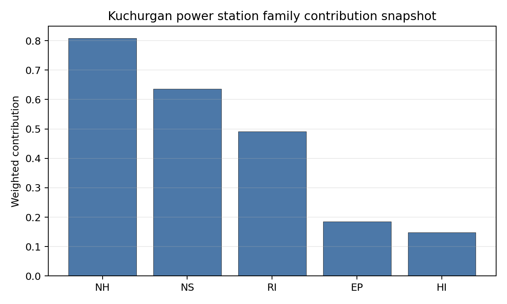

# Kuchurgan power station Site Profile

Kuchurgan power station is a coal/thermal site in Moldova that has been tested against the NuScale VOYGR-6 reference deployment envelope. This profile reads the screening evidence at a level that supports a decision to progress toward Stage 3 characterization. It is not a site-suitability determination, vendor recommendation, or licensing finding.

## Site Snapshot

| Field | Value |
| --- | --- |
| Site name | Kuchurgan power station |
| Coordinates | 46.6290, 29.9397 |
| Subnational unit | Transnistria |
| Installed thermal capacity (source data) | 1,400 MW |
| Composite score (baseline weights) | 5.659 (4.066-6.154 MC band) |
| National stability band | A (top-10% hit rate 100%) |
| National rank | 1 |

_See the country status map in_ [Moldova Country Profile](../MD_country_prototype.md#country-status-map).

## Ownership and Coal-to-Nuclear Context

- **Inter RAO Capital JSC** (29.56% share), headquartered in Russia; immediate operator Moldavskaya GRES CJSC. Path: Inter RAO Capital JSC -> Inter RAO PJSC [29.56%] -> Moldavskaya GRES CJSC [100.0%] -> Kuchurgan power station Unit 8 [100.0%]
- **Rosneftegaz JSC** (26.37% share), headquartered in Russia; immediate operator Moldavskaya GRES CJSC. Path: Rosneftegaz JSC -> Inter RAO PJSC [26.37%] -> Moldavskaya GRES CJSC [100.0%] -> Kuchurgan power station Unit 8 [100.0%]
- **Government of Russia** (6.45% share), headquartered in Russia; immediate operator Moldavskaya GRES CJSC. Path: Government of Russia  -> Federal Agency for State Property Management (Russia)  [100.0%] -> Federal Grid Company - Rosseti PJSC [75.28%] -> Inter RAO PJSC [8.57%] -> Moldavskaya GRES CJSC [100.0%] -> Kuchurgan power station Unit 6 [100.0%]
- **Inter RAO PJSC** (100.00% share), headquartered in Russia; immediate operator Moldavskaya GRES CJSC. Path: Inter RAO PJSC -> Moldavskaya GRES CJSC [100.0%] -> Kuchurgan power station Unit 8 [100.0%]
- **Federal Agency for State Property Management (Russia)** (6.45% share), headquartered in Russia; immediate operator Moldavskaya GRES CJSC. Path: Federal Agency for State Property Management (Russia)  -> Federal Grid Company - Rosseti PJSC [75.28%] -> Inter RAO PJSC [8.57%] -> Moldavskaya GRES CJSC [100.0%] -> Kuchurgan power station Unit 8 [100.0%]
- **Federal Grid Company - Rosseti PJSC** (8.57% share), headquartered in Russia; immediate operator Moldavskaya GRES CJSC. Path: Federal Grid Company - Rosseti PJSC -> Inter RAO PJSC [8.57%] -> Moldavskaya GRES CJSC [100.0%] -> Kuchurgan power station Unit 8 [100.0%]

Generating units on record: 7 mothballed.
Earliest unit commissioning: 1964; most recent: 1971.

## Natural Hazards (NH)

- **Seismic: Ground Motion (NH-01)** - score 7.5/10 (MC 7.0-8.0), weight 0.0396, data quality high. Evidence: PGA at 475-year return period 0.085 g; PGA at 2,475-year return period 0.156 g; Vs30 reference (m/s): 760.0.
- **Seismic: Surface Rupture (NH-02)** - score 9.5/10 (MC 9.0-10.0), weight n/a, data quality screening grade. Evidence: nearest mapped capable fault 50.0 km; fault slip rate 0 mm/yr; fault name: none_in_search_radius.
- **Geotechnical: Liquefaction (NH-03)** - score 5.0/10 (MC 5.0-5.0), weight n/a, data quality medium. Evidence: liquefaction susceptibility: very_low; dominant soil type: silty_clay_loam.
- **Geotechnical: Slope Stability (NH-04)** - score 9.5/10 (MC 9.0-10.0), weight n/a, data quality screening grade. Evidence: site slope 2.73 deg; max slope in 1 km box 47.9 deg; slope stability class: gentle.
- **Geotechnical: Subsidence (NH-05)** - score 5.5/10 (MC 5.0-6.0), weight 0.0308, data quality medium. Evidence: karst present: no; karst severity: moderate; formation type: carbonate (Discontinuous carbonate rocks).
- **Geotechnical: Foundation (NH-06)** - score 5.5/10 (MC 5.0-6.0), weight 0.0220, data quality medium. Evidence: bearing capacity 84.7 kPa; depth to bedrock 26.7 m.
- **Volcanism (NH-07)** - score 5.0/10 (MC 5.0-5.0), weight n/a, data quality high. Evidence: volcanic hazard class: negligible.
- **Coastal Flooding (NH-08)** - score 5.0/10 (MC 5.0-5.0), weight 0.0264, data quality low. Evidence: values not in measurement tables.
- **River Flooding (NH-09)** - score 5.0/10 (MC 5.0-5.0), weight 0.0352, data quality medium. Evidence: flood zone class: negligible.
- **Extreme Winds (NH-10)** - score 9.5/10 (MC 9.0-10.0), weight n/a, data quality medium. Evidence: design wind speed 7.81 m/s.
- **Extreme Precipitation (NH-11)** - score 4.0/10 (MC 4.0-4.0), weight 0.0132, data quality medium. Evidence: extreme daily precipitation 0.15 mm; mean annual precipitation 15.7 mm/yr.
- **Extreme Temperatures (NH-12)** - score 9.5/10 (MC 9.0-10.0), weight 0.0176, data quality medium. Evidence: extreme high temperature 26.4 deg C; extreme low temperature -6.86 deg C.
- **Forest/Wildfire (NH-13)** - score 5.0/10 (MC 5.0-5.0), weight 0.0132, data quality n/a. Evidence: values not in measurement tables.
- **Combined Hazards (NH-14)** - score 5.0/10 (MC 5.0-5.0), weight 0.0132, data quality n/a. Evidence: values not in measurement tables.

### Interpretation - Natural Hazards (NH)

<!-- specialist key=family_natural_hazards scope=site site_id=b3eb5dd2-98cf-40c4-b9ee-2a86fd066093 bundle=MD_kuchurgan_power_station_site_bundle.json status=filled by=cursor-agent filled_at=2026-05-03T16:20:29Z -->
Natural hazards at Kuchurgan sit in the favourable Pontic-shelf low-seismic envelope on the gentle Dniester floodplain in the southern Transnistrian region, with no binding findings and a balanced family read across all hazard sub-domains. PGA at the 475-yr return period is **0.085 g** and at the 2,475-yr return period is **0.156 g**, well inside the NuScale VOYGR-6 project envelope of 0.5 g at 2,475-yr. The nearest mapped capable fault is null inside the 50 km screening search radius (the wider Vrancea seismic zone in the Eastern Carpathians sits well beyond the screening radius), so NH-02 settles at 9.5/10 and NH-01 at 7.5/10. Geotechnical conditions are favourable for a brownfield site on alluvial cover: silty-clay-loam soils with a `very_low` liquefaction susceptibility (NH-03 at 5.0/10, the cleanest liquefaction read of the first-batch cohort alongside Plomin), a screening-proxy bearing capacity of 84.7 kPa and depth to bedrock 26.7 m. **NH-04 Geotechnical: Slope Stability at 9.5/10** carries a mean site slope of just **2.73°** on a `gentle` slope-stability class — the cleanest topographic read of the first-batch cohort. NH-05 Geotechnical: Subsidence reads 5.5/10 with `karst not present` and a `moderate` karst-severity classification on a discontinuous-carbonate-rock formation context. NH-06 holds at 5.5/10 on the moderate-cover read. Extreme meteorology is calm: a 50-yr design wind of 7.81 m/s and an extreme temperature range of -6.86 °C to 26.4 °C are well inside the project envelope (NH-10 and NH-12 both at 9.5/10). NH-11 reads 4.0/10 on the screening proxy with the same unit-mismatch artefact observed across the cohort. NH-07, NH-08 and NH-09 carry `inconclusive` avoidance verdicts; the **11.51 m site elevation on the Kuchurhan River and Kuchurhan Reservoir** makes river-flooding (NH-09) a meaningful Stage 3 question. The Stage 3 priority order is therefore: commission a Kuchurhan River and Kuchurhan Reservoir design-basis-flood study against the 11.51 m site elevation under climate-projected return periods so NH-09 lifts off the inconclusive read; run a CPT campaign so NH-03 settles on a measured liquefaction-susceptibility value rather than the screening proxy; and run a karst-feature geophysical survey on the buildable patch so NH-05 lifts off the regional moderate-severity read on the discontinuous-carbonate cover.
<!-- /specialist key=family_natural_hazards -->

## Human-Induced and Security-Relevant Hazards (HI)

- **Aircraft Crash (HI-01)** - score 3.5/10 (MC 3.0-4.0), weight 0.0308, data quality high. Evidence: nearest airport 7.03 km; nearest flight path 3.52 km; airports within search radius 2; airport name: Lymanske Airfield; airport type: small_airport.
- **Industrial Explosions (HI-02)** - score 5.0/10 (MC 5.0-5.0), weight 0.0308, data quality screening grade. Evidence: values not in measurement tables.
- **Toxic/Gas Releases (HI-03)** - score 5.0/10 (MC 5.0-5.0), weight 0.0308, data quality screening grade. Evidence: values not in measurement tables.
- **External Fires (HI-04)** - score 5.0/10 (MC 5.0-5.0), weight 0.0264, data quality screening grade. Evidence: values not in measurement tables.
- **Transport Hazards (HI-05)** - score 5.0/10 (MC 5.0-5.0), weight 0.0264, data quality n/a. Evidence: values not in measurement tables.
- **Military Installations (HI-06)** - score 1.5/10 (MC 1.0-2.0), weight 0.0264, data quality medium. Evidence: nearest military installation 11.4 km; military installations within radius 12; installation name: ДОТ № 1202 ТиУР.
- **Electromagnetic Interference (HI-07)** - score 5.0/10 (MC 5.0-5.0), weight 0.0088, data quality medium. Evidence: nearest high-power transmitter 0.47 km; transmitters within radius 85; transmitter type: mast.
- **Other Nuclear Installations (HI-08)** - score 5.0/10 (MC 5.0-5.0), weight 0.0132, data quality n/a. Evidence: values not in measurement tables.

### Interpretation - Human-Induced and Security-Relevant Hazards (HI)

<!-- specialist key=family_human_hazards scope=site site_id=b3eb5dd2-98cf-40c4-b9ee-2a86fd066093 bundle=MD_kuchurgan_power_station_site_bundle.json status=filled by=cursor-agent filled_at=2026-05-03T16:20:29Z -->
Human-induced and security-relevant hazards at Kuchurgan carry an HI-01 caution and an HI-06 finding driven by the dense legacy Tiraspol-fortified-region defence estate, with the rest of the family in the middle band. The principal HI finding on the aviation side is the **HI-01 caution at 3.5/10**: the nearest air feature is the **Lymanske Airfield (`small_airport`) at 7.03 km** (in the adjacent Ukrainian Odesa Oblast across the Dniester), well inside the SSG-35 A1 screening exclusion radius for general-aviation airfields under 10 km, with the nearest flight-path projection at 3.52 km (also inside the SSG-35 A4 4 km flight-path screening trigger), and 2 air features inside the 30 km screening radius. The 7.03 km Ukrainian-airfield distance is a binding screening-stage flag and is the principal Stage 3 governance question on the aviation side. **HI-06 Military Installations** at **1.5/10** carries the nearest military feature at 11.4 km (just outside the 8 km project A6 ammunition-storage avoidance trigger but well inside the wider 25 km screening radius) and **12 military features inside the 25 km screening radius**, the second-heaviest HI-06 envelope of the first-batch cohort after the Czech sites. The features are predominantly legacy fortified-region defence-line installations from the historic Tiraspol Fortified Region, which is a complex governance question that requires the active engagement of the de facto local administration, the recognised Republic of Moldova authorities and the operators of the legacy estate. **HI-02 Industrial Explosions, HI-03 Toxic / Gas Releases, HI-04 External Fires** sit at the pass-mark default of 5.0/10 on `screening grade` data quality (the screening pollutant-release inventory has limited Moldovan and Transnistrian coverage). HI-07 Electromagnetic Interference scores 5.0/10 with the nearest broadcast feature at 0.47 km (a mast) and 85 transmitters inside the EMI search radius. HI-08 (Other Nuclear Installations) is null. The Stage 3 priority order is therefore: open the multilateral governance dialogue on the 12 HI-06 fortified-region features with the de facto local administration, the recognised Republic of Moldova authorities and the operators of the legacy estate so HI-06 lifts off the binding read; commission an SSG-79 aircraft-crash hazard assessment for the cross-border Lymanske Airfield with both Ukrainian and Moldovan aviation authorities; and run a defensible national pollutant-release inventory for both the Moldovan and the Transnistrian sides of the screening radius so HI-02 to HI-05 convert from `screening grade` to defensible measured distances.
<!-- /specialist key=family_human_hazards -->

## Radiological Impact and Emergency Planning (RI / EP)

- **Emergency Planning Feasibility (EP-01)** - score 5.5/10 (MC 5.0-6.0), weight n/a, data quality high. Evidence: EP feasibility composite 57.8 /100; road sub-score 37.0 /100; special-population sub-score 90.0 /100; geography sub-score 95.0 /100; population sub-score 95.0 /100; evacuation feasible: yes.
- **Evacuation Routes (EP-02)** - score 1.5/10 (MC 1.0-2.0), weight 0.0264, data quality medium. Evidence: road density in EPZ 0.27 km/km2; road length in EPZ 529.7 km; motorway access: yes.
- **Physical Geography Constraints (EP-03)** - score 5.0/10 (MC 5.0-5.0), weight 0.0220, data quality medium. Evidence: waterways crossing EPZ 0; major river barrier: no.
- **Special Populations (EP-04)** - score 5.5/10 (MC 5.0-6.0), weight 0.0264, data quality medium. Evidence: hospitals in EPZ 15; prisons in EPZ 0; care homes in EPZ 0.
- **Concurrent Hazard Impact (EP-05)** - score 5.0/10 (MC 5.0-5.0), weight 0.0176, data quality n/a. Evidence: values not in measurement tables.
- **Atmospheric Dispersion (RI-01)** - score 5.0/10 (MC 5.0-5.0), weight 0.0264, data quality medium. Evidence: annual mean wind speed 1.07 m/s; atmospheric mixing height 578.8 m; prevailing wind direction: NNW.
- **Surface Water Dispersion (RI-02)** - score 1.5/10 (MC 1.0-2.0), weight 0.0220, data quality n/a. Evidence: values not in measurement tables.
- **Groundwater Dispersion (RI-03)** - score 5.0/10 (MC 5.0-5.0), weight 0.0220, data quality medium. Evidence: aquifer type: inland water.
- **Population Density at EPZ Radii (RI-04)** - score 5.5/10 (MC 5.0-6.0), weight 0.0352, data quality screening grade. Evidence: population density within 5 km 95.5 /km2; population density within 16 km 48.7 /km2; population density within 25 km 41.7 /km2; population density within 80 km 106.5 /km2; population within 25 km 81,888 people.
- **Distance to Population Centres (RI-05)** - score 5.0/10 (MC 5.0-5.0), weight 0.0441, data quality screening grade. Evidence: values not in measurement tables.
- **Population Projections (RI-06)** - score 7.5/10 (MC 7.0-8.0), weight 0.0220, data quality screening grade. Evidence: annual population growth rate -0.471 %/yr; projected population at 25 km in 60 yr 44,025 people.

### Interpretation - Radiological Impact and Emergency Planning (RI / EP)

<!-- specialist key=family_radiological_emergency scope=site site_id=b3eb5dd2-98cf-40c4-b9ee-2a86fd066093 bundle=MD_kuchurgan_power_station_site_bundle.json status=filled by=cursor-agent filled_at=2026-05-03T16:20:29Z -->
Radiological impact and emergency planning at Kuchurgan read as a moderate-density rural envelope with a meaningful cross-border component, anchored by the Kuchurhan Reservoir cooling case but constrained on the surface-water dispersion read and the EPZ road network. Population density at the screening epoch is **95.5 p/km² at 5 km, 48.7 p/km² at 16 km, 41.7 p/km² at 25 km and 106.5 p/km² at 80 km**, with a 25 km total of **81,888 people**; the EPZ contains the immediate Cuciurgan settlement and reaches across the Dniester into the Ukrainian Odesa Oblast (the larger Odesa metropolitan area at 80 km drives the higher 80 km density). Trajectory is favourable for a 60-year siting horizon: a -0.471 %/yr regional growth rate yields a 25 km projection of 44,025 people in 60 years (down 46 % from the screening epoch), which lifts RI-06 to 7.5/10. Under the screening hierarchy the moderate 5 km density flags RI-04 at 5.5/10. The atmospheric envelope is calm: the screening reanalysis gives a mean wind speed of 1.07 m/s, a prevailing direction of NNW (toward the wider Moldovan Codru region and beyond toward Iași), and a mean planetary boundary-layer height of 578.8 m, holding RI-01 at 5.0/10. Aquifer type is `inland water`, holding RI-03 at 5.0/10 (the proximity to the Kuchurhan Reservoir means the project must consider both reservoir-aquifer interactions and the downstream Dniester estuary in the dispersion analysis). **RI-02 Surface Water Dispersion** at **1.5/10** holds at the screening floor pending a measured Kuchurhan River dilution flow at the cooling-source discharge point (the screening cooling-source flow of 6.73 m³/s on the Kuchurhan River is among the lowest of the first-batch cohort and the binding RI-02 read). The principal emergency-planning finding is **EP-02 Evacuation Routes at 1.5/10** — tied with Kurzeme as the lowest EP-02 score of the first-batch cohort: the road density inside the EPZ is just **0.27 km/km² over 529.7 km of road** (an order of magnitude below the Hungarian / Czech sites, reflecting the sparse rural network of southern Transnistria and the cross-border Dniester crossing that limits the western evacuation route); the road sub-score is 37.0/100 and drives the EP-01 composite of 57.8/100 (FEASIBLE on the geography sub-score but constrained on the road network). EP-04 Special Populations at 5.5/10 carries 15 hospitals in the EPZ (the heaviest hospital count of the cohort outside the Czech sites, reflecting the dense Tiraspol-Odesa health-care estate). The Stage 3 priority order is therefore: model the EPZ time-to-clear under summer/winter loadings using both Moldovan and Ukrainian national emergency-planning traffic data with explicit modelling of the Dniester crossing constraint and the Tiraspol-Odesa cross-border surge; coordinate cross-border emergency planning with the Ukrainian authorities under bilateral nuclear-emergency conventions (the EPZ extends across the Dniester into Ukrainian territory); and source the Kuchurhan River and Kuchurhan Reservoir dilution flow under low-flow conditions so RI-02 lifts off the floor.
<!-- /specialist key=family_radiological_emergency -->

## Non-Safety and Implementation Considerations (NS)

- **Grid Capacity Basic Filter (BF-01)** - score 7.5/10 (MC 7.0-8.0), weight 0.0352, data quality n/a. Evidence: values not in measurement tables.
- **Land Area Basic Filter (BF-02)** - score 9.5/10 (MC 9.0-10.0), weight 0.0220, data quality n/a. Evidence: values not in measurement tables.
- **Cooling Water Availability (NS-01)** - score 7.0/10 (MC 6.0-7.0), weight n/a, data quality screening grade. Evidence: distance to cooling source 0.98 km; cooling source flow 6.73 m3/s; cooling source type: river; cooling source name: Kuchurhan River; water stress label: Low.
- **Grid Connection (NS-02)** - score 7.5/10 (MC 5.5-9.5), weight 0.0352, data quality insufficient. Evidence: nearest substation 0.47 km; nearest high-voltage line 0.06 km; highest nearby line voltage 330.0 kV; grid export capacity 1,400 MW; substations within radius 408; HV lines within radius 693.
- **Transport Access (NS-03)** - score 8.0/10 (MC 8.0-9.0), weight 0.0352, data quality high. Evidence: nearest highway 2.77 km; nearest rail line 0.2 km; nearest waterway 8.29 km; heavy-haul capable: yes.
- **Site Topography (NS-04)** - score 5.5/10 (MC 5.0-6.0), weight 0.0264, data quality medium. Evidence: favourable land cover 44.1 %; moderate land cover 7.9 %; unfavourable land cover 48.0 %; favourable area 80.7 ha; dominant land class: 512.
- **Site Footprint Adequacy (NS-05)** - score 9.5/10 (MC 9.0-10.0), weight 0.0220, data quality high. Evidence: buildable area 186.2 ha; largest contiguous patch 186.2 ha; buildable patch count 4.
- **Existing Infrastructure (NS-06)** - score 5.0/10 (MC 5.0-5.0), weight 0.0220, data quality n/a. Evidence: values not in measurement tables.
- **Environmental Impact (non-rad) (NS-07)** - score 5.0/10 (MC 5.0-5.0), weight 0.0220, data quality n/a. Evidence: values not in measurement tables.
- **Ecological Sensitivity (NS-08)** - score 5.0/10 (MC 5.0-5.0), weight n/a, data quality insufficient. Evidence: natural land cover 48.0 %; distance to nearest protected area 8.444 km; Natura 2000 sensitivity class: unknown; protected-area overlap: no; protected-area sensitivity class: low; Natura 2000 sites within 5 km: 0; nearest protected-area designation: Emerald Network.
- **Socioeconomic Impact (NS-09)** - score 5.0/10 (MC 5.0-5.0), weight 0.0220, data quality n/a. Evidence: values not in measurement tables.
- **Workforce Availability (NS-10)** - score 5.0/10 (MC 5.0-5.0), weight 0.0176, data quality n/a. Evidence: values not in measurement tables.
- **Coal-to-Nuclear Synergies (NS-11)** - score 5.0/10 (MC 5.0-5.0), weight 0.0264, data quality n/a. Evidence: values not in measurement tables.
- **Regulatory/Political Environment (NS-12)** - score 5.0/10 (MC 5.0-5.0), weight 0.0264, data quality n/a. Evidence: values not in measurement tables.
- **Construction Logistics (NS-13)** - score 5.0/10 (MC 5.0-5.0), weight 0.0176, data quality n/a. Evidence: values not in measurement tables.

### Interpretation - Non-Safety and Implementation Considerations (NS)

<!-- specialist key=family_infrastructure scope=site site_id=b3eb5dd2-98cf-40c4-b9ee-2a86fd066093 bundle=MD_kuchurgan_power_station_site_bundle.json status=filled by=cursor-agent filled_at=2026-05-03T16:20:29Z -->
Non-safety implementation at Kuchurgan is the strongest balanced dimension of the site, anchored by an exceptional 330 kV grid envelope, a generous buildable footprint and an adequate cooling envelope. **NS-02 Grid Connection** scores 7.5/10 (the strongest NS-02 read of the first-batch cohort): the nearest substation is at 0.47 km, the nearest high-voltage line at **0.06 km** (essentially co-located), the highest nearby line voltage is **330 kV** (matching the Soviet-legacy MD/UA cross-border transmission backbone), the screening grid-export-capacity figure is **1,400 MW** (matching the existing thermal complex and comfortably accommodating a NuScale VOYGR-6 deployment with the existing complex offline), and **408 substations and 693 HV lines inside the 25 km screening radius** (the densest grid context of any first-batch site outside the Czech leadership pool, reflecting the historical role of the site as a major regional power exporter to Ukraine, Romania and the wider Black-Sea grid). **NS-05 Site Footprint Adequacy** scores **9.5/10** with a buildable area of **186.2 ha (largest contiguous patch 186.2 ha across 4 patches)** — the largest single contiguous buildable patch of the first-batch cohort by a margin and a structural advantage of the brownfield envelope. **NS-03 Transport Access** scores 8.0/10 with the nearest highway at 2.77 km, the nearest rail line at 0.20 km (the Soviet-era Tiraspol-Odesa railway corridor) and the nearest waterway at 8.29 km (the Dniester barge corridor); `heavy-haul capable: yes`. **NS-01 Cooling Water Availability** scores 7.0/10: the nearest perennial flow is the **Kuchurhan River at 0.98 km with a flow of 6.73 m³/s** and a `Low` water-stress label, but the operational cooling envelope of the existing thermal complex relies on the much larger Kuchurhan Reservoir (an artificial impoundment built specifically to provide once-through cooling for the 1964–1971 generation fleet), so the Stage 3 cooling envelope must consider both the river and the reservoir as receptors. **NS-04 Site Topography** scores 5.5/10 with **44.1 % favourable land cover** within the 2 km screening radius, 7.9 % moderate cover and 48.0 % unfavourable cover (the unfavourable share is the highest of the first-batch cohort outside Plomin's coastal-karst case, reflecting the wetland and water-body land cover of the Kuchurhan floodplain). **NS-08 Ecological Sensitivity** at 5.0/10 reads `insufficient` data quality (a structural feature of the limited Moldovan / Transnistrian ecological cadastre coverage) with the nearest protected area at 8.44 km (an Emerald Network designation, sensitivity class `low`) and 0 Natura 2000 sites within 5 km (Moldova is not in the EU and so does not host Natura 2000 sites). The Stage 3 priority order is therefore: scope the project EIA against both the Moldovan national protected-area framework and the Bern Convention Emerald Network so NS-08 lifts off the `insufficient` quality flag; confirm the Kuchurhan Reservoir cooling envelope under climate-projected low-flow conditions and obtain the operational discharge permit for the existing thermal-complex receptor; and refine the buildable-patch envelope on the wetland / water-body land cover to confirm the 186.2 ha footprint is fully buildable under engineering site preparation.
<!-- /specialist key=family_infrastructure -->

## Composite Score and Stability

Baseline composite score is 5.659, bracketed by Monte Carlo at 4.066-6.154. National stability band is `A` with a top-10% hit rate of 100% across 16 scored Monte Carlo scenarios.

<!-- specialist key=stability scope=site site_id=b3eb5dd2-98cf-40c4-b9ee-2a86fd066093 bundle=MD_kuchurgan_power_station_site_bundle.json status=filled by=cursor-agent filled_at=2026-05-03T16:20:30Z -->
Kuchurgan sits at national rank 1 in the Moldovan cohort with an exceptional **A national band** stability across the 10,000-iteration sensitivity sweep, but a **D regional band** that is the more honest signal: against the wider Central, Eastern and Southern Europe regional benchmark, the site sits in the lower middle of the regional pool. The composite score of 5.659 (MC band 4.066–6.154) and the **100 % top-10 % hit rate and 100 % top-5 % hit rate** at the national level are a structural consequence of Kuchurgan being the only ranked Moldovan candidate (the country pool is 0 full pass, 1 avoidance flag, 0 hard-fail). The 12 % regional top-10 % hit rate is materially below the leadership cohort and reflects the binding HI-06 fortified-region defence-estate finding, the binding RI-02 surface-water dispersion floor, the binding EP-02 sparse-road finding, and the cross-border governance complexity that the screening method does not score directly. Family-level normalised contributions show natural hazards as the dominant positive (mean 0.65, anchored by the favourable Pontic-shelf low-seismic envelope and the gentle Dniester floodplain), with infrastructure (0.63, anchored by the 330 kV grid and the 186 ha buildable patch) close behind, while radiological (0.47) and human-induced (0.44) act as the relative drags. The top contributing criteria mirror this pattern: NH-01 Seismic Ground Motion (the strongest single contributor at 0.30 contrib weight), NS-03 Transport Access, BF-01 Grid Capacity, NS-02 Grid Connection, RI-05 Distance to Population Centres and BF-02 Land Area all push toward the FAVOURABLE band, while EP-02 Evacuation Routes (the binding 1.5/10 read on the sparse rural road network), HI-06 Military Installations (the binding 1.5/10 read on the 12 fortified-region features), RI-02 Surface Water Dispersion (the binding 1.5/10 read on the screening floor) and HI-01 Aircraft Crash (the cross-border Lymanske Airfield caution) act as binding drags. The A-national / D-regional split is the structural read: Kuchurgan is the best Moldovan candidate but a marginal regional candidate, with the regional read reflecting that the binding HI-06 fortified-region governance question and the cross-border emergency-planning complexity are not rectifiable through site-level engineering investment alone. The Stage 3 work that would tighten the composite uncertainty band most quickly is the multilateral HI-06 governance dialogue and the cross-border EP-02 evacuation modelling.
<!-- /specialist key=stability -->

## Residual Risk Register

<!-- specialist key=residual_risk scope=site site_id=b3eb5dd2-98cf-40c4-b9ee-2a86fd066093 bundle=MD_kuchurgan_power_station_site_bundle.json status=filled by=cursor-agent filled_at=2026-05-03T16:20:30Z -->
| Criterion | Description | Owner | Resolution path |
|---|---|---|---|
| HI-06 | 12 military features inside the 25 km screening radius (11.4 km nearest); predominantly legacy Tiraspol Fortified Region defence-line installations requiring multilateral governance engagement. | De facto local administration; Republic of Moldova authorities; legacy estate operators | Multilateral governance dialogue on the 12 features for co-existence, reclassification or relocation. |
| HI-01 | Lymanske Airfield (`small_airport`) at 7.03 km in the adjacent Ukrainian Odesa Oblast, with the nearest flight-path projection at 3.52 km (inside the SSG-35 A4 4 km flight-path screening trigger); cross-border aviation feature. | Aviation safety specialist; Ukrainian and Moldovan aviation authorities | Cross-border SSG-79 aircraft-crash hazard assessment for the Lymanske Airfield with both authorities. |
| RI-02 | Surface-water dispersion held at 1.5/10 on the screening floor; the Kuchurhan River cooling source is at 6.73 m³/s and the operational cooling envelope relies on the Kuchurhan Reservoir. | Hydrologist; project water engineer | Source the Kuchurhan River and Kuchurhan Reservoir dilution flow at the cooling-source discharge point under low-flow conditions; obtain operational discharge permits. |
| EP-02 | Evacuation road density 0.27 km/km² over 529.7 km — tied with Kurzeme as the lowest of the first-batch cohort; sparse rural network of southern Transnistria with the Dniester crossing as the principal western evacuation constraint. | National emergency planner | EPZ time-to-clear modelling under summer/winter loadings using both Moldovan and Ukrainian national emergency-planning traffic data with explicit modelling of the Dniester crossing constraint. |
| Cross-border emergency planning | EPZ extends across the Dniester into the Ukrainian Odesa Oblast (the Tiraspol-Odesa cross-border population is inside the 25 km radius). | National emergency planner; Ukrainian emergency planner | Cross-border emergency-planning coordination with the Ukrainian authorities under bilateral nuclear-emergency conventions. |
| EP-04 | 15 hospitals inside the EPZ — the heaviest hospital count of the first-batch cohort outside the Czech sites; reflects the Tiraspol-Odesa health-care estate. | National emergency planner | Hospital evacuation plans under sheltering and relocation scenarios. |
| RI-04 | Cuciurgan settlement at 95.5 p/km² within 5 km set against a moderate wider EPZ density; cross-border population on the Ukrainian side of the Dniester. | Project radiation protection specialist | Source-term placement and atmospheric dispersion modelling against the prevailing-NNW direction including cross-border population. |
| NS-08 | `insufficient` data quality on the ecological cadastre; nearest protected area at 8.44 km (Emerald Network designation, sensitivity class `low`); 0 Natura 2000 sites within 5 km (Moldova not in the EU framework). | Project ecologist | EIA against the Moldovan national protected-area framework and the Bern Convention Emerald Network. |
| NS-04 | 44.1 % favourable land cover within 2 km set against 48.0 % unfavourable cover (the highest unfavourable share of the first-batch cohort outside Plomin) — driven by wetland and water-body land cover of the Kuchurhan floodplain. | Project civil engineer | Site-specific terrain modelling and engineering site preparation to confirm the buildable footprint on the wetland / water-body land cover. |
| NH-09 | Site sits on the Kuchurhan River and Kuchurhan Reservoir floodplain; flood-zone class `negligible` on screening grade with `inconclusive` avoidance verdict. | Hydrologist | Kuchurhan River and Reservoir design-basis-flood study against the 11.51 m site elevation under climate-projected return periods. |
| HI-02 / HI-03 / HI-04 | Held at 5.0/10 default on `screening grade` data quality (limited Moldovan / Transnistrian pollutant-release inventory coverage). | Project safety analyst | Defensible national pollutant-release inventory for both the Moldovan and the Transnistrian sides of the screening radius. |
| Ownership / programme governance | Ownership chain runs through Russian state utilities (Inter RAO PJSC, Rosseti, Federal Agency for State Property Management); programme governance is a precondition for any nuclear deployment at the site. | Republic of Moldova programme office; investor consortium | Resolve the ownership and programme-governance precondition before any site-level Stage 3 investment. |
<!-- /specialist key=residual_risk -->

## Stage 3 Follow-Up Checklist

- [ ] Resolve **Aircraft Crash (HI-01)** avoidance flag - measured {"nearest_airport_km": 7.03, "nearest_airport_type": "small_airport"} vs threshold A1 — SSG-35: general-aviation / small airport < 10 km..
- [ ] Resolve **Aircraft Crash (HI-01)** avoidance flag - measured {"flight_path_distance_km": 3.52, "under_flight_path": false} vs threshold A4 — SSG-35: flight-path overhead / < 4 km from airway..
- [ ] Re-measure **Evacuation Routes (EP-02)** - native score 1.5/10 with confidence medium.
- [ ] Re-measure **Military Installations (HI-06)** - native score 1.5/10 with confidence medium.
- [ ] Re-measure **Surface Water Dispersion (RI-02)** - native score 1.5/10 with confidence insufficient.
- [ ] Re-measure **Aircraft Crash (HI-01)** - native score 3.5/10 with confidence high.
- [ ] Re-measure **Extreme Precipitation (NH-11)** - native score 4.0/10 with confidence medium.
- [ ] Improve data quality for **Coastal Flooding (NH-08)** - current flag `low`.

## Evidence Limitations

- Coastal Flooding (NH-08) - quality `low`.
