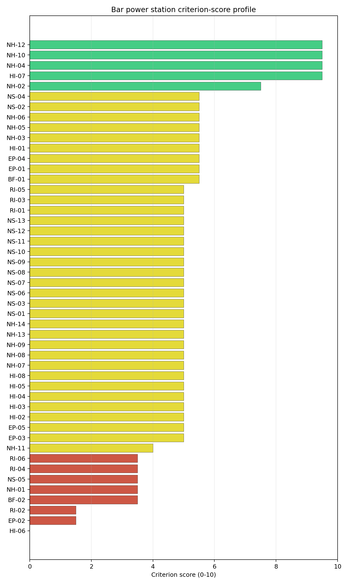
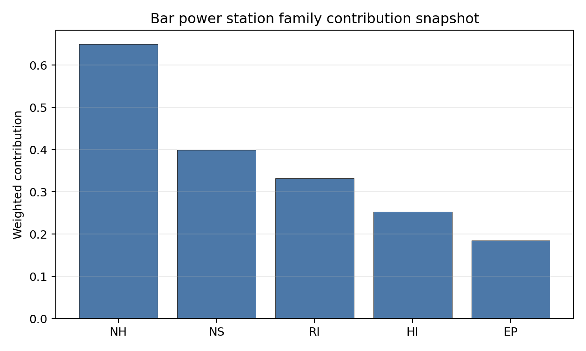

# Bar power station Site Profile

Bar power station is a coal/thermal site in Montenegro that has been tested against the NuScale VOYGR-6 reference deployment envelope. This profile reads the screening evidence at a level that supports a decision to progress toward Stage 3 characterization. It is not a site-suitability determination, vendor recommendation, or licensing finding.

## Site Snapshot

| Field | Value |
| --- | --- |
| Site name | Bar power station |
| Coordinates | 42.1000, 19.1000 |
| Subnational unit | Bar |
| Installed thermal capacity (source data) | 800 MW |
| Composite score (baseline weights) | 4.441 (3.590-4.817 MC band) |
| National stability band | D (top-10% hit rate 6%) |
| National rank | 1 |

_See the country status map in_ [Montenegro Country Profile](../ME_country_prototype.md#country-status-map).

## Ownership and Coal-to-Nuclear Context

- **Blackrock Advisors LLC** (nan% share), headquartered in United States; immediate operator Enel SpA. Path: Blackrock Advisors LLC -> BlackRock Inc [5.07%] -> Enel SpA [5.02%] -> Bar power station -- [unknown %]
- **Duferco Participations Holding SA** (nan% share), headquartered in Luxembourg; immediate operator Dufenergy Italia SpA. Path: Duferco Participations Holding SA -> Duferco SA [unknown %] -> Dufenergy Italia SpA [unknown %] -> Bar power station -- [unknown %]
- **Enel SpA** (nan% share), headquartered in Italy; immediate operator Enel SpA. Path: Enel SpA -> Bar power station -- [unknown %]
- **BlackRock Inc** (nan% share), headquartered in United States; immediate operator Enel SpA. Path: BlackRock Inc -> Enel SpA [5.02%] -> Bar power station -- [unknown %]
- **small shareholder(s)** (nan% share); immediate operator Enel SpA. Path: small shareholder(s)  -> Enel SpA [71.18%] -> Bar power station -- [unknown %]
- **The Vanguard Group Inc** (nan% share), headquartered in United States; immediate operator Enel SpA. Path: The Vanguard Group Inc -> BlackRock Inc [8.66%] -> Enel SpA [5.02%] -> Bar power station -- [unknown %]
- **Ministry of Economy and Finance (Italy)** (nan% share), headquartered in Italy; immediate operator Enel SpA. Path: Ministry of Economy and Finance (Italy)  -> Enel SpA [23.59%] -> Bar power station -- [unknown %]

Generating units on record: 1 cancelled.
Earliest unit commissioning: 2014; most recent: 2014.

## Natural Hazards (NH)

- **Seismic: Ground Motion (NH-01)** - score 3.5/10 (MC 3.0-4.0), weight 0.0396, data quality high. Evidence: PGA at 475-year return period 0.289 g; PGA at 2,475-year return period 0.689 g; Vs30 reference (m/s): 760.0.
- **Seismic: Surface Rupture (NH-02)** - score 7.5/10 (MC 7.0-8.0), weight n/a, data quality screening grade. Evidence: nearest mapped capable fault 10.4 km; fault slip rate 0.324 mm/yr; fault name: MECF005.
- **Geotechnical: Liquefaction (NH-03)** - score 5.5/10 (MC 5.0-6.0), weight n/a, data quality medium. Evidence: liquefaction susceptibility: moderate; dominant soil type: silty_clay_loam.
- **Geotechnical: Slope Stability (NH-04)** - score 9.5/10 (MC 9.0-10.0), weight n/a, data quality screening grade. Evidence: site slope 3.81 deg; max slope in 1 km box 67.6 deg; slope stability class: gentle.
- **Geotechnical: Subsidence (NH-05)** - score 5.5/10 (MC 5.0-6.0), weight 0.0308, data quality medium. Evidence: karst present: no; karst severity: moderate; formation type: carbonate (Continuous carbonate rocks).
- **Geotechnical: Foundation (NH-06)** - score 5.5/10 (MC 5.0-6.0), weight 0.0220, data quality medium. Evidence: bearing capacity 87.3 kPa; depth to bedrock 23.0 m.
- **Volcanism (NH-07)** - score 5.0/10 (MC 5.0-5.0), weight n/a, data quality high. Evidence: volcanic hazard class: negligible.
- **Coastal Flooding (NH-08)** - score 5.0/10 (MC 5.0-5.0), weight 0.0264, data quality low. Evidence: values not in measurement tables.
- **River Flooding (NH-09)** - score 5.0/10 (MC 5.0-5.0), weight 0.0352, data quality medium. Evidence: flood zone class: negligible.
- **Extreme Winds (NH-10)** - score 9.5/10 (MC 9.0-10.0), weight n/a, data quality medium. Evidence: design wind speed 8.76 m/s.
- **Extreme Precipitation (NH-11)** - score 4.0/10 (MC 4.0-4.0), weight 0.0132, data quality medium. Evidence: extreme daily precipitation 0.81 mm; mean annual precipitation 66.4 mm/yr.
- **Extreme Temperatures (NH-12)** - score 9.5/10 (MC 9.0-10.0), weight 0.0176, data quality medium. Evidence: extreme high temperature 27.0 deg C; extreme low temperature 6.14 deg C.
- **Forest/Wildfire (NH-13)** - score 5.0/10 (MC 5.0-5.0), weight 0.0132, data quality n/a. Evidence: values not in measurement tables.
- **Combined Hazards (NH-14)** - score 5.0/10 (MC 5.0-5.0), weight 0.0132, data quality n/a. Evidence: values not in measurement tables.

### Interpretation - Natural Hazards (NH)

<!-- specialist key=family_natural_hazards scope=site site_id=3795824b-cb76-48dd-a65c-764c757ddc76 bundle=ME_bar_power_station_site_bundle.json status=filled by=cursor-agent filled_at=2026-05-03T16:25:41Z -->
Natural hazards at Bar sit in the high-seismic Adriatic-Dinaric envelope on the coastal Bar plain, with a binding **NH-01 caution** that is the closest the site comes to an exclusionary-screen fail and is the principal natural-hazard finding. PGA at the 475-yr return period is **0.289 g** and at the 2,475-yr return period is **0.689 g** — the highest seismic loading of the first-batch cohort by a clear margin and within the upper tail of the European seismic envelope. The 0.689 g figure triggers the project Phase-2 avoidance threshold of PGA(2,475-yr) > 0.5 g and reads NH-01 down to **3.5/10**, even though it sits below the absolute exclusionary cut-off and so the site clears the Phase-1 hard screen. The Stage 3 site-specific PSHA is the binding question — the screening uses a uniform Vs30 reference of 760 m/s and the Adriatic-Dinaric ground-motion prediction equations, so a project-specific PSHA on measured Vs30 with regional source modelling can refine the design-basis PGA but is unlikely to lift it below the 0.5 g project envelope without a substantial technical case. The nearest mapped capable fault (MECF005) is at **10.4 km** with a slip rate of 0.324 mm/yr, comfortably outside the 8 km screening exclusion radius (NH-02 settles at 7.5/10), but reflects the active Dinaric thrust belt context. Geotechnical conditions are middle-band: silty-clay-loam soils with a `moderate` liquefaction susceptibility (NH-03 at 5.5/10), a screening-proxy bearing capacity of 87.3 kPa and depth to bedrock 23.0 m. **NH-04 Geotechnical: Slope Stability at 9.5/10** carries a mean site slope of just 3.81° on a `gentle` slope-stability class, the cleanest topographic read of the Adriatic-coast cohort. **NH-05 Geotechnical: Subsidence at 5.5/10** carries `karst not present` at the centroid and a `moderate` karst-severity classification on continuous-carbonate-rock formation (the Adriatic-coast karst-plateau context). NH-06 holds at 5.5/10. Extreme meteorology is calm: a 50-yr design wind of 8.76 m/s and an extreme temperature range of 6.14 °C to 27.0 °C (the narrowest temperature range of the first-batch cohort, a marine-moderation effect). NH-11 reads 4.0/10 on the screening proxy. NH-07, NH-08 (the **11.9 m site elevation on the Adriatic coast** is a meaningful Stage 3 question against Adriatic storm-surge and tsunami return periods) and NH-09 carry `inconclusive` avoidance verdicts. The Stage 3 priority order is therefore: commission a project-specific PSHA on measured Vs30 and regional source modelling so NH-01 lifts off the screening read (this is the binding natural-hazard question of the site); commission a coastal-flood, storm-surge and tsunami study against the 11.9 m site elevation under climate-projected return periods so NH-08 lifts off the inconclusive read; and run a karst-feature geophysical survey on the buildable patch so NH-05 lifts off the regional moderate-severity read.
<!-- /specialist key=family_natural_hazards -->

## Human-Induced and Security-Relevant Hazards (HI)

- **Aircraft Crash (HI-01)** - score 5.5/10 (MC 5.0-6.0), weight 0.0308, data quality high. Evidence: nearest airport 28.0 km; nearest flight path 15.7 km; airports within search radius 1; airport name: Splendid Hotel Helipad; airport type: heliport.
- **Industrial Explosions (HI-02)** - score 5.0/10 (MC 5.0-5.0), weight 0.0308, data quality screening grade. Evidence: values not in measurement tables.
- **Toxic/Gas Releases (HI-03)** - score 5.0/10 (MC 5.0-5.0), weight 0.0308, data quality screening grade. Evidence: values not in measurement tables.
- **External Fires (HI-04)** - score 5.0/10 (MC 5.0-5.0), weight 0.0264, data quality screening grade. Evidence: values not in measurement tables.
- **Transport Hazards (HI-05)** - score 5.0/10 (MC 5.0-5.0), weight 0.0264, data quality n/a. Evidence: values not in measurement tables.
- **Military Installations (HI-06)** - score 0.0/10 (MC 0.0-0.0), weight 0.0264, data quality not_found. Evidence: nearest military installation 0.89 km; military installations within radius 0.
- **Electromagnetic Interference (HI-07)** - score 9.5/10 (MC 9.0-10.0), weight 0.0088, data quality not_found. Evidence: nearest high-power transmitter 0.46 km; transmitters within radius 0; transmitter type: tower.
- **Other Nuclear Installations (HI-08)** - score 5.0/10 (MC 5.0-5.0), weight 0.0132, data quality n/a. Evidence: values not in measurement tables.

### Interpretation - Human-Induced and Security-Relevant Hazards (HI)

<!-- specialist key=family_human_hazards scope=site site_id=3795824b-cb76-48dd-a65c-764c757ddc76 bundle=ME_bar_power_station_site_bundle.json status=filled by=cursor-agent filled_at=2026-05-03T16:25:41Z -->
Human-induced and security-relevant hazards at Bar are the lightest of the first-batch cohort by a clear margin, with no binding findings on the aviation, industrial or pollutant-release sides — the structural advantage of the small-scale isolated coastal-Bar context. The nearest civilian air feature is the **Splendid Hotel Helipad at 28.0 km** (a small private helipad, the most distant nearest-airport read of the first-batch cohort after Plomin's 26.6 km), with the nearest flight-path projection at 15.7 km and **a single air feature inside the 30 km screening radius** (the lightest aviation traffic of any first-batch site alongside Plomin). HI-01 settles at 5.5/10 on the comfortable design-basis margin. **HI-02 Industrial Explosions, HI-03 Toxic / Gas Releases, HI-04 External Fires** all sit at the pass-mark default of 5.0/10 on `screening grade` data quality (the screening pollutant-release inventory has limited Montenegrin coverage); the absence of any major industrial estate on the Bar coast and the small scale of the existing port and rail terminal make these screening reads more likely than for the inland Hungarian / Czech sites to convert to favourable measurements once Stage 3 obtains the national Seveso file. **HI-06 Military Installations** at **0.0/10** carries `not_found` data quality with a residual nearest-feature reference at **0.89 km** (the closest residual reference of the first-batch cohort, almost certainly the Adriatic-coast NATO partner naval-or-coastal infrastructure cadastre artefact rather than a positive military-installation finding); the criterion is held on the screening method's handling of `not_found` data rather than on a positive finding, but the very low residual distance makes a live Montenegrin Ministry of Defence cadastre confirmation an immediate Stage 3 question. HI-07 Electromagnetic Interference scores 9.5/10 with the nearest broadcast feature at 0.46 km (a tower) but **zero transmitters inside the EMI stand-off radius** on `not_found` quality. HI-08 (Other Nuclear Installations) is null. The Stage 3 priority order is therefore: obtain the live Montenegrin Ministry of Defence cadastre for the 25 km screening radius so HI-06 lifts off the `not_found` floor and the 0.89 km residual reference is resolved (this is the immediate Stage 3 governance question on the family); run the Montenegrin national Seveso and hazmat-corridor cadastres so HI-02 to HI-05 convert from `screening grade` to defensible measured distances against the wider Bar-Bar Port-Sutomore corridor; and commission a project EMC survey against the local broadcast cadastre.
<!-- /specialist key=family_human_hazards -->

## Radiological Impact and Emergency Planning (RI / EP)

- **Emergency Planning Feasibility (EP-01)** - score 5.5/10 (MC 5.0-6.0), weight n/a, data quality high. Evidence: EP feasibility composite 45.5 /100; road sub-score 28.8 /100; special-population sub-score 90.0 /100; geography sub-score 95.0 /100; population sub-score 60.0 /100; evacuation feasible: yes.
- **Evacuation Routes (EP-02)** - score 1.5/10 (MC 1.0-2.0), weight 0.0264, data quality medium. Evidence: road density in EPZ 0.188 km/km2; road length in EPZ 369.4 km; motorway access: yes.
- **Physical Geography Constraints (EP-03)** - score 5.0/10 (MC 5.0-5.0), weight 0.0220, data quality medium. Evidence: waterways crossing EPZ 0; major river barrier: no.
- **Special Populations (EP-04)** - score 5.5/10 (MC 5.0-6.0), weight 0.0264, data quality medium. Evidence: hospitals in EPZ 10; prisons in EPZ 0; care homes in EPZ 0.
- **Concurrent Hazard Impact (EP-05)** - score 5.0/10 (MC 5.0-5.0), weight 0.0176, data quality n/a. Evidence: values not in measurement tables.
- **Atmospheric Dispersion (RI-01)** - score 5.0/10 (MC 5.0-5.0), weight 0.0264, data quality medium. Evidence: annual mean wind speed 1.4 m/s; atmospheric mixing height 425.8 m; prevailing wind direction: ENE.
- **Surface Water Dispersion (RI-02)** - score 1.5/10 (MC 1.0-2.0), weight 0.0220, data quality n/a. Evidence: values not in measurement tables.
- **Groundwater Dispersion (RI-03)** - score 5.0/10 (MC 5.0-5.0), weight 0.0220, data quality medium. Evidence: aquifer type: low permeability.
- **Population Density at EPZ Radii (RI-04)** - score 3.5/10 (MC 3.0-4.0), weight 0.0352, data quality screening grade. Evidence: population density within 5 km 396.1 /km2; population density within 16 km 59.2 /km2; population density within 25 km 34.9 /km2; population density within 80 km 40.8 /km2; population within 25 km 68,443 people.
- **Distance to Population Centres (RI-05)** - score 5.0/10 (MC 5.0-5.0), weight 0.0441, data quality screening grade. Evidence: values not in measurement tables.
- **Population Projections (RI-06)** - score 3.5/10 (MC 3.0-4.0), weight 0.0220, data quality screening grade. Evidence: annual population growth rate 0.497 %/yr; projected population at 25 km in 60 yr 50,059 people.

### Interpretation - Radiological Impact and Emergency Planning (RI / EP)

<!-- specialist key=family_radiological_emergency scope=site site_id=3795824b-cb76-48dd-a65c-764c757ddc76 bundle=ME_bar_power_station_site_bundle.json status=filled by=cursor-agent filled_at=2026-05-03T16:25:41Z -->
Radiological impact and emergency planning at Bar read as a high-immediate-density / unfavourable-trajectory envelope, dominated by the immediate proximity of Bar town and the unusual positive-growth coastal-tourism trajectory. Population density at the screening epoch is **396.1 p/km² at 5 km** (the second-highest 5 km density of the first-batch cohort after Kurzeme's 424.7, reflecting the urban Bar town centre 4 km from the site), 59.2 p/km² at 16 km, 34.9 p/km² at 25 km and 40.8 p/km² at 80 km, with a 25 km total of 68,443 people; the population case is binary — Bar town inside the inner EPZ ring, with rural-coastal Adriatic Montenegro outside. Trajectory is unfavourable for a 60-year siting horizon: **+0.497 %/yr** regional growth rate (the only positive growth rate of the first-batch cohort outside Borsod's +0.115 %/yr, reflecting coastal urbanization in the Bar-Sutomore-Ulcinj corridor) yields a 25 km projection of **50,059 people in 60 years** (down only marginally from the screening epoch), and **RI-06 reads 3.5/10** as the binding population-projection finding (the only RI-06 score below 5.5/10 in the first-batch cohort). Under the screening hierarchy the very-high 5 km density flags **RI-04 at 3.5/10** as the binding population finding for the site. The atmospheric envelope is calm with a continental signal: the screening reanalysis gives a mean wind speed of 1.4 m/s, a prevailing direction of ENE (toward inland Albania and Kosovo, away from the Adriatic), and a mean planetary boundary-layer height of 425.8 m (the lowest mixing height of the first-batch cohort alongside Plomin, a feature of the marine-coastal context that warrants Stage 3 attention on stable-layer plume conditions). Aquifer type is `low permeability`, holding RI-03 at 5.0/10. **RI-02 Surface Water Dispersion** at **1.5/10** holds at the screening floor pending a measured cooling-source dilution flow; the operational cooling envelope for any nuclear deployment on the Bar coast would be once-through Adriatic Sea cooling rather than the screening Rena river assignment (the Rena flow of 2.27 m³/s at 13.5 km is too distant and too small to support the project water budget). The principal emergency-planning finding is **EP-02 Evacuation Routes at 1.5/10** — the lowest EP-02 score of the first-batch cohort tied with Kurzeme: the road density inside the EPZ is just **0.188 km/km² over 369.4 km of road** (the lowest road density of the first-batch cohort, reflecting the steep mountainous Adriatic-coast hinterland and the single-coastal-corridor evacuation constraint); the road sub-score is 28.8/100 and drives the EP-01 composite of 45.5/100 (FEASIBLE on the geography sub-score but binding on the road network). EP-04 Special Populations at 5.5/10 carries 10 hospitals in the EPZ. The Stage 3 priority order is therefore: model the EPZ time-to-clear under summer/winter loadings and the summer-tourism surge using Montenegrin national emergency-planning traffic data with explicit modelling of the single-coastal-corridor evacuation constraint and the Bar town outbound surge; run a marine-dispersion analysis under SSG-21 methodology for the Adriatic receptor (the project cooling envelope rather than the screening Rena assignment); and refresh the 60-year population projection against Montenegrin national demographic projections under coastal-tourism-growth scenarios.
<!-- /specialist key=family_radiological_emergency -->

## Non-Safety and Implementation Considerations (NS)

- **Grid Capacity Basic Filter (BF-01)** - score 5.5/10 (MC 5.0-6.0), weight 0.0352, data quality n/a. Evidence: values not in measurement tables.
- **Land Area Basic Filter (BF-02)** - score 3.5/10 (MC 3.0-4.0), weight 0.0220, data quality n/a. Evidence: values not in measurement tables.
- **Cooling Water Availability (NS-01)** - score 5.0/10 (MC 5.0-6.0), weight n/a, data quality screening grade. Evidence: distance to cooling source 13.5 km; cooling source flow 2.27 m3/s; cooling source type: small_river; cooling source name: Rena; water stress label: Low.
- **Grid Connection (NS-02)** - score 5.5/10 (MC 3.5-7.5), weight 0.0352, data quality insufficient. Evidence: nearest substation 0.26 km; nearest high-voltage line 1.01 km; highest nearby line voltage 110.0 kV; grid export capacity 800.0 MW; substations within radius 264; HV lines within radius 186.
- **Transport Access (NS-03)** - score 5.0/10 (MC 5.0-5.0), weight 0.0352, data quality low. Evidence: values not in measurement tables.
- **Site Topography (NS-04)** - score 5.5/10 (MC 5.0-6.0), weight 0.0264, data quality medium. Evidence: favourable land cover 41.7 %; moderate land cover 10.6 %; unfavourable land cover 47.7 %; favourable area 92.9 ha; dominant land class: 112.
- **Site Footprint Adequacy (NS-05)** - score 3.5/10 (MC 3.0-4.0), weight 0.0220, data quality high. Evidence: buildable area 9.68 ha; largest contiguous patch 9.68 ha; buildable patch count 12.
- **Existing Infrastructure (NS-06)** - score 5.0/10 (MC 5.0-5.0), weight 0.0220, data quality n/a. Evidence: values not in measurement tables.
- **Environmental Impact (non-rad) (NS-07)** - score 5.0/10 (MC 5.0-5.0), weight 0.0220, data quality n/a. Evidence: values not in measurement tables.
- **Ecological Sensitivity (NS-08)** - score 5.0/10 (MC 5.0-5.0), weight n/a, data quality insufficient. Evidence: natural land cover 47.7 %; distance to nearest protected area 0.575 km; Natura 2000 sensitivity class: unknown; protected-area overlap: no; protected-area sensitivity class: high; Natura 2000 sites within 5 km: 0; nearest protected-area designation: Natural Monument.
- **Socioeconomic Impact (NS-09)** - score 5.0/10 (MC 5.0-5.0), weight 0.0220, data quality n/a. Evidence: values not in measurement tables.
- **Workforce Availability (NS-10)** - score 5.0/10 (MC 5.0-5.0), weight 0.0176, data quality n/a. Evidence: values not in measurement tables.
- **Coal-to-Nuclear Synergies (NS-11)** - score 5.0/10 (MC 5.0-5.0), weight 0.0264, data quality n/a. Evidence: values not in measurement tables.
- **Regulatory/Political Environment (NS-12)** - score 5.0/10 (MC 5.0-5.0), weight 0.0264, data quality n/a. Evidence: values not in measurement tables.
- **Construction Logistics (NS-13)** - score 5.0/10 (MC 5.0-5.0), weight 0.0176, data quality n/a. Evidence: values not in measurement tables.

### Interpretation - Non-Safety and Implementation Considerations (NS)

<!-- specialist key=family_infrastructure scope=site site_id=3795824b-cb76-48dd-a65c-764c757ddc76 bundle=ME_bar_power_station_site_bundle.json status=filled by=cursor-agent filled_at=2026-05-03T16:25:41Z -->
Non-safety implementation at Bar is the most challenging dimension of the site after the seismic and population findings, with binding caution on the small buildable footprint (NS-05) and meaningful constraints on cooling, ecology, transport and topography. **NS-05 Site Footprint Adequacy** scores **3.5/10** (caution): the buildable area is **9.68 ha with the largest contiguous patch also at 9.68 ha across 12 patches**, well below the project A15 14 ha contiguous threshold and the second-smallest buildable envelope of the first-batch cohort after Kurzeme's 8.7 ha. The 9.68 ha figure essentially forces a smaller VOYGR-2 or VOYGR-4 deployment, or a comprehensive site re-layout to lift the buildable patch to the project envelope. **BF-02 Land Area** at 3.5/10 confirms the wider land constraint. **NS-04 Site Topography** scores 5.5/10 with **41.7 % favourable land cover** within the 2 km screening radius, 10.6 % moderate cover and 47.7 % unfavourable cover (the second-highest unfavourable share of the first-batch cohort, reflecting the steep coastal-Bar hinterland topography). **NS-08 Ecological Sensitivity** at 5.0/10 reads `insufficient` data quality with the **nearest protected area at 0.575 km** (a Natural Monument designation, sensitivity class `high` — the closest protected-area distance of the first-batch cohort, and a binding ecological question once the Stage 3 cadastre is obtained). **NS-01 Cooling Water Availability** scores 5.0/10: the screening cooling-source assignment is to the Rena river at **13.5 km with a flow of only 2.27 m³/s** and a `Low` water-stress label; the screening assignment is too distant and too small to support a NuScale VOYGR-6 once-through cooling demand and the operational cooling envelope must rely on once-through Adriatic Sea cooling, which the Stage 3 dispersion analysis must consider against marine-thermal-discharge constraints. **NS-02 Grid Connection** scores 5.5/10 (data quality `insufficient`): the nearest substation is at 0.26 km, the nearest high-voltage line at 1.01 km, the highest nearby line voltage is 110 kV, the screening grid-export-capacity figure at 800 MW (matching the existing thermal complex), and **264 substations and 186 HV lines inside the 25 km screening radius** (the densest grid context on the Adriatic coast cohort, reflecting the Bar-Podgorica-Albania transmission corridor); a 110→220 kV upgrade is required for the project capacity envelope. **NS-03 Transport Access** holds at the 5.0/10 screening default with `low` data quality, pending a measured transport assessment; the Bar deep-water port is a structural advantage for reactor-vessel marine transport but the screening read does not capture this. The Stage 3 priority order is therefore: confirm the buildable-patch envelope under site-specific terrain modelling and engineering re-layout to lift the 9.68 ha screening read to the project A15 threshold (or commit to a smaller VOYGR-2 / VOYGR-4 deployment); confirm the once-through Adriatic Sea cooling envelope under marine-thermal-discharge constraints with the Bar municipal authority and the marine ecological assessment; scope the appropriate-assessment for the 0.575 km Natural Monument; and open the Montenegrin transmission-system-operator dialogue on a 110→220 kV upgrade at the Bar substation.
<!-- /specialist key=family_infrastructure -->

## Composite Score and Stability

Baseline composite score is 4.441, bracketed by Monte Carlo at 3.590-4.817. National stability band is `D` with a top-10% hit rate of 6% across 16 scored Monte Carlo scenarios.

<!-- specialist key=stability scope=site site_id=3795824b-cb76-48dd-a65c-764c757ddc76 bundle=ME_bar_power_station_site_bundle.json status=filled by=cursor-agent filled_at=2026-05-03T16:25:41Z -->
Bar sits at national rank 1 in the Montenegrin cohort but with a **D national band** and an **H regional band** — the weakest combined stability read of the first-batch cohort. The composite score of **4.441** (MC band 3.590–4.817) is the lowest of the first-batch cohort by a clear margin, materially below the next-weakest first-batch site (Plomin at 5.131), and the band rank tells the executive reader that Bar is fragile to weight perturbations within the screening method: the **6 % top-10 % hit rate and 6 % top-5 % hit rate** across all 16 scored Monte Carlo scenarios indicate the site rarely makes it into the Montenegrin upper tail and never into the regional upper tail (the H regional band is the worst of the first-batch cohort and reflects that against the wider Central, Eastern and Southern Europe regional benchmark, Bar sits in the bottom regional decile). Family-level normalised contributions show natural hazards as the dominant positive (mean 0.61, dragged by NH-01 but lifted by NH-04 / NH-10 / NH-12), with infrastructure (0.49) and human-induced (0.50, the cleanest HI envelope of the first-batch cohort) close behind, while radiological (0.42, the weakest read of the first-batch cohort) acts as the relative drag. The top contributing criteria mirror this pattern: RI-05 Distance to Population Centres (the strongest single contributor at 0.22 contrib weight), BF-01 Grid Capacity, NS-02 Grid Connection, NH-09 River Flooding, NS-03 Transport Access and HI-01 Aircraft Crash all push toward the FAVOURABLE band, while HI-06 Military Installations (the floor read at 0.0/10 on `not_found` quality), EP-02 Evacuation Routes (the binding 1.5/10 read on the single coastal corridor), RI-02 Surface Water Dispersion (the binding 1.5/10 read on the screening floor), BF-02 Land Area, NH-01 Seismic Ground Motion (the binding 3.5/10 caution at 0.689 g PGA), NS-05 Site Footprint Adequacy (the binding 9.68 ha read), RI-04 Population Density (the binding 396.1 p/km² read at 5 km), and RI-06 Population Projections (the binding +0.497 %/yr coastal-tourism growth read) all act as binding drags. The D-national / H-regional split is the structural read of the site: Bar is the best Montenegrin candidate (the country's other three sites — Berane, Maoce and Pljevlja — all hard-fail at the exclusionary screen on EP-01, NH-02 or both), but the binding NH-01 high-PGA case, the small buildable footprint, the single-coastal-corridor evacuation constraint and the unfavourable population trajectory mean it is a marginal regional candidate and the project case turns on whether the Stage 3 site-specific PSHA can keep NH-01 below the 0.5 g project envelope. The Stage 3 work that would tighten the composite uncertainty band most quickly is the project-specific PSHA on measured Vs30 and the buildable-patch re-layout to lift NS-05 off the caution flag.
<!-- /specialist key=stability -->

## Residual Risk Register

<!-- specialist key=residual_risk scope=site site_id=3795824b-cb76-48dd-a65c-764c757ddc76 bundle=ME_bar_power_station_site_bundle.json status=filled by=cursor-agent filled_at=2026-05-03T16:25:41Z -->
| Criterion | Description | Owner | Resolution path |
|---|---|---|---|
| NH-01 | PGA at 2,475-yr return period 0.689 g — the highest seismic loading of the first-batch cohort and triggers the project Phase-2 avoidance threshold (PGA(2,475 yr) > 0.5 g); the binding natural-hazard finding of the site. | Seismic engineer | Project-specific PSHA on measured Vs30 and regional source modelling; lift NH-01 below the 0.5 g project envelope or commit to enhanced seismic design. |
| NS-05 | Buildable area 9.68 ha with the largest contiguous patch also at 9.68 ha across 12 patches; below the project A15 14 ha contiguous threshold. | Project civil engineer | Confirm the buildable-patch envelope under site-specific terrain modelling and engineering re-layout; commit to a smaller VOYGR-2 / VOYGR-4 deployment if the patch cannot be expanded. |
| BF-02 | Wider land-area constraint at 3.5/10 confirms the regional buildable-patch shortage. | Project civil engineer | Covered by the NS-05 re-layout and the smaller-deployment fallback. |
| NS-08 | Natural Monument protected area at **0.575 km** with sensitivity class `high` — the closest protected-area distance of the first-batch cohort; `insufficient` data quality on the wider ecological cadastre. | Project ecologist | Appropriate-assessment for the 0.575 km Natural Monument under the project EIA; obtain the live Montenegrin national protected-area cadastre. |
| RI-04 | Bar town centre at 396.1 p/km² within 5 km — the second-highest 5 km density of the first-batch cohort. | Project radiation protection specialist | Source-term placement and atmospheric dispersion modelling against the prevailing-ENE direction (with Bar town to the W); consider a smaller VOYGR-2 / VOYGR-4 deployment to reduce the source-term envelope. |
| RI-06 | +0.497 %/yr regional growth rate (coastal-tourism context) — RI-06 reads 3.5/10 (the only RI-06 score below 5.5/10 in the first-batch cohort); 50,059 people projected at 25 km in 60 years. | Demographic specialist | Refresh the 60-year population projection against Montenegrin national demographic projections under coastal-tourism-growth scenarios. |
| EP-02 | Evacuation road density 0.188 km/km² over 369.4 km — the lowest road density of the first-batch cohort; single coastal corridor evacuation constraint with the steep mountainous Adriatic-coast hinterland. | National emergency planner | EPZ time-to-clear modelling under summer/winter loadings and the summer-tourism surge using Montenegrin national emergency-planning traffic data. |
| RI-02 / NS-01 | Cooling envelope must rely on once-through Adriatic Sea cooling rather than the screening Rena assignment (Rena flow 2.27 m³/s at 13.5 km); RI-02 held at the screening floor of 1.5/10. | Hydrologist; project water engineer | Marine-dispersion analysis under SSG-21 methodology for the Adriatic receptor; confirm marine-thermal-discharge envelope with the Bar municipal authority. |
| NH-08 | Site elevation 11.9 m on the Adriatic coast; coastal-flooding measurement not in the screening tables. | Hydrologist | Coastal-flood, storm-surge and tsunami study against the 11.9 m site elevation under climate-projected return periods. |
| NH-05 | Karst not present at the centroid but `moderate` karst-severity classification on continuous-carbonate-rock formation in the wider Adriatic-coast karst-plateau context. | Geomechanical engineer | Karst-feature geophysical survey on the buildable patch. |
| HI-06 | Held at 0.0/10 on `not_found` data quality with a residual nearest-feature reference at 0.89 km — the closest residual of the first-batch cohort. | Montenegrin Ministry of Defence | Obtain the live national MoD cadastre for the 25 km screening radius and resolve the 0.89 km residual reference. |
| NS-02 | Highest nearby line voltage 110 kV; would require 110→220 kV upgrade for the project capacity envelope. | Montenegrin transmission system operator | 110→220 kV upgrade at the Bar substation. |
| NS-03 | Held at 5.0/10 screening default on `low` data quality; the Bar deep-water port is a structural advantage for marine reactor-vessel transport that the screening read does not capture. | Project transport engineer | Commission a measured transport assessment; confirm the Bar deep-water port reactor-vessel offloading envelope. |
<!-- /specialist key=residual_risk -->

## Stage 3 Follow-Up Checklist

- [ ] Resolve **Seismic: Ground Motion (NH-01)** avoidance flag - measured {"pga_2475yr_g": 0.68879} vs threshold Project screening: PGA(2475 yr) > 0.5 g fails Phase 2..
- [ ] Resolve **Site Footprint Adequacy (NS-05)** avoidance flag - measured {"largest_contiguous_ha": 9.68} vs threshold Project A15: >= 14 ha contiguous industrial land..
- [ ] Re-measure **Military Installations (HI-06)** - native score 0.0/10 with confidence medium.
- [ ] Re-measure **Evacuation Routes (EP-02)** - native score 1.5/10 with confidence medium.
- [ ] Re-measure **Surface Water Dispersion (RI-02)** - native score 1.5/10 with confidence insufficient.
- [ ] Re-measure **Land Area Basic Filter (BF-02)** - native score 3.5/10 with confidence insufficient.
- [ ] Re-measure **Seismic: Ground Motion (NH-01)** - native score 3.5/10 with confidence high.
- [ ] Improve data quality for **Geotechnical: Subsidence & Collapse (NH-05b)** - current flag `low`.
- [ ] Improve data quality for **Coastal Flooding (NH-08)** - current flag `low`.
- [ ] Improve data quality for **Military Installations (HI-06)** - current flag `not_found`.
- [ ] Improve data quality for **Electromagnetic Interference (HI-07)** - current flag `not_found`.
- [ ] Improve data quality for **Transport Access (NS-03)** - current flag `low`.

## Evidence Limitations

- Geotechnical: Subsidence & Collapse (NH-05b) - quality `low`.
- Coastal Flooding (NH-08) - quality `low`.
- Military Installations (HI-06) - quality `not_found`.
- Electromagnetic Interference (HI-07) - quality `not_found`.
- Transport Access (NS-03) - quality `low`.
