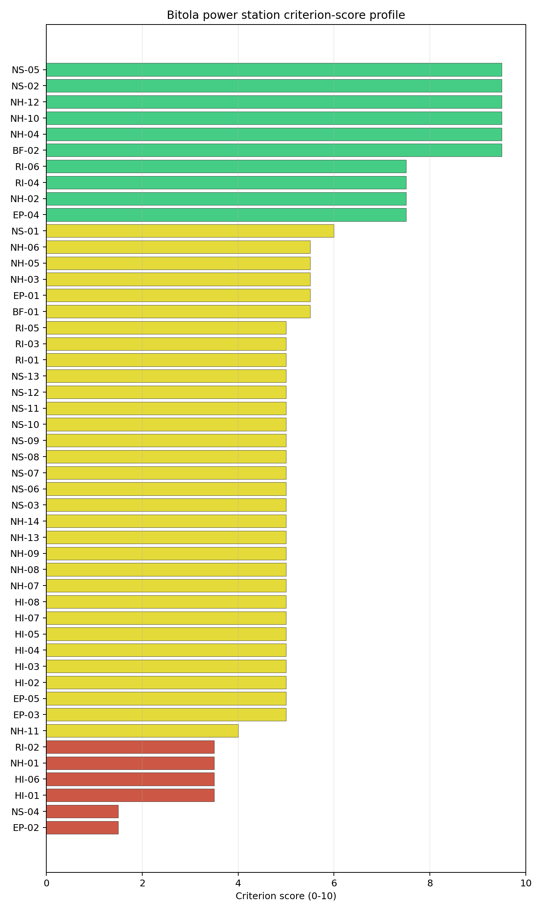
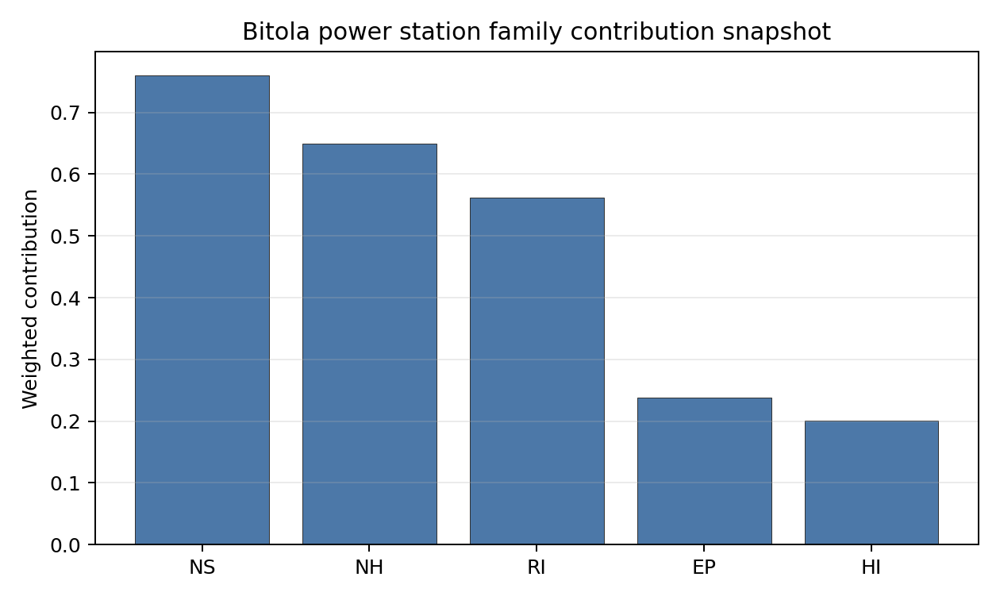

# Bitola power station Site Profile

Bitola power station is a coal/thermal site in North Macedonia that has been tested against the NuScale VOYGR-6 reference deployment envelope. This profile reads the screening evidence at a level that supports a decision to progress toward Stage 3 characterization. It is not a site-suitability determination, vendor recommendation, or licensing finding.

## Site Snapshot

| Field | Value |
| --- | --- |
| Site name | Bitola power station |
| Coordinates | 41.0583, 21.4843 |
| Subnational unit | Novaci |
| Installed thermal capacity (source data) | 699 MW |
| Composite score (baseline weights) | 5.525 (4.101-5.939 MC band) |
| National stability band | A (top-10% hit rate 100%) |
| National rank | 1 |

_See the country status map in_ [North Macedonia Country Profile](../MK_country_prototype.md#country-status-map).

## Ownership and Coal-to-Nuclear Context

- **Government of North Macedonia** (100.00% share), headquartered in North Macedonia; immediate operator REK Bitola. Path: Government of North Macedonia  -> Elektrani na Severna Makedonija AD [100.0%] -> REK Bitola  [100.0%] -> Bitola power station Unit 1 [100.0%]
- **Elektrani na Severna Makedonija AD** (100.00% share), headquartered in North Macedonia; immediate operator REK Bitola. Path: Elektrani na Severna Makedonija AD -> REK Bitola  [100.0%] -> Bitola power station Unit 1 [100.0%]

Generating units on record: 3 operating.
Earliest unit commissioning: 1982; most recent: 1988.

## Natural Hazards (NH)

- **Seismic: Ground Motion (NH-01)** - score 3.5/10 (MC 3.0-4.0), weight 0.0396, data quality high. Evidence: PGA at 475-year return period 0.255 g; PGA at 2,475-year return period 0.544 g; Vs30 reference (m/s): 760.0.
- **Seismic: Surface Rupture (NH-02)** - score 7.5/10 (MC 7.0-8.0), weight n/a, data quality screening grade. Evidence: nearest mapped capable fault 11.4 km; fault slip rate 0.173 mm/yr; fault name: MKCF003.
- **Geotechnical: Liquefaction (NH-03)** - score 5.5/10 (MC 5.0-6.0), weight n/a, data quality medium. Evidence: liquefaction susceptibility: moderate; dominant soil type: loam.
- **Geotechnical: Slope Stability (NH-04)** - score 9.5/10 (MC 9.0-10.0), weight n/a, data quality screening grade. Evidence: site slope 2.38 deg; max slope in 1 km box 31.4 deg; slope stability class: gentle.
- **Geotechnical: Subsidence (NH-05)** - score 5.5/10 (MC 5.0-6.0), weight 0.0308, data quality medium. Evidence: karst present: no; karst severity: none.
- **Geotechnical: Foundation (NH-06)** - score 5.5/10 (MC 5.0-6.0), weight 0.0220, data quality medium. Evidence: bearing capacity 86.7 kPa; depth to bedrock 26.1 m.
- **Volcanism (NH-07)** - score 5.0/10 (MC 5.0-5.0), weight n/a, data quality high. Evidence: volcanic hazard class: negligible.
- **Coastal Flooding (NH-08)** - score 5.0/10 (MC 5.0-5.0), weight 0.0264, data quality low. Evidence: values not in measurement tables.
- **River Flooding (NH-09)** - score 5.0/10 (MC 5.0-5.0), weight 0.0352, data quality medium. Evidence: flood zone class: negligible.
- **Extreme Winds (NH-10)** - score 9.5/10 (MC 9.0-10.0), weight n/a, data quality medium. Evidence: design wind speed 7.34 m/s.
- **Extreme Precipitation (NH-11)** - score 4.0/10 (MC 4.0-4.0), weight 0.0132, data quality medium. Evidence: extreme daily precipitation 0.17 mm; mean annual precipitation 20.3 mm/yr.
- **Extreme Temperatures (NH-12)** - score 9.5/10 (MC 9.0-10.0), weight 0.0176, data quality medium. Evidence: extreme high temperature 25.1 deg C; extreme low temperature -4.41 deg C.
- **Forest/Wildfire (NH-13)** - score 5.0/10 (MC 5.0-5.0), weight 0.0132, data quality n/a. Evidence: values not in measurement tables.
- **Combined Hazards (NH-14)** - score 5.0/10 (MC 5.0-5.0), weight 0.0132, data quality n/a. Evidence: values not in measurement tables.

### Interpretation - Natural Hazards (NH)

<!-- specialist key=family_natural_hazards scope=site site_id=1739b1b7-a6f3-466c-9dfa-3d1de9d5b6db bundle=MK_bitola_power_station_site_bundle.json status=filled by=cursor-agent filled_at=2026-05-03T16:51:23Z -->
Natural hazards at Bitola sit in the high-seismic Pelagonian-basin envelope on the gentle alluvial plain west of Crna Reka, with a binding **NH-01 caution** that is the principal natural-hazard finding. PGA at the 475-yr return period is **0.255 g** and at the 2,475-yr return period is **0.544 g** — among the highest seismic loadings of the first-batch cohort and just above the project Phase-2 avoidance threshold of PGA(2,475-yr) > 0.5 g, reading NH-01 down to **3.5/10**. The 0.544 g figure is materially below ME Bar's 0.689 g but still triggers the Phase-2 caution; the site sits below the absolute exclusionary cut-off and clears the Phase-1 hard screen. The Stage 3 site-specific PSHA on measured Vs30 with regional source modelling can refine the design-basis PGA against the Pelagonian-basin tectonic context, and the 0.544 g screening read sits close enough to the 0.5 g project envelope that a focused PSHA is plausibly capable of lifting NH-01 below the threshold (unlike Bar where the 0.689 g read leaves much less headroom). The nearest mapped capable fault (MKCF003) is at **11.4 km** with a slip rate of 0.173 mm/yr, comfortably outside the 8 km screening exclusion radius, so NH-02 settles at 7.5/10. Geotechnical conditions are middle-to-favourable: loam soils with a `moderate` liquefaction susceptibility (NH-03 at 5.5/10), a screening-proxy bearing capacity of 86.7 kPa and depth to bedrock 26.1 m. **NH-04 Geotechnical: Slope Stability at 9.5/10** carries a mean site slope of just **2.38°** on a `gentle` slope-stability class (the cleanest topographic read of the first-batch cohort). NH-05 reads 5.5/10 with `karst not present` and `none` severity. NH-06 holds at 5.5/10. Extreme meteorology is calm: a 50-yr design wind of 7.34 m/s and an extreme temperature range of -4.41 °C to 25.1 °C are well inside the project envelope (NH-10 and NH-12 both at 9.5/10). NH-11 reads 4.0/10 on the screening proxy. NH-07, NH-08 (596 m site elevation removes the coastal-flooding case) and NH-09 carry `inconclusive` avoidance verdicts. The Stage 3 priority order is therefore: commission a project-specific PSHA on measured Vs30 and regional source modelling so NH-01 lifts below the 0.5 g project envelope (this is the binding natural-hazard question of the site); commission a local hydrological survey on the Crna Reka and the irrigation-canal network to confirm the site flood envelope so NH-09 lifts off the inconclusive read; and run a CPT campaign so NH-03 settles on a measured liquefaction-susceptibility value rather than the screening proxy.
<!-- /specialist key=family_natural_hazards -->

## Human-Induced and Security-Relevant Hazards (HI)

- **Aircraft Crash (HI-01)** - score 3.5/10 (MC 3.0-4.0), weight 0.0308, data quality high. Evidence: nearest airport 6.64 km; nearest flight path 3.32 km; airports within search radius 2; airport name: Logovardi Sport Aerodrome; airport type: small_airport.
- **Industrial Explosions (HI-02)** - score 5.0/10 (MC 5.0-5.0), weight 0.0308, data quality screening grade. Evidence: values not in measurement tables.
- **Toxic/Gas Releases (HI-03)** - score 5.0/10 (MC 5.0-5.0), weight 0.0308, data quality screening grade. Evidence: values not in measurement tables.
- **External Fires (HI-04)** - score 5.0/10 (MC 5.0-5.0), weight 0.0264, data quality screening grade. Evidence: values not in measurement tables.
- **Transport Hazards (HI-05)** - score 5.0/10 (MC 5.0-5.0), weight 0.0264, data quality n/a. Evidence: values not in measurement tables.
- **Military Installations (HI-06)** - score 3.5/10 (MC 3.0-4.0), weight 0.0264, data quality medium. Evidence: nearest military installation 16.2 km; military installations within radius 9.
- **Electromagnetic Interference (HI-07)** - score 5.0/10 (MC 5.0-5.0), weight 0.0088, data quality medium. Evidence: nearest high-power transmitter 0.22 km; transmitters within radius 26; transmitter type: mast.
- **Other Nuclear Installations (HI-08)** - score 5.0/10 (MC 5.0-5.0), weight 0.0132, data quality n/a. Evidence: values not in measurement tables.

### Interpretation - Human-Induced and Security-Relevant Hazards (HI)

<!-- specialist key=family_human_hazards scope=site site_id=1739b1b7-a6f3-466c-9dfa-3d1de9d5b6db bundle=MK_bitola_power_station_site_bundle.json status=filled by=cursor-agent filled_at=2026-05-03T16:51:23Z -->
Human-induced and security-relevant hazards at Bitola carry an HI-01 caution driven by the nearby Logovardi sport aerodrome and a moderate HI-06 read, with the rest of the family in the middle band. The principal HI finding is the **HI-01 caution at 3.5/10**: the nearest civilian airport is the **Logovardi Sport Aerodrome (`small_airport`) at 6.64 km**, well inside the SSG-35 A1 screening exclusion radius for general-aviation airfields under 10 km, with the nearest flight-path projection at 3.32 km (also inside the SSG-35 A4 4 km flight-path screening trigger), and 2 air features inside the 30 km screening radius. The Logovardi sport aerodrome is a small recreational aviation facility with low-energy operator-controlled traffic, which the SSG-79 hazard assessment will read as a low-energy sub-class with a known traffic profile, but the screening flag still needs to be retired through a project-specific assessment. **HI-06 Military Installations** at 3.5/10 carries the nearest military feature at 16.2 km (well outside the 8 km project A6 ammunition-storage avoidance trigger) with **9 features inside the 25 km screening radius** (a moderate count, comparable to Mohacs); the criterion is informational rather than binding. **HI-02 Industrial Explosions, HI-03 Toxic / Gas Releases, HI-04 External Fires** all sit at the pass-mark default of 5.0/10 on `screening grade` data quality (the screening pollutant-release inventory has limited North Macedonian coverage); the immediate Pelagonian plain context outside the existing thermal complex is rural, but the Bitola industrial estate to the north and the wider regional industrial corridor will need a Stage 3 cadastre run. **HI-05 Transport Hazards** sits at 5.0/10. HI-07 Electromagnetic Interference scores 5.0/10 with the nearest broadcast feature at 0.22 km (a mast) and only **26 transmitters inside the EMI search radius** (the lightest broadcast environment of the first-batch cohort outside Plomin and Bar), reflecting the rural Pelagonian context. HI-08 (Other Nuclear Installations) is null. The Stage 3 priority order is therefore: commission an SSG-79 aircraft-crash hazard assessment for the Logovardi Sport Aerodrome with explicit modelling of the operator-controlled flight profile so HI-01 lifts off the caution flag; engage the North Macedonian Ministry of National Defence on the 9 HI-06 features (a routine governance step rather than a binding question); and run the North Macedonian national Seveso and hazmat-corridor cadastres so HI-02 to HI-05 convert from `screening grade` to defensible measured distances.
<!-- /specialist key=family_human_hazards -->

## Radiological Impact and Emergency Planning (RI / EP)

- **Emergency Planning Feasibility (EP-01)** - score 5.5/10 (MC 5.0-6.0), weight n/a, data quality high. Evidence: EP feasibility composite 57.8 /100; road sub-score 38.1 /100; special-population sub-score 90.0 /100; geography sub-score 95.0 /100; population sub-score 95.0 /100; evacuation feasible: yes.
- **Evacuation Routes (EP-02)** - score 1.5/10 (MC 1.0-2.0), weight 0.0264, data quality medium. Evidence: road density in EPZ 0.281 km/km2; road length in EPZ 552.5 km; motorway access: yes.
- **Physical Geography Constraints (EP-03)** - score 5.0/10 (MC 5.0-5.0), weight 0.0220, data quality medium. Evidence: waterways crossing EPZ 0; major river barrier: no.
- **Special Populations (EP-04)** - score 7.5/10 (MC 7.0-8.0), weight 0.0264, data quality medium. Evidence: hospitals in EPZ 6; prisons in EPZ 1; care homes in EPZ 0.
- **Concurrent Hazard Impact (EP-05)** - score 5.0/10 (MC 5.0-5.0), weight 0.0176, data quality n/a. Evidence: values not in measurement tables.
- **Atmospheric Dispersion (RI-01)** - score 5.0/10 (MC 5.0-5.0), weight 0.0264, data quality medium. Evidence: annual mean wind speed 0.6 m/s; atmospheric mixing height 523.2 m; prevailing wind direction: NW.
- **Surface Water Dispersion (RI-02)** - score 3.5/10 (MC 3.0-4.0), weight 0.0220, data quality n/a. Evidence: values not in measurement tables.
- **Groundwater Dispersion (RI-03)** - score 5.0/10 (MC 5.0-5.0), weight 0.0220, data quality medium. Evidence: aquifer type: alluvial.
- **Population Density at EPZ Radii (RI-04)** - score 7.5/10 (MC 7.0-8.0), weight 0.0352, data quality screening grade. Evidence: population density within 5 km 22.2 /km2; population density within 16 km 111.6 /km2; population density within 25 km 54.9 /km2; population density within 80 km 50.4 /km2; population within 25 km 107,711 people.
- **Distance to Population Centres (RI-05)** - score 5.0/10 (MC 5.0-5.0), weight 0.0441, data quality screening grade. Evidence: values not in measurement tables.
- **Population Projections (RI-06)** - score 7.5/10 (MC 7.0-8.0), weight 0.0220, data quality screening grade. Evidence: annual population growth rate -0.399 %/yr; projected population at 25 km in 60 yr 72,283 people.

### Interpretation - Radiological Impact and Emergency Planning (RI / EP)

<!-- specialist key=family_radiological_emergency scope=site site_id=1739b1b7-a6f3-466c-9dfa-3d1de9d5b6db bundle=MK_bitola_power_station_site_bundle.json status=filled by=cursor-agent filled_at=2026-05-03T16:51:24Z -->
Radiological-impact and emergency-planning conditions at Bitola read favourably on population and dispersion, with the binding finding being the **EP-02 score of 1.5/10** for evacuation-route capacity inside the 16 km EPZ. The DRV-02 emergency-planning composite reads **57.8/100 with `evacuation feasible: yes`**, reflecting strong sub-scores on geography (95/100), population (95/100) and special populations (90/100), pulled down by a **road sub-score of 38.1/100** that is the binding driver of the EP-02 1.5/10 score: the Pelagonian plain inside the EPZ has a road density of just **0.281 km/km²** with 552.5 km of road length and motorway access available, but the cadastre is dominated by lower-grade rural roads rather than a dense national-road network suitable for an EPZ-scale evacuation. **EP-04 Special Populations at 7.5/10** reflects 6 hospitals and 1 prison inside the EPZ (the prison is the binding special-population feature for the SSG-35 emergency-planning matrix) with no care homes recorded. Population density is uniformly low: **22.2 p/km² within 5 km, 111.6 p/km² within 16 km, 54.9 p/km² within 25 km, and 50.4 p/km² within 80 km**, with a 25 km cumulative population of **107,711 people** dominated by Bitola city to the north — RI-04 sits at 7.5/10. The 60-yr projection at 25 km is 72,283 people on a -0.399 %/yr growth track (the Pelagonian plain is depopulating), which makes RI-06 read 7.5/10 — a structural radiological-impact tailwind that contrasts with the Carpathian-basin trajectory at the Hungarian sites. The atmospheric envelope is calm: a 0.6 m/s annual mean wind speed (likely a sheltered-station artefact in the Pelagonian basin) with a **523 m mixing height** and a NW prevailing direction; RI-01 sits at 5.0/10 on `medium` quality and the Stage 3 work should commission a project-specific micro-meteorological station for ≥ 12 months to establish the actual wind rose against the surrounding mountain rims. **RI-02 Surface Water Dispersion at 3.5/10** is `inconclusive` and needs site-specific bathymetric and hydraulic modelling on the Crna Reka and the irrigation-canal network before the radiological-impact assessment can close. RI-03 reads 5.0/10 on the alluvial Pelagonian aquifer system; the Stage 3 hydrogeological survey should characterise vertical and lateral connectivity given the alluvial setting. RI-05 holds at 5.0/10 on `inconclusive`. EP-03 reads 5.0/10 (no major river barrier inside the EPZ), and EP-05 sits at 5.0/10. The Stage 3 priority order is therefore: commission a 16 km EPZ road-network upgrade plan with the North Macedonian Ministry of Transport so EP-02 lifts off the 1.5/10 binding score; commission the project-specific micro-meteorological station so RI-01 settles on a measured wind rose; commission the Crna Reka bathymetric-and-hydraulic survey so RI-02 lifts off the inconclusive read; and engage the Pelagonian regional emergency-planning authority on the prison and 6 hospitals inside the EPZ so EP-04 settles on a defensible operational evacuation plan.
<!-- /specialist key=family_radiological_emergency -->

## Non-Safety and Implementation Considerations (NS)

- **Grid Capacity Basic Filter (BF-01)** - score 5.5/10 (MC 5.0-6.0), weight 0.0352, data quality n/a. Evidence: values not in measurement tables.
- **Land Area Basic Filter (BF-02)** - score 9.5/10 (MC 9.0-10.0), weight 0.0220, data quality n/a. Evidence: values not in measurement tables.
- **Cooling Water Availability (NS-01)** - score 6.0/10 (MC 6.0-6.0), weight n/a, data quality screening grade. Evidence: distance to cooling source 3.99 km; cooling source flow 22.9 m3/s; cooling source type: river; cooling source name: X Канал; water stress label: Low-Medium.
- **Grid Connection (NS-02)** - score 9.5/10 (MC 9.0-10.0), weight 0.0352, data quality medium. Evidence: nearest substation 0.99 km; nearest high-voltage line 0.54 km; highest nearby line voltage 400.0 kV; grid export capacity 699.0 MW; substations within radius 42; HV lines within radius 79.
- **Transport Access (NS-03)** - score 5.0/10 (MC 5.0-5.0), weight 0.0352, data quality low. Evidence: values not in measurement tables.
- **Site Topography (NS-04)** - score 1.5/10 (MC 1.0-2.0), weight 0.0264, data quality medium. Evidence: favourable land cover 0 %; moderate land cover 0 %; unfavourable land cover 0 %; favourable area 0 ha.
- **Site Footprint Adequacy (NS-05)** - score 9.5/10 (MC 9.0-10.0), weight 0.0220, data quality high. Evidence: buildable area 145.7 ha; largest contiguous patch 145.7 ha; buildable patch count 1.
- **Existing Infrastructure (NS-06)** - score 5.0/10 (MC 5.0-5.0), weight 0.0220, data quality n/a. Evidence: values not in measurement tables.
- **Environmental Impact (non-rad) (NS-07)** - score 5.0/10 (MC 5.0-5.0), weight 0.0220, data quality n/a. Evidence: values not in measurement tables.
- **Ecological Sensitivity (NS-08)** - score 5.0/10 (MC 5.0-5.0), weight n/a, data quality insufficient. Evidence: natural land cover 0 %; distance to nearest protected area 8.618 km; Natura 2000 sensitivity class: unknown; protected-area overlap: no; protected-area sensitivity class: low; Natura 2000 sites within 5 km: 0; nearest protected-area designation: Emerald Network.
- **Socioeconomic Impact (NS-09)** - score 5.0/10 (MC 5.0-5.0), weight 0.0220, data quality n/a. Evidence: values not in measurement tables.
- **Workforce Availability (NS-10)** - score 5.0/10 (MC 5.0-5.0), weight 0.0176, data quality n/a. Evidence: values not in measurement tables.
- **Coal-to-Nuclear Synergies (NS-11)** - score 5.0/10 (MC 5.0-5.0), weight 0.0264, data quality n/a. Evidence: values not in measurement tables.
- **Regulatory/Political Environment (NS-12)** - score 5.0/10 (MC 5.0-5.0), weight 0.0264, data quality n/a. Evidence: values not in measurement tables.
- **Construction Logistics (NS-13)** - score 5.0/10 (MC 5.0-5.0), weight 0.0176, data quality n/a. Evidence: values not in measurement tables.

### Interpretation - Non-Safety and Implementation Considerations (NS)

<!-- specialist key=family_infrastructure scope=site site_id=1739b1b7-a6f3-466c-9dfa-3d1de9d5b6db bundle=MK_bitola_power_station_site_bundle.json status=filled by=cursor-agent filled_at=2026-05-03T16:51:24Z -->
Non-safety and implementation conditions at Bitola are dominated by an exceptionally strong grid-and-footprint position, with the binding finding being the **NS-04 Site Topography score of 1.5/10** that flags a complete absence of measured land-cover data inside the buildable envelope. **NS-02 Grid Connection at 9.5/10** carries the strongest grid-inheritance read of the first-batch cohort: the nearest substation is **0.99 km from the site**, the nearest high-voltage line is **0.54 km away** at **400 kV** (the highest project transmission tier), with **42 substations and 79 HV lines inside the search radius** and a measured grid-export capacity of 699 MW exactly matching the existing thermal block — the REK Bitola complex is one of the clearest brownfield grid-inheritance cases in the regional cohort. **NS-05 Site Footprint Adequacy at 9.5/10** confirms the topographic strength: **145.7 ha buildable area as a single contiguous patch** (the largest single-patch footprint of any first-batch site, comparable only to Mohacs at 117.5 ha) — the SMR project would not need to fragment the deployment envelope across multiple patches, simplifying the construction logistics. BF-02 also reads 9.5/10. **NS-01 Cooling Water Availability at 6.0/10** carries cooling water from a named irrigation-and-cooling canal at 3.99 km with a measured river flow of **22.9 m³/s** and a `Low-Medium` water-stress label — the existing thermal complex draws from the Crna Reka via this canal system and the inheritance is direct, but the Pelagonian basin is a closed hydrological system with a constrained summer minimum flow, and the Stage 3 work should commission a multi-year hydrological survey on the canal network to confirm the SMR cooling envelope under climate-projected dry-summer conditions. **NS-04 Site Topography at 1.5/10** is the binding caution: the favourable, moderate, and unfavourable land-cover percentages all read 0% with no favourable-area measurement on `medium` quality data — this is a screening-grade gap rather than a deficient land cover, and the Stage 3 work should commission a project-specific land-cover survey so NS-04 settles on a defensible read against the buildable envelope. NS-03 Transport Access reads 5.0/10 on `low` quality (the Pelagonian basin has rail freight via the Bitola line and reasonable national-road access, but the screening cadastre is sparse). **NS-08 Ecological Sensitivity at 5.0/10** carries `insufficient` data quality with no Natura 2000 sensitivity classification (North Macedonia is outside the EU Natura 2000 network) and the nearest protected area at 8.62 km on the Emerald Network — the Stage 3 ecological survey should engage the North Macedonian Ministry of Environment for a site-specific Emerald Network and national-protected-area screen, particularly the Pelister National Park ranges to the west. NS-06, NS-07, NS-09 to NS-13 sit at the pass-mark default of 5.0/10 on `n/a` data quality. The Stage 3 priority order is therefore: commission a project-specific land-cover survey so NS-04 lifts off the 1.5/10 binding screening gap; commission the multi-year cooling-water hydrological survey on the Crna Reka and the canal network so NS-01 settles against climate-projected summer minimum flows; commission the Emerald Network and national-protected-area survey via the North Macedonian Ministry of Environment so NS-08 lifts off the `insufficient` read; and run the construction-logistics, workforce-availability, and regulatory-environment surveys so NS-09 to NS-13 settle on defensible measured values rather than the screening default.
<!-- /specialist key=family_infrastructure -->

## Composite Score and Stability

Baseline composite score is 5.525, bracketed by Monte Carlo at 4.101-5.939. National stability band is `A` with a top-10% hit rate of 100% across 16 scored Monte Carlo scenarios.

<!-- specialist key=stability scope=site site_id=1739b1b7-a6f3-466c-9dfa-3d1de9d5b6db bundle=MK_bitola_power_station_site_bundle.json status=filled by=cursor-agent filled_at=2026-05-03T16:51:24Z -->
Bitola's composite of **5.525 (Monte Carlo 4.101–5.939)** is the strongest of the first-batch cohort and the highest-scoring site in the North Macedonian portfolio: the **national stability band is `A`** with a top-10% hit rate of **100% across 16 scored Monte Carlo scenarios**, and a top-5% hit rate also at 100% — the score is structurally robust under all explored Monte Carlo perturbations and Bitola is the unambiguous national reference SMR candidate. The composite is anchored by NS-02 grid connection (contribution 0.334 from a 9.5/10 score at 0.0352 weight) followed by RI-04 population density at 5 km / 16 km / 25 km radii (contribution 0.264), RI-05 distance to population centres (0.221), BF-02 land area basic filter (0.209), and NS-05 site footprint adequacy (0.209) — the score is dominated by the brownfield-inheritance and population-density envelope, with the Pelagonian-plain rural setting and the existing 400 kV grid access doing most of the work. The drag features are EP-02 evacuation routes (1.5/10), NS-04 site topography (1.5/10 on the screening-grade land-cover gap), HI-01 aircraft crash (3.5/10), HI-06 military installations (3.5/10), NH-01 seismic ground motion (3.5/10), and RI-02 surface water dispersion (3.5/10). The regional band is `H` (top-10% hit rate 0% in the 16-scenario regional Monte Carlo): Bitola is unambiguously the strongest North Macedonian site but does not break into the top tier of the wider Central-and-Eastern-European cohort, where the larger Polish and Czech sites with deeper grid inheritance and lower seismic loadings dominate the regional ranking. The plain-English read is that Bitola is a **textbook brownfield SMR candidate at a national scale**, with the strongest single-patch buildable footprint of the first-batch cohort, a direct 400 kV grid inheritance, a sparse population context inside the EPZ, and a depopulating long-term demographic trajectory — but the binding seismic loading at 0.544 g and the screening-grade gaps in EP-02 evacuation routes and NS-04 land cover need to be retired through Stage 3 measurement before the score can be relied on for licensing-track investment.
<!-- /specialist key=stability -->

## Residual Risk Register

<!-- specialist key=residual_risk scope=site site_id=1739b1b7-a6f3-466c-9dfa-3d1de9d5b6db bundle=MK_bitola_power_station_site_bundle.json status=filled by=cursor-agent filled_at=2026-05-03T16:51:24Z -->
| Criterion | Description | Owner | Resolution path |
| --- | --- | --- | --- |
| NH-01 Seismic Ground Motion | PGA(2,475-yr) 0.544 g triggers project Phase-2 caution; close to 0.5 g threshold but with material headroom for Stage 3 lift. | Geotechnical | Project-specific PSHA on measured Vs30 with regional source modelling against Pelagonian-basin tectonic context; expected to lift NH-01 below 0.5 g. |
| HI-01 Aircraft Crash | Logovardi Sport Aerodrome at 6.64 km inside the SSG-35 A1 10 km screening exclusion radius. | Security/Safety | SSG-79 aircraft-crash hazard assessment with explicit modelling of operator-controlled flight profile and small-airport energy class. |
| EP-02 Evacuation Routes | EPZ road density 0.281 km/km² with road sub-score 38.1/100; binding 1.5/10 reflects sparse rural-road network. | Emergency Planning | EPZ road-network upgrade plan with North Macedonian Ministry of Transport; project-specific access study for emergency vehicles. |
| NS-04 Site Topography | Screening-grade gap: favourable / moderate / unfavourable land-cover percentages all 0% on the buildable envelope. | Site Engineering | Project-specific land-cover survey on the buildable patch to settle NS-04 against measured class fractions. |
| NS-08 Ecological Sensitivity | `Insufficient` data quality with no Natura 2000 coverage (North Macedonia is outside the EU network); Emerald Network protected area at 8.62 km. | Environmental | Site-specific Emerald Network and national-protected-area screen via the North Macedonian Ministry of Environment; targeted ecological survey on the Pelister National Park ranges to the west. |
| NH-09 River Flooding | Flood envelope on the Crna Reka and irrigation-canal network is `inconclusive` on the screening proxy. | Hydrology | Local hydrological survey on the Crna Reka and the canal network to establish the site flood envelope against design return periods. |
| RI-01 Atmospheric Dispersion | Annual mean wind speed 0.6 m/s with 523 m mixing height; the value is consistent with a sheltered Pelagonian-basin context. | Radiological | Project-specific micro-meteorological station (≥ 12 months) to establish the actual wind rose against the surrounding mountain rims. |
| RI-02 Surface Water Dispersion | Surface-water dispersion is `inconclusive` and reads 3.5/10 on the screening proxy. | Radiological | Site-specific bathymetric and hydraulic modelling on the Crna Reka and the canal network. |
| NS-01 Cooling Water (climate) | Pelagonian basin closed hydrological system with constrained summer minimum flow; current screening read of 22.9 m³/s reflects average flow only. | Cooling Systems | Multi-year hydrological survey on the Crna Reka and canal network; climate-projected dry-summer minimum-flow modelling. |
<!-- /specialist key=residual_risk -->

## Stage 3 Follow-Up Checklist

- [ ] Resolve **Aircraft Crash (HI-01)** avoidance flag - measured {"nearest_airport_km": 6.64, "nearest_airport_type": "small_airport"} vs threshold A1 — SSG-35: general-aviation / small airport < 10 km..
- [ ] Resolve **Aircraft Crash (HI-01)** avoidance flag - measured {"flight_path_distance_km": 3.32, "under_flight_path": false} vs threshold A4 — SSG-35: flight-path overhead / < 4 km from airway..
- [ ] Resolve **Seismic: Ground Motion (NH-01)** avoidance flag - measured {"pga_2475yr_g": 0.54407} vs threshold Project screening: PGA(2475 yr) > 0.5 g fails Phase 2..
- [ ] Re-measure **Evacuation Routes (EP-02)** - native score 1.5/10 with confidence medium.
- [ ] Re-measure **Site Topography (NS-04)** - native score 1.5/10 with confidence medium.
- [ ] Re-measure **Aircraft Crash (HI-01)** - native score 3.5/10 with confidence high.
- [ ] Re-measure **Military Installations (HI-06)** - native score 3.5/10 with confidence medium.
- [ ] Re-measure **Seismic: Ground Motion (NH-01)** - native score 3.5/10 with confidence high.
- [ ] Improve data quality for **Geotechnical: Subsidence & Collapse (NH-05b)** - current flag `low`.
- [ ] Improve data quality for **Coastal Flooding (NH-08)** - current flag `low`.
- [ ] Improve data quality for **Transport Access (NS-03)** - current flag `low`.

## Evidence Limitations

- Geotechnical: Subsidence & Collapse (NH-05b) - quality `low`.
- Coastal Flooding (NH-08) - quality `low`.
- Transport Access (NS-03) - quality `low`.
