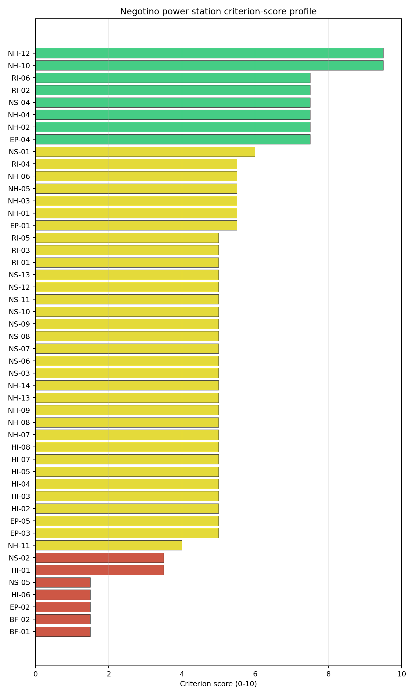
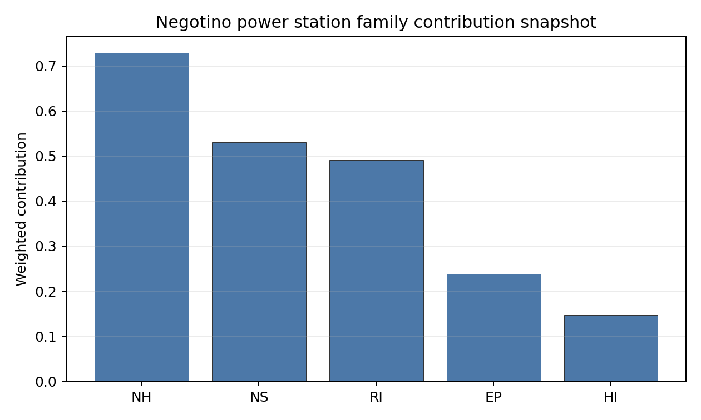

# Negotino power station Site Profile

Negotino power station is a coal/thermal site in North Macedonia that has been tested against the NuScale VOYGR-6 reference deployment envelope. This profile reads the screening evidence at a level that supports a decision to progress toward Stage 3 characterization. It is not a site-suitability determination, vendor recommendation, or licensing finding.

## Site Snapshot

| Field | Value |
| --- | --- |
| Site name | Negotino power station |
| Coordinates | 41.4833, 22.1000 |
| Subnational unit | Negotino |
| Installed thermal capacity (source data) | 300 MW |
| Composite score (baseline weights) | 4.899 (3.828-5.313 MC band) |
| National stability band | H (top-10% hit rate 0%) |
| National rank | 2 |

_See the country status map in_ [North Macedonia Country Profile](../MK_country_prototype.md#country-status-map).

## Ownership and Coal-to-Nuclear Context

- **Government of North Macedonia** (100.00% share), headquartered in North Macedonia; immediate operator Elektrani na Severna Makedonija AD. Path: Government of North Macedonia  -> Elektrani na Severna Makedonija AD [100.0%] -> Negotino power station Unit II [100.0%]
- **Elektrani na Severna Makedonija AD** (100.00% share), headquartered in North Macedonia; immediate operator Elektrani na Severna Makedonija AD. Path: Elektrani na Severna Makedonija AD -> Negotino power station Unit II [100.0%]

Generating units on record: 1 cancelled.

## Natural Hazards (NH)

- **Seismic: Ground Motion (NH-01)** - score 5.5/10 (MC 5.0-6.0), weight 0.0396, data quality high. Evidence: PGA at 475-year return period 0.219 g; PGA at 2,475-year return period 0.481 g; Vs30 reference (m/s): 760.0.
- **Seismic: Surface Rupture (NH-02)** - score 7.5/10 (MC 7.0-8.0), weight n/a, data quality screening grade. Evidence: nearest mapped capable fault 17.7 km; fault slip rate 0.224 mm/yr; fault name: MKCF00B.
- **Geotechnical: Liquefaction (NH-03)** - score 5.5/10 (MC 5.0-6.0), weight n/a, data quality medium. Evidence: liquefaction susceptibility: moderate; dominant soil type: loam.
- **Geotechnical: Slope Stability (NH-04)** - score 7.5/10 (MC 7.0-8.0), weight n/a, data quality screening grade. Evidence: site slope 7.63 deg; max slope in 1 km box 83.2 deg; slope stability class: moderate.
- **Geotechnical: Subsidence (NH-05)** - score 5.5/10 (MC 5.0-6.0), weight 0.0308, data quality medium. Evidence: karst present: no; karst severity: none.
- **Geotechnical: Foundation (NH-06)** - score 5.5/10 (MC 5.0-6.0), weight 0.0220, data quality medium. Evidence: bearing capacity 86.0 kPa; depth to bedrock 19.7 m.
- **Volcanism (NH-07)** - score 5.0/10 (MC 5.0-5.0), weight n/a, data quality high. Evidence: volcanic hazard class: negligible.
- **Coastal Flooding (NH-08)** - score 5.0/10 (MC 5.0-5.0), weight 0.0264, data quality low. Evidence: values not in measurement tables.
- **River Flooding (NH-09)** - score 5.0/10 (MC 5.0-5.0), weight 0.0352, data quality medium. Evidence: flood zone class: negligible.
- **Extreme Winds (NH-10)** - score 9.5/10 (MC 9.0-10.0), weight n/a, data quality medium. Evidence: design wind speed 7.39 m/s.
- **Extreme Precipitation (NH-11)** - score 4.0/10 (MC 4.0-4.0), weight 0.0132, data quality medium. Evidence: extreme daily precipitation 0.17 mm; mean annual precipitation 15.7 mm/yr.
- **Extreme Temperatures (NH-12)** - score 9.5/10 (MC 9.0-10.0), weight 0.0176, data quality medium. Evidence: extreme high temperature 28.4 deg C; extreme low temperature -3.77 deg C.
- **Forest/Wildfire (NH-13)** - score 5.0/10 (MC 5.0-5.0), weight 0.0132, data quality n/a. Evidence: values not in measurement tables.
- **Combined Hazards (NH-14)** - score 5.0/10 (MC 5.0-5.0), weight 0.0132, data quality n/a. Evidence: values not in measurement tables.

### Interpretation - Natural Hazards (NH)

<!-- specialist key=family_natural_hazards scope=site site_id=83d3abe4-2049-47ad-a66b-46034edb7569 bundle=MK_negotino_power_station_site_bundle.json status=filled by=cursor-agent filled_at=2026-05-03T16:55:37Z -->
Natural hazards at Negotino sit in a moderate-seismic Vardar-valley setting on the Negotinska-Reka tributary, with elevated but sub-threshold seismic loadings and the rest of the family in the middle-to-favourable band. **NH-01 Seismic: Ground Motion at 5.5/10** carries a 475-yr PGA of **0.219 g** and a 2,475-yr PGA of **0.481 g** — just below the 0.5 g project Phase-2 avoidance threshold but in the same Vardar Graben tectonic envelope as Bitola. The screening read sits on `high` data quality and clears both Phase 1 and Phase 2; a Stage 3 site-specific PSHA on measured Vs30 is still warranted to confirm the value against the southern-Vardar source zone, but the criterion is informational rather than binding. **NH-02 Seismic: Surface Rupture at 7.5/10** carries the nearest mapped capable fault (MKCF00B) at **17.7 km** with a slip rate of 0.224 mm/yr — comfortably outside the 8 km screening exclusion radius and the 5 km regulatory floor. **NH-04 Geotechnical: Slope Stability at 7.5/10** carries a mean site slope of **7.63°** and a maximum slope of **83.2° within 1 km of the site footprint** on a `moderate` slope-stability class — the Negotinska-Reka valley is incised against the surrounding ridges and the buildable envelope is constrained by the local topography, but the mean slope reads against the Stage 2 favourable threshold. NH-03 reads 5.5/10 with `moderate` liquefaction susceptibility on loam, NH-05 reads 5.5/10 with `karst not present`, and NH-06 reads 5.5/10 on a 86.0 kPa screening-proxy bearing capacity over 19.7 m to bedrock. Extreme meteorology is calm: a 50-yr design wind of 7.39 m/s and an extreme temperature range of -3.77 °C to 28.4 °C are well inside the project envelope (NH-10 and NH-12 at 9.5/10). NH-11 sits at 4.0/10 on the screening proxy. NH-07 reads 5.0/10 (`negligible` volcanic hazard), NH-08 (179 m elevation removes the coastal-flooding case) and NH-09 carry inconclusive avoidance verdicts. The Stage 3 priority order is therefore: commission a project-specific PSHA on measured Vs30 and the southern-Vardar source-zone characterisation so NH-01 settles on a defensible site-specific design-basis ground motion below the 0.5 g project envelope; commission a local hydrological survey on the Vardar and the Negotinska Reka to confirm the site flood envelope so NH-09 lifts off the inconclusive read; and run a topographic and CPT campaign on the buildable envelope so NH-04 settles against the constrained valley topography.
<!-- /specialist key=family_natural_hazards -->

## Human-Induced and Security-Relevant Hazards (HI)

- **Aircraft Crash (HI-01)** - score 3.5/10 (MC 3.0-4.0), weight 0.0308, data quality high. Evidence: nearest airport 6.34 km; nearest flight path 3.17 km; airports within search radius 2; airport name: Krivolak Airstrip; airport type: small_airport.
- **Industrial Explosions (HI-02)** - score 5.0/10 (MC 5.0-5.0), weight 0.0308, data quality screening grade. Evidence: values not in measurement tables.
- **Toxic/Gas Releases (HI-03)** - score 5.0/10 (MC 5.0-5.0), weight 0.0308, data quality screening grade. Evidence: values not in measurement tables.
- **External Fires (HI-04)** - score 5.0/10 (MC 5.0-5.0), weight 0.0264, data quality screening grade. Evidence: values not in measurement tables.
- **Transport Hazards (HI-05)** - score 5.0/10 (MC 5.0-5.0), weight 0.0264, data quality n/a. Evidence: values not in measurement tables.
- **Military Installations (HI-06)** - score 1.5/10 (MC 1.0-2.0), weight 0.0264, data quality medium. Evidence: nearest military installation 6.96 km; military installations within radius 2; installation name: Krivolak Trainig Area  KTA.
- **Electromagnetic Interference (HI-07)** - score 5.0/10 (MC 5.0-5.0), weight 0.0088, data quality medium. Evidence: nearest high-power transmitter 4.5 km; transmitters within radius 7; transmitter type: mast.
- **Other Nuclear Installations (HI-08)** - score 5.0/10 (MC 5.0-5.0), weight 0.0132, data quality n/a. Evidence: values not in measurement tables.

### Interpretation - Human-Induced and Security-Relevant Hazards (HI)

<!-- specialist key=family_human_hazards scope=site site_id=83d3abe4-2049-47ad-a66b-46034edb7569 bundle=MK_negotino_power_station_site_bundle.json status=filled by=cursor-agent filled_at=2026-05-03T16:55:37Z -->
Human-induced and security-relevant hazards at Negotino are dominated by the immediate Krivolak military training range to the east-south-east, with two binding screening flags that together make this the most adverse HI envelope of the first-batch cohort. **HI-06 Military Installations at 1.5/10** is the principal HI finding: the nearest military feature is the **Krivolak Training Area (KTA) at just 6.96 km from the site** — well inside the 8 km project A6 ammunition-storage and live-fire avoidance trigger — with 2 military features inside the screening radius. Krivolak is the principal military training range of the Republic of North Macedonia and is regularly used for live-fire exercises (including by NATO partners), which makes the 6.96 km screening read a binding security-relevant constraint rather than an informational one. The HI-06 1.5/10 score reflects this directly. **HI-01 Aircraft Crash at 3.5/10** carries the **Krivolak Airstrip (`small_airport`) at 6.34 km**, also inside the SSG-35 A1 10 km screening exclusion radius and inside the 4 km flight-path projection trigger (3.17 km nearest flight path); the Krivolak Airstrip is the airfield serving the training area and its operational profile is inseparable from the HI-06 finding. The airfield SSG-79 hazard assessment will need to be conducted jointly with the Ministry of National Defence rather than against the civilian-aviation regulator. **HI-02 Industrial Explosions, HI-03 Toxic / Gas Releases, HI-04 External Fires** all sit at the pass-mark default of 5.0/10 on `screening grade` data quality. **HI-05 Transport Hazards** holds at 5.0/10 (the M1 motorway and the Skopje–Athens rail corridor pass through the wider Vardar valley but the immediate site-cadastre is sparse). HI-07 reads 5.0/10 with the nearest broadcast feature at 4.5 km and **only 7 transmitters** inside the EMI search radius (the lightest broadcast environment of the first-batch cohort). HI-08 is null. The Stage 3 priority order is therefore: engage the North Macedonian Ministry of National Defence on the Krivolak Training Area to obtain the live-fire exercise envelope and any classified buffer requirements so HI-06 settles against an authoritative envelope (this is the binding HI question and may not be retirable through technical assessment alone — the proximity to a major active live-fire range is a structural national-security constraint); commission a joint civil-and-military SSG-79 aircraft-crash hazard assessment for the Krivolak Airstrip so HI-01 settles against the operational training-flight profile; and run the Seveso, hazmat-corridor, and external-fire cadastres so HI-02 to HI-05 lift off the screening default.
<!-- /specialist key=family_human_hazards -->

## Radiological Impact and Emergency Planning (RI / EP)

- **Emergency Planning Feasibility (EP-01)** - score 5.5/10 (MC 5.0-6.0), weight n/a, data quality high. Evidence: EP feasibility composite 52.5 /100; road sub-score 37.3 /100; special-population sub-score 90.0 /100; geography sub-score 95.0 /100; population sub-score 80.0 /100; evacuation feasible: yes.
- **Evacuation Routes (EP-02)** - score 1.5/10 (MC 1.0-2.0), weight 0.0264, data quality medium. Evidence: road density in EPZ 0.273 km/km2; road length in EPZ 536.1 km; motorway access: yes.
- **Physical Geography Constraints (EP-03)** - score 5.0/10 (MC 5.0-5.0), weight 0.0220, data quality medium. Evidence: waterways crossing EPZ 0; major river barrier: no.
- **Special Populations (EP-04)** - score 7.5/10 (MC 7.0-8.0), weight 0.0264, data quality medium. Evidence: hospitals in EPZ 5; prisons in EPZ 1; care homes in EPZ 0.
- **Concurrent Hazard Impact (EP-05)** - score 5.0/10 (MC 5.0-5.0), weight 0.0176, data quality n/a. Evidence: values not in measurement tables.
- **Atmospheric Dispersion (RI-01)** - score 5.0/10 (MC 5.0-5.0), weight 0.0264, data quality medium. Evidence: annual mean wind speed 0.6 m/s; atmospheric mixing height 580.5 m; prevailing wind direction: NW.
- **Surface Water Dispersion (RI-02)** - score 7.5/10 (MC 7.0-8.0), weight 0.0220, data quality n/a. Evidence: values not in measurement tables.
- **Groundwater Dispersion (RI-03)** - score 5.0/10 (MC 5.0-5.0), weight 0.0220, data quality medium. Evidence: aquifer type: low permeability.
- **Population Density at EPZ Radii (RI-04)** - score 5.5/10 (MC 5.0-6.0), weight 0.0352, data quality screening grade. Evidence: population density within 5 km 202.8 /km2; population density within 16 km 78.4 /km2; population density within 25 km 37.3 /km2; population density within 80 km 61.5 /km2; population within 25 km 73,257 people.
- **Distance to Population Centres (RI-05)** - score 5.0/10 (MC 5.0-5.0), weight 0.0441, data quality screening grade. Evidence: values not in measurement tables.
- **Population Projections (RI-06)** - score 7.5/10 (MC 7.0-8.0), weight 0.0220, data quality screening grade. Evidence: annual population growth rate -0.212 %/yr; projected population at 25 km in 60 yr 49,159 people.

### Interpretation - Radiological Impact and Emergency Planning (RI / EP)

<!-- specialist key=family_radiological_emergency scope=site site_id=83d3abe4-2049-47ad-a66b-46034edb7569 bundle=MK_negotino_power_station_site_bundle.json status=filled by=cursor-agent filled_at=2026-05-03T16:55:37Z -->
Radiological-impact and emergency-planning conditions at Negotino read favourably on dispersion and population, with EP-02 evacuation-route capacity the binding finding for the family. The DRV-02 emergency-planning composite reads **52.5/100 with `evacuation feasible: yes`**, supported by strong sub-scores on geography (95/100), special populations (90/100), and population (80/100), pulled down by a **road sub-score of 37.3/100** that drives the **EP-02 binding 1.5/10** score: road density inside the 16 km EPZ is just **0.273 km/km²** with 536.1 km of road length and motorway access available, but the cadastre is dominated by lower-grade rural roads — the same Pelagonian-style sparse-road pattern seen at Bitola. **EP-04 Special Populations at 7.5/10** carries 5 hospitals and 1 prison inside the EPZ; the prison is the binding special-population feature against the SSG-35 emergency-planning matrix. Population context is favourable for radiological impact: **5 km density 202.8 p/km² (the immediate Negotino town centre is inside the 5 km radius)**, dropping to 78.4 p/km² at 16 km, 37.3 p/km² at 25 km, and 61.5 p/km² at 80 km on a 25 km cumulative population of **73,257 people** — RI-04 reads 5.5/10. The 60-yr projection at 25 km is 49,159 people on a -0.212 %/yr growth track (the Vardar valley is depopulating), giving RI-06 a 7.5/10 score on a structural radiological-impact tailwind. The atmospheric envelope is calm: **0.6 m/s annual mean wind speed** (consistent with the sheltered Vardar-graben context, likely a sheltered-station artefact) with a **580.5 m mixing height** and an NW prevailing direction — RI-01 sits at 5.0/10 and the Stage 3 work should commission a project-specific micro-meteorological station for ≥ 12 months. **RI-02 Surface Water Dispersion at 7.5/10** is the strongest dispersion read of the family — the Vardar valley downstream of Negotino is a well-defined major-river hydraulic envelope. **RI-03 Groundwater Dispersion at 5.0/10** reads on a `low permeability` aquifer (the Vardar-valley basement is generally tight, in contrast to the alluvial Pelagonian basin at Bitola). RI-05 holds at 5.0/10 (`inconclusive`). EP-03 reads 5.0/10 (no major river barrier inside the EPZ — the Vardar runs alongside but does not cut the EPZ in two), and EP-05 sits at 5.0/10. The Stage 3 priority order is therefore: commission a 16 km EPZ road-network upgrade plan with the North Macedonian Ministry of Transport so EP-02 lifts off the 1.5/10 binding score; commission the project-specific micro-meteorological station so RI-01 settles on a measured wind rose against the Vardar-graben context; engage the Negotino regional emergency-planning authority on the prison and 5 hospitals inside the EPZ so EP-04 settles on a defensible operational evacuation plan; and commission a Stage 3 hydrogeological survey on the `low permeability` Vardar-valley aquifer so RI-03 settles on measured permeability and connectivity values.
<!-- /specialist key=family_radiological_emergency -->

## Non-Safety and Implementation Considerations (NS)

- **Grid Capacity Basic Filter (BF-01)** - score 1.5/10 (MC 1.0-2.0), weight 0.0352, data quality n/a. Evidence: values not in measurement tables.
- **Land Area Basic Filter (BF-02)** - score 1.5/10 (MC 1.0-2.0), weight 0.0220, data quality n/a. Evidence: values not in measurement tables.
- **Cooling Water Availability (NS-01)** - score 6.0/10 (MC 6.0-6.0), weight n/a, data quality screening grade. Evidence: distance to cooling source 2.26 km; cooling source flow 163.7 m3/s; cooling source type: major_river; cooling source name: Неготинска Река; water stress label: Low-Medium.
- **Grid Connection (NS-02)** - score 3.5/10 (MC 3.0-4.0), weight 0.0352, data quality medium. Evidence: nearest substation 0.61 km; nearest high-voltage line 2.1 km; highest nearby line voltage 110.0 kV; grid export capacity 165.0 MW; substations within radius 29; HV lines within radius 72.
- **Transport Access (NS-03)** - score 5.0/10 (MC 5.0-5.0), weight 0.0352, data quality low. Evidence: values not in measurement tables.
- **Site Topography (NS-04)** - score 7.5/10 (MC 7.0-8.0), weight 0.0264, data quality medium. Evidence: favourable land cover 62.6 %; moderate land cover 29.6 %; unfavourable land cover 7.8 %; favourable area 192.9 ha; dominant land class: 211.
- **Site Footprint Adequacy (NS-05)** - score 1.5/10 (MC 1.0-2.0), weight 0.0220, data quality medium. Evidence: buildable area 5.25 ha; largest contiguous patch 5.25 ha; buildable patch count 2.
- **Existing Infrastructure (NS-06)** - score 5.0/10 (MC 5.0-5.0), weight 0.0220, data quality n/a. Evidence: values not in measurement tables.
- **Environmental Impact (non-rad) (NS-07)** - score 5.0/10 (MC 5.0-5.0), weight 0.0220, data quality n/a. Evidence: values not in measurement tables.
- **Ecological Sensitivity (NS-08)** - score 5.0/10 (MC 5.0-5.0), weight n/a, data quality insufficient. Evidence: natural land cover 7.8 %; distance to nearest protected area 4.903 km; Natura 2000 sensitivity class: unknown; protected-area overlap: no; protected-area sensitivity class: low; Natura 2000 sites within 5 km: 0; nearest protected-area designation: Designated area not yet reviewed.
- **Socioeconomic Impact (NS-09)** - score 5.0/10 (MC 5.0-5.0), weight 0.0220, data quality n/a. Evidence: values not in measurement tables.
- **Workforce Availability (NS-10)** - score 5.0/10 (MC 5.0-5.0), weight 0.0176, data quality n/a. Evidence: values not in measurement tables.
- **Coal-to-Nuclear Synergies (NS-11)** - score 5.0/10 (MC 5.0-5.0), weight 0.0264, data quality n/a. Evidence: values not in measurement tables.
- **Regulatory/Political Environment (NS-12)** - score 5.0/10 (MC 5.0-5.0), weight 0.0264, data quality n/a. Evidence: values not in measurement tables.
- **Construction Logistics (NS-13)** - score 5.0/10 (MC 5.0-5.0), weight 0.0176, data quality n/a. Evidence: values not in measurement tables.

### Interpretation - Non-Safety and Implementation Considerations (NS)

<!-- specialist key=family_infrastructure scope=site site_id=83d3abe4-2049-47ad-a66b-46034edb7569 bundle=MK_negotino_power_station_site_bundle.json status=filled by=cursor-agent filled_at=2026-05-03T16:55:37Z -->
Non-safety and implementation conditions at Negotino are dominated by two binding screening flags on grid capacity and buildable footprint, with the cooling-water inheritance the only structural strength of the family. **NS-02 Grid Connection at 3.5/10** is the principal NS finding: the nearest substation is 0.61 km from the site and the nearest high-voltage line is 2.1 km away, but the **highest nearby line voltage is 110 kV** (the lowest project transmission tier) and the measured **grid export capacity is just 165 MW** — well below the NuScale VOYGR-6 reference SMR net rating of approximately 462 MWe (and below the avoidance threshold for transmission ≥ reference SMR net MWe within feasible distance). The existing 300 MW Negotino thermal complex is connected at 110 kV, and an SMR deployment would require either a major substation upgrade to 220 kV / 400 kV or a new 30+ km 400 kV line to the Macedonian backbone — both substantial transmission investments that change the brownfield-inheritance economics materially. **NS-05 Site Footprint Adequacy at 1.5/10** is the second binding flag: the buildable area is just **5.25 ha as the largest contiguous patch** across 2 patches (well below the 14 ha A15 contiguous-industrial-land avoidance threshold) — the existing 300 MW thermal complex footprint cannot accommodate the VOYGR-6 deployment envelope without significant land acquisition outside the brownfield perimeter, which removes most of the brownfield inheritance argument. The basic-filter scores reflect the same constraints: **BF-01 Grid Capacity Basic Filter at 1.5/10** (the 165 MW grid export capacity is inadequate for the reference SMR rating) and **BF-02 Land Area Basic Filter at 1.5/10** (the buildable footprint is below the project basic threshold). **NS-01 Cooling Water Availability at 6.0/10** is the only structural strength of the family: the cooling source is a `major_river` at 2.26 km with a measured flow of **163.7 m³/s** (the Vardar / Negotinska-Reka system is one of the larger Macedonian hydrological envelopes) on a `Low-Medium` water-stress label — direct cooling-water inheritance is straightforward. **NS-04 Site Topography at 7.5/10** carries 62.6% favourable land cover, 29.6% moderate, and 7.8% unfavourable on 192.9 ha of favourable area in the wider site environs — the topographic envelope is healthy, but the small NS-05 contiguous patch is the binding gating constraint. **NS-08 Ecological Sensitivity at 5.0/10** carries `insufficient` data quality with the nearest protected area at **4.903 km** (a designated area not yet reviewed in the screening cadastre); the Stage 3 ecological survey should engage the North Macedonian Ministry of Environment for a site-specific Emerald Network screen. NS-03, NS-06, NS-07, NS-09 to NS-13 sit at the pass-mark default of 5.0/10. The Stage 3 priority order is therefore: scope the transmission upgrade required to lift the grid-export capacity from 165 MW to ≥ 462 MWe (the reference SMR envelope) so NS-02 and BF-01 lift off their binding flags — this is the economic-feasibility question for the site; survey the wider Negotino site cadastre for additional contiguous industrial land outside the existing thermal complex so NS-05 and BF-02 lift off their binding flags; commission the Emerald Network protected-area screen so NS-08 lifts off the `insufficient` read; and run the construction-logistics, workforce, and regulatory surveys so NS-09 to NS-13 settle on defensible measured values.
<!-- /specialist key=family_infrastructure -->

## Composite Score and Stability

Baseline composite score is 4.899, bracketed by Monte Carlo at 3.828-5.313. National stability band is `H` with a top-10% hit rate of 0% across 16 scored Monte Carlo scenarios.

<!-- specialist key=stability scope=site site_id=83d3abe4-2049-47ad-a66b-46034edb7569 bundle=MK_negotino_power_station_site_bundle.json status=filled by=cursor-agent filled_at=2026-05-03T16:55:37Z -->
Negotino's composite of **4.899 (Monte Carlo 3.828–5.313)** lands well below the avoidance Pareto frontier and reflects the cumulative drag of the binding NS-02 grid-capacity, NS-05 buildable-footprint, and HI-06 military-proximity flags: the **national stability band is `H`** with a top-10% hit rate of **0% across 16 scored Monte Carlo scenarios** and a top-5% rate also at 0% — the score is structurally low under all explored Monte Carlo perturbations, with no plausible parameter set under which Negotino moves into the national top-tier candidate pool. The composite is anchored by RI-05 distance to population centres (contribution 0.221), NH-01 seismic ground motion (contribution 0.218 from a 5.5/10 score at the largest natural-hazard weight), EP-04 special populations (0.198), NS-04 site topography (0.198), RI-04 population density at EPZ radii (0.194), and NH-09 river flooding (0.176). The drag features are concentrated and structurally binding rather than measurement-grade: BF-01 Grid Capacity (1.5/10), BF-02 Land Area (1.5/10), EP-02 Evacuation Routes (1.5/10), HI-06 Military Installations (1.5/10), NS-05 Site Footprint (1.5/10), HI-01 Aircraft Crash (3.5/10), and NS-02 Grid Connection (3.5/10). The regional band is also `H`. The plain-English read is that Negotino is a **structurally constrained brownfield SMR candidate** — the cooling-water inheritance from the Vardar / Negotinska-Reka system is genuine, the population context is favourable for radiological impact, and the 0.481 g seismic loading sits just below the Phase-2 caution — but the small 5.25 ha contiguous footprint, the 110 kV / 165 MW grid envelope, and the 6.96 km proximity to the Krivolak military training range together make this a site that does not survive the avoidance screen on multiple binding axes. The Stage 3 work would need to retire the buildable-footprint, grid-capacity, and military-proximity flags simultaneously, which is a substantial programme-of-work commitment for a site that ends at MC-band H. The recommended use of the Negotino entry in the regional cohort is as a comparison case in the consolidated failure section rather than as a national reference candidate; the Bitola entry is the unambiguous North Macedonian SMR candidate.
<!-- /specialist key=stability -->

## Residual Risk Register

<!-- specialist key=residual_risk scope=site site_id=83d3abe4-2049-47ad-a66b-46034edb7569 bundle=MK_negotino_power_station_site_bundle.json status=filled by=cursor-agent filled_at=2026-05-03T16:55:37Z -->
| Criterion | Description | Owner | Resolution path |
| --- | --- | --- | --- |
| HI-06 Military Installations | Krivolak Training Area at 6.96 km — inside 8 km A6 trigger; major active live-fire range with NATO partner exercises. | Security/Safety | Engagement with Ministry of National Defence to obtain live-fire envelope and any classified buffer; structural national-security constraint that may not be retirable through technical assessment. |
| HI-01 Aircraft Crash | Krivolak Airstrip at 6.34 km inside SSG-35 A1 10 km screening exclusion radius. | Security/Safety | Joint civil-and-military SSG-79 aircraft-crash hazard assessment with explicit modelling of the Krivolak training-flight profile. |
| NS-02 Grid Connection | Highest nearby line voltage 110 kV; grid export capacity 165 MW (well below ≈ 462 MWe reference). | Grid/Transmission | Scope substation upgrade to 220 kV / 400 kV or new HV line to Macedonian backbone; transmission-economics question for the site. |
| NS-05 Site Footprint Adequacy | Largest contiguous patch 5.25 ha across 2 patches; below 14 ha A15 contiguous-industrial-land threshold. | Site Engineering | Survey wider Negotino site cadastre for additional contiguous industrial land outside the existing thermal complex; assess feasibility of land acquisition. |
| NH-01 Seismic Ground Motion | PGA(2,475-yr) 0.481 g — just below 0.5 g Phase-2 caution but in the southern-Vardar source zone. | Geotechnical | Project-specific PSHA on measured Vs30 and southern-Vardar source-zone characterisation. |
| EP-02 Evacuation Routes | EPZ road density 0.273 km/km² with road sub-score 37.3/100; binding 1.5/10 reflects sparse rural-road network. | Emergency Planning | EPZ road-network upgrade plan with North Macedonian Ministry of Transport. |
| NS-08 Ecological Sensitivity | `Insufficient` data quality with nearest protected area at 4.9 km (designated area not yet reviewed in screening cadastre). | Environmental | Site-specific Emerald Network and national-protected-area screen via Ministry of Environment. |
| NH-09 River Flooding | Flood envelope on the Vardar and Negotinska Reka is `inconclusive` on the screening proxy. | Hydrology | Local hydrological survey on the Vardar and the Negotinska Reka tributary against design return periods. |
| RI-01 Atmospheric Dispersion | Annual mean wind speed 0.6 m/s with 580.5 m mixing height; consistent with sheltered Vardar-graben context. | Radiological | Project-specific micro-meteorological station (≥ 12 months) to establish actual wind rose. |
<!-- /specialist key=residual_risk -->

## Stage 3 Follow-Up Checklist

- [ ] Resolve **Aircraft Crash (HI-01)** avoidance flag - measured {"nearest_airport_km": 6.34, "nearest_airport_type": "small_airport"} vs threshold A1 — SSG-35: general-aviation / small airport < 10 km..
- [ ] Resolve **Aircraft Crash (HI-01)** avoidance flag - measured {"flight_path_distance_km": 3.17, "under_flight_path": false} vs threshold A4 — SSG-35: flight-path overhead / < 4 km from airway..
- [ ] Resolve **Grid Connection (NS-02)** avoidance flag - measured {"grid_export_capacity_mw": 165.0} vs threshold Project A13: transmission >= reference SMR net MWe within feasible distance..
- [ ] Resolve **Site Footprint Adequacy (NS-05)** avoidance flag - measured {"largest_contiguous_ha": 5.25} vs threshold Project A15: >= 14 ha contiguous industrial land..
- [ ] Re-measure **Grid Capacity Basic Filter (BF-01)** - native score 1.5/10 with confidence insufficient.
- [ ] Re-measure **Land Area Basic Filter (BF-02)** - native score 1.5/10 with confidence insufficient.
- [ ] Re-measure **Evacuation Routes (EP-02)** - native score 1.5/10 with confidence medium.
- [ ] Re-measure **Military Installations (HI-06)** - native score 1.5/10 with confidence medium.
- [ ] Re-measure **Site Footprint Adequacy (NS-05)** - native score 1.5/10 with confidence medium.
- [ ] Improve data quality for **Geotechnical: Subsidence & Collapse (NH-05b)** - current flag `low`.
- [ ] Improve data quality for **Coastal Flooding (NH-08)** - current flag `low`.
- [ ] Improve data quality for **Transport Access (NS-03)** - current flag `low`.

## Evidence Limitations

- Geotechnical: Subsidence & Collapse (NH-05b) - quality `low`.
- Coastal Flooding (NH-08) - quality `low`.
- Transport Access (NS-03) - quality `low`.
