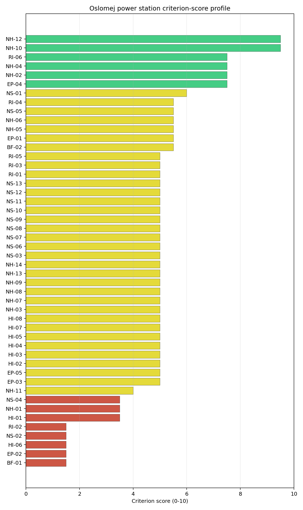
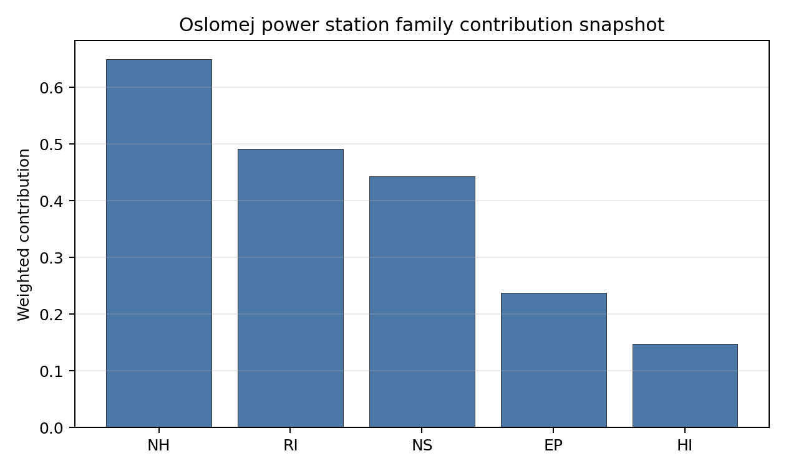

# Oslomej power station Site Profile

Oslomej power station is a coal/thermal site in North Macedonia that has been tested against the NuScale VOYGR-6 reference deployment envelope. This profile reads the screening evidence at a level that supports a decision to progress toward Stage 3 characterization. It is not a site-suitability determination, vendor recommendation, or licensing finding.

## Site Snapshot

| Field | Value |
| --- | --- |
| Site name | Oslomej power station |
| Coordinates | 41.5821, 21.0003 |
| Subnational unit | Kičevo |
| Installed thermal capacity (source data) | 254 MW |
| Composite score (baseline weights) | 4.515 (3.661-4.929 MC band) |
| National stability band | H (top-10% hit rate 0%) |
| National rank | 3 |

_See the country status map in_ [North Macedonia Country Profile](../MK_country_prototype.md#country-status-map).

## Ownership and Coal-to-Nuclear Context

- **Government of North Macedonia** (100.00% share), headquartered in North Macedonia; immediate operator Elektrani na Severna Makedonija AD. Path: Government of North Macedonia  -> Elektrani na Severna Makedonija AD [100.0%] -> Oslomej power station Reconstruction [100.0%]
- **Elektrani na Severna Makedonija AD** (100.00% share), headquartered in North Macedonia; immediate operator Elektrani na Severna Makedonija AD. Path: Elektrani na Severna Makedonija AD -> Oslomej power station Reconstruction [100.0%]

Generating units on record: 1 cancelled, 1 operating.
Earliest unit commissioning: 1980; most recent: 1980.

## Natural Hazards (NH)

- **Seismic: Ground Motion (NH-01)** - score 3.5/10 (MC 3.0-4.0), weight 0.0396, data quality high. Evidence: PGA at 475-year return period 0.346 g; PGA at 2,475-year return period 0.727 g; Vs30 reference (m/s): 760.0.
- **Seismic: Surface Rupture (NH-02)** - score 7.5/10 (MC 7.0-8.0), weight n/a, data quality screening grade. Evidence: nearest mapped capable fault 11.4 km; fault slip rate 0.2 mm/yr; fault name: MKCF005.
- **Geotechnical: Liquefaction (NH-03)** - score 5.0/10 (MC 5.0-5.0), weight n/a, data quality medium. Evidence: liquefaction susceptibility: very_low; dominant soil type: loam.
- **Geotechnical: Slope Stability (NH-04)** - score 7.5/10 (MC 7.0-8.0), weight n/a, data quality screening grade. Evidence: site slope 9.92 deg; max slope in 1 km box 88.0 deg; slope stability class: moderate.
- **Geotechnical: Subsidence (NH-05)** - score 5.5/10 (MC 5.0-6.0), weight 0.0308, data quality medium. Evidence: karst present: no; karst severity: moderate; formation type: carbonate (Discontinuous carbonate rocks).
- **Geotechnical: Foundation (NH-06)** - score 5.5/10 (MC 5.0-6.0), weight 0.0220, data quality medium. Evidence: bearing capacity 86.0 kPa; depth to bedrock 22.8 m.
- **Volcanism (NH-07)** - score 5.0/10 (MC 5.0-5.0), weight n/a, data quality high. Evidence: volcanic hazard class: negligible.
- **Coastal Flooding (NH-08)** - score 5.0/10 (MC 5.0-5.0), weight 0.0264, data quality low. Evidence: values not in measurement tables.
- **River Flooding (NH-09)** - score 5.0/10 (MC 5.0-5.0), weight 0.0352, data quality medium. Evidence: flood zone class: negligible.
- **Extreme Winds (NH-10)** - score 9.5/10 (MC 9.0-10.0), weight n/a, data quality medium. Evidence: design wind speed 7.84 m/s.
- **Extreme Precipitation (NH-11)** - score 4.0/10 (MC 4.0-4.0), weight 0.0132, data quality medium. Evidence: extreme daily precipitation 0.19 mm; mean annual precipitation 24.1 mm/yr.
- **Extreme Temperatures (NH-12)** - score 9.5/10 (MC 9.0-10.0), weight 0.0176, data quality medium. Evidence: extreme high temperature 22.2 deg C; extreme low temperature -7.9 deg C.
- **Forest/Wildfire (NH-13)** - score 5.0/10 (MC 5.0-5.0), weight 0.0132, data quality n/a. Evidence: values not in measurement tables.
- **Combined Hazards (NH-14)** - score 5.0/10 (MC 5.0-5.0), weight 0.0132, data quality n/a. Evidence: values not in measurement tables.

### Interpretation - Natural Hazards (NH)

<!-- specialist key=family_natural_hazards scope=site site_id=756218bb-3f16-443e-b6c6-400cd0ce2f87 bundle=MK_oslomej_power_station_site_bundle.json status=filled by=cursor-agent filled_at=2026-05-03T16:59:55Z -->
Natural hazards at Oslomej sit in the most adverse seismic envelope of the first-batch cohort, with a binding **NH-01 caution at 3.5/10**: a 475-yr PGA of **0.346 g** and a 2,475-yr PGA of **0.727 g** — well above the 0.5 g project Phase-2 avoidance threshold and the highest seismic loading of the Macedonian portfolio (above Bitola at 0.544 g and Negotino at 0.481 g). The reading reflects the active western-Macedonian Šar / Pelagonian-rim seismotectonic envelope where Oslomej sits in the Kičevo basin against the Bistra and Suva Gora ranges, and a Stage 3 site-specific PSHA on measured Vs30 and refined source-zone modelling has limited headroom to lift NH-01 below the 0.5 g project envelope (in contrast to Bitola where the 0.544 g read sits much closer to the threshold). **NH-02 Seismic: Surface Rupture at 7.5/10** carries the nearest mapped capable fault (MKCF005) at **11.4 km** with a slip rate of 0.2 mm/yr, comfortably outside the 8 km screening exclusion radius. **NH-04 Geotechnical: Slope Stability at 7.5/10** carries a mean site slope of **9.92°** and a maximum slope of **88° within 1 km** on a `moderate` slope-stability class — the Kičevo basin is incised against the surrounding ranges and the buildable envelope is constrained by the local topography. **NH-05 Geotechnical: Subsidence at 5.5/10** carries a `moderate` karst severity in a `discontinuous carbonate rocks` formation type — the Western-Macedonian carbonate envelope reaches into the Oslomej catchment and Stage 3 subsidence assessment will require karst-specific geophysical and borehole work. NH-03 reads 5.0/10 with `very low` liquefaction susceptibility on loam, and NH-06 reads 5.5/10 on a 86.0 kPa screening-proxy bearing capacity over 22.8 m to bedrock. Extreme meteorology is calm: a 50-yr design wind of 7.84 m/s and an extreme temperature range of -7.9 °C to 22.2 °C are well inside the project envelope (NH-10 and NH-12 at 9.5/10). NH-11 sits at 4.0/10 on the screening proxy. NH-07 reads 5.0/10 (`negligible` volcanic hazard); NH-08 (698 m site elevation removes the coastal-flooding case) and NH-09 carry inconclusive avoidance verdicts. The Stage 3 priority order is therefore: commission a project-specific PSHA on measured Vs30 and refined western-Macedonian source-zone modelling so NH-01 settles on a defensible site-specific design-basis ground motion (the 0.727 g screening read may not lift below the 0.5 g threshold and the criterion may remain a binding caution after Stage 3); commission a karst-specific geophysical and borehole campaign so NH-05 settles against the discontinuous-carbonate setting; and commission a CPT campaign so NH-03 settles on a measured liquefaction-susceptibility value rather than the screening proxy.
<!-- /specialist key=family_natural_hazards -->

## Human-Induced and Security-Relevant Hazards (HI)

- **Aircraft Crash (HI-01)** - score 3.5/10 (MC 3.0-4.0), weight 0.0308, data quality high. Evidence: nearest airport 7.41 km; nearest flight path 7.41 km; airports within search radius 1; airport name: Kičevo Military Barracks Heliport; airport type: heliport.
- **Industrial Explosions (HI-02)** - score 5.0/10 (MC 5.0-5.0), weight 0.0308, data quality screening grade. Evidence: values not in measurement tables.
- **Toxic/Gas Releases (HI-03)** - score 5.0/10 (MC 5.0-5.0), weight 0.0308, data quality screening grade. Evidence: values not in measurement tables.
- **External Fires (HI-04)** - score 5.0/10 (MC 5.0-5.0), weight 0.0264, data quality screening grade. Evidence: values not in measurement tables.
- **Transport Hazards (HI-05)** - score 5.0/10 (MC 5.0-5.0), weight 0.0264, data quality n/a. Evidence: values not in measurement tables.
- **Military Installations (HI-06)** - score 1.5/10 (MC 1.0-2.0), weight 0.0264, data quality medium. Evidence: nearest military installation 7.33 km; military installations within radius 3.
- **Electromagnetic Interference (HI-07)** - score 5.0/10 (MC 5.0-5.0), weight 0.0088, data quality medium. Evidence: nearest high-power transmitter 1.44 km; transmitters within radius 14; transmitter type: communication.
- **Other Nuclear Installations (HI-08)** - score 5.0/10 (MC 5.0-5.0), weight 0.0132, data quality n/a. Evidence: values not in measurement tables.

### Interpretation - Human-Induced and Security-Relevant Hazards (HI)

<!-- specialist key=family_human_hazards scope=site site_id=756218bb-3f16-443e-b6c6-400cd0ce2f87 bundle=MK_oslomej_power_station_site_bundle.json status=filled by=cursor-agent filled_at=2026-05-03T16:59:55Z -->
Human-induced and security-relevant hazards at Oslomej are dominated by the immediate Kičevo military estate to the west, with two binding screening flags that mirror the Negotino HI envelope. **HI-06 Military Installations at 1.5/10** is the principal HI finding: the nearest military feature is at **7.33 km** with **3 features inside the 25 km screening radius** — well inside the 8 km project A6 ammunition-storage and live-fire avoidance trigger. The proximity to the Kičevo military estate is the same structural-security-relevant constraint that drives the HI-06 read at Negotino. **HI-01 Aircraft Crash at 3.5/10** carries the **Kičevo Military Barracks Heliport at 7.41 km** (with the nearest flight-path projection also at 7.41 km), inside the SSG-35 A1 10 km screening exclusion radius for general-aviation airfields under 10 km. Heliports have a different SSG-79 hazard profile to fixed-wing airstrips (lower-energy operations and smaller traffic volumes), but the screening flag still requires a project-specific assessment, and the airfield is operationally inseparable from the HI-06 military finding. **HI-02 Industrial Explosions, HI-03 Toxic / Gas Releases, HI-04 External Fires** all sit at the pass-mark default of 5.0/10 on `screening grade` data quality. **HI-05 Transport Hazards** holds at 5.0/10 — the wider Kičevo road and rail corridors carry routine logistics flows but the immediate site cadastre is sparse on the hazmat-corridor screen. HI-07 reads 5.0/10 with the nearest broadcast feature at 1.44 km (a communication mast) and **14 transmitters** inside the EMI search radius (the lightest after Negotino in the Macedonian portfolio). HI-08 is null. The Stage 3 priority order is therefore: engage the Ministry of National Defence on the Kičevo military estate to obtain the operational envelope and any classified buffer requirements so HI-06 settles against an authoritative envelope (the same structural-security question as Negotino); commission a joint civil-and-military SSG-79 helicopter-crash hazard assessment for the Kičevo Military Barracks Heliport so HI-01 settles against the operational training-flight profile; and run the Seveso, hazmat-corridor, and external-fire cadastres so HI-02 to HI-05 lift off the screening default.
<!-- /specialist key=family_human_hazards -->

## Radiological Impact and Emergency Planning (RI / EP)

- **Emergency Planning Feasibility (EP-01)** - score 5.5/10 (MC 5.0-6.0), weight n/a, data quality high. Evidence: EP feasibility composite 52.5 /100; road sub-score 28.8 /100; special-population sub-score 90.0 /100; geography sub-score 95.0 /100; population sub-score 80.0 /100; evacuation feasible: yes.
- **Evacuation Routes (EP-02)** - score 1.5/10 (MC 1.0-2.0), weight 0.0264, data quality medium. Evidence: road density in EPZ 0.188 km/km2; road length in EPZ 368.9 km; motorway access: yes.
- **Physical Geography Constraints (EP-03)** - score 5.0/10 (MC 5.0-5.0), weight 0.0220, data quality medium. Evidence: waterways crossing EPZ 0; major river barrier: no.
- **Special Populations (EP-04)** - score 7.5/10 (MC 7.0-8.0), weight 0.0264, data quality medium. Evidence: hospitals in EPZ 7; prisons in EPZ 0; care homes in EPZ 0.
- **Concurrent Hazard Impact (EP-05)** - score 5.0/10 (MC 5.0-5.0), weight 0.0176, data quality n/a. Evidence: values not in measurement tables.
- **Atmospheric Dispersion (RI-01)** - score 5.0/10 (MC 5.0-5.0), weight 0.0264, data quality medium. Evidence: annual mean wind speed 0.59 m/s; atmospheric mixing height 445.5 m; prevailing wind direction: NNW.
- **Surface Water Dispersion (RI-02)** - score 1.5/10 (MC 1.0-2.0), weight 0.0220, data quality n/a. Evidence: values not in measurement tables.
- **Groundwater Dispersion (RI-03)** - score 5.0/10 (MC 5.0-5.0), weight 0.0220, data quality medium. Evidence: aquifer type: alluvial.
- **Population Density at EPZ Radii (RI-04)** - score 5.5/10 (MC 5.0-6.0), weight 0.0352, data quality screening grade. Evidence: population density within 5 km 181.2 /km2; population density within 16 km 74.3 /km2; population density within 25 km 56.9 /km2; population density within 80 km 95.8 /km2; population within 25 km 111,730 people.
- **Distance to Population Centres (RI-05)** - score 5.0/10 (MC 5.0-5.0), weight 0.0441, data quality screening grade. Evidence: values not in measurement tables.
- **Population Projections (RI-06)** - score 7.5/10 (MC 7.0-8.0), weight 0.0220, data quality screening grade. Evidence: annual population growth rate -0.047 %/yr; projected population at 25 km in 60 yr 74,984 people.

### Interpretation - Radiological Impact and Emergency Planning (RI / EP)

<!-- specialist key=family_radiological_emergency scope=site site_id=756218bb-3f16-443e-b6c6-400cd0ce2f87 bundle=MK_oslomej_power_station_site_bundle.json status=filled by=cursor-agent filled_at=2026-05-03T16:59:55Z -->
Radiological-impact and emergency-planning conditions at Oslomej carry the weakest road-network and surface-water-dispersion reads of the Macedonian portfolio, with binding flags on EP-02 evacuation routes and RI-02 surface-water dispersion. The DRV-02 emergency-planning composite reads **52.5/100 with `evacuation feasible: yes`**, supported by strong sub-scores on geography (95/100), special populations (90/100), and population (80/100), pulled down by the **lowest road sub-score in the Macedonian portfolio at 28.8/100** (Bitola 38.1, Negotino 37.3) — the Kičevo basin road network has a density of **0.188 km/km² inside the 16 km EPZ** (compared to 0.281 at Bitola and 0.273 at Negotino) on just 368.9 km of road length, driving the **EP-02 binding 1.5/10** score. **EP-04 Special Populations at 7.5/10** carries 7 hospitals inside the EPZ with no prisons or care homes — the prison-free EPZ is the only Macedonian site without the prison special-population feature. Population context is favourable for radiological impact: **5 km density 181.2 p/km² (Kičevo town centre is just outside the 5 km radius)**, dropping to 74.3 p/km² at 16 km, 56.9 p/km² at 25 km, and 95.8 p/km² at 80 km on a 25 km cumulative population of **111,730 people** — RI-04 reads 5.5/10. The 60-yr projection at 25 km is 74,984 people on a -0.047 %/yr growth track (the lightest depopulation trajectory of the Macedonian portfolio); RI-06 reads 7.5/10. **RI-02 Surface Water Dispersion at 1.5/10** is the second binding flag of the family: the cooling source is the small Темница river (see NS-01) which provides limited dilution capacity for any routine liquid effluent — Stage 3 surface-water dispersion modelling will need to characterise the seasonal flow regime and the dispersion envelope at low summer flows. The atmospheric envelope is calm: **0.59 m/s annual mean wind speed** (consistent with the sheltered Kičevo-basin context) with a **445 m mixing height** (the lowest mixing height of the Macedonian portfolio, reflecting the basin floor at 698 m elevation) and an NNW prevailing direction; RI-01 sits at 5.0/10. RI-03 reads 5.0/10 on an alluvial Kičevo-basin aquifer. RI-05 holds at 5.0/10 (`inconclusive`). EP-03 reads 5.0/10 (no major river barrier inside the EPZ), and EP-05 sits at 5.0/10. The Stage 3 priority order is therefore: commission a 16 km EPZ road-network upgrade plan with the North Macedonian Ministry of Transport so EP-02 lifts off the 1.5/10 binding score (the Kičevo basin has the most road-deficient EPZ of the Macedonian portfolio); commission a Stage 3 surface-water dispersion model on the Темница river so RI-02 lifts off the 1.5/10 binding score (the small-river cooling-source envelope is a structural radiological-impact constraint); commission the project-specific micro-meteorological station so RI-01 settles against the constrained Kičevo-basin envelope; and engage the regional emergency-planning authority on the 7 hospitals inside the EPZ so EP-04 settles on a defensible operational evacuation plan.
<!-- /specialist key=family_radiological_emergency -->

## Non-Safety and Implementation Considerations (NS)

- **Grid Capacity Basic Filter (BF-01)** - score 1.5/10 (MC 1.0-2.0), weight 0.0352, data quality n/a. Evidence: values not in measurement tables.
- **Land Area Basic Filter (BF-02)** - score 5.5/10 (MC 5.0-6.0), weight 0.0220, data quality n/a. Evidence: values not in measurement tables.
- **Cooling Water Availability (NS-01)** - score 6.0/10 (MC 6.0-6.0), weight n/a, data quality screening grade. Evidence: distance to cooling source 3.55 km; cooling source flow 2.97 m3/s; cooling source type: small_river; cooling source name: Темница; water stress label: Low-Medium.
- **Grid Connection (NS-02)** - score 1.5/10 (MC 1.0-2.0), weight 0.0352, data quality medium. Evidence: nearest substation 0.46 km; nearest high-voltage line 4.09 km; highest nearby line voltage 110.0 kV; grid export capacity 125.0 MW; substations within radius 34; HV lines within radius 44.
- **Transport Access (NS-03)** - score 5.0/10 (MC 5.0-5.0), weight 0.0352, data quality low. Evidence: values not in measurement tables.
- **Site Topography (NS-04)** - score 3.5/10 (MC 3.0-4.0), weight 0.0264, data quality medium. Evidence: favourable land cover 23.9 %; moderate land cover 51.1 %; unfavourable land cover 24.9 %; favourable area 51.2 ha; dominant land class: 321.
- **Site Footprint Adequacy (NS-05)** - score 5.5/10 (MC 5.0-6.0), weight 0.0220, data quality high. Evidence: buildable area 18.8 ha; largest contiguous patch 18.8 ha; buildable patch count 7.
- **Existing Infrastructure (NS-06)** - score 5.0/10 (MC 5.0-5.0), weight 0.0220, data quality n/a. Evidence: values not in measurement tables.
- **Environmental Impact (non-rad) (NS-07)** - score 5.0/10 (MC 5.0-5.0), weight 0.0220, data quality n/a. Evidence: values not in measurement tables.
- **Ecological Sensitivity (NS-08)** - score 5.0/10 (MC 5.0-5.0), weight n/a, data quality insufficient. Evidence: natural land cover 24.9 %; distance to nearest protected area 13.8 km; Natura 2000 sensitivity class: unknown; protected-area overlap: no; protected-area sensitivity class: low; Natura 2000 sites within 5 km: 0; nearest protected-area designation: Designated area not yet reviewed.
- **Socioeconomic Impact (NS-09)** - score 5.0/10 (MC 5.0-5.0), weight 0.0220, data quality n/a. Evidence: values not in measurement tables.
- **Workforce Availability (NS-10)** - score 5.0/10 (MC 5.0-5.0), weight 0.0176, data quality n/a. Evidence: values not in measurement tables.
- **Coal-to-Nuclear Synergies (NS-11)** - score 5.0/10 (MC 5.0-5.0), weight 0.0264, data quality n/a. Evidence: values not in measurement tables.
- **Regulatory/Political Environment (NS-12)** - score 5.0/10 (MC 5.0-5.0), weight 0.0264, data quality n/a. Evidence: values not in measurement tables.
- **Construction Logistics (NS-13)** - score 5.0/10 (MC 5.0-5.0), weight 0.0176, data quality n/a. Evidence: values not in measurement tables.

### Interpretation - Non-Safety and Implementation Considerations (NS)

<!-- specialist key=family_infrastructure scope=site site_id=756218bb-3f16-443e-b6c6-400cd0ce2f87 bundle=MK_oslomej_power_station_site_bundle.json status=filled by=cursor-agent filled_at=2026-05-03T16:59:55Z -->
Non-safety and implementation conditions at Oslomej carry the most adverse grid-and-cooling envelope of the Macedonian portfolio: a 110 kV / 125 MW grid inheritance, a 2.97 m³/s small-river cooling source, and screening-grade gaps on land cover. **NS-02 Grid Connection at 1.5/10** is the principal NS finding: the nearest substation is 0.46 km from the site and the nearest high-voltage line is 4.09 km away, but the **highest nearby line voltage is 110 kV** and the measured **grid export capacity is just 125 MW** — the lowest grid-export envelope of the Macedonian portfolio (Bitola 699 MW at 400 kV, Negotino 165 MW at 110 kV) and well below the NuScale VOYGR-6 reference SMR net rating of approximately 462 MWe. An SMR deployment at Oslomej would require either a major substation upgrade and a new 30+ km 220 kV / 400 kV line to the Macedonian backbone or a consolidated grid-build plan against a wider regional cohort; the brownfield grid-inheritance argument is materially weaker than at Bitola. **BF-01 Grid Capacity Basic Filter at 1.5/10** reflects the same constraint. **NS-01 Cooling Water Availability at 6.0/10** is the second binding constraint: the cooling source is the **small Темница river** at 3.55 km with a measured flow of just **2.97 m³/s** (compared to 22.9 m³/s on the Crna Reka at Bitola and 163.7 m³/s on the Vardar at Negotino) on a `Low-Medium` water-stress label — the small-river cooling envelope provides limited reserve capacity and the SMR cooling-water inheritance from the existing 254.5 MW thermal block is unlikely to scale cleanly to a multi-module deployment without supplementary cooling solutions (cooling tower expansion, dry cooling, or alternative cooling-source development). The water-stress label remains favourable but the absolute flow envelope is the binding constraint. **NS-04 Site Topography at 3.5/10** carries 23.9% favourable land cover, 51.1% moderate, and 24.9% unfavourable on 51.2 ha of favourable area in the wider site environs — the dominant land class points to scrub and transitional vegetation in the surrounding catchment, and the topographic constraint from the Kičevo-basin sides is consistent with the NH-04 read. **NS-05 Site Footprint Adequacy at 5.5/10** reads on a `high` data quality with **18.8 ha of buildable area as a single contiguous patch** across 7 patches — just above the 14 ha A15 contiguous-industrial-land avoidance threshold (in contrast to the 5.25 ha buildable footprint at Negotino which fails it). **NS-08 Ecological Sensitivity at 5.0/10** carries `insufficient` data quality with the nearest protected area at **13.8 km** (a designated area not yet reviewed in the screening cadastre); the Stage 3 ecological survey should engage the North Macedonian Ministry of Environment for a site-specific Emerald Network screen. NS-03, NS-06, NS-07, NS-09 to NS-13 sit at the pass-mark default of 5.0/10. The Stage 3 priority order is therefore: scope the transmission upgrade required to lift the grid-export capacity from 125 MW to ≥ 462 MWe so NS-02 and BF-01 lift off their binding flags (this is the dominant feasibility question for the site); commission a multi-year hydrological and engineering survey on the Темница cooling envelope under climate-projected dry-summer conditions, and assess supplementary cooling options so NS-01 settles on a defensible cooling-water plan; commission a project-specific land-cover survey on the buildable envelope so NS-04 settles on a measured value; commission the Emerald Network protected-area screen so NS-08 lifts off the `insufficient` read; and run the construction-logistics, workforce, and regulatory surveys so NS-09 to NS-13 settle on defensible measured values.
<!-- /specialist key=family_infrastructure -->

## Composite Score and Stability

Baseline composite score is 4.515, bracketed by Monte Carlo at 3.661-4.929. National stability band is `H` with a top-10% hit rate of 0% across 16 scored Monte Carlo scenarios.

<!-- specialist key=stability scope=site site_id=756218bb-3f16-443e-b6c6-400cd0ce2f87 bundle=MK_oslomej_power_station_site_bundle.json status=filled by=cursor-agent filled_at=2026-05-03T16:59:55Z -->
Oslomej's composite of **4.515 (Monte Carlo 3.661–4.929)** is the lowest of the Macedonian portfolio (Bitola 5.525, Negotino 4.899) and the second-lowest of the first-batch cohort: the **national stability band is `H`** with a top-10% hit rate of **0% across 16 scored Monte Carlo scenarios** and a top-5% rate also at 0% — the score is structurally low under all explored Monte Carlo perturbations, with no plausible parameter set under which Oslomej moves into the national top tier. The composite is anchored by RI-05 distance to population centres (contribution 0.221), EP-04 special populations (0.198), RI-04 population density at EPZ radii (0.194), NH-09 river flooding (0.176), NS-03 transport access (0.176), and NH-05 geotechnical subsidence (0.169). The drag features are concentrated and structurally binding rather than measurement-grade: BF-01 Grid Capacity (1.5/10), EP-02 Evacuation Routes (1.5/10), HI-06 Military Installations (1.5/10), NS-02 Grid Connection (1.5/10), RI-02 Surface Water Dispersion (1.5/10), HI-01 Aircraft Crash (3.5/10), NH-01 Seismic Ground Motion (3.5/10), and NS-04 Site Topography (3.5/10). The regional band is also `H`. The plain-English read is that Oslomej is the **most-constrained brownfield SMR candidate of the Macedonian portfolio** — the site carries simultaneous binding caution flags on seismic loading (0.727 g — the highest of the Macedonian portfolio), grid capacity (125 MW at 110 kV — the lowest), surface-water dispersion (the small Темница river), and military proximity (7.33 km to the Kičevo military estate), with no single dominant strength to offset the cumulative drag. The Stage 3 work would need to retire the seismic, grid-capacity, military-proximity, and cooling-water flags simultaneously, which is a programme-of-work commitment substantially heavier than at Bitola for a smaller and less robustly inheritable site. The recommended use of the Oslomej entry in the regional cohort is as a comparison case in the consolidated failure section. The Bitola entry is the clear North Macedonian SMR candidate; the Negotino and Oslomej entries are characterised below the avoidance Pareto frontier and are not advanced into the candidate-pool recommendations.
<!-- /specialist key=stability -->

## Residual Risk Register

<!-- specialist key=residual_risk scope=site site_id=756218bb-3f16-443e-b6c6-400cd0ce2f87 bundle=MK_oslomej_power_station_site_bundle.json status=filled by=cursor-agent filled_at=2026-05-03T16:59:55Z -->
| Criterion | Description | Owner | Resolution path |
| --- | --- | --- | --- |
| NH-01 Seismic Ground Motion | PGA(2,475-yr) 0.727 g — well above 0.5 g Phase-2 caution; western-Macedonian Šar / Pelagonian-rim envelope. | Geotechnical | Project-specific PSHA on measured Vs30 and refined western-Macedonian source-zone modelling; criterion may remain a binding caution after Stage 3. |
| NS-02 Grid Connection | Highest nearby line voltage 110 kV; grid export capacity 125 MW (lowest of MK portfolio; well below ≈ 462 MWe reference). | Grid/Transmission | Scope substation upgrade and 30+ km 220 kV / 400 kV line to Macedonian backbone; assess feasibility against project economics. |
| NS-01 Cooling Water Flow | Cooling source is small Темница river at 2.97 m³/s flow; limited reserve capacity for multi-module SMR deployment. | Cooling Systems | Multi-year hydrological survey on the Темница river; assess supplementary cooling solutions (cooling tower expansion, dry cooling). |
| HI-06 Military Installations | Nearest military feature at 7.33 km — inside 8 km A6 trigger; Kičevo military estate. | Security/Safety | Engagement with Ministry of National Defence on Kičevo military estate; structural-security constraint analogous to Negotino / Krivolak. |
| HI-01 Aircraft Crash | Kičevo Military Barracks Heliport at 7.41 km inside SSG-35 A1 10 km screening exclusion radius. | Security/Safety | Joint civil-and-military SSG-79 helicopter-crash hazard assessment; lower-energy heliport profile but still requires retirement. |
| EP-02 Evacuation Routes | EPZ road density 0.188 km/km² (lowest of MK portfolio) with road sub-score 28.8/100; binding 1.5/10. | Emergency Planning | EPZ road-network upgrade plan with North Macedonian Ministry of Transport. |
| RI-02 Surface Water Dispersion | Small Темница river provides limited dilution capacity for any routine liquid effluent; binding 1.5/10. | Radiological | Stage 3 surface-water dispersion model on the Темница river; characterise seasonal flow regime and dispersion envelope at low summer flows. |
| NH-05 Geotechnical Subsidence | `Moderate` karst severity in `discontinuous carbonate rocks` formation type. | Geotechnical | Karst-specific geophysical and borehole campaign across the Kičevo basin sub-surface. |
| NS-08 Ecological Sensitivity | `Insufficient` data quality with nearest protected area at 13.8 km (designated area not yet reviewed in screening cadastre). | Environmental | Site-specific Emerald Network and national-protected-area screen via Ministry of Environment. |
<!-- /specialist key=residual_risk -->

## Stage 3 Follow-Up Checklist

- [ ] Resolve **Seismic: Ground Motion (NH-01)** avoidance flag - measured {"pga_2475yr_g": 0.72652} vs threshold Project screening: PGA(2475 yr) > 0.5 g fails Phase 2..
- [ ] Resolve **Grid Connection (NS-02)** avoidance flag - measured {"grid_export_capacity_mw": 125.0} vs threshold Project A13: transmission >= reference SMR net MWe within feasible distance..
- [ ] Re-measure **Grid Capacity Basic Filter (BF-01)** - native score 1.5/10 with confidence insufficient.
- [ ] Re-measure **Evacuation Routes (EP-02)** - native score 1.5/10 with confidence medium.
- [ ] Re-measure **Military Installations (HI-06)** - native score 1.5/10 with confidence medium.
- [ ] Re-measure **Grid Connection (NS-02)** - native score 1.5/10 with confidence medium.
- [ ] Re-measure **Surface Water Dispersion (RI-02)** - native score 1.5/10 with confidence insufficient.
- [ ] Improve data quality for **Geotechnical: Subsidence & Collapse (NH-05b)** - current flag `low`.
- [ ] Improve data quality for **Coastal Flooding (NH-08)** - current flag `low`.
- [ ] Improve data quality for **Transport Access (NS-03)** - current flag `low`.

## Evidence Limitations

- Geotechnical: Subsidence & Collapse (NH-05b) - quality `low`.
- Coastal Flooding (NH-08) - quality `low`.
- Transport Access (NS-03) - quality `low`.
