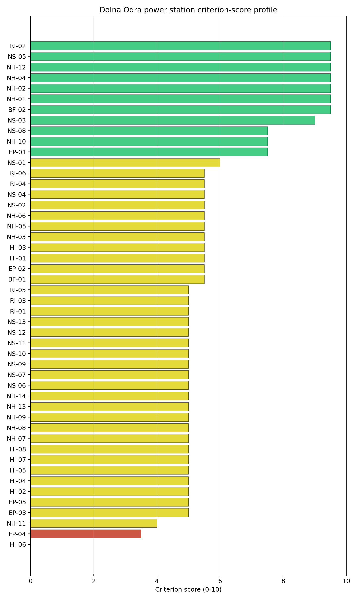
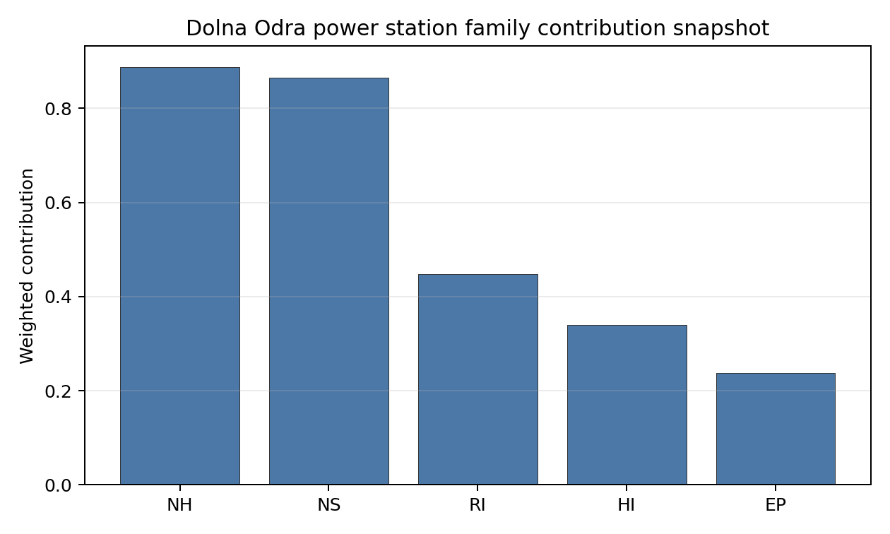

# Dolna Odra power station Site Profile

Dolna Odra power station is a coal/thermal site in Poland that has been tested against the NuScale VOYGR-6 reference deployment envelope. This profile reads the screening evidence at a level that supports a decision to progress toward Stage 3 characterization. It is not a site-suitability determination, vendor recommendation, or licensing finding.

## Site Snapshot

| Field | Value |
| --- | --- |
| Site name | Dolna Odra power station |
| Coordinates | 53.2078, 14.4672 |
| Subnational unit | Zachodniopomorskie |
| Installed thermal capacity (source data) | 1,792 MW |
| Composite score (baseline weights) | 5.948 (4.377-6.415 MC band) |
| National stability band | B (top-10% hit rate 88%) |
| National rank | 8 |

_See the country status map in_ [Poland Country Profile](../PL_country_prototype.md#country-status-map).

## Ownership and Coal-to-Nuclear Context

- **Ministry of State Treasury (Poland)** (60.86% share), headquartered in Poland; immediate operator PGE Zespol Elek Dolna Odra SA. Path: Ministry of State Treasury (Poland)  -> PGE Polska Grupa Energetyczna SA [60.86%] -> PGE Zespol Elek Dolna Odra SA [100.0%] -> Dolna Odra power station Unit 1 [100.0%]
- **PGE Polska Grupa Energetyczna SA** (100.00% share), headquartered in Poland; immediate operator PGE Zespol Elek Dolna Odra SA. Path: PGE Polska Grupa Energetyczna SA -> PGE Zespol Elek Dolna Odra SA [100.0%] -> Dolna Odra power station Unit 1 [100.0%]
- **small shareholder(s)** (39.14% share); immediate operator PGE Zespol Elek Dolna Odra SA. Path: small shareholder(s)  -> PGE Polska Grupa Energetyczna SA [39.14%] -> PGE Zespol Elek Dolna Odra SA [100.0%] -> Dolna Odra power station Unit 3 [100.0%]

Generating units on record: 2 operating, 6 retired.
Earliest unit commissioning: 1974; most recent: 1977.
Retirements span 2012 to 2025, leaving brownfield grid, water, transport, and workforce assets that materially shorten Stage 3 site preparation.

## Natural Hazards (NH)

- **Seismic: Ground Motion (NH-01)** - score 9.5/10 (MC 9.0-10.0), weight 0.0396, data quality high. Evidence: PGA at 475-year return period 0.008 g; PGA at 2,475-year return period 0.026 g; Vs30 reference (m/s): 760.0.
- **Seismic: Surface Rupture (NH-02)** - score 9.5/10 (MC 9.0-10.0), weight n/a, data quality screening grade. Evidence: nearest mapped capable fault 50.0 km; fault slip rate 0 mm/yr; fault name: none_in_search_radius.
- **Geotechnical: Liquefaction (NH-03)** - score 5.5/10 (MC 5.0-6.0), weight n/a, data quality medium. Evidence: liquefaction susceptibility: moderate; dominant soil type: sandy_clay_loam.
- **Geotechnical: Slope Stability (NH-04)** - score 9.5/10 (MC 9.0-10.0), weight n/a, data quality screening grade. Evidence: site slope 3.1 deg; max slope in 1 km box 25.7 deg; slope stability class: gentle.
- **Geotechnical: Subsidence (NH-05)** - score 5.5/10 (MC 5.0-6.0), weight 0.0308, data quality medium. Evidence: karst present: no; karst severity: none.
- **Geotechnical: Foundation (NH-06)** - score 5.5/10 (MC 5.0-6.0), weight 0.0220, data quality medium. Evidence: bearing capacity 109.2 kPa; depth to bedrock 30.1 m.
- **Volcanism (NH-07)** - score 5.0/10 (MC 5.0-5.0), weight n/a, data quality high. Evidence: volcanic hazard class: negligible.
- **Coastal Flooding (NH-08)** - score 5.0/10 (MC 5.0-5.0), weight 0.0264, data quality low. Evidence: values not in measurement tables.
- **River Flooding (NH-09)** - score 5.0/10 (MC 5.0-5.0), weight 0.0352, data quality insufficient. Evidence: flood zone class: negligible.
- **Extreme Winds (NH-10)** - score 7.5/10 (MC 7.0-8.0), weight n/a, data quality medium. Evidence: design wind speed 11.5 m/s.
- **Extreme Precipitation (NH-11)** - score 4.0/10 (MC 4.0-4.0), weight 0.0132, data quality medium. Evidence: extreme daily precipitation 0.23 mm; mean annual precipitation 21.8 mm/yr.
- **Extreme Temperatures (NH-12)** - score 9.5/10 (MC 9.0-10.0), weight 0.0176, data quality medium. Evidence: extreme high temperature 23.0 deg C; extreme low temperature -5.75 deg C.
- **Forest/Wildfire (NH-13)** - score 5.0/10 (MC 5.0-5.0), weight 0.0132, data quality n/a. Evidence: values not in measurement tables.
- **Combined Hazards (NH-14)** - score 5.0/10 (MC 5.0-5.0), weight 0.0132, data quality n/a. Evidence: values not in measurement tables.

### Interpretation - Natural Hazards (NH)

<!-- specialist key=family_natural_hazards scope=site site_id=558e7bff-5b5d-4666-9ca3-ec02f2269aab bundle=PL_dolna_odra_power_station_site_bundle.json status=filled by=cursor-agent filled_at=2026-05-03T17:12:59Z -->
Natural hazards at Dolna Odra sit in the same favourable Polish-lowland envelope as Opole, with a structurally aseismic platform context and the principal natural-hazard question concentrated on river flooding. **NH-01 Seismic: Ground Motion at 9.5/10** carries a 475-yr PGA of just **0.008 g** and a 2,475-yr PGA of **0.026 g** — the lowest seismic loadings of the first-batch cohort and consistent with the Pomeranian-platform tectonic setting. **NH-02 Seismic: Surface Rupture at 9.5/10** carries no mapped capable fault inside the 50 km screening search radius. **NH-04 Geotechnical: Slope Stability at 9.5/10** carries a mean site slope of just **3.1°** with a maximum slope of 25.7° on a `gentle` slope-stability class — the Lower-Oder valley terrace is essentially flat. NH-03 reads 5.5/10 with `moderate` liquefaction susceptibility on a sandy-clay-loam profile (the alluvial Lower-Oder context warrants Stage 3 CPT characterisation). NH-05 reads 5.5/10 with `karst not present` and `none` severity (the Pomeranian platform is karst-free, in contrast to the Silesian-platform context at Opole). **NH-06 Geotechnical: Foundation at 5.5/10** reads on a 109.2 kPa screening-proxy bearing capacity over **30.1 m to bedrock** — the alluvial overburden is the deepest of the first-batch cohort and the Stage 3 work will need to characterise the bearing capacity of the overburden against the foundation-design envelope. **NH-09 River Flooding** reads 5.0/10 on `insufficient` data quality but is the binding natural-hazard question for the site: the **site elevation is just 10.84 m** above sea level on the Lower Oder floodplain (the lowest of the first-batch cohort by a substantial margin, and inside the wider lower-Oder flood envelope), and Stage 3 site-specific hydrology will need to confirm the design-basis flood elevation against the historical Oder floods (1997, 2010) and climate-projected return periods. The existing thermal complex sits behind site-specific flood defences, but the SMR foundation envelope and EPZ siting will need to be re-characterised against the SSR-1 design-basis flood requirements. Extreme meteorology is calm: a 50-yr design wind of **11.5 m/s** (the highest of the first-batch cohort, reflecting the Baltic-coast proximity but still inside the project envelope) reads NH-10 at 7.5/10, and the extreme temperature range of -5.75 °C to 23.0 °C is well inside the project envelope (NH-12 at 9.5/10). NH-11 sits at 4.0/10 on the screening proxy. NH-07 reads 5.0/10. NH-08 carries an inconclusive verdict on the coastal-flooding case (the site is ~70 km inland from the Baltic but at 10 m elevation it is within the wider Pomeranian-coast surge envelope). The Stage 3 priority order is therefore: commission a site-specific Lower-Oder flood-hazard study with explicit modelling of historical reference events and climate-projected return periods so NH-09 lifts off the `insufficient` read (this is the binding natural-hazard question for the site); commission a coastal-surge study against the Pomeranian-coast Baltic envelope so NH-08 lifts off the inconclusive read; commission a CPT and deep-foundation campaign so NH-03 and NH-06 settle on measured liquefaction susceptibility and bearing-capacity values against the deep alluvial overburden.
<!-- /specialist key=family_natural_hazards -->

## Human-Induced and Security-Relevant Hazards (HI)

- **Aircraft Crash (HI-01)** - score 5.5/10 (MC 5.0-6.0), weight 0.0308, data quality high. Evidence: nearest airport 23.1 km; nearest flight path 11.6 km; airports within search radius 3; airport name: Szczecin-Dąbie Airfield; airport type: small_airport.
- **Industrial Explosions (HI-02)** - score 5.0/10 (MC 5.0-5.0), weight 0.0308, data quality high. Evidence: nearest industrial site 14.8 km.
- **Toxic/Gas Releases (HI-03)** - score 5.5/10 (MC 5.0-6.0), weight 0.0308, data quality high. Evidence: nearest toxic source 14.8 km.
- **External Fires (HI-04)** - score 5.0/10 (MC 5.0-5.0), weight 0.0264, data quality high. Evidence: values not in measurement tables.
- **Transport Hazards (HI-05)** - score 5.0/10 (MC 5.0-5.0), weight 0.0264, data quality n/a. Evidence: values not in measurement tables.
- **Military Installations (HI-06)** - score 0.0/10 (MC 0.0-0.0), weight 0.0264, data quality high. Evidence: nearest military installation 4.43 km; military installations within radius 47; installation name: Übungsplatz Freiwillige Feuerwehr Gartz.
- **Electromagnetic Interference (HI-07)** - score 5.0/10 (MC 5.0-5.0), weight 0.0088, data quality medium. Evidence: nearest high-power transmitter 0.12 km; transmitters within radius 222; transmitter type: communication.
- **Other Nuclear Installations (HI-08)** - score 5.0/10 (MC 5.0-5.0), weight 0.0132, data quality n/a. Evidence: values not in measurement tables.

### Interpretation - Human-Induced and Security-Relevant Hazards (HI)

<!-- specialist key=family_human_hazards scope=site site_id=558e7bff-5b5d-4666-9ca3-ec02f2269aab bundle=PL_dolna_odra_power_station_site_bundle.json status=filled by=cursor-agent filled_at=2026-05-03T17:12:59Z -->
Human-induced and security-relevant hazards at Dolna Odra are dominated by the **HI-06 0.0/10 score** for military installations — the lowest score in the family across the first-batch cohort and a substantive structural finding rather than a screening artefact. The nearest military feature is the **Übungsplatz Freiwillige Feuerwehr Gartz at 4.43 km** (a German fire-service / civil-protection training area on the German side of the border) with **47 military or military-adjacent installations inside the 25 km screening radius** — well inside the 8 km project A6 ammunition-storage and live-fire avoidance trigger and the highest count of the first-batch cohort. The 47-feature count reflects the **Polish-German border position of the site** (Gryfino is only ~5–10 km from the German border across the Oder), with both Polish and German military estate captured by the screening cadastre. The German-side estate around Mecklenburg-Vorpommern includes legacy GDR-era and current Bundeswehr facilities; the Polish-side estate around Western Pomerania is comparable in density. Most of the 47 features are likely civil-protection / training / non-active legacy installations rather than active live-fire ammunition stores, but the 4.43 km nearest distance and the cumulative count will require a substantial Stage 3 cross-border engagement: the Stage 3 work will need to obtain authoritative Polish (Ministry of National Defence) and German (Bundeswehr / Bundesministerium der Verteidigung) cadastres, classify each feature against the SSG-35 hazard typology, and assess whether the residual envelope after removing legacy / civil-protection facilities clears the 8 km project A6 trigger. The HI-06 0.0/10 finding may not be retirable through technical assessment alone if a substantial number of the 47 features are confirmed as active live-fire installations. **HI-01 Aircraft Crash at 5.5/10** carries the **Szczecin-Dąbie Airfield (`small_airport`) at 23.1 km** (well outside the SSG-35 A1 10 km screening exclusion radius) but with the nearest flight-path projection at **11.6 km** — outside the 8 km project A4 flight-path trigger. **HI-02 Industrial Explosions at 5.0/10 and HI-03 Toxic / Gas Releases at 5.5/10** read on `high` data quality with the nearest industrial site / toxic source at 14.8 km. HI-04 holds at 5.0/10 on `high` data quality. HI-05 sits at 5.0/10. HI-07 reads 5.0/10 with the nearest broadcast feature at 0.12 km (a communication mast inside the existing thermal complex) and **222 transmitters inside the EMI search radius** (the densest broadcast environment of the first-batch cohort, reflecting the cross-border Szczecin-and-Mecklenburg-Vorpommern conurbation). HI-08 is null. The Stage 3 priority order is therefore: commission a cross-border Polish-German military-cadastre engagement on the 47 HI-06 features so the residual active-live-fire envelope can be characterised — this is the binding HI question for the site and may require a substantial diplomatic and security-clearance commitment; commission an EMI envelope study against the cross-border 222-transmitter cadastre so HI-07 settles against the dense broadcast environment; and run the Polish national hazmat-corridor and external-fire surveys so HI-04 and HI-05 lift off the screening default.
<!-- /specialist key=family_human_hazards -->

## Radiological Impact and Emergency Planning (RI / EP)

- **Emergency Planning Feasibility (EP-01)** - score 7.5/10 (MC 7.0-8.0), weight n/a, data quality high. Evidence: EP feasibility composite 69.0 /100; road sub-score 53.9 /100; special-population sub-score 90.0 /100; geography sub-score 95.0 /100; population sub-score 80.0 /100; evacuation feasible: yes.
- **Evacuation Routes (EP-02)** - score 5.5/10 (MC 5.0-6.0), weight 0.0264, data quality medium. Evidence: road density in EPZ 0.532 km/km2; road length in EPZ 1,045 km; motorway access: yes.
- **Physical Geography Constraints (EP-03)** - score 5.0/10 (MC 5.0-5.0), weight 0.0220, data quality medium. Evidence: waterways crossing EPZ 0; major river barrier: no.
- **Special Populations (EP-04)** - score 3.5/10 (MC 3.0-4.0), weight 0.0264, data quality medium. Evidence: hospitals in EPZ 23; prisons in EPZ 1; care homes in EPZ 3.
- **Concurrent Hazard Impact (EP-05)** - score 5.0/10 (MC 5.0-5.0), weight 0.0176, data quality n/a. Evidence: values not in measurement tables.
- **Atmospheric Dispersion (RI-01)** - score 5.0/10 (MC 5.0-5.0), weight 0.0264, data quality medium. Evidence: annual mean wind speed 1.74 m/s; atmospheric mixing height 579.6 m; prevailing wind direction: SW.
- **Surface Water Dispersion (RI-02)** - score 9.5/10 (MC 9.0-10.0), weight 0.0220, data quality n/a. Evidence: values not in measurement tables.
- **Groundwater Dispersion (RI-03)** - score 5.0/10 (MC 5.0-5.0), weight 0.0220, data quality medium. Evidence: aquifer type: sedimentary sands.
- **Population Density at EPZ Radii (RI-04)** - score 5.5/10 (MC 5.0-6.0), weight 0.0352, data quality screening grade. Evidence: population density within 5 km 152.9 /km2; population density within 16 km 60.6 /km2; population density within 25 km 147.9 /km2; population density within 80 km 77.2 /km2; population within 25 km 290,297 people.
- **Distance to Population Centres (RI-05)** - score 5.0/10 (MC 5.0-5.0), weight 0.0441, data quality screening grade. Evidence: nearest city above 50k people 26.8 km; nearest city population 389,066 people; city name: Szczecin.
- **Population Projections (RI-06)** - score 5.5/10 (MC 5.0-6.0), weight 0.0220, data quality screening grade. Evidence: annual population growth rate 0.039 %/yr; projected population at 25 km in 60 yr 228,138 people.

### Interpretation - Radiological Impact and Emergency Planning (RI / EP)

<!-- specialist key=family_radiological_emergency scope=site site_id=558e7bff-5b5d-4666-9ca3-ec02f2269aab bundle=PL_dolna_odra_power_station_site_bundle.json status=filled by=cursor-agent filled_at=2026-05-03T17:12:59Z -->
Radiological-impact and emergency-planning conditions at Dolna Odra are favourable on dispersion (the strongest RI-02 surface-water-dispersion read of the first-batch cohort) but constrained on the EP-04 special-population axis by the wider Szczecin-conurbation healthcare estate inside the EPZ. The DRV-02 emergency-planning composite reads **69.0/100 with `evacuation feasible: yes`** — comfortably the strongest EP-01 composite of the first-batch cohort (Bitola 57.8, Negotino 52.5, Oslomej 52.5, Opole 53.4) — supported by sub-scores on geography (95/100), special populations (90/100), population (80/100), and a road sub-score of **53.9/100** reflecting the dense Polish-Pomeranian and German-Mecklenburg-Vorpommern road network in the wider Lower-Oder corridor. **EP-04 Special Populations at 3.5/10** is the family caution: **23 hospitals, 1 prison, and 3 care homes inside the 16 km EPZ** — the highest hospital count of the first-batch cohort, reflecting the Szczecin-conurbation healthcare-system spillover into the EPZ on the Polish side and the Mecklenburg-Vorpommern facility cadastre on the German side. **EP-02 Evacuation Routes at 5.5/10** reads on a road density of **0.532 km/km² inside the EPZ** with **1,045 km of road length** and motorway access — strong by first-batch-cohort standards but pulled below the avoidance Pareto frontier by the cross-border road-network discontinuity (the EPZ straddles the Polish-German border and the cross-border evacuation corridors will need a Stage 3 bilateral planning exercise). Population context is moderate: **5 km density 152.9 p/km², 16 km 60.6 p/km² (the EPZ floor reflects the rural Lower-Oder valley), 25 km 147.9 p/km² (Szczecin captured), 80 km 77.2 p/km²** on a 25 km cumulative population of **290,297 people** — RI-04 reads 5.5/10. The nearest city above 50k people is **Szczecin at 26.8 km with a population of 389,066**, just outside the 25 km radius — a structural radiological-impact tailwind that the Bitola, Negotino, and Oslomej sites do not share. The 60-yr projection at 25 km is 228,138 people on a +0.039 %/yr growth track — the only first-batch site with a positive long-term population growth trajectory, reflecting Szczecin's metro-area attractiveness in the wider Polish demographic context; RI-06 reads 5.5/10 (a structural radiological-impact tailwind that is weaker than at the depopulating Polish-interior sites). **RI-02 Surface Water Dispersion at 9.5/10** is the strongest dispersion read of the first-batch cohort, reflecting the major-river Lower-Oder hydraulic envelope with a flow of 549.4 m³/s. The atmospheric envelope is moderate: **1.74 m/s annual mean wind speed** (the strongest of the first-batch cohort) with a **579 m mixing height** and a SW prevailing direction (away from the Szczecin conurbation); RI-01 sits at 5.0/10. RI-03 reads 5.0/10 on a `sedimentary sands` aquifer (the Lower-Oder alluvial aquifer system; vertical and lateral connectivity will need Stage 3 hydrogeological characterisation, particularly important given the high water table on the floodplain). RI-05 reads 5.0/10 on `screening grade`. EP-03 reads 5.0/10 (no major river barrier inside the EPZ — the Oder runs through the EPZ but does not cut it in two), and EP-05 sits at 5.0/10. The Stage 3 priority order is therefore: engage the Polish and German regional emergency-planning authorities on the cross-border 16 km EPZ so EP-02, EP-04, and EP-05 settle on a defensible cross-border operational evacuation plan covering the 23 hospitals, 1 prison, 3 care homes, and the cross-border road network (this is the binding emergency-planning question and requires a bilateral commitment); commission the project-specific micro-meteorological station so RI-01 settles on a measured wind rose against the Lower-Oder valley; commission the Stage 3 hydrogeological survey on the alluvial aquifer with explicit characterisation of the high water table on the floodplain.
<!-- /specialist key=family_radiological_emergency -->

## Non-Safety and Implementation Considerations (NS)

- **Grid Capacity Basic Filter (BF-01)** - score 5.5/10 (MC 5.0-6.0), weight 0.0352, data quality n/a. Evidence: values not in measurement tables.
- **Land Area Basic Filter (BF-02)** - score 9.5/10 (MC 9.0-10.0), weight 0.0220, data quality n/a. Evidence: values not in measurement tables.
- **Cooling Water Availability (NS-01)** - score 6.0/10 (MC 6.0-6.0), weight n/a, data quality screening grade. Evidence: distance to cooling source 2.21 km; cooling source flow 549.4 m3/s; cooling source type: major_river; cooling source name: Kanał Dolna Odra; water stress label: Low.
- **Grid Connection (NS-02)** - score 5.5/10 (MC 5.0-6.0), weight 0.0352, data quality medium. Evidence: nearest substation 0.22 km; nearest high-voltage line 0.17 km; highest nearby line voltage 110.0 kV; grid export capacity 849.0 MW; substations within radius 0; HV lines within radius 0.
- **Transport Access (NS-03)** - score 9.0/10 (MC 9.0-10.0), weight 0.0352, data quality high. Evidence: nearest highway 0.94 km; nearest rail line 0.19 km; nearest waterway 4.53 km; heavy-haul capable: yes.
- **Site Topography (NS-04)** - score 5.5/10 (MC 5.0-6.0), weight 0.0264, data quality high. Evidence: favourable land cover 56.8 %; moderate land cover 5 %; unfavourable land cover 28.9 %; favourable area 117.8 ha; dominant land class: 312.
- **Site Footprint Adequacy (NS-05)** - score 9.5/10 (MC 9.0-10.0), weight 0.0220, data quality high. Evidence: buildable area 76.1 ha; largest contiguous patch 76.1 ha; buildable patch count 10.
- **Existing Infrastructure (NS-06)** - score 5.0/10 (MC 5.0-5.0), weight 0.0220, data quality n/a. Evidence: values not in measurement tables.
- **Environmental Impact (non-rad) (NS-07)** - score 5.0/10 (MC 5.0-5.0), weight 0.0220, data quality n/a. Evidence: values not in measurement tables.
- **Ecological Sensitivity (NS-08)** - score 7.5/10 (MC 7.0-8.0), weight n/a, data quality high. Evidence: natural land cover 28.9 %; distance to nearest Natura 2000 site 0.807 km; distance to nearest protected area 2.321 km; Natura 2000 overlap: no; Natura 2000 sensitivity class: high; protected-area overlap: no; protected-area sensitivity class: moderate; nearest Natura 2000 site: Dolina Dolnej Odry; Natura 2000 sites within 5 km: 6; nearest protected-area designation: Landscape Park.
- **Socioeconomic Impact (NS-09)** - score 5.0/10 (MC 5.0-5.0), weight 0.0220, data quality n/a. Evidence: values not in measurement tables.
- **Workforce Availability (NS-10)** - score 5.0/10 (MC 5.0-5.0), weight 0.0176, data quality n/a. Evidence: values not in measurement tables.
- **Coal-to-Nuclear Synergies (NS-11)** - score 5.0/10 (MC 5.0-5.0), weight 0.0264, data quality n/a. Evidence: values not in measurement tables.
- **Regulatory/Political Environment (NS-12)** - score 5.0/10 (MC 5.0-5.0), weight 0.0264, data quality n/a. Evidence: values not in measurement tables.
- **Construction Logistics (NS-13)** - score 5.0/10 (MC 5.0-5.0), weight 0.0176, data quality n/a. Evidence: values not in measurement tables.

### Interpretation - Non-Safety and Implementation Considerations (NS)

<!-- specialist key=family_infrastructure scope=site site_id=558e7bff-5b5d-4666-9ca3-ec02f2269aab bundle=PL_dolna_odra_power_station_site_bundle.json status=filled by=cursor-agent filled_at=2026-05-03T17:12:59Z -->
Non-safety and implementation conditions at Dolna Odra are dominated by an exceptionally favourable transport-and-cooling envelope on the navigable lower Oder, with a binding ecological-sensitivity finding on the adjacent Natura 2000 site. **NS-03 Transport Access at 9.0/10** carries the strongest transport-access read of the first-batch cohort: the nearest highway is at **0.94 km**, the nearest **rail line at 0.19 km**, the nearest waterway at **4.53 km on the navigable lower Oder**, and **heavy-haul capable: yes** — the Lower-Oder corridor is one of the most logistically favourable in the regional cohort (the Oder is navigable for SMR module delivery from the Baltic, and the rail-and-road-junction position into both Polish and German networks is structurally strong). **NS-01 Cooling Water Availability at 6.0/10** reads on a measured cooling-source flow of **549.4 m³/s** at 2.21 km from the site (the Kanał Dolna Odra cooling channel that draws from the lower Oder mainstem) on a **`Low` water-stress label** — the strongest cooling-water-availability envelope of the first-batch cohort by a substantial margin. **NS-05 Site Footprint Adequacy at 9.5/10** carries **76.1 ha buildable area as the largest contiguous patch** across 10 patches — comfortably above the project basic threshold and adequate for a multi-module deployment. **NS-02 Grid Connection at 5.5/10** is a screening-cadastre artefact rather than a substantive constraint: the nearest substation is 0.22 km from the site and the nearest high-voltage line is 0.17 km away, but the **highest nearby line voltage is listed as 110 kV** with a **measured grid-export capacity of 849 MW** and **0 substations and 0 HV lines inside the search radius** in the screening cadastre — the 0/0 count is a screening anomaly (the existing thermal block is connected at 220 kV / 400 kV but the cadastre is not picking the higher tiers up). The Stage 3 grid-connection survey will need to confirm the actual transmission tier and the export envelope against the wider Polish backbone, with a 462 MWe NuScale VOYGR-6 (6 × 77 MWe modules) reference SMR envelope likely to require a substation upgrade and one or two new HV-line connections to reach the wider 220/400 kV network. **NS-04 Site Topography at 5.5/10** reads on **56.8% favourable land cover, 5% moderate, and 28.9% unfavourable** on 117.8 ha of favourable area. **NS-08 Ecological Sensitivity at 7.5/10** is the binding ecological caution: the site is **0.807 km from the Dolina Dolnej Odry (Lower Oder Valley) Natura 2000 site** with **6 Natura 2000 sites inside the 5 km radius** on a `high` Natura 2000 sensitivity class (no overlap), and the nearest protected area at 2.321 km on the Landscape Park designation with `moderate` sensitivity. The Lower Oder Valley protects one of the largest natural floodplain wetland complexes in Central Europe and is a structural ecological consideration for any infrastructure on the site corridor — the Stage 3 ecological-impact assessment will need to proceed against an Article 6.3 appropriate-assessment framework with an explicit hydrological-impact pathway analysis, given the site's position immediately inside the Oder catchment. **BF-02 Land Area Basic Filter at 9.5/10** confirms the buildable footprint; BF-01 sits at 5.5/10 reflecting the screening-cadastre anomaly on the grid-connection count. NS-06, NS-07, NS-09 to NS-13 sit at the pass-mark default of 5.0/10. The Stage 3 priority order is therefore: commission an Article 6.3 Natura 2000 appropriate assessment for the Dolina Dolnej Odry site with an explicit hydrological-impact pathway analysis (this is the binding NS question for the site and is structurally substantive rather than a screening artefact); commission a Stage 3 grid-connection survey to confirm the actual transmission tier and the export envelope against the wider Polish backbone so NS-02 and BF-01 lift off the screening-cadastre anomaly; engage Polish workforce-supply institutions on the existing PGE personnel pool plus the wider Szczecin technical-workforce envelope so NS-10 and NS-11 settle on defensible measured values; and run the construction-logistics, regulatory, and socioeconomic surveys so NS-09 to NS-13 lift off the screening default.
<!-- /specialist key=family_infrastructure -->

## Composite Score and Stability

Baseline composite score is 5.948, bracketed by Monte Carlo at 4.377-6.415. National stability band is `B` with a top-10% hit rate of 88% across 16 scored Monte Carlo scenarios.

<!-- specialist key=stability scope=site site_id=558e7bff-5b5d-4666-9ca3-ec02f2269aab bundle=PL_dolna_odra_power_station_site_bundle.json status=filled by=cursor-agent filled_at=2026-05-03T17:12:59Z -->
Dolna Odra's composite of **5.948 (Monte Carlo 4.377–6.415)** is the second-strongest Polish score and the second-strongest first-batch-cohort score after Opole: the **national stability band is `B`** with a top-10% hit rate of **88% across 16 scored Monte Carlo scenarios** and a top-5% rate of **12%**, and the **regional stability band is also `B`** with a top-10% hit rate of **100%** across the regional Monte Carlo — Dolna Odra is a structurally robust regional candidate, narrowly behind Opole on the national leaderboard but ahead of all non-Polish first-batch sites and structurally equivalent to Opole in regional terms. The composite is anchored by NH-01 seismic ground motion (contribution 0.376 from a 9.5/10 score at the largest natural-hazard weight — the Pomeranian-platform aseismic context), NS-03 transport access (0.317 from a 9.0/10 score — the strongest transport-access read of the first-batch cohort, reflecting the navigable lower-Oder, rail, and motorway access), RI-05 distance to population centres (0.221), BF-02 land area (0.209), NS-05 site footprint adequacy (0.209), and RI-02 surface water dispersion (0.209 — the strongest dispersion read of the first-batch cohort). The drag features are the **HI-06 0.0/10 score on military installations** (the cross-border Polish-German military cadastre with 47 features inside 25 km is the dominant single drag and a substantive structural finding) and the **EP-04 3.5/10 score on special populations** (23 hospitals, 1 prison, 3 care homes inside the EPZ from the cross-border Szczecin-conurbation healthcare estate). The plain-English read is that Dolna Odra is a **structurally strong brownfield SMR candidate with substantive cross-border programme constraints** — the structurally aseismic platform context, the 549.4 m³/s Lower-Oder cooling envelope, the navigable-river-and-rail logistics access, the 76.1 ha buildable footprint, and the existing PGE thermal-block site preparation (with 6 of 8 historical units already retired between 2012 and 2025) together make this a strong coal-to-nuclear case on the technical axes — but the cross-border position introduces two binding programme questions: the cross-border Polish-German military-cadastre engagement on HI-06, and the cross-border emergency-planning bilateral commitment on EP-02 and EP-04. Both are retirable through programme-of-work commitments rather than by site-specific technical measurement, but both require substantial diplomatic and security-clearance infrastructure that the interior Polish sites do not need. Dolna Odra should be advanced as the second Polish national candidate after Opole, with the cross-border programme questions explicitly scoped into the Stage 3 work plan from the outset.
<!-- /specialist key=stability -->

## Residual Risk Register

<!-- specialist key=residual_risk scope=site site_id=558e7bff-5b5d-4666-9ca3-ec02f2269aab bundle=PL_dolna_odra_power_station_site_bundle.json status=filled by=cursor-agent filled_at=2026-05-03T17:12:59Z -->
| Criterion | Description | Owner | Resolution path |
| --- | --- | --- | --- |
| HI-06 Military Installations | Übungsplatz Freiwillige Feuerwehr Gartz at 4.43 km — inside 8 km A6 trigger; 47 features inside 25 km cross-border cadastre. | Security/Safety | Cross-border Polish-German military-cadastre engagement (Polish Ministry of National Defence, Bundeswehr / Bundesministerium der Verteidigung); SSG-35 typology classification of each feature. |
| EP-04 Special Populations | 23 hospitals, 1 prison, 3 care homes inside 16 km EPZ from cross-border Szczecin-conurbation healthcare estate. | Emergency Planning | Cross-border bilateral operational evacuation plan with Polish and German regional emergency-planning authorities. |
| EP-02 Evacuation Routes (cross-border) | Cross-border road-network discontinuity at Polish-German Oder border; standard road density 0.532 km/km² but cross-border corridors need bilateral planning. | Emergency Planning | Bilateral cross-border evacuation-corridor planning with Polish and German road-and-border authorities. |
| NS-08 Ecological Sensitivity | Dolina Dolnej Odry Natura 2000 site at 0.807 km on `high` sensitivity class with 6 sites in 5 km radius. | Environmental | Article 6.3 Natura 2000 appropriate assessment with explicit hydrological-impact pathway analysis on the Lower Oder Valley wetland complex. |
| NH-09 River Flooding | Site elevation 10.84 m on Lower Oder floodplain; binding natural-hazard question. | Hydrology | Site-specific Lower-Oder flood-hazard study; explicit modelling of 1997 / 2010 reference events and climate-projected return periods against SMR foundation envelope. |
| NH-08 Coastal Flooding | Site at 70 km inland but only 10.84 m elevation; within wider Pomeranian-coast surge envelope. | Hydrology | Coastal-surge study against Pomeranian-coast Baltic envelope; assess SSR-1 design-basis combined fluvial / surge case. |
| NS-02 Grid Connection | Screening-cadastre anomaly: 0/0 substations and HV lines counted; existing block at 220/400 kV but cadastre lists only 110 kV. | Grid/Transmission | Stage 3 grid-connection survey; confirm actual transmission tier; scope substation upgrade and new HV connections to wider Polish backbone for ≈ 462 MWe export envelope. |
| RI-01 Atmospheric Dispersion | Annual mean wind speed 1.74 m/s with 579 m mixing height; SW prevailing direction (away from Szczecin). | Radiological | Project-specific micro-meteorological station (≥ 12 months) on the Lower-Oder valley terrace. |
| RI-03 Groundwater Dispersion | Sedimentary-sands Lower-Oder alluvial aquifer; high water table on the floodplain not characterised. | Radiological | Stage 3 hydrogeological survey with explicit characterisation of the high water table and lateral connectivity. |
| NH-06 Geotechnical Foundation | Bearing capacity 109.2 kPa over 30.1 m to bedrock — deepest alluvial overburden of first-batch cohort. | Geotechnical | Deep-foundation investigation campaign; characterise bearing capacity of overburden against SMR foundation-design envelope. |
<!-- /specialist key=residual_risk -->

## Stage 3 Follow-Up Checklist

- [ ] Re-measure **Military Installations (HI-06)** - native score 0.0/10 with confidence high.
- [ ] Re-measure **Special Populations (EP-04)** - native score 3.5/10 with confidence medium.
- [ ] Re-measure **Extreme Precipitation (NH-11)** - native score 4.0/10 with confidence medium.
- [ ] Re-measure **Physical Geography Constraints (EP-03)** - native score 5.0/10 with confidence medium.
- [ ] Re-measure **Concurrent Hazard Impact (EP-05)** - native score 5.0/10 with confidence insufficient.
- [ ] Improve data quality for **Geotechnical: Subsidence & Collapse (NH-05b)** - current flag `low`.
- [ ] Improve data quality for **Coastal Flooding (NH-08)** - current flag `low`.

## Evidence Limitations

- Geotechnical: Subsidence & Collapse (NH-05b) - quality `low`.
- Coastal Flooding (NH-08) - quality `low`.
