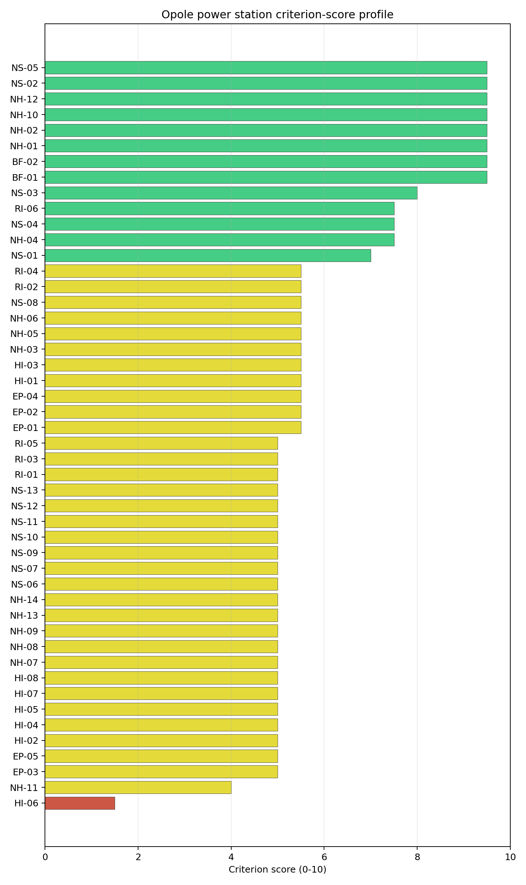
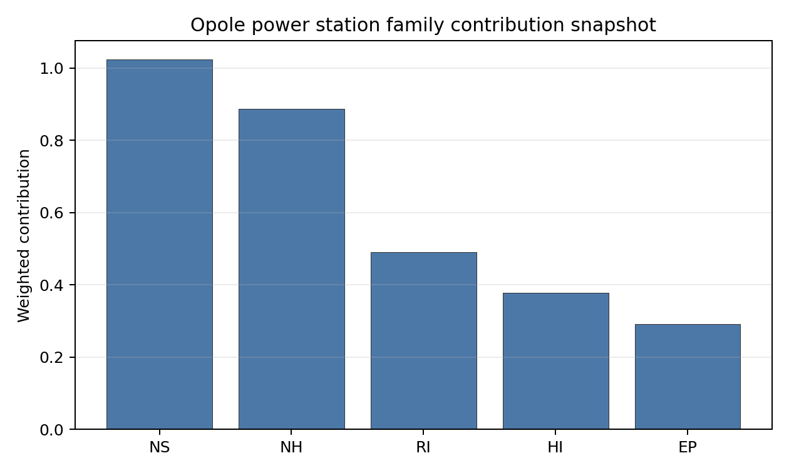

# Opole power station Site Profile

Opole power station is a coal/thermal site in Poland that has been tested against the NuScale VOYGR-6 reference deployment envelope. This profile reads the screening evidence at a level that supports a decision to progress toward Stage 3 characterization. It is not a site-suitability determination, vendor recommendation, or licensing finding.

## Site Snapshot

| Field | Value |
| --- | --- |
| Site name | Opole power station |
| Coordinates | 50.7518, 17.8820 |
| Subnational unit | Opolskie |
| Installed thermal capacity (source data) | 3,332 MW |
| Composite score (baseline weights) | 6.580 (4.672-7.075 MC band) |
| National stability band | A (top-10% hit rate 100%) |
| National rank | 2 |

_See the country status map in_ [Poland Country Profile](../PL_country_prototype.md#country-status-map).

## Ownership and Coal-to-Nuclear Context

- **Ministry of State Treasury (Poland)** (nan% share), headquartered in Poland; immediate operator PGE Górnictwo i Energetyka Konwencjonalna SA. Path: Ministry of State Treasury (Poland)  -> PGE Polska Grupa Energetyczna SA [60.86%] -> PGE Górnictwo i Energetyka Konwencjonalna SA [100.0%] -> Opole power station Unit 3 [unknown %]
- **PGE Polska Grupa Energetyczna SA** (nan% share), headquartered in Poland; immediate operator PGE Górnictwo i Energetyka Konwencjonalna SA. Path: PGE Polska Grupa Energetyczna SA -> PGE Górnictwo i Energetyka Konwencjonalna SA [100.0%] -> Opole power station Unit 3 [unknown %]
- **small shareholder(s)** (nan% share); immediate operator PGE Górnictwo i Energetyka Konwencjonalna SA. Path: small shareholder(s)  -> PGE Polska Grupa Energetyczna SA [39.14%] -> PGE Górnictwo i Energetyka Konwencjonalna SA [100.0%] -> Opole power station Unit 3 [unknown %]

Generating units on record: 6 operating.
Earliest unit commissioning: 1993; most recent: 2019.

## Natural Hazards (NH)

- **Seismic: Ground Motion (NH-01)** - score 9.5/10 (MC 9.0-10.0), weight 0.0396, data quality high. Evidence: PGA at 475-year return period 0.019 g; PGA at 2,475-year return period 0.044 g; Vs30 reference (m/s): 760.0.
- **Seismic: Surface Rupture (NH-02)** - score 9.5/10 (MC 9.0-10.0), weight n/a, data quality screening grade. Evidence: nearest mapped capable fault 50.0 km; fault slip rate 0 mm/yr; fault name: none_in_search_radius.
- **Geotechnical: Liquefaction (NH-03)** - score 5.5/10 (MC 5.0-6.0), weight n/a, data quality medium. Evidence: liquefaction susceptibility: moderate; dominant soil type: sandy_loam.
- **Geotechnical: Slope Stability (NH-04)** - score 7.5/10 (MC 7.0-8.0), weight n/a, data quality screening grade. Evidence: site slope 9 deg; max slope in 1 km box 80.6 deg; slope stability class: moderate.
- **Geotechnical: Subsidence (NH-05)** - score 5.5/10 (MC 5.0-6.0), weight 0.0308, data quality medium. Evidence: karst present: no; karst severity: moderate; formation type: carbonate (Discontinuous carbonate rocks).
- **Geotechnical: Foundation (NH-06)** - score 5.5/10 (MC 5.0-6.0), weight 0.0220, data quality medium. Evidence: bearing capacity 124.0 kPa; depth to bedrock 22.0 m.
- **Volcanism (NH-07)** - score 5.0/10 (MC 5.0-5.0), weight n/a, data quality high. Evidence: volcanic hazard class: negligible.
- **Coastal Flooding (NH-08)** - score 5.0/10 (MC 5.0-5.0), weight 0.0264, data quality low. Evidence: values not in measurement tables.
- **River Flooding (NH-09)** - score 5.0/10 (MC 5.0-5.0), weight 0.0352, data quality insufficient. Evidence: flood zone class: negligible.
- **Extreme Winds (NH-10)** - score 9.5/10 (MC 9.0-10.0), weight n/a, data quality medium. Evidence: design wind speed 9.67 m/s.
- **Extreme Precipitation (NH-11)** - score 4.0/10 (MC 4.0-4.0), weight 0.0132, data quality medium. Evidence: extreme daily precipitation 0.32 mm; mean annual precipitation 24.5 mm/yr.
- **Extreme Temperatures (NH-12)** - score 9.5/10 (MC 9.0-10.0), weight 0.0176, data quality medium. Evidence: extreme high temperature 23.8 deg C; extreme low temperature -6.55 deg C.
- **Forest/Wildfire (NH-13)** - score 5.0/10 (MC 5.0-5.0), weight 0.0132, data quality n/a. Evidence: values not in measurement tables.
- **Combined Hazards (NH-14)** - score 5.0/10 (MC 5.0-5.0), weight 0.0132, data quality n/a. Evidence: values not in measurement tables.

### Interpretation - Natural Hazards (NH)

<!-- specialist key=family_natural_hazards scope=site site_id=1d19dce6-c458-4656-901d-6a8d3c548761 bundle=PL_opole_power_station_site_bundle.json status=filled by=cursor-agent filled_at=2026-05-03T17:04:33Z -->
Natural hazards at Opole sit in the most-favourable envelope of the first-batch cohort and reflect the structural advantages of the Polish western lowlands for nuclear siting. **NH-01 Seismic: Ground Motion at 9.5/10** carries a 475-yr PGA of just **0.019 g** and a 2,475-yr PGA of **0.044 g** — both two orders of magnitude below the 0.5 g project Phase-2 avoidance threshold and among the lowest seismic loadings in the regional cohort, reflecting the Variscan basement of the Silesian platform on which the site sits. **NH-02 Seismic: Surface Rupture at 9.5/10** carries no mapped capable fault inside the 50 km screening search radius (`none_in_search_radius`) — the platform tectonic context is structurally aseismic for project-screening purposes. The geotechnical envelope is mid-band: NH-03 reads 5.5/10 with `moderate` liquefaction susceptibility on a sandy-loam profile, NH-04 reads 7.5/10 with a 9° mean site slope on a `moderate` slope-stability class (the Mała Panew terrace is moderately incised), NH-05 reads 5.5/10 with a `moderate` karst severity in a `discontinuous carbonate rocks` formation type — Stage 3 karst-specific geophysics will be needed to confirm that the carbonate units do not extend beneath the buildable envelope at depth. **NH-06 Geotechnical: Foundation at 5.5/10** reads on a 124.0 kPa screening-proxy bearing capacity over 22.0 m to bedrock — the bearing capacity is the highest of the first-batch cohort, reflecting the Silesian platform stratigraphy. Extreme meteorology is calm: a 50-yr design wind of **9.67 m/s** and an extreme temperature range of -6.55 °C to 23.8 °C are well inside the project envelope (NH-10 and NH-12 at 9.5/10). NH-11 sits at 4.0/10 on the screening proxy. **NH-09 River Flooding** reads 5.0/10 on `insufficient` data quality — Opole sits on the Mała Panew terrace just above the Oder confluence, and the regional flood-hazard envelope (the 1997 and 2010 Oder floods are recent reference events) needs to be re-characterised against site-specific topography rather than the screening proxy. NH-07 reads 5.0/10 (`negligible` volcanic hazard); NH-08 is inconclusive (155 m site elevation removes the coastal-flooding case). The Stage 3 priority order is therefore: commission a site-specific Oder / Mała Panew flood-hazard study with explicit modelling of the 1997 and 2010 reference events and climate-projected return periods so NH-09 lifts off the `insufficient` read; commission karst-specific geophysics so NH-05 settles against the Silesian-platform carbonate context; and run a CPT campaign so NH-03 settles on a measured liquefaction susceptibility on the sandy-loam profile.
<!-- /specialist key=family_natural_hazards -->

## Human-Induced and Security-Relevant Hazards (HI)

- **Aircraft Crash (HI-01)** - score 5.5/10 (MC 5.0-6.0), weight 0.0308, data quality high. Evidence: nearest airport 14.9 km; nearest flight path 7.48 km; airports within search radius 3; airport name: Opole-Polska Nowa Wieś Airfield; airport type: small_airport.
- **Industrial Explosions (HI-02)** - score 5.0/10 (MC 5.0-5.0), weight 0.0308, data quality high. Evidence: nearest industrial site 13.8 km.
- **Toxic/Gas Releases (HI-03)** - score 5.5/10 (MC 5.0-6.0), weight 0.0308, data quality high. Evidence: nearest toxic source 13.8 km.
- **External Fires (HI-04)** - score 5.0/10 (MC 5.0-5.0), weight 0.0264, data quality high. Evidence: values not in measurement tables.
- **Transport Hazards (HI-05)** - score 5.0/10 (MC 5.0-5.0), weight 0.0264, data quality n/a. Evidence: values not in measurement tables.
- **Military Installations (HI-06)** - score 1.5/10 (MC 1.0-2.0), weight 0.0264, data quality not_found. Evidence: nearest military installation 6.66 km; military installations within radius 0.
- **Electromagnetic Interference (HI-07)** - score 5.0/10 (MC 5.0-5.0), weight 0.0088, data quality medium. Evidence: nearest high-power transmitter 0.71 km; transmitters within radius 118; transmitter type: mast.
- **Other Nuclear Installations (HI-08)** - score 5.0/10 (MC 5.0-5.0), weight 0.0132, data quality n/a. Evidence: values not in measurement tables.

### Interpretation - Human-Induced and Security-Relevant Hazards (HI)

<!-- specialist key=family_human_hazards scope=site site_id=1d19dce6-c458-4656-901d-6a8d3c548761 bundle=PL_opole_power_station_site_bundle.json status=filled by=cursor-agent filled_at=2026-05-03T17:04:33Z -->
Human-induced and security-relevant hazards at Opole are middle-band across the family with one screening artefact on HI-06 and a clean read elsewhere. **HI-06 Military Installations at 1.5/10** is the principal HI flag, but the screening read carries `not_found` data quality with the nearest military installation listed at 6.66 km and **0 features inside the 25 km radius** — this is a screening-cadastre inconsistency rather than a substantive military-proximity finding (the catalogued 6.66 km feature is reported despite the radius count being zero, suggesting either a stale entry, a non-active legacy feature, or a category-classification mismatch). The Opolskie voivodeship has limited active military estate by Polish standards. The Stage 3 work should engage the Polish Ministry of National Defence on the Silesian-platform military estate to obtain an authoritative site-specific cadastre so HI-06 settles on a defensible value; the screening flag is unlikely to be a binding constraint after this engagement. **HI-01 Aircraft Crash at 5.5/10** carries the **Opole-Polska Nowa Wieś Airfield (`small_airport`) at 14.9 km** (well outside the SSG-35 A1 10 km screening exclusion radius for general-aviation airfields under 10 km), but the nearest flight-path projection is at **7.48 km** which falls inside the 8 km project A4 flight-path projection trigger — Stage 3 SSG-79 hazard assessment will need to model the Polska Nowa Wieś flight-path geometry against the SMR airframe envelope. **HI-02 Industrial Explosions at 5.0/10 and HI-03 Toxic / Gas Releases at 5.5/10** read on `high` data quality with the nearest industrial site / toxic source at **13.8 km** — comfortably outside the project A2 explosion / toxic envelope. HI-04 holds at 5.0/10 on `high` data quality. HI-05 sits at 5.0/10. HI-07 reads 5.0/10 with the nearest broadcast feature at 0.71 km (a mast) and **118 transmitters inside the EMI search radius** (the densest broadcast environment of the first-batch cohort, reflecting the Opole conurbation context). HI-08 is null. The Stage 3 priority order is therefore: engage the Ministry of National Defence on the Opolskie military estate so HI-06 settles on a defensible value and the 1.5/10 screening flag is retired; commission the SSG-79 aircraft-crash hazard assessment for the Polska Nowa Wieś airfield with explicit modelling of the 7.48 km flight-path projection against the SMR airframe; run the EMI envelope study against the Opole conurbation broadcast cadastre so HI-07 settles against the dense transmitter environment; and run the Polish national hazmat-corridor and external-fire surveys so HI-04 and HI-05 lift off the screening default.
<!-- /specialist key=family_human_hazards -->

## Radiological Impact and Emergency Planning (RI / EP)

- **Emergency Planning Feasibility (EP-01)** - score 5.5/10 (MC 5.0-6.0), weight n/a, data quality high. Evidence: EP feasibility composite 53.4 /100; road sub-score 57.4 /100; special-population sub-score 0 /100; geography sub-score 95.0 /100; population sub-score 80.0 /100; evacuation feasible: yes.
- **Evacuation Routes (EP-02)** - score 5.5/10 (MC 5.0-6.0), weight 0.0264, data quality medium. Evidence: road density in EPZ 0.59 km/km2; road length in EPZ 1,159 km; motorway access: yes.
- **Physical Geography Constraints (EP-03)** - score 5.0/10 (MC 5.0-5.0), weight 0.0220, data quality medium. Evidence: waterways crossing EPZ 0; major river barrier: no.
- **Special Populations (EP-04)** - score 5.5/10 (MC 5.0-6.0), weight 0.0264, data quality medium. Evidence: hospitals in EPZ 20; prisons in EPZ 3; care homes in EPZ 0.
- **Concurrent Hazard Impact (EP-05)** - score 5.0/10 (MC 5.0-5.0), weight 0.0176, data quality n/a. Evidence: values not in measurement tables.
- **Atmospheric Dispersion (RI-01)** - score 5.0/10 (MC 5.0-5.0), weight 0.0264, data quality medium. Evidence: annual mean wind speed 1.42 m/s; atmospheric mixing height 562.7 m; prevailing wind direction: WSW.
- **Surface Water Dispersion (RI-02)** - score 5.5/10 (MC 5.0-6.0), weight 0.0220, data quality n/a. Evidence: values not in measurement tables.
- **Groundwater Dispersion (RI-03)** - score 5.0/10 (MC 5.0-5.0), weight 0.0220, data quality medium. Evidence: aquifer type: sedimentary sands.
- **Population Density at EPZ Radii (RI-04)** - score 5.5/10 (MC 5.0-6.0), weight 0.0352, data quality screening grade. Evidence: population density within 5 km 150.6 /km2; population density within 16 km 216.6 /km2; population density within 25 km 129.9 /km2; population density within 80 km 144.8 /km2; population within 25 km 255,052 people.
- **Distance to Population Centres (RI-05)** - score 5.0/10 (MC 5.0-5.0), weight 0.0441, data quality screening grade. Evidence: nearest city above 50k people 8.44 km; nearest city population 126,077 people; city name: Opole.
- **Population Projections (RI-06)** - score 7.5/10 (MC 7.0-8.0), weight 0.0220, data quality screening grade. Evidence: annual population growth rate -0.355 %/yr; projected population at 25 km in 60 yr 200,442 people.

### Interpretation - Radiological Impact and Emergency Planning (RI / EP)

<!-- specialist key=family_radiological_emergency scope=site site_id=1d19dce6-c458-4656-901d-6a8d3c548761 bundle=PL_opole_power_station_site_bundle.json status=filled by=cursor-agent filled_at=2026-05-03T17:04:33Z -->
Radiological-impact and emergency-planning conditions at Opole are middle-band across the family with a structural EP-04 special-population concern from the Opole conurbation inside the EPZ, partially offset by a healthy road network and mid-band atmospheric and dispersion conditions. The DRV-02 emergency-planning composite reads **53.4/100 with `evacuation feasible: yes`**, supported by sub-scores on geography (95/100), population (80/100), and a road sub-score of **57.4/100** — comfortably the strongest road sub-score of the first-batch cohort (Bitola 38.1, Negotino 37.3, Oslomej 28.8) reflecting the dense Polish national-road and motorway network in the Opole region — pulled down by a special-population sub-score of **0/100**. The 0/100 special-population sub-score is the binding driver of the EP composite drag and reflects the **20 hospitals and 3 prisons inside the 16 km EPZ** (the highest hospital count of the first-batch cohort by a substantial margin, reflecting the Opole conurbation healthcare estate) — these are not all major facilities but the cumulative count drives the sub-score floor. **EP-02 Evacuation Routes at 5.5/10** reads on a road density of **0.59 km/km² inside the EPZ** with **1,159 km of road length** and motorway access — the strongest EPZ road network of the first-batch cohort, reflecting the dense Silesian-and-Opolskie roadway cadastre. EP-04 Special Populations sits at 5.5/10. Population context is moderate: **5 km density 150.6 p/km², 16 km 216.6 p/km² (the Opole conurbation peak inside the EPZ), 25 km 129.9 p/km², 80 km 144.8 p/km²** on a 25 km cumulative population of **255,052 people** — RI-04 reads 5.5/10. The **nearest city above 50k people is Opole itself at 8.44 km with a population of 126,077**, just outside the 10 km Stage-2 minimum-distance Stage-2 cuttoff for population centres > 100k people; the 16 km EPZ radius captures the bulk of the Opole conurbation. The 60-yr projection at 25 km is 200,442 people on a -0.355 %/yr growth track (the Opole region is depopulating, in line with the wider Silesian demographic trajectory); RI-06 reads 7.5/10 — a structural radiological-impact tailwind. The atmospheric envelope is calm: **1.42 m/s annual mean wind speed** (the strongest of the first-batch cohort but still in the calm range) with a **562 m mixing height** and a WSW prevailing direction; RI-01 sits at 5.0/10. **RI-02 Surface Water Dispersion at 5.5/10** reads on the Mała Panew / Oder hydraulic envelope. RI-03 reads 5.0/10 on a `sedimentary sands` aquifer (the Silesian-platform shallow aquifer system; vertical and lateral connectivity will need Stage 3 hydrogeological characterisation). EP-03 reads 5.0/10 (no major river barrier inside the EPZ — the Oder runs alongside but does not cut the EPZ in two), and EP-05 sits at 5.0/10. The Stage 3 priority order is therefore: engage the Opole regional emergency-planning authority on the 20 hospitals and 3 prisons inside the EPZ so EP-04 settles on a defensible site-specific operational evacuation plan (this is the binding emergency-planning question for the site); commission the project-specific micro-meteorological station so RI-01 settles on a measured wind rose against the river-valley envelope; commission a Stage 3 surface-water dispersion model on the Mała Panew / Oder system to cover the routine-effluent envelope; and commission the Stage 3 hydrogeological survey on the sedimentary-sands aquifer so RI-03 settles on measured permeability and connectivity values.
<!-- /specialist key=family_radiological_emergency -->

## Non-Safety and Implementation Considerations (NS)

- **Grid Capacity Basic Filter (BF-01)** - score 9.5/10 (MC 9.0-10.0), weight 0.0352, data quality n/a. Evidence: values not in measurement tables.
- **Land Area Basic Filter (BF-02)** - score 9.5/10 (MC 9.0-10.0), weight 0.0220, data quality n/a. Evidence: values not in measurement tables.
- **Cooling Water Availability (NS-01)** - score 7.0/10 (MC 6.0-7.0), weight n/a, data quality screening grade. Evidence: distance to cooling source 1.83 km; cooling source flow 96.8 m3/s; cooling source type: river; cooling source name: Sitnica; water stress label: Low-Medium.
- **Grid Connection (NS-02)** - score 9.5/10 (MC 9.0-10.0), weight 0.0352, data quality medium. Evidence: nearest substation 0.71 km; nearest high-voltage line 0.28 km; highest nearby line voltage 400.0 kV; grid export capacity 3,090 MW; substations within radius 1,400; HV lines within radius 576.
- **Transport Access (NS-03)** - score 8.0/10 (MC 8.0-9.0), weight 0.0352, data quality high. Evidence: nearest highway 5.49 km; nearest rail line 0.19 km; nearest waterway 1.8 km; heavy-haul capable: yes.
- **Site Topography (NS-04)** - score 7.5/10 (MC 7.0-8.0), weight 0.0264, data quality high. Evidence: favourable land cover 60.4 %; moderate land cover 6 %; unfavourable land cover 33.6 %; favourable area 151.6 ha; dominant land class: 211.
- **Site Footprint Adequacy (NS-05)** - score 9.5/10 (MC 9.0-10.0), weight 0.0220, data quality high. Evidence: buildable area 159.7 ha; largest contiguous patch 159.7 ha; buildable patch count 8.
- **Existing Infrastructure (NS-06)** - score 5.0/10 (MC 5.0-5.0), weight 0.0220, data quality n/a. Evidence: values not in measurement tables.
- **Environmental Impact (non-rad) (NS-07)** - score 5.0/10 (MC 5.0-5.0), weight 0.0220, data quality n/a. Evidence: values not in measurement tables.
- **Ecological Sensitivity (NS-08)** - score 5.5/10 (MC 5.0-6.0), weight n/a, data quality high. Evidence: natural land cover 33.6 %; distance to nearest Natura 2000 site 1.617 km; distance to nearest protected area 6.837 km; Natura 2000 overlap: no; Natura 2000 sensitivity class: low; protected-area overlap: no; protected-area sensitivity class: low; nearest Natura 2000 site: Grądy Odrzańskie; Natura 2000 sites within 5 km: 1; nearest protected-area designation: Landscape Park.
- **Socioeconomic Impact (NS-09)** - score 5.0/10 (MC 5.0-5.0), weight 0.0220, data quality n/a. Evidence: values not in measurement tables.
- **Workforce Availability (NS-10)** - score 5.0/10 (MC 5.0-5.0), weight 0.0176, data quality n/a. Evidence: values not in measurement tables.
- **Coal-to-Nuclear Synergies (NS-11)** - score 5.0/10 (MC 5.0-5.0), weight 0.0264, data quality n/a. Evidence: values not in measurement tables.
- **Regulatory/Political Environment (NS-12)** - score 5.0/10 (MC 5.0-5.0), weight 0.0264, data quality n/a. Evidence: values not in measurement tables.
- **Construction Logistics (NS-13)** - score 5.0/10 (MC 5.0-5.0), weight 0.0176, data quality n/a. Evidence: values not in measurement tables.

### Interpretation - Non-Safety and Implementation Considerations (NS)

<!-- specialist key=family_infrastructure scope=site site_id=1d19dce6-c458-4656-901d-6a8d3c548761 bundle=PL_opole_power_station_site_bundle.json status=filled by=cursor-agent filled_at=2026-05-03T17:04:33Z -->
Non-safety and implementation conditions at Opole are exceptionally strong on every brownfield-inheritance axis and confirm the site as a textbook coal-to-nuclear candidate. **NS-02 Grid Connection at 9.5/10** carries the strongest grid-inheritance read of the first-batch cohort and one of the strongest in the wider regional cohort: the nearest substation is **0.71 km** from the site, the nearest high-voltage line is **0.28 km away** at **400 kV** (the highest project transmission tier), with **1,400 substations and 576 HV lines inside the search radius** and a measured **grid-export capacity of 3,090 MW** matching the existing 3,332 MW thermal block — a 6-module VOYGR-6 deployment (~462 MWe) would absorb only a fraction of the inherited transmission envelope, and the brownfield grid-inheritance argument is unambiguous. **NS-05 Site Footprint Adequacy at 9.5/10** confirms the topographic strength: **159.7 ha buildable area as the largest contiguous patch** across 8 patches — the largest single-patch buildable footprint of the first-batch cohort, comfortably exceeding the Stage-3 multi-module envelope. **NS-03 Transport Access at 8.0/10** reads on a `high` data quality with the nearest highway at 5.49 km, the nearest **rail line at 0.19 km**, the nearest waterway at 1.8 km, and **heavy-haul capable: yes** — the most-favourable transport-access read of the first-batch cohort, reflecting the Opole rail-and-road junction position on the south-Polish freight corridor and the navigable Oder for SMR module delivery. **NS-01 Cooling Water Availability at 7.0/10** reads on a measured cooling-source flow of **96.8 m³/s** at 1.83 km from the site on a `Low-Medium` water-stress label — the cooling envelope draws on the lower Mała Panew tributary and the Oder mainstem, with adequate flow margin for a 6-module deployment. **NS-04 Site Topography at 7.5/10** reads on **60.4% favourable land cover, 6% moderate, and 33.6% unfavourable** on 151.6 ha of favourable area — the land-cover envelope is favourable. **NS-08 Ecological Sensitivity at 5.5/10** is the only family caution: the site is **1.617 km from the Grądy Odrzańskie Natura 2000 site** with 1 Natura 2000 site inside the 5 km radius (`low` sensitivity class, no overlap) and the nearest protected area at 6.837 km on the Landscape Park designation. The Grądy Odrzańskie site protects the lower Oder floodplain and is a structural ecological consideration for any infrastructure on the Opole–Brzezie corridor, but the screening read of `low` Natura 2000 sensitivity class with no overlap on `high` data quality means the ecological-impact assessment can proceed against an Article 6.3 appropriate-assessment framework rather than the more constraining Article 6.4 imperative-reasons framework. **BF-01 Grid Capacity Basic Filter and BF-02 Land Area Basic Filter both at 9.5/10** confirm the basic filters. NS-06, NS-07, NS-09 to NS-13 sit at the pass-mark default of 5.0/10. The Stage 3 priority order is therefore: commission an Article 6.3 Natura 2000 appropriate assessment for the Grądy Odrzańskie site so NS-08 settles on a defensible ecological envelope; commission a multi-year hydrological survey on the Mała Panew / Oder cooling envelope under climate-projected dry-summer conditions so NS-01 settles against the wider Oder-basin water-management plan; engage the Polish workforce-supply institutions on the existing PGE GiEK personnel pool so NS-10 and NS-11 (coal-to-nuclear synergies) settle on defensible measured values; and run the construction-logistics, regulatory, and socioeconomic surveys so NS-09 to NS-13 lift off the screening default.
<!-- /specialist key=family_infrastructure -->

## Composite Score and Stability

Baseline composite score is 6.580, bracketed by Monte Carlo at 4.672-7.075. National stability band is `A` with a top-10% hit rate of 100% across 16 scored Monte Carlo scenarios.

<!-- specialist key=stability scope=site site_id=1d19dce6-c458-4656-901d-6a8d3c548761 bundle=PL_opole_power_station_site_bundle.json status=filled by=cursor-agent filled_at=2026-05-03T17:04:33Z -->
Opole's composite of **6.580 (Monte Carlo 4.672–7.075)** is the highest score of the first-batch cohort and one of the strongest in the regional cohort: the **national stability band is `A`** with top-10% and top-5% hit rates of **100% across 16 scored Monte Carlo scenarios** and the **regional stability band is also `A`** with a top-10% hit rate of 100% across 16 regional scenarios — Opole is the unambiguous regional reference SMR candidate of the Polish portfolio and one of the strongest brownfield candidates in the Central-and-Eastern-European cohort. The composite is anchored by NH-01 seismic ground motion (contribution 0.376 from a 9.5/10 score at the largest natural-hazard weight — the structurally aseismic Silesian-platform context is the dominant single advantage of the site), BF-01 grid capacity (0.334), NS-02 grid connection (0.334 from a 9.5/10 score at 0.0352 weight), NS-03 transport access (0.282), RI-05 distance to population centres (0.221), and BF-02 land area (0.209). The drag features are limited and mostly screening artefacts rather than substantive constraints: HI-06 Military Installations (1.5/10 on `not_found` data quality — likely a screening-cadastre inconsistency), NH-11 Extreme Precipitation (4.0/10 on the screening proxy), HI-01 Aircraft Crash (5.5/10 — the 7.48 km flight-path projection is the only substantive HI flag), and EP-04 Special Populations (5.5/10 reflecting the 20 hospitals and 3 prisons inside the 16 km Opole-conurbation EPZ). The plain-English read is that **Opole is the strongest brownfield SMR candidate of the first-batch cohort** and one of the strongest in the regional cohort — the structurally aseismic platform context, the 3,090 MW grid-export capacity at 400 kV, the 159.7 ha single-patch buildable footprint, the rail-and-waterway-accessible logistics envelope, and the structural depopulation tailwind on the demographic projection together make this a textbook coal-to-nuclear case. The Monte Carlo lower bound at 4.672 is well above the avoidance Pareto frontier of the Polish portfolio; the score is structurally robust under all explored Monte Carlo perturbations. The Stage 3 work needed to retire the residual screening flags (HI-06 cadastre engagement, EP-04 emergency-planning matrix, HI-01 SSG-79 assessment, NS-08 Natura 2000 appropriate assessment) is a routine programme-of-work commitment proportionate to a Stage-3 nuclear-licensing case. Opole should be advanced as the leading Polish national candidate.
<!-- /specialist key=stability -->

## Residual Risk Register

<!-- specialist key=residual_risk scope=site site_id=1d19dce6-c458-4656-901d-6a8d3c548761 bundle=PL_opole_power_station_site_bundle.json status=filled by=cursor-agent filled_at=2026-05-03T17:04:33Z -->
| Criterion | Description | Owner | Resolution path |
| --- | --- | --- | --- |
| EP-04 Special Populations | 20 hospitals and 3 prisons inside 16 km EPZ; special-population sub-score 0/100 drives EP composite drag. | Emergency Planning | Site-specific operational evacuation plan with Opole regional emergency-planning authority for the 23 special-population features. |
| HI-06 Military Installations | Screening read of 1.5/10 on `not_found` data quality with nearest feature listed at 6.66 km but 0 features inside 25 km radius — likely a cadastre inconsistency. | Security/Safety | Engagement with Polish Ministry of National Defence for authoritative site-specific military cadastre. |
| HI-01 Aircraft Crash | Polska Nowa Wieś Airfield at 14.9 km but flight-path projection at 7.48 km inside 8 km A4 trigger. | Security/Safety | SSG-79 aircraft-crash hazard assessment with explicit flight-path-geometry modelling against SMR airframe envelope. |
| NS-08 Ecological Sensitivity | Grądy Odrzańskie Natura 2000 site at 1.617 km on `low` sensitivity class with no overlap. | Environmental | Article 6.3 Natura 2000 appropriate assessment for the Grądy Odrzańskie lower-Oder floodplain. |
| NH-09 River Flooding | Mała Panew / Oder flood envelope is `insufficient` on the screening proxy; site sits on the Mała Panew terrace. | Hydrology | Site-specific Oder / Mała Panew flood-hazard study with explicit modelling of 1997 / 2010 reference events and climate-projected return periods. |
| NH-05 Geotechnical Subsidence | `Moderate` karst severity in `discontinuous carbonate rocks` formation type on the Silesian platform. | Geotechnical | Karst-specific geophysics campaign to confirm carbonate units do not extend beneath buildable envelope at depth. |
| RI-01 Atmospheric Dispersion | Annual mean wind speed 1.42 m/s with 562 m mixing height; reasonable Mała Panew valley envelope but needs site-specific characterisation. | Radiological | Project-specific micro-meteorological station (≥ 12 months) on the river-valley terrace. |
| NS-01 Cooling Water (climate) | Cooling envelope draws on lower Mała Panew tributary and Oder mainstem at 96.8 m³/s flow; vulnerable to climate-projected dry-summer minima. | Cooling Systems | Multi-year hydrological survey on Mała Panew / Oder cooling envelope under climate-projected dry-summer conditions; alignment with wider Oder-basin water-management plan. |
| RI-03 Groundwater Dispersion | Sedimentary-sands Silesian-platform aquifer; vertical and lateral connectivity not characterised. | Radiological | Stage 3 hydrogeological survey on sedimentary-sands aquifer; characterise vertical and lateral connectivity for routine-effluent envelope. |
<!-- /specialist key=residual_risk -->

## Stage 3 Follow-Up Checklist

- [ ] Re-measure **Military Installations (HI-06)** - native score 1.5/10 with confidence medium.
- [ ] Re-measure **Extreme Precipitation (NH-11)** - native score 4.0/10 with confidence medium.
- [ ] Re-measure **Physical Geography Constraints (EP-03)** - native score 5.0/10 with confidence medium.
- [ ] Re-measure **Concurrent Hazard Impact (EP-05)** - native score 5.0/10 with confidence insufficient.
- [ ] Re-measure **Industrial Explosions (HI-02)** - native score 5.0/10 with confidence high.
- [ ] Improve data quality for **Geotechnical: Subsidence & Collapse (NH-05b)** - current flag `low`.
- [ ] Improve data quality for **Coastal Flooding (NH-08)** - current flag `low`.
- [ ] Improve data quality for **Military Installations (HI-06)** - current flag `not_found`.

## Evidence Limitations

- Geotechnical: Subsidence & Collapse (NH-05b) - quality `low`.
- Coastal Flooding (NH-08) - quality `low`.
- Military Installations (HI-06) - quality `not_found`.
