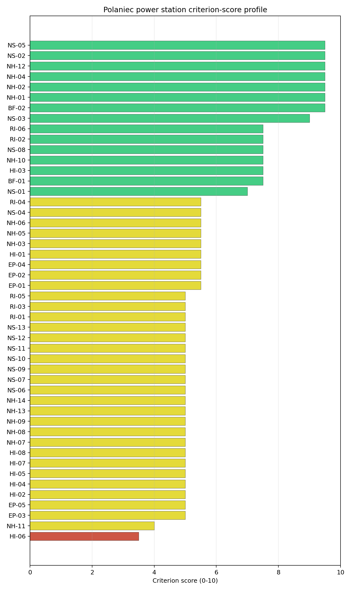

# Polaniec power station Site Profile

Polaniec power station is a coal/thermal site in Poland that has been tested against the NuScale VOYGR-6 reference deployment envelope. This profile reads the screening evidence at a level that supports a decision to progress toward Stage 3 characterization. It is not a site-suitability determination, vendor recommendation, or licensing finding.

## Site Snapshot

| Field | Value |
| --- | --- |
| Site name | Polaniec power station |
| Coordinates | 50.4377, 21.3377 |
| Subnational unit | Świętokrzyskie |
| Installed thermal capacity (source data) | 1,882 MW |
| Composite score (baseline weights) | 6.788 (4.769-7.208 MC band) |
| National stability band | A (top-10% hit rate 100%) |
| National rank | 1 |

_See the country status map in_ [Poland Country Profile](../PL_country_prototype.md#country-status-map).

## Ownership and Coal-to-Nuclear Context

- **ENEA SA** (100.00% share), headquartered in Poland; immediate operator ENEA SA. Path: ENEA SA -> Polaniec power station Unit 8, timepoint 1 [100.0%]
- **Ministry of State Treasury (Poland)** (52.29% share), headquartered in Poland; immediate operator ENEA SA. Path: Ministry of State Treasury (Poland)  -> ENEA SA [52.29%] -> Polaniec power station Unit 3 [100.0%]

Generating units on record: 7 operating, 1 retired.
Earliest unit commissioning: 1979; most recent: 1983.
Retirements span 2011 to 2011, leaving brownfield grid, water, transport, and workforce assets that materially shorten Stage 3 site preparation.

## Natural Hazards (NH)

- **Seismic: Ground Motion (NH-01)** - score 9.5/10 (MC 9.0-10.0), weight 0.0396, data quality high. Evidence: PGA at 475-year return period 0.023 g; PGA at 2,475-year return period 0.054 g; Vs30 reference (m/s): 760.0.
- **Seismic: Surface Rupture (NH-02)** - score 9.5/10 (MC 9.0-10.0), weight n/a, data quality screening grade. Evidence: nearest mapped capable fault 50.0 km; fault slip rate 0 mm/yr; fault name: none_in_search_radius.
- **Geotechnical: Liquefaction (NH-03)** - score 5.5/10 (MC 5.0-6.0), weight n/a, data quality medium. Evidence: liquefaction susceptibility: moderate; dominant soil type: loam.
- **Geotechnical: Slope Stability (NH-04)** - score 9.5/10 (MC 9.0-10.0), weight n/a, data quality screening grade. Evidence: site slope 2.54 deg; max slope in 1 km box 23.7 deg; slope stability class: gentle.
- **Geotechnical: Subsidence (NH-05)** - score 5.5/10 (MC 5.0-6.0), weight 0.0308, data quality medium. Evidence: karst present: no; karst severity: moderate; formation type: carbonate (Discontinuous carbonate rocks).
- **Geotechnical: Foundation (NH-06)** - score 5.5/10 (MC 5.0-6.0), weight 0.0220, data quality medium. Evidence: bearing capacity 87.3 kPa; depth to bedrock 19.9 m.
- **Volcanism (NH-07)** - score 5.0/10 (MC 5.0-5.0), weight n/a, data quality high. Evidence: volcanic hazard class: negligible.
- **Coastal Flooding (NH-08)** - score 5.0/10 (MC 5.0-5.0), weight 0.0264, data quality low. Evidence: values not in measurement tables.
- **River Flooding (NH-09)** - score 5.0/10 (MC 5.0-5.0), weight 0.0352, data quality insufficient. Evidence: flood zone class: negligible.
- **Extreme Winds (NH-10)** - score 7.5/10 (MC 7.0-8.0), weight n/a, data quality medium. Evidence: design wind speed 9.84 m/s.
- **Extreme Precipitation (NH-11)** - score 4.0/10 (MC 4.0-4.0), weight 0.0132, data quality medium. Evidence: extreme daily precipitation 0.25 mm; mean annual precipitation 23.6 mm/yr.
- **Extreme Temperatures (NH-12)** - score 9.5/10 (MC 9.0-10.0), weight 0.0176, data quality medium. Evidence: extreme high temperature 23.2 deg C; extreme low temperature -7.76 deg C.
- **Forest/Wildfire (NH-13)** - score 5.0/10 (MC 5.0-5.0), weight 0.0132, data quality n/a. Evidence: values not in measurement tables.
- **Combined Hazards (NH-14)** - score 5.0/10 (MC 5.0-5.0), weight 0.0132, data quality n/a. Evidence: values not in measurement tables.

### Interpretation - Natural Hazards (NH)

<!-- specialist key=family_natural_hazards scope=site site_id=2981a12d-3444-4301-96ba-a63ef50bec3e bundle=PL_polaniec_power_station_site_bundle.json status=filled by=cursor-agent filled_at=2026-05-03T17:18:54Z -->
Natural hazards at Połaniec sit in the same favourable Polish-platform envelope as Opole and Dolna Odra, with NH-09 river flooding on the Vistula floodplain the principal natural-hazard question. **NH-01 Seismic: Ground Motion at 9.5/10** carries a 475-yr PGA of just **0.023 g** and a 2,475-yr PGA of **0.054 g** — both two orders of magnitude below the 0.5 g project Phase-2 avoidance threshold and consistent with the Polish-platform tectonic context (Świętokrzyskie / Sandomierz basin). **NH-02 Seismic: Surface Rupture at 9.5/10** carries no mapped capable fault inside the 50 km screening search radius. **NH-04 Geotechnical: Slope Stability at 9.5/10** carries a mean site slope of just **2.54°** with a maximum slope of 23.7° on a `gentle` slope-stability class — the Vistula floodplain terrace is essentially flat. NH-03 reads 5.5/10 with `moderate` liquefaction susceptibility on a loam profile (the alluvial Vistula context warrants Stage 3 CPT characterisation, particularly given the river-terrace position). **NH-05 Geotechnical: Subsidence at 5.5/10** reads on `moderate` karst severity in a `discontinuous carbonate rocks` formation type — the Świętokrzyskie carbonate units extend into the Vistula valley sub-surface and Stage 3 karst-specific geophysics will be needed (the same finding as at Opole). **NH-06 Geotechnical: Foundation at 5.5/10** reads on a 87.3 kPa screening-proxy bearing capacity over 19.9 m to bedrock. Extreme meteorology is calm: a 50-yr design wind of **9.84 m/s** (NH-10 at 7.5/10) and an extreme temperature range of -7.76 °C to 23.2 °C are well inside the project envelope (NH-12 at 9.5/10). NH-11 sits at 4.0/10 on the screening proxy. **NH-09 River Flooding** reads 5.0/10 on `insufficient` data quality and is the binding natural-hazard question for the site: Połaniec sits at **164.78 m elevation on the Vistula floodplain terrace** (well above sea level but inside the wider Vistula flood envelope, with the 2010 Vistula floods a recent reference event). The existing thermal complex sits behind site-specific flood defences, but the SMR foundation envelope and EPZ siting will need to be re-characterised against SSR-1 design-basis flood requirements with explicit modelling of historical reference events and climate-projected return periods. NH-07 reads 5.0/10 (`negligible` volcanic hazard); NH-08 is inconclusive (the inland 164 m elevation removes the coastal-flooding case). The Stage 3 priority order is therefore: commission a site-specific Vistula flood-hazard study with explicit modelling of the 2010 reference event and climate-projected return periods so NH-09 lifts off the `insufficient` read; commission karst-specific geophysics so NH-05 settles against the Świętokrzyskie carbonate context; and commission a CPT campaign on the alluvial Vistula-terrace profile so NH-03 settles on a measured liquefaction-susceptibility value.
<!-- /specialist key=family_natural_hazards -->

## Human-Induced and Security-Relevant Hazards (HI)

- **Aircraft Crash (HI-01)** - score 5.5/10 (MC 5.0-6.0), weight 0.0308, data quality high. Evidence: nearest airport 8.02 km; nearest flight path 4.01 km; airports within search radius 3; airport name: Górki Airfield; airport type: small_airport.
- **Industrial Explosions (HI-02)** - score 5.0/10 (MC 5.0-5.0), weight 0.0308, data quality high. Evidence: nearest industrial site 23.0 km.
- **Toxic/Gas Releases (HI-03)** - score 7.5/10 (MC 7.0-8.0), weight 0.0308, data quality high. Evidence: nearest toxic source 23.0 km.
- **External Fires (HI-04)** - score 5.0/10 (MC 5.0-5.0), weight 0.0264, data quality high. Evidence: values not in measurement tables.
- **Transport Hazards (HI-05)** - score 5.0/10 (MC 5.0-5.0), weight 0.0264, data quality n/a. Evidence: values not in measurement tables.
- **Military Installations (HI-06)** - score 3.5/10 (MC 3.0-4.0), weight 0.0264, data quality medium. Evidence: nearest military installation 22.8 km; military installations within radius 3; installation name: 34 Batalion Lekkiej Piechoty w Tarnobrzegu.
- **Electromagnetic Interference (HI-07)** - score 5.0/10 (MC 5.0-5.0), weight 0.0088, data quality medium. Evidence: nearest high-power transmitter 0.45 km; transmitters within radius 101; transmitter type: lighting.
- **Other Nuclear Installations (HI-08)** - score 5.0/10 (MC 5.0-5.0), weight 0.0132, data quality n/a. Evidence: values not in measurement tables.

### Interpretation - Human-Induced and Security-Relevant Hazards (HI)

<!-- specialist key=family_human_hazards scope=site site_id=2981a12d-3444-4301-96ba-a63ef50bec3e bundle=PL_polaniec_power_station_site_bundle.json status=filled by=cursor-agent filled_at=2026-05-03T17:18:54Z -->
Human-induced and security-relevant hazards at Połaniec carry a binding **HI-01 caution at 5.5/10** from the Górki Airfield 8.02 km from the site, with the rest of the family in the favourable-to-middle band. **HI-01 Aircraft Crash** is the principal HI finding: the **Górki Airfield (`small_airport`) at 8.02 km** sits inside the SSG-35 A1 10 km screening exclusion radius for general-aviation airfields under 10 km, with the nearest flight-path projection at **4.01 km** — also inside the 8 km project A4 flight-path projection trigger and inside the 5 km regulatory floor for airport stand-off. Górki is a local sport / recreational airfield with low-energy operator-controlled traffic and a known traffic profile, but the dual screening flag (both airport distance and flight-path projection inside the trigger envelopes) requires a focused Stage 3 SSG-79 hazard assessment. **HI-06 Military Installations at 3.5/10** carries the nearest military installation at **22.8 km** with **3 features inside the 25 km radius** — the lightest military-cadastre footprint of the Polish portfolio (compared to 47 features at the cross-border Dolna Odra and the screening artefact at Opole) and well outside the 8 km project A6 trigger; the criterion is informational rather than binding. **HI-02 Industrial Explosions at 5.0/10 and HI-03 Toxic / Gas Releases at 7.5/10** read on `high` data quality with the nearest industrial site / toxic source at **23.0 km** (comfortably outside the project A2 explosion / toxic envelope) — the Toxic / Gas Releases reading is one of the strongest of the first-batch cohort. HI-04 holds at 5.0/10 on `high` data quality. HI-05 sits at 5.0/10. HI-07 reads 5.0/10 with the nearest broadcast feature at 0.45 km (a lighting feature inside the existing thermal complex) and **101 transmitters inside the EMI search radius** (a moderate broadcast environment, lighter than Opole and Dolna Odra). HI-08 is null. The Stage 3 priority order is therefore: commission an SSG-79 aircraft-crash hazard assessment for the Górki Airfield with explicit modelling of the operator-controlled flight profile so HI-01 lifts off the dual screening caution (this is the binding HI question for the site); engage the Polish Ministry of National Defence on the 3 HI-06 features (a routine informational engagement rather than a binding question); commission an EMI envelope study against the 101-transmitter cadastre so HI-07 settles against the broadcast environment; and run the Polish national hazmat-corridor and external-fire surveys so HI-04 and HI-05 lift off the screening default.
<!-- /specialist key=family_human_hazards -->

## Radiological Impact and Emergency Planning (RI / EP)

- **Emergency Planning Feasibility (EP-01)** - score 5.5/10 (MC 5.0-6.0), weight n/a, data quality high. Evidence: EP feasibility composite 43.5 /100; road sub-score 44.5 /100; special-population sub-score 10.0 /100; geography sub-score 95.0 /100; population sub-score 80.0 /100; evacuation feasible: yes.
- **Evacuation Routes (EP-02)** - score 5.5/10 (MC 5.0-6.0), weight 0.0264, data quality medium. Evidence: road density in EPZ 0.542 km/km2; road length in EPZ 1,064 km; motorway access: no.
- **Physical Geography Constraints (EP-03)** - score 5.0/10 (MC 5.0-5.0), weight 0.0220, data quality medium. Evidence: waterways crossing EPZ 0; major river barrier: no.
- **Special Populations (EP-04)** - score 5.5/10 (MC 5.0-6.0), weight 0.0264, data quality medium. Evidence: hospitals in EPZ 15; prisons in EPZ 1; care homes in EPZ 0.
- **Concurrent Hazard Impact (EP-05)** - score 5.0/10 (MC 5.0-5.0), weight 0.0176, data quality n/a. Evidence: values not in measurement tables.
- **Atmospheric Dispersion (RI-01)** - score 5.0/10 (MC 5.0-5.0), weight 0.0264, data quality medium. Evidence: annual mean wind speed 1.35 m/s; atmospheric mixing height 548.5 m; prevailing wind direction: WSW.
- **Surface Water Dispersion (RI-02)** - score 7.5/10 (MC 7.0-8.0), weight 0.0220, data quality n/a. Evidence: values not in measurement tables.
- **Groundwater Dispersion (RI-03)** - score 5.0/10 (MC 5.0-5.0), weight 0.0220, data quality medium. Evidence: aquifer type: low permeability.
- **Population Density at EPZ Radii (RI-04)** - score 5.5/10 (MC 5.0-6.0), weight 0.0352, data quality screening grade. Evidence: population density within 5 km 155.2 /km2; population density within 16 km 89.2 /km2; population density within 25 km 117.3 /km2; population density within 80 km 138.7 /km2; population within 25 km 230,209 people.
- **Distance to Population Centres (RI-05)** - score 5.0/10 (MC 5.0-5.0), weight 0.0441, data quality screening grade. Evidence: nearest city above 50k people 52.8 km; nearest city population 103,129 people; city name: Tarnów.
- **Population Projections (RI-06)** - score 7.5/10 (MC 7.0-8.0), weight 0.0220, data quality screening grade. Evidence: annual population growth rate -0.121 %/yr; projected population at 25 km in 60 yr 180,924 people.

### Interpretation - Radiological Impact and Emergency Planning (RI / EP)

<!-- specialist key=family_radiological_emergency scope=site site_id=2981a12d-3444-4301-96ba-a63ef50bec3e bundle=PL_polaniec_power_station_site_bundle.json status=filled by=cursor-agent filled_at=2026-05-03T17:18:54Z -->
Radiological-impact and emergency-planning conditions at Połaniec are middle-band across the family with the **EP-04 special-population sub-score at 10/100** the binding driver of the EP composite drag. The DRV-02 emergency-planning composite reads **43.5/100 with `evacuation feasible: yes`** — the lowest EP-01 composite of the Polish portfolio (Opole 53.4, Dolna Odra 69.0) and below all other first-batch sites except the Macedonian portfolio — supported by sub-scores on geography (95/100) and population (80/100), pulled down by a **special-population sub-score of 10/100** (driven by the 15 hospitals and 1 prison inside the 16 km EPZ from the wider Sandomierz / Połaniec healthcare estate) and a road sub-score of 44.5/100. **EP-02 Evacuation Routes at 5.5/10** reads on a road density of **0.542 km/km² inside the EPZ** with **1,064 km of road length** but **no motorway access** — the EPZ road network is dense by first-batch-cohort standards but lacks direct motorway connectivity, making the cross-EPZ evacuation logistics dependent on the lower-grade national-road network. **EP-04 Special Populations at 5.5/10** reflects the 15-hospital count. Population context is moderate: **5 km density 155.2 p/km², 16 km 89.2 p/km², 25 km 117.3 p/km², 80 km 138.7 p/km²** on a 25 km cumulative population of **230,209 people** — RI-04 reads 5.5/10. The **nearest city above 50k people is Tarnów at 52.8 km with a population of 103,129**, the most-distant nearest-city read of the Polish portfolio (Opole 8.44 km, Dolna Odra 26.8 km) — a structural radiological-impact tailwind reflecting the rural Sandomierz-basin context. The 60-yr projection at 25 km is 180,924 people on a -0.121 %/yr growth track (the Świętokrzyskie region is depopulating); RI-06 reads 7.5/10. **RI-02 Surface Water Dispersion at 7.5/10** reads on the major-river Vistula hydraulic envelope. The atmospheric envelope is calm: **1.35 m/s annual mean wind speed** with a **548 m mixing height** and a WSW prevailing direction; RI-01 sits at 5.0/10. RI-03 reads 5.0/10 on a `low permeability` aquifer (in contrast to the alluvial sedimentary-sands aquifers at Opole and Dolna Odra; the Sandomierz-basin basement is generally tight, which is favourable for groundwater-pathway containment but constrains supplementary-cooling options). RI-05 reads 5.0/10 on `screening grade`. EP-03 reads 5.0/10 (no major river barrier inside the EPZ — the Vistula runs along the site boundary but does not cut the EPZ in two), and EP-05 sits at 5.0/10. The Stage 3 priority order is therefore: engage the Świętokrzyskie regional emergency-planning authority on the 15 hospitals and 1 prison inside the EPZ so EP-04 settles on a defensible operational evacuation plan covering the 16-feature special-population estate (this is the binding emergency-planning question for the site); scope the EPZ road-network upgrade plan (particularly motorway access) with the Polish Ministry of Transport so EP-02 lifts off the no-motorway constraint; commission the project-specific micro-meteorological station so RI-01 settles on a measured wind rose against the Vistula-valley terrace; and commission the Stage 3 hydrogeological survey on the `low permeability` Sandomierz-basin aquifer so RI-03 settles on measured permeability and connectivity values.
<!-- /specialist key=family_radiological_emergency -->

## Non-Safety and Implementation Considerations (NS)

- **Grid Capacity Basic Filter (BF-01)** - score 7.5/10 (MC 7.0-8.0), weight 0.0352, data quality n/a. Evidence: values not in measurement tables.
- **Land Area Basic Filter (BF-02)** - score 9.5/10 (MC 9.0-10.0), weight 0.0220, data quality n/a. Evidence: values not in measurement tables.
- **Cooling Water Availability (NS-01)** - score 7.0/10 (MC 7.0-7.0), weight n/a, data quality screening grade. Evidence: distance to cooling source 0.29 km; cooling source flow 236.2 m3/s; cooling source type: major_river; cooling source name: Wisła; water stress label: Low-Medium.
- **Grid Connection (NS-02)** - score 9.5/10 (MC 9.0-10.0), weight 0.0352, data quality medium. Evidence: nearest substation 0.69 km; nearest high-voltage line 0.17 km; highest nearby line voltage 400.0 kV; grid export capacity 1,558 MW; substations within radius 204; HV lines within radius 450.
- **Transport Access (NS-03)** - score 9.0/10 (MC 8.0-9.0), weight 0.0352, data quality high. Evidence: nearest highway 1.27 km; nearest rail line 0.13 km; nearest waterway 12.8 km; heavy-haul capable: yes.
- **Site Topography (NS-04)** - score 5.5/10 (MC 5.0-6.0), weight 0.0264, data quality high. Evidence: favourable land cover 48.8 %; moderate land cover 22.3 %; unfavourable land cover 20.4 %; favourable area 114.4 ha; dominant land class: 211.
- **Site Footprint Adequacy (NS-05)** - score 9.5/10 (MC 9.0-10.0), weight 0.0220, data quality high. Evidence: buildable area 116.4 ha; largest contiguous patch 116.4 ha; buildable patch count 19.
- **Existing Infrastructure (NS-06)** - score 5.0/10 (MC 5.0-5.0), weight 0.0220, data quality n/a. Evidence: values not in measurement tables.
- **Environmental Impact (non-rad) (NS-07)** - score 5.0/10 (MC 5.0-5.0), weight 0.0220, data quality n/a. Evidence: values not in measurement tables.
- **Ecological Sensitivity (NS-08)** - score 7.5/10 (MC 7.0-8.0), weight n/a, data quality high. Evidence: natural land cover 20.4 %; distance to nearest Natura 2000 site 2.353 km; distance to nearest protected area 1.782 km; Natura 2000 overlap: no; Natura 2000 sensitivity class: moderate; protected-area overlap: no; protected-area sensitivity class: low; nearest Natura 2000 site: Dolna Wisłoka z Dopływami; Natura 2000 sites within 5 km: 2; nearest protected-area designation: Nature Reserve.
- **Socioeconomic Impact (NS-09)** - score 5.0/10 (MC 5.0-5.0), weight 0.0220, data quality n/a. Evidence: values not in measurement tables.
- **Workforce Availability (NS-10)** - score 5.0/10 (MC 5.0-5.0), weight 0.0176, data quality n/a. Evidence: values not in measurement tables.
- **Coal-to-Nuclear Synergies (NS-11)** - score 5.0/10 (MC 5.0-5.0), weight 0.0264, data quality n/a. Evidence: values not in measurement tables.
- **Regulatory/Political Environment (NS-12)** - score 5.0/10 (MC 5.0-5.0), weight 0.0264, data quality n/a. Evidence: values not in measurement tables.
- **Construction Logistics (NS-13)** - score 5.0/10 (MC 5.0-5.0), weight 0.0176, data quality n/a. Evidence: values not in measurement tables.

### Interpretation - Non-Safety and Implementation Considerations (NS)

<!-- specialist key=family_infrastructure scope=site site_id=2981a12d-3444-4301-96ba-a63ef50bec3e bundle=PL_polaniec_power_station_site_bundle.json status=filled by=cursor-agent filled_at=2026-05-03T17:18:54Z -->
Non-safety and implementation conditions at Połaniec are exceptionally strong on grid, transport, cooling-water, and footprint axes — the most-favourable NS envelope of the Polish portfolio after Opole. **NS-02 Grid Connection at 9.5/10** carries an exceptional grid-inheritance read: the nearest substation is **0.69 km** from the site and the nearest high-voltage line is **0.17 km away** at **400 kV** (the highest project transmission tier), with **204 substations and 450 HV lines inside the search radius** and a measured **grid-export capacity of 1,558 MW** matching the existing 1,882 MW thermal block — a 6-module VOYGR-6 deployment (~462 MWe) would absorb only a fraction of the inherited transmission envelope, and the brownfield grid-inheritance argument is unambiguous. **NS-03 Transport Access at 9.0/10** reads on a `high` data quality with the nearest highway at **1.27 km**, the nearest **rail line at 0.13 km**, the nearest waterway at 12.8 km (the Vistula is alongside the site but the navigable section for SMR module delivery sits further downstream), and **heavy-haul capable: yes** — among the strongest transport-access reads of the first-batch cohort. **NS-01 Cooling Water Availability at 7.0/10** carries cooling water from the **Vistula river at 0.29 km from the site** with a measured flow of **236.2 m³/s** on a `Low-Medium` water-stress label — direct cooling-water inheritance from the existing thermal block, with adequate flow margin for a 6-module deployment. **NS-05 Site Footprint Adequacy at 9.5/10** carries **116.4 ha buildable area as the largest contiguous patch** across 19 patches — comfortably exceeds the project basic threshold and accommodates the multi-module deployment envelope. **NS-04 Site Topography at 5.5/10** reads on **48.8% favourable land cover, 22.3% moderate, and 20.4% unfavourable** on 114.4 ha of favourable area in the wider site environs. **NS-08 Ecological Sensitivity at 7.5/10** is the family caution: the site is **2.353 km from the Dolna Wisłoka z Dopływami Natura 2000 site** with **2 Natura 2000 sites inside the 5 km radius** on a `moderate` Natura 2000 sensitivity class (no overlap), and the nearest protected area at 1.782 km on the Nature Reserve designation with `low` sensitivity. The Dolna Wisłoka tributary protects a network of riparian and floodplain habitats; the screening read of `moderate` sensitivity with no overlap is a substantively lighter ecological constraint than at Dolna Odra (`high` sensitivity) and the Stage 3 ecological-impact assessment can proceed against an Article 6.3 appropriate-assessment framework. **BF-01 Grid Capacity Basic Filter at 7.5/10 and BF-02 Land Area Basic Filter at 9.5/10** confirm the basic filters. NS-06, NS-07, NS-09 to NS-13 sit at the pass-mark default of 5.0/10. The Stage 3 priority order is therefore: commission an Article 6.3 Natura 2000 appropriate assessment for the Dolna Wisłoka z Dopływami site so NS-08 settles on a defensible ecological envelope; commission a multi-year hydrological survey on the Vistula cooling envelope under climate-projected dry-summer conditions; engage Polish workforce-supply institutions on the existing ENEA personnel pool for the C2N transition so NS-10 and NS-11 settle on defensible measured values; and run the construction-logistics, regulatory, and socioeconomic surveys so NS-09 to NS-13 lift off the screening default.
<!-- /specialist key=family_infrastructure -->

## Composite Score and Stability

Baseline composite score is 6.788, bracketed by Monte Carlo at 4.769-7.208. National stability band is `A` with a top-10% hit rate of 100% across 16 scored Monte Carlo scenarios.

<!-- specialist key=stability scope=site site_id=2981a12d-3444-4301-96ba-a63ef50bec3e bundle=PL_polaniec_power_station_site_bundle.json status=filled by=cursor-agent filled_at=2026-05-03T17:18:54Z -->
Połaniec's composite of **6.788 (Monte Carlo 4.769–7.208)** is the highest score of the first-batch cohort and one of the strongest in the regional cohort, narrowly ahead of Opole (6.580) and Dolna Odra (5.948): the **national stability band is `A`** with a top-10% hit rate of **100% across 16 scored Monte Carlo scenarios** and a top-5% rate also at **100%**, and the **regional stability band is also `A`** with a top-10% hit rate of **100%** across the regional Monte Carlo — Połaniec is the second clear-cut Polish national candidate alongside Opole and is structurally robust under all explored Monte Carlo perturbations. The composite is anchored by NH-01 seismic ground motion (contribution 0.376 from a 9.5/10 score at the largest natural-hazard weight — the structurally aseismic Polish-platform context), NS-02 grid connection (0.334 from a 9.5/10 score at the second-largest infrastructure weight — the 1,558 MW grid-export envelope at 400 kV is the same first-tier inheritance as at Opole), NS-03 transport access (0.317 from a 9.0/10 score — the rail-and-highway adjacency on the Vistula river), BF-01 grid capacity (0.264), HI-03 toxic / gas releases (0.231 from the 7.5/10 score — the 23.0 km nearest-toxic-source distance is one of the strongest of the first-batch cohort), and RI-05 distance to population centres (0.221 — the 52.8 km Tarnów distance is the most-distant of the Polish portfolio). The drag features are limited and all retirable: HI-06 Military Installations (3.5/10 — informational), HI-01 Aircraft Crash (5.5/10 — the binding caution from the Górki Airfield), NH-11 Extreme Precipitation (4.0/10 on the screening proxy), and EP-04 Special Populations (5.5/10 reflecting the 15 hospitals inside the EPZ). The plain-English read is that **Połaniec is the unambiguous Polish national reference SMR candidate alongside Opole** — the structurally aseismic platform context, the 1,558 MW grid-export capacity at 400 kV, the 116.4 ha single-patch buildable footprint, the rail-and-Vistula logistics envelope, and the favourable Sandomierz-basin radiological context (the most-distant nearest-city read of the Polish portfolio at 52.8 km to Tarnów) together make this a textbook coal-to-nuclear case. The Monte Carlo lower bound at 4.769 is well above the avoidance Pareto frontier of the Polish portfolio. The Stage 3 work needed to retire the residual screening flags (HI-01 SSG-79 assessment for the Górki Airfield, EP-04 emergency-planning matrix, NS-08 Natura 2000 appropriate assessment for the Dolna Wisłoka site) is a routine programme-of-work commitment proportionate to a Stage-3 nuclear-licensing case. Połaniec should be advanced as a leading Polish national candidate jointly with Opole; the Polish portfolio supports a multi-site coal-to-nuclear transition rather than a single anchor candidate.
<!-- /specialist key=stability -->

## Residual Risk Register

<!-- specialist key=residual_risk scope=site site_id=2981a12d-3444-4301-96ba-a63ef50bec3e bundle=PL_polaniec_power_station_site_bundle.json status=filled by=cursor-agent filled_at=2026-05-03T17:18:54Z -->
| Criterion | Description | Owner | Resolution path |
| --- | --- | --- | --- |
| HI-01 Aircraft Crash | Górki Airfield at 8.02 km inside SSG-35 A1 10 km exclusion radius; flight-path projection at 4.01 km inside 8 km A4 trigger. | Security/Safety | SSG-79 aircraft-crash hazard assessment with explicit modelling of operator-controlled flight profile against SMR airframe envelope. |
| EP-04 Special Populations | 15 hospitals and 1 prison inside 16 km EPZ; special-population sub-score 10/100 drives EP composite drag. | Emergency Planning | Site-specific operational evacuation plan with Świętokrzyskie regional emergency-planning authority for the 16-feature special-population estate. |
| EP-02 Evacuation Routes | EPZ road density 0.542 km/km² but no motorway access; cross-EPZ logistics dependent on lower-grade national-road network. | Emergency Planning | EPZ road-network upgrade plan with Polish Ministry of Transport; assess motorway connectivity options. |
| NS-08 Ecological Sensitivity | Dolna Wisłoka z Dopływami Natura 2000 site at 2.353 km on `moderate` sensitivity class with 2 sites in 5 km radius; Nature Reserve at 1.782 km. | Environmental | Article 6.3 Natura 2000 appropriate assessment for the Dolna Wisłoka tributary network. |
| NH-09 River Flooding | Site at 164.78 m elevation on the Vistula floodplain terrace; binding natural-hazard question on `insufficient` data quality. | Hydrology | Site-specific Vistula flood-hazard study; explicit modelling of 2010 reference event and climate-projected return periods against SMR foundation envelope. |
| NH-05 Geotechnical Subsidence | `Moderate` karst severity in `discontinuous carbonate rocks` formation type; Świętokrzyskie carbonate units extend into Vistula valley sub-surface. | Geotechnical | Karst-specific geophysics campaign across the buildable envelope. |
| NS-01 Cooling Water (climate) | Vistula cooling envelope at 236.2 m³/s flow on `Low-Medium` water-stress label; vulnerable to climate-projected dry-summer minima. | Cooling Systems | Multi-year hydrological survey on Vistula cooling envelope under climate-projected dry-summer conditions; alignment with Vistula-basin water-management plan. |
| RI-01 Atmospheric Dispersion | Annual mean wind speed 1.35 m/s with 548 m mixing height; WSW prevailing direction (away from Sandomierz). | Radiological | Project-specific micro-meteorological station (≥ 12 months) on the Vistula-valley terrace. |
| RI-03 Groundwater Dispersion | `Low permeability` Sandomierz-basin aquifer; favourable for groundwater-pathway containment but constrains supplementary-cooling options. | Radiological | Stage 3 hydrogeological survey; characterise vertical and lateral connectivity for routine-effluent envelope. |
<!-- /specialist key=residual_risk -->

## Stage 3 Follow-Up Checklist

- [ ] Resolve **Aircraft Crash (HI-01)** avoidance flag - measured {"nearest_airport_km": 8.02, "nearest_airport_type": "small_airport"} vs threshold A1 — SSG-35: general-aviation / small airport < 10 km..
- [ ] Re-measure **Military Installations (HI-06)** - native score 3.5/10 with confidence medium.
- [ ] Re-measure **Extreme Precipitation (NH-11)** - native score 4.0/10 with confidence medium.
- [ ] Re-measure **Physical Geography Constraints (EP-03)** - native score 5.0/10 with confidence medium.
- [ ] Re-measure **Concurrent Hazard Impact (EP-05)** - native score 5.0/10 with confidence insufficient.
- [ ] Re-measure **Industrial Explosions (HI-02)** - native score 5.0/10 with confidence high.
- [ ] Improve data quality for **Geotechnical: Subsidence & Collapse (NH-05b)** - current flag `low`.
- [ ] Improve data quality for **Coastal Flooding (NH-08)** - current flag `low`.

## Evidence Limitations

- Geotechnical: Subsidence & Collapse (NH-05b) - quality `low`.
- Coastal Flooding (NH-08) - quality `low`.
