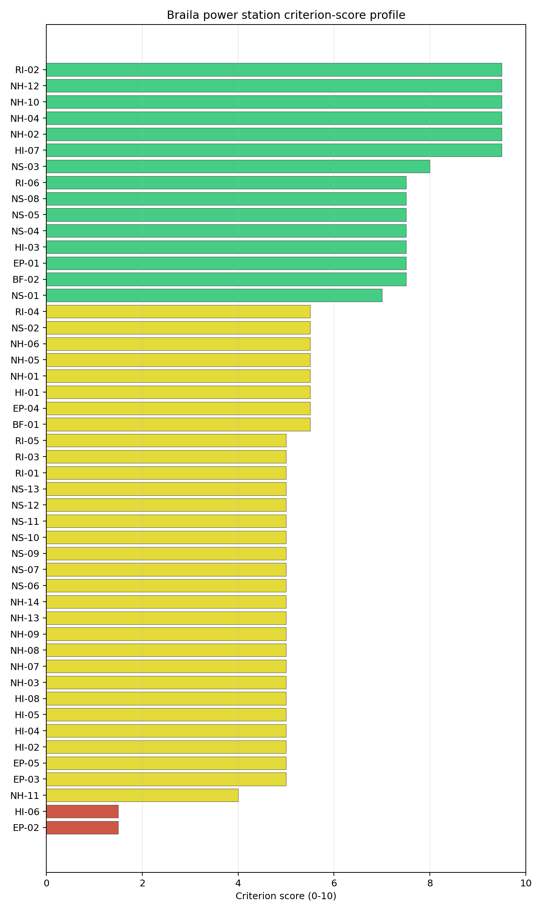
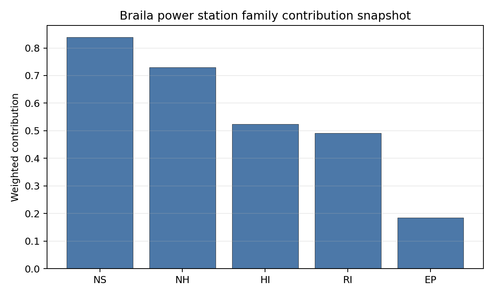

# Braila power station Site Profile

Braila power station is a coal/thermal site in Romania that has been tested against the NuScale VOYGR-6 reference deployment envelope. This profile reads the screening evidence at a level that supports a decision to progress toward Stage 3 characterization. It is not a site-suitability determination, vendor recommendation, or licensing finding.

## Site Snapshot

| Field | Value |
| --- | --- |
| Site name | Braila power station |
| Coordinates | 45.1650, 27.9234 |
| Subnational unit | Braila |
| Installed thermal capacity (source data) | 850 MW |
| Composite score (baseline weights) | 5.819 (4.341-6.241 MC band) |
| National stability band | B (top-10% hit rate 94%) |
| National rank | 3 |

_See the country status map in_ [Romania Country Profile](../RO_country_prototype.md#country-status-map).

## Ownership and Coal-to-Nuclear Context

Generating units on record: 1 retired.
Retirements span 2013 to 2013, leaving brownfield grid, water, transport, and workforce assets that materially shorten Stage 3 site preparation.

## Natural Hazards (NH)

- **Seismic: Ground Motion (NH-01)** - score 5.5/10 (MC 5.0-6.0), weight 0.0396, data quality high. Evidence: PGA at 475-year return period 0.212 g; PGA at 2,475-year return period 0.369 g; Vs30 reference (m/s): 760.0.
- **Seismic: Surface Rupture (NH-02)** - score 9.5/10 (MC 9.0-10.0), weight n/a, data quality screening grade. Evidence: nearest mapped capable fault 50.0 km; fault slip rate 0 mm/yr; fault name: none_in_search_radius.
- **Geotechnical: Liquefaction (NH-03)** - score 5.0/10 (MC 5.0-5.0), weight n/a, data quality medium. Evidence: liquefaction susceptibility: high; dominant soil type: silty_clay_loam.
- **Geotechnical: Slope Stability (NH-04)** - score 9.5/10 (MC 9.0-10.0), weight n/a, data quality screening grade. Evidence: site slope 1.56 deg; max slope in 1 km box 27.1 deg; slope stability class: flat.
- **Geotechnical: Subsidence (NH-05)** - score 5.5/10 (MC 5.0-6.0), weight 0.0308, data quality medium. Evidence: karst present: no; karst severity: none.
- **Geotechnical: Foundation (NH-06)** - score 5.5/10 (MC 5.0-6.0), weight 0.0220, data quality medium. Evidence: bearing capacity 85.3 kPa; depth to bedrock 35.4 m.
- **Volcanism (NH-07)** - score 5.0/10 (MC 5.0-5.0), weight n/a, data quality high. Evidence: volcanic hazard class: negligible.
- **Coastal Flooding (NH-08)** - score 5.0/10 (MC 5.0-5.0), weight 0.0264, data quality low. Evidence: values not in measurement tables.
- **River Flooding (NH-09)** - score 5.0/10 (MC 5.0-5.0), weight 0.0352, data quality medium. Evidence: flood zone class: negligible.
- **Extreme Winds (NH-10)** - score 9.5/10 (MC 9.0-10.0), weight n/a, data quality medium. Evidence: design wind speed 7.65 m/s.
- **Extreme Precipitation (NH-11)** - score 4.0/10 (MC 4.0-4.0), weight 0.0132, data quality medium. Evidence: extreme daily precipitation 0.19 mm; mean annual precipitation 17.4 mm/yr.
- **Extreme Temperatures (NH-12)** - score 9.5/10 (MC 9.0-10.0), weight 0.0176, data quality medium. Evidence: extreme high temperature 27.7 deg C; extreme low temperature -5.8 deg C.
- **Forest/Wildfire (NH-13)** - score 5.0/10 (MC 5.0-5.0), weight 0.0132, data quality n/a. Evidence: values not in measurement tables.
- **Combined Hazards (NH-14)** - score 5.0/10 (MC 5.0-5.0), weight 0.0132, data quality n/a. Evidence: values not in measurement tables.

### Interpretation - Natural Hazards (NH)

<!-- specialist key=family_natural_hazards scope=site site_id=29836b52-a882-4921-95a7-6417e636d9a2 bundle=RO_braila_power_station_site_bundle.json status=filled by=cursor-agent filled_at=2026-05-03T14:19:17Z -->

Natural hazards at Brăila sit in the moderate-seismic, low-meteorological envelope expected for the lower Danube floodplain, with a single material concern in geotechnical liquefaction. PGA at the 475-yr return period is 0.212 g and at the 2,475-yr return period is 0.369 g at a screening-grid distance of 5.1 km from the site centre, the highest seismic loading of the three Romanian first-batch sites and reflective of the Vrancea source zone influence on the eastern plain; both values stay inside the NuScale VOYGR-6 project envelope of 0.5 g at 2,475-yr but the Stage 3 PSHA case is materially stronger here than at the southern-Carpathian sites. The nearest mapped capable fault is at 50 km, so NH-02 settles at 9.5/10 on distance alone. The binding geotechnical concern is **NH-03 Liquefaction Susceptibility**, which classifies the site `high` at screening grade (raw class 4 of 5) over silty-clay-loam soils with a screening-proxy bearing capacity of 85 kPa; depth to bedrock is 35.42 m and the slope-stability class is `flat` (mean slope 1.6°, max 27.1° within the 1 km box). The combination — high liquefaction susceptibility, very flat ground, deep alluvium and a 0.21 g 475-yr PGA — is the single most important Stage 3 priority for this site, because it bears directly on the foundation, anti-liquefaction treatment and seismic-isolation envelope for any NuScale VOYGR-6 module placement. Extreme meteorology is calm: the screening reanalysis (1991-2020) gives a 50-yr gust of 7.6 m/s, an extreme temperature range of -5.8 °C to 27.7 °C, and a flood susceptibility classified `negligible` (annual probability 0.0000 over 484 weekly snapshots). NH-11 (Extreme Precipitation) reads 4.0/10 with a mean annual precipitation of 17 mm/yr and an extreme daily of 0.2 mm, both physically implausible and the same coarse-grid artefact seen at Rovinari and Turceni. NH-04 (Slope Stability) reads 9.5/10 because the 1 km box is genuinely flat (1.3 % above 15°, 0 % above 30°), a notable contrast with the steep canopy artefacts that suppress NH-04 at the Carpathian-foothills sites. The Stage 3 priority order is therefore: commission a site-specific PSHA together with a Cone-Penetration-Test campaign focused on the upper 30 m of alluvium so NH-01 and NH-03 settle on measured Vs30 and liquefaction-susceptibility values rather than coarse-grid screening proxies, and replace the screening precipitation reading with ANM station data.

<!-- /specialist key=family_natural_hazards -->

## Human-Induced and Security-Relevant Hazards (HI)

- **Aircraft Crash (HI-01)** - score 5.5/10 (MC 5.0-6.0), weight 0.0308, data quality high. Evidence: nearest airport 22.2 km; nearest flight path 11.1 km; airports within search radius 1; airport name: Aerial Club Vădeni; airport type: small_airport.
- **Industrial Explosions (HI-02)** - score 5.0/10 (MC 5.0-5.0), weight 0.0308, data quality high. Evidence: nearest industrial site 18.7 km.
- **Toxic/Gas Releases (HI-03)** - score 7.5/10 (MC 7.0-8.0), weight 0.0308, data quality high. Evidence: nearest toxic source 18.7 km.
- **External Fires (HI-04)** - score 5.0/10 (MC 5.0-5.0), weight 0.0264, data quality high. Evidence: values not in measurement tables.
- **Transport Hazards (HI-05)** - score 5.0/10 (MC 5.0-5.0), weight 0.0264, data quality n/a. Evidence: values not in measurement tables.
- **Military Installations (HI-06)** - score 1.5/10 (MC 1.0-2.0), weight 0.0264, data quality medium. Evidence: nearest military installation 8.86 km; military installations within radius 153.
- **Electromagnetic Interference (HI-07)** - score 9.5/10 (MC 9.0-10.0), weight 0.0088, data quality not_found. Evidence: nearest high-power transmitter 0.23 km; transmitters within radius 0; transmitter type: mast.
- **Other Nuclear Installations (HI-08)** - score 5.0/10 (MC 5.0-5.0), weight 0.0132, data quality n/a. Evidence: values not in measurement tables.

### Interpretation - Human-Induced and Security-Relevant Hazards (HI)

<!-- specialist key=family_human_hazards scope=site site_id=29836b52-a882-4921-95a7-6417e636d9a2 bundle=RO_braila_power_station_site_bundle.json status=filled by=cursor-agent filled_at=2026-05-03T14:19:17Z -->

Human-induced and security-relevant hazards at Brăila are dominated by an exceptionally dense military feature count and a single mapped toxic source within a 25 km buffer. The nearest civilian airport is the Aerial Club Vădeni (`small_airport`) at 22.2 km, with the nearest large airport at 99.8 km, the nearest medium at 63.1 km, and one airport inside the 30 km screening radius; the nearest commercial flight path is 11.1 km, which puts HI-01 inside the project pass band and yields a 5.5/10 ranking score. The dominant criterion in the family is **Military Installations (HI-06)** at 1.5/10: the nearest military feature is an unnamed bunker at 8.86 km, with **153 military features** inside the 25 km search radius. As at Rovinari and Turceni the screening records carry no military-type attribute that engages either the A5 firing-range or A6 ammunition-storage avoidance trigger, so HI-06 is held near the floor on distance alone; but the count itself — by far the highest of the three first-batch Romanian sites — converts the HI-06 finding from a single-feature governance question into a regional security-cordon question that needs Romanian Ministry of National Defence engagement before any other characterization is committed at this site. **HI-03 Toxic / Gas Releases** scores 7.5/10 with the nearest screening-inventory toxic-release site at 18.7 km and zero sites inside the 5 km avoidance radius, so the criterion passes the avoidance threshold of 8 km comfortably even though a positive feature is present in the broader area. The three remaining `unscored` rows HI-02 (Industrial Explosions, Seveso/IED), HI-04 (External Fires) and HI-05 (Transport Hazards) all read "no facility within search radius" on the screening pollutant-release inventory and sit at the pass-mark default of 5.0/10. HI-07 Electromagnetic Interference scores 9.5/10 (no high-power transmitters found within 25 km), the highest score in the family. HI-08 (Other Nuclear Installations) is null. The Stage 3 priority order is therefore: open the Ministry of National Defence engagement on the 153 HI-06 features so the regional security context is mapped before any other family work is committed, re-query HI-02, HI-04 and HI-05 against the national Seveso and hazmat-corridor cadastres so the `unscored` rows convert to defensible distances, and re-confirm the 18.7 km HI-03 site identity to support the Stage 3 dispersion modelling.

<!-- /specialist key=family_human_hazards -->

## Radiological Impact and Emergency Planning (RI / EP)

- **Emergency Planning Feasibility (EP-01)** - score 7.5/10 (MC 7.0-8.0), weight n/a, data quality high. Evidence: EP feasibility composite 65.4 /100; road sub-score 39.4 /100; special-population sub-score 90.0 /100; geography sub-score 95.0 /100; population sub-score 80.0 /100; evacuation feasible: yes.
- **Evacuation Routes (EP-02)** - score 1.5/10 (MC 1.0-2.0), weight 0.0264, data quality medium. Evidence: road density in EPZ 0.294 km/km2; road length in EPZ 576.8 km; motorway access: yes.
- **Physical Geography Constraints (EP-03)** - score 5.0/10 (MC 5.0-5.0), weight 0.0220, data quality medium. Evidence: waterways crossing EPZ 0; major river barrier: no.
- **Special Populations (EP-04)** - score 5.5/10 (MC 5.0-6.0), weight 0.0264, data quality medium. Evidence: hospitals in EPZ 21; prisons in EPZ 1; care homes in EPZ 0.
- **Concurrent Hazard Impact (EP-05)** - score 5.0/10 (MC 5.0-5.0), weight 0.0176, data quality n/a. Evidence: values not in measurement tables.
- **Atmospheric Dispersion (RI-01)** - score 5.0/10 (MC 5.0-5.0), weight 0.0264, data quality medium. Evidence: annual mean wind speed 0.91 m/s; atmospheric mixing height 543.5 m; prevailing wind direction: N.
- **Surface Water Dispersion (RI-02)** - score 9.5/10 (MC 9.0-10.0), weight 0.0220, data quality n/a. Evidence: values not in measurement tables.
- **Groundwater Dispersion (RI-03)** - score 5.0/10 (MC 5.0-5.0), weight 0.0220, data quality medium. Evidence: aquifer type: inland water.
- **Population Density at EPZ Radii (RI-04)** - score 5.5/10 (MC 5.0-6.0), weight 0.0352, data quality screening grade. Evidence: population density within 5 km 118.4 /km2; population density within 16 km 237.7 /km2; population density within 25 km 121.0 /km2; population density within 80 km 67.8 /km2; population within 25 km 237,457 people.
- **Distance to Population Centres (RI-05)** - score 5.0/10 (MC 5.0-5.0), weight 0.0441, data quality screening grade. Evidence: nearest city above 50k people 12.7 km; nearest city population 202,740 people; city name: Brăila.
- **Population Projections (RI-06)** - score 7.5/10 (MC 7.0-8.0), weight 0.0220, data quality screening grade. Evidence: annual population growth rate -0.233 %/yr; projected population at 25 km in 60 yr 183,292 people.

### Interpretation - Radiological Impact and Emergency Planning (RI / EP)

<!-- specialist key=family_radiological_emergency scope=site site_id=29836b52-a882-4921-95a7-6417e636d9a2 bundle=RO_braila_power_station_site_bundle.json status=filled by=cursor-agent filled_at=2026-05-03T14:19:17Z -->

Radiological impact and emergency planning at Brăila read as a suburban envelope with elevated population density at the 16 km radius and a binding finding on evacuation routes. Population density at the screening epoch (2020) is 118 p/km² at 5 km, **238 p/km² at 16 km** (the highest of the three first-batch Romanian sites and reflective of the proximity to Brăila city), 121 p/km² at 25 km, and 68 p/km² at 80 km, with a 25 km total of 237,457 people and an 80 km total of 1,363,554; the nearest city above 50,000 people is Brăila (202,740) at 12.7 km, hierarchy `suburban`, with one city above 50k inside the 25 km screening radius and three within 80 km. The trajectory is favourable for a 60-year siting horizon: a -0.233 %/yr national growth rate yields a 25 km projection of 183,292 people in 60 years (down 23 % from 2020), which lifts RI-04 to 5.5/10 and RI-06 to 7.5/10 against the population-projection scoring band. The atmospheric envelope is more diluting than at Rovinari: the screening reanalysis (1991-2020) gives a mean wind speed of 0.9 m/s, a prevailing direction of N (0°), a mean planetary boundary-layer height of 544 m, and a stable-fraction of 42.2 % (stability class C dominant at 57.5 %, class E at 42.2 %); the higher BLH and the lower stable-fraction give a more diluting plume than the southern-Carpathian sites, which is consistent with RI-01 at 5.0/10 with a high-quality dispersion record. The binding criterion in the family is **Evacuation Routes (EP-02)** at 1.5/10: the road density in the EPZ is only 0.294 km/km² over 576.8 km of road and a single major-river barrier is absent, but the EP-01 composite drops to a `roads=39.4` sub-score against `special_pop=90, geography=95, terrain=30, population=80` for an overall composite of 65.4/100 (FEASIBLE). The lower road density and the suburban population gradient combine to produce the worst EP-02 score of any first-batch Romanian site. RI-02 (Surface Water Dispersion) reads 9.5/10 because the Danube provides effectively unbounded dilution capacity (cooling source flow 6,237 m³/s, water stress label `Low`); the criterion is one of the strongest in the family. The Stage 3 priority order is therefore: model EPZ time-to-clear under summer and winter loadings with national IRP-MAI traffic data and the Brăila county network — the EP-02 1.5/10 is the single largest narrative driver against this site — and confirm the Brăila urban-population profile inside the EPZ once the NuScale VOYGR-6 EPZ radius is finalised so RI-04 and RI-05 settle on a measured city-by-city receptor inventory rather than a 5 km-shell average.

<!-- /specialist key=family_radiological_emergency -->

## Non-Safety and Implementation Considerations (NS)

- **Grid Capacity Basic Filter (BF-01)** - score 5.5/10 (MC 5.0-6.0), weight 0.0352, data quality n/a. Evidence: values not in measurement tables.
- **Land Area Basic Filter (BF-02)** - score 7.5/10 (MC 7.0-8.0), weight 0.0220, data quality n/a. Evidence: values not in measurement tables.
- **Cooling Water Availability (NS-01)** - score 7.0/10 (MC 6.0-7.0), weight n/a, data quality screening grade. Evidence: distance to cooling source 1.65 km; cooling source flow 6,237 m3/s; cooling source type: major_river; cooling source name: Danube; water stress label: Low.
- **Grid Connection (NS-02)** - score 5.5/10 (MC 5.0-6.0), weight 0.0352, data quality medium. Evidence: nearest substation 0.23 km; nearest high-voltage line 2.53 km; highest nearby line voltage 110.0 kV; grid export capacity 850.0 MW; substations within radius 70; HV lines within radius 189.
- **Transport Access (NS-03)** - score 8.0/10 (MC 7.0-8.0), weight 0.0352, data quality high. Evidence: nearest highway 3.44 km; nearest rail line 3.52 km; nearest waterway 5.49 km; heavy-haul capable: yes.
- **Site Topography (NS-04)** - score 7.5/10 (MC 7.0-8.0), weight 0.0264, data quality high. Evidence: favourable land cover 69.8 %; moderate land cover 8.2 %; unfavourable land cover 21.6 %; favourable area 179.8 ha; dominant land class: 211.
- **Site Footprint Adequacy (NS-05)** - score 7.5/10 (MC 7.0-8.0), weight 0.0220, data quality high. Evidence: buildable area 41.8 ha; largest contiguous patch 41.8 ha; buildable patch count 6.
- **Existing Infrastructure (NS-06)** - score 5.0/10 (MC 5.0-5.0), weight 0.0220, data quality n/a. Evidence: values not in measurement tables.
- **Environmental Impact (non-rad) (NS-07)** - score 5.0/10 (MC 5.0-5.0), weight 0.0220, data quality n/a. Evidence: values not in measurement tables.
- **Ecological Sensitivity (NS-08)** - score 7.5/10 (MC 7.0-8.0), weight n/a, data quality high. Evidence: natural land cover 21.6 %; distance to nearest Natura 2000 site 1.166 km; distance to nearest protected area 1.275 km; Natura 2000 overlap: no; Natura 2000 sensitivity class: moderate; protected-area overlap: no; protected-area sensitivity class: moderate; nearest Natura 2000 site: Balta Mică a Brăilei; Natura 2000 sites within 5 km: 3; nearest protected-area designation: Natural park.
- **Socioeconomic Impact (NS-09)** - score 5.0/10 (MC 5.0-5.0), weight 0.0220, data quality n/a. Evidence: values not in measurement tables.
- **Workforce Availability (NS-10)** - score 5.0/10 (MC 5.0-5.0), weight 0.0176, data quality n/a. Evidence: values not in measurement tables.
- **Coal-to-Nuclear Synergies (NS-11)** - score 5.0/10 (MC 5.0-5.0), weight 0.0264, data quality n/a. Evidence: values not in measurement tables.
- **Regulatory/Political Environment (NS-12)** - score 5.0/10 (MC 5.0-5.0), weight 0.0264, data quality n/a. Evidence: values not in measurement tables.
- **Construction Logistics (NS-13)** - score 5.0/10 (MC 5.0-5.0), weight 0.0176, data quality n/a. Evidence: values not in measurement tables.

### Interpretation - Non-Safety and Implementation Considerations (NS)

<!-- specialist key=family_infrastructure scope=site site_id=29836b52-a882-4921-95a7-6417e636d9a2 bundle=RO_braila_power_station_site_bundle.json status=filled by=cursor-agent filled_at=2026-05-03T14:19:17Z -->

Non-safety and implementation conditions are the strongest part of Brăila's screening file and the primary reason the site ranks third nationally despite the geotechnical and EP-02 concerns above. Cooling water is essentially unbounded: the Danube sits 1.65 km from the site at an annual mean discharge of **6,237 m³/s** on a stream order 8 reach, with a screening water-stress score of 0.013 (Low) and a depletion ratio of 0.009; the river is cooling-viable for any plausible NuScale VOYGR-6 deployment scale and the existing thermal-station intake works can be inherited rather than rebuilt, which yields NS-01 at 7.0/10 and is the headline brownfield argument for the lower Danube corridor in general. Site topography and footprint are favourable: the dominant land class is non-irrigated arable land at 50.1 %, favourable land cover is 69.8 % over a 256.8 ha screening buildable reference, and the existing industrial polygon for the Brăila plant sits 0.18 km from the centre point. Buildable area is 41.78 ha in a single contiguous patch — the smallest of the three first-batch Romanian sites and a Stage 3 footprint constraint to confirm against the NuScale VOYGR-6 (6-module) layout. NS-04 reads 7.5/10 and NS-05 reads 7.5/10 on this evidence. Ecology is the principal sensitivity: the nearest Natura 2000 site is **Balta Mică a Brăilei** (Special Protection Area, area 25,794 ha) at only 1.166 km, no overlap, sensitivity class `moderate`; six Natura 2000 sites sit within 16 km, eleven within 25 km, and the area fraction of Natura 2000 land within 5 km is 31.27 %. The nearest IUCN protected area (Parcul Natural Balta Mică a Brăilei, IUCN V) is at 1.275 km, no overlap, with the strictest IUCN category in the 25 km buffer being III (a national park is at 22 km). NS-08 settles at 7.5/10 but the Article-6(3) Habitats Directive Appropriate Assessment workload at this site is materially heavier than at Rovinari or Romag Termo and should be costed accordingly. The criterion that drives the family read is **Grid Connection (NS-02)** at 5.5/10: the nearest substation is at 0.23 km with 70 substations in the broader area and 189 HV lines, but the line voltage is 110 kV and the 850 MW export-capacity figure is a screening fallback against the installed-capacity register and carries comfortable headroom over the 462 MWe NuScale VOYGR-6 (6 × 77 MWe modules) reference output. NS-03 (Transport Access) reads 8.0/10 with highway 3.44 km, rail 3.52 km (1435 mm gauge) and a navigable waterway at 5.49 km (Dunărea — Brațul Cravia), heavy-haul capable with high confidence — the only first-batch Romanian site with measured Danube barge access. The Stage 3 priority order is therefore: trigger early Romanian ANANP / ANM scoping on the Balta Mică a Brăilei Natura 2000 site so the Article-6(3) workload is sized before construction commitments, confirm the Transelectrica corridor upgrade pathway to 220 kV / 400 kV for NS-02, and validate the 41.78 ha contiguous buildable patch against the VOYGR-6 (6-module) footprint and lay-down requirements.

<!-- /specialist key=family_infrastructure -->

## Composite Score and Stability

Baseline composite score is 5.819, bracketed by Monte Carlo at 4.341-6.241. National stability band is `B` with a top-10% hit rate of 94% across 16 scored Monte Carlo scenarios.

<!-- specialist key=stability scope=site site_id=29836b52-a882-4921-95a7-6417e636d9a2 bundle=RO_braila_power_station_site_bundle.json status=filled by=cursor-agent filled_at=2026-05-03T14:19:17Z -->

Brăila's baseline composite score is 5.819 with a Monte Carlo bracket of 4.341-6.241, a narrow upside (about 0.4 above the point estimate) and a meaningful downside (about 1.5 below). The downside reflects the high unscored fraction in the underlying criterion set (52.4 % of criteria are at the pass-mark default of 5.0 rather than measured) rather than evidence that any criterion is failing. The national stability band is `B` with a **94 % top-10 % hit rate** across the 16 Monte Carlo weight perturbations the audit considered — by some distance the most stable rank of the three first-batch Romanian sites — which means the site retains a top-10 % ranking under fifteen of every sixteen weight profiles in the sensitivity sweep. The contrast with Rovinari (band D, 38 %) is informative: even though the two sites have nearly identical baseline composites (5.828 vs 5.819), Brăila's family balance places its strongest scores in the criterion families with the broadest weight distributions across the EPRI / IAEA reference profiles, which is why the band rather than the point score is the better predictor of programme-level resilience. Family balance, not a single dominant criterion, drives the composite: the per-category scores read NS 7.06, NH 5.91, RI 5.87, HI 5.41 and EP 3.50, with EP weighed down by the **Evacuation Routes (EP-02)** finding at 1.5/10 (road density 0.294 km/km², worst of the three) and HI carrying the dual drag of a 1.5/10 HI-06 floor and 153 mapped military features in the 25 km buffer. The next characterization effort that would produce the largest narrowing of the composite uncertainty band is therefore the Stage 3 EPZ time-to-clear modelling that lifts EP-02, the Ministry of National Defence engagement on the HI-06 features, and the conversion of the unscored HI-02 / HI-04 / HI-05 / NS-06 / NS-07 / NS-09 to NS-13 rows to measured values; resolving those raises the lower bracket and tightens the 4.341-6.241 envelope without depending on any single high-stakes finding being upgraded.

<!-- /specialist key=stability -->

## Residual Risk Register

<!-- specialist key=residual_risk scope=site site_id=29836b52-a882-4921-95a7-6417e636d9a2 bundle=RO_braila_power_station_site_bundle.json status=filled by=cursor-agent filled_at=2026-05-03T14:19:17Z -->

| Concern                             | Evidence                                                                                                                                                                                                                    | Consequence                                                                                                                                                                                    | Stage 3 action                                                                                                                                                     | Owner discipline   |
| ----------------------------------- | --------------------------------------------------------------------------------------------------------------------------------------------------------------------------------------------------------------------------- | ---------------------------------------------------------------------------------------------------------------------------------------------------------------------------------------------- | ------------------------------------------------------------------------------------------------------------------------------------------------------------------ | ------------------ |
| Liquefaction Susceptibility (NH-03) | Screening grade class 4 of 5 (`high`) on silty-clay-loam soils; bearing capacity 85 kPa; depth to bedrock 35.42 m; 0.21 g 475-yr PGA                                                                                 | Foundation, anti-liquefaction treatment and seismic-isolation envelope undefined for VOYGR-6 module placement on deep alluvium                                                                 | Run a site-specific Cone-Penetration-Test campaign over the upper 30 m of alluvium and produce a measured Vs30 profile so NH-03 settles on site-specific evidence  | geotechnical       |
| Evacuation Routes (EP-02)           | Road density in EPZ 0.294 km/km², total road length 576.8 km, motorway access present, EP-01 composite 65.4/100 (FEASIBLE) with `roads=39` sub-score                                                                        | Lower road density and the suburban Brăila population gradient combine to produce the worst EP-02 score of any first-batch Romanian site; potential overrun of national IRP-MAI clearance time | Model EPZ time-to-clear under summer and winter loadings using IRP-MAI traffic data and the Brăila county network                                                  | emergency planning |
| Military Installations (HI-06)      | Nearest military feature at 8.86 km; **153 features** within the 25 km search radius; military-type attribute absent on each screening record                                                                                          | Regional security-cordon question rather than a single-feature one; the highest military feature count in the first batch and a candidate for a structural HI-06 finding                           | Open Romanian Ministry of National Defence engagement to characterize the 153 features by class and confirm any airspace or cordon overlap with the EPZ            | security           |
| Ecological Sensitivity (NS-08)      | Natura 2000 "Balta Mică a Brăilei" (Special Protection Area, 25,794 ha) at 1.166 km, no overlap; area fraction 31.27 % within 5 km; six Natura 2000 sites within 16 km; Parcul Natural Balta Mică a Brăilei (IUCN V) at 1.275 km | Article-6(3) Habitats Directive Appropriate Assessment workload materially heavier than at the other first-batch Romanian sites; permitting timeline risk                                      | Trigger early Romanian ANANP / ANM scoping on Balta Mică a Brăilei so the Article-6(3) workload is sized before construction commitments                           | EIA                |
| Site Footprint Adequacy (NS-05)     | Buildable area 41.78 ha in a single contiguous patch (smallest of the first-batch Romanian sites); screening buildable reference 256.8 ha                                                                                      | The 41.78 ha contiguous patch is tight against a NuScale VOYGR-6 (6 × 77 MWe modules) layout plus lay-down requirements; may force module-count compromise                                                | Validate the contiguous patch against the VOYGR-6 footprint and lay-down requirements; consider partial overlap with the existing industrial polygon | site engineering   |
| Grid Connection (NS-02)             | Nearest substation 0.23 km, nearest HV line 2.53 km at 110 kV; 850 MW export capacity (screening fallback against the installed-capacity register)                                                                | 110 kV interconnection is below the 220-400 kV typically preferred for new nuclear; the 850 MW export capacity exceeds the 462 MWe NuScale VOYGR-6 (6 × 77 MWe modules) reference output, leaving headroom for the certified VOYGR-6 envelope without invoking any uncertified larger configuration                                       | Confirm Transelectrica corridor upgrade pathway to 220 kV / 400 kV and update NS-02 against the planned topology                                                   | grid               |
| Extreme Precipitation (NH-11)       | Screening reanalysis 1991-2020: mean annual precipitation 17 mm/yr, extreme daily 0.2 mm; SPI12, snow-months and freezing-days not measured                                                                                 | Screening grid is too coarse to set the design rainfall and snow-load envelope; values physically implausible                                                                                  | Re-measure with ANM (Administraţia Naţională de Meteorologie) station data and complete the precipitation sub-criteria                                             | hydrology          |

Two concerns dominate the register. NH-03 is an engineering question: the high liquefaction susceptibility on deep alluvium, combined with the 0.21 g 475-yr PGA, is the single Stage 3 measurement that most affects the cost envelope and module placement at this site. NS-08 is the principal permitting question: the 31 % Natura 2000 area fraction within 5 km converts the Article-6(3) workload from a routine scoping exercise into a programmatic engagement with the Romanian environmental authorities, and triggering it early protects the Stage 3 schedule. The remaining five entries are characterization gaps and engineering precursors rather than findings against the site, and the unique combination of unbounded Danube cooling water, the second-best national stability band, and the lowest water-stress score in the Romanian first batch keeps Brăila in active contention. The register is a Stage 3 work plan, not a deal-breaker list: no avoidance flag is currently failing, and Brăila ranks third nationally (band B, 94 % top-10 % hit rate) on a baseline composite of 5.819.

<!-- /specialist key=residual_risk -->

## Stage 3 Follow-Up Checklist

- [ ] Re-measure **Evacuation Routes (EP-02)** - native score 1.5/10 with confidence medium.
- [ ] Re-measure **Military Installations (HI-06)** - native score 1.5/10 with confidence medium.
- [ ] Re-measure **Extreme Precipitation (NH-11)** - native score 4.0/10 with confidence medium.
- [ ] Re-measure **Physical Geography Constraints (EP-03)** - native score 5.0/10 with confidence medium.
- [ ] Re-measure **Concurrent Hazard Impact (EP-05)** - native score 5.0/10 with confidence insufficient.
- [ ] Improve data quality for **Geotechnical: Subsidence & Collapse (NH-05b)** - current flag `low`.
- [ ] Improve data quality for **Coastal Flooding (NH-08)** - current flag `low`.
- [ ] Improve data quality for **Electromagnetic Interference (HI-07)** - current flag `not_found`.

## Evidence Limitations

- Geotechnical: Subsidence & Collapse (NH-05b) - quality `low`.
- Coastal Flooding (NH-08) - quality `low`.
- Electromagnetic Interference (HI-07) - quality `not_found`.
