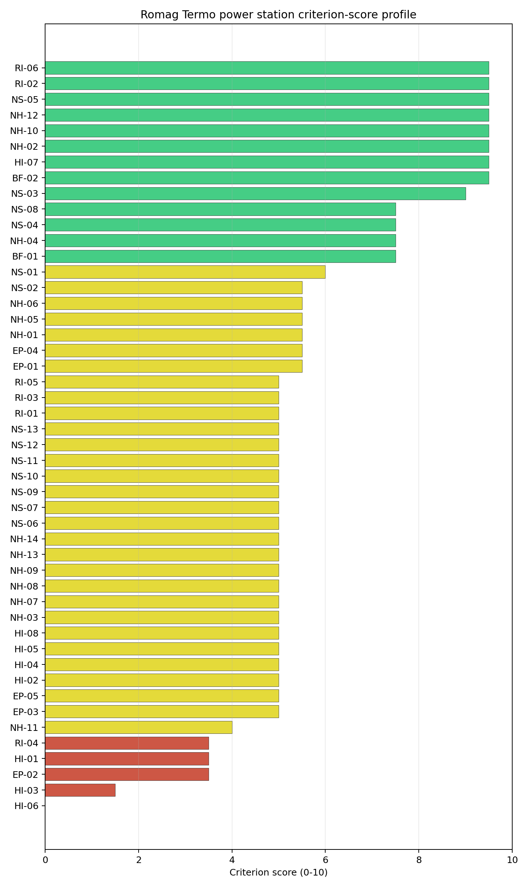

# Romag Termo power station Site Profile

Romag Termo power station is a coal/thermal site in Romania that has been tested against the NuScale VOYGR-6 reference deployment envelope. This profile reads the screening evidence at a level that supports a decision to progress toward Stage 3 characterization. It is not a site-suitability determination, vendor recommendation, or licensing finding.

## Site Snapshot

| Field | Value |
| --- | --- |
| Site name | Romag Termo power station |
| Coordinates | 44.6778, 22.6860 |
| Subnational unit | Mehedinti |
| Installed thermal capacity (source data) | 1,065 MW |
| Composite score (baseline weights) | 5.440 (4.161-5.833 MC band) |
| National stability band | D (top-10% hit rate 12%) |
| National rank | 4 |

_See the country status map in_ [Romania Country Profile](../RO_country_prototype.md#country-status-map).

## Ownership and Coal-to-Nuclear Context

- **Government of Romania** (nan% share), headquartered in Romania; immediate operator Regia Autonomă pentru Activități Nucleare. Path: Government of Romania  -> Regia Autonomă pentru Activități Nucleare  [unknown %] -> Romag Termo power station Unit 3 [100.0%]
- **Regia Autonomă pentru Activități Nucleare** (nan% share), headquartered in Romania; immediate operator Sucursala Romag-Termo. Path: Regia Autonomă pentru Activități Nucleare  -> Sucursala Romag-Termo  [unknown %] -> Romag Termo power station Expansion [100.0%]

Generating units on record: 1 cancelled, 6 retired.
Earliest unit commissioning: 1986; most recent: 1988.
Retirements span 2008 to 2019, leaving brownfield grid, water, transport, and workforce assets that materially shorten Stage 3 site preparation.

## Natural Hazards (NH)

- **Seismic: Ground Motion (NH-01)** - score 5.5/10 (MC 5.0-6.0), weight 0.0396, data quality high. Evidence: PGA at 475-year return period 0.089 g; PGA at 2,475-year return period 0.222 g; Vs30 reference (m/s): 760.0.
- **Seismic: Surface Rupture (NH-02)** - score 9.5/10 (MC 9.0-10.0), weight n/a, data quality screening grade. Evidence: nearest mapped capable fault 50.0 km; fault slip rate 0 mm/yr; fault name: none_in_search_radius.
- **Geotechnical: Liquefaction (NH-03)** - score 5.0/10 (MC 5.0-5.0), weight n/a, data quality medium. Evidence: liquefaction susceptibility: very_low; dominant soil type: clay_loam.
- **Geotechnical: Slope Stability (NH-04)** - score 7.5/10 (MC 7.0-8.0), weight n/a, data quality screening grade. Evidence: site slope 7.38 deg; max slope in 1 km box 81.0 deg; slope stability class: moderate.
- **Geotechnical: Subsidence (NH-05)** - score 5.5/10 (MC 5.0-6.0), weight 0.0308, data quality medium. Evidence: karst present: no; karst severity: none.
- **Geotechnical: Foundation (NH-06)** - score 5.5/10 (MC 5.0-6.0), weight 0.0220, data quality medium. Evidence: bearing capacity 86.0 kPa; depth to bedrock 22.5 m.
- **Volcanism (NH-07)** - score 5.0/10 (MC 5.0-5.0), weight n/a, data quality high. Evidence: volcanic hazard class: negligible.
- **Coastal Flooding (NH-08)** - score 5.0/10 (MC 5.0-5.0), weight 0.0264, data quality low. Evidence: values not in measurement tables.
- **River Flooding (NH-09)** - score 5.0/10 (MC 5.0-5.0), weight 0.0352, data quality medium. Evidence: flood zone class: negligible.
- **Extreme Winds (NH-10)** - score 9.5/10 (MC 9.0-10.0), weight n/a, data quality medium. Evidence: design wind speed 6.46 m/s.
- **Extreme Precipitation (NH-11)** - score 4.0/10 (MC 4.0-4.0), weight 0.0132, data quality medium. Evidence: extreme daily precipitation 0.28 mm; mean annual precipitation 26.4 mm/yr.
- **Extreme Temperatures (NH-12)** - score 9.5/10 (MC 9.0-10.0), weight 0.0176, data quality medium. Evidence: extreme high temperature 25.2 deg C; extreme low temperature -4.06 deg C.
- **Forest/Wildfire (NH-13)** - score 5.0/10 (MC 5.0-5.0), weight 0.0132, data quality n/a. Evidence: values not in measurement tables.
- **Combined Hazards (NH-14)** - score 5.0/10 (MC 5.0-5.0), weight 0.0132, data quality n/a. Evidence: values not in measurement tables.

### Interpretation - Natural Hazards (NH)

<!-- specialist key=family_natural_hazards scope=site site_id=c3790475-3d3b-4e2b-92ae-24503fe03e6b bundle=RO_romag_termo_power_station_site_bundle.json status=filled by=cursor-agent filled_at=2026-05-03T14:19:17Z -->
Natural hazards at Romag Termo sit in the low-seismic, low-meteorological envelope expected for the western Drobeta-Turnu Severin foothills, and no exclusionary natural-hazard check is currently failing. PGA at the 475-yr return period is 0.089 g and at the 2,475-yr return period is 0.222 g at a screening-grid distance of 2.5 km from the site centre (the closest seismic-grid match of the three first-batch sites), which keeps the seismic loading well inside the NuScale VOYGR-6 project envelope of 0.5 g at 2,475-yr; the nearest mapped capable fault is at 50 km, so NH-02 settles at 9.5/10. Geotechnical conditions are favourable: clay-loam soils with a screening-proxy bearing capacity of 86 kPa, depth to bedrock 22.48 m, mean site slope 7.4° and a `moderate` slope-stability class. The 1 km-box maximum slope of 81° is a digital surface model canopy artefact and NH-04 carries the standard caveat (7.5 % above 15°, 6.9 % above 30° in the 1 km box). Liquefaction susceptibility is `very low` at screening grade (raw class 1 of 5), which is a notable advantage over Brăila on the same family. Karst is absent (nearest mapped zone 11.7 km) and no mining-heritage feature is mapped within the search radius. Extreme meteorology is calm: the screening reanalysis (1991-2020) gives a 50-yr gust of 6.5 m/s with a prevailing direction of 292° (WNW), an extreme temperature range of -4.1 °C to 25.2 °C, and a flood susceptibility classified `negligible` (annual probability 0.0000 over 484 weekly snapshots, nearest flash-flood activation 38.2 km). NH-11 (Extreme Precipitation) reads 4.0/10 with a mean annual precipitation of 26 mm/yr and an extreme daily of 0.3 mm, both physically implausible and the same coarse-grid artefact seen across the southern Romanian sites. NH-07 (Volcanism), NH-08 (Coastal Flooding) and NH-09 (River Flooding) all read `negligible` on the screening proxies but are flagged `inconclusive` on the avoidance phase because the site-specific receptors are unmeasured at this stage. The Stage 3 priority order is therefore: replace the screening precipitation reading with ANM (Administraţia Naţională de Meteorologie) station data, commission a site-specific PSHA so the screening grid value is replaced by a measured UHS for the design envelope, and validate the NH-04 slope read against a bare-earth digital elevation model to retire the canopy artefact.
<!-- /specialist key=family_natural_hazards -->

## Human-Induced and Security-Relevant Hazards (HI)

- **Aircraft Crash (HI-01)** - score 3.5/10 (MC 3.0-4.0), weight 0.0308, data quality high. Evidence: nearest airport 6.65 km; nearest flight path 6.65 km; airports within search radius 2; airport name: Drobeta-Turnu Severin Heliport; airport type: heliport.
- **Industrial Explosions (HI-02)** - score 5.0/10 (MC 5.0-5.0), weight 0.0308, data quality high. Evidence: nearest industrial site 3.25 km.
- **Toxic/Gas Releases (HI-03)** - score 1.5/10 (MC 1.0-2.0), weight 0.0308, data quality high. Evidence: nearest toxic source 3.25 km.
- **External Fires (HI-04)** - score 5.0/10 (MC 5.0-5.0), weight 0.0264, data quality high. Evidence: values not in measurement tables.
- **Transport Hazards (HI-05)** - score 5.0/10 (MC 5.0-5.0), weight 0.0264, data quality n/a. Evidence: values not in measurement tables.
- **Military Installations (HI-06)** - score 0.0/10 (MC 0.0-0.0), weight 0.0264, data quality high. Evidence: nearest military installation 4.64 km; military installations within radius 27.
- **Electromagnetic Interference (HI-07)** - score 9.5/10 (MC 9.0-10.0), weight 0.0088, data quality not_found. Evidence: nearest high-power transmitter 2.21 km; transmitters within radius 0; transmitter type: mast.
- **Other Nuclear Installations (HI-08)** - score 5.0/10 (MC 5.0-5.0), weight 0.0132, data quality n/a. Evidence: values not in measurement tables.

### Interpretation - Human-Induced and Security-Relevant Hazards (HI)

<!-- specialist key=family_human_hazards scope=site site_id=c3790475-3d3b-4e2b-92ae-24503fe03e6b bundle=RO_romag_termo_power_station_site_bundle.json status=filled by=cursor-agent filled_at=2026-05-03T14:19:17Z -->
Human-induced and security-relevant hazards at Romag Termo are the weakest part of the screening file and the reason this site sits in the avoidance-flagged tier rather than the full-pass tier. Three findings drive the family read. The headline is **HI-03 Toxic / Gas Releases** at 1.5/10, which is the **active avoidance flag** for this site: the nearest screening-inventory toxic-release site is at 3.25 km with two such sites inside the 5 km buffer, both well inside the project avoidance threshold of >= 8 km from hazardous-cloud sources. The Drobeta-Turnu Severin industrial cluster in this area is the underlying driver and the avoidance flag is treated as a Stage 3 unlock candidate rather than an exclusionary failure. **HI-01 Aircraft Crash** scores 3.5/10 because the nearest airport is the Drobeta-Turnu Severin Heliport (`heliport`) at 6.65 km — the closest airport of any kind among the three first-batch Romanian sites — with two airports inside the 30 km screening radius and a flight-path distance of 6.65 km; the heliport classification limits the design-basis aircraft mass relative to a fixed-wing site, but the proximity remains a screening-grade concern that scales the impact-frequency input. **HI-06 Military Installations** sits at 0.0/10 (the floor): nearest military feature at 4.64 km, 27 features within 25 km. The screening records carry no military-type attribute that engages either the A5 or A6 avoidance trigger, so HI-06 is held at the floor on distance alone rather than a confirmed exclusionary finding, but the count and proximity together convert HI-06 into the second governance question for this site. The four `unscored` rows HI-02 (Industrial Explosions, Seveso/IED), HI-04 (External Fires), HI-05 (Transport Hazards) and HI-08 (Other Nuclear Installations) sit at the pass-mark default of 5.0/10. HI-07 Electromagnetic Interference scores 9.5/10 (no high-power transmitters within 25 km). The Stage 3 priority order is therefore: confirm the 3.25 km toxic source identity and prevailing dispersion footprint to either close out the HI-03 avoidance flag or convert it to a binding finding (this is the first unlock work for this site), open the Romanian Ministry of National Defence engagement on the 27 HI-06 features, and confirm whether the Drobeta-Turnu Severin Heliport is in active service and what aircraft classes it supports for the HI-01 design-basis aircraft input.
<!-- /specialist key=family_human_hazards -->

## Radiological Impact and Emergency Planning (RI / EP)

- **Emergency Planning Feasibility (EP-01)** - score 5.5/10 (MC 5.0-6.0), weight n/a, data quality high. Evidence: EP feasibility composite 57.4 /100; road sub-score 47.5 /100; special-population sub-score 90.0 /100; geography sub-score 95.0 /100; population sub-score 60.0 /100; evacuation feasible: yes.
- **Evacuation Routes (EP-02)** - score 3.5/10 (MC 3.0-4.0), weight 0.0264, data quality medium. Evidence: road density in EPZ 0.425 km/km2; road length in EPZ 835.1 km; motorway access: yes.
- **Physical Geography Constraints (EP-03)** - score 5.0/10 (MC 5.0-5.0), weight 0.0220, data quality medium. Evidence: waterways crossing EPZ 0; major river barrier: no.
- **Special Populations (EP-04)** - score 5.5/10 (MC 5.0-6.0), weight 0.0264, data quality medium. Evidence: hospitals in EPZ 24; prisons in EPZ 1; care homes in EPZ 0.
- **Concurrent Hazard Impact (EP-05)** - score 5.0/10 (MC 5.0-5.0), weight 0.0176, data quality n/a. Evidence: values not in measurement tables.
- **Atmospheric Dispersion (RI-01)** - score 5.0/10 (MC 5.0-5.0), weight 0.0264, data quality medium. Evidence: annual mean wind speed 0.92 m/s; atmospheric mixing height 424.7 m; prevailing wind direction: WNW.
- **Surface Water Dispersion (RI-02)** - score 9.5/10 (MC 9.0-10.0), weight 0.0220, data quality n/a. Evidence: values not in measurement tables.
- **Groundwater Dispersion (RI-03)** - score 5.0/10 (MC 5.0-5.0), weight 0.0220, data quality medium. Evidence: aquifer type: alluvial.
- **Population Density at EPZ Radii (RI-04)** - score 3.5/10 (MC 3.0-4.0), weight 0.0352, data quality screening grade. Evidence: population density within 5 km 448.7 /km2; population density within 16 km 155.4 /km2; population density within 25 km 81.1 /km2; population density within 80 km 41.0 /km2; population within 25 km 159,248 people.
- **Distance to Population Centres (RI-05)** - score 5.0/10 (MC 5.0-5.0), weight 0.0441, data quality screening grade. Evidence: nearest city above 50k people 7.81 km; nearest city population 106,707 people; city name: Drobeta-Turnu Severin.
- **Population Projections (RI-06)** - score 9.5/10 (MC 9.0-10.0), weight 0.0220, data quality screening grade. Evidence: annual population growth rate -0.516 %/yr; projected population at 25 km in 60 yr 122,917 people.

### Interpretation - Radiological Impact and Emergency Planning (RI / EP)

<!-- specialist key=family_radiological_emergency scope=site site_id=c3790475-3d3b-4e2b-92ae-24503fe03e6b bundle=RO_romag_termo_power_station_site_bundle.json status=filled by=cursor-agent filled_at=2026-05-03T14:19:17Z -->
Radiological impact and emergency planning at Romag Termo read as a periurban envelope with elevated 5 km population density and a moderate dispersion regime. Population density at the screening epoch (2020) is **449 p/km² at 5 km** (the highest of any first-batch Romanian site at the close-in radius and reflective of the proximity to Drobeta-Turnu Severin), 155 p/km² at 16 km, 81 p/km² at 25 km, and 41 p/km² at 80 km, with a 25 km total of 159,248 people and an 80 km total of 824,643; the nearest city above 50,000 people is **Drobeta-Turnu Severin (106,707) at only 7.81 km**, hierarchy `suburban`, with one city above 50k inside the 25 km screening radius and two within 80 km. The trajectory is favourable: a -0.516 %/yr national growth rate (the steepest decline of the three first-batch sites) yields a 25 km projection of 122,917 people in 60 years (down 23 % from 2020), which lifts RI-06 to 9.5/10 even though the present-day RI-04 settles at 3.5/10 against the population-density bands. The atmospheric envelope sits between Rovinari and Brăila on diluting capacity: the screening reanalysis (1991-2020) gives a mean wind speed of 0.9 m/s, a prevailing direction of WNW (292°) — material because the city of Drobeta-Turnu Severin lies almost directly downwind of the site — a mean planetary boundary-layer height of 425 m, and a stable-fraction of 66.1 % (stability class E dominant at 66.1 %, class C at 33.9 %); the near-2/3 stable-class regime concentrates accidental release within a narrower WNW plume than a less stable site, and the WNW prevailing direction is the single most important atmospheric finding for this site because it points the dispersion plume at the largest receptor population in the EPZ. EP-01 composite is 57.4/100 (FEASIBLE) with sub-scores `roads=47.5, special_pop=90, geography=95, terrain=10, population=60`; the population sub-score drag reflects the same Drobeta-Turnu Severin proximity. **EP-02 (Evacuation Routes)** scores 3.5/10 with road density 0.425 km/km², 835 km of road in the EPZ and motorway access present. The Stage 3 priority order is therefore: model EPZ time-to-clear under summer and winter loadings with national IRP-MAI traffic data and the Mehedinți county network, run a site-specific atmospheric dispersion model with a measured wind rose so the WNW prevailing-direction concern toward Drobeta-Turnu Severin is quantified rather than carried as a screening concern, and confirm the Drobeta-Turnu Severin urban-population profile inside the EPZ once the NuScale VOYGR-6 EPZ radius is finalised so RI-04 and RI-05 settle on a measured city-by-city receptor inventory.
<!-- /specialist key=family_radiological_emergency -->

## Non-Safety and Implementation Considerations (NS)

- **Grid Capacity Basic Filter (BF-01)** - score 7.5/10 (MC 7.0-8.0), weight 0.0352, data quality n/a. Evidence: values not in measurement tables.
- **Land Area Basic Filter (BF-02)** - score 9.5/10 (MC 9.0-10.0), weight 0.0220, data quality n/a. Evidence: values not in measurement tables.
- **Cooling Water Availability (NS-01)** - score 6.0/10 (MC 6.0-6.0), weight n/a, data quality screening grade. Evidence: distance to cooling source 6.57 km; cooling source flow 5,511 m3/s; cooling source type: major_river; cooling source name: Topolnița; water stress label: Low.
- **Grid Connection (NS-02)** - score 5.5/10 (MC 5.0-6.0), weight 0.0352, data quality medium. Evidence: nearest substation 1.81 km; nearest high-voltage line 0.98 km; highest nearby line voltage 110.0 kV; grid export capacity 1,065 MW; substations within radius 70; HV lines within radius 123.
- **Transport Access (NS-03)** - score 9.0/10 (MC 8.0-9.0), weight 0.0352, data quality high. Evidence: nearest highway 0.65 km; nearest rail line 0.1 km; heavy-haul capable: yes.
- **Site Topography (NS-04)** - score 7.5/10 (MC 7.0-8.0), weight 0.0264, data quality high. Evidence: favourable land cover 67.1 %; moderate land cover 19.7 %; unfavourable land cover 7.1 %; favourable area 169.3 ha; dominant land class: 211.
- **Site Footprint Adequacy (NS-05)** - score 9.5/10 (MC 9.0-10.0), weight 0.0220, data quality high. Evidence: buildable area 95.3 ha; largest contiguous patch 95.3 ha; buildable patch count 12.
- **Existing Infrastructure (NS-06)** - score 5.0/10 (MC 5.0-5.0), weight 0.0220, data quality n/a. Evidence: values not in measurement tables.
- **Environmental Impact (non-rad) (NS-07)** - score 5.0/10 (MC 5.0-5.0), weight 0.0220, data quality n/a. Evidence: values not in measurement tables.
- **Ecological Sensitivity (NS-08)** - score 7.5/10 (MC 7.0-8.0), weight n/a, data quality high. Evidence: natural land cover 7.1 %; distance to nearest Natura 2000 site 6.715 km; distance to nearest protected area 2.609 km; Natura 2000 overlap: no; Natura 2000 sensitivity class: low; protected-area overlap: no; protected-area sensitivity class: moderate; nearest Natura 2000 site: Porțile de Fier; Natura 2000 sites within 5 km: 0; nearest protected-area designation: Natural park.
- **Socioeconomic Impact (NS-09)** - score 5.0/10 (MC 5.0-5.0), weight 0.0220, data quality n/a. Evidence: values not in measurement tables.
- **Workforce Availability (NS-10)** - score 5.0/10 (MC 5.0-5.0), weight 0.0176, data quality n/a. Evidence: values not in measurement tables.
- **Coal-to-Nuclear Synergies (NS-11)** - score 5.0/10 (MC 5.0-5.0), weight 0.0264, data quality n/a. Evidence: values not in measurement tables.
- **Regulatory/Political Environment (NS-12)** - score 5.0/10 (MC 5.0-5.0), weight 0.0264, data quality n/a. Evidence: values not in measurement tables.
- **Construction Logistics (NS-13)** - score 5.0/10 (MC 5.0-5.0), weight 0.0176, data quality n/a. Evidence: values not in measurement tables.

### Interpretation - Non-Safety and Implementation Considerations (NS)

<!-- specialist key=family_infrastructure scope=site site_id=c3790475-3d3b-4e2b-92ae-24503fe03e6b bundle=RO_romag_termo_power_station_site_bundle.json status=filled by=cursor-agent filled_at=2026-05-03T14:19:17Z -->
Non-safety and implementation conditions are the strongest part of Romag Termo's screening file and offset much of the human-hazard weakness in the family balance. Cooling water is unbounded: the nearest cooling source is the Topolnița (a Danube-system tributary) at 6.57 km with an annual mean discharge of **5,511 m³/s** on a stream order 8 reach (the high discharge reflects the Danube confluence rather than the local river segment), with a screening water-stress score of 0.006 (Low) and a depletion ratio of 0.003 — the lowest water-stress reading of the three first-batch Romanian sites. NS-01 at 6.0/10 is held back by the 6.57 km source distance rather than the flow availability. Site topography and footprint are favourable: the dominant land class is non-irrigated arable land at 39.1 %, favourable land cover is 67.1 % over a 252.7 ha screening buildable reference, and the buildable area is **95.28 ha in a single contiguous patch** — the largest of the three first-batch Romanian sites and a comfortable margin against the NuScale VOYGR-6 12-module footprint. NS-04 reads 7.5/10 and **NS-05 reads 9.5/10**, the strongest in the family. The existing industrial polygon for the CET Halânga plant sits 0.12 km from the centre point, so the brownfield reuse argument is effectively unconstrained at the parcel scale. Ecology is `low` sensitivity on the Natura 2000 layer (nearest site Porțile de Fier at 6.715 km, no overlap, area fraction 26 % within 25 km) but `moderate` on the IUCN protected-area layer (nearest designation Geoparcul Platoul Mehedinți, IUCN V, at 2.609 km, no overlap; 19 protected areas within 25 km of which 14 are IUCN IV-VI). NS-08 settles at 7.5/10. **Grid Connection (NS-02)** reads 5.5/10: nearest substation 1.81 km, nearest HV line 0.98 km at 110 kV, with 70 substations and 123 HV lines in the broader area; the 1,065 MW export-capacity figure is a screening fallback against the installed-capacity register, but the value matches the site's nameplate exactly and provides headroom against the 924 MW VOYGR-6 12-module gross output. **NS-03 Transport Access** reads 9.0/10 with highway 0.65 km (primary), rail 0.10 km (1435 mm gauge with rail siding < 1 km) and heavy-haul capable with high confidence — the rail siding is the single best piece of inherited brownfield infrastructure at this site. Romania's curated nuclear policy stance is `favourable` (NS-12). The Stage 3 priority order is therefore: confirm the Topolnița cooling-loop intake and condenser-return arrangement at 6.57 km from the site (this is a longer distance than at Rovinari or Brăila and may force a dedicated supply pipeline), run the `moderate` Geoparcul Platoul Mehedinți protected-area buffer through Romanian ANANP scoping ahead of NS-08 confirmation, and confirm the Transelectrica corridor upgrade pathway to 220 kV / 400 kV for NS-02.
<!-- /specialist key=family_infrastructure -->

## Composite Score and Stability

Baseline composite score is 5.440, bracketed by Monte Carlo at 4.161-5.833. National stability band is `D` with a top-10% hit rate of 12% across 16 scored Monte Carlo scenarios.

<!-- specialist key=stability scope=site site_id=c3790475-3d3b-4e2b-92ae-24503fe03e6b bundle=RO_romag_termo_power_station_site_bundle.json status=filled by=cursor-agent filled_at=2026-05-03T14:19:17Z -->
Romag Termo's baseline composite score is 5.440 with a Monte Carlo bracket of 4.161-5.833, the lowest of the three first-batch Romanian sites and a narrower upside (about 0.4 above the point estimate) than downside (about 1.3 below). The downside reflects the high unscored fraction in the underlying criterion set (52.4 % of criteria are at the pass-mark default of 5.0 rather than measured) combined with the weak HI family. The national stability band is `D` with a **12 % top-10 % hit rate** across the 16 Monte Carlo weight perturbations the audit considered (roughly two of every sixteen weight profiles place this site in the top tier), the lowest hit rate of the three first-batch sites and a direct reflection of the family imbalance. Family balance is the story: per-category scores read NS 7.72 (the strongest of any first-batch Romanian site), NH 5.91, RI 5.55, EP 4.50 and **HI 2.45** (the weakest of any first-batch Romanian site by a wide margin), with HI weighed down by the simultaneous drag of the active HI-03 avoidance flag at 1.5/10, the HI-06 floor at 0.0/10 and the HI-01 score of 3.5/10 driven by the 6.65 km heliport. Under any weight profile that loads HI more heavily than the EPRI / IAEA reference profiles do, this site loses its top-tier ranking, which is why band `D` is the right read on the sensitivity even though the NS family is exceptional. The next characterization effort that would produce the largest narrowing of the composite uncertainty band is therefore the unlock work on HI-03 (the toxic-source identity and Stage 3 dispersion confirmation) and the Ministry of National Defence engagement on HI-06; resolving either lifts the HI category by enough to materially shift the top-10 % hit rate. Conversion of the unscored HI-02 / HI-04 / HI-05 / NS-06 / NS-07 / NS-09 to NS-13 rows to measured values then tightens the 4.161-5.833 envelope without depending on any single high-stakes finding being upgraded.
<!-- /specialist key=stability -->

## Residual Risk Register

<!-- specialist key=residual_risk scope=site site_id=c3790475-3d3b-4e2b-92ae-24503fe03e6b bundle=RO_romag_termo_power_station_site_bundle.json status=filled by=cursor-agent filled_at=2026-05-03T14:19:17Z -->
| Concern | Evidence | Consequence | Stage 3 action | Owner discipline |
| --- | --- | --- | --- | --- |
| Toxic / Gas Releases (HI-03) | Nearest screening-inventory toxic source at 3.25 km; two such sites within 5 km; **active avoidance flag** (project threshold >= 8 km) | Avoidance flag is Stage 3 unlock candidate; sustained finding would convert to a binding facility-siting concern and may force EPZ or stand-off redesign | Confirm the 3.25 km source identity, fugitive-emission inventory and prevailing dispersion footprint; close out or convert the avoidance flag accordingly | hazard analysis |
| Military Installations (HI-06) | Nearest military feature at 4.64 km, 27 features within 25 km; military-type attribute absent on each screening record | Feature-classification ambiguity may convert to a security-cordon overlap once Romanian Ministry of National Defence positions are obtained; HI-06 currently at the floor of 0.0/10 | Engage Romanian Ministry of National Defence on the 27 features by class and confirm any airspace or cordon overlap with the EPZ | security |
| Aircraft Crash (HI-01) | Drobeta-Turnu Severin Heliport (`heliport`) at 6.65 km; two airports within 30 km; flight-path distance 6.65 km | Heliport class limits design-basis aircraft mass relative to a fixed-wing site; closeness scales the impact-frequency input | Confirm whether the heliport is in active service and what aircraft classes it supports; size HI-01 design-basis aircraft accordingly | aviation safety |
| Atmospheric Dispersion (RI-01) | Screening reanalysis 1991-2020: prevailing direction WNW (292°) toward Drobeta-Turnu Severin (106,707 pop) at 7.81 km; mean wind speed 0.9 m/s; stable-fraction 66.1 % (E class dominant); current score 5.0/10 | Prevailing plume points at the largest receptor population in the EPZ; the European-default dispersion assumption may be non-conservative for this site | Run a site-specific dispersion model with a measured wind rose and confirm the WNW-toward-city plume scenario is bounded by the design basis | meteorology |
| Population Density at EPZ Radii (RI-04) | 449 p/km² at 5 km (highest of any first-batch site at this radius); Drobeta-Turnu Severin (106,707) at 7.81 km, hierarchy `suburban`; current score 3.5/10 | Close-in population density is the binding receptor input for the EPZ; the Drobeta-Turnu Severin city receptor is a structural rather than seasonal constraint | Confirm the Drobeta-Turnu Severin urban-population profile inside the EPZ once the VOYGR-6 EPZ radius is finalised; settle RI-04 on a measured city-by-city receptor inventory | radiological |
| Cooling-Loop Distance (NS-01) | Topolnița (stream order 8, 5,511 m³/s) at 6.57 km; screening water-stress score 0.006 (Low) | Cooling source is unbounded but distance forces a dedicated supply pipeline rather than the in-place intake reuse available at Rovinari and Brăila | Confirm the cooling-loop intake and condenser-return arrangement at 6.57 km; size the dedicated pipeline against Stage 3 capex | mechanical / hydrology |
| Grid Connection (NS-02) | Nearest substation 1.81 km, nearest HV line 0.98 km at 110 kV; 1,065 MW export capacity (screening fallback against the installed-capacity register) | 110 kV interconnection is below the 220-400 kV typically preferred for new nuclear; the 1,065 MW figure carries comfortable headroom against the 462 MWe VOYGR-6 (6 × 77 MWe modules) reference output and even against an uncertified 12-module future expansion (924 MWe, currently lacks Design Certification), but the interconnection upgrade is still required | Confirm Transelectrica corridor upgrade pathway to 220 kV / 400 kV and update NS-02 against the planned topology | grid |

Two concerns dominate the register. HI-03 is the active avoidance flag and the single Stage 3 unlock that most affects the standing of this site: confirming the 3.25 km toxic-source identity and dispersion footprint either closes out the flag or converts it into a binding facility-siting concern, with material consequences for EPZ placement and stand-off depth. HI-06 is the secondary governance question and the second largest contributor to the HI category drag in the family balance. The remaining five entries are characterization gaps and engineering precursors rather than findings against the site, and the unique combination of a 95 ha contiguous buildable patch, a rail siding inside 100 m, and the lowest water-stress score in the Romanian first batch keeps Romag Termo in active contention even though the band-`D` 12 % top-10 % hit rate is the weakest of the three. The register is a Stage 3 work plan, not a deal-breaker list: the avoidance flag is a Stage 3 unlock target rather than an exclusionary failure, and Romag Termo ranks fourth nationally on a baseline composite of 5.440.
<!-- /specialist key=residual_risk -->

## Stage 3 Follow-Up Checklist

- [ ] Resolve **Toxic/Gas Releases (HI-03)** avoidance flag - measured {"nearest_toxic_source_km": 3.25} vs threshold Project avoidance: >= 8 km from hazardous-cloud sources..
- [ ] Re-measure **Military Installations (HI-06)** - native score 0.0/10 with confidence high.
- [ ] Re-measure **Toxic/Gas Releases (HI-03)** - native score 1.5/10 with confidence high.
- [ ] Re-measure **Evacuation Routes (EP-02)** - native score 3.5/10 with confidence medium.
- [ ] Re-measure **Aircraft Crash (HI-01)** - native score 3.5/10 with confidence high.
- [ ] Re-measure **Population Density at EPZ Radii (RI-04)** - native score 3.5/10 with confidence medium.
- [ ] Improve data quality for **Geotechnical: Subsidence & Collapse (NH-05b)** - current flag `low`.
- [ ] Improve data quality for **Coastal Flooding (NH-08)** - current flag `low`.
- [ ] Improve data quality for **Electromagnetic Interference (HI-07)** - current flag `not_found`.

## Evidence Limitations

- Geotechnical: Subsidence & Collapse (NH-05b) - quality `low`.
- Coastal Flooding (NH-08) - quality `low`.
- Electromagnetic Interference (HI-07) - quality `not_found`.
