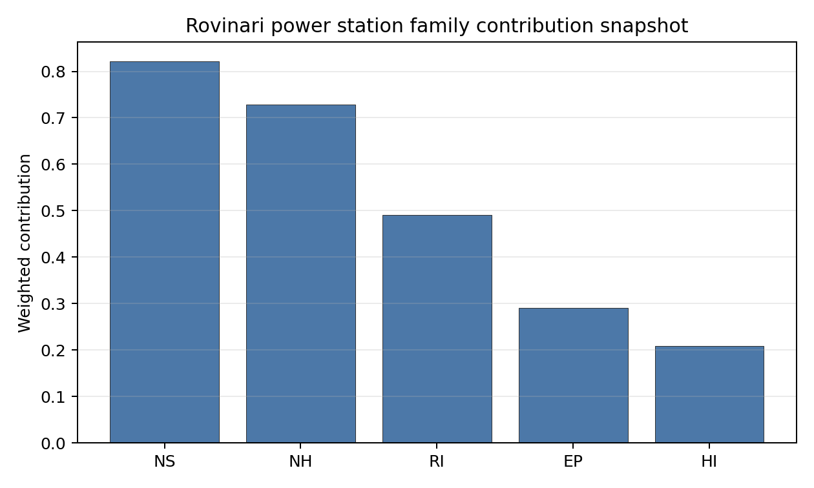

# Rovinari power station Site Profile

Rovinari power station is a coal/thermal site in Romania that has been tested against the NuScale VOYGR-6 reference deployment envelope. This profile reads the screening evidence at a level that supports a decision to progress toward Stage 3 characterization. It is not a site-suitability determination, vendor recommendation, or licensing finding.

## Site Snapshot

| Field | Value |
| --- | --- |
| Site name | Rovinari power station |
| Coordinates | 44.9106, 23.1348 |
| Subnational unit | Gorj |
| Installed thermal capacity (source data) | 1,920 MW |
| Composite score (baseline weights) | 5.828 (4.233-6.242 MC band) |
| National stability band | D (top-10% hit rate 38%) |
| National rank | 2 |

_See the country status map in_ [Romania Country Profile](../RO_country_prototype.md#country-status-map).

## Ownership and Coal-to-Nuclear Context

- **Government of Romania** (77.15% share), headquartered in Romania; immediate operator Complexul Energetic Oltenia SA. Path: Government of Romania  -> Ministry of Energy (Romania)  [100.0%] -> Complexul Energetic Oltenia SA [77.15%] -> Rovinari power station Unit 6 [100.0%]
- **Fondul Proprietatea SA** (21.55% share), headquartered in Romania; immediate operator Complexul Energetic Oltenia SA. Path: Fondul Proprietatea SA -> Complexul Energetic Oltenia SA [21.55%] -> Rovinari power station Unit 6 [100.0%]
- **NN Group NV** (2.42% share), headquartered in Netherlands; immediate operator Complexul Energetic Oltenia SA. Path: NN Group NV -> Fondul Proprietatea SA [11.24%] -> Complexul Energetic Oltenia SA [21.55%] -> Rovinari power station Unit 6 [100.0%]
- **small shareholder(s)** (17.84% share); immediate operator Complexul Energetic Oltenia SA. Path: small shareholder(s)  -> Fondul Proprietatea SA [82.79%] -> Complexul Energetic Oltenia SA [21.55%] -> Rovinari power station Unit 6 [100.0%]
- **Ministry of Energy (Romania)** (77.15% share), headquartered in Romania; immediate operator Complexul Energetic Oltenia SA. Path: Ministry of Energy (Romania)  -> Complexul Energetic Oltenia SA [77.15%] -> Rovinari power station Unit 6 [100.0%]

Generating units on record: 1 cancelled, 3 operating, 1 retired.
Earliest unit commissioning: 1976; most recent: 2020.
Retirements span 2023 to 2023, leaving brownfield grid, water, transport, and workforce assets that materially shorten Stage 3 site preparation.

## Natural Hazards (NH)

- **Seismic: Ground Motion (NH-01)** - score 5.5/10 (MC 5.0-6.0), weight 0.0396, data quality high. Evidence: PGA at 475-year return period 0.094 g; PGA at 2,475-year return period 0.221 g; Vs30 reference (m/s): 760.0.
- **Seismic: Surface Rupture (NH-02)** - score 9.5/10 (MC 9.0-10.0), weight n/a, data quality screening grade. Evidence: nearest mapped capable fault 50.0 km; fault slip rate 0 mm/yr; fault name: none_in_search_radius.
- **Geotechnical: Liquefaction (NH-03)** - score 5.0/10 (MC 5.0-5.0), weight n/a, data quality medium. Evidence: liquefaction susceptibility: very_low; dominant soil type: clay_loam.
- **Geotechnical: Slope Stability (NH-04)** - score 5.5/10 (MC 5.0-6.0), weight n/a, data quality screening grade. Evidence: site slope 10.7 deg; max slope in 1 km box 85.2 deg; slope stability class: steep.
- **Geotechnical: Subsidence (NH-05)** - score 5.5/10 (MC 5.0-6.0), weight 0.0308, data quality medium. Evidence: karst present: no; karst severity: none.
- **Geotechnical: Foundation (NH-06)** - score 5.5/10 (MC 5.0-6.0), weight 0.0220, data quality medium. Evidence: bearing capacity 88.7 kPa; depth to bedrock 23.2 m.
- **Volcanism (NH-07)** - score 5.0/10 (MC 5.0-5.0), weight n/a, data quality high. Evidence: volcanic hazard class: negligible.
- **Coastal Flooding (NH-08)** - score 5.0/10 (MC 5.0-5.0), weight 0.0264, data quality low. Evidence: values not in measurement tables.
- **River Flooding (NH-09)** - score 5.0/10 (MC 5.0-5.0), weight 0.0352, data quality medium. Evidence: flood zone class: negligible.
- **Extreme Winds (NH-10)** - score 9.5/10 (MC 9.0-10.0), weight n/a, data quality medium. Evidence: design wind speed 5.36 m/s.
- **Extreme Precipitation (NH-11)** - score 4.0/10 (MC 4.0-4.0), weight 0.0132, data quality medium. Evidence: extreme daily precipitation 0.29 mm; mean annual precipitation 27.3 mm/yr.
- **Extreme Temperatures (NH-12)** - score 9.5/10 (MC 9.0-10.0), weight 0.0176, data quality medium. Evidence: extreme high temperature 24.4 deg C; extreme low temperature -4.27 deg C.
- **Forest/Wildfire (NH-13)** - score 5.0/10 (MC 5.0-5.0), weight 0.0132, data quality n/a. Evidence: values not in measurement tables.
- **Combined Hazards (NH-14)** - score 5.0/10 (MC 5.0-5.0), weight 0.0132, data quality n/a. Evidence: values not in measurement tables.

### Interpretation - Natural Hazards (NH)

<!-- specialist key=family_natural_hazards scope=site site_id=958e4d82-853a-41f1-a442-94b4c4314221 bundle=RO_rovinari_power_station_site_bundle.json status=filled by=cursor-agent filled_at=2026-05-03T14:19:17Z -->
Natural hazards at Rovinari sit in the low-seismic, low-meteorological envelope expected for the Jiu valley brownfield, and no exclusionary natural-hazard check is currently failing. PGA at the 475-yr return period is 0.094 g and at the 2,475-yr return period is 0.221 g at a screening-grid distance of 3.9 km from the site centre, which keeps the seismic loading well inside the NuScale VOYGR-6 project envelope of 0.5 g at 2,475-yr; the nearest mapped capable fault is at 50 km, so NH-02 settles at 9.5/10. Geotechnical conditions are middle-band: clay-loam soils with a screening-proxy bearing capacity of 89 kPa, depth to bedrock 23.25 m, mean site slope 10.7° and a "steep" slope-stability class. The 1 km-box maximum slope of 85.2° is a digital surface model canopy artefact rather than a geomorphological feature, and NH-04 carries the standard caveat. Liquefaction susceptibility is "very low" at screening grade (raw class 1 of 5), which materially reduces the Stage 3 geotechnical risk relative to the regional Jiu floodplain. Extreme meteorology is calm: the screening reanalysis gives a 50-yr gust of 5.4 m/s, an extreme temperature range of -4.3 °C to 24.4 °C, and a flood susceptibility classified `negligible` (annual probability 0.0000 over 484 weekly snapshots, 2013-2025). The single criterion drawing attention is **Extreme Precipitation (NH-11)** at 4.0/10 with a mean annual precipitation reading of 27 mm/yr and an extreme daily of 0.3 mm; both numbers are physically implausible for the southern Carpathians and almost certainly reflect a coarse-grid mismatch with the local Jiu valley climatology. NH-07 (Volcanism), NH-08 (Coastal Flooding) and NH-09 (River Flooding) all read `negligible` on the screening proxies but are flagged `inconclusive` because the nearest-volcano distance, coast distance, and the local Jiu river-segment flood model are unmeasured at this stage. The Stage 3 priority order is therefore: replace the screening-grid precipitation reading with national ANM (Administraţia Naţională de Meteorologie) station data, and commission a site-specific PSHA so the screening grid value is replaced by a defensible UHS for the 0.5 g design envelope.
<!-- /specialist key=family_natural_hazards -->

## Human-Induced and Security-Relevant Hazards (HI)

- **Aircraft Crash (HI-01)** - score 5.5/10 (MC 5.0-6.0), weight 0.0308, data quality high. Evidence: nearest airport 18.8 km; nearest flight path 9.38 km; airports within search radius 1; airport name: Barza Târgu-Jiu Airfield; airport type: small_airport.
- **Industrial Explosions (HI-02)** - score 5.0/10 (MC 5.0-5.0), weight 0.0308, data quality medium. Evidence: values not in measurement tables.
- **Toxic/Gas Releases (HI-03)** - score 5.0/10 (MC 5.0-5.0), weight 0.0308, data quality medium. Evidence: values not in measurement tables.
- **External Fires (HI-04)** - score 5.0/10 (MC 5.0-5.0), weight 0.0264, data quality medium. Evidence: values not in measurement tables.
- **Transport Hazards (HI-05)** - score 5.0/10 (MC 5.0-5.0), weight 0.0264, data quality n/a. Evidence: values not in measurement tables.
- **Military Installations (HI-06)** - score 1.5/10 (MC 1.0-2.0), weight 0.0264, data quality not_found. Evidence: nearest military installation 7.99 km; military installations within radius 0.
- **Electromagnetic Interference (HI-07)** - score 5.0/10 (MC 5.0-5.0), weight 0.0088, data quality medium. Evidence: nearest high-power transmitter 11.8 km; transmitters within radius 17; transmitter type: mast.
- **Other Nuclear Installations (HI-08)** - score 5.0/10 (MC 5.0-5.0), weight 0.0132, data quality n/a. Evidence: values not in measurement tables.

### Interpretation - Human-Induced and Security-Relevant Hazards (HI)

<!-- specialist key=family_human_hazards scope=site site_id=958e4d82-853a-41f1-a442-94b4c4314221 bundle=RO_rovinari_power_station_site_bundle.json status=filled by=cursor-agent filled_at=2026-05-03T14:19:17Z -->
Human-induced and security-relevant hazards at Rovinari are dominated by an unclassified military feature near the site and an otherwise quiet industrial neighbourhood. The nearest civilian airport is the Barza Târgu-Jiu Airfield (`small_airport`) at 18.8 km, with the nearest large airport at 88.9 km, the nearest medium at 89.4 km, and one airport inside the 30 km screening radius; the nearest commercial flight path is 9.4 km, which puts HI-01 inside the project pass band and yields a 5.5/10 ranking score. The dominant criterion in the family is **Military Installations (HI-06)** at 1.5/10: the nearest military feature is at 7.99 km with zero classified military features inside the 25 km search radius, but the screening record for the nearest feature carries no military-type attribute that would have engaged either the A5 firing-range or A6 ammunition-storage avoidance trigger, so HI-06 is held near the floor on distance alone rather than a confirmed exclusionary finding. This is a governance question rather than an engineering one: a Romanian Ministry of National Defence position on the feature classification is the only step that can lift HI-06 off the floor. The four `unscored` rows HI-02 (Industrial Explosions, Seveso/IED), HI-03 (Toxic / Gas Releases), HI-04 (External Fires) and HI-05 (Transport Hazards) all read "no facility within search radius" on the screening pollutant-release inventory and sit at the pass-mark default of 5.0/10 because the connector found no positive feature to score against; absence-of-evidence is not yet evidence-of-absence at screening grade. HI-07 Electromagnetic Interference scores 5.0/10 with the nearest mast at 11.75 km and 17 transmitters within 25 km; the count is informational, no transmitter is inside a stand-off radius that would prompt the EMI avoidance flag. HI-08 (Other Nuclear Installations) is null. The Stage 3 priority order is therefore: open the Ministry of National Defence engagement on the HI-06 feature so the criterion can be addressed before any other family work is committed, and re-run HI-02 to HI-05 against the Romanian national Seveso and hazmat-corridor cadastres so the four `unscored` rows convert to defensible distances.
<!-- /specialist key=family_human_hazards -->

## Radiological Impact and Emergency Planning (RI / EP)

- **Emergency Planning Feasibility (EP-01)** - score 5.5/10 (MC 5.0-6.0), weight n/a, data quality high. Evidence: EP feasibility composite 44.0 /100; road sub-score 50.7 /100; special-population sub-score 90.0 /100; geography sub-score 10.0 /100; population sub-score 80.0 /100; evacuation feasible: yes.
- **Evacuation Routes (EP-02)** - score 3.5/10 (MC 3.0-4.0), weight 0.0264, data quality medium. Evidence: road density in EPZ 0.478 km/km2; road length in EPZ 938.2 km; motorway access: yes.
- **Physical Geography Constraints (EP-03)** - score 5.0/10 (MC 5.0-5.0), weight 0.0220, data quality medium. Evidence: waterways crossing EPZ 17; major river barrier: yes.
- **Special Populations (EP-04)** - score 7.5/10 (MC 7.0-8.0), weight 0.0264, data quality medium. Evidence: hospitals in EPZ 8; prisons in EPZ 0; care homes in EPZ 0.
- **Concurrent Hazard Impact (EP-05)** - score 5.0/10 (MC 5.0-5.0), weight 0.0176, data quality n/a. Evidence: values not in measurement tables.
- **Atmospheric Dispersion (RI-01)** - score 5.0/10 (MC 5.0-5.0), weight 0.0264, data quality medium. Evidence: annual mean wind speed 0.52 m/s; atmospheric mixing height 360.7 m; prevailing wind direction: N.
- **Surface Water Dispersion (RI-02)** - score 3.5/10 (MC 3.0-4.0), weight 0.0220, data quality n/a. Evidence: values not in measurement tables.
- **Groundwater Dispersion (RI-03)** - score 5.0/10 (MC 5.0-5.0), weight 0.0220, data quality medium. Evidence: aquifer type: alluvial.
- **Population Density at EPZ Radii (RI-04)** - score 5.5/10 (MC 5.0-6.0), weight 0.0352, data quality screening grade. Evidence: population density within 5 km 158.2 /km2; population density within 16 km 72.9 /km2; population density within 25 km 109.0 /km2; population density within 80 km 47.2 /km2; population within 25 km 213,934 people.
- **Distance to Population Centres (RI-05)** - score 5.0/10 (MC 5.0-5.0), weight 0.0441, data quality screening grade. Evidence: nearest city above 50k people 19.4 km; nearest city population 95,351 people; city name: Târgu Jiu.
- **Population Projections (RI-06)** - score 7.5/10 (MC 7.0-8.0), weight 0.0220, data quality screening grade. Evidence: annual population growth rate -0.173 %/yr; projected population at 25 km in 60 yr 165,137 people.

### Interpretation - Radiological Impact and Emergency Planning (RI / EP)

<!-- specialist key=family_radiological_emergency scope=site site_id=958e4d82-853a-41f1-a442-94b4c4314221 bundle=RO_rovinari_power_station_site_bundle.json status=filled by=cursor-agent filled_at=2026-05-03T14:19:17Z -->
Radiological impact and emergency planning at Rovinari read as a low-population periurban envelope with two material concerns: a poor evacuation feasibility composite and an exceptionally stable, low-wind atmospheric regime. Population density at the screening epoch (2020) is 158 p/km² at 5 km, 73 p/km² at 16 km, 109 p/km² at 25 km, and 47 p/km² at 80 km, with a 25 km total of 213,934 people and an 80 km total of 948,197; the nearest city above 50,000 people is Târgu Jiu (95,351) at 19.4 km, hierarchy `periurban`, with one city above 50k inside the 25 km screening radius and two within 80 km. Trajectory is favourable for a 60-year siting horizon: a -0.173 %/yr national growth rate yields a 25 km projection of 165,137 people in 60 years (down 23 % from 2020), so RI-04 settles at 5.5/10 and RI-06 at 7.5/10 against the population-projection scoring band. The atmospheric envelope is the binding concern: the screening reanalysis (1991-2020) gives a mean wind speed of 0.5 m/s (very low), a prevailing direction of N (0°), a mean planetary boundary-layer height of 361 m, and a stable-fraction of 88.1 % (stability class E dominant at 88.1 %, class C at 11.9 %); a low-wind, near-permanently-stable regime suppresses dispersion and concentrates accidental release within a narrow N plume rather than diluting it outward, which is why RI-01 holds at the pass-mark 5.0/10 even though the population field is sparse. The two sub-4 criteria are **Surface Water Dispersion (RI-02)** at 3.5/10 (no `nearest_river_flow_m3s` measurement; current band is the proxy 10-30 m³/s default) and **Evacuation Routes (EP-02)** at 3.5/10 (road density 0.478 km/km², 938 km of road in the EPZ, motorway access present); the EP-02 score sits in the EP-01 sub-score breakdown which gives `roads=50.7, special_pop=90, geography=10, terrain=10, population=80` for an EP-01 composite of 44.0/100 — the geography and terrain sub-scores are the drag, which reflects the Jiu valley topography and the major-river barrier at the EPZ boundary (17 waterways crossing, major river barrier present). The Stage 3 priority order is therefore: model EPZ time-to-clear under summer and winter loadings using the Romanian IRP-MAI traffic data and the Gorj county network, source the Jiu segment dilution flow so RI-02 settles on a measured value rather than a screening proxy, and confirm the dispersion modelling assumptions for an 88 % stable-class regime that is not the European default.
<!-- /specialist key=family_radiological_emergency -->

## Non-Safety and Implementation Considerations (NS)

- **Grid Capacity Basic Filter (BF-01)** - score 5.5/10 (MC 5.0-6.0), weight 0.0352, data quality n/a. Evidence: values not in measurement tables.
- **Land Area Basic Filter (BF-02)** - score 7.5/10 (MC 7.0-8.0), weight 0.0220, data quality n/a. Evidence: values not in measurement tables.
- **Cooling Water Availability (NS-01)** - score 6.0/10 (MC 6.0-6.0), weight n/a, data quality screening grade. Evidence: distance to cooling source 2.02 km; cooling source flow 16.9 m3/s; cooling source type: river; cooling source name: Râul Jiu; water stress label: Low-Medium.
- **Grid Connection (NS-02)** - score 5.5/10 (MC 5.0-6.0), weight 0.0352, data quality medium. Evidence: nearest substation 0.38 km; nearest high-voltage line 0.42 km; highest nearby line voltage 110.0 kV; grid export capacity 882.0 MW; substations within radius 0; HV lines within radius 0.
- **Transport Access (NS-03)** - score 9.0/10 (MC 8.0-9.0), weight 0.0352, data quality high. Evidence: nearest highway 0.73 km; nearest rail line 0.17 km; heavy-haul capable: yes.
- **Site Topography (NS-04)** - score 5.5/10 (MC 5.0-6.0), weight 0.0264, data quality high. Evidence: favourable land cover 57.9 %; moderate land cover 10.6 %; unfavourable land cover 28.7 %; favourable area 128.2 ha; dominant land class: 311.
- **Site Footprint Adequacy (NS-05)** - score 7.5/10 (MC 7.0-8.0), weight 0.0220, data quality high. Evidence: buildable area 62.9 ha; largest contiguous patch 62.9 ha; buildable patch count 10.
- **Existing Infrastructure (NS-06)** - score 5.0/10 (MC 5.0-5.0), weight 0.0220, data quality n/a. Evidence: values not in measurement tables.
- **Environmental Impact (non-rad) (NS-07)** - score 5.0/10 (MC 5.0-5.0), weight 0.0220, data quality n/a. Evidence: values not in measurement tables.
- **Ecological Sensitivity (NS-08)** - score 7.5/10 (MC 7.0-8.0), weight n/a, data quality high. Evidence: natural land cover 28.7 %; distance to nearest Natura 2000 site 10.4 km; distance to nearest protected area 19.8 km; Natura 2000 overlap: no; Natura 2000 sensitivity class: low; protected-area overlap: no; protected-area sensitivity class: low; nearest Natura 2000 site: Coridorul Jiului; Natura 2000 sites within 5 km: 0; nearest protected-area designation: Natural park.
- **Socioeconomic Impact (NS-09)** - score 5.0/10 (MC 5.0-5.0), weight 0.0220, data quality n/a. Evidence: values not in measurement tables.
- **Workforce Availability (NS-10)** - score 5.0/10 (MC 5.0-5.0), weight 0.0176, data quality n/a. Evidence: values not in measurement tables.
- **Coal-to-Nuclear Synergies (NS-11)** - score 5.0/10 (MC 5.0-5.0), weight 0.0264, data quality n/a. Evidence: values not in measurement tables.
- **Regulatory/Political Environment (NS-12)** - score 5.0/10 (MC 5.0-5.0), weight 0.0264, data quality n/a. Evidence: values not in measurement tables.
- **Construction Logistics (NS-13)** - score 5.0/10 (MC 5.0-5.0), weight 0.0176, data quality n/a. Evidence: values not in measurement tables.

### Interpretation - Non-Safety and Implementation Considerations (NS)

<!-- specialist key=family_infrastructure scope=site site_id=958e4d82-853a-41f1-a442-94b4c4314221 bundle=RO_rovinari_power_station_site_bundle.json status=filled by=cursor-agent filled_at=2026-05-03T14:19:17Z -->
Non-safety and implementation conditions are the strongest part of Rovinari's screening file and a principal reason a coal-to-nuclear conversion at this site is attractive. Cooling water is immediately to hand: the Râul Jiu sits 2.02 km from the site at an annual mean discharge of 16.85 m³/s, on a stream order 4 reach with a screening water-stress score of 0.250 (Low-Medium) and a depletion ratio of 0.094; the river is cooling-viable for the NuScale VOYGR-6 envelope and the existing thermal-station intake works can be inherited rather than rebuilt, which is the core brownfield argument behind NS-01 at 6.0/10. Site topography and footprint are favourable: the dominant land class is broad-leaved forest at 28.7 %, but the buildable mix shows favourable land cover at 57.9 % over a 221 ha screening footprint, with 128 ha of favourable area. NS-04 reads 5.5/10 and NS-05 reads 7.5/10, with a single contiguous buildable patch of 62.94 ha across 10 patches and the existing industrial polygon for the Rovinari plant at 0.05 km from the centre point. Ecology is low-sensitivity: the nearest Natura 2000 site is **Coridorul Jiului** at 10.44 km, no overlap, sensitivity class `low`; the area fraction of Natura 2000 land within 25 km is 12.15 %. The nearest IUCN protected area (Geoparcul Platoul Mehedinți, IUCN V) is at 19.80 km with no overlap and sensitivity `low`; NS-08 settles at 7.5/10. The criterion that drives the family read is **Grid Connection (NS-02)** at 5.5/10: the nearest substation is at 0.38 km and the nearest HV line at 0.42 km, but the line voltage is 110 kV (below the 220-400 kV typically preferred for new nuclear) and the 882 MW export-capacity figure was matched to the existing Rovinari unit on the screening transmission topology rather than from a fresh interconnection study; the figure falls below the 924 MW NuScale VOYGR-6 12-module gross output, so a Stage 3 Transelectrica engagement is required to confirm whether the existing 110 kV interconnection plus the planned corridor upgrade can absorb a single VOYGR-6 export. NS-03 (Transport Access) is excellent at 9.0/10: highway 0.73 km (trunk-link class), rail 0.17 km (1435 mm gauge with a rail siding < 1 km), heavy-haul capable with high confidence. Romania's curated nuclear policy stance is `favourable` (NS-12), and the seven NS rows from NS-06 onwards carry null national supplements at this stage. The Stage 3 priority order is therefore: confirm the Transelectrica corridor upgrade to 220 kV / 400 kV so NS-02 settles on a measured higher-voltage interconnection, complete the brownfield reuse audit (NS-06) and EIA scoping (NS-07), and source the NUTS-3 socioeconomic and workforce supplements so NS-09 to NS-13 convert from pass-mark defaults to defensible measurements.
<!-- /specialist key=family_infrastructure -->

## Composite Score and Stability

Baseline composite score is 5.828, bracketed by Monte Carlo at 4.233-6.242. National stability band is `D` with a top-10% hit rate of 38% across 16 scored Monte Carlo scenarios.

<!-- specialist key=stability scope=site site_id=958e4d82-853a-41f1-a442-94b4c4314221 bundle=RO_rovinari_power_station_site_bundle.json status=filled by=cursor-agent filled_at=2026-05-03T14:19:17Z -->
Rovinari's baseline composite score is 5.828 with a Monte Carlo bracket of 4.233-6.242, a narrow upside (about 0.4 above the point estimate) and a meaningful downside (about 1.6 below). The downside reflects the high unscored fraction in the underlying criterion set (56.4 % of criteria are at the pass-mark default of 5.0 rather than measured) rather than evidence that any criterion is failing; in plain terms the lower bracket is "what the score collapses to if every unmeasured criterion turns out to score 5.0 instead of being upgraded by Stage 3 evidence". The national stability band is `D` with a 38 % top-10 % hit rate across the 16 Monte Carlo weight perturbations the audit considered, which means the site retains a top-10 % ranking under roughly six of every sixteen weight profiles in the sensitivity sweep but loses it under the rest. Family balance, not a single dominant criterion, drives the composite: the per-category scores read NS 6.91, NH 5.91, RI 5.87, EP 5.50 and HI 3.65, with HI weighed down by the **Military Installations (HI-06)** floor at 1.5/10 and the four `unscored` HI rows holding the family at the pass-mark default. The next characterization effort that would produce the largest narrowing of the composite uncertainty band is therefore the conversion of unscored HI-02 to HI-05 and the NS-06 / NS-07 / NS-09 to NS-13 rows to measured values; resolving those raises the lower bracket and tightens the 4.233-6.242 envelope without depending on any single high-stakes finding being upgraded. The band-`D` placement also means Rovinari's relative rank against the rest of the Romanian field is more sensitive to weight choice than Turceni's band-`A` placement: the same Stage 3 measurement programme that lifts the lower bracket also stabilises Rovinari's national rank against weight reshuffles between the family categories.
<!-- /specialist key=stability -->

## Residual Risk Register

<!-- specialist key=residual_risk scope=site site_id=958e4d82-853a-41f1-a442-94b4c4314221 bundle=RO_rovinari_power_station_site_bundle.json status=filled by=cursor-agent filled_at=2026-05-03T14:19:17Z -->
| Concern | Evidence | Consequence | Stage 3 action | Owner discipline |
| --- | --- | --- | --- | --- |
| Military Installations (HI-06) | Nearest military feature at 7.99 km; screening record carries no military-type attribute (no classified count within 25 km) | Feature classification ambiguity may convert to a security-cordon overlap once Romanian Ministry of National Defence positions are obtained | Engage Romanian Ministry of National Defence on the feature classification, airspace use, and any security-cordon depth requirements | security |
| Surface Water Dispersion (RI-02) | No site-specific receptor measurement (`nearest_river_flow_m3s` missing); current proxy band 10-30 m³/s with insufficient confidence | Liquid-effluent dilution margin unverified; affects radioactive-discharge permitting envelope on the Jiu | Measure Jiu river-segment dilution flow, low-flow recurrence, and downstream user inventory | hydrology |
| Evacuation Routes (EP-02) | Road density in EPZ 0.478 km/km², total road length 938.2 km, motorway access present, EP-01 composite 44.0/100 (FEASIBLE) with `geography=10, terrain=10, roads=50.7` sub-scores | Evacuation bottlenecks driven by Jiu valley geography and the 17-waterway EPZ crossing may exceed national IRP-MAI target clearance time during peak conditions | Model EPZ time-to-clear under summer and winter loadings using IRP-MAI traffic data and the Gorj county network | emergency planning |
| Atmospheric Dispersion (RI-01) | Screening reanalysis 1991-2020: mean wind speed 0.5 m/s, prevailing N (0°), mean BLH 361 m, stable-fraction 88.1 % (E class dominant); current score 5.0/10 | Low-wind, near-permanently-stable regime concentrates accidental release within a narrow N plume rather than diluting it outward; the European-default dispersion assumption may be non-conservative | Confirm dispersion modelling assumptions for an 88 % stable-class regime with a national meteorological reference profile | meteorology |
| Extreme Precipitation (NH-11) | Screening reanalysis 1991-2020: mean annual precipitation 27 mm/yr, extreme daily 0.3 mm; SPI12, snow-months and freezing-days not measured | Screening grid is too coarse to set the design rainfall and snow-load envelope; the values are physically implausible for the southern Carpathians | Re-measure with ANM (Administraţia Naţională de Meteorologie) station data and complete the precipitation sub-criteria | hydrology |
| Grid Connection (NS-02) | Nearest substation 0.38 km, nearest HV line 0.42 km at 110 kV; 882 MW export capacity matched to existing CTE_Rovinari_ROVI3_CA unit | 110 kV interconnection is below the 220-400 kV typically preferred for new nuclear; the 882 MW export capacity exceeds the 462 MWe NuScale VOYGR-6 (6 × 77 MWe modules) reference output, with headroom against an uncertified 12-module future expansion (924 MWe, currently lacks Design Certification) | Confirm Transelectrica corridor upgrade pathway to 220 kV / 400 kV and update NS-02 against the planned topology | grid |

Two concerns dominate the register. HI-06 is a governance question that only Ministry of National Defence engagement can resolve, and it is the single criterion most likely to remove Rovinari from contention regardless of any other family score, even though the screening tagging gap means the current 1.5/10 reflects a feature-classification uncertainty rather than a confirmed exclusionary finding. NS-02 is an engineering and programme question that scales with the Transelectrica upgrade pathway; resolving it also unlocks the ten other Romanian sites carrying the same avoidance flag. The remaining four entries are characterization gaps and permitting precursors rather than findings against the site, and they are typical of a Jiu-valley coal-to-nuclear screening file at this stage. The register is a Stage 3 work plan, not a deal-breaker list: no avoidance flag is currently failing, and Rovinari ranks second nationally (band D, 38 % top-10 % hit rate) on a baseline composite of 5.828.
<!-- /specialist key=residual_risk -->

## Stage 3 Follow-Up Checklist

- [ ] Re-measure **Military Installations (HI-06)** - native score 1.5/10 with confidence medium.
- [ ] Re-measure **Evacuation Routes (EP-02)** - native score 3.5/10 with confidence medium.
- [ ] Re-measure **Surface Water Dispersion (RI-02)** - native score 3.5/10 with confidence insufficient.
- [ ] Re-measure **Extreme Precipitation (NH-11)** - native score 4.0/10 with confidence medium.
- [ ] Re-measure **Physical Geography Constraints (EP-03)** - native score 5.0/10 with confidence medium.
- [ ] Improve data quality for **Geotechnical: Subsidence & Collapse (NH-05b)** - current flag `low`.
- [ ] Improve data quality for **Coastal Flooding (NH-08)** - current flag `low`.
- [ ] Improve data quality for **Military Installations (HI-06)** - current flag `not_found`.

## Evidence Limitations

- Geotechnical: Subsidence & Collapse (NH-05b) - quality `low`.
- Coastal Flooding (NH-08) - quality `low`.
- Military Installations (HI-06) - quality `not_found`.
