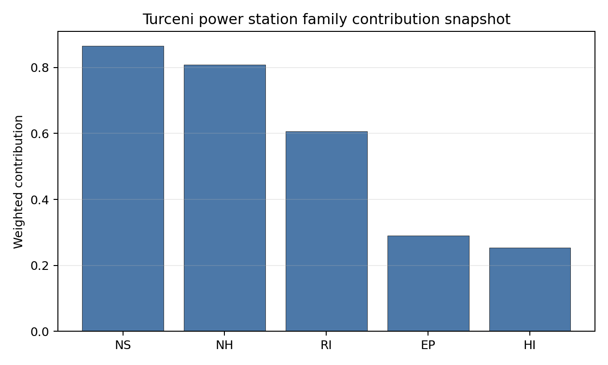

# Turceni power station Site Profile

Turceni power station is a coal/thermal site in Romania that has been tested against the NuScale VOYGR-6 reference deployment envelope. This profile reads the screening evidence at a level that supports a decision to progress toward Stage 3 characterization. It is not a site-suitability determination, vendor recommendation, or licensing finding.

## Site Snapshot

| Field | Value |
| --- | --- |
| Site name | Turceni power station |
| Coordinates | 44.6697, 23.4078 |
| Subnational unit | Gorj |
| Installed thermal capacity (source data) | 2,640 MW |
| Composite score (baseline weights) | 6.347 (4.489-6.733 MC band) |
| National stability band | A (top-10% hit rate 100%) |
| National rank | 1 |

_See the country status map in_ [Romania Country Profile](../RO_country_prototype.md#country-status-map).

## Ownership and Coal-to-Nuclear Context

- **Government of Romania** (77.15% share), headquartered in Romania; immediate operator Complexul Energetic Oltenia SA. Path: Government of Romania  -> Ministry of Energy (Romania)  [100.0%] -> Complexul Energetic Oltenia SA [77.15%] -> Turceni power station Unit 6 [100.0%]
- **Fondul Proprietatea SA** (21.55% share), headquartered in Romania; immediate operator Complexul Energetic Oltenia SA. Path: Fondul Proprietatea SA -> Complexul Energetic Oltenia SA [21.55%] -> Turceni power station Unit 1 [100.0%]
- **NN Group NV** (2.42% share), headquartered in Netherlands; immediate operator Complexul Energetic Oltenia SA. Path: NN Group NV -> Fondul Proprietatea SA [11.24%] -> Complexul Energetic Oltenia SA [21.55%] -> Turceni power station Unit 1 [100.0%]
- **small shareholder(s)** (17.84% share); immediate operator Complexul Energetic Oltenia SA. Path: small shareholder(s)  -> Fondul Proprietatea SA [82.79%] -> Complexul Energetic Oltenia SA [21.55%] -> Turceni power station Unit 6 [100.0%]
- **Ministry of Energy (Romania)** (77.15% share), headquartered in Romania; immediate operator Complexul Energetic Oltenia SA. Path: Ministry of Energy (Romania)  -> Complexul Energetic Oltenia SA [77.15%] -> Turceni power station Unit 6 [100.0%]

Generating units on record: 1 cancelled, 2 operating, 5 retired.
Earliest unit commissioning: 1976; most recent: 1989.
Retirements span 2006 to 2025, leaving brownfield grid, water, transport, and workforce assets that materially shorten Stage 3 site preparation.

## Natural Hazards (NH)

- **Seismic: Ground Motion (NH-01)** - score 7.5/10 (MC 7.0-8.0), weight 0.0396, data quality high. Evidence: PGA at 475-year return period 0.081 g; PGA at 2,475-year return period 0.158 g; Vs30 reference (m/s): 760.0.
- **Seismic: Surface Rupture (NH-02)** - score 9.5/10 (MC 9.0-10.0), weight n/a, data quality screening grade. Evidence: nearest mapped capable fault 50.0 km; fault slip rate 0 mm/yr; fault name: none_in_search_radius.
- **Geotechnical: Liquefaction (NH-03)** - score 5.0/10 (MC 5.0-5.0), weight n/a, data quality medium. Evidence: liquefaction susceptibility: high; dominant soil type: clay_loam.
- **Geotechnical: Slope Stability (NH-04)** - score 7.5/10 (MC 7.0-8.0), weight n/a, data quality screening grade. Evidence: site slope 7.75 deg; max slope in 1 km box 79.9 deg; slope stability class: moderate.
- **Geotechnical: Subsidence (NH-05)** - score 5.5/10 (MC 5.0-6.0), weight 0.0308, data quality medium. Evidence: karst present: no; karst severity: none.
- **Geotechnical: Foundation (NH-06)** - score 5.5/10 (MC 5.0-6.0), weight 0.0220, data quality medium. Evidence: bearing capacity 91.3 kPa; depth to bedrock 23.4 m.
- **Volcanism (NH-07)** - score 5.0/10 (MC 5.0-5.0), weight n/a, data quality high. Evidence: volcanic hazard class: negligible.
- **Coastal Flooding (NH-08)** - score 5.0/10 (MC 5.0-5.0), weight 0.0264, data quality low. Evidence: values not in measurement tables.
- **River Flooding (NH-09)** - score 5.0/10 (MC 5.0-5.0), weight 0.0352, data quality medium. Evidence: flood zone class: negligible.
- **Extreme Winds (NH-10)** - score 9.5/10 (MC 9.0-10.0), weight n/a, data quality medium. Evidence: design wind speed 6.62 m/s.
- **Extreme Precipitation (NH-11)** - score 4.0/10 (MC 4.0-4.0), weight 0.0132, data quality medium. Evidence: extreme daily precipitation 0.37 mm; mean annual precipitation 28.2 mm/yr.
- **Extreme Temperatures (NH-12)** - score 9.5/10 (MC 9.0-10.0), weight 0.0176, data quality medium. Evidence: extreme high temperature 25.7 deg C; extreme low temperature -4.67 deg C.
- **Forest/Wildfire (NH-13)** - score 5.0/10 (MC 5.0-5.0), weight 0.0132, data quality n/a. Evidence: values not in measurement tables.
- **Combined Hazards (NH-14)** - score 5.0/10 (MC 5.0-5.0), weight 0.0132, data quality n/a. Evidence: values not in measurement tables.

### Interpretation - Natural Hazards (NH)

<!-- specialist key=family_natural_hazards scope=site site_id=345fb795-170a-4fb5-833c-f6bcf2eb450c bundle=RO_turceni_power_station_site_bundle.json status=filled by=cursor-agent filled_at=2026-05-03T10:40:11Z -->
Natural hazards at Turceni sit in the moderate-seismic, low-meteorological envelope expected for a south-Carpathian foothills brownfield, and no exclusionary natural-hazard check is currently failing. PGA at the 475-yr return period is 0.081 g and at the 2,475-yr return period is 0.158 g at a screening-grid distance of 3.9 km from the site centre, which places the seismic loading well below the NuScale VOYGR-6 project screening envelope of 0.5 g at 2,475-yr; the nearest mapped capable fault is at 50 km. Geotechnical conditions are middle-band: clay-loam soils with a screening-proxy bearing capacity of 91 kPa, depth to bedrock 23.4 m, mean site slope 7.7° and a "moderate" slope-stability class. The 1 km-box maximum slope of 79.9° is a digital surface model canopy artefact rather than a geomorphological feature, but it is worth flagging that NH-04 carries the standard DSM caveat. Liquefaction susceptibility is classified "high" at screening grade (raw class 4 of 5); the bearing capacity and clay-loam fabric mitigate but do not retire the question, and Stage 3 must replace the global-grid value with site-specific CPT or SPT before the screening verdict (currently `pass` on E2) can be considered durable. Extreme meteorology is calm: the screening reanalysis (1991-2020) gives a 50-yr gust of only 6.6 m/s and an extreme temperature range of -4.7 °C to 25.7 °C, both well inside the project envelope. The single criterion drawing attention is **Extreme Precipitation (NH-11)** at 4.0/10 with a mean annual precipitation reading of 28 mm/yr and an extreme daily of 0.4 mm; both numbers are physically implausible for the southern Carpathians and almost certainly reflect a coarse-grid mismatch with the local Carpathian climatology (the comment carries `freezing_days=35/yr` while `snow_months=0`, a classic artefact). NH-07 (Volcanism), NH-08 (Coastal Flooding) and NH-09 (River Flooding) all carry `inconclusive` avoidance verdicts because the nearest-volcano distance, coast distance, and local river distance are unmeasured at this stage. The Stage 3 priority order is therefore: replace the screening precipitation reading with national ANM (Administraţia Naţională de Meteorologie) station data and re-source the three null distances so the avoidance verdicts on NH-07, NH-08 and NH-09 settle to a defensible `pass` rather than `inconclusive`.
<!-- /specialist key=family_natural_hazards -->

## Human-Induced and Security-Relevant Hazards (HI)

- **Aircraft Crash (HI-01)** - score 5.5/10 (MC 5.0-6.0), weight 0.0308, data quality high. Evidence: nearest airport 36.9 km; nearest flight path 18.4 km; airports within search radius 0; airport name: Predeşti SkyFun Airfield; airport type: small_airport.
- **Industrial Explosions (HI-02)** - score 5.0/10 (MC 5.0-5.0), weight 0.0308, data quality medium. Evidence: values not in measurement tables.
- **Toxic/Gas Releases (HI-03)** - score 5.0/10 (MC 5.0-5.0), weight 0.0308, data quality medium. Evidence: values not in measurement tables.
- **External Fires (HI-04)** - score 5.0/10 (MC 5.0-5.0), weight 0.0264, data quality medium. Evidence: values not in measurement tables.
- **Transport Hazards (HI-05)** - score 5.0/10 (MC 5.0-5.0), weight 0.0264, data quality n/a. Evidence: values not in measurement tables.
- **Military Installations (HI-06)** - score 0.0/10 (MC 0.0-0.0), weight 0.0264, data quality high. Evidence: nearest military installation 2.91 km; military installations within radius 8.
- **Electromagnetic Interference (HI-07)** - score 9.5/10 (MC 9.0-10.0), weight 0.0088, data quality not_found. Evidence: nearest high-power transmitter 2.97 km; transmitters within radius 0; transmitter type: communication.
- **Other Nuclear Installations (HI-08)** - score 5.0/10 (MC 5.0-5.0), weight 0.0132, data quality n/a. Evidence: values not in measurement tables.

### Interpretation - Human-Induced and Security-Relevant Hazards (HI)

<!-- specialist key=family_human_hazards scope=site site_id=345fb795-170a-4fb5-833c-f6bcf2eb450c bundle=RO_turceni_power_station_site_bundle.json status=filled by=cursor-agent filled_at=2026-05-03T10:41:17Z -->
Human-induced and security-relevant hazards at Turceni are dominated by a single binding finding (Military Installations, HI-06) and an otherwise quiet industrial neighbourhood. The nearest civilian airport is the Predeşti SkyFun Airfield (`small_airport`) at 36.9 km, with the nearest large airport at 54.6 km and zero airports inside the 30 km screening radius; the nearest commercial flight path is 18.4 km, which puts HI-01 inside the project pass-mark band (civilian airports between 8 and 15 km, military airfields between 30 and 60 km) and yields a 5.5/10 ranking score. The dominant criterion in the family is **Military Installations (HI-06)** at 0.0/10: the nearest military feature is an unnamed bunker at 2.91 km, with eight military features inside the 25 km search radius. Both avoidance triggers (A5 firing ranges at 30 km, A6 ammunition storage at 8 km) returned `pass` only because the screening records carry no military-type attribute that would have engaged either rule, so HI-06 settles at the floor on distance alone. This is a governance question rather than an engineering one: no civilian design measure resolves it without a Romanian Ministry of National Defence position on airspace, security-cordon depth and feature reclassification. The four `unscored` criteria HI-02 (Industrial Explosions, Seveso/IED), HI-03 (Toxic / Gas Releases), HI-04 (External Fires) and HI-05 (Transport Hazards) all read "no facility within search radius" on the screening pollutant-release inventory, but they sit at the pass-mark default of 5.0/10 because the connector found no positive feature to score against; absence-of-evidence is not yet evidence-of-absence at screening grade. HI-07 Electromagnetic Interference scores 9.5/10 (no high-power transmitter inside 10 km), and HI-08 (Other Nuclear Installations) is null for both nearest distance and name. The Stage 3 priority order is therefore: open the Ministry of National Defence engagement on the eight HI-06 features so the criterion can be addressed before any other family work is committed, and re-run HI-02 to HI-05 against national Seveso and hazmat-corridor cadastres so the four `unscored` rows convert to defensible distances.
<!-- /specialist key=family_human_hazards -->

## Radiological Impact and Emergency Planning (RI / EP)

- **Emergency Planning Feasibility (EP-01)** - score 5.5/10 (MC 5.0-6.0), weight n/a, data quality high. Evidence: EP feasibility composite 57.8 /100; road sub-score 47.6 /100; special-population sub-score 90.0 /100; geography sub-score 95.0 /100; population sub-score 95.0 /100; evacuation feasible: yes.
- **Evacuation Routes (EP-02)** - score 3.5/10 (MC 3.0-4.0), weight 0.0264, data quality medium. Evidence: road density in EPZ 0.427 km/km2; road length in EPZ 838.6 km; motorway access: yes.
- **Physical Geography Constraints (EP-03)** - score 5.0/10 (MC 5.0-5.0), weight 0.0220, data quality medium. Evidence: waterways crossing EPZ 0; major river barrier: no.
- **Special Populations (EP-04)** - score 7.5/10 (MC 7.0-8.0), weight 0.0264, data quality medium. Evidence: hospitals in EPZ 6; prisons in EPZ 0; care homes in EPZ 0.
- **Concurrent Hazard Impact (EP-05)** - score 5.0/10 (MC 5.0-5.0), weight 0.0176, data quality n/a. Evidence: values not in measurement tables.
- **Atmospheric Dispersion (RI-01)** - score 5.0/10 (MC 5.0-5.0), weight 0.0264, data quality medium. Evidence: annual mean wind speed 0.75 m/s; atmospheric mixing height 417.5 m; prevailing wind direction: NE.
- **Surface Water Dispersion (RI-02)** - score 3.5/10 (MC 3.0-4.0), weight 0.0220, data quality n/a. Evidence: values not in measurement tables.
- **Groundwater Dispersion (RI-03)** - score 5.0/10 (MC 5.0-5.0), weight 0.0220, data quality medium. Evidence: aquifer type: alluvial.
- **Population Density at EPZ Radii (RI-04)** - score 7.5/10 (MC 7.0-8.0), weight 0.0352, data quality screening grade. Evidence: population density within 5 km 84.4 /km2; population density within 16 km 63.2 /km2; population density within 25 km 59.9 /km2; population density within 80 km 70.9 /km2; population within 25 km 117,614 people.
- **Distance to Population Centres (RI-05)** - score 5.0/10 (MC 5.0-5.0), weight 0.0441, data quality screening grade. Evidence: nearest city above 50k people 42.7 km; nearest city population 95,351 people; city name: Târgu Jiu.
- **Population Projections (RI-06)** - score 9.5/10 (MC 9.0-10.0), weight 0.0220, data quality screening grade. Evidence: annual population growth rate -0.667 %/yr; projected population at 25 km in 60 yr 90,790 people.

### Interpretation - Radiological Impact and Emergency Planning (RI / EP)

<!-- specialist key=family_radiological_emergency scope=site site_id=345fb795-170a-4fb5-833c-f6bcf2eb450c bundle=RO_turceni_power_station_site_bundle.json status=filled by=cursor-agent filled_at=2026-05-03T10:42:19Z -->
Radiological impact and emergency planning at Turceni read as a low-population rural envelope with a single material concern in evacuation capacity and a meteorological caution on dispersion. Population density at the screening epoch (2020) is 84 p/km2 at 5 km, 60 p/km2 at 25 km, and 71 p/km2 at 80 km, with a 25 km total of 117,614 people and an 80 km total of 1.4 million; the nearest city above 50,000 people is Târgu Jiu (95,351) at 42.7 km, and zero cities above 50k sit inside the 25 km screening radius. The trajectory is favourable for a 60-year siting horizon: a -0.67 %/yr national growth rate yields a 25 km projection of 90,790 people in 60 years, which converts to RI-04 7.5/10 and RI-06 9.5/10. The atmospheric envelope is less benign: the screening reanalysis (1991-2020) gives a mean wind speed of 0.75 m/s (very low), a prevailing direction of NE (45°), a mean planetary boundary-layer height of 418 m and a stable-fraction of 66.4 % (stability class E dominant); a low-wind, stable-class regime suppresses dispersion and concentrates accidental release within a narrower NE plume than a less stable site, which is why RI-01 holds at 5.0/10 even though the population field is sparse. The two sub-4 criteria are **Evacuation Routes (EP-02)** at 3.5/10 (road density 0.427 km/km2, 838 km of road in the EPZ, motorway access present, evacuation rated FEASIBLE on EP-01 composite 57.8/100) and **Surface Water Dispersion (RI-02)** at 3.5/10 (no `nearest_river_flow_m3s` measurement; current band is the proxy 10-30 m3/s default). EP-03 (Physical-Geography Constraints) and EP-05 (Concurrent-Hazard Impact) sit at the unscored pass-mark default 5.0/10 because `relief_m_per_10km` and `ep05_concurrent_index` are unmeasured. The Stage 3 priority order is therefore: model EPZ time-to-clear under summer and winter loadings using Romanian IRP-MAI traffic data and the Gorj county network, and source the Jiu segment dilution flow so RI-02 settles on a measured value rather than a screening proxy.
<!-- /specialist key=family_radiological_emergency -->

## Non-Safety and Implementation Considerations (NS)

- **Grid Capacity Basic Filter (BF-01)** - score 7.5/10 (MC 7.0-8.0), weight 0.0352, data quality n/a. Evidence: values not in measurement tables.
- **Land Area Basic Filter (BF-02)** - score 9.5/10 (MC 9.0-10.0), weight 0.0220, data quality n/a. Evidence: values not in measurement tables.
- **Cooling Water Availability (NS-01)** - score 7.0/10 (MC 6.0-7.0), weight n/a, data quality screening grade. Evidence: distance to cooling source 1.28 km; cooling source flow 24.2 m3/s; cooling source type: river; cooling source name: Râul Jiu; water stress label: Low-Medium.
- **Grid Connection (NS-02)** - score 5.5/10 (MC 5.0-6.0), weight 0.0352, data quality medium. Evidence: nearest substation 0.22 km; nearest high-voltage line 0.59 km; highest nearby line voltage 110.0 kV; grid export capacity 1,311 MW; substations within radius 0; HV lines within radius 0.
- **Transport Access (NS-03)** - score 6.0/10 (MC 6.0-6.0), weight 0.0352, data quality medium. Evidence: nearest rail line 0.26 km; heavy-haul capable: yes.
- **Site Topography (NS-04)** - score 9.5/10 (MC 9.0-10.0), weight 0.0264, data quality high. Evidence: favourable land cover 83.9 %; moderate land cover 7.8 %; unfavourable land cover 8.2 %; favourable area 235.1 ha; dominant land class: 211.
- **Site Footprint Adequacy (NS-05)** - score 9.5/10 (MC 9.0-10.0), weight 0.0220, data quality high. Evidence: buildable area 169.8 ha; largest contiguous patch 169.8 ha; buildable patch count 14.
- **Existing Infrastructure (NS-06)** - score 5.0/10 (MC 5.0-5.0), weight 0.0220, data quality n/a. Evidence: values not in measurement tables.
- **Environmental Impact (non-rad) (NS-07)** - score 5.0/10 (MC 5.0-5.0), weight 0.0220, data quality n/a. Evidence: values not in measurement tables.
- **Ecological Sensitivity (NS-08)** - score 7.5/10 (MC 7.0-8.0), weight n/a, data quality high. Evidence: natural land cover 8.2 %; distance to nearest Natura 2000 site 1.418 km; distance to nearest protected area 7.473 km; Natura 2000 overlap: no; Natura 2000 sensitivity class: moderate; protected-area overlap: no; protected-area sensitivity class: low; nearest Natura 2000 site: Coridorul Jiului; Natura 2000 sites within 5 km: 1; nearest protected-area designation: Not Assigned.
- **Socioeconomic Impact (NS-09)** - score 5.0/10 (MC 5.0-5.0), weight 0.0220, data quality n/a. Evidence: values not in measurement tables.
- **Workforce Availability (NS-10)** - score 5.0/10 (MC 5.0-5.0), weight 0.0176, data quality n/a. Evidence: values not in measurement tables.
- **Coal-to-Nuclear Synergies (NS-11)** - score 5.0/10 (MC 5.0-5.0), weight 0.0264, data quality n/a. Evidence: values not in measurement tables.
- **Regulatory/Political Environment (NS-12)** - score 5.0/10 (MC 5.0-5.0), weight 0.0264, data quality n/a. Evidence: values not in measurement tables.
- **Construction Logistics (NS-13)** - score 5.0/10 (MC 5.0-5.0), weight 0.0176, data quality n/a. Evidence: values not in measurement tables.

### Interpretation - Non-Safety and Implementation Considerations (NS)

<!-- specialist key=family_infrastructure scope=site site_id=345fb795-170a-4fb5-833c-f6bcf2eb450c bundle=RO_turceni_power_station_site_bundle.json status=filled by=cursor-agent filled_at=2026-05-03T10:43:29Z -->
Non-safety and implementation conditions are the strongest part of Turceni's screening file and the principal reason a coal-to-nuclear conversion at this site is attractive. Cooling water is immediately to hand: the Râul Jiu sits 1.28 km from the site at an annual mean discharge of 24.2 m3/s on a stream order 4 reach, with a screening water-stress score of 0.25 (Low-Medium); the river is cooling-viable for the NuScale VOYGR-6 envelope and the existing thermal-station intake works can be inherited rather than rebuilt, which is the core brownfield argument behind NS-01 at 7.0/10. Site topography and footprint are unambiguously favourable: the dominant land class is non-irrigated arable land at 49.2 %, favourable land cover is 83.9 % over a 235 ha footprint, total buildable area is 169.8 ha in a single contiguous patch, and the existing industrial polygon for the Termocentrala Turceni plant sits 30 m from the centre point. NS-04 and NS-05 both score 9.5/10 on this evidence. Ecology is moderately sensitive but not constraining: the nearest Natura 2000 site is **Coridorul Jiului** at 1.42 km, no overlap, sensitivity class `moderate`; the area fraction of Natura 2000 land within 5 km is 21 %, falling to 10 % at 25 km. The nearest IUCN protected area is at 7.47 km with no overlap and sensitivity `low`; NS-08 settles at 7.5/10. The criterion that drives the family read is **Grid Connection (NS-02)** at 5.5/10: the nearest substation is at 0.22 km and the nearest HV line at 0.59 km, but the line voltage is 110 kV (below the 220-400 kV typically preferred for new nuclear) and the 1,311 MW export-capacity figure is inherited from existing Turceni unit assignments rather than from a fresh transmission analysis. Eleven of Romania's 18 exclusionary-pass sites carry the same NS-02 avoidance flag, so this is also where the country-wide unlock work focuses. NS-06 (Existing Infrastructure), NS-07 (Environmental Impact), NS-09 to NS-13 carry null or `unscored` rows and pass-mark default scores at 5.0/10. The Stage 3 priority order is therefore: confirm the Turceni-corridor 220 kV / 400 kV upgrade pathway with Transelectrica so NS-02 settles on a measured higher-voltage interconnection, and complete the brownfield reuse audit (NS-06) and EIA scoping (NS-07) so the family's two `null` rows convert to defensible measurements.
<!-- /specialist key=family_infrastructure -->

## Composite Score and Stability

Baseline composite score is 6.347, bracketed by Monte Carlo at 4.489-6.733. National stability band is `A` with a top-10% hit rate of 100% across 16 scored Monte Carlo scenarios.

<!-- specialist key=stability scope=site site_id=345fb795-170a-4fb5-833c-f6bcf2eb450c bundle=RO_turceni_power_station_site_bundle.json status=filled by=cursor-agent filled_at=2026-05-03T10:44:12Z -->
Turceni's baseline composite score is 6.347 with a Monte Carlo bracket of 4.489-6.733, a moderately wide envelope on the upside (about 0.4 above the point estimate) and a meaningful downside (about 1.9 below). The downside reflects the high unscored fraction in the underlying criterion set (55.5 % of criteria are at the pass-mark default rather than measured) rather than evidence that any criterion is failing; in plain terms the lower bracket is "what the score collapses to if every unmeasured criterion turns out to score 5.0 instead of being upgraded by Stage 3 evidence". The national stability band is `A` with a 100 % top-10 % hit rate across the 16 Monte Carlo weight perturbations the audit considered, which means the site retains its top-tier ranking under every weight profile in the sensitivity sweep. Family balance, not a single dominant criterion, drives the composite: the per-category scores read NS 7.28, RI 7.24, NH 6.55, EP 5.50 and HI 3.83, with HI weighed down by the **Military Installations (HI-06)** floor of 0.0/10 and EP held back by **Evacuation Routes (EP-02)** at 3.5/10. The next characterization effort that would produce the largest narrowing of the composite uncertainty band is therefore the conversion of unscored HI-02 to HI-05 and NS-06 / NS-07 / NS-09 / NS-13 to measured values; resolving those raises the lower bracket and tightens the 4.489-6.733 envelope without depending on any single high-stakes finding being upgraded.
<!-- /specialist key=stability -->

## Residual Risk Register

<!-- specialist key=residual_risk scope=site site_id=345fb795-170a-4fb5-833c-f6bcf2eb450c bundle=RO_turceni_power_station_site_bundle.json status=filled by=cursor-agent filled_at=2026-05-03T10:45:24Z -->
| Concern | Evidence | Consequence | Stage 3 action | Owner discipline |
| --- | --- | --- | --- | --- |
| Military Installations (HI-06) | Nearest military feature at 2.91 km, 8 features within 25 km | Airspace and exclusion-zone overlap with classified perimeter; potentially exclusionary on security grounds | Engage Romanian Ministry of National Defence on airspace use, security-cordon depth, and feature reclassification | security |
| Evacuation Routes (EP-02) | Road density in EPZ 0.427 km/km2, total road length 838.6 km, motorway access present | Evacuation bottlenecks may exceed national IRP-MAI target clearance time during peak conditions | Model EPZ time-to-clear under summer and winter loadings with Romanian IRP-MAI traffic data | emergency planning |
| Surface Water Dispersion (RI-02) | No site-specific receptor measurement (`nearest_river_flow_m3s` missing); current proxy band 10-30 m3/s | Liquid-effluent dilution margin unverified; affects radioactive-discharge permitting envelope | Measure Jiu river-segment dilution flow, low-flow recurrence, and downstream user inventory | hydrology |
| Extreme Precipitation (NH-11) | Screening reanalysis 1991-2020: mean annual precipitation 28 mm/yr, extreme daily 0.4 mm; SPI12, snow-months and freezing-days not measured | Screening grid is too coarse to set the design rainfall and snow-load envelope; sub-criteria flagged `partial_unscored` | Re-measure with ANM (Administraţia Naţională de Meteorologie) station data and complete the sub-criteria | hydrology |
| Grid Connection (NS-02) | Nearest substation 0.22 km, nearest HV line 0.59 km at 110 kV; 1,311 MW export capacity inherited from existing Turceni unit assignments | 110 kV interconnection is below the 220-400 kV typically preferred for new nuclear; may force a transmission upgrade in the project schedule | Confirm Turceni-corridor 220 kV / 400 kV upgrade pathway with Transelectrica and update NS-02 against the planned topology | grid |
| Ecological Sensitivity (NS-08) | Natura 2000 "Coridorul Jiului" at 1.418 km, no overlap, area fraction 21 % within 5 km, sensitivity class moderate | Appropriate Assessment under Habitats Directive Article 6(3) likely required; permitting timeline risk | Confirm Coridorul Jiului boundary and trigger Romanian ANM / ANANP scoping ahead of Stage 3 design | EIA |

Two concerns dominate the register. HI-06 is a governance question that only Ministry of National Defence engagement can resolve, and it is the single criterion most likely to remove Turceni from contention regardless of any other family score. NS-02 is an engineering and programme question that scales with the Transelectrica 220-400 kV upgrade pathway; resolving it also unlocks ten other Romanian sites carrying the same avoidance flag. The remaining four entries are characterization gaps and permitting precursors rather than findings against the site, and they are typical of a coal-to-nuclear screening file at this stage. The register is a Stage 3 work plan, not a deal-breaker list: no avoidance flag is currently failing, and Turceni still ranks first nationally in band A with a 100 per cent top-10 hit rate across the Monte Carlo sensitivity scenarios.
<!-- /specialist key=residual_risk -->

## Stage 3 Follow-Up Checklist

- [ ] Re-measure **Military Installations (HI-06)** - native score 0.0/10 with confidence high.
- [ ] Re-measure **Evacuation Routes (EP-02)** - native score 3.5/10 with confidence medium.
- [ ] Re-measure **Surface Water Dispersion (RI-02)** - native score 3.5/10 with confidence insufficient.
- [ ] Re-measure **Extreme Precipitation (NH-11)** - native score 4.0/10 with confidence medium.
- [ ] Re-measure **Physical Geography Constraints (EP-03)** - native score 5.0/10 with confidence medium.
- [ ] Improve data quality for **Geotechnical: Subsidence & Collapse (NH-05b)** - current flag `low`.
- [ ] Improve data quality for **Coastal Flooding (NH-08)** - current flag `low`.
- [ ] Improve data quality for **Electromagnetic Interference (HI-07)** - current flag `not_found`.

## Evidence Limitations

- Geotechnical: Subsidence & Collapse (NH-05b) - quality `low`.
- Coastal Flooding (NH-08) - quality `low`.
- Electromagnetic Interference (HI-07) - quality `not_found`.
