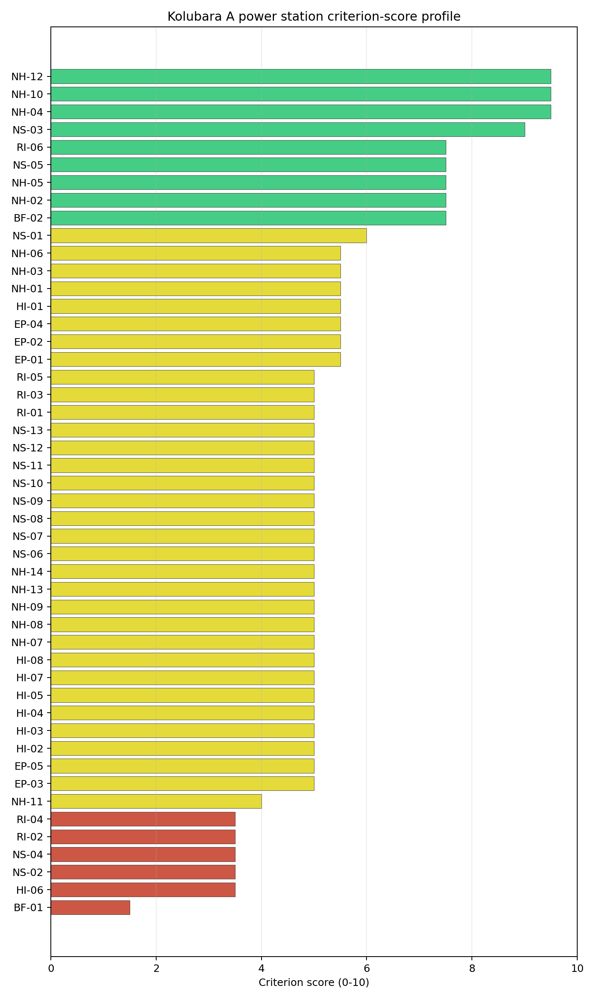
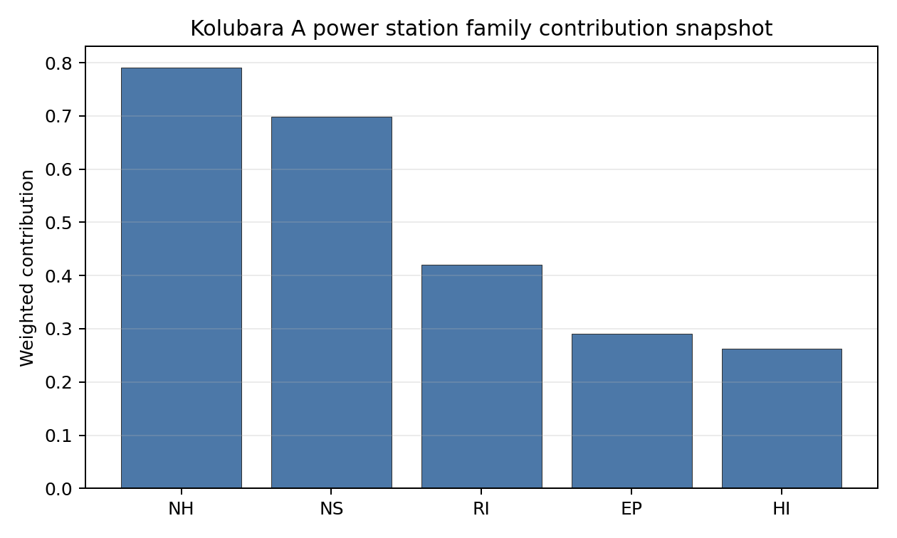

# Kolubara A power station Site Profile

Kolubara A power station is a coal/thermal site in Serbia that has been tested against the NuScale VOYGR-6 reference deployment envelope. This profile reads the screening evidence at a level that supports a decision to progress toward Stage 3 characterization. It is not a site-suitability determination, vendor recommendation, or licensing finding.

## Note on Site Identity

The Kolubara A entry is the **operating EPS thermal block at Veliki Crljeni in the Lazarevac coal basin** (Serbia's oldest TPP, with 4 operating units commissioned 1956–1979 plus 1 mothballed unit, totalling 271 MW). The screening database also carries a separate [Kolubara B power station](RS_kolubara_b_power_station.md) entry at coordinates ~1.6 km away on the same brownfield envelope; that entry corresponds to the **planned but never-built 2 × 350 MW expansion** of the same EPS Kolubara complex. Both entries share the same parent owner (Elektroprivreda Srbije Beograd AD), the same subnational unit (Veliki Crljeni / Lazarevac), the same cooling-source envelope (the Турија / Turija river at ~10 m³/s), the same grid envelope (110 kV / 175 MW export), the same nearest airport, military, and protected-area distances, and the same screening reads on every substantive criterion. **For SMR siting purposes, Kolubara A is the primary entry and the country recommendations treat the Kolubara A and Kolubara B entries as a single Veliki Crljeni candidate slot rather than two separate sites.**

## Site Snapshot

| Field | Value |
| --- | --- |
| Site name | Kolubara A power station |
| Coordinates | 44.4803, 20.2935 |
| Subnational unit | Beograd |
| Installed thermal capacity (source data) | 271 MW |
| Composite score (baseline weights) | 5.646 (4.154-6.061 MC band) |
| National stability band | B (top-10% hit rate 81%) |
| National rank | 1 |

_See the country status map in_ [Serbia Country Profile](../RS_country_prototype.md#country-status-map).

## Ownership and Coal-to-Nuclear Context

- **Elektroprivreda Srbije Beograd AD** (100.00% share), headquartered in Serbia; immediate operator Elektroprivreda Srbije Beograd AD. Path: Elektroprivreda Srbije Beograd AD -> Kolubara A power station Unit 1 [100.0%]
- **Government of the Republic of Serbia** (100.00% share), headquartered in Serbia; immediate operator Elektroprivreda Srbije Beograd AD. Path: Government of the Republic of Serbia  -> Elektroprivreda Srbije Beograd AD [100.0%] -> Kolubara A power station Unit 1 [100.0%]

Generating units on record: 1 mothballed, 4 operating.
Earliest unit commissioning: 1956; most recent: 1979.

## Natural Hazards (NH)

- **Seismic: Ground Motion (NH-01)** - score 5.5/10 (MC 5.0-6.0), weight 0.0396, data quality high. Evidence: PGA at 475-year return period 0.184 g; PGA at 2,475-year return period 0.397 g; Vs30 reference (m/s): 760.0.
- **Seismic: Surface Rupture (NH-02)** - score 7.5/10 (MC 7.0-8.0), weight n/a, data quality screening grade. Evidence: nearest mapped capable fault 13.0 km; fault slip rate 0.071 mm/yr; fault name: RSCF00J.
- **Geotechnical: Liquefaction (NH-03)** - score 5.5/10 (MC 5.0-6.0), weight n/a, data quality medium. Evidence: liquefaction susceptibility: moderate; dominant soil type: clay_loam.
- **Geotechnical: Slope Stability (NH-04)** - score 9.5/10 (MC 9.0-10.0), weight n/a, data quality screening grade. Evidence: site slope 4.59 deg; max slope in 1 km box 80.1 deg; slope stability class: gentle.
- **Geotechnical: Subsidence (NH-05)** - score 7.5/10 (MC 7.0-8.0), weight 0.0308, data quality medium. Evidence: karst present: no; karst severity: none.
- **Geotechnical: Foundation (NH-06)** - score 5.5/10 (MC 5.0-6.0), weight 0.0220, data quality medium. Evidence: bearing capacity 88.7 kPa; depth to bedrock 21.1 m.
- **Volcanism (NH-07)** - score 5.0/10 (MC 5.0-5.0), weight n/a, data quality high. Evidence: volcanic hazard class: negligible.
- **Coastal Flooding (NH-08)** - score 5.0/10 (MC 5.0-5.0), weight 0.0264, data quality low. Evidence: values not in measurement tables.
- **River Flooding (NH-09)** - score 5.0/10 (MC 5.0-5.0), weight 0.0352, data quality medium. Evidence: flood zone class: negligible.
- **Extreme Winds (NH-10)** - score 9.5/10 (MC 9.0-10.0), weight n/a, data quality medium. Evidence: design wind speed 7.34 m/s.
- **Extreme Precipitation (NH-11)** - score 4.0/10 (MC 4.0-4.0), weight 0.0132, data quality medium. Evidence: extreme daily precipitation 0.24 mm; mean annual precipitation 23.0 mm/yr.
- **Extreme Temperatures (NH-12)** - score 9.5/10 (MC 9.0-10.0), weight 0.0176, data quality medium. Evidence: extreme high temperature 26.5 deg C; extreme low temperature -4.95 deg C.
- **Forest/Wildfire (NH-13)** - score 5.0/10 (MC 5.0-5.0), weight 0.0132, data quality n/a. Evidence: values not in measurement tables.
- **Combined Hazards (NH-14)** - score 5.0/10 (MC 5.0-5.0), weight 0.0132, data quality n/a. Evidence: values not in measurement tables.

### Interpretation - Natural Hazards (NH)

<!-- specialist key=family_natural_hazards scope=site site_id=0182ec25-0df9-4e4b-9861-d76a332bc282 bundle=RS_kolubara_a_power_station_site_bundle.json status=filled by=cursor-agent filled_at=2026-05-03T17:27:35Z -->
Natural hazards at Kolubara A sit in a moderate-seismic Šumadijan envelope on the Kolubara-basin alluvial terrace, with the principal natural-hazard reads in the favourable-to-middle band and the binding question concentrated on a Stage 3 PSHA refinement. **NH-01 Seismic: Ground Motion at 5.5/10** carries a 475-yr PGA of **0.184 g** and a 2,475-yr PGA of **0.397 g** — well below the 0.5 g project Phase-2 avoidance threshold but above the floor of the favourable band, reflecting the active Western-Serbian / Šumadijan seismotectonic envelope where the Kolubara-basin sits at the western margin of the Pannonian-Vardar transition zone. The 0.397 g screening read sits comfortably inside the project envelope but a Stage 3 site-specific PSHA on measured Vs30 with regional source modelling is warranted to confirm the design-basis ground motion. **NH-02 Seismic: Surface Rupture at 7.5/10** carries the nearest mapped capable fault (RSCF00J) at **13.0 km** with a slip rate of 0.071 mm/yr — comfortably outside the 8 km screening exclusion radius. **NH-04 Geotechnical: Slope Stability at 9.5/10** carries a mean site slope of just **4.59°** with a maximum slope of 80.1° on a `gentle` slope-stability class — the Kolubara-basin terrace is essentially flat. **NH-05 Geotechnical: Subsidence at 7.5/10** reads on `karst not present` and `none` severity — one of the cleanest karst envelopes of the first-batch cohort, reflecting the alluvial Kolubara-basin context (in contrast to the discontinuous-carbonate context at Opole and Połaniec). NH-03 reads 5.5/10 with `moderate` liquefaction susceptibility on a clay-loam profile (the Stage 3 CPT campaign should characterise the alluvial-terrace profile). NH-06 reads 5.5/10 on a 88.7 kPa screening-proxy bearing capacity over 21.1 m to bedrock. Extreme meteorology is calm: a 50-yr design wind of 7.34 m/s and an extreme temperature range of -4.95 °C to 26.5 °C are well inside the project envelope (NH-10 and NH-12 at 9.5/10). NH-11 sits at 4.0/10 on the screening proxy. NH-07 reads 5.0/10 (`negligible` volcanic hazard); NH-08 (88.8 m site elevation) is inconclusive on the coastal-flooding case (the inland Šumadijan position removes the case); NH-09 reads 5.0/10 on `medium` data quality with `negligible` flood zone class — the site sits on the Kolubara-river terrace and the regional flood-hazard envelope (the 2014 Kolubara floods are a recent reference event affecting the wider Lazarevac coal basin) needs site-specific re-characterisation. The Stage 3 priority order is therefore: commission a project-specific PSHA on measured Vs30 and the western-Serbian / Šumadijan source-zone characterisation so NH-01 settles on a defensible site-specific design-basis ground motion; commission a site-specific Kolubara-river flood-hazard study with explicit modelling of the 2014 reference event and climate-projected return periods so NH-09 settles against the basin-floor context; and commission a CPT campaign on the alluvial clay-loam profile so NH-03 settles on a measured liquefaction-susceptibility value.
<!-- /specialist key=family_natural_hazards -->

## Human-Induced and Security-Relevant Hazards (HI)

- **Aircraft Crash (HI-01)** - score 5.5/10 (MC 5.0-6.0), weight 0.0308, data quality high. Evidence: nearest airport 24.1 km; nearest flight path 12.1 km; airports within search radius 3; airport name: Zabrežje Airfield; airport type: small_airport.
- **Industrial Explosions (HI-02)** - score 5.0/10 (MC 5.0-5.0), weight 0.0308, data quality low. Evidence: values not in measurement tables.
- **Toxic/Gas Releases (HI-03)** - score 5.0/10 (MC 5.0-5.0), weight 0.0308, data quality low. Evidence: values not in measurement tables.
- **External Fires (HI-04)** - score 5.0/10 (MC 5.0-5.0), weight 0.0264, data quality low. Evidence: values not in measurement tables.
- **Transport Hazards (HI-05)** - score 5.0/10 (MC 5.0-5.0), weight 0.0264, data quality n/a. Evidence: values not in measurement tables.
- **Military Installations (HI-06)** - score 3.5/10 (MC 3.0-4.0), weight 0.0264, data quality medium. Evidence: nearest military installation 21.6 km; military installations within radius 4.
- **Electromagnetic Interference (HI-07)** - score 5.0/10 (MC 5.0-5.0), weight 0.0088, data quality medium. Evidence: nearest high-power transmitter 0.16 km; transmitters within radius 107; transmitter type: mast.
- **Other Nuclear Installations (HI-08)** - score 5.0/10 (MC 5.0-5.0), weight 0.0132, data quality n/a. Evidence: values not in measurement tables.

### Interpretation - Human-Induced and Security-Relevant Hazards (HI)

<!-- specialist key=family_human_hazards scope=site site_id=0182ec25-0df9-4e4b-9861-d76a332bc282 bundle=RS_kolubara_a_power_station_site_bundle.json status=filled by=cursor-agent filled_at=2026-05-03T17:27:35Z -->
Human-induced and security-relevant hazards at Kolubara A are middle-band across the family with no binding screening flags and a clean read on the airport, military, and dispersion-source axes. **HI-01 Aircraft Crash at 5.5/10** carries the **Zabrežje Airfield (`small_airport`) at 24.1 km** (well outside the SSG-35 A1 10 km screening exclusion radius for general-aviation airfields under 10 km) but with the nearest flight-path projection at **12.1 km** — outside the 8 km project A4 flight-path projection trigger. The Zabrežje Airfield is a small recreational facility on the western Belgrade approaches and the Stage 3 SSG-79 hazard assessment will need to model the flight-path geometry against the SMR airframe, but the 24.1 km distance and the outside-trigger flight-path projection mean this is informational rather than binding. **HI-06 Military Installations at 3.5/10** carries the nearest military installation at **21.6 km** with **4 features inside the 25 km screening radius** — well outside the 8 km project A6 trigger; the criterion is informational rather than binding. **HI-02 Industrial Explosions, HI-03 Toxic / Gas Releases, HI-04 External Fires** all sit at the pass-mark default of 5.0/10 on `low` data quality (the Serbian Seveso and pollutant-release inventories have limited coverage in the screening cadastre); the immediate Lazarevac coal-basin context outside the existing thermal complex includes the Kolubara surface-mining operations and the wider EPS thermal-and-mining complex, which the Stage 3 cadastre run will need to characterise explicitly against the SSG-35 hazard typology. **HI-05 Transport Hazards** holds at 5.0/10 — the M22 / E70 highway corridor and the Belgrade-Bar rail line pass through the wider Lazarevac region but the immediate site cadastre is sparse on the hazmat-corridor screen. HI-07 reads 5.0/10 with the nearest broadcast feature at 0.16 km (a mast inside the existing thermal complex) and **107 transmitters inside the EMI search radius** (a moderate broadcast environment, reflecting the western-Belgrade conurbation context). HI-08 is null. The Stage 3 priority order is therefore: commission the Serbian national Seveso, hazmat-corridor, and pollutant-release cadastres so HI-02 to HI-05 lift off the screening default and are characterised against the surrounding Kolubara mining-and-thermal complex (this is the binding HI question for the site, given the heavy-industrial co-location); engage the Serbian Ministry of Defence on the 4 HI-06 features (a routine informational engagement); commission a focused SSG-79 hazard assessment for the Zabrežje Airfield and the wider Belgrade approach corridor; and run the EMI envelope study against the 107-transmitter cadastre.
<!-- /specialist key=family_human_hazards -->

## Radiological Impact and Emergency Planning (RI / EP)

- **Emergency Planning Feasibility (EP-01)** - score 5.5/10 (MC 5.0-6.0), weight n/a, data quality high. Evidence: EP feasibility composite 52.5 /100; road sub-score 52.9 /100; special-population sub-score 90.0 /100; geography sub-score 95.0 /100; population sub-score 80.0 /100; evacuation feasible: yes.
- **Evacuation Routes (EP-02)** - score 5.5/10 (MC 5.0-6.0), weight 0.0264, data quality medium. Evidence: road density in EPZ 0.515 km/km2; road length in EPZ 1,010 km; motorway access: yes.
- **Physical Geography Constraints (EP-03)** - score 5.0/10 (MC 5.0-5.0), weight 0.0220, data quality medium. Evidence: waterways crossing EPZ 0; major river barrier: no.
- **Special Populations (EP-04)** - score 5.5/10 (MC 5.0-6.0), weight 0.0264, data quality medium. Evidence: hospitals in EPZ 11; prisons in EPZ 0; care homes in EPZ 0.
- **Concurrent Hazard Impact (EP-05)** - score 5.0/10 (MC 5.0-5.0), weight 0.0176, data quality n/a. Evidence: values not in measurement tables.
- **Atmospheric Dispersion (RI-01)** - score 5.0/10 (MC 5.0-5.0), weight 0.0264, data quality medium. Evidence: annual mean wind speed 0.77 m/s; atmospheric mixing height 495.1 m; prevailing wind direction: W.
- **Surface Water Dispersion (RI-02)** - score 3.5/10 (MC 3.0-4.0), weight 0.0220, data quality n/a. Evidence: values not in measurement tables.
- **Groundwater Dispersion (RI-03)** - score 5.0/10 (MC 5.0-5.0), weight 0.0220, data quality medium. Evidence: aquifer type: alluvial.
- **Population Density at EPZ Radii (RI-04)** - score 3.5/10 (MC 3.0-4.0), weight 0.0352, data quality screening grade. Evidence: population density within 5 km 144.9 /km2; population density within 16 km 131.2 /km2; population density within 25 km 144.1 /km2; population density within 80 km 179.2 /km2; population within 25 km 282,896 people.
- **Distance to Population Centres (RI-05)** - score 5.0/10 (MC 5.0-5.0), weight 0.0441, data quality screening grade. Evidence: values not in measurement tables.
- **Population Projections (RI-06)** - score 7.5/10 (MC 7.0-8.0), weight 0.0220, data quality screening grade. Evidence: annual population growth rate -0.304 %/yr; projected population at 25 km in 60 yr 157,994 people.

### Interpretation - Radiological Impact and Emergency Planning (RI / EP)

<!-- specialist key=family_radiological_emergency scope=site site_id=0182ec25-0df9-4e4b-9861-d76a332bc282 bundle=RS_kolubara_a_power_station_site_bundle.json status=filled by=cursor-agent filled_at=2026-05-03T17:27:35Z -->
Radiological-impact and emergency-planning conditions at Kolubara A are middle-band across the family with the binding finding the **RI-04 3.5/10 score** for population density at EPZ radii — driven by the western-Belgrade conurbation spillover into the wider 16–25 km envelope. The DRV-02 emergency-planning composite reads **52.5/100 with `evacuation feasible: yes`**, supported by sub-scores on geography (95/100), special populations (90/100), population (80/100), and a road sub-score of **52.9/100** — comfortably the strongest road sub-score of the Serbian site after the Polish portfolio, reflecting the dense Šumadijan road-and-motorway network and the proximity of the M22 / E70 corridor. **EP-02 Evacuation Routes at 5.5/10** reads on a road density of **0.515 km/km² inside the EPZ** with **1,010 km of road length** and motorway access — favourable by first-batch-cohort standards. **EP-04 Special Populations at 5.5/10** carries 11 hospitals inside the EPZ with no prisons or care homes — a moderate special-population estate reflecting the rural-Lazarevac / western-Belgrade context. Population context is moderate-to-elevated: **5 km density 144.9 p/km², 16 km 131.2 p/km², 25 km 144.1 p/km², 80 km 179.2 p/km²** — the 80 km density is the highest of the first-batch cohort by a substantial margin and reflects the **western-Belgrade conurbation spillover into the wider catchment** (Belgrade itself is ~40–50 km away). The 25 km cumulative population is **282,896 people** — RI-04 reads 3.5/10 (a binding caution rather than just informational), the lowest population-density score of the first-batch cohort outside the Bitola/Negotino/Oslomej Macedonian portfolio. The 60-yr projection at 25 km is 157,994 people on a -0.304 %/yr growth track (the wider Šumadijan region is depopulating despite the Belgrade-metro proximity); RI-06 reads 7.5/10 — a structural radiological-impact tailwind. **RI-02 Surface Water Dispersion at 3.5/10** is the second binding caution: the cooling source is a small river (Турија / Turija; see NS-01) with a measured flow of just 10.2 m³/s, providing limited dilution capacity for routine liquid effluent. The atmospheric envelope is calm: **0.77 m/s annual mean wind speed** with a **495 m mixing height** (the lowest mixing height of the first-batch cohort, reflecting the basin-floor context) and a W prevailing direction (towards the western-Belgrade conurbation, which is the radiological-impact-relevant direction); RI-01 sits at 5.0/10 and the Stage 3 work should prioritise the project-specific micro-meteorological station to establish the actual wind rose. RI-03 reads 5.0/10 on the alluvial Kolubara-basin aquifer (vertical and lateral connectivity will need Stage 3 hydrogeological characterisation, particularly important given the basin-floor context and the proximity of the Kolubara surface-mining operations which have substantially modified the local hydrogeology). RI-05 holds at 5.0/10 (`screening grade`). EP-03 reads 5.0/10 (no major river barrier inside the EPZ), and EP-05 sits at 5.0/10. The Stage 3 priority order is therefore: commission a Stage 3 surface-water dispersion model on the Турија and the wider Kolubara-river system so RI-02 lifts off the 3.5/10 binding caution (the small-river cooling-source envelope is a structural radiological-impact constraint); commission the project-specific micro-meteorological station so RI-01 settles on a measured wind rose against the basin-floor context (this is critical given the W prevailing direction towards the western-Belgrade conurbation); engage the Belgrade regional emergency-planning authority on the 11 hospitals and the wider conurbation-spillover EPZ envelope so EP-04 settles on a defensible operational evacuation plan; and commission a Stage 3 hydrogeological survey on the alluvial aquifer with explicit characterisation of the modified hydrogeology from the adjacent Kolubara surface-mining operations.
<!-- /specialist key=family_radiological_emergency -->

## Non-Safety and Implementation Considerations (NS)

- **Grid Capacity Basic Filter (BF-01)** - score 1.5/10 (MC 1.0-2.0), weight 0.0352, data quality n/a. Evidence: values not in measurement tables.
- **Land Area Basic Filter (BF-02)** - score 7.5/10 (MC 7.0-8.0), weight 0.0220, data quality n/a. Evidence: values not in measurement tables.
- **Cooling Water Availability (NS-01)** - score 6.0/10 (MC 6.0-6.0), weight n/a, data quality screening grade. Evidence: distance to cooling source 4.31 km; cooling source flow 10.2 m3/s; cooling source type: river; cooling source name: Турија; water stress label: Low.
- **Grid Connection (NS-02)** - score 3.5/10 (MC 3.0-4.0), weight 0.0352, data quality medium. Evidence: nearest substation 0.16 km; nearest high-voltage line 0.3 km; highest nearby line voltage 110.0 kV; grid export capacity 175.0 MW; substations within radius 206; HV lines within radius 241.
- **Transport Access (NS-03)** - score 9.0/10 (MC 7.0-9.0), weight 0.0352, data quality low. Evidence: nearest highway 1.2 km; nearest rail line 0.16 km; heavy-haul capable: yes.
- **Site Topography (NS-04)** - score 3.5/10 (MC 3.0-4.0), weight 0.0264, data quality medium. Evidence: favourable land cover 36.7 %; moderate land cover 28.4 %; unfavourable land cover 35.0 %; favourable area 77.9 ha; dominant land class: 311.
- **Site Footprint Adequacy (NS-05)** - score 7.5/10 (MC 7.0-8.0), weight 0.0220, data quality high. Evidence: buildable area 51.5 ha; largest contiguous patch 51.5 ha; buildable patch count 9.
- **Existing Infrastructure (NS-06)** - score 5.0/10 (MC 5.0-5.0), weight 0.0220, data quality n/a. Evidence: values not in measurement tables.
- **Environmental Impact (non-rad) (NS-07)** - score 5.0/10 (MC 5.0-5.0), weight 0.0220, data quality n/a. Evidence: values not in measurement tables.
- **Ecological Sensitivity (NS-08)** - score 5.0/10 (MC 5.0-5.0), weight n/a, data quality insufficient. Evidence: natural land cover 35.0 %; distance to nearest protected area 9.693 km; Natura 2000 sensitivity class: unknown; protected-area overlap: no; protected-area sensitivity class: low; Natura 2000 sites within 5 km: 0; nearest protected-area designation: Natural Monument.
- **Socioeconomic Impact (NS-09)** - score 5.0/10 (MC 5.0-5.0), weight 0.0220, data quality n/a. Evidence: values not in measurement tables.
- **Workforce Availability (NS-10)** - score 5.0/10 (MC 5.0-5.0), weight 0.0176, data quality n/a. Evidence: values not in measurement tables.
- **Coal-to-Nuclear Synergies (NS-11)** - score 5.0/10 (MC 5.0-5.0), weight 0.0264, data quality n/a. Evidence: values not in measurement tables.
- **Regulatory/Political Environment (NS-12)** - score 5.0/10 (MC 5.0-5.0), weight 0.0264, data quality n/a. Evidence: values not in measurement tables.
- **Construction Logistics (NS-13)** - score 5.0/10 (MC 5.0-5.0), weight 0.0176, data quality n/a. Evidence: values not in measurement tables.

### Interpretation - Non-Safety and Implementation Considerations (NS)

<!-- specialist key=family_infrastructure scope=site site_id=0182ec25-0df9-4e4b-9861-d76a332bc282 bundle=RS_kolubara_a_power_station_site_bundle.json status=filled by=cursor-agent filled_at=2026-05-03T17:27:35Z -->
Non-safety and implementation conditions at Kolubara A carry a binding NS-02 grid-connection caution and a screening-grade NS-04 land-cover reading, partially offset by a strong NS-03 transport-access read on the wider Šumadijan corridor. **NS-02 Grid Connection at 3.5/10** is the principal NS finding: the nearest substation is **0.16 km from the site** and the nearest high-voltage line is **0.30 km away**, but the **highest nearby line voltage is 110 kV** and the measured **grid export capacity is just 175 MW** — the existing 271 MW thermal block is connected at 110 kV with the wider Belgrade-Šumadijan 220 / 400 kV backbone running through the regional cadastre (206 substations and 241 HV lines inside the search radius reflect the wider conurbation density) but not directly available at the site boundary. An SMR deployment at Kolubara A would require either a substation upgrade and a new short HV connection to the 220/400 kV backbone, or a consolidated transmission-build plan against the wider Veliki Crljeni / Lazarevac complex (which is in any event already accessed via existing EPS transmission infrastructure for the surrounding TPPs and surface mines). **BF-01 Grid Capacity Basic Filter at 1.5/10** reflects the same constraint at the basic-filter level. **NS-03 Transport Access at 9.0/10** carries the strongest transport-access read of the Serbian portfolio: the nearest highway is at **1.2 km**, the nearest **rail line at 0.16 km**, and **heavy-haul capable: yes** — the M22 / E70 corridor and the Belgrade-Bar rail line provide a strong logistics envelope. **NS-01 Cooling Water Availability at 6.0/10** carries cooling water from the **Турија (Turija) river at 4.31 km from the site** with a measured flow of **10.2 m³/s** on a `Low` water-stress label — the small-river cooling-source envelope is a structural cooling-water constraint, particularly for a multi-module SMR deployment where supplementary cooling solutions (cooling tower expansion, Kolubara-river abstraction, or industrial-water recycling from the wider EPS complex) will need explicit Stage 3 assessment. **NS-04 Site Topography at 3.5/10** reads on **36.7% favourable land cover, 28.4% moderate, and 35.0% unfavourable** on 77.9 ha of favourable area — the unfavourable land cover percentage is the highest of the first-batch cohort outside Macedonia, reflecting the dominant land class (likely modified industrial or surface-mining context in the immediate site environs). **NS-05 Site Footprint Adequacy at 7.5/10** reads on a `high` data quality with **51.5 ha of buildable area as a single contiguous patch** across 9 patches — comfortably above the 14 ha A15 contiguous-industrial-land avoidance threshold and adequate for a multi-module SMR deployment. **NS-08 Ecological Sensitivity at 5.0/10** carries `insufficient` data quality with the nearest protected area at 9.693 km on the Natural Monument designation (no Natura 2000 sites inside the 5 km radius — Serbia is outside the EU Natura 2000 network and the Emerald Network has limited screening coverage). **BF-02 Land Area Basic Filter at 7.5/10** confirms the buildable footprint. NS-06, NS-07, NS-09 to NS-13 sit at the pass-mark default of 5.0/10. The Stage 3 priority order is therefore: scope the substation upgrade and the short HV connection to the 220 / 400 kV backbone so NS-02 and BF-01 lift off the 110 kV constraint (this is the dominant feasibility question for the site, but the existing EPS transmission infrastructure on the wider Lazarevac complex makes this a tractable engineering question rather than a structural blocker); commission a multi-year hydrological survey on the Турија and supplementary cooling-source assessment on the Kolubara river so NS-01 settles against climate-projected dry-summer minima; commission a project-specific land-cover survey on the buildable envelope so NS-04 settles on a measured value against the modified industrial / surface-mining context; commission the Emerald Network and national-protected-area screen via the Serbian Ministry of Environment so NS-08 lifts off the `insufficient` read; and run the construction-logistics, workforce, and regulatory surveys.
<!-- /specialist key=family_infrastructure -->

## Composite Score and Stability

Baseline composite score is 5.646, bracketed by Monte Carlo at 4.154-6.061. National stability band is `B` with a top-10% hit rate of 81% across 16 scored Monte Carlo scenarios.

<!-- specialist key=stability scope=site site_id=0182ec25-0df9-4e4b-9861-d76a332bc282 bundle=RS_kolubara_a_power_station_site_bundle.json status=filled by=cursor-agent filled_at=2026-05-03T17:27:35Z -->
Kolubara A's composite of **5.646 (Monte Carlo 4.154–6.061)** is a robust national-tier score that sits comfortably inside the Serbian portfolio: the **national stability band is `B`** with a top-10% hit rate of **81% across 16 scored Monte Carlo scenarios** and a top-5% rate of **69%** — the score is structurally robust under most explored Monte Carlo perturbations, with a substantial probability of moving into the national top tier under favourable parameter combinations. The **regional stability band is `H`** with a top-10% hit rate of **0%** — the site is unambiguously a national candidate but does not break into the top tier of the wider Central-and-Eastern-European cohort, where the Polish and Czech sites with deeper grid inheritance and lower seismic loadings dominate. The composite is anchored by NS-03 transport access (contribution 0.317 from a 9.0/10 score — the M22 / E70 and Belgrade-Bar rail-line proximity), NH-05 geotechnical subsidence (0.231 from a 7.5/10 score — the karst-free alluvial Kolubara-basin context), RI-05 distance to population centres (0.221), NH-01 seismic ground motion (0.218 — the 0.397 g screening read sits comfortably inside the 0.5 g project envelope), NH-09 river flooding (0.176), and HI-01 aircraft crash (0.169). The drag features are the **BF-01 Grid Capacity (1.5/10)**, the **NS-02 Grid Connection (3.5/10)**, the **HI-06 Military Installations (3.5/10 — informational)**, the **NS-04 Site Topography (3.5/10 on the modified industrial / surface-mining context)**, the **RI-02 Surface Water Dispersion (3.5/10 on the small-river Турија cooling envelope)**, and the **RI-04 Population Density at EPZ Radii (3.5/10 from the western-Belgrade conurbation spillover)**. The plain-English read is that **Kolubara A is the unambiguous Serbian national reference SMR candidate** — together with the never-built Kolubara B sister entry at the same Veliki Crljeni brownfield envelope, the EPS Kolubara complex is the only site in the Serbian portfolio with the brownfield-inheritance, transport-access, and (after the substation upgrade) grid-connection envelope to support a multi-module SMR deployment. The cooling-water envelope on the Турија is the binding cooling constraint and will need supplementary-cooling assessment against the Kolubara-river system. The Stage 3 work needed to retire the residual screening flags (PSHA refinement on NH-01, EPZ road-network and emergency-planning matrix on EP-02 and EP-04, surface-water dispersion model on RI-02, micro-meteorological station on RI-01 with explicit attention to the W prevailing direction towards the Belgrade conurbation, substation upgrade for NS-02, and the Serbian national Seveso / pollutant-release cadastre engagement on HI-02 to HI-05) is a substantial but tractable programme-of-work commitment proportionate to a Stage-3 nuclear-licensing case for the only Serbian C2N candidate. Kolubara A should be advanced as the Serbian national candidate, and the country recommendations should treat the Kolubara A and Kolubara B entries as a single Veliki Crljeni candidate slot rather than two separate entries.
<!-- /specialist key=stability -->

## Residual Risk Register

<!-- specialist key=residual_risk scope=site site_id=0182ec25-0df9-4e4b-9861-d76a332bc282 bundle=RS_kolubara_a_power_station_site_bundle.json status=filled by=cursor-agent filled_at=2026-05-03T17:27:35Z -->
| Criterion | Description | Owner | Resolution path |
| --- | --- | --- | --- |
| NS-02 Grid Connection | Highest nearby line voltage 110 kV; grid export capacity 175 MW (well below ≈ 462 MWe reference). | Grid/Transmission | Substation upgrade and short HV connection to wider Belgrade-Šumadijan 220 / 400 kV backbone; tractable engineering question given existing EPS infrastructure on wider Lazarevac complex. |
| NH-01 Seismic Ground Motion | PGA(2,475-yr) 0.397 g — comfortably below 0.5 g Phase-2 caution but in active western-Serbian / Šumadijan envelope. | Geotechnical | Project-specific PSHA on measured Vs30 with western-Serbian source-zone modelling. |
| NS-01 Cooling Water Flow | Cooling source is small Турија (Turija) river at 10.2 m³/s flow; limited reserve capacity for multi-module SMR deployment. | Cooling Systems | Multi-year hydrological survey on Турија; supplementary cooling-source assessment on Kolubara river or industrial-water recycling from wider EPS complex. |
| RI-02 Surface Water Dispersion | Small-river Турија cooling envelope provides limited dilution capacity for routine liquid effluent; binding 3.5/10. | Radiological | Stage 3 surface-water dispersion model on Турија and wider Kolubara-river system; characterise seasonal flow regime and dispersion envelope at low summer flows. |
| RI-04 Population Density at EPZ Radii | Western-Belgrade conurbation spillover into wider 16–25 km envelope; 80 km density 179.2 p/km² is highest of first-batch cohort. | Radiological | Detailed population-density modelling against Belgrade-conurbation spillover with explicit attention to the W prevailing wind direction. |
| RI-01 Atmospheric Dispersion | Annual mean wind speed 0.77 m/s with 495 m mixing height (lowest of cohort); W prevailing direction towards Belgrade conurbation. | Radiological | Project-specific micro-meteorological station (≥ 12 months) on basin-floor terrace; critical given W prevailing direction towards conurbation. |
| EP-04 Special Populations | 11 hospitals inside 16 km EPZ from rural-Lazarevac / western-Belgrade context. | Emergency Planning | Site-specific operational evacuation plan with Belgrade regional emergency-planning authority. |
| HI-02–HI-05 Industrial / Toxic / Fire / Transport Hazards | All sit at pass-mark default of 5.0/10 on `low` data quality; immediate Lazarevac coal-basin context includes Kolubara surface-mining operations and wider EPS complex. | Security/Safety | Serbian national Seveso, hazmat-corridor, pollutant-release, and external-fire cadastre runs against the surrounding Kolubara mining-and-thermal complex. |
| NS-08 Ecological Sensitivity | `Insufficient` data quality with nearest protected area at 9.69 km on Natural Monument designation; Serbia outside EU Natura 2000 network. | Environmental | Site-specific Emerald Network and national-protected-area screen via Serbian Ministry of Environment. |
| RI-03 Groundwater Dispersion | Alluvial Kolubara-basin aquifer with hydrogeology substantially modified by adjacent Kolubara surface-mining operations. | Radiological | Stage 3 hydrogeological survey with explicit characterisation of mining-modified hydrogeology. |
<!-- /specialist key=residual_risk -->

## Stage 3 Follow-Up Checklist

- [ ] Resolve **Grid Connection (NS-02)** avoidance flag - measured {"grid_export_capacity_mw": 175.0} vs threshold Project A13: transmission >= reference SMR net MWe within feasible distance..
- [ ] Re-measure **Grid Capacity Basic Filter (BF-01)** - native score 1.5/10 with confidence insufficient.
- [ ] Re-measure **Military Installations (HI-06)** - native score 3.5/10 with confidence medium.
- [ ] Re-measure **Grid Connection (NS-02)** - native score 3.5/10 with confidence medium.
- [ ] Re-measure **Site Topography (NS-04)** - native score 3.5/10 with confidence medium.
- [ ] Re-measure **Surface Water Dispersion (RI-02)** - native score 3.5/10 with confidence insufficient.
- [ ] Improve data quality for **Coastal Flooding (NH-08)** - current flag `low`.
- [ ] Improve data quality for **Industrial Explosions (HI-02)** - current flag `low`.
- [ ] Improve data quality for **Toxic/Gas Releases (HI-03)** - current flag `low`.
- [ ] Improve data quality for **External Fires (HI-04)** - current flag `low`.
- [ ] Improve data quality for **Transport Access (NS-03)** - current flag `low`.

## Evidence Limitations

- Coastal Flooding (NH-08) - quality `low`.
- Industrial Explosions (HI-02) - quality `low`.
- Toxic/Gas Releases (HI-03) - quality `low`.
- External Fires (HI-04) - quality `low`.
- Transport Access (NS-03) - quality `low`.
