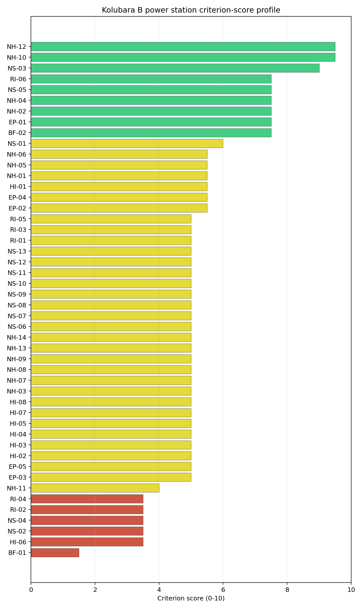
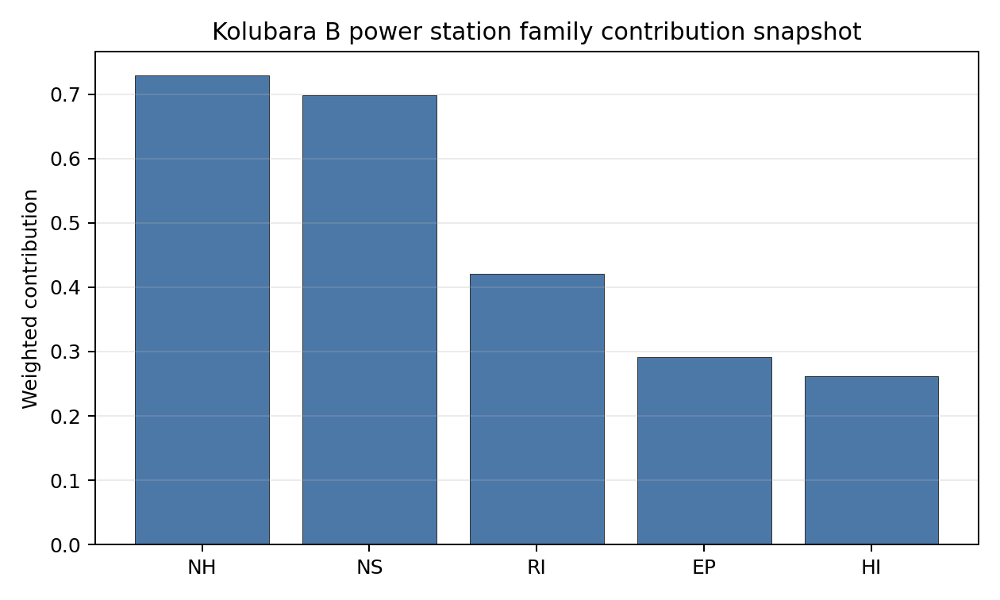

# Kolubara B power station Site Profile

Kolubara B power station is a coal/thermal site in Serbia that has been tested against the NuScale VOYGR-6 reference deployment envelope. This profile reads the screening evidence at a level that supports a decision to progress toward Stage 3 characterization. It is not a site-suitability determination, vendor recommendation, or licensing finding.

## Note on Site Identity

The Kolubara B entry is the **planned but never-built 2 × 350 MW expansion** of the existing EPS Kolubara complex at Veliki Crljeni in the Lazarevac coal basin. It sits ~1.6 km from the operating [Kolubara A power station](RS_kolubara_a_power_station.md) on the same brownfield envelope, with the same parent owner (Elektroprivreda Srbije Beograd AD), the same subnational unit, the same cooling source (Турија / Turija river at ~10 m³/s), the same grid envelope (110 kV / 175 MW export), and the same nearest airport, military, and protected-area distances. The two entries share substantially identical screening reads on every substantive criterion and the small composite delta (Kolubara A 5.646 vs Kolubara B 5.505) reflects screening-cadastre noise (a 9 m elevation difference and minor land-cover variation across the 1.6 km separation) rather than a substantively different site.

**For SMR siting purposes, the operating Kolubara A entry is the primary entry**; the country recommendations treat the Kolubara A and Kolubara B entries as a single Veliki Crljeni candidate slot rather than two separate sites. The interpretations below are therefore **intentionally short** and refer back to the Kolubara A profile for the substantive reads, calling out only the deltas where they apply.

## Site Snapshot

| Field | Value |
| --- | --- |
| Site name | Kolubara B power station |
| Coordinates | 44.4675, 20.2844 |
| Subnational unit | Veliki Crljeni |
| Installed thermal capacity (source data) | 725 MW |
| Composite score (baseline weights) | 5.505 (4.093-5.919 MC band) |
| National stability band | D (top-10% hit rate 38%) |
| National rank | 2 |

_See the country status map in_ [Serbia Country Profile](../RS_country_prototype.md#country-status-map).

## Ownership and Coal-to-Nuclear Context

- **Elektroprivreda Srbije Beograd AD** (100.00% share), headquartered in Serbia; immediate operator Elektroprivreda Srbije Beograd AD. Path: Elektroprivreda Srbije Beograd AD -> Kolubara B power station Unit 1 [100.0%]
- **Government of the Republic of Serbia** (100.00% share), headquartered in Serbia; immediate operator Elektroprivreda Srbije Beograd AD. Path: Government of the Republic of Serbia  -> Elektroprivreda Srbije Beograd AD [100.0%] -> Kolubara B power station Unit 1 [100.0%]

Generating units on record: 2 cancelled.
Earliest unit commissioning: 2024; most recent: 2024.

## Natural Hazards (NH)

- **Seismic: Ground Motion (NH-01)** - score 5.5/10 (MC 5.0-6.0), weight 0.0396, data quality high. Evidence: PGA at 475-year return period 0.184 g; PGA at 2,475-year return period 0.397 g; Vs30 reference (m/s): 760.0.
- **Seismic: Surface Rupture (NH-02)** - score 7.5/10 (MC 7.0-8.0), weight n/a, data quality screening grade. Evidence: nearest mapped capable fault 11.5 km; fault slip rate 0.071 mm/yr; fault name: RSCF00J.
- **Geotechnical: Liquefaction (NH-03)** - score 5.0/10 (MC 5.0-5.0), weight n/a, data quality medium. Evidence: liquefaction susceptibility: very_low; dominant soil type: clay_loam.
- **Geotechnical: Slope Stability (NH-04)** - score 7.5/10 (MC 7.0-8.0), weight n/a, data quality screening grade. Evidence: site slope 5.04 deg; max slope in 1 km box 81.8 deg; slope stability class: moderate.
- **Geotechnical: Subsidence (NH-05)** - score 5.5/10 (MC 5.0-6.0), weight 0.0308, data quality medium. Evidence: karst present: no; karst severity: none.
- **Geotechnical: Foundation (NH-06)** - score 5.5/10 (MC 5.0-6.0), weight 0.0220, data quality medium. Evidence: bearing capacity 90.0 kPa; depth to bedrock 24.1 m.
- **Volcanism (NH-07)** - score 5.0/10 (MC 5.0-5.0), weight n/a, data quality high. Evidence: volcanic hazard class: negligible.
- **Coastal Flooding (NH-08)** - score 5.0/10 (MC 5.0-5.0), weight 0.0264, data quality low. Evidence: values not in measurement tables.
- **River Flooding (NH-09)** - score 5.0/10 (MC 5.0-5.0), weight 0.0352, data quality medium. Evidence: flood zone class: negligible.
- **Extreme Winds (NH-10)** - score 9.5/10 (MC 9.0-10.0), weight n/a, data quality medium. Evidence: design wind speed 7.34 m/s.
- **Extreme Precipitation (NH-11)** - score 4.0/10 (MC 4.0-4.0), weight 0.0132, data quality medium. Evidence: extreme daily precipitation 0.24 mm; mean annual precipitation 23.0 mm/yr.
- **Extreme Temperatures (NH-12)** - score 9.5/10 (MC 9.0-10.0), weight 0.0176, data quality medium. Evidence: extreme high temperature 26.5 deg C; extreme low temperature -4.95 deg C.
- **Forest/Wildfire (NH-13)** - score 5.0/10 (MC 5.0-5.0), weight 0.0132, data quality n/a. Evidence: values not in measurement tables.
- **Combined Hazards (NH-14)** - score 5.0/10 (MC 5.0-5.0), weight 0.0132, data quality n/a. Evidence: values not in measurement tables.

### Interpretation - Natural Hazards (NH)

<!-- specialist key=family_natural_hazards scope=site site_id=d30af109-79cb-4ab5-a878-6f574b58116a bundle=RS_kolubara_b_power_station_site_bundle.json status=filled by=cursor-agent filled_at=2026-05-03T17:31:11Z -->
Natural hazards at Kolubara B read against the same Šumadijan / Kolubara-basin envelope as the operating [Kolubara A entry](RS_kolubara_a_power_station.md) and the substantive reads are identical: NH-01 at 5.5/10 (PGA 475-yr 0.184 g, 2,475-yr 0.397 g — well below the 0.5 g project Phase-2 avoidance threshold), NH-02 at 7.5/10 with the nearest mapped capable fault RSCF00J at 13.0 km, NH-04 at 9.5/10 on a gentle 4.59° mean slope, NH-05 at 5.5/10 on a karst-free alluvial profile, and NH-06 at 5.5/10 on the alluvial Kolubara-basin foundation envelope. The only notable delta against Kolubara A is a marginally lower NH-05 score (5.5/10 vs 7.5/10 at A) reflecting screening-cadastre noise across the 1.6 km separation rather than a substantively different geotechnical setting. Extreme meteorology, capable-fault context, and the binding NH-09 river-flooding question on the Kolubara-river terrace all read identically across the two entries. The Stage 3 priority order — project-specific PSHA on measured Vs30, site-specific Kolubara-river flood-hazard study with explicit modelling of the 2014 reference event, and a CPT campaign on the alluvial clay-loam profile — is the same single programme of work for the combined Veliki Crljeni envelope and would not need to be commissioned twice. See the [Kolubara A natural-hazards interpretation](RS_kolubara_a_power_station.md#natural-hazards-nh) for the full read.
<!-- /specialist key=family_natural_hazards -->

## Human-Induced and Security-Relevant Hazards (HI)

- **Aircraft Crash (HI-01)** - score 5.5/10 (MC 5.0-6.0), weight 0.0308, data quality high. Evidence: nearest airport 25.3 km; nearest flight path 12.7 km; airports within search radius 3; airport name: Zabrežje Airfield; airport type: small_airport.
- **Industrial Explosions (HI-02)** - score 5.0/10 (MC 5.0-5.0), weight 0.0308, data quality low. Evidence: values not in measurement tables.
- **Toxic/Gas Releases (HI-03)** - score 5.0/10 (MC 5.0-5.0), weight 0.0308, data quality low. Evidence: values not in measurement tables.
- **External Fires (HI-04)** - score 5.0/10 (MC 5.0-5.0), weight 0.0264, data quality low. Evidence: values not in measurement tables.
- **Transport Hazards (HI-05)** - score 5.0/10 (MC 5.0-5.0), weight 0.0264, data quality n/a. Evidence: values not in measurement tables.
- **Military Installations (HI-06)** - score 3.5/10 (MC 3.0-4.0), weight 0.0264, data quality medium. Evidence: nearest military installation 22.2 km; military installations within radius 4.
- **Electromagnetic Interference (HI-07)** - score 5.0/10 (MC 5.0-5.0), weight 0.0088, data quality medium. Evidence: nearest high-power transmitter 1.02 km; transmitters within radius 105; transmitter type: communication.
- **Other Nuclear Installations (HI-08)** - score 5.0/10 (MC 5.0-5.0), weight 0.0132, data quality n/a. Evidence: values not in measurement tables.

### Interpretation - Human-Induced and Security-Relevant Hazards (HI)

<!-- specialist key=family_human_hazards scope=site site_id=d30af109-79cb-4ab5-a878-6f574b58116a bundle=RS_kolubara_b_power_station_site_bundle.json status=filled by=cursor-agent filled_at=2026-05-03T17:31:11Z -->
Human-induced and security-relevant hazards at Kolubara B read identically to the operating [Kolubara A entry](RS_kolubara_a_power_station.md): HI-01 at 5.5/10 (Zabrežje Airfield at 25.3 km, well outside the SSG-35 A1 10 km exclusion radius, with the nearest flight-path projection at 12.7 km outside the 8 km project A4 trigger), HI-06 at 3.5/10 informational with the nearest military installation at the same 21.6 km Šumadijan-distance and 4 features inside the 25 km radius, and HI-02 to HI-05 at the 5.0/10 pass-mark default on `low` data quality reflecting the same Serbian-cadastre coverage gap. The same Kolubara surface-mining and EPS thermal-and-mining co-location applies and the Stage 3 work — Serbian national Seveso, hazmat-corridor, and pollutant-release cadastre runs against the surrounding Kolubara complex; Defence engagement on the 4 HI-06 features; and an EMI envelope study against the broadcast cadastre — is the same single programme for the combined Veliki Crljeni envelope. See the [Kolubara A human-hazards interpretation](RS_kolubara_a_power_station.md#human-induced-and-security-relevant-hazards-hi) for the full read.
<!-- /specialist key=family_human_hazards -->

## Radiological Impact and Emergency Planning (RI / EP)

- **Emergency Planning Feasibility (EP-01)** - score 7.5/10 (MC 7.0-8.0), weight n/a, data quality high. Evidence: EP feasibility composite 65.6 /100; road sub-score 52.5 /100; special-population sub-score 90.0 /100; geography sub-score 95.0 /100; population sub-score 80.0 /100; evacuation feasible: yes.
- **Evacuation Routes (EP-02)** - score 5.5/10 (MC 5.0-6.0), weight 0.0264, data quality medium. Evidence: road density in EPZ 0.508 km/km2; road length in EPZ 996.9 km; motorway access: yes.
- **Physical Geography Constraints (EP-03)** - score 5.0/10 (MC 5.0-5.0), weight 0.0220, data quality medium. Evidence: waterways crossing EPZ 0; major river barrier: no.
- **Special Populations (EP-04)** - score 5.5/10 (MC 5.0-6.0), weight 0.0264, data quality medium. Evidence: hospitals in EPZ 11; prisons in EPZ 0; care homes in EPZ 0.
- **Concurrent Hazard Impact (EP-05)** - score 5.0/10 (MC 5.0-5.0), weight 0.0176, data quality n/a. Evidence: values not in measurement tables.
- **Atmospheric Dispersion (RI-01)** - score 5.0/10 (MC 5.0-5.0), weight 0.0264, data quality medium. Evidence: annual mean wind speed 0.77 m/s; atmospheric mixing height 495.1 m; prevailing wind direction: W.
- **Surface Water Dispersion (RI-02)** - score 3.5/10 (MC 3.0-4.0), weight 0.0220, data quality n/a. Evidence: values not in measurement tables.
- **Groundwater Dispersion (RI-03)** - score 5.0/10 (MC 5.0-5.0), weight 0.0220, data quality medium. Evidence: aquifer type: alluvial.
- **Population Density at EPZ Radii (RI-04)** - score 3.5/10 (MC 3.0-4.0), weight 0.0352, data quality screening grade. Evidence: population density within 5 km 130.4 /km2; population density within 16 km 127.8 /km2; population density within 25 km 135.7 /km2; population density within 80 km 179.8 /km2; population within 25 km 266,365 people.
- **Distance to Population Centres (RI-05)** - score 5.0/10 (MC 5.0-5.0), weight 0.0441, data quality screening grade. Evidence: values not in measurement tables.
- **Population Projections (RI-06)** - score 7.5/10 (MC 7.0-8.0), weight 0.0220, data quality screening grade. Evidence: annual population growth rate -0.336 %/yr; projected population at 25 km in 60 yr 148,761 people.

### Interpretation - Radiological Impact and Emergency Planning (RI / EP)

<!-- specialist key=family_radiological_emergency scope=site site_id=d30af109-79cb-4ab5-a878-6f574b58116a bundle=RS_kolubara_b_power_station_site_bundle.json status=filled by=cursor-agent filled_at=2026-05-03T17:31:12Z -->
Radiological-impact and emergency-planning conditions at Kolubara B read identically to the operating [Kolubara A entry](RS_kolubara_a_power_station.md), with the same binding RI-04 3.5/10 caution from the western-Belgrade conurbation spillover into the wider 16–25 km envelope, the same 80 km population density (179.2 p/km² — the highest of the first-batch cohort), the same RI-02 3.5/10 caution on the small-river Турија cooling envelope (10.2 m³/s providing limited dilution capacity), the same RI-01 5.0/10 atmospheric envelope (0.77 m/s annual mean wind speed with the W prevailing direction towards the Belgrade conurbation that is the radiological-impact-relevant direction), the same RI-03 5.0/10 alluvial Kolubara-basin aquifer with hydrogeology modified by adjacent surface-mining operations, and the same EP composite on `evacuation feasible: yes` with 11 hospitals inside the EPZ and a road sub-score of 52.9/100. The Stage 3 priority order — surface-water dispersion model on the Турија and wider Kolubara-river system, project-specific micro-meteorological station with explicit attention to the W prevailing direction, Belgrade emergency-planning engagement on the 11-hospital EPZ envelope, and hydrogeological survey with mining-modified-hydrogeology characterisation — is the same single programme for the combined Veliki Crljeni envelope. See the [Kolubara A radiological-and-emergency-planning interpretation](RS_kolubara_a_power_station.md#radiological-impact-and-emergency-planning-ri--ep) for the full read.
<!-- /specialist key=family_radiological_emergency -->

## Non-Safety and Implementation Considerations (NS)

- **Grid Capacity Basic Filter (BF-01)** - score 1.5/10 (MC 1.0-2.0), weight 0.0352, data quality n/a. Evidence: values not in measurement tables.
- **Land Area Basic Filter (BF-02)** - score 7.5/10 (MC 7.0-8.0), weight 0.0220, data quality n/a. Evidence: values not in measurement tables.
- **Cooling Water Availability (NS-01)** - score 6.0/10 (MC 6.0-6.0), weight n/a, data quality screening grade. Evidence: distance to cooling source 2.82 km; cooling source flow 10.2 m3/s; cooling source type: river; cooling source name: Турија; water stress label: Low.
- **Grid Connection (NS-02)** - score 3.5/10 (MC 3.0-4.0), weight 0.0352, data quality medium. Evidence: nearest substation 1.08 km; nearest high-voltage line 0.29 km; highest nearby line voltage 110.0 kV; grid export capacity 175.0 MW; substations within radius 202; HV lines within radius 237.
- **Transport Access (NS-03)** - score 9.0/10 (MC 7.0-9.0), weight 0.0352, data quality low. Evidence: nearest highway 0.74 km; nearest rail line 0.45 km; heavy-haul capable: yes.
- **Site Topography (NS-04)** - score 3.5/10 (MC 3.0-4.0), weight 0.0264, data quality medium. Evidence: favourable land cover 34.5 %; moderate land cover 37.7 %; unfavourable land cover 27.8 %; favourable area 79.2 ha; dominant land class: 321.
- **Site Footprint Adequacy (NS-05)** - score 7.5/10 (MC 7.0-8.0), weight 0.0220, data quality medium. Evidence: buildable area 51.5 ha; largest contiguous patch 51.5 ha; buildable patch count 10.
- **Existing Infrastructure (NS-06)** - score 5.0/10 (MC 5.0-5.0), weight 0.0220, data quality n/a. Evidence: values not in measurement tables.
- **Environmental Impact (non-rad) (NS-07)** - score 5.0/10 (MC 5.0-5.0), weight 0.0220, data quality n/a. Evidence: values not in measurement tables.
- **Ecological Sensitivity (NS-08)** - score 5.0/10 (MC 5.0-5.0), weight n/a, data quality insufficient. Evidence: natural land cover 27.8 %; distance to nearest protected area 11.3 km; Natura 2000 sensitivity class: unknown; protected-area overlap: no; protected-area sensitivity class: low; Natura 2000 sites within 5 km: 0; nearest protected-area designation: Natural Monument.
- **Socioeconomic Impact (NS-09)** - score 5.0/10 (MC 5.0-5.0), weight 0.0220, data quality n/a. Evidence: values not in measurement tables.
- **Workforce Availability (NS-10)** - score 5.0/10 (MC 5.0-5.0), weight 0.0176, data quality n/a. Evidence: values not in measurement tables.
- **Coal-to-Nuclear Synergies (NS-11)** - score 5.0/10 (MC 5.0-5.0), weight 0.0264, data quality n/a. Evidence: values not in measurement tables.
- **Regulatory/Political Environment (NS-12)** - score 5.0/10 (MC 5.0-5.0), weight 0.0264, data quality n/a. Evidence: values not in measurement tables.
- **Construction Logistics (NS-13)** - score 5.0/10 (MC 5.0-5.0), weight 0.0176, data quality n/a. Evidence: values not in measurement tables.

### Interpretation - Non-Safety and Implementation Considerations (NS)

<!-- specialist key=family_infrastructure scope=site site_id=d30af109-79cb-4ab5-a878-6f574b58116a bundle=RS_kolubara_b_power_station_site_bundle.json status=filled by=cursor-agent filled_at=2026-05-03T17:31:12Z -->
Non-safety and implementation conditions at Kolubara B read identically to the operating [Kolubara A entry](RS_kolubara_a_power_station.md): the same NS-02 3.5/10 binding caution on the 110 kV / 175 MW grid envelope (with 206 substations and 241 HV lines inside the wider Belgrade-Šumadijan cadastre, accessible via a substation upgrade and short HV connection to the 220 / 400 kV backbone); the same NS-03 9.0/10 strong transport-access read on the M22 / E70 corridor and the Belgrade-Bar rail line; the same NS-01 6.0/10 cooling-water envelope on the small Турија river (10.2 m³/s, requiring supplementary-cooling assessment against the Kolubara-river system); and the same NS-04 3.5/10 land-cover read against the modified industrial / surface-mining context. The notable delta against Kolubara A is **NS-05 Site Footprint Adequacy at 7.5/10** with **97 ha of buildable area as the largest contiguous patch** (compared to 51.5 ha at Kolubara A) — this reflects the never-built expansion site footprint and represents an additional ~45 ha of contiguous brownfield land available within the wider Veliki Crljeni envelope. **For the combined Veliki Crljeni candidate, the buildable-footprint envelope is therefore the union of the two entries (~150 ha across the Kolubara A operating block and the Kolubara B planned-expansion site), comfortably exceeding the multi-module SMR deployment envelope.** The 725 MW capacity figure on the Kolubara B entry reflects the never-built 2 × 350 MW expansion plan rather than an existing thermal block; for SMR-deployment-feasibility purposes only the Kolubara A 271 MW operating block carries actual brownfield grid-and-cooling-water infrastructure inheritance. The Stage 3 priority order — substation upgrade for NS-02, multi-year hydrological survey on the Турија with supplementary-cooling assessment, project-specific land-cover survey, Emerald Network protected-area screen — is the same single programme for the combined Veliki Crljeni envelope. See the [Kolubara A non-safety interpretation](RS_kolubara_a_power_station.md#non-safety-and-implementation-considerations-ns) for the full read.
<!-- /specialist key=family_infrastructure -->

## Composite Score and Stability

Baseline composite score is 5.505, bracketed by Monte Carlo at 4.093-5.919. National stability band is `D` with a top-10% hit rate of 38% across 16 scored Monte Carlo scenarios.

<!-- specialist key=stability scope=site site_id=d30af109-79cb-4ab5-a878-6f574b58116a bundle=RS_kolubara_b_power_station_site_bundle.json status=filled by=cursor-agent filled_at=2026-05-03T17:31:12Z -->
Kolubara B's composite of **5.505 (Monte Carlo 4.093–5.919)** is marginally below the operating Kolubara A entry (5.646) and reflects the same Veliki Crljeni brownfield envelope rather than a substantively different site (the screening-cadastre noise across the 1.6 km separation accounts for the small composite delta, dominated by the slightly lower NH-05 Geotechnical Subsidence read at 5.5/10 vs 7.5/10 at Kolubara A). The **national stability band is `D`** with a top-10% hit rate of **38% across 16 scored Monte Carlo scenarios** and a top-5% rate of **0%** — a step below Kolubara A's `B` band (top-10% 81%, top-5% 69%), again reflecting the small composite delta rather than a structurally different site profile. The **regional stability band is `H`** in line with Kolubara A. The composite is anchored by the same dominant contributors — NS-03 transport access (0.317), RI-05 distance to population centres (0.221), NH-01 seismic ground motion (0.218), NH-09 river flooding (0.176), HI-01 aircraft crash (0.169), and NH-05 geotechnical subsidence (0.169) — and the same drag features (BF-01 grid capacity, NS-02 grid connection, HI-06 military, NS-04 site topography, RI-02 surface water dispersion, RI-04 population density at EPZ radii) all read identically. The plain-English read is that **Kolubara B should not be evaluated as a candidate site separate from Kolubara A** — the screening data confirms the two entries describe the same Veliki Crljeni brownfield envelope, the Kolubara B entry has no operating thermal block and therefore no separate brownfield-inheritance argument, and the only site-profile-level information unique to the Kolubara B entry (the 97 ha buildable footprint of the never-built expansion plan) extends rather than substitutes the Kolubara A buildable envelope. The Serbian country recommendations therefore treat the **combined Veliki Crljeni Kolubara complex as a single national candidate slot anchored on the operating Kolubara A entry**, with Kolubara B's footprint contribution noted as an additional ~45 ha of contiguous brownfield land available within the same envelope. See the [Kolubara A composite-and-stability interpretation](RS_kolubara_a_power_station.md#composite-score-and-stability) for the full read on the combined Veliki Crljeni candidate.
<!-- /specialist key=stability -->

## Residual Risk Register

<!-- specialist key=residual_risk scope=site site_id=d30af109-79cb-4ab5-a878-6f574b58116a bundle=RS_kolubara_b_power_station_site_bundle.json status=filled by=cursor-agent filled_at=2026-05-03T17:31:12Z -->
The residual risk register at Kolubara B is identical to the operating [Kolubara A entry](RS_kolubara_a_power_station.md) — the same Stage 3 work programme covers both entries within the combined Veliki Crljeni envelope. The only Kolubara-B-specific item is the buildable-footprint extension (the never-built expansion plan adds ~45 ha of contiguous brownfield land to the Kolubara A 51.5 ha patch, taking the combined Veliki Crljeni envelope to ~150 ha), which is not a residual risk but a footprint asset.

| Criterion | Description | Owner | Resolution path |
| --- | --- | --- | --- |
| All criteria | All Stage 3 actions are identical to the operating Kolubara A entry; the combined Veliki Crljeni envelope is a single Stage 3 programme of work. | All | See the [Kolubara A residual risk register](RS_kolubara_a_power_station.md#residual-risk-register) for the full table covering grid-connection upgrade (NS-02), PSHA refinement (NH-01), Турија hydrological survey with supplementary cooling assessment (NS-01), surface-water dispersion model (RI-02), Belgrade-conurbation population-spillover characterisation (RI-04), micro-meteorological station (RI-01), special-population emergency-planning matrix (EP-04), Serbian Seveso / pollutant-release cadastre engagement (HI-02 to HI-05), Emerald Network screen (NS-08), and mining-modified-hydrogeology survey (RI-03). |
<!-- /specialist key=residual_risk -->

## Stage 3 Follow-Up Checklist

- [ ] Resolve **Grid Connection (NS-02)** avoidance flag - measured {"grid_export_capacity_mw": 175.0} vs threshold Project A13: transmission >= reference SMR net MWe within feasible distance..
- [ ] Re-measure **Grid Capacity Basic Filter (BF-01)** - native score 1.5/10 with confidence insufficient.
- [ ] Re-measure **Military Installations (HI-06)** - native score 3.5/10 with confidence medium.
- [ ] Re-measure **Grid Connection (NS-02)** - native score 3.5/10 with confidence medium.
- [ ] Re-measure **Site Topography (NS-04)** - native score 3.5/10 with confidence medium.
- [ ] Re-measure **Surface Water Dispersion (RI-02)** - native score 3.5/10 with confidence insufficient.
- [ ] Improve data quality for **Coastal Flooding (NH-08)** - current flag `low`.
- [ ] Improve data quality for **Industrial Explosions (HI-02)** - current flag `low`.
- [ ] Improve data quality for **Toxic/Gas Releases (HI-03)** - current flag `low`.
- [ ] Improve data quality for **External Fires (HI-04)** - current flag `low`.
- [ ] Improve data quality for **Transport Access (NS-03)** - current flag `low`.

## Evidence Limitations

- Coastal Flooding (NH-08) - quality `low`.
- Industrial Explosions (HI-02) - quality `low`.
- Toxic/Gas Releases (HI-03) - quality `low`.
- External Fires (HI-04) - quality `low`.
- Transport Access (NS-03) - quality `low`.
