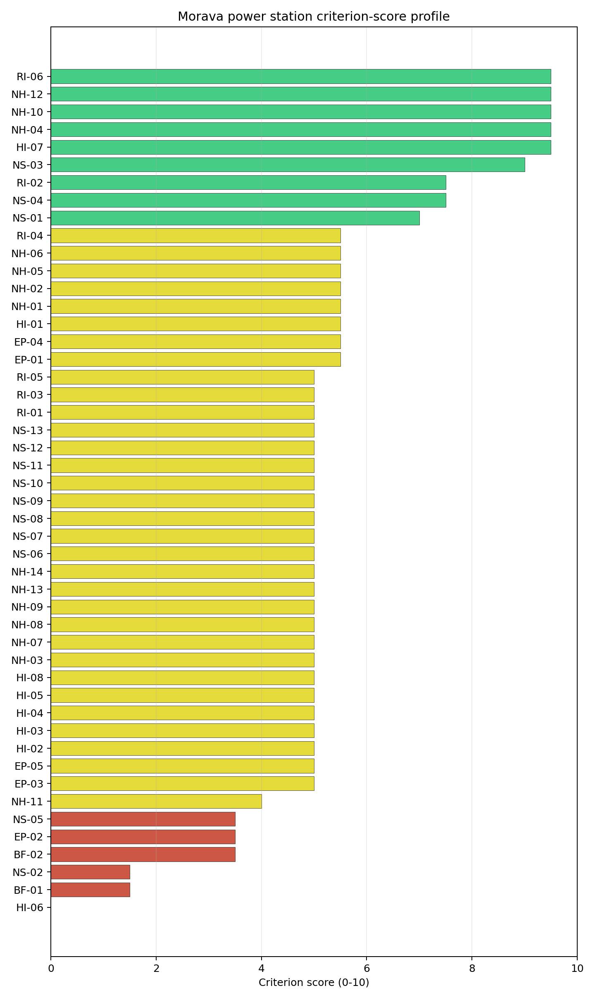
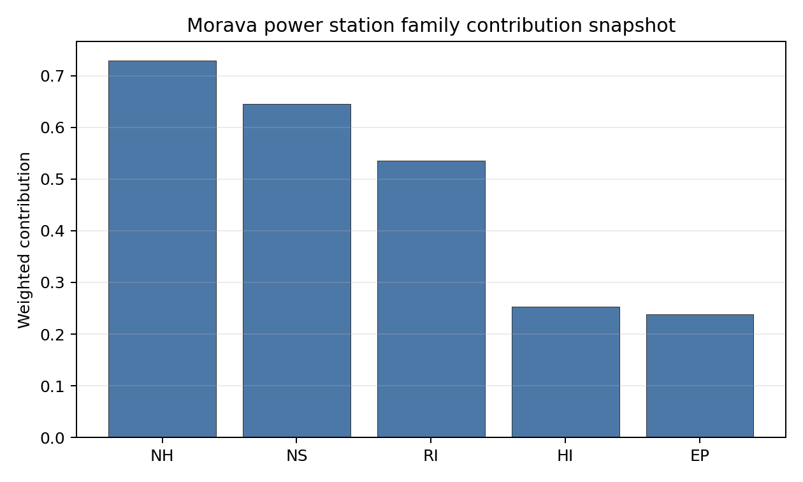

# Morava power station Site Profile

Morava power station is a coal/thermal site in Serbia that has been tested against the NuScale VOYGR-6 reference deployment envelope. This profile reads the screening evidence at a level that supports a decision to progress toward Stage 3 characterization. It is not a site-suitability determination, vendor recommendation, or licensing finding.

## Site Snapshot

| Field | Value |
| --- | --- |
| Site name | Morava power station |
| Coordinates | 44.2238, 21.1631 |
| Subnational unit | Pomoravlje |
| Installed thermal capacity (source data) | 120 MW |
| Composite score (baseline weights) | 5.396 (4.066-5.782 MC band) |
| National stability band | A (top-10% hit rate 81%) |
| National rank | 3 |

_See the country status map in_ [Serbia Country Profile](../RS_country_prototype.md#country-status-map).

## Ownership and Coal-to-Nuclear Context

- **Elektroprivreda Srbije Beograd AD** (100.00% share), headquartered in Serbia; immediate operator Elektroprivreda Srbije Beograd AD. Path: Elektroprivreda Srbije Beograd AD -> Morava power station Unit 1 [100.0%]
- **Government of the Republic of Serbia** (100.00% share), headquartered in Serbia; immediate operator Elektroprivreda Srbije Beograd AD. Path: Government of the Republic of Serbia  -> Elektroprivreda Srbije Beograd AD [100.0%] -> Morava power station Unit 1 [100.0%]

Generating units on record: 1 operating.
Earliest unit commissioning: 1969; most recent: 1969.

## Natural Hazards (NH)

- **Seismic: Ground Motion (NH-01)** - score 5.5/10 (MC 5.0-6.0), weight 0.0396, data quality high. Evidence: PGA at 475-year return period 0.174 g; PGA at 2,475-year return period 0.301 g; Vs30 reference (m/s): 760.0.
- **Seismic: Surface Rupture (NH-02)** - score 5.5/10 (MC 5.0-6.0), weight n/a, data quality screening grade. Evidence: nearest mapped capable fault 7.77 km; fault slip rate 0.071 mm/yr; fault name: RSCF00L.
- **Geotechnical: Liquefaction (NH-03)** - score 5.0/10 (MC 5.0-5.0), weight n/a, data quality medium. Evidence: liquefaction susceptibility: high; dominant soil type: clay_loam.
- **Geotechnical: Slope Stability (NH-04)** - score 9.5/10 (MC 9.0-10.0), weight n/a, data quality screening grade. Evidence: site slope 2.76 deg; max slope in 1 km box 22.9 deg; slope stability class: gentle.
- **Geotechnical: Subsidence (NH-05)** - score 5.5/10 (MC 5.0-6.0), weight 0.0308, data quality medium. Evidence: karst present: no; karst severity: none.
- **Geotechnical: Foundation (NH-06)** - score 5.5/10 (MC 5.0-6.0), weight 0.0220, data quality medium. Evidence: bearing capacity 90.7 kPa; depth to bedrock 21.3 m.
- **Volcanism (NH-07)** - score 5.0/10 (MC 5.0-5.0), weight n/a, data quality high. Evidence: volcanic hazard class: negligible.
- **Coastal Flooding (NH-08)** - score 5.0/10 (MC 5.0-5.0), weight 0.0264, data quality low. Evidence: values not in measurement tables.
- **River Flooding (NH-09)** - score 5.0/10 (MC 5.0-5.0), weight 0.0352, data quality medium. Evidence: flood zone class: negligible.
- **Extreme Winds (NH-10)** - score 9.5/10 (MC 9.0-10.0), weight n/a, data quality medium. Evidence: design wind speed 8.5 m/s.
- **Extreme Precipitation (NH-11)** - score 4.0/10 (MC 4.0-4.0), weight 0.0132, data quality medium. Evidence: extreme daily precipitation 0.21 mm; mean annual precipitation 24.2 mm/yr.
- **Extreme Temperatures (NH-12)** - score 9.5/10 (MC 9.0-10.0), weight 0.0176, data quality medium. Evidence: extreme high temperature 26.1 deg C; extreme low temperature -4.05 deg C.
- **Forest/Wildfire (NH-13)** - score 5.0/10 (MC 5.0-5.0), weight 0.0132, data quality n/a. Evidence: values not in measurement tables.
- **Combined Hazards (NH-14)** - score 5.0/10 (MC 5.0-5.0), weight 0.0132, data quality n/a. Evidence: values not in measurement tables.

### Interpretation - Natural Hazards (NH)

<!-- specialist key=family_natural_hazards scope=site site_id=2b03f2e2-64ac-4262-bbff-7a536bda5722 bundle=RS_morava_power_station_site_bundle.json status=filled by=cursor-agent filled_at=2026-05-03T17:55:09Z -->
Natural hazards at Morava sit in a moderate-seismic Pomoravlje envelope on the Great-Morava-river floodplain terrace, with a moderate NH-02 surface-rupture caution as the principal natural-hazard finding and the rest of the family in the favourable-to-middle band. **NH-01 Seismic: Ground Motion at 5.5/10** carries a 475-yr PGA of **0.174 g** and a 2,475-yr PGA of **0.301 g** — well below the 0.5 g project Phase-2 avoidance threshold and consistent with the central-Serbian Pomoravlje tectonic context (lower than the Kolubara-A 0.397 g read on the western-Serbian Šumadijan margin). **NH-02 Seismic: Surface Rupture at 5.5/10** is the principal NH caution: the nearest mapped capable fault (RSCF00L) sits at **7.77 km from the site** with a slip rate of just 0.071 mm/yr, **just inside the 8 km project A2 avoidance trigger** but outside the 5 km regulatory floor for capable-fault stand-off. The 0.071 mm/yr slip rate is at the low end of the capable-fault classification envelope and a Stage 3 site-specific PSHA with refined fault characterisation may either confirm or downgrade the capability classification of RSCF00L; the 7.77 km offset is on the boundary of the project screening envelope and will be a first-priority Stage 3 question for the site. **NH-04 Geotechnical: Slope Stability at 9.5/10** carries a mean site slope of just **2.76°** with a maximum slope of 22.9° on a `gentle` slope-stability class — the Great Morava floodplain terrace is essentially flat. **NH-03 Geotechnical: Liquefaction at 5.0/10** is a substantive screening flag: the susceptibility reads **`high`** on a clay-loam profile (the Great Morava alluvial terrace is one of the most liquefaction-prone settings of the first-batch cohort), and the Stage 3 CPT campaign will need to characterise the site-specific liquefaction envelope against the SSR-1 design-basis ground-motion-and-liquefaction case, particularly given the NH-02 capable-fault proximity. NH-05 reads 5.5/10 with `karst not present` and `none` severity. NH-06 reads 5.5/10 on a 90.7 kPa screening-proxy bearing capacity over 21.3 m to bedrock. Extreme meteorology is calm: a 50-yr design wind of 8.5 m/s and an extreme temperature range of -4.05 °C to 26.1 °C are well inside the project envelope (NH-10 and NH-12 at 9.5/10). NH-11 sits at 4.0/10 on the screening proxy. NH-07 reads 5.0/10 (`negligible` volcanic hazard); NH-08 (100.68 m site elevation removes the coastal-flooding case) and NH-09 carry inconclusive verdicts; the Great-Morava-river flood-hazard envelope (the 2014 floods affected the wider Pomoravlje region) needs site-specific re-characterisation. The Stage 3 priority order is therefore: commission a project-specific PSHA on measured Vs30 with refined RSCF00L fault characterisation so NH-02 either lifts off the avoidance flag through a downgrade in capability classification or settles on a defensible site-specific design-basis ground motion (this is the first-priority Stage 3 question for the site); commission a site-specific Great-Morava flood-hazard study with explicit modelling of the 2014 reference event and climate-projected return periods so NH-09 lifts off the inconclusive read; and commission a CPT and dynamic-liquefaction campaign on the alluvial clay-loam profile so NH-03 settles on a measured liquefaction-susceptibility value (this is a binding question given the `high` screening read).
<!-- /specialist key=family_natural_hazards -->

## Human-Induced and Security-Relevant Hazards (HI)

- **Aircraft Crash (HI-01)** - score 5.5/10 (MC 5.0-6.0), weight 0.0308, data quality high. Evidence: nearest airport 21.5 km; nearest flight path 10.8 km; airports within search radius 3; airport name: Smederevska Palanka / Rudine Airfield; airport type: small_airport.
- **Industrial Explosions (HI-02)** - score 5.0/10 (MC 5.0-5.0), weight 0.0308, data quality low. Evidence: values not in measurement tables.
- **Toxic/Gas Releases (HI-03)** - score 5.0/10 (MC 5.0-5.0), weight 0.0308, data quality low. Evidence: values not in measurement tables.
- **External Fires (HI-04)** - score 5.0/10 (MC 5.0-5.0), weight 0.0264, data quality low. Evidence: values not in measurement tables.
- **Transport Hazards (HI-05)** - score 5.0/10 (MC 5.0-5.0), weight 0.0264, data quality n/a. Evidence: values not in measurement tables.
- **Military Installations (HI-06)** - score 0.0/10 (MC 0.0-0.0), weight 0.0264, data quality not_found. Evidence: nearest military installation 3.61 km; military installations within radius 0; installation name: Касарна.
- **Electromagnetic Interference (HI-07)** - score 9.5/10 (MC 9.0-10.0), weight 0.0088, data quality not_found. Evidence: nearest high-power transmitter 0.2 km; transmitters within radius 0; transmitter type: mast.
- **Other Nuclear Installations (HI-08)** - score 5.0/10 (MC 5.0-5.0), weight 0.0132, data quality n/a. Evidence: values not in measurement tables.

### Interpretation - Human-Induced and Security-Relevant Hazards (HI)

<!-- specialist key=family_human_hazards scope=site site_id=2b03f2e2-64ac-4262-bbff-7a536bda5722 bundle=RS_morava_power_station_site_bundle.json status=filled by=cursor-agent filled_at=2026-05-03T17:55:09Z -->
Human-induced and security-relevant hazards at Morava are middle-band across the family with the **HI-06 0.0/10 score** a screening-cadastre artefact rather than a substantive military-proximity finding. **HI-06 Military Installations at 0.0/10** carries the nearest military feature listed as `Касарна` (the Serbian Cyrillic term for "barracks") at **3.61 km from the site** with **0 features inside the 25 km radius** on `not_found` data quality — the same screening-cadastre inconsistency seen at PL Opole, where the catalogued nearest-feature distance reads against a zero-radius count, suggesting either a stale entry or a category-classification mismatch in the screening cadastre. The Pomoravlje voivodeship has limited active military estate by Serbian standards and the catalogued `Касарна` entry is likely a non-active or legacy facility. The Stage 3 work should engage the Serbian Ministry of Defence on the Pomoravlje cadastre to obtain an authoritative site-specific footprint so HI-06 settles on a defensible value; the screening flag is unlikely to be a binding constraint after this engagement. **HI-01 Aircraft Crash at 5.5/10** carries the **Smederevska Palanka / Rudine Airfield (`small_airport`) at 21.5 km** (well outside the SSG-35 A1 10 km screening exclusion radius for general-aviation airfields under 10 km), but the nearest flight-path projection at **10.8 km** is just outside the 8 km project A4 trigger — the criterion is informational rather than binding. **HI-02 Industrial Explosions, HI-03 Toxic / Gas Releases, HI-04 External Fires** all sit at the pass-mark default of 5.0/10 on `low` data quality (the Serbian national Seveso and pollutant-release inventories have limited screening coverage); the immediate Pomoravlje context outside the existing thermal complex is rural-agricultural and the Stage 3 cadastre run will not be expected to surface substantive constraints. **HI-05 Transport Hazards** holds at 5.0/10. **HI-07 Electromagnetic Interference at 9.5/10** carries the nearest broadcast feature at 0.2 km (a mast inside the existing thermal complex) with **0 transmitters inside the EMI search radius** on `not_found` data quality — another screening-cadastre artefact (the 0.2 km mast inside the complex is captured but the wider regional cadastre does not appear to be picked up), but the Pomoravlje context is structurally sparse on broadcast infrastructure compared to the Polish portfolio. HI-08 is null. The Stage 3 priority order is therefore: engage the Serbian Ministry of Defence on the Pomoravlje military cadastre so HI-06 settles on a defensible value and the 0.0/10 screening artefact is retired; commission the Serbian national Seveso, hazmat-corridor, and pollutant-release cadastres so HI-02 to HI-05 lift off the screening default; commission a focused SSG-79 hazard assessment for the Smederevska Palanka airfield against the wider Belgrade-southeast approach corridor; and run an EMI envelope study against the wider Pomoravlje broadcast cadastre.
<!-- /specialist key=family_human_hazards -->

## Radiological Impact and Emergency Planning (RI / EP)

- **Emergency Planning Feasibility (EP-01)** - score 5.5/10 (MC 5.0-6.0), weight n/a, data quality high. Evidence: EP feasibility composite 55.5 /100; road sub-score 45.8 /100; special-population sub-score 90.0 /100; geography sub-score 95.0 /100; population sub-score 80.0 /100; evacuation feasible: yes.
- **Evacuation Routes (EP-02)** - score 3.5/10 (MC 3.0-4.0), weight 0.0264, data quality medium. Evidence: road density in EPZ 0.397 km/km2; road length in EPZ 779.4 km; motorway access: yes.
- **Physical Geography Constraints (EP-03)** - score 5.0/10 (MC 5.0-5.0), weight 0.0220, data quality medium. Evidence: waterways crossing EPZ 0; major river barrier: no.
- **Special Populations (EP-04)** - score 5.5/10 (MC 5.0-6.0), weight 0.0264, data quality medium. Evidence: hospitals in EPZ 10; prisons in EPZ 0; care homes in EPZ 0.
- **Concurrent Hazard Impact (EP-05)** - score 5.0/10 (MC 5.0-5.0), weight 0.0176, data quality n/a. Evidence: values not in measurement tables.
- **Atmospheric Dispersion (RI-01)** - score 5.0/10 (MC 5.0-5.0), weight 0.0264, data quality medium. Evidence: annual mean wind speed 0.82 m/s; atmospheric mixing height 492.6 m; prevailing wind direction: ESE.
- **Surface Water Dispersion (RI-02)** - score 7.5/10 (MC 7.0-8.0), weight 0.0220, data quality n/a. Evidence: values not in measurement tables.
- **Groundwater Dispersion (RI-03)** - score 5.0/10 (MC 5.0-5.0), weight 0.0220, data quality medium. Evidence: aquifer type: sedimentary sands.
- **Population Density at EPZ Radii (RI-04)** - score 5.5/10 (MC 5.0-6.0), weight 0.0352, data quality screening grade. Evidence: population density within 5 km 152.1 /km2; population density within 16 km 92.4 /km2; population density within 25 km 79.1 /km2; population density within 80 km 102.3 /km2; population within 25 km 155,334 people.
- **Distance to Population Centres (RI-05)** - score 5.0/10 (MC 5.0-5.0), weight 0.0441, data quality screening grade. Evidence: values not in measurement tables.
- **Population Projections (RI-06)** - score 9.5/10 (MC 9.0-10.0), weight 0.0220, data quality screening grade. Evidence: annual population growth rate -1.053 %/yr; projected population at 25 km in 60 yr 86,755 people.

### Interpretation - Radiological Impact and Emergency Planning (RI / EP)

<!-- specialist key=family_radiological_emergency scope=site site_id=2b03f2e2-64ac-4262-bbff-7a536bda5722 bundle=RS_morava_power_station_site_bundle.json status=filled by=cursor-agent filled_at=2026-05-03T17:55:09Z -->
Radiological-impact and emergency-planning conditions at Morava are favourable on dispersion and population, with the structural radiological-impact tailwind from a depopulating Pomoravlje region the strongest of the first-batch cohort. The DRV-02 emergency-planning composite reads **55.5/100 with `evacuation feasible: yes`**, supported by sub-scores on geography (95/100), special populations (90/100), and population (80/100), pulled down by a road sub-score of 45.8/100. **EP-02 Evacuation Routes at 3.5/10** carries a road density of just **0.397 km/km² inside the 16 km EPZ** with **779.4 km of road length** and motorway access — the road density is the lowest of the Serbian portfolio and constrains the cross-EPZ evacuation logistics under any reasonable loading; the binding 3.5/10 score reflects the rural-Pomoravlje road-cadastre context. **EP-04 Special Populations at 5.5/10** carries 10 hospitals inside the EPZ with no prisons or care homes (a moderate special-population estate, comparable to Kolubara A). Population context is favourable for radiological impact: **5 km density 152.1 p/km², 16 km 92.4 p/km², 25 km 79.1 p/km², 80 km 102.3 p/km²** on a 25 km cumulative population of just **155,334 people** — RI-04 reads 5.5/10. **RI-06 Population Projections at 9.5/10** is the strongest demographic-tailwind read of the first-batch cohort: the 60-yr projection at 25 km is **86,755 people on a -1.053 %/yr growth track** (the central Serbian Pomoravlje region is depopulating substantially faster than any other first-batch site, reflecting the wider Serbian internal migration and emigration patterns) — over the 60-year SMR operating envelope, the projected EPZ population would shrink by ~45%, which is a structural radiological-impact tailwind that the longer-lived projection horizons cannot ignore. **RI-02 Surface Water Dispersion at 7.5/10** reads on the major-river Great Morava hydraulic envelope (222.9 m³/s flow, see NS-01) — substantially stronger than the small-river Турија envelope at Kolubara A. The atmospheric envelope is calm: **0.82 m/s annual mean wind speed** with a **492.6 m mixing height** (the lowest of the Serbian portfolio, reflecting the basin-floor context) and an **ESE prevailing direction** (towards the Great Morava valley and the eastern Serbian agricultural plain — a favourable radiological direction away from the western-Belgrade conurbation); RI-01 sits at 5.0/10 and the Stage 3 work should commission a project-specific micro-meteorological station for ≥ 12 months. RI-03 reads 5.0/10 on a `sedimentary sands` aquifer (the Great Morava alluvial system; vertical and lateral connectivity will need Stage 3 hydrogeological characterisation, particularly given the high water table on the floodplain and the potential interaction with the cooling-water abstraction). RI-05 reads 5.0/10 on `screening grade`. EP-03 reads 5.0/10 (no major river barrier inside the EPZ — the Great Morava runs alongside the site but does not cut the EPZ in two). EP-05 sits at 5.0/10. The Stage 3 priority order is therefore: commission a 16 km EPZ road-network upgrade plan with the Serbian Ministry of Construction so EP-02 lifts off the 3.5/10 binding caution; commission the project-specific micro-meteorological station so RI-01 settles on a measured wind rose against the Great-Morava-valley basin-floor envelope (the favourable ESE prevailing direction is a substantive radiological-impact finding to confirm); engage the Pomoravlje regional emergency-planning authority on the 10 hospitals inside the EPZ so EP-04 settles on a defensible operational evacuation plan; and commission the Stage 3 hydrogeological survey on the alluvial aquifer with explicit characterisation of the high water table.
<!-- /specialist key=family_radiological_emergency -->

## Non-Safety and Implementation Considerations (NS)

- **Grid Capacity Basic Filter (BF-01)** - score 1.5/10 (MC 1.0-2.0), weight 0.0352, data quality n/a. Evidence: values not in measurement tables.
- **Land Area Basic Filter (BF-02)** - score 3.5/10 (MC 3.0-4.0), weight 0.0220, data quality n/a. Evidence: values not in measurement tables.
- **Cooling Water Availability (NS-01)** - score 7.0/10 (MC 6.0-7.0), weight n/a, data quality screening grade. Evidence: distance to cooling source 0.56 km; cooling source flow 222.9 m3/s; cooling source type: major_river; cooling source name: Great Morava; water stress label: Low-Medium.
- **Grid Connection (NS-02)** - score 1.5/10 (MC 1.0-2.0), weight 0.0352, data quality medium. Evidence: nearest substation 0.2 km; nearest high-voltage line 0.37 km; grid export capacity 125.0 MW; substations within radius 0; HV lines within radius 0.
- **Transport Access (NS-03)** - score 9.0/10 (MC 7.0-9.0), weight 0.0352, data quality low. Evidence: nearest highway 0.3 km; nearest rail line 0.15 km; heavy-haul capable: yes.
- **Site Topography (NS-04)** - score 7.5/10 (MC 7.0-8.0), weight 0.0264, data quality medium. Evidence: favourable land cover 60.5 %; moderate land cover 7.6 %; unfavourable land cover 31.8 %; favourable area 115.0 ha; dominant land class: 211.
- **Site Footprint Adequacy (NS-05)** - score 3.5/10 (MC 3.0-4.0), weight 0.0220, data quality high. Evidence: buildable area 11.4 ha; largest contiguous patch 11.4 ha; buildable patch count 8.
- **Existing Infrastructure (NS-06)** - score 5.0/10 (MC 5.0-5.0), weight 0.0220, data quality n/a. Evidence: values not in measurement tables.
- **Environmental Impact (non-rad) (NS-07)** - score 5.0/10 (MC 5.0-5.0), weight 0.0220, data quality n/a. Evidence: values not in measurement tables.
- **Ecological Sensitivity (NS-08)** - score 5.0/10 (MC 5.0-5.0), weight n/a, data quality insufficient. Evidence: natural land cover 31.8 %; distance to nearest protected area 9.429 km; Natura 2000 sensitivity class: unknown; protected-area overlap: no; protected-area sensitivity class: low; Natura 2000 sites within 5 km: 0; nearest protected-area designation: Natural Monument.
- **Socioeconomic Impact (NS-09)** - score 5.0/10 (MC 5.0-5.0), weight 0.0220, data quality n/a. Evidence: values not in measurement tables.
- **Workforce Availability (NS-10)** - score 5.0/10 (MC 5.0-5.0), weight 0.0176, data quality n/a. Evidence: values not in measurement tables.
- **Coal-to-Nuclear Synergies (NS-11)** - score 5.0/10 (MC 5.0-5.0), weight 0.0264, data quality n/a. Evidence: values not in measurement tables.
- **Regulatory/Political Environment (NS-12)** - score 5.0/10 (MC 5.0-5.0), weight 0.0264, data quality n/a. Evidence: values not in measurement tables.
- **Construction Logistics (NS-13)** - score 5.0/10 (MC 5.0-5.0), weight 0.0176, data quality n/a. Evidence: values not in measurement tables.

### Interpretation - Non-Safety and Implementation Considerations (NS)

<!-- specialist key=family_infrastructure scope=site site_id=2b03f2e2-64ac-4262-bbff-7a536bda5722 bundle=RS_morava_power_station_site_bundle.json status=filled by=cursor-agent filled_at=2026-05-03T17:55:09Z -->
Non-safety and implementation conditions at Morava are constrained by three binding flags on grid capacity, buildable footprint, and the basic-filter combination, partially offset by an exceptionally strong NS-03 transport-access read and a major-river cooling-water envelope. **NS-02 Grid Connection at 1.5/10** is the principal NS finding: the nearest substation is **0.20 km** from the site and the nearest high-voltage line is **0.37 km away**, but the screening cadastre carries **no measured high-voltage line voltage** (the highest-tier line is not picked up — possibly the existing 110 kV connection of the small 120 MW thermal block is the only HV asset on the immediate cadastre) and the measured **grid export capacity is just 125 MW** with **0 substations and 0 HV lines inside the search radius** (the same screening-cadastre artefact as at PL Dolna Odra and RS Morava's HI-06 entry). An SMR deployment at Morava would require both a substation upgrade and a substantial new HV-line build to reach the wider Serbian 220 / 400 kV backbone — a structural transmission-investment question that exceeds the existing thermal block's grid-inheritance envelope. **BF-01 Grid Capacity Basic Filter at 1.5/10** reflects the same constraint at the basic-filter level. **NS-05 Site Footprint Adequacy at 3.5/10** is the second binding flag: the buildable area is just **11.4 ha as the largest contiguous patch** across 8 patches — **just below the 14 ha A15 contiguous-industrial-land avoidance threshold** and well below the multi-module SMR deployment envelope. The existing 120 MW single-unit thermal block (commissioned 1969, the smallest in the Serbian portfolio) cannot accommodate the VOYGR-6 deployment envelope without significant land acquisition outside the current brownfield perimeter, which removes most of the brownfield-inheritance argument. **BF-02 Land Area Basic Filter at 3.5/10** confirms the constraint. **NS-03 Transport Access at 9.0/10** is the strongest NS read of the site and one of the strongest of the first-batch cohort: the nearest highway is at **0.30 km**, the nearest **rail line at 0.15 km**, and **heavy-haul capable: yes** — the M1 / E75 corridor (the major Serbian north-south highway) and the Belgrade-Niš rail line both pass directly through the immediate site environs. **NS-01 Cooling Water Availability at 7.0/10** carries cooling water from the **Great Morava river at 0.56 km from the site** with a measured flow of **222.9 m³/s** on a `Low-Medium` water-stress label — a major-river cooling envelope substantially stronger than the small-Турија envelope at Kolubara A. **NS-04 Site Topography at 7.5/10** reads on **60.5% favourable land cover, 7.6% moderate, and 31.8% unfavourable** on 115.0 ha of favourable area in the wider site environs — the topographic envelope is healthy, but the small NS-05 contiguous patch is the binding gating constraint. **NS-08 Ecological Sensitivity at 5.0/10** carries `insufficient` data quality with the nearest protected area at 9.43 km on the Natural Monument designation; the Stage 3 ecological survey should engage the Serbian Ministry of Environment for a site-specific Emerald Network and national-protected-area screen. NS-06, NS-07, NS-09 to NS-13 sit at the pass-mark default of 5.0/10. The Stage 3 priority order is therefore: scope the substation upgrade and new HV-line build required to lift the grid-export capacity from 125 MW to ≥ 462 MWe so NS-02 and BF-01 lift off their binding flags (this is the dominant feasibility question for the site, and the structural transmission-investment requirement materially weakens the brownfield-inheritance economics); survey the wider Pomoravlje site cadastre for additional contiguous industrial land outside the existing thermal complex so NS-05 and BF-02 lift off their binding flags; commission a multi-year hydrological survey on the Great Morava cooling envelope under climate-projected dry-summer conditions so NS-01 settles against the wider Great-Morava-basin water-management plan; commission the Emerald Network protected-area screen so NS-08 lifts off the `insufficient` read; and run the construction-logistics, workforce, and regulatory surveys.
<!-- /specialist key=family_infrastructure -->

## Composite Score and Stability

Baseline composite score is 5.396, bracketed by Monte Carlo at 4.066-5.782. National stability band is `A` with a top-10% hit rate of 81% across 16 scored Monte Carlo scenarios.

<!-- specialist key=stability scope=site site_id=2b03f2e2-64ac-4262-bbff-7a536bda5722 bundle=RS_morava_power_station_site_bundle.json status=filled by=cursor-agent filled_at=2026-05-03T17:55:09Z -->
Morava's composite of **5.396 (Monte Carlo 4.066–5.782)** is the third Serbian entry behind the combined Veliki Crljeni Kolubara complex (5.646) and reads as a structurally robust national-tier candidate despite the small-scale operating block: the **national stability band is `A`** with a top-10% hit rate of **81% across 16 scored Monte Carlo scenarios** and a top-5% rate also at **81%** — the score is structurally robust under most explored Monte Carlo perturbations and Morava is a clear-cut national candidate for the Serbian portfolio. The **regional stability band is `D`** with a top-10% hit rate of **0%** — the site is unambiguously a national candidate but does not break into the top tier of the wider regional cohort. The composite is anchored by NS-03 transport access (contribution 0.317 from a 9.0/10 score — the M1 / E75 highway and Belgrade-Niš rail-line adjacency), RI-05 distance to population centres (0.221), NH-01 seismic ground motion (0.218 from the 0.301 g read), RI-06 population projections (0.209 from the strongest demographic-tailwind read of the cohort at -1.053 %/yr), NS-04 site topography (0.198), and RI-04 population density at EPZ radii (0.194). The drag features are **HI-06 Military Installations (0.0/10 — screening-cadastre artefact)**, **BF-01 Grid Capacity (1.5/10)**, **NS-02 Grid Connection (1.5/10)**, **BF-02 Land Area (3.5/10)**, **EP-02 Evacuation Routes (3.5/10)**, and **NS-05 Site Footprint Adequacy (3.5/10)**. The plain-English read is that Morava is a **second Serbian national candidate behind the combined Veliki Crljeni Kolubara complex** with substantively different structural strengths and weaknesses: it has a major-river cooling-water envelope (Great Morava 222.9 m³/s, comfortably stronger than the small Турија), a top-tier transport-access read (M1 / E75 + Belgrade-Niš rail), the strongest demographic-tailwind read of the cohort, and a favourable ESE prevailing wind direction away from the Belgrade conurbation — but the 11.4 ha buildable footprint and the 125 MW grid envelope are binding programme-level constraints that require substantial Stage 3 land-acquisition and transmission-build commitments before the brownfield-inheritance economics work. The 7.77 km RSCF00L capable-fault proximity is the single most material first-priority Stage 3 question; the high liquefaction susceptibility on the Great Morava clay-loam terrace is the second. **Recommendation**: include in the Serbian candidate-pool list as a second-tier complement to the Kolubara complex, but do not advance until the Stage 3 capable-fault, footprint-extension, and transmission-investment questions have been retired.
<!-- /specialist key=stability -->

## Residual Risk Register

<!-- specialist key=residual_risk scope=site site_id=2b03f2e2-64ac-4262-bbff-7a536bda5722 bundle=RS_morava_power_station_site_bundle.json status=filled by=cursor-agent filled_at=2026-05-03T17:55:09Z -->
| Criterion | Description | Owner | Resolution path |
| --- | --- | --- | --- |
| NH-02 Seismic Surface Rupture | Capable fault RSCF00L at 7.77 km — just inside the 8 km project A2 avoidance trigger; slip rate 0.071 mm/yr at low end of capability classification. | Geotechnical | First-priority Stage 3 PSHA with refined RSCF00L fault characterisation; potential capability-classification downgrade. |
| NH-03 Geotechnical Liquefaction | `High` susceptibility on clay-loam Great Morava alluvial terrace; binding question given NH-02 capable-fault proximity. | Geotechnical | CPT and dynamic-liquefaction campaign on alluvial profile; design-basis ground-motion-and-liquefaction case against SSR-1. |
| NS-02 Grid Connection | Grid export capacity 125 MW (well below ≈ 462 MWe reference); no measured high-voltage line voltage in screening cadastre. | Grid/Transmission | Substantial substation upgrade and new HV-line build to wider Serbian 220 / 400 kV backbone; structural transmission-investment question. |
| NS-05 Site Footprint Adequacy | Largest contiguous patch 11.4 ha (just below 14 ha A15 threshold) across 8 patches. | Site Engineering | Survey wider Pomoravlje site cadastre for additional contiguous industrial land; assess feasibility of land acquisition outside brownfield perimeter. |
| EP-02 Evacuation Routes | EPZ road density 0.397 km/km² (lowest of Serbian portfolio) on rural Pomoravlje cadastre. | Emergency Planning | EPZ road-network upgrade plan with Serbian Ministry of Construction. |
| NH-09 River Flooding | Great-Morava-river flood envelope is `inconclusive` on the screening proxy; 2014 floods affected wider Pomoravlje. | Hydrology | Site-specific Great-Morava flood-hazard study with explicit modelling of 2014 reference event and climate-projected return periods. |
| HI-02–HI-05 Industrial / Toxic / Fire / Transport | All sit at pass-mark default of 5.0/10 on `low` data quality. | Security/Safety | Serbian national Seveso, hazmat-corridor, pollutant-release, and external-fire cadastre runs. |
| HI-06 Military (cadastre) | `Касарна` listed at 3.61 km but 0 features inside 25 km radius on `not_found` data quality — likely cadastre artefact. | Security/Safety | Engagement with Serbian Ministry of Defence on Pomoravlje military cadastre. |
| NS-08 Ecological Sensitivity | `Insufficient` data quality with nearest protected area at 9.43 km on Natural Monument designation. | Environmental | Site-specific Emerald Network and national-protected-area screen via Serbian Ministry of Environment. |
| NS-01 Cooling Water (climate) | Great Morava cooling envelope at 222.9 m³/s flow on `Low-Medium` water-stress label; vulnerable to climate-projected dry-summer minima. | Cooling Systems | Multi-year hydrological survey on Great Morava under climate-projected dry-summer conditions. |
<!-- /specialist key=residual_risk -->

## Stage 3 Follow-Up Checklist

- [ ] Resolve **Grid Connection (NS-02)** avoidance flag - measured {"grid_export_capacity_mw": 125.0} vs threshold Project A13: transmission >= reference SMR net MWe within feasible distance..
- [ ] Resolve **Site Footprint Adequacy (NS-05)** avoidance flag - measured {"largest_contiguous_ha": 11.41} vs threshold Project A15: >= 14 ha contiguous industrial land..
- [ ] Re-measure **Military Installations (HI-06)** - native score 0.0/10 with confidence medium.
- [ ] Re-measure **Grid Capacity Basic Filter (BF-01)** - native score 1.5/10 with confidence insufficient.
- [ ] Re-measure **Grid Connection (NS-02)** - native score 1.5/10 with confidence medium.
- [ ] Re-measure **Land Area Basic Filter (BF-02)** - native score 3.5/10 with confidence insufficient.
- [ ] Re-measure **Evacuation Routes (EP-02)** - native score 3.5/10 with confidence medium.
- [ ] Improve data quality for **Geotechnical: Subsidence & Collapse (NH-05b)** - current flag `low`.
- [ ] Improve data quality for **Coastal Flooding (NH-08)** - current flag `low`.
- [ ] Improve data quality for **Industrial Explosions (HI-02)** - current flag `low`.
- [ ] Improve data quality for **Toxic/Gas Releases (HI-03)** - current flag `low`.
- [ ] Improve data quality for **External Fires (HI-04)** - current flag `low`.

## Evidence Limitations

- Geotechnical: Subsidence & Collapse (NH-05b) - quality `low`.
- Coastal Flooding (NH-08) - quality `low`.
- Industrial Explosions (HI-02) - quality `low`.
- Toxic/Gas Releases (HI-03) - quality `low`.
- External Fires (HI-04) - quality `low`.
- Military Installations (HI-06) - quality `not_found`.
- Electromagnetic Interference (HI-07) - quality `not_found`.
- Transport Access (NS-03) - quality `low`.
