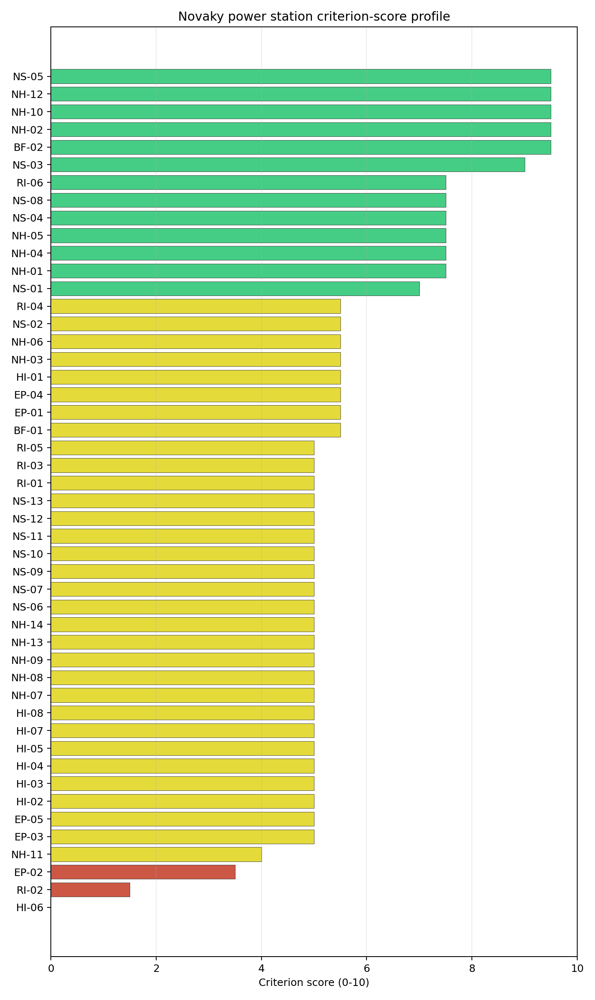
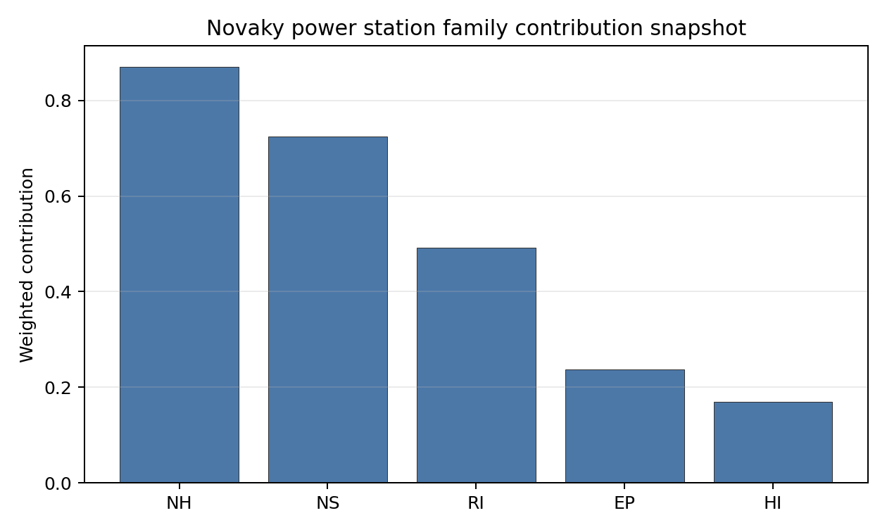

# Novaky power station Site Profile

Novaky power station is a coal/thermal site in Slovakia that has been tested against the NuScale VOYGR-6 reference deployment envelope. This profile reads the screening evidence at a level that supports a decision to progress toward Stage 3 characterization. It is not a site-suitability determination, vendor recommendation, or licensing finding.

## Site Snapshot

| Field | Value |
| --- | --- |
| Site name | Novaky power station |
| Coordinates | 48.6988, 18.5335 |
| Subnational unit | Trenčín |
| Installed thermal capacity (source data) | 472 MW |
| Composite score (baseline weights) | 6.220 (4.291-6.593 MC band) |
| National stability band | A (top-10% hit rate 100%) |
| National rank | 1 |

_See the country status map in_ [Slovakia Country Profile](../SK_country_prototype.md#country-status-map).

## Ownership and Coal-to-Nuclear Context

- **Blackrock Advisors LLC** (0.08% share), headquartered in United States; immediate operator Slovenské Elektrárne AŞ. Path: Blackrock Advisors LLC -> BlackRock Inc [5.07%] -> Enel SpA [5.02%] -> Enel Italia SpA [100.0%] -> Enel Produzione SpA [100.0%] -> Slovak Power Holding BV [50.0%] -> Slovenské Elektrárne AŞ [66.0%] -> Novaky power station Phase B Unit 4 [100.0%]
- **Government of Slovakia** (34.00% share), headquartered in Slovakia; immediate operator Slovenské Elektrárne AŞ. Path: Government of Slovakia  -> Ministry of Economy (Slovakia)  [100.0%] -> Slovenské Elektrárne AŞ [34.0%] -> Novaky power station Phase B Unit 2 [100.0%]
- **Enel SpA** (33.00% share), headquartered in Italy; immediate operator Slovenské Elektrárne AŞ. Path: Enel SpA -> Enel Italia SpA [100.0%] -> Enel Produzione SpA [100.0%] -> Slovak Power Holding BV [50.0%] -> Slovenské Elektrárne AŞ [66.0%] -> Novaky power station Phase B Unit 2 [100.0%]
- **BlackRock Inc** (1.66% share), headquartered in United States; immediate operator Slovenské Elektrárne AŞ. Path: BlackRock Inc -> Enel SpA [5.02%] -> Enel Italia SpA [100.0%] -> Enel Produzione SpA [100.0%] -> Slovak Power Holding BV [50.0%] -> Slovenské Elektrárne AŞ [66.0%] -> Novaky power station Phase B Unit 4 [100.0%]
- **Ministry of Economy (Slovakia)** (34.00% share), headquartered in Slovakia; immediate operator Slovenské Elektrárne AŞ. Path: Ministry of Economy (Slovakia)  -> Slovenské Elektrárne AŞ [34.0%] -> Novaky power station Phase A Unit 3 [100.0%]
- **small shareholder(s)** (23.49% share); immediate operator Slovenské Elektrárne AŞ. Path: small shareholder(s)  -> Enel SpA [71.18%] -> Enel Italia SpA [100.0%] -> Enel Produzione SpA [100.0%] -> Slovak Power Holding BV [50.0%] -> Slovenské Elektrárne AŞ [66.0%] -> Novaky power station Phase B Unit 4 [100.0%]
- **The Vanguard Group Inc** (0.14% share), headquartered in United States; immediate operator Slovenské Elektrárne AŞ. Path: The Vanguard Group Inc -> BlackRock Inc [8.66%] -> Enel SpA [5.02%] -> Enel Italia SpA [100.0%] -> Enel Produzione SpA [100.0%] -> Slovak Power Holding BV [50.0%] -> Slovenské Elektrárne AŞ [66.0%] -> Novaky power station Phase B Unit 4 [100.0%]
- **EP Slovakia BV** (33.00% share), headquartered in Netherlands; immediate operator Slovenské Elektrárne AŞ. Path: EP Slovakia BV -> Slovak Power Holding BV [50.0%] -> Slovenské Elektrárne AŞ [66.0%] -> Novaky power station Phase A Unit 3 [100.0%]
- **Ministry of Economy and Finance (Italy)** (7.78% share), headquartered in Italy; immediate operator Slovenské Elektrárne AŞ. Path: Ministry of Economy and Finance (Italy)  -> Enel SpA [23.59%] -> Enel Italia SpA [100.0%] -> Enel Produzione SpA [100.0%] -> Slovak Power Holding BV [50.0%] -> Slovenské Elektrárne AŞ [66.0%] -> Novaky power station Phase B Unit 2 [100.0%]

Generating units on record: 5 retired.
Earliest unit commissioning: 1957; most recent: 1976.
Retirements span 2013 to 2023, leaving brownfield grid, water, transport, and workforce assets that materially shorten Stage 3 site preparation.

## Natural Hazards (NH)

- **Seismic: Ground Motion (NH-01)** - score 7.5/10 (MC 7.0-8.0), weight 0.0396, data quality high. Evidence: PGA at 475-year return period 0.074 g; PGA at 2,475-year return period 0.168 g; Vs30 reference (m/s): 760.0.
- **Seismic: Surface Rupture (NH-02)** - score 9.5/10 (MC 9.0-10.0), weight n/a, data quality screening grade. Evidence: nearest mapped capable fault 50.0 km; fault slip rate 0 mm/yr; fault name: none_in_search_radius.
- **Geotechnical: Liquefaction (NH-03)** - score 5.5/10 (MC 5.0-6.0), weight n/a, data quality medium. Evidence: liquefaction susceptibility: moderate; dominant soil type: silty_clay_loam.
- **Geotechnical: Slope Stability (NH-04)** - score 7.5/10 (MC 7.0-8.0), weight n/a, data quality screening grade. Evidence: site slope 9.32 deg; max slope in 1 km box 86.1 deg; slope stability class: moderate.
- **Geotechnical: Subsidence (NH-05)** - score 7.5/10 (MC 7.0-8.0), weight 0.0308, data quality medium. Evidence: karst present: no; karst severity: none.
- **Geotechnical: Foundation (NH-06)** - score 5.5/10 (MC 5.0-6.0), weight 0.0220, data quality medium. Evidence: bearing capacity 86.0 kPa; depth to bedrock 25.2 m.
- **Volcanism (NH-07)** - score 5.0/10 (MC 5.0-5.0), weight n/a, data quality high. Evidence: volcanic hazard class: negligible.
- **Coastal Flooding (NH-08)** - score 5.0/10 (MC 5.0-5.0), weight 0.0264, data quality low. Evidence: values not in measurement tables.
- **River Flooding (NH-09)** - score 5.0/10 (MC 5.0-5.0), weight 0.0352, data quality medium. Evidence: flood zone class: negligible.
- **Extreme Winds (NH-10)** - score 9.5/10 (MC 9.0-10.0), weight n/a, data quality medium. Evidence: design wind speed 8.65 m/s.
- **Extreme Precipitation (NH-11)** - score 4.0/10 (MC 4.0-4.0), weight 0.0132, data quality medium. Evidence: extreme daily precipitation 0.25 mm; mean annual precipitation 27.7 mm/yr.
- **Extreme Temperatures (NH-12)** - score 9.5/10 (MC 9.0-10.0), weight 0.0176, data quality medium. Evidence: extreme high temperature 21.4 deg C; extreme low temperature -8.56 deg C.
- **Forest/Wildfire (NH-13)** - score 5.0/10 (MC 5.0-5.0), weight 0.0132, data quality n/a. Evidence: values not in measurement tables.
- **Combined Hazards (NH-14)** - score 5.0/10 (MC 5.0-5.0), weight 0.0132, data quality n/a. Evidence: values not in measurement tables.

### Interpretation - Natural Hazards (NH)

<!-- specialist key=family_natural_hazards scope=site site_id=c97125b3-20ed-4e21-a853-b928644ec7dd bundle=SK_novaky_power_station_site_bundle.json status=filled by=cursor-agent filled_at=2026-05-03T18:07:49Z -->
Natural hazards at Nováky sit in a low-seismic Western-Carpathian envelope on the Hornonitrianska basin (Upper Nitra valley) at 242 m elevation, with the principal natural-hazard reads in the favourable band and no binding cautions. **NH-01 Seismic: Ground Motion at 7.5/10** carries a 475-yr PGA of just **0.074 g** and a 2,475-yr PGA of **0.168 g** — well below the 0.5 g project Phase-2 avoidance threshold and the second-lowest seismic loading of the Slovak portfolio after Vojany I, reflecting the structurally calm Western-Carpathian inner basin. **NH-02 Seismic: Surface Rupture at 9.5/10** carries no mapped capable fault inside the 50 km screening search radius. **NH-04 Geotechnical: Slope Stability at 7.5/10** carries a mean site slope of **9.32°** with a maximum slope of 86.1° on a `moderate` slope-stability class — the Hornonitrianska basin is incised against the Vtáčnik / Strážov massifs and the buildable envelope sits on the basin floor, but the wider 1 km box captures the steep ridge flanks (the maximum slope value reflects topographic relief beyond the buildable envelope rather than a foundation-engineering question). NH-03 reads 5.5/10 with `moderate` liquefaction susceptibility on a silty-clay-loam profile (a Stage 3 CPT campaign should characterise the Hornonitrianska alluvial profile against the SSR-1 design-basis case). **NH-05 Geotechnical: Subsidence at 7.5/10** reads on `karst not present` and `none` severity — a clean karst envelope. NH-06 reads 5.5/10 on a 86.0 kPa screening-proxy bearing capacity over 25.2 m to bedrock. Extreme meteorology is calm: a 50-yr design wind of 8.65 m/s and an extreme temperature range of -8.56 °C to 21.4 °C are well inside the project envelope (NH-10 and NH-12 at 9.5/10). NH-11 sits at 4.0/10 on the screening proxy. NH-07 reads 5.0/10 (`negligible` volcanic hazard); NH-08 (242.06 m site elevation removes the coastal-flooding case) and NH-09 carry inconclusive verdicts. NH-09 needs Stage 3 attention given the Hornonitrianska basin context — the Nitra river and its tributary network drain the basin and the 1958 / 1971 / 2010 historical Nitra-basin floods are reference events that the Stage 3 work should explicitly model. The Stage 3 priority order is therefore: commission a site-specific Nitra / Hornonitrianska basin flood-hazard study with explicit modelling of historical reference events and climate-projected return periods so NH-09 lifts off the inconclusive read; commission a project-specific PSHA on measured Vs30 to confirm the favourable 0.168 g screening read against the Western-Carpathian inner-basin source-zone characterisation; and commission a CPT and dynamic-soil characterisation campaign on the Hornonitrianska alluvial profile so NH-03 settles on a measured liquefaction-susceptibility value.
<!-- /specialist key=family_natural_hazards -->

## Human-Induced and Security-Relevant Hazards (HI)

- **Aircraft Crash (HI-01)** - score 5.5/10 (MC 5.0-6.0), weight 0.0308, data quality high. Evidence: nearest airport 8.44 km; nearest flight path 4.22 km; airports within search radius 10; airport name: Prievidza Airfield; airport type: small_airport.
- **Industrial Explosions (HI-02)** - score 5.0/10 (MC 5.0-5.0), weight 0.0308, data quality medium. Evidence: values not in measurement tables.
- **Toxic/Gas Releases (HI-03)** - score 5.0/10 (MC 5.0-5.0), weight 0.0308, data quality medium. Evidence: values not in measurement tables.
- **External Fires (HI-04)** - score 5.0/10 (MC 5.0-5.0), weight 0.0264, data quality medium. Evidence: values not in measurement tables.
- **Transport Hazards (HI-05)** - score 5.0/10 (MC 5.0-5.0), weight 0.0264, data quality n/a. Evidence: values not in measurement tables.
- **Military Installations (HI-06)** - score 0.0/10 (MC 0.0-0.0), weight 0.0264, data quality high. Evidence: nearest military installation 3.12 km; military installations within radius 14.
- **Electromagnetic Interference (HI-07)** - score 5.0/10 (MC 5.0-5.0), weight 0.0088, data quality medium. Evidence: nearest high-power transmitter 1.95 km; transmitters within radius 108; transmitter type: communication.
- **Other Nuclear Installations (HI-08)** - score 5.0/10 (MC 5.0-5.0), weight 0.0132, data quality n/a. Evidence: values not in measurement tables.

### Interpretation - Human-Induced and Security-Relevant Hazards (HI)

<!-- specialist key=family_human_hazards scope=site site_id=c97125b3-20ed-4e21-a853-b928644ec7dd bundle=SK_novaky_power_station_site_bundle.json status=filled by=cursor-agent filled_at=2026-05-03T18:07:49Z -->
Human-induced and security-relevant hazards at Nováky carry two binding screening flags from the local civil aviation context and the active Slovak military estate inside the wider Hornonitrianska region. **HI-06 Military Installations at 0.0/10** is the principal HI finding and a substantive structural finding (in contrast to the screening-cadastre artefacts at PL Opole and RS Morava): the nearest military feature is at **3.12 km from the site** with **14 features inside the 25 km screening radius** on `high` data quality — well inside the 8 km project A6 ammunition-storage and live-fire avoidance trigger and inside the 5 km regulatory floor. The 14-feature count on `high` data quality reflects the active Slovak military estate in the central Slovak training-area corridor (the Lešť military training area and associated facilities are in the wider Hornonitrianska region, and the Slovak Armed Forces maintain substantial training infrastructure in this part of central Slovakia). The 3.12 km nearest-feature distance is a structural blocker rather than a screening artefact and the Stage 3 work will need to engage the Slovak Ministry of Defence to obtain the site-specific cadastre and assess whether the 14 features include active live-fire installations within the 8 km buffer — the criterion may not be retirable through technical assessment alone if a substantial number of the features are confirmed as active live-fire sites. **HI-01 Aircraft Crash at 5.5/10** carries the **Prievidza Airfield (`small_airport`) at 8.44 km** (just inside the SSG-35 A1 10 km screening exclusion radius for general-aviation airfields under 10 km), with the nearest flight-path projection at **4.22 km** — also inside the 8 km project A4 trigger and inside the 5 km regulatory floor — and **10 air features inside the 30 km search radius** (the densest air-cadastre count of the Slovak portfolio). The Prievidza airfield is the local civil-aviation facility for the Hornonitrianska region with operator-controlled traffic, and the Stage 3 SSG-79 hazard assessment will need to model the flight-path geometry against the SMR airframe envelope. **HI-02 Industrial Explosions, HI-03 Toxic / Gas Releases, HI-04 External Fires** all sit at the pass-mark default of 5.0/10 on `medium` data quality. **HI-05 Transport Hazards** holds at 5.0/10 — the I/9 highway corridor and the Nováky industrial-rail junction pass through the immediate site environs, and the wider Hornonitrianska industrial corridor includes the historic Nováky chemical complex (NCHZ) which is a substantive Stage 3 cadastre input that the screening cadastre may not fully capture. HI-07 reads 5.0/10 with the nearest broadcast feature at 1.95 km (a communication mast) and **108 transmitters inside the EMI search radius** (a moderate broadcast environment). HI-08 is null. The Stage 3 priority order is therefore: engage the Slovak Ministry of Defence on the 14 HI-06 features to obtain the site-specific cadastre and the live-fire envelope (this is the binding HI question for the site and may not be retirable through technical assessment alone); commission an SSG-79 aircraft-crash hazard assessment for the Prievidza Airfield with explicit modelling of the 4.22 km flight-path projection; commission a Stage 3 cadastre run against the historical Nováky chemical-industry complex so HI-02 to HI-05 settle on a defensible site-specific footprint; and commission an EMI envelope study against the 108-transmitter cadastre.
<!-- /specialist key=family_human_hazards -->

## Radiological Impact and Emergency Planning (RI / EP)

- **Emergency Planning Feasibility (EP-01)** - score 5.5/10 (MC 5.0-6.0), weight n/a, data quality high. Evidence: EP feasibility composite 44.0 /100; road sub-score 43.3 /100; special-population sub-score 90.0 /100; geography sub-score 10.0 /100; population sub-score 80.0 /100; evacuation feasible: yes.
- **Evacuation Routes (EP-02)** - score 3.5/10 (MC 3.0-4.0), weight 0.0264, data quality medium. Evidence: road density in EPZ 0.355 km/km2; road length in EPZ 697.5 km; motorway access: yes.
- **Physical Geography Constraints (EP-03)** - score 5.0/10 (MC 5.0-5.0), weight 0.0220, data quality medium. Evidence: waterways crossing EPZ 78; major river barrier: yes.
- **Special Populations (EP-04)** - score 5.5/10 (MC 5.0-6.0), weight 0.0264, data quality medium. Evidence: hospitals in EPZ 12; prisons in EPZ 0; care homes in EPZ 0.
- **Concurrent Hazard Impact (EP-05)** - score 5.0/10 (MC 5.0-5.0), weight 0.0176, data quality n/a. Evidence: values not in measurement tables.
- **Atmospheric Dispersion (RI-01)** - score 5.0/10 (MC 5.0-5.0), weight 0.0264, data quality medium. Evidence: annual mean wind speed 0.72 m/s; atmospheric mixing height 472.5 m; prevailing wind direction: NNW.
- **Surface Water Dispersion (RI-02)** - score 1.5/10 (MC 1.0-2.0), weight 0.0220, data quality n/a. Evidence: values not in measurement tables.
- **Groundwater Dispersion (RI-03)** - score 5.0/10 (MC 5.0-5.0), weight 0.0220, data quality medium. Evidence: aquifer type: low permeability.
- **Population Density at EPZ Radii (RI-04)** - score 5.5/10 (MC 5.0-6.0), weight 0.0352, data quality screening grade. Evidence: population density within 5 km 139.4 /km2; population density within 16 km 166.5 /km2; population density within 25 km 114.7 /km2; population density within 80 km 110.4 /km2; population within 25 km 225,204 people.
- **Distance to Population Centres (RI-05)** - score 5.0/10 (MC 5.0-5.0), weight 0.0441, data quality screening grade. Evidence: nearest city above 50k people 41.8 km; nearest city population 54,458 people; city name: Trenčín.
- **Population Projections (RI-06)** - score 7.5/10 (MC 7.0-8.0), weight 0.0220, data quality screening grade. Evidence: annual population growth rate -0.05 %/yr; projected population at 25 km in 60 yr 186,685 people.

### Interpretation - Radiological Impact and Emergency Planning (RI / EP)

<!-- specialist key=family_radiological_emergency scope=site site_id=c97125b3-20ed-4e21-a853-b928644ec7dd bundle=SK_novaky_power_station_site_bundle.json status=filled by=cursor-agent filled_at=2026-05-03T18:07:49Z -->
Radiological-impact and emergency-planning conditions at Nováky carry two binding cautions on EP-02 evacuation routes and RI-02 surface-water dispersion, both driven by the constrained Hornonitrianska basin context. The DRV-02 emergency-planning composite reads **44.0/100 with `evacuation feasible: yes`** — the lowest EP-01 composite of the Slovak portfolio, dragged down by a **geography sub-score of just 10/100** (the Hornonitrianska basin is hemmed in by the Vtáčnik / Strážov / Žiar mountains and the geographic constraints on evacuation corridors are substantial — the 78 waterways crossing the EPZ with a `major river barrier: yes` flag confirm the Nitra-river system as a structural geographic constraint) and a road sub-score of 43.3/100. **EP-02 Evacuation Routes at 3.5/10** reads on a road density of **0.355 km/km² inside the 16 km EPZ** with **697.5 km of road length** and motorway access — the road density is the lowest of the Slovak portfolio and reflects the constrained alpine-valley road network. **EP-03 Physical Geography Constraints at 5.0/10** carries the **`major river barrier: yes` flag with 78 waterways crossing the EPZ** — a substantive geographic constraint that the EP composite picks up but the EP-03 score does not fully reflect. **EP-04 Special Populations at 5.5/10** carries 12 hospitals inside the EPZ with no prisons or care homes (a moderate special-population estate). Population context is moderate-to-elevated: **5 km density 139.4 p/km², 16 km 166.5 p/km² (the wider Hornonitrianska conurbation peak inside the EPZ — Prievidza, Nováky, Handlová, Bojnice all sit within the EPZ envelope)**, dropping to 114.7 p/km² at 25 km and 110.4 p/km² at 80 km on a 25 km cumulative population of **225,204 people** — RI-04 reads 5.5/10. The **nearest city above 50k people is Trenčín at 41.8 km with a population of 54,458** — a favourable distance, but the wider Hornonitrianska conurbation (Prievidza ~46k, Handlová ~17k, Bojnice ~5k) sits inside the EPZ. The 60-yr projection at 25 km is 186,685 people on a -0.05 %/yr growth track (the Hornonitrianska region is depopulating only marginally); RI-06 reads 7.5/10. **RI-02 Surface Water Dispersion at 1.5/10** is the second binding caution: the cooling source is the **small Nitra river** (see NS-01) with a measured flow of just **3.77 m³/s**, providing essentially no dilution capacity for routine liquid effluent. The atmospheric envelope is calm: **0.72 m/s annual mean wind speed** with a **472.5 m mixing height** (the lowest of the Slovak portfolio, reflecting the Hornonitrianska basin-floor sheltered context) and an **NNW prevailing direction** (towards the Trenčín / Považská Bystrica corridor); RI-01 sits at 5.0/10. RI-03 reads 5.0/10 on a `low permeability` aquifer (the Hornonitrianska basin basement is generally tight, which is favourable for groundwater-pathway containment but constrains supplementary-cooling options). RI-05 reads 5.0/10 on `screening grade`. EP-05 sits at 5.0/10. The Stage 3 priority order is therefore: commission a Stage 3 surface-water dispersion model on the Nitra river so RI-02 lifts off the 1.5/10 binding caution (the small-river cooling envelope is a structural radiological-impact constraint); commission a 16 km EPZ road-network upgrade plan with the Slovak Ministry of Transport and explicit attention to the major river barriers so EP-02 and EP-03 lift off the binding cautions; engage the Hornonitrianska regional emergency-planning authority on the 12 hospitals and the wider conurbation EPZ so EP-04 settles on a defensible operational evacuation plan for the Prievidza-Handlová-Bojnice corridor; commission the project-specific micro-meteorological station so RI-01 settles on a measured wind rose against the constrained alpine-basin envelope; and commission the Stage 3 hydrogeological survey on the `low permeability` aquifer.
<!-- /specialist key=family_radiological_emergency -->

## Non-Safety and Implementation Considerations (NS)

- **Grid Capacity Basic Filter (BF-01)** - score 5.5/10 (MC 5.0-6.0), weight 0.0352, data quality n/a. Evidence: values not in measurement tables.
- **Land Area Basic Filter (BF-02)** - score 9.5/10 (MC 9.0-10.0), weight 0.0220, data quality n/a. Evidence: values not in measurement tables.
- **Cooling Water Availability (NS-01)** - score 7.0/10 (MC 6.0-7.0), weight n/a, data quality screening grade. Evidence: distance to cooling source 0.73 km; cooling source flow 3.77 m3/s; cooling source type: small_river; cooling source name: Nitra; water stress label: Low.
- **Grid Connection (NS-02)** - score 5.5/10 (MC 3.5-7.5), weight 0.0352, data quality insufficient. Evidence: nearest substation 0.19 km; nearest high-voltage line 0.4 km; highest nearby line voltage 110.0 kV; grid export capacity 472.0 MW; substations within radius 279; HV lines within radius 261.
- **Transport Access (NS-03)** - score 9.0/10 (MC 8.0-9.0), weight 0.0352, data quality high. Evidence: nearest highway 0.34 km; nearest rail line 0.02 km; heavy-haul capable: yes.
- **Site Topography (NS-04)** - score 7.5/10 (MC 7.0-8.0), weight 0.0264, data quality high. Evidence: favourable land cover 73.0 %; moderate land cover 8.8 %; unfavourable land cover 18.2 %; favourable area 217.3 ha; dominant land class: 211.
- **Site Footprint Adequacy (NS-05)** - score 9.5/10 (MC 9.0-10.0), weight 0.0220, data quality medium. Evidence: buildable area 198.9 ha; largest contiguous patch 198.9 ha; buildable patch count 13.
- **Existing Infrastructure (NS-06)** - score 5.0/10 (MC 5.0-5.0), weight 0.0220, data quality n/a. Evidence: values not in measurement tables.
- **Environmental Impact (non-rad) (NS-07)** - score 5.0/10 (MC 5.0-5.0), weight 0.0220, data quality n/a. Evidence: values not in measurement tables.
- **Ecological Sensitivity (NS-08)** - score 7.5/10 (MC 7.0-8.0), weight n/a, data quality high. Evidence: natural land cover 18.2 %; distance to nearest Natura 2000 site 2.223 km; distance to nearest protected area 4.937 km; Natura 2000 overlap: no; Natura 2000 sensitivity class: low; protected-area overlap: no; protected-area sensitivity class: low; nearest Natura 2000 site: Nitrické vrchy; Natura 2000 sites within 5 km: 1; nearest protected-area designation: Protected Landscape Area; second level of protection.
- **Socioeconomic Impact (NS-09)** - score 5.0/10 (MC 5.0-5.0), weight 0.0220, data quality n/a. Evidence: values not in measurement tables.
- **Workforce Availability (NS-10)** - score 5.0/10 (MC 5.0-5.0), weight 0.0176, data quality n/a. Evidence: values not in measurement tables.
- **Coal-to-Nuclear Synergies (NS-11)** - score 5.0/10 (MC 5.0-5.0), weight 0.0264, data quality n/a. Evidence: values not in measurement tables.
- **Regulatory/Political Environment (NS-12)** - score 5.0/10 (MC 5.0-5.0), weight 0.0264, data quality n/a. Evidence: values not in measurement tables.
- **Construction Logistics (NS-13)** - score 5.0/10 (MC 5.0-5.0), weight 0.0176, data quality n/a. Evidence: values not in measurement tables.

### Interpretation - Non-Safety and Implementation Considerations (NS)

<!-- specialist key=family_infrastructure scope=site site_id=c97125b3-20ed-4e21-a853-b928644ec7dd bundle=SK_novaky_power_station_site_bundle.json status=filled by=cursor-agent filled_at=2026-05-03T18:07:49Z -->
Non-safety and implementation conditions at Nováky are exceptionally strong on the buildable-footprint and transport-access axes — the largest single-patch buildable footprint of the first-batch cohort by a substantial margin — partially offset by the small-river cooling envelope and a mid-band grid-connection cadastre. **NS-05 Site Footprint Adequacy at 9.5/10** carries **198.9 ha buildable area as the largest contiguous patch** across 13 patches — the largest single-patch buildable footprint of the first-batch cohort (Polish Opole 159.7 ha, Polish Polaniec 116.4 ha, Macedonian Bitola 145.7 ha) and comfortably accommodating the multi-module SMR deployment envelope with substantial headroom. The Nováky thermal complex was retired in stages between 2013 and 2023 and the brownfield envelope is essentially clean and ready for Stage 3 site preparation. **NS-04 Site Topography at 7.5/10** reads on **73.0% favourable land cover, 8.8% moderate, and 18.2% unfavourable** on **217.3 ha of favourable area** in the wider site environs — the strongest land-cover envelope of the Slovak portfolio. **NS-03 Transport Access at 9.0/10** reads on a `high` data quality with the nearest highway at **0.34 km**, the nearest **rail line at 0.02 km** (essentially adjacent — the Hornonitrianska industrial-rail spur passes through the existing thermal complex), and **heavy-haul capable: yes** — the I/9 highway corridor and the Nováky industrial-rail junction provide a strong logistics envelope for SMR module delivery. **NS-02 Grid Connection at 5.5/10** carries the nearest substation at 0.19 km from the site and the nearest high-voltage line at 0.4 km, with the **highest nearby line voltage at 110 kV** and a measured **grid export capacity of 472 MW** matching the historical thermal-block envelope, with **279 substations and 261 HV lines inside the search radius** on `insufficient` data quality. The 472 MW grid-export envelope at 110 kV is just at the NuScale VOYGR-6 reference SMR rating but the 110 kV tier is below the 220 / 400 kV envelope ideal for a multi-module SMR deployment; the Stage 3 grid-connection survey will need to confirm the actual transmission tier and scope a substation upgrade and short HV connection to the wider Slovak SEPS 220 / 400 kV backbone. **NS-01 Cooling Water Availability at 7.0/10** is a screening-grade-favourable but substantively constrained read: the cooling source is the **small Nitra river** at 0.73 km from the site with a measured flow of just **3.77 m³/s** (one of the lowest cooling-source flows of the first-batch cohort outside Macedonian Oslomej at 2.97 m³/s) on a `Low` water-stress label — the absolute flow envelope is the binding cooling-water constraint for the site, and a multi-module SMR deployment will require either supplementary cooling solutions (cooling tower expansion, dry cooling, or water recirculation) or a substantial upstream water-storage scheme. **NS-08 Ecological Sensitivity at 7.5/10** carries the **Nitrické vrchy Natura 2000 site at 2.223 km** with **1 Natura 2000 site inside the 5 km radius** on a `low` Natura 2000 sensitivity class (no overlap), and the nearest protected area at 4.937 km on the Protected Landscape Area designation (`low` sensitivity, second level of protection) — a tractable ecological envelope that can proceed against an Article 6.3 appropriate-assessment framework. **BF-02 Land Area Basic Filter at 9.5/10 and BF-01 Grid Capacity Basic Filter at 5.5/10** confirm the basic filters. NS-06, NS-07, NS-09 to NS-13 sit at the pass-mark default of 5.0/10. The Stage 3 priority order is therefore: commission a multi-year hydrological survey on the Nitra cooling envelope and an explicit engineering scope on supplementary cooling solutions so NS-01 settles against the binding small-river constraint (this is the dominant feasibility question for the cooling-water envelope of the site, given the absolute 3.77 m³/s flow); scope the substation upgrade and short HV connection to the 220 / 400 kV SEPS backbone so NS-02 settles against the multi-module SMR export envelope; commission an Article 6.3 Natura 2000 appropriate assessment for the Nitrické vrchy site so NS-08 settles on a defensible ecological envelope; and run the construction-logistics, workforce, and regulatory surveys.
<!-- /specialist key=family_infrastructure -->

## Composite Score and Stability

Baseline composite score is 6.220, bracketed by Monte Carlo at 4.291-6.593. National stability band is `A` with a top-10% hit rate of 100% across 16 scored Monte Carlo scenarios.

<!-- specialist key=stability scope=site site_id=c97125b3-20ed-4e21-a853-b928644ec7dd bundle=SK_novaky_power_station_site_bundle.json status=filled by=cursor-agent filled_at=2026-05-03T18:07:49Z -->
Nováky's composite of **6.220 (Monte Carlo 4.291–6.593)** is the strongest Slovak score and one of the strongest in the regional cohort: the **national stability band is `A`** with top-10% and top-5% hit rates of **100% across 16 scored Monte Carlo scenarios**, and the **regional stability band is also `A`** with a top-10% hit rate of **100%** across the regional Monte Carlo — Nováky is the unambiguous Slovak national reference SMR candidate and a top-tier regional candidate, structurally robust under all explored Monte Carlo perturbations. The composite is anchored by NS-03 transport access (contribution 0.317 from a 9.0/10 score — the I/9 highway and Hornonitrianska industrial-rail adjacency), NH-01 seismic ground motion (0.297 from a 7.5/10 score against the favourable 0.168 g read on the structurally calm Western-Carpathian inner basin), NH-05 geotechnical subsidence (0.231 from a 7.5/10 score on the karst-free basin), RI-05 distance to population centres (0.221 — the favourable 41.8 km Trenčín distance), BF-02 land area (0.209), and NS-05 site footprint adequacy (0.209 from the 198.9 ha buildable patch — the largest of the cohort). The drag features are **HI-06 Military Installations (0.0/10 — substantive structural finding from the 14 features inside 25 km on `high` data quality)**, **RI-02 Surface Water Dispersion (1.5/10 — small-river Nitra cooling envelope)**, and **EP-02 Evacuation Routes (3.5/10 — alpine-basin road-network constraint)**. The plain-English read is that **Nováky is the strongest Slovak brownfield SMR candidate and a top-tier regional candidate** — the 198.9 ha clean buildable footprint, the rail-and-highway logistics envelope, the favourable Western-Carpathian seismic context, the structurally aseismic karst-free geotechnical envelope, the moderate 472 MW grid-export envelope, and the favourable Trenčín distance together make this a compelling coal-to-nuclear case. The two binding programme questions for the site are: the HI-06 active military estate at 3.12 km (which requires Slovak Ministry of Defence engagement and may not be retirable through technical assessment alone if the 14 features include active live-fire installations within the 8 km project A6 trigger), and the RI-02 / NS-01 cooling-water envelope on the small Nitra river at 3.77 m³/s (which requires substantial supplementary-cooling engineering for a multi-module deployment). Both are programme-level Stage 3 questions rather than screening artefacts. **Recommendation**: advance Nováky as the leading Slovak national candidate, with the HI-06 military-cadastre engagement and the cooling-water supplementary-engineering scope as priority Stage 3 deliverables.
<!-- /specialist key=stability -->

## Residual Risk Register

<!-- specialist key=residual_risk scope=site site_id=c97125b3-20ed-4e21-a853-b928644ec7dd bundle=SK_novaky_power_station_site_bundle.json status=filled by=cursor-agent filled_at=2026-05-03T18:07:49Z -->
| Criterion | Description | Owner | Resolution path |
| --- | --- | --- | --- |
| HI-06 Military Installations | Nearest military feature at 3.12 km — inside 8 km A6 trigger and 5 km regulatory floor; 14 features inside 25 km on `high` data quality reflecting active central-Slovak military estate. | Security/Safety | Slovak Ministry of Defence engagement; SSG-35 typology classification of each feature; may not be retirable through technical assessment alone if active live-fire installations confirmed inside 8 km. |
| HI-01 Aircraft Crash | Prievidza Airfield at 8.44 km inside SSG-35 A1 10 km exclusion radius; flight-path projection at 4.22 km inside 8 km A4 trigger and 5 km regulatory floor. | Security/Safety | SSG-79 aircraft-crash hazard assessment with explicit flight-path-geometry modelling. |
| RI-02 Surface Water Dispersion | Small Nitra river cooling envelope at 3.77 m³/s flow provides essentially no dilution capacity for routine liquid effluent. | Radiological | Stage 3 surface-water dispersion model on Nitra river; explicit assessment of dispersion envelope at low summer flows. |
| NS-01 Cooling Water Flow | Nitra river at 3.77 m³/s flow is among the lowest of cohort; binding for multi-module SMR deployment. | Cooling Systems | Multi-year hydrological survey on Nitra; engineering scope on supplementary cooling solutions (cooling tower expansion, dry cooling, water recirculation, upstream water-storage scheme). |
| EP-02 Evacuation Routes | EPZ road density 0.355 km/km² (lowest of Slovak portfolio); alpine-basin road-network constraint with major river barriers. | Emergency Planning | EPZ road-network upgrade plan with Slovak Ministry of Transport; explicit attention to the 78 EPZ waterway crossings. |
| EP-04 Special Populations (Hornonitrianska conurbation) | 12 hospitals inside 16 km EPZ; wider Prievidza-Handlová-Bojnice conurbation captured. | Emergency Planning | Site-specific operational evacuation plan with Hornonitrianska regional emergency-planning authority. |
| HI-02–HI-05 Industrial cadastre | Historical Nováky chemical complex (NCHZ) on the wider Hornonitrianska industrial corridor; screening cadastre may not fully capture. | Security/Safety | Stage 3 cadastre run against historical Nováky chemical-industry complex and wider corridor. |
| NS-02 Grid Connection | Highest nearby line voltage 110 kV; 472 MW grid export at 110 kV is below 220/400 kV ideal for multi-module SMR. | Grid/Transmission | Substation upgrade and short HV connection to wider Slovak SEPS 220/400 kV backbone. |
| NS-08 Ecological Sensitivity | Nitrické vrchy Natura 2000 site at 2.223 km on `low` sensitivity; Protected Landscape Area at 4.937 km. | Environmental | Article 6.3 Natura 2000 appropriate assessment for the Nitrické vrchy site. |
| NH-09 River Flooding | Hornonitrianska basin Nitra-river flood envelope is `inconclusive`; 1958 / 1971 / 2010 historical floods are reference events. | Hydrology | Site-specific Nitra / Hornonitrianska basin flood-hazard study with historical reference-event modelling. |
<!-- /specialist key=residual_risk -->

## Stage 3 Follow-Up Checklist

- [ ] Resolve **Aircraft Crash (HI-01)** avoidance flag - measured {"nearest_airport_km": 8.44, "nearest_airport_type": "small_airport"} vs threshold A1 — SSG-35: general-aviation / small airport < 10 km..
- [ ] Re-measure **Military Installations (HI-06)** - native score 0.0/10 with confidence high.
- [ ] Re-measure **Surface Water Dispersion (RI-02)** - native score 1.5/10 with confidence insufficient.
- [ ] Re-measure **Evacuation Routes (EP-02)** - native score 3.5/10 with confidence medium.
- [ ] Re-measure **Extreme Precipitation (NH-11)** - native score 4.0/10 with confidence medium.
- [ ] Re-measure **Physical Geography Constraints (EP-03)** - native score 5.0/10 with confidence medium.
- [ ] Improve data quality for **Coastal Flooding (NH-08)** - current flag `low`.

## Evidence Limitations

- Coastal Flooding (NH-08) - quality `low`.
