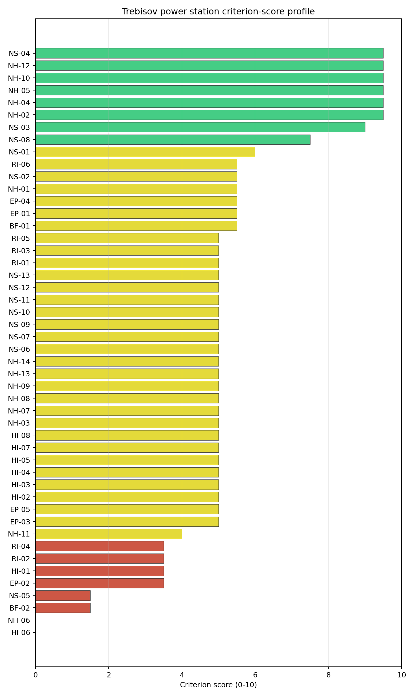
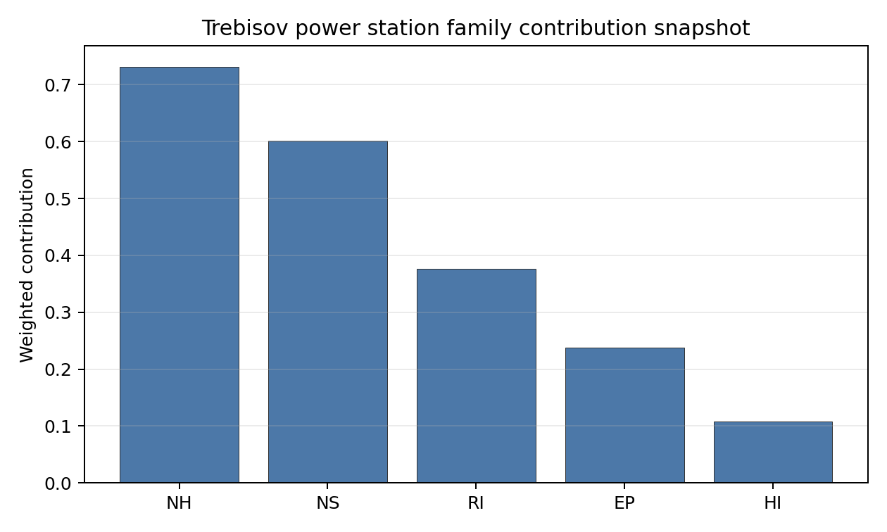

# Trebisov power station Site Profile

Trebisov power station is a coal/thermal site in Slovakia that has been tested against the NuScale VOYGR-6 reference deployment envelope. This profile reads the screening evidence at a level that supports a decision to progress toward Stage 3 characterization. It is not a site-suitability determination, vendor recommendation, or licensing finding.

## Site Snapshot

| Field | Value |
| --- | --- |
| Site name | Trebisov power station |
| Coordinates | 48.6278, 21.7172 |
| Subnational unit | Košice |
| Installed thermal capacity (source data) | 885 MW |
| Composite score (baseline weights) | 5.126 (3.852-5.473 MC band) |
| National stability band | H (top-10% hit rate 0%) |
| National rank | 3 |

_See the country status map in_ [Slovakia Country Profile](../SK_country_prototype.md#country-status-map).

## Ownership and Coal-to-Nuclear Context

Generating units on record: 1 cancelled.

## Natural Hazards (NH)

- **Seismic: Ground Motion (NH-01)** - score 5.5/10 (MC 5.0-6.0), weight 0.0396, data quality high. Evidence: PGA at 475-year return period 0.095 g; PGA at 2,475-year return period 0.236 g; Vs30 reference (m/s): 760.0.
- **Seismic: Surface Rupture (NH-02)** - score 9.5/10 (MC 9.0-10.0), weight n/a, data quality screening grade. Evidence: nearest mapped capable fault 50.0 km; fault slip rate 0 mm/yr; fault name: none_in_search_radius.
- **Geotechnical: Liquefaction (NH-03)** - score 5.0/10 (MC 5.0-5.0), weight n/a, data quality medium. Evidence: liquefaction susceptibility: high.
- **Geotechnical: Slope Stability (NH-04)** - score 9.5/10 (MC 9.0-10.0), weight n/a, data quality screening grade. Evidence: site slope 4.21 deg; max slope in 1 km box 79.9 deg; slope stability class: gentle.
- **Geotechnical: Subsidence (NH-05)** - score 9.5/10 (MC 9.0-10.0), weight 0.0308, data quality medium. Evidence: karst present: no; karst severity: none.
- **Geotechnical: Foundation (NH-06)** - score 0.0/10 (MC 0.0-0.0), weight 0.0220, data quality medium. Evidence: depth to bedrock 23.6 m.
- **Volcanism (NH-07)** - score 5.0/10 (MC 5.0-5.0), weight n/a, data quality high. Evidence: volcanic hazard class: negligible.
- **Coastal Flooding (NH-08)** - score 5.0/10 (MC 5.0-5.0), weight 0.0264, data quality low. Evidence: values not in measurement tables.
- **River Flooding (NH-09)** - score 5.0/10 (MC 5.0-5.0), weight 0.0352, data quality medium. Evidence: flood zone class: negligible.
- **Extreme Winds (NH-10)** - score 9.5/10 (MC 9.0-10.0), weight n/a, data quality medium. Evidence: design wind speed 8.16 m/s.
- **Extreme Precipitation (NH-11)** - score 4.0/10 (MC 4.0-4.0), weight 0.0132, data quality medium. Evidence: extreme daily precipitation 0.23 mm; mean annual precipitation 25.6 mm/yr.
- **Extreme Temperatures (NH-12)** - score 9.5/10 (MC 9.0-10.0), weight 0.0176, data quality medium. Evidence: extreme high temperature 23.6 deg C; extreme low temperature -6.88 deg C.
- **Forest/Wildfire (NH-13)** - score 5.0/10 (MC 5.0-5.0), weight 0.0132, data quality n/a. Evidence: values not in measurement tables.
- **Combined Hazards (NH-14)** - score 5.0/10 (MC 5.0-5.0), weight 0.0132, data quality n/a. Evidence: values not in measurement tables.

### Interpretation - Natural Hazards (NH)

<!-- specialist key=family_natural_hazards scope=site site_id=1719d38b-61e8-4b01-844b-3a2f85c8a186 bundle=SK_trebisov_power_station_site_bundle.json status=filled by=cursor-agent filled_at=2026-05-03T18:13:39Z -->
Natural hazards at Trebišov sit in a low-seismic East-Slovak-lowland envelope (the Východoslovenská nížina) at 108.75 m elevation, with the principal natural-hazard finding the binding NH-06 foundation-engineering screening fail. **NH-01 Seismic: Ground Motion at 5.5/10** carries a 475-yr PGA of just **0.095 g** and a 2,475-yr PGA of **0.236 g** — well below the 0.5 g project Phase-2 avoidance threshold and consistent with the East-Slovak-lowland tectonic context (very close to the Vojany I read at 0.237 g). **NH-02 Seismic: Surface Rupture at 9.5/10** carries no mapped capable fault inside the 50 km screening search radius — a clean fault-stand-off envelope. **NH-04 Geotechnical: Slope Stability at 9.5/10** carries a mean site slope of **4.21°** with a maximum slope of 79.9° on a `gentle` slope-stability class — the East-Slovak-lowland is essentially flat. **NH-05 Geotechnical: Subsidence at 9.5/10** carries `karst not present` and `none` severity — a clean karst envelope. **NH-06 Geotechnical: Foundation at 0.0/10** is the binding NH finding: the screening cadastre carries a **23.6 m depth-to-bedrock value but no measured bearing-capacity value** — the screening proxy fails because the bearing-capacity input is missing for the Východoslovenská nížina alluvial profile, and the 0.0/10 score reflects the screening-grade absence rather than a confirmed foundation-engineering failure. The Stage 3 work will need a substantive geotechnical campaign (CPT, dynamic-loading characterisation, and bearing-capacity testing on the alluvial profile) before NH-06 can be lifted off the screening fail; this is a screening-data gap rather than a confirmed engineering blocker, but the gap is itself a binding programme question for the candidate-pool decision. **NH-03 Geotechnical: Liquefaction at 5.0/10** carries a `high` susceptibility read on the East-Slovak-lowland alluvial profile — combined with the NH-06 foundation gap, the geotechnical picture for the site is the weakest of the Slovak portfolio (the Hornonitrianska basin at Nováky has `moderate` liquefaction with measured 86 kPa bearing capacity, and the Vojany I floodplain has `high` liquefaction with 88 kPa). Extreme meteorology is calm: a 50-yr design wind of 8.16 m/s and an extreme temperature range of -6.88 °C to 23.6 °C (NH-10 and NH-12 at 9.5/10). NH-11 sits at 4.0/10 on the screening proxy. NH-07 reads 5.0/10 (`negligible` volcanic hazard); NH-08 (108.75 m site elevation removes the coastal-flooding case) and NH-09 carry inconclusive verdicts. NH-09 needs Stage 3 attention given the Tisza-tributary flood context (the 1998 / 2010 Bodrog / Tisza basin floods affected the wider East-Slovak lowland). The Stage 3 priority order is therefore: commission a substantive geotechnical campaign (CPT, dynamic-loading characterisation, and bearing-capacity testing) on the alluvial profile so NH-06 lifts off the 0.0/10 screening data-gap score (this is the binding natural-hazard question and is a screening-data gap rather than a confirmed engineering blocker — but the lift will require physical investigation); commission a coupled dynamic-soil-structure-interaction study against the NH-03 `high` liquefaction read; and commission the site-specific Bodrog / Tisza flood-hazard study so NH-09 lifts off the inconclusive read.
<!-- /specialist key=family_natural_hazards -->

## Human-Induced and Security-Relevant Hazards (HI)

- **Aircraft Crash (HI-01)** - score 3.5/10 (MC 3.0-4.0), weight 0.0308, data quality high. Evidence: nearest airport 3.26 km; nearest flight path 1.63 km; airports within search radius 11; airport name: Trebišov Airstrip; airport type: small_airport.
- **Industrial Explosions (HI-02)** - score 5.0/10 (MC 5.0-5.0), weight 0.0308, data quality medium. Evidence: values not in measurement tables.
- **Toxic/Gas Releases (HI-03)** - score 5.0/10 (MC 5.0-5.0), weight 0.0308, data quality medium. Evidence: values not in measurement tables.
- **External Fires (HI-04)** - score 5.0/10 (MC 5.0-5.0), weight 0.0264, data quality medium. Evidence: values not in measurement tables.
- **Transport Hazards (HI-05)** - score 5.0/10 (MC 5.0-5.0), weight 0.0264, data quality n/a. Evidence: values not in measurement tables.
- **Military Installations (HI-06)** - score 0.0/10 (MC 0.0-0.0), weight 0.0264, data quality high. Evidence: nearest military installation 1.1 km; military installations within radius 90.
- **Electromagnetic Interference (HI-07)** - score 5.0/10 (MC 5.0-5.0), weight 0.0088, data quality medium. Evidence: nearest high-power transmitter 5.83 km; transmitters within radius 134; transmitter type: communication.
- **Other Nuclear Installations (HI-08)** - score 5.0/10 (MC 5.0-5.0), weight 0.0132, data quality n/a. Evidence: values not in measurement tables.

### Interpretation - Human-Induced and Security-Relevant Hazards (HI)

<!-- specialist key=family_human_hazards scope=site site_id=1719d38b-61e8-4b01-844b-3a2f85c8a186 bundle=SK_trebisov_power_station_site_bundle.json status=filled by=cursor-agent filled_at=2026-05-03T18:13:39Z -->
Human-induced and security-relevant hazards at Trebišov are dominated by three substantive structural findings: an exceptionally close civilian airfield, a very dense military-installation cadastre at close range, and a position immediately adjacent to the Trebišov town centre. **HI-01 Aircraft Crash at 3.5/10** is the principal HI screening flag: the **Trebišov Airstrip (`small_airport`) sits at just 3.26 km from the site** — well inside the SSG-35 A1 10 km screening exclusion radius for general-aviation airfields under 10 km — with the nearest flight-path projection at **1.63 km from the site**, well inside the 5 km regulatory floor and inside the 8 km project A4 trigger. The airstrip is the local civil-aviation facility for the Trebišov town and the proximity is structural rather than a screening artefact. **HI-06 Military Installations at 0.0/10** is the second binding HI finding: the nearest military feature is at just **1.10 km from the site** with **90 features inside the 25 km screening radius** on `high` data quality — the densest military-cadastre count of the Slovak portfolio and one of the densest of the first-batch cohort. The 90-feature count reflects the East-Slovak-lowland's role as the EU's external-border military corridor towards Ukraine, with substantial Slovak Armed Forces and joint-force NATO infrastructure deployed across the wider Trebišov / Michalovce region. The 1.10 km nearest-feature distance is well inside the 8 km project A6 trigger and inside the 5 km regulatory floor; this is a structural blocker rather than a screening artefact and is unlikely to be retirable through technical assessment alone. **HI-02 Industrial Explosions, HI-03 Toxic / Gas Releases, HI-04 External Fires** all sit at the pass-mark default of 5.0/10 on `medium` data quality (the East-Slovak industrial cadastre has limited screening coverage; the wider Trebišov context includes agricultural-processing facilities and the Michalovce industrial corridor, which the Stage 3 work should characterise). **HI-05 Transport Hazards** holds at 5.0/10 — the I/79 highway corridor passes through the immediate site environs, and the Trebišov rail junction handles East-Slovak agricultural and chemical freight. HI-07 reads 5.0/10 with the nearest broadcast feature at 5.83 km and **134 transmitters inside the EMI search radius** (the East-Slovak-lowland broadcast cadastre, comparable to Vojany I's 184). HI-08 is null. The Stage 3 priority order is therefore: engage the Slovak Ministry of Defence on the 90 HI-06 features at 1.10 km — this is the dominant HI question for the site and is unlikely to be retirable through technical assessment alone given the cadastre density and the EU-external-border military context (the criterion is structurally adverse and the 8 km buffer cannot be achieved without relocation); commission an SSG-79 aircraft-crash hazard assessment for the Trebišov Airstrip with explicit modelling of the 1.63 km flight-path projection (also unlikely to retire the screening flag without operational restrictions on the airstrip); commission the East-Slovak Seveso, hazmat-corridor, and external-fire surveys; and commission an EMI envelope study against the 134-transmitter cadastre.
<!-- /specialist key=family_human_hazards -->

## Radiological Impact and Emergency Planning (RI / EP)

- **Emergency Planning Feasibility (EP-01)** - score 5.5/10 (MC 5.0-6.0), weight n/a, data quality high. Evidence: EP feasibility composite 45.5 /100; road sub-score 47.7 /100; special-population sub-score 90.0 /100; geography sub-score 95.0 /100; population sub-score 60.0 /100; evacuation feasible: yes.
- **Evacuation Routes (EP-02)** - score 3.5/10 (MC 3.0-4.0), weight 0.0264, data quality medium. Evidence: road density in EPZ 0.429 km/km2; road length in EPZ 841.7 km; motorway access: yes.
- **Physical Geography Constraints (EP-03)** - score 5.0/10 (MC 5.0-5.0), weight 0.0220, data quality medium. Evidence: waterways crossing EPZ 0; major river barrier: no.
- **Special Populations (EP-04)** - score 5.5/10 (MC 5.0-6.0), weight 0.0264, data quality medium. Evidence: hospitals in EPZ 9; prisons in EPZ 0; care homes in EPZ 0.
- **Concurrent Hazard Impact (EP-05)** - score 5.0/10 (MC 5.0-5.0), weight 0.0176, data quality n/a. Evidence: values not in measurement tables.
- **Atmospheric Dispersion (RI-01)** - score 5.0/10 (MC 5.0-5.0), weight 0.0264, data quality medium. Evidence: annual mean wind speed 0.82 m/s; atmospheric mixing height 480.2 m; prevailing wind direction: N.
- **Surface Water Dispersion (RI-02)** - score 3.5/10 (MC 3.0-4.0), weight 0.0220, data quality n/a. Evidence: values not in measurement tables.
- **Groundwater Dispersion (RI-03)** - score 5.0/10 (MC 5.0-5.0), weight 0.0220, data quality medium. Evidence: aquifer type: alluvial.
- **Population Density at EPZ Radii (RI-04)** - score 3.5/10 (MC 3.0-4.0), weight 0.0352, data quality screening grade. Evidence: population density within 5 km 344.8 /km2; population density within 16 km 109.5 /km2; population density within 25 km 98.1 /km2; population density within 80 km 105.9 /km2; population within 25 km 192,594 people.
- **Distance to Population Centres (RI-05)** - score 5.0/10 (MC 5.0-5.0), weight 0.0441, data quality screening grade. Evidence: nearest city above 50k people 36.9 km; nearest city population 227,458 people; city name: Košice.
- **Population Projections (RI-06)** - score 5.5/10 (MC 5.0-6.0), weight 0.0220, data quality screening grade. Evidence: annual population growth rate 0.283 %/yr; projected population at 25 km in 60 yr 159,653 people.

### Interpretation - Radiological Impact and Emergency Planning (RI / EP)

<!-- specialist key=family_radiological_emergency scope=site site_id=1719d38b-61e8-4b01-844b-3a2f85c8a186 bundle=SK_trebisov_power_station_site_bundle.json status=filled by=cursor-agent filled_at=2026-05-03T18:13:39Z -->
Radiological-impact and emergency-planning conditions at Trebišov are dragged down by the high inner-EPZ population density at the urban-Trebišov edge, the constrained cooling-water dispersion envelope, and a moderate EP-01 composite. The DRV-02 emergency-planning composite reads **45.5/100 with `evacuation feasible: yes`**, supported by sub-scores on geography (95/100), special populations (90/100), and a population sub-score of just 60/100 (reflecting the urban-Trebišov adjacency at ~344.8 p/km² inside the 5 km radius), with a road sub-score of 47.7/100. **EP-02 Evacuation Routes at 3.5/10** reads on a road density of **0.429 km/km² inside the 16 km EPZ** with **841.7 km of road length** and motorway access — moderate by Slovak-portfolio standards. **EP-04 Special Populations at 5.5/10** carries 9 hospitals inside the EPZ with no prisons or care homes (a low special-population estate by first-batch-cohort standards, well below the cross-border 36-hospital count at Vojany I). Population context is the binding RI finding: **5 km density 344.8 p/km² (the urban-Trebišov town centre is captured inside the 5 km EPZ envelope)**, dropping to 109.5 p/km² at 16 km, 98.1 p/km² at 25 km, and 105.9 p/km² at 80 km on a 25 km cumulative population of **192,594 people** — **RI-04 reads 3.5/10 driven by the inner-EPZ density spike**. The **nearest city above 50k people is Košice at 36.9 km with a population of 227,458** (well outside the 25 km radius), but Trebišov itself (~25k population) sits essentially inside the 5 km envelope — the urban-Trebišov adjacency is a structural radiological-impact constraint that distinguishes the site from the rural Vojany I cohort. **RI-02 Surface Water Dispersion at 3.5/10** is the second binding RI finding: the cooling source is the **Ondava river at 6.19 km from the site** with a measured flow of just **18.6 m³/s** on a `Low-Medium` water-stress label — the 6.19 km distance is the largest cooling-source-distance read of the Slovak portfolio (substantially worse than Nováky's 0.73 km and Vojany I's 1.37 km) and the modest 18.6 m³/s flow provides only limited dilution capacity. **RI-06 Population Projections at 5.5/10** reads on a **+0.283 %/yr growth rate** — the East-Slovak-lowland Trebišov region is one of the few first-batch-cohort sites with a structurally positive demographic projection (the 60-yr projection at 25 km is 159,653 people, substantially below current 192k but reflecting the longer-horizon mortality envelope rather than a depopulation tailwind). The atmospheric envelope is calm: **0.82 m/s annual mean wind speed** with a **480.2 m mixing height** and an **N prevailing direction** (towards the Vyšný Hrabovec / Polish-border conurbation); RI-01 sits at 5.0/10. RI-03 reads 5.0/10 on the alluvial East-Slovak-lowland aquifer. RI-05 reads 5.0/10 on `screening grade`. EP-03 reads 5.0/10 (no major river barrier inside the EPZ). EP-05 sits at 5.0/10. The Stage 3 priority order is therefore: commission a Stage 3 surface-water dispersion model on the Ondava river at the 6.19 km abstraction distance so RI-02 lifts off the 3.5/10 binding caution; engage the Trebišov regional emergency-planning authority on the urban-Trebišov inner-EPZ population so EP-04 and the EP-01 population sub-score settle on a defensible operational evacuation plan; commission a 16 km EPZ road-network upgrade plan with the Slovak Ministry of Transport so EP-02 lifts off the binding caution; commission the project-specific micro-meteorological station so RI-01 settles on a measured wind rose against the East-Slovak-lowland envelope; and commission the Stage 3 hydrogeological survey on the alluvial aquifer.
<!-- /specialist key=family_radiological_emergency -->

## Non-Safety and Implementation Considerations (NS)

- **Grid Capacity Basic Filter (BF-01)** - score 5.5/10 (MC 5.0-6.0), weight 0.0352, data quality n/a. Evidence: values not in measurement tables.
- **Land Area Basic Filter (BF-02)** - score 1.5/10 (MC 1.0-2.0), weight 0.0220, data quality n/a. Evidence: values not in measurement tables.
- **Cooling Water Availability (NS-01)** - score 6.0/10 (MC 6.0-6.0), weight n/a, data quality screening grade. Evidence: distance to cooling source 6.19 km; cooling source flow 18.6 m3/s; cooling source type: river; cooling source name: Ondava; water stress label: Low-Medium.
- **Grid Connection (NS-02)** - score 5.5/10 (MC 3.5-7.5), weight 0.0352, data quality insufficient. Evidence: nearest substation 1.11 km; nearest high-voltage line 1.87 km; highest nearby line voltage 110.0 kV; grid export capacity 885.0 MW; substations within radius 483; HV lines within radius 442.
- **Transport Access (NS-03)** - score 9.0/10 (MC 8.0-9.0), weight 0.0352, data quality high. Evidence: nearest highway 0.99 km; nearest rail line 0.69 km; heavy-haul capable: yes.
- **Site Topography (NS-04)** - score 9.5/10 (MC 9.0-10.0), weight 0.0264, data quality high. Evidence: favourable land cover 95.2 %; moderate land cover 3.2 %; unfavourable land cover 1.6 %; favourable area 33.6 ha; dominant land class: 211.
- **Site Footprint Adequacy (NS-05)** - score 1.5/10 (MC 1.0-2.0), weight 0.0220, data quality medium. Evidence: buildable area 8.91 ha; largest contiguous patch 6.68 ha; buildable patch count 5.
- **Existing Infrastructure (NS-06)** - score 5.0/10 (MC 5.0-5.0), weight 0.0220, data quality n/a. Evidence: values not in measurement tables.
- **Environmental Impact (non-rad) (NS-07)** - score 5.0/10 (MC 5.0-5.0), weight 0.0220, data quality n/a. Evidence: values not in measurement tables.
- **Ecological Sensitivity (NS-08)** - score 7.5/10 (MC 7.0-8.0), weight n/a, data quality high. Evidence: natural land cover 1.6 %; distance to nearest Natura 2000 site 0.874 km; distance to nearest protected area 6.478 km; Natura 2000 overlap: no; Natura 2000 sensitivity class: high; protected-area overlap: no; protected-area sensitivity class: low; nearest Natura 2000 site: Ondavská rovina; Natura 2000 sites within 5 km: 1; nearest protected-area designation: Nature Reserve / Private Nature Reserve.
- **Socioeconomic Impact (NS-09)** - score 5.0/10 (MC 5.0-5.0), weight 0.0220, data quality n/a. Evidence: values not in measurement tables.
- **Workforce Availability (NS-10)** - score 5.0/10 (MC 5.0-5.0), weight 0.0176, data quality n/a. Evidence: values not in measurement tables.
- **Coal-to-Nuclear Synergies (NS-11)** - score 5.0/10 (MC 5.0-5.0), weight 0.0264, data quality n/a. Evidence: values not in measurement tables.
- **Regulatory/Political Environment (NS-12)** - score 5.0/10 (MC 5.0-5.0), weight 0.0264, data quality n/a. Evidence: values not in measurement tables.
- **Construction Logistics (NS-13)** - score 5.0/10 (MC 5.0-5.0), weight 0.0176, data quality n/a. Evidence: values not in measurement tables.

### Interpretation - Non-Safety and Implementation Considerations (NS)

<!-- specialist key=family_infrastructure scope=site site_id=1719d38b-61e8-4b01-844b-3a2f85c8a186 bundle=SK_trebisov_power_station_site_bundle.json status=filled by=cursor-agent filled_at=2026-05-03T18:13:39Z -->
Non-safety and implementation conditions at Trebišov are dragged down by the fragmented buildable footprint and the absence of brownfield infrastructure (the site appears in the screening cadastre as a **cancelled greenfield project** with 1 cancelled unit and no operating or retired generation history), partially offset by a strong NS-04 land-cover read on a clean East-Slovak-lowland envelope. **NS-05 Site Footprint Adequacy at 1.5/10** is the principal NS finding: the buildable area is just **8.91 ha total split across 5 patches with a largest contiguous patch of just 6.68 ha** — well below the 14 ha A15 contiguous-industrial-land avoidance threshold and well below the multi-module SMR deployment envelope. The Trebišov greenfield site lacks any existing brownfield envelope to anchor the buildable patch consolidation, and the 6.68 ha largest patch is an essentially binding programme-level constraint that requires substantial Stage 3 land-acquisition work outside the originally planned plant footprint. **BF-02 Land Area Basic Filter at 1.5/10** confirms the basic-filter constraint. **NS-04 Site Topography at 9.5/10** reads on **95.2% favourable land cover, 3.2% moderate, and 1.6% unfavourable** on **33.6 ha of favourable area** in the wider site environs — the strongest land-cover envelope of the Slovak portfolio (the East-Slovak-lowland is essentially flat agricultural land), but the contiguous-patch fragmentation NS-05 read undercuts the favourable land-cover signal: most of the favourable land cover is in small, non-contiguous patches that cannot accommodate a multi-module SMR deployment as a single buildable envelope. **NS-03 Transport Access at 9.0/10** reads on a `high` data quality with the nearest highway at **0.99 km**, the nearest **rail line at 0.69 km**, and **heavy-haul capable: yes** — the I/79 highway corridor and the Trebišov rail junction provide a strong logistics envelope. **NS-02 Grid Connection at 5.5/10** carries the nearest substation at 1.11 km and the nearest high-voltage line at 1.87 km, with the **highest nearby line voltage at 110 kV** and a measured **grid export capacity of 885 MW** (the planned but cancelled thermal-block envelope), with **483 substations and 442 HV lines inside the search radius** on `insufficient` data quality. The 885 MW grid-export envelope is generous for the SMR deployment but the 110 kV tier is below the 220 / 400 kV envelope ideal for a multi-module deployment, and the grid-connection asset is essentially planned-but-not-built. **NS-01 Cooling Water Availability at 6.0/10** carries cooling water from the **Ondava river at 6.19 km from the site** with a measured flow of **18.6 m³/s** on a `Low-Medium` water-stress label — the 6.19 km abstraction distance is the largest cooling-source-distance of the Slovak portfolio and would require substantial supply-line construction. **NS-08 Ecological Sensitivity at 7.5/10** carries the **Ondavská rovina Natura 2000 site at 0.874 km from the site** with a `high` Natura 2000 sensitivity class (no overlap), and the nearest protected area at 6.478 km on a Nature Reserve / Private Nature Reserve designation (`low` sensitivity) — the 0.874 km Natura 2000 proximity is a substantive ecological constraint that requires an Article 6.3 appropriate-assessment framework (the East-Slovak-lowland Ondavská rovina is part of the Tisza-floodplain Natura 2000 estate and is likely to attract regulatory scrutiny). **BF-01 Grid Capacity Basic Filter at 5.5/10** confirms the basic-filter capacity. NS-06, NS-07, NS-09 to NS-13 sit at the pass-mark default of 5.0/10. The Stage 3 priority order is therefore: scope the substantial land-acquisition work required to consolidate a contiguous buildable patch above the 14 ha A15 threshold — this is the binding feasibility question for the site, and the absence of brownfield infrastructure means the entire site preparation is essentially greenfield (a structural disadvantage relative to Vojany I and Nováky which both have substantial retired-thermal-block brownfield assets); commission an Article 6.3 Natura 2000 appropriate assessment for the Ondavská rovina site so NS-08 settles on a defensible ecological envelope; scope the substation upgrade and short HV connection to the 220 / 400 kV SEPS backbone so NS-02 settles against the multi-module SMR export envelope; commission a multi-year hydrological survey on the Ondava cooling envelope; and commission the construction-logistics, workforce, and regulatory surveys.
<!-- /specialist key=family_infrastructure -->

## Composite Score and Stability

Baseline composite score is 5.126, bracketed by Monte Carlo at 3.852-5.473. National stability band is `H` with a top-10% hit rate of 0% across 16 scored Monte Carlo scenarios.

<!-- specialist key=stability scope=site site_id=1719d38b-61e8-4b01-844b-3a2f85c8a186 bundle=SK_trebisov_power_station_site_bundle.json status=filled by=cursor-agent filled_at=2026-05-03T18:13:39Z -->
Trebišov's composite of **5.126 (Monte Carlo 3.852–5.473)** is the weakest Slovak entry and lands in the lower-middle band of the first-batch cohort. The **national stability band is `H`** with top-10% and top-5% hit rates of just **0% across 16 scored Monte Carlo scenarios**, and the **regional stability band is also `H`** with a top-10% hit rate of **0%** — the score is structurally low under all explored Monte Carlo perturbations and Trebišov does not move into either the national or the regional top tier under any plausible parameter combination. The composite is anchored by NS-03 transport access (contribution 0.317 from the 9.0/10 score — the I/79 highway and Trebišov rail-junction adjacency), NH-05 geotechnical subsidence (0.293 from the 9.5/10 karst-free score), NS-04 site topography (0.251 from the 95.2% favourable land-cover score), RI-05 distance to population centres (0.221 — the favourable 36.9 km Košice distance), NH-01 seismic ground motion (0.218 from the 0.236 g read), and BF-01 grid capacity basic filter (0.194). The drag features are exceptionally numerous and include several binding screening fails: **HI-06 Military Installations (0.0/10 — 90 features inside 25 km on `high` quality with nearest at 1.10 km, structural EU-external-border military estate)**, **NH-06 Geotechnical Foundation (0.0/10 — screening data-gap on bearing capacity, requires substantive Stage 3 geotechnical campaign)**, **BF-02 Land Area (1.5/10)**, **NS-05 Site Footprint Adequacy (1.5/10 — 6.68 ha largest contiguous patch, well below 14 ha A15 threshold)**, **HI-01 Aircraft Crash (3.5/10 — Trebišov Airstrip at 3.26 km with flight-path projection at 1.63 km)**, **EP-02 Evacuation Routes (3.5/10)**, **RI-02 Surface Water Dispersion (3.5/10 — 6.19 km abstraction distance from Ondava)**, and **RI-04 Population Density at EPZ Radii (3.5/10 — urban-Trebišov town centre at ~344.8 p/km² inside 5 km)**. The plain-English read is that **Trebišov is a structurally weak greenfield candidate with no substantive brownfield-inheritance benefits** — the original 885 MW thermal block was cancelled and never built, the buildable footprint is fragmented to a 6.68 ha largest patch, the urban-Trebišov adjacency drives an unfavourable inner-EPZ population density, the EU-external-border military estate puts 90 features inside 25 km with the nearest at 1.10 km, the local Trebišov Airstrip sits at 3.26 km with a 1.63 km flight-path projection, and the Ondava cooling abstraction is 6.19 km away with `high` sensitivity Ondavská rovina Natura 2000 land at 0.874 km. Several of these screening flags (HI-06 in particular, and likely HI-01) are not retirable through technical assessment alone. **Recommendation**: do not advance Trebišov as an active SMR candidate; the site lacks the brownfield-inheritance economic case (no retired thermal block to anchor site preparation), the screening-flag stack is structurally heavy and includes several non-retirable items, and Vojany I and Nováky are substantially stronger Slovak alternatives. Trebišov should be retained on the long-list as a planned-but-cancelled reference but not progressed to Stage 3 ahead of the two stronger Slovak candidates.
<!-- /specialist key=stability -->

## Residual Risk Register

<!-- specialist key=residual_risk scope=site site_id=1719d38b-61e8-4b01-844b-3a2f85c8a186 bundle=SK_trebisov_power_station_site_bundle.json status=filled by=cursor-agent filled_at=2026-05-03T18:13:39Z -->
| Criterion | Description | Owner | Resolution path |
| --- | --- | --- | --- |
| HI-06 Military Installations | 90 features inside 25 km on `high` quality with nearest at 1.10 km — EU-external-border military estate; structurally adverse and unlikely to be retirable through technical assessment alone. | Security/Safety | Slovak Ministry of Defence engagement; SSG-35 typology classification; cadastre density precludes any plausible 8 km buffer. |
| HI-01 Aircraft Crash | Trebišov Airstrip at 3.26 km inside SSG-35 A1 10 km exclusion radius; flight-path projection at 1.63 km inside 5 km regulatory floor. | Security/Safety | SSG-79 hazard assessment; not retirable without operational restrictions on airstrip. |
| NH-06 Geotechnical Foundation | Screening data-gap on bearing capacity for East-Slovak-lowland alluvial profile; 0.0/10 reflects absent measurement rather than confirmed engineering blocker. | Geotechnical | Substantive Stage 3 geotechnical campaign (CPT, dynamic-loading characterisation, bearing-capacity testing). |
| NS-05 Site Footprint Adequacy | Largest contiguous patch 6.68 ha (well below 14 ha A15 threshold); 5 fragmented patches totalling 8.91 ha. | Site Engineering | Substantial Stage 3 land-acquisition work outside originally planned plant footprint to consolidate contiguous buildable patch. |
| RI-04 Population Density at EPZ Radii | Urban Trebišov town centre at ~344.8 p/km² inside 5 km radius; binding 3.5/10. | Radiological | Site-specific operational evacuation plan with Trebišov regional emergency-planning authority. |
| RI-02 Surface Water Dispersion | Ondava cooling abstraction at 6.19 km distance with 18.6 m³/s flow; binding 3.5/10. | Radiological | Stage 3 surface-water dispersion model on Ondava at 6.19 km distance. |
| NS-08 Ecological Sensitivity | Ondavská rovina Natura 2000 site at 0.874 km on `high` sensitivity class. | Environmental | Article 6.3 Natura 2000 appropriate assessment for the Ondavská rovina site. |
| NS-02 Grid Connection | Highest nearby line voltage 110 kV; 885 MW grid export envelope is planned-but-not-built (cancelled greenfield). | Grid/Transmission | Substation upgrade and short HV connection to wider Slovak SEPS 220/400 kV backbone; greenfield grid asset essentially. |
| NS-01 Cooling Water Distance | Ondava cooling abstraction at 6.19 km; largest cooling-source-distance of Slovak portfolio. | Cooling Systems | Multi-year hydrological survey on Ondava; substantial supply-line construction required. |
| Brownfield-inheritance absence | Site is cancelled greenfield with no operating or retired thermal-block infrastructure; entire site preparation is essentially greenfield. | Project Economics | Re-evaluate brownfield-inheritance economic case against Vojany I and Nováky alternatives. |
<!-- /specialist key=residual_risk -->

## Stage 3 Follow-Up Checklist

- [ ] Resolve **Aircraft Crash (HI-01)** avoidance flag - measured {"nearest_airport_km": 3.26, "nearest_airport_type": "small_airport"} vs threshold A1 — SSG-35: general-aviation / small airport < 10 km..
- [ ] Resolve **Aircraft Crash (HI-01)** avoidance flag - measured {"flight_path_distance_km": 1.63, "under_flight_path": false} vs threshold A4 — SSG-35: flight-path overhead / < 4 km from airway..
- [ ] Resolve **Site Footprint Adequacy (NS-05)** avoidance flag - measured {"largest_contiguous_ha": 6.68} vs threshold Project A15: >= 14 ha contiguous industrial land..
- [ ] Re-measure **Military Installations (HI-06)** - native score 0.0/10 with confidence high.
- [ ] Re-measure **Geotechnical: Foundation (NH-06)** - native score 0.0/10 with confidence medium.
- [ ] Re-measure **Land Area Basic Filter (BF-02)** - native score 1.5/10 with confidence insufficient.
- [ ] Re-measure **Site Footprint Adequacy (NS-05)** - native score 1.5/10 with confidence medium.
- [ ] Re-measure **Evacuation Routes (EP-02)** - native score 3.5/10 with confidence medium.
- [ ] Improve data quality for **Coastal Flooding (NH-08)** - current flag `low`.

## Evidence Limitations

- Coastal Flooding (NH-08) - quality `low`.
