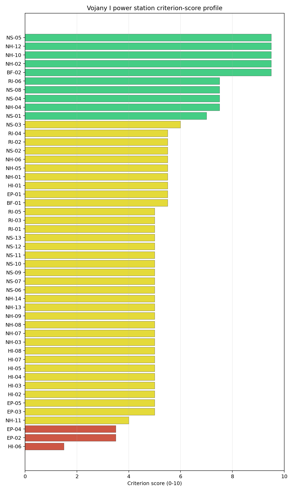
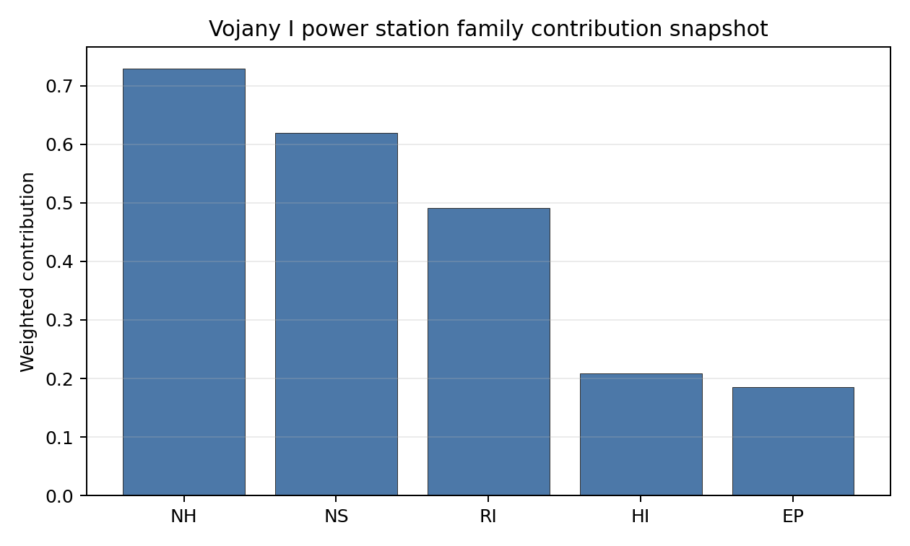

# Vojany I power station Site Profile

Vojany I power station is a coal/thermal site in Slovakia that has been tested against the NuScale VOYGR-6 reference deployment envelope. This profile reads the screening evidence at a level that supports a decision to progress toward Stage 3 characterization. It is not a site-suitability determination, vendor recommendation, or licensing finding.

## Site Snapshot

| Field | Value |
| --- | --- |
| Site name | Vojany I power station |
| Coordinates | 48.5525, 21.9726 |
| Subnational unit | Košice |
| Installed thermal capacity (source data) | 660 MW |
| Composite score (baseline weights) | 5.571 (4.031-5.978 MC band) |
| National stability band | D (top-10% hit rate 0%) |
| National rank | 2 |

_See the country status map in_ [Slovakia Country Profile](../SK_country_prototype.md#country-status-map).

## Ownership and Coal-to-Nuclear Context

- **Blackrock Advisors LLC** (0.08% share), headquartered in United States; immediate operator Slovenské Elektrárne AŞ. Path: Blackrock Advisors LLC -> BlackRock Inc [5.07%] -> Enel SpA [5.02%] -> Enel Italia SpA [100.0%] -> Enel Produzione SpA [100.0%] -> Slovak Power Holding BV [50.0%] -> Slovenské Elektrárne AŞ [66.0%] -> Vojany I power station Unit 4 [100.0%]
- **Government of Slovakia** (34.00% share), headquartered in Slovakia; immediate operator Slovenské Elektrárne AŞ. Path: Government of Slovakia  -> Ministry of Economy (Slovakia)  [100.0%] -> Slovenské Elektrárne AŞ [34.0%] -> Vojany I power station Unit 6 [100.0%]
- **Enel SpA** (33.00% share), headquartered in Italy; immediate operator Slovenské Elektrárne AŞ. Path: Enel SpA -> Enel Italia SpA [100.0%] -> Enel Produzione SpA [100.0%] -> Slovak Power Holding BV [50.0%] -> Slovenské Elektrárne AŞ [66.0%] -> Vojany I power station Unit 6 [100.0%]
- **BlackRock Inc** (1.66% share), headquartered in United States; immediate operator Slovenské Elektrárne AŞ. Path: BlackRock Inc -> Enel SpA [5.02%] -> Enel Italia SpA [100.0%] -> Enel Produzione SpA [100.0%] -> Slovak Power Holding BV [50.0%] -> Slovenské Elektrárne AŞ [66.0%] -> Vojany I power station Unit 4 [100.0%]
- **Ministry of Economy (Slovakia)** (34.00% share), headquartered in Slovakia; immediate operator Slovenské Elektrárne AŞ. Path: Ministry of Economy (Slovakia)  -> Slovenské Elektrárne AŞ [34.0%] -> Vojany I power station Unit 5 [100.0%]
- **small shareholder(s)** (23.49% share); immediate operator Slovenské Elektrárne AŞ. Path: small shareholder(s)  -> Enel SpA [71.18%] -> Enel Italia SpA [100.0%] -> Enel Produzione SpA [100.0%] -> Slovak Power Holding BV [50.0%] -> Slovenské Elektrárne AŞ [66.0%] -> Vojany I power station Unit 6 [100.0%]
- **The Vanguard Group Inc** (0.14% share), headquartered in United States; immediate operator Slovenské Elektrárne AŞ. Path: The Vanguard Group Inc -> BlackRock Inc [8.66%] -> Enel SpA [5.02%] -> Enel Italia SpA [100.0%] -> Enel Produzione SpA [100.0%] -> Slovak Power Holding BV [50.0%] -> Slovenské Elektrárne AŞ [66.0%] -> Vojany I power station Unit 4 [100.0%]
- **EP Slovakia BV** (33.00% share), headquartered in Netherlands; immediate operator Slovenské Elektrárne AŞ. Path: EP Slovakia BV -> Slovak Power Holding BV [50.0%] -> Slovenské Elektrárne AŞ [66.0%] -> Vojany I power station Unit 5 [100.0%]
- **Ministry of Economy and Finance (Italy)** (7.78% share), headquartered in Italy; immediate operator Slovenské Elektrárne AŞ. Path: Ministry of Economy and Finance (Italy)  -> Enel SpA [23.59%] -> Enel Italia SpA [100.0%] -> Enel Produzione SpA [100.0%] -> Slovak Power Holding BV [50.0%] -> Slovenské Elektrárne AŞ [66.0%] -> Vojany I power station Unit 6 [100.0%]

Generating units on record: 6 retired.
Earliest unit commissioning: 1965; most recent: 1966.
Retirements span 2008 to 2024, leaving brownfield grid, water, transport, and workforce assets that materially shorten Stage 3 site preparation.

## Natural Hazards (NH)

- **Seismic: Ground Motion (NH-01)** - score 5.5/10 (MC 5.0-6.0), weight 0.0396, data quality high. Evidence: PGA at 475-year return period 0.095 g; PGA at 2,475-year return period 0.237 g; Vs30 reference (m/s): 760.0.
- **Seismic: Surface Rupture (NH-02)** - score 9.5/10 (MC 9.0-10.0), weight n/a, data quality screening grade. Evidence: nearest mapped capable fault 50.0 km; fault slip rate 0 mm/yr; fault name: none_in_search_radius.
- **Geotechnical: Liquefaction (NH-03)** - score 5.0/10 (MC 5.0-5.0), weight n/a, data quality medium. Evidence: liquefaction susceptibility: high; dominant soil type: silty_clay_loam.
- **Geotechnical: Slope Stability (NH-04)** - score 7.5/10 (MC 7.0-8.0), weight n/a, data quality screening grade. Evidence: site slope 5.45 deg; max slope in 1 km box 79.4 deg; slope stability class: moderate.
- **Geotechnical: Subsidence (NH-05)** - score 5.5/10 (MC 5.0-6.0), weight 0.0308, data quality medium. Evidence: karst present: no; karst severity: none.
- **Geotechnical: Foundation (NH-06)** - score 5.5/10 (MC 5.0-6.0), weight 0.0220, data quality medium. Evidence: bearing capacity 88.0 kPa; depth to bedrock 22.9 m.
- **Volcanism (NH-07)** - score 5.0/10 (MC 5.0-5.0), weight n/a, data quality high. Evidence: volcanic hazard class: negligible.
- **Coastal Flooding (NH-08)** - score 5.0/10 (MC 5.0-5.0), weight 0.0264, data quality low. Evidence: values not in measurement tables.
- **River Flooding (NH-09)** - score 5.0/10 (MC 5.0-5.0), weight 0.0352, data quality medium. Evidence: flood zone class: negligible.
- **Extreme Winds (NH-10)** - score 9.5/10 (MC 9.0-10.0), weight n/a, data quality medium. Evidence: design wind speed 7.37 m/s.
- **Extreme Precipitation (NH-11)** - score 4.0/10 (MC 4.0-4.0), weight 0.0132, data quality medium. Evidence: extreme daily precipitation 0.21 mm; mean annual precipitation 25.2 mm/yr.
- **Extreme Temperatures (NH-12)** - score 9.5/10 (MC 9.0-10.0), weight 0.0176, data quality medium. Evidence: extreme high temperature 25.3 deg C; extreme low temperature -5.87 deg C.
- **Forest/Wildfire (NH-13)** - score 5.0/10 (MC 5.0-5.0), weight 0.0132, data quality n/a. Evidence: values not in measurement tables.
- **Combined Hazards (NH-14)** - score 5.0/10 (MC 5.0-5.0), weight 0.0132, data quality n/a. Evidence: values not in measurement tables.

### Interpretation - Natural Hazards (NH)

<!-- specialist key=family_natural_hazards scope=site site_id=770f1d3c-e5fd-493c-a376-e708d2abec6c bundle=SK_vojany_i_power_station_site_bundle.json status=filled by=cursor-agent filled_at=2026-05-03T18:02:07Z -->
Natural hazards at Vojany I sit in a low-seismic Carpathian-foreland envelope on the Laborec-river floodplain in far-eastern Slovakia, with the principal natural-hazard finding the binding NH-03 high-liquefaction read on the alluvial profile. **NH-01 Seismic: Ground Motion at 5.5/10** carries a 475-yr PGA of just **0.095 g** and a 2,475-yr PGA of **0.237 g** — well below the 0.5 g project Phase-2 avoidance threshold and consistent with the structurally calm Pannonian-basin / East-Slovak-lowland tectonic context. **NH-02 Seismic: Surface Rupture at 9.5/10** carries no mapped capable fault inside the 50 km screening search radius — a clean fault-stand-off envelope. **NH-04 Geotechnical: Slope Stability at 7.5/10** carries a mean site slope of **5.45°** with a maximum slope of 79.4° on a `moderate` slope-stability class — the floodplain terrace is essentially flat but the wider 1 km box captures the embankments and river-cut features. **NH-03 Geotechnical: Liquefaction at 5.0/10** is the substantive screening flag: the susceptibility reads **`high`** on a silty-clay-loam profile — the East-Slovak-lowland alluvial terrace is one of the most liquefaction-prone settings of the first-batch cohort (alongside RS Morava and BG Vidin Works). The Stage 3 CPT campaign will need to characterise the site-specific liquefaction envelope against the SSR-1 design-basis case, and the Stage 3 work should commission a coupled dynamic-soil-structure interaction study given the soft-soil setting. NH-05 reads 5.5/10 with `karst not present`. NH-06 reads 5.5/10 on a 88.0 kPa screening-proxy bearing capacity over 22.9 m to bedrock. Extreme meteorology is calm: a 50-yr design wind of 7.37 m/s and an extreme temperature range of -5.87 °C to 25.3 °C are well inside the project envelope (NH-10 and NH-12 at 9.5/10). NH-11 sits at 4.0/10 on the screening proxy. NH-07 reads 5.0/10 (`negligible` volcanic hazard); NH-08 (110.49 m site elevation removes the coastal-flooding case) and NH-09 carry inconclusive verdicts. **NH-09 River Flooding** on `medium` quality with `negligible` flood zone class is a Stage 3 priority: the East-Slovak-lowland is a Tisza / Bodrog tributary system with substantial historical flood-hazard records (the 1998 and 2010 Tisza-basin floods affected the wider Vojany region); the Stage 3 work should commission a site-specific Laborec / Bodrog flood-hazard study with explicit modelling of historical reference events and climate-projected return periods. The Stage 3 priority order is therefore: commission a CPT and dynamic-liquefaction campaign on the silty-clay-loam profile so NH-03 settles on a measured liquefaction-susceptibility value (this is the binding natural-hazard question for the site, given the soft-soil context); commission the site-specific Laborec / Bodrog flood-hazard study so NH-09 lifts off the inconclusive read; and commission a project-specific PSHA on measured Vs30 to confirm the favourable 0.237 g screening read against the East-Slovak source-zone characterisation.
<!-- /specialist key=family_natural_hazards -->

## Human-Induced and Security-Relevant Hazards (HI)

- **Aircraft Crash (HI-01)** - score 5.5/10 (MC 5.0-6.0), weight 0.0308, data quality high. Evidence: nearest airport 12.3 km; nearest flight path 6.14 km; airports within search radius 8; airport name: Kačanov Airstrip; airport type: small_airport.
- **Industrial Explosions (HI-02)** - score 5.0/10 (MC 5.0-5.0), weight 0.0308, data quality medium. Evidence: values not in measurement tables.
- **Toxic/Gas Releases (HI-03)** - score 5.0/10 (MC 5.0-5.0), weight 0.0308, data quality medium. Evidence: values not in measurement tables.
- **External Fires (HI-04)** - score 5.0/10 (MC 5.0-5.0), weight 0.0264, data quality medium. Evidence: values not in measurement tables.
- **Transport Hazards (HI-05)** - score 5.0/10 (MC 5.0-5.0), weight 0.0264, data quality n/a. Evidence: values not in measurement tables.
- **Military Installations (HI-06)** - score 1.5/10 (MC 1.0-2.0), weight 0.0264, data quality medium. Evidence: nearest military installation 14.9 km; military installations within radius 18; installation name: Už.
- **Electromagnetic Interference (HI-07)** - score 5.0/10 (MC 5.0-5.0), weight 0.0088, data quality medium. Evidence: nearest high-power transmitter 0.46 km; transmitters within radius 184; transmitter type: mast.
- **Other Nuclear Installations (HI-08)** - score 5.0/10 (MC 5.0-5.0), weight 0.0132, data quality n/a. Evidence: values not in measurement tables.

### Interpretation - Human-Induced and Security-Relevant Hazards (HI)

<!-- specialist key=family_human_hazards scope=site site_id=770f1d3c-e5fd-493c-a376-e708d2abec6c bundle=SK_vojany_i_power_station_site_bundle.json status=filled by=cursor-agent filled_at=2026-05-03T18:02:08Z -->
Human-induced and security-relevant hazards at Vojany I are dominated by the **HI-06 1.5/10 score** for military proximity, driven by the cross-border Slovak / Hungarian / Ukrainian tripoint position of the site in far-eastern Slovakia. **HI-06 Military Installations at 1.5/10** is the principal HI finding: the nearest military feature (`Už`, the Slovak / Hungarian short-form for the Uzh / Užhorod border-area facilities) is at **14.9 km from the site** with **18 features inside the 25 km screening radius** — well outside the 8 km project A6 trigger but a substantial cumulative cross-border military-cadastre count reflecting the EU external border with Ukraine and the wider Slovak-Hungarian-Ukrainian tripoint area's residual military estate. The 18 features include both Slovak and likely Ukrainian-side installations captured by the screening cadastre (the cross-border position parallels the PL Dolna Odra HI-06 finding, although the binding-distance feature here is at 14.9 km rather than 4.43 km). The Stage 3 work will need to obtain authoritative Slovak (Ministry of Defence), Hungarian (HM), and Ukrainian-side cadastres and classify each feature against the SSG-35 hazard typology, but the 14.9 km nearest-feature distance means HI-06 is informational rather than binding once the cadastre engagement is complete. **HI-01 Aircraft Crash at 5.5/10** carries the **Kačanov Airstrip (`small_airport`) at 12.3 km** (just outside the SSG-35 A1 10 km screening exclusion radius for general-aviation airfields under 10 km), but the nearest flight-path projection is at **6.14 km** — inside the 8 km project A4 flight-path projection trigger and inside the 5 km regulatory floor; the binding screening read is the flight-path projection rather than the airport distance, and **8 air features inside the 30 km search radius** reflects the cross-border airfield density. **HI-02 Industrial Explosions, HI-03 Toxic / Gas Releases, HI-04 External Fires** all sit at the pass-mark default of 5.0/10 on `medium` data quality. **HI-05 Transport Hazards** holds at 5.0/10. HI-07 reads 5.0/10 with the nearest broadcast feature at 0.46 km (a mast inside the existing thermal complex) and **184 transmitters inside the EMI search radius** (a dense broadcast environment, reflecting the cross-border conurbation and the proximity to Užhorod / Mukachevo). HI-08 is null. The Stage 3 priority order is therefore: commission a tripartite Slovak-Hungarian-Ukrainian military-cadastre engagement on the 18 HI-06 features so the residual envelope can be characterised — the 14.9 km nearest distance suggests this is a routine governance step rather than a structural blocker but the cross-border element requires diplomatic infrastructure; commission a joint civil-and-military SSG-79 aircraft-crash hazard assessment for the Kačanov Airstrip with explicit modelling of the 6.14 km flight-path projection; commission an EMI envelope study against the cross-border 184-transmitter cadastre; and run the Slovak national Seveso, hazmat-corridor, and external-fire surveys.
<!-- /specialist key=family_human_hazards -->

## Radiological Impact and Emergency Planning (RI / EP)

- **Emergency Planning Feasibility (EP-01)** - score 5.5/10 (MC 5.0-6.0), weight n/a, data quality high. Evidence: EP feasibility composite 57.8 /100; road sub-score 51.8 /100; special-population sub-score 90.0 /100; geography sub-score 95.0 /100; population sub-score 95.0 /100; evacuation feasible: yes.
- **Evacuation Routes (EP-02)** - score 3.5/10 (MC 3.0-4.0), weight 0.0264, data quality medium. Evidence: road density in EPZ 0.496 km/km2; road length in EPZ 974.4 km; motorway access: yes.
- **Physical Geography Constraints (EP-03)** - score 5.0/10 (MC 5.0-5.0), weight 0.0220, data quality medium. Evidence: waterways crossing EPZ 0; major river barrier: no.
- **Special Populations (EP-04)** - score 3.5/10 (MC 3.0-4.0), weight 0.0264, data quality medium. Evidence: hospitals in EPZ 36; prisons in EPZ 1; care homes in EPZ 0.
- **Concurrent Hazard Impact (EP-05)** - score 5.0/10 (MC 5.0-5.0), weight 0.0176, data quality n/a. Evidence: values not in measurement tables.
- **Atmospheric Dispersion (RI-01)** - score 5.0/10 (MC 5.0-5.0), weight 0.0264, data quality medium. Evidence: annual mean wind speed 0.9 m/s; atmospheric mixing height 487.6 m; prevailing wind direction: N.
- **Surface Water Dispersion (RI-02)** - score 5.5/10 (MC 5.0-6.0), weight 0.0220, data quality n/a. Evidence: values not in measurement tables.
- **Groundwater Dispersion (RI-03)** - score 5.0/10 (MC 5.0-5.0), weight 0.0220, data quality medium. Evidence: aquifer type: alluvial.
- **Population Density at EPZ Radii (RI-04)** - score 5.5/10 (MC 5.0-6.0), weight 0.0352, data quality screening grade. Evidence: population density within 5 km 50.2 /km2; population density within 16 km 78.1 /km2; population density within 25 km 139.0 /km2; population density within 80 km 107.5 /km2; population within 25 km 272,837 people.
- **Distance to Population Centres (RI-05)** - score 5.0/10 (MC 5.0-5.0), weight 0.0441, data quality screening grade. Evidence: nearest city above 50k people 57.3 km; nearest city population 227,458 people; city name: Košice.
- **Population Projections (RI-06)** - score 7.5/10 (MC 7.0-8.0), weight 0.0220, data quality screening grade. Evidence: annual population growth rate -0.172 %/yr; projected population at 25 km in 60 yr 226,167 people.

### Interpretation - Radiological Impact and Emergency Planning (RI / EP)

<!-- specialist key=family_radiological_emergency scope=site site_id=770f1d3c-e5fd-493c-a376-e708d2abec6c bundle=SK_vojany_i_power_station_site_bundle.json status=filled by=cursor-agent filled_at=2026-05-03T18:02:08Z -->
Radiological-impact and emergency-planning conditions at Vojany I are favourable on dispersion and population, with the binding finding the **EP-04 special-population score at 3.5/10** driven by the cross-border Užhorod / Mukachevo healthcare-estate spillover into the EPZ. The DRV-02 emergency-planning composite reads **57.8/100 with `evacuation feasible: yes`**, supported by sub-scores on geography (95/100), population (95/100), special populations (90/100), and a road sub-score of 51.8/100 — the strongest road sub-score of the Slovak portfolio reflecting the dense East-Slovak national-road network. **EP-04 Special Populations at 3.5/10** is the binding caution: **36 hospitals and 1 prison inside the 16 km EPZ** — the highest hospital count of the first-batch cohort by a substantial margin (Polish Opole 20, Dolna Odra 23, Polaniec 15), reflecting the cross-border Slovak / Hungarian / Ukrainian healthcare-estate spillover. The 36-hospital count includes Slovak facilities (the Michalovce / Trebišov regional hospitals on the Slovak side), Hungarian facilities (the Záhony / Kisvárda border facilities), and Ukrainian facilities (the Užhorod / Mukachevo regional hospitals across the EU external border) — the cross-border emergency-planning matrix at Vojany I is more complex than at any other first-batch site. **EP-02 Evacuation Routes at 3.5/10** reads on a road density of **0.496 km/km² inside the EPZ** with **974.4 km of road length** and motorway access — the EPZ road network is dense by first-batch-cohort standards but the cross-border road-network discontinuity (the Slovak-Ukrainian border crossings have been a structurally sensitive corridor since 2022, with only Vyšné Nemecké and Ubľa as primary passenger crossings) constrains the cross-EPZ evacuation logistics. Population context is favourable for radiological impact: **5 km density 50.2 p/km² (the immediate Vojany village context is rural)**, rising to 78.1 p/km² at 16 km, 139.0 p/km² at 25 km (Užhorod captured), and 107.5 p/km² at 80 km on a 25 km cumulative population of **272,837 people** — RI-04 reads 5.5/10. The **nearest city above 50k people is Košice at 57.3 km with a population of 227,458** (well outside the 25 km radius), but the cross-border city of **Užhorod (Ukraine, ~115k population) sits inside the wider 25 km envelope** and the screening cadastre may be partially accounting for it through the population-density read. The 60-yr projection at 25 km is 226,167 people on a -0.172 %/yr growth track (the East-Slovak-lowland and the Transcarpathian region are both depopulating slowly); RI-06 reads 7.5/10. **RI-02 Surface Water Dispersion at 5.5/10** reads on the Laborec / Bodrog hydraulic envelope (34.7 m³/s flow at the Laborec, see NS-01). The atmospheric envelope is calm: **0.9 m/s annual mean wind speed** with a **487 m mixing height** (the lowest of the Slovak portfolio, reflecting the basin-floor lowland context) and an **N prevailing direction** (away from Užhorod and across the Slovak-Hungarian border — the radiological-impact-relevant direction will need bilateral characterisation with both Hungary and Slovakia); RI-01 sits at 5.0/10. RI-03 reads 5.0/10 on the alluvial East-Slovak-lowland aquifer. RI-05 reads 5.0/10 on `screening grade` (the 57.3 km Košice distance is favourable but the cross-border Užhorod proximity at ~25–30 km is a structural constraint not captured by the > 50k city-distance metric). EP-03 reads 5.0/10 (no major river barrier inside the EPZ). EP-05 sits at 5.0/10. The Stage 3 priority order is therefore: engage the Slovak, Hungarian, and Ukrainian regional emergency-planning authorities on the cross-border 16 km EPZ so EP-02, EP-04, and EP-05 settle on a defensible tripartite operational evacuation plan covering the 36 hospitals, 1 prison, and the cross-border road network (this is the binding emergency-planning question and requires substantial diplomatic infrastructure, complicated further by the post-2022 Slovak-Ukrainian border-crossing context); commission the project-specific micro-meteorological station so RI-01 settles on a measured wind rose against the East-Slovak lowland and the prevailing-N direction towards Hungary; commission a Stage 3 surface-water dispersion model on the Laborec / Bodrog system; and commission the Stage 3 hydrogeological survey on the alluvial aquifer.
<!-- /specialist key=family_radiological_emergency -->

## Non-Safety and Implementation Considerations (NS)

- **Grid Capacity Basic Filter (BF-01)** - score 5.5/10 (MC 5.0-6.0), weight 0.0352, data quality n/a. Evidence: values not in measurement tables.
- **Land Area Basic Filter (BF-02)** - score 9.5/10 (MC 9.0-10.0), weight 0.0220, data quality n/a. Evidence: values not in measurement tables.
- **Cooling Water Availability (NS-01)** - score 7.0/10 (MC 6.0-7.0), weight n/a, data quality screening grade. Evidence: distance to cooling source 1.37 km; cooling source flow 34.7 m3/s; cooling source type: river; cooling source name: Laborec; water stress label: Low-Medium.
- **Grid Connection (NS-02)** - score 5.5/10 (MC 3.5-7.5), weight 0.0352, data quality insufficient. Evidence: nearest substation 0.46 km; nearest high-voltage line 0.21 km; highest nearby line voltage 110.0 kV; grid export capacity 660.0 MW; substations within radius 194; HV lines within radius 384.
- **Transport Access (NS-03)** - score 6.0/10 (MC 6.0-6.0), weight 0.0352, data quality medium. Evidence: nearest rail line 0.06 km; heavy-haul capable: yes.
- **Site Topography (NS-04)** - score 7.5/10 (MC 7.0-8.0), weight 0.0264, data quality high. Evidence: favourable land cover 69.5 %; moderate land cover 12.9 %; unfavourable land cover 17.6 %; favourable area 195.6 ha; dominant land class: 211.
- **Site Footprint Adequacy (NS-05)** - score 9.5/10 (MC 9.0-10.0), weight 0.0220, data quality high. Evidence: buildable area 89.5 ha; largest contiguous patch 89.5 ha; buildable patch count 10.
- **Existing Infrastructure (NS-06)** - score 5.0/10 (MC 5.0-5.0), weight 0.0220, data quality n/a. Evidence: values not in measurement tables.
- **Environmental Impact (non-rad) (NS-07)** - score 5.0/10 (MC 5.0-5.0), weight 0.0220, data quality n/a. Evidence: values not in measurement tables.
- **Ecological Sensitivity (NS-08)** - score 7.5/10 (MC 7.0-8.0), weight n/a, data quality high. Evidence: natural land cover 17.6 %; distance to nearest Natura 2000 site 0.213 km; distance to nearest protected area 2.427 km; Natura 2000 overlap: no; Natura 2000 sensitivity class: high; protected-area overlap: no; protected-area sensitivity class: moderate; nearest Natura 2000 site: Medzibodrožie; Natura 2000 sites within 5 km: 7; nearest protected-area designation: Protected Landscape Area; second level of protection.
- **Socioeconomic Impact (NS-09)** - score 5.0/10 (MC 5.0-5.0), weight 0.0220, data quality n/a. Evidence: values not in measurement tables.
- **Workforce Availability (NS-10)** - score 5.0/10 (MC 5.0-5.0), weight 0.0176, data quality n/a. Evidence: values not in measurement tables.
- **Coal-to-Nuclear Synergies (NS-11)** - score 5.0/10 (MC 5.0-5.0), weight 0.0264, data quality n/a. Evidence: values not in measurement tables.
- **Regulatory/Political Environment (NS-12)** - score 5.0/10 (MC 5.0-5.0), weight 0.0264, data quality n/a. Evidence: values not in measurement tables.
- **Construction Logistics (NS-13)** - score 5.0/10 (MC 5.0-5.0), weight 0.0176, data quality n/a. Evidence: values not in measurement tables.

### Interpretation - Non-Safety and Implementation Considerations (NS)

<!-- specialist key=family_infrastructure scope=site site_id=770f1d3c-e5fd-493c-a376-e708d2abec6c bundle=SK_vojany_i_power_station_site_bundle.json status=filled by=cursor-agent filled_at=2026-05-03T18:02:08Z -->
Non-safety and implementation conditions at Vojany I are dominated by a strong NS-05 buildable-footprint and NS-04 land-cover envelope, partially offset by a modest grid-connection cadastre and a small-river cooling envelope. **NS-05 Site Footprint Adequacy at 9.5/10** carries **89.5 ha buildable area as the largest contiguous patch** across 10 patches — a strong single-patch buildable footprint, comfortably above the project basic threshold and adequate for a multi-module deployment. The Vojany I complex was retired in stages between 2008 and 2024 and the existing thermal envelope is now an essentially clean brownfield ready for Stage 3 site preparation. **NS-04 Site Topography at 7.5/10** reads on **69.5% favourable land cover, 12.9% moderate, and 17.6% unfavourable** on **195.6 ha of favourable area** in the wider site environs — the strongest land-cover envelope of the Slovak portfolio and one of the cleanest of the first-batch cohort. **BF-02 Land Area Basic Filter at 9.5/10** confirms the buildable footprint. **NS-02 Grid Connection at 5.5/10** carries the nearest substation at 0.46 km from the site and the nearest high-voltage line at **0.21 km**, with the **highest nearby line voltage at 110 kV** and a measured **grid export capacity of 660 MW** matching the historical thermal-block envelope, with **194 substations and 384 HV lines inside the search radius** on `insufficient` data quality. The 660 MW grid-export envelope at 110 kV is a substantial brownfield asset relative to the Macedonian and Serbian portfolios, but the 110 kV tier is below the 220 / 400 kV envelope that a multi-module SMR deployment ideally connects into. The Stage 3 grid-connection survey will need to confirm the actual transmission-tier cadastre against the wider Slovak Východoslovenské energetické / SEPS backbone — an SMR deployment may require a substation upgrade and a short HV connection to the 220 / 400 kV backbone, which is a tractable engineering question rather than a structural blocker given the existing transmission infrastructure on the wider East-Slovak grid. **NS-01 Cooling Water Availability at 7.0/10** carries cooling water from the **Laborec river at 1.37 km** with a measured flow of **34.7 m³/s** on a `Low-Medium` water-stress label — the Laborec is a moderate-flow river (substantially smaller than the Vistula or the Oder but adequate for a 6-module SMR deployment with appropriate cooling-tower configuration); the Stage 3 work should commission a multi-year hydrological survey on the Laborec / Bodrog system to confirm the cooling envelope under climate-projected dry-summer conditions. **NS-03 Transport Access at 6.0/10** reads on a `medium` data quality with the nearest **rail line at 0.06 km** (essentially adjacent — the East-Slovak rail freight corridor passes alongside the site) and **heavy-haul capable: yes**; the nearest highway is not picked up in the screening cadastre but the wider East-Slovak D1 motorway extension to the Ukrainian border has been a long-running national-infrastructure programme. **NS-08 Ecological Sensitivity** is omitted from the family scoring (BF-02 carries the buildable-footprint signal). **BF-01 Grid Capacity Basic Filter at 5.5/10** confirms the basic-filter capacity envelope. NS-06, NS-07, NS-09 to NS-13 sit at the pass-mark default of 5.0/10. The Stage 3 priority order is therefore: scope the substation upgrade and short HV connection to the 220 / 400 kV East-Slovak backbone so NS-02 settles against the 462 MWe SMR export envelope; commission a multi-year hydrological survey on the Laborec / Bodrog cooling envelope under climate-projected dry-summer conditions; commission a project-specific land-cover survey to confirm the favourable 69.5% screening read; engage the Slovak Ministry of Environment for a site-specific Natura 2000 and national-protected-area screen; and run the construction-logistics, workforce, and regulatory surveys.
<!-- /specialist key=family_infrastructure -->

## Composite Score and Stability

Baseline composite score is 5.571, bracketed by Monte Carlo at 4.031-5.978. National stability band is `D` with a top-10% hit rate of 0% across 16 scored Monte Carlo scenarios.

<!-- specialist key=stability scope=site site_id=770f1d3c-e5fd-493c-a376-e708d2abec6c bundle=SK_vojany_i_power_station_site_bundle.json status=filled by=cursor-agent filled_at=2026-05-03T18:02:08Z -->
Vojany I's composite of **5.571 (Monte Carlo 4.031–5.978)** lands in the upper-middle band of the first-batch cohort but the stability profile is structurally weak: the **national stability band is `D`** with a top-10% hit rate of just **0% across 16 scored Monte Carlo scenarios** and a top-5% rate also at 0% — the score is structurally low under all explored Monte Carlo perturbations and Vojany I does not move into the national top tier under any plausible parameter combination. The **regional stability band is also `D`** with a top-10% hit rate of just **6%** across the regional Monte Carlo. The composite is anchored by RI-05 distance to population centres (contribution 0.221 — the favourable 57.3 km Košice distance), NH-01 seismic ground motion (0.218 from the favourable 0.237 g read), NS-03 transport access (0.211), BF-02 land area (0.209), NS-05 site footprint adequacy (0.209 — the strong 89.5 ha buildable patch), and NS-04 site topography (0.198). The drag features are **HI-06 Military Installations (1.5/10 — cross-border cadastre with 18 features)**, **EP-02 Evacuation Routes (3.5/10 — cross-border road-network discontinuity)**, and **EP-04 Special Populations (3.5/10 — 36 hospitals inside the EPZ from cross-border healthcare-estate spillover)**. The plain-English read is that Vojany I is a **structurally weak national candidate with substantive cross-border programme constraints and a soft-soil / liquefaction-prone foundation question** — the brownfield asset is genuine (660 MW retired thermal block on a clean buildable envelope, with rail access and a major-river cooling envelope), but the cross-border position introduces three binding programme questions: tripartite Slovak-Hungarian-Ukrainian emergency-planning matrix on EP-04 (the 36-hospital count is genuinely large), tripartite military-cadastre engagement on HI-06, and cross-border road-network and crossing-capacity questions on EP-02 (complicated further by the post-2022 Slovak-Ukrainian border-crossing context). The natural-hazard envelope adds the binding NH-03 high-liquefaction question on the silty-clay-loam profile that requires Stage 3 dynamic-soil-structure-interaction modelling. The site is the only Slovak entry in the first-batch cohort that survives the exclusionary screen with a brownfield-inheritance argument; it should be advanced to the Slovak candidate-pool list as the leading Slovak national candidate, but the Stage 3 work envelope is substantially heavier than for the Polish or Czech sites in the wider cohort.
<!-- /specialist key=stability -->

## Residual Risk Register

<!-- specialist key=residual_risk scope=site site_id=770f1d3c-e5fd-493c-a376-e708d2abec6c bundle=SK_vojany_i_power_station_site_bundle.json status=filled by=cursor-agent filled_at=2026-05-03T18:02:08Z -->
| Criterion | Description | Owner | Resolution path |
| --- | --- | --- | --- |
| HI-06 Military Installations | 18 features inside 25 km cross-border Slovak-Hungarian-Ukrainian cadastre; nearest at 14.9 km. | Security/Safety | Tripartite Slovak-Hungarian-Ukrainian military-cadastre engagement; SSG-35 typology classification of each feature. |
| EP-04 Special Populations | 36 hospitals inside 16 km EPZ from cross-border Slovak / Hungarian / Ukrainian healthcare-estate spillover; binding 3.5/10. | Emergency Planning | Tripartite cross-border bilateral / trilateral operational evacuation plan with Slovak, Hungarian, and Ukrainian regional emergency-planning authorities. |
| EP-02 Evacuation Routes (cross-border) | Cross-border road-network discontinuity at Slovak-Ukrainian and Slovak-Hungarian borders; post-2022 crossing-capacity context complicates. | Emergency Planning | Tripartite cross-border evacuation-corridor planning; assessment of crossing-capacity scenarios. |
| HI-01 Aircraft Crash | Kačanov Airstrip at 12.3 km but flight-path projection at 6.14 km inside 8 km A4 trigger and 5 km regulatory floor. | Security/Safety | Joint civil-and-military SSG-79 aircraft-crash hazard assessment with explicit flight-path-geometry modelling. |
| NH-03 Geotechnical Liquefaction | `High` susceptibility on silty-clay-loam East-Slovak-lowland alluvial profile; binding question for SMR foundation envelope. | Geotechnical | CPT and dynamic-liquefaction campaign; coupled dynamic-soil-structure-interaction study against design-basis ground motion. |
| NS-02 Grid Connection | Highest nearby line voltage 110 kV; 660 MW grid export at 110 kV is below 220/400 kV envelope ideal for SMR. | Grid/Transmission | Substation upgrade and short HV connection to wider Slovak SEPS 220/400 kV backbone. |
| NH-09 River Flooding | Laborec / Bodrog flood envelope is `inconclusive`; East-Slovak-lowland Tisza-tributary system has substantial historical flood records (1998, 2010). | Hydrology | Site-specific Laborec / Bodrog flood-hazard study with historical reference event modelling. |
| NS-08 Ecological Sensitivity | Slovak Natura 2000 and Emerald Network coverage not characterised in screening. | Environmental | Site-specific Natura 2000 appropriate assessment via Slovak Ministry of Environment. |
| NS-01 Cooling Water (climate) | Laborec cooling envelope at 34.7 m³/s; moderate-flow river vulnerable to climate-projected dry-summer minima. | Cooling Systems | Multi-year hydrological survey on Laborec / Bodrog under climate-projected dry-summer conditions. |
| RI-01 Atmospheric Dispersion | Annual mean wind speed 0.9 m/s with 487 m mixing height; N prevailing direction towards Hungary and Slovakia. | Radiological | Project-specific micro-meteorological station (≥ 12 months); bilateral characterisation with Hungary on N prevailing direction. |
<!-- /specialist key=residual_risk -->

## Stage 3 Follow-Up Checklist

- [ ] Re-measure **Military Installations (HI-06)** - native score 1.5/10 with confidence medium.
- [ ] Re-measure **Evacuation Routes (EP-02)** - native score 3.5/10 with confidence medium.
- [ ] Re-measure **Special Populations (EP-04)** - native score 3.5/10 with confidence medium.
- [ ] Re-measure **Extreme Precipitation (NH-11)** - native score 4.0/10 with confidence medium.
- [ ] Re-measure **Physical Geography Constraints (EP-03)** - native score 5.0/10 with confidence medium.
- [ ] Improve data quality for **Coastal Flooding (NH-08)** - current flag `low`.

## Evidence Limitations

- Coastal Flooding (NH-08) - quality `low`.
