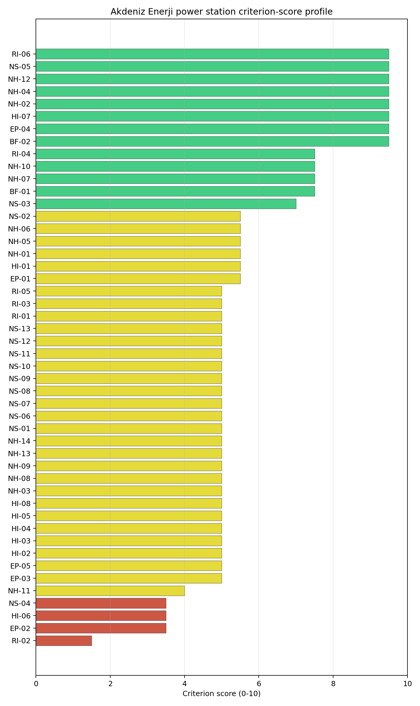
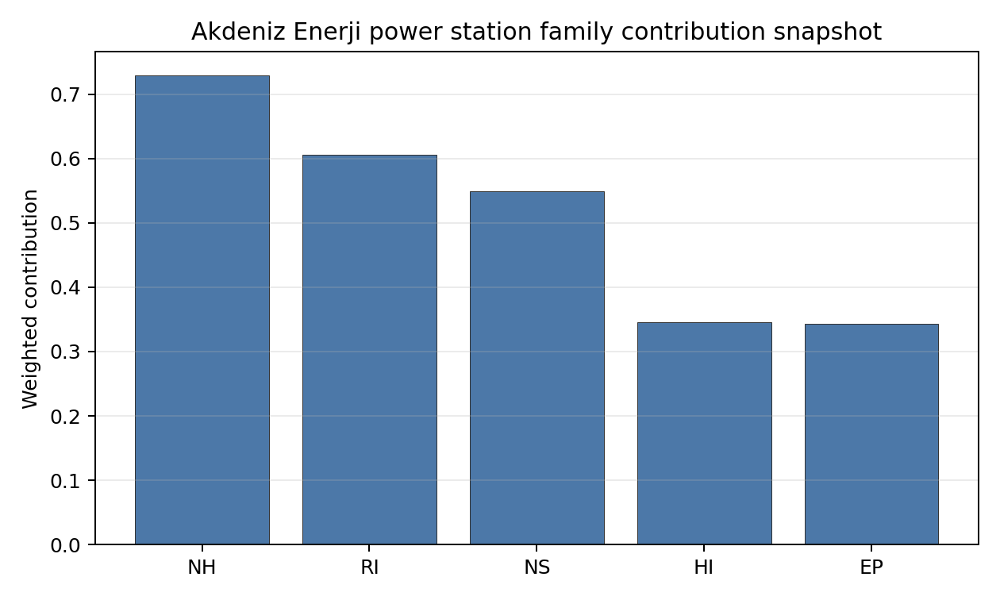

# Akdeniz Enerji power station Site Profile

> **Note on Site Identity** — Akdeniz Enerji power station is **co-located with [Yeşilovacık power station](TR_yesilovack_power_station.md)** on the same Bozyazı / Aydıncık Mediterranean coastal terrace at ~0.71 km separation. Both are cancelled greenfield lignite projects from competing private investors (Nurol Holding's Nurol Enerji Üretim at Akdeniz Enerji, Eren Holding's Tabiat Enerji at Yeşilovacık) on essentially the same physical brownfield envelope, with near-identical screening reads across all four families. Akdeniz Enerji is treated as the **primary entry** for the Bozyazı coastal envelope in the country-level top-N candidate-pool list (the higher 1,600 MW planned capacity provides marginally better grid-export envelope economics) and Yeşilovacık is the sister entry; the substantive screening interpretations below apply to both physical brownfield siblings, and the Yeşilovacık entry carries only the ownership / capacity-delta narrative.

Akdeniz Enerji power station is a coal/thermal site in Türkiye that has been tested against the NuScale VOYGR-6 reference deployment envelope. This profile reads the screening evidence at a level that supports a decision to progress toward Stage 3 characterization. It is not a site-suitability determination, vendor recommendation, or licensing finding.

## Site Snapshot

| Field | Value |
| --- | --- |
| Site name | Akdeniz Enerji power station |
| Coordinates | 36.2018, 33.6714 |
| Subnational unit | Mersin |
| Installed thermal capacity (source data) | 1,600 MW |
| Composite score (baseline weights) | 6.280 (4.344-6.774 MC band) |
| National stability band | A (top-10% hit rate 100%) |
| National rank | 3 |

_See the country status map in_ [Türkiye Country Profile](../TR_country_prototype.md#country-status-map).

## Ownership and Coal-to-Nuclear Context

- **Nurol Holding AS** (99.96% share), headquartered in Türkiye; immediate operator Nurol Enerji Üretim. Path: Nurol Holding AS -> Nurol Enerji Üretim  [99.96%] -> Akdeniz Enerji power station -- [100.0%]

Generating units on record: 1 cancelled.

## Natural Hazards (NH)

- **Seismic: Ground Motion (NH-01)** - score 5.5/10 (MC 5.0-6.0), weight 0.0396, data quality high. Evidence: PGA at 475-year return period 0.148 g; PGA at 2,475-year return period 0.339 g; Vs30 reference (m/s): 760.0.
- **Seismic: Surface Rupture (NH-02)** - score 9.5/10 (MC 9.0-10.0), weight n/a, data quality screening grade. Evidence: nearest mapped capable fault 50.0 km; fault slip rate 0 mm/yr; fault name: none_in_search_radius.
- **Geotechnical: Liquefaction (NH-03)** - score 5.0/10 (MC 5.0-5.0), weight n/a, data quality medium. Evidence: liquefaction susceptibility: very_low; dominant soil type: clay_loam.
- **Geotechnical: Slope Stability (NH-04)** - score 9.5/10 (MC 9.0-10.0), weight n/a, data quality screening grade. Evidence: site slope 3.43 deg; max slope in 1 km box 43.5 deg; slope stability class: gentle.
- **Geotechnical: Subsidence (NH-05)** - score 5.5/10 (MC 5.0-6.0), weight 0.0308, data quality medium. Evidence: karst present: no; karst severity: none.
- **Geotechnical: Foundation (NH-06)** - score 5.5/10 (MC 5.0-6.0), weight 0.0220, data quality medium. Evidence: bearing capacity 95.3 kPa; depth to bedrock 12.5 m.
- **Volcanism (NH-07)** - score 7.5/10 (MC 7.0-8.0), weight n/a, data quality medium. Evidence: nearest Holocene volcano 218.9 km; volcano name: Hasandag-Keciboyduran Volcanic Complex; volcanic hazard class: low.
- **Coastal Flooding (NH-08)** - score 5.0/10 (MC 5.0-5.0), weight 0.0264, data quality low. Evidence: values not in measurement tables.
- **River Flooding (NH-09)** - score 5.0/10 (MC 5.0-5.0), weight 0.0352, data quality medium. Evidence: flood zone class: negligible.
- **Extreme Winds (NH-10)** - score 7.5/10 (MC 7.0-8.0), weight n/a, data quality medium. Evidence: design wind speed 9.88 m/s.
- **Extreme Precipitation (NH-11)** - score 4.0/10 (MC 4.0-4.0), weight 0.0132, data quality medium. Evidence: extreme daily precipitation 0.42 mm; mean annual precipitation 16.9 mm/yr.
- **Extreme Temperatures (NH-12)** - score 9.5/10 (MC 9.0-10.0), weight 0.0176, data quality medium. Evidence: extreme high temperature 29.2 deg C; extreme low temperature 4.79 deg C.
- **Forest/Wildfire (NH-13)** - score 5.0/10 (MC 5.0-5.0), weight 0.0132, data quality n/a. Evidence: values not in measurement tables.
- **Combined Hazards (NH-14)** - score 5.0/10 (MC 5.0-5.0), weight 0.0132, data quality n/a. Evidence: values not in measurement tables.

### Interpretation - Natural Hazards (NH)

<!-- specialist key=family_natural_hazards scope=site site_id=5fa0dfa9-c272-444e-8e70-80ab55b5d36c bundle=TR_akdeniz_enerji_power_station_site_bundle.json status=filled by=cursor-agent filled_at=2026-05-03T18:26:58Z -->
Natural hazards at Akdeniz Enerji sit in a moderate-seismic Eastern-Mediterranean Cilician coastal envelope at just 11.88 m elevation, with the principal natural-hazard considerations the elevated NH-01 ground-motion read on the Cyprus-arc convergent-margin tectonic context and the binding NH-08 coastal-flooding question that the screening cadastre does not adequately characterise. **NH-01 Seismic: Ground Motion at 5.5/10** carries a 475-yr PGA of **0.148 g** and a 2,475-yr PGA of **0.339 g** — well below the 0.5 g project Phase-2 avoidance threshold but the highest seismic loading of the Turkish first-batch cohort, reflecting the Cyprus-arc and Anatolian-block convergent-margin tectonic setting (the wider Eastern-Mediterranean basin has elevated seismic activity relative to the central-Anatolian Konya plateau, and the regional source-zone catalogue includes the Cyprus Subduction Zone offshore). **NH-02 Seismic: Surface Rupture at 9.5/10** carries no mapped capable fault inside the 50 km screening search radius — a clean fault-stand-off envelope at this screening grade, but the Cyprus-arc tectonic context will require explicit Stage 3 PSHA characterisation. **NH-03 Geotechnical: Liquefaction at 5.0/10** carries a `very_low` susceptibility read on a clay-loam profile — the Cilician coastal sediments are firmer than the East-Slovak-lowland alluvial profiles and the liquefaction envelope is structurally favourable. **NH-04 Geotechnical: Slope Stability at 9.5/10** carries a mean site slope of **3.43°** with a maximum slope of 43.5° on a `gentle` slope-stability class — the immediate buildable envelope is essentially flat coastal terrace, but the wider 1 km box captures the steep Taurus-foreland flanks (the maximum slope value reflects the rapid topographic transition from sea level to the Bolkar Dağları interior). NH-05 reads 5.5/10 with `karst not present` in the screening cadastre — but the wider Cilician coast is a classical Mediterranean carbonate-karst context (the Bolkar Dağları interior is intensely karstified) and the Stage 3 work should commission a site-specific geophysical and hydrogeological survey to confirm the favourable screening read. NH-06 reads 5.5/10 on a 95.3 kPa screening-proxy bearing capacity over 12.5 m to bedrock (a relatively shallow bedrock signature for a coastal site, which is favourable for foundation engineering). **NH-07 Volcanism at 7.5/10** carries the **Hasandağ-Keciboyduran Volcanic Complex at 218.9 km** on a `low` volcanic-hazard class — well outside the project Phase-2 screening envelope, although the wider Anatolian volcanic field and Cypriot Pleistocene volcanism would need Stage 3 tephra-fall hazard characterisation. **NH-08 Coastal Flooding** is the binding inconclusive verdict for the site: the **11.88 m site elevation** places the buildable envelope just above sea level on a Mediterranean coastal terrace, and the screening cadastre does not adequately characterise the storm-surge, tsunami, and sea-level-rise envelope. The Eastern Mediterranean is a documented tsunami-hazard context (the 1303, 1481, 1546, 1822 Cilician-coast tsunami events are reference cases, with the 2017 Bodrum-Kos earthquake and the 2018 Sulawesi events as recent precedents for coastal-Mediterranean tsunami hazards), and the Stage 3 work will need to commission a substantive coastal-flooding hazard assessment with explicit modelling of probabilistic tsunami and storm-surge scenarios against IAEA SSG-18 design-basis guidance — this is the dominant natural-hazard question for the site and is not retirable through the screening cadastre. NH-09 carries an inconclusive verdict (the small Cilician-coast wadis are flash-flood hazards in the Mediterranean climate). NH-10 sits at 7.5/10 with a 50-yr design wind of 9.88 m/s (the highest of the Turkish portfolio, reflecting the coastal exposure). NH-12 reads 9.5/10 (4.79 °C to 29.2 °C extreme-temperature range — the Mediterranean climate is mild). The Stage 3 priority order is therefore: commission a substantive coastal-flooding hazard assessment with explicit probabilistic tsunami and storm-surge modelling so NH-08 lifts off the inconclusive verdict (this is the dominant natural-hazard question for the site, given the coastal Mediterranean tsunami-hazard context and the 11.88 m elevation); commission a project-specific PSHA on measured Vs30 against the Cyprus-arc and Anatolian-block source-zone catalogue so NH-01 settles on a defensible site-specific design-basis ground motion (the 0.339 g screening read may rise on full source characterisation); commission a site-specific Cilician-coast karst characterisation against the Bolkar Dağları carbonate context; and commission a site-specific wadi flood-hazard study so NH-09 lifts off the inconclusive read.
<!-- /specialist key=family_natural_hazards -->

## Human-Induced and Security-Relevant Hazards (HI)

- **Aircraft Crash (HI-01)** - score 5.5/10 (MC 5.0-6.0), weight 0.0308, data quality high. Evidence: nearest airport 67.3 km; nearest flight path 67.3 km; airports within search radius 0; airport name: Bozyazı Forest Depot Helipad; airport type: heliport.
- **Industrial Explosions (HI-02)** - score 5.0/10 (MC 5.0-5.0), weight 0.0308, data quality low. Evidence: values not in measurement tables.
- **Toxic/Gas Releases (HI-03)** - score 5.0/10 (MC 5.0-5.0), weight 0.0308, data quality low. Evidence: values not in measurement tables.
- **External Fires (HI-04)** - score 5.0/10 (MC 5.0-5.0), weight 0.0264, data quality low. Evidence: values not in measurement tables.
- **Transport Hazards (HI-05)** - score 5.0/10 (MC 5.0-5.0), weight 0.0264, data quality n/a. Evidence: values not in measurement tables.
- **Military Installations (HI-06)** - score 3.5/10 (MC 3.0-4.0), weight 0.0264, data quality not_found. Evidence: nearest military installation 17.0 km; military installations within radius 0.
- **Electromagnetic Interference (HI-07)** - score 9.5/10 (MC 9.0-10.0), weight 0.0088, data quality not_found. Evidence: nearest high-power transmitter 4.72 km; transmitters within radius 0; transmitter type: observation.
- **Other Nuclear Installations (HI-08)** - score 5.0/10 (MC 5.0-5.0), weight 0.0132, data quality n/a. Evidence: values not in measurement tables.

### Interpretation - Human-Induced and Security-Relevant Hazards (HI)

<!-- specialist key=family_human_hazards scope=site site_id=5fa0dfa9-c272-444e-8e70-80ab55b5d36c bundle=TR_akdeniz_enerji_power_station_site_bundle.json status=filled by=cursor-agent filled_at=2026-05-03T18:26:58Z -->
Human-induced and security-relevant hazards at Akdeniz Enerji are favourable across the family on the structurally sparse Cilician coastal envelope, with no binding cautions. **HI-01 Aircraft Crash at 5.5/10** carries the **Bozyazı Forest Depot Helipad (`heliport`) at 67.3 km from the site** with the nearest flight-path projection also at 67.3 km and **0 air features inside the 30 km search radius** — a structurally clean aircraft-crash envelope. The wider Cilician coast is sparsely served by civil aviation outside the Anamur and Mersin airports, both well outside the 30 km screening radius (Mersin at ~150 km, Anamur at ~50 km outside the radius). **HI-06 Military Installations at 3.5/10** carries the nearest military feature at **17.0 km from the site** with **0 features inside the 25 km screening radius** on `not_found` data quality — a screening-cadastre artefact pattern (cadastre lists a feature at 17 km but the in-radius count returns zero, similar to the PL Opole and RS Morava cadastre inconsistencies). The Cilician coastal corridor between Anamur and Aydıncık is structurally outside the active Turkish military estate, but the wider region includes coastal-defence infrastructure and the Stage 3 work will need to engage the Turkish General Staff for an authoritative cadastre run. The 17 km nearest-feature distance is well outside the 8 km project A6 trigger and HI-06 is unlikely to be a binding constraint after this engagement. **HI-02 Industrial Explosions, HI-03 Toxic / Gas Releases, HI-04 External Fires** all sit at the pass-mark default of 5.0/10 on `low` data quality (the Turkish national Seveso and pollutant-release inventories have limited coverage on the Cilician coast); the immediate context outside the cancelled-plant footprint is rural-coastal with banana plantations, citrus orchards, and small-town tourism (the Bozyazı / Aydıncık coastal strip), and the Stage 3 work should run a focused Turkish national Seveso, hazmat-corridor, and pollutant-release cadastre run to confirm the screening default. **HI-05 Transport Hazards** holds at 5.0/10 — the D-400 coastal highway passes through the immediate site environs and handles the Cilician coastal freight and tourist traffic. **HI-07 Electromagnetic Interference at 9.5/10** carries the nearest broadcast feature at 4.72 km (an observation tower) with **0 transmitters inside the EMI search radius** on `not_found` data quality — a structurally clean broadcast environment, reflecting the rural Cilician coastal context. HI-08 is null. The Stage 3 priority order is therefore: engage the Turkish General Staff on the Cilician coastal-defence cadastre to confirm the favourable HI-06 screening read; commission the Turkish national Seveso, hazmat-corridor, pollutant-release, and external-fire surveys so HI-02 to HI-05 lift off the screening default; commission a focused SSG-79 hazard assessment for the Bozyazı helipad and the wider Cilician coastal-aviation envelope; commission a transport-hazards survey on the D-400 corridor; and commission an EMI envelope study (light-touch given the structurally clean screening read).
<!-- /specialist key=family_human_hazards -->

## Radiological Impact and Emergency Planning (RI / EP)

- **Emergency Planning Feasibility (EP-01)** - score 5.5/10 (MC 5.0-6.0), weight n/a, data quality high. Evidence: EP feasibility composite 57.8 /100; road sub-score 40.2 /100; special-population sub-score 90.0 /100; geography sub-score 95.0 /100; population sub-score 95.0 /100; evacuation feasible: yes.
- **Evacuation Routes (EP-02)** - score 3.5/10 (MC 3.0-4.0), weight 0.0264, data quality medium. Evidence: road density in EPZ 0.303 km/km2; road length in EPZ 594.0 km; motorway access: yes.
- **Physical Geography Constraints (EP-03)** - score 5.0/10 (MC 5.0-5.0), weight 0.0220, data quality medium. Evidence: waterways crossing EPZ 0; major river barrier: no.
- **Special Populations (EP-04)** - score 9.5/10 (MC 9.0-10.0), weight 0.0264, data quality medium. Evidence: hospitals in EPZ 1; prisons in EPZ 0; care homes in EPZ 0.
- **Concurrent Hazard Impact (EP-05)** - score 5.0/10 (MC 5.0-5.0), weight 0.0176, data quality n/a. Evidence: values not in measurement tables.
- **Atmospheric Dispersion (RI-01)** - score 5.0/10 (MC 5.0-5.0), weight 0.0264, data quality medium. Evidence: annual mean wind speed 1.58 m/s; atmospheric mixing height 441.6 m; prevailing wind direction: SW.
- **Surface Water Dispersion (RI-02)** - score 1.5/10 (MC 1.0-2.0), weight 0.0220, data quality n/a. Evidence: values not in measurement tables.
- **Groundwater Dispersion (RI-03)** - score 5.0/10 (MC 5.0-5.0), weight 0.0220, data quality medium. Evidence: aquifer type: sedimentary carbonates.
- **Population Density at EPZ Radii (RI-04)** - score 7.5/10 (MC 7.0-8.0), weight 0.0352, data quality screening grade. Evidence: population density within 5 km 26.9 /km2; population density within 16 km 8.01 /km2; population density within 25 km 8.45 /km2; population density within 80 km 18.5 /km2; population within 25 km 16,586 people.
- **Distance to Population Centres (RI-05)** - score 5.0/10 (MC 5.0-5.0), weight 0.0441, data quality screening grade. Evidence: values not in measurement tables.
- **Population Projections (RI-06)** - score 9.5/10 (MC 9.0-10.0), weight 0.0220, data quality screening grade. Evidence: annual population growth rate -1.036 %/yr; projected population at 25 km in 60 yr 18,188 people.

### Interpretation - Radiological Impact and Emergency Planning (RI / EP)

<!-- specialist key=family_radiological_emergency scope=site site_id=5fa0dfa9-c272-444e-8e70-80ab55b5d36c bundle=TR_akdeniz_enerji_power_station_site_bundle.json status=filled by=cursor-agent filled_at=2026-05-03T18:26:58Z -->
Radiological-impact and emergency-planning conditions at Akdeniz Enerji are exceptionally favourable on population — the structurally sparsest 5–25 km population envelope of the Turkish portfolio outside the Konya plateau and the strongest demographic-tailwind read of the cohort — partially offset by the EP-02 evacuation-route caution on the rural Cilician coastal corridor and the binding RI-02 small-river dispersion read. The DRV-02 emergency-planning composite reads **57.8/100 with `evacuation feasible: yes`**, supported by sub-scores on geography (95/100), population (95/100), special populations (90/100), and a road sub-score of 40.2/100. **EP-02 Evacuation Routes at 3.5/10** reads on a road density of just **0.303 km/km² inside the 16 km EPZ** with **594 km of road length** and motorway access (the D-400 coastal corridor) — the road density is the lowest of the Turkish portfolio and constrains the cross-EPZ evacuation logistics, with the wider Bolkar Dağları interior providing only limited backstop road network behind the coastal D-400 corridor. **EP-04 Special Populations at 9.5/10** carries just **1 hospital inside the 16 km EPZ** with **0 prisons and 0 care homes** — the cleanest special-population envelope of the Turkish portfolio. Population context is the dominant favourable RI finding: **5 km density 26.9 p/km², 16 km density 8.01 p/km², 25 km density 8.45 p/km², 80 km density 18.5 p/km²** on a 25 km cumulative population of just **16,586 people** — the lowest 25 km cumulative-population read of the entire first-batch cohort by a substantial margin (Konya Karapınar 47,860, RS Morava 155,334, RO Romag Termo 232,000) — **RI-04 reads 7.5/10**. The Cilician coastal corridor between Bozyazı and Aydıncık is sparsely populated outside the small coastal-tourism towns, and the rugged Taurus interior limits population density inland. **RI-06 Population Projections at 9.5/10** is one of the strongest demographic-tailwind reads of the cohort: the 60-yr projection at 25 km is **18,188 people on a -1.036 %/yr growth track** (the rural Cilician coast is depopulating substantially through internal migration to the wider Mersin / Adana / İstanbul conurbations) — the structural depopulation tailwind over the SMR operating envelope is comparable to RS Morava's -1.053 %/yr Pomoravlje read. **RI-02 Surface Water Dispersion at 1.5/10** is the principal binding RI finding: the cooling source is a small unnamed river (HYRIV-20690404) at **18.4 km from the site** with a measured flow of just **3.42 m³/s** on a `Medium-High` water-stress label — but in practice the **Mediterranean Sea is at the site itself**, and the operational cooling-water solution for the Akdeniz Enerji site would be marine intake and outfall (the same approach as Akkuyu Nuclear Power Plant on the Cilician coast at Büyükeceli). The Stage 3 work will need to commission a marine-cooling engineering scope and a coastal-discharge dispersion model rather than the small-river dispersion model that the screening cadastre defaults to — the screening RI-02 score is structurally adverse but the operational cooling-water envelope is fundamentally different from the screening read. The atmospheric envelope is moderate: **1.58 m/s annual mean wind speed** (the highest of the Turkish portfolio, reflecting the coastal exposure) with a **441.6 m mixing height** and an **SW prevailing direction** (offshore, towards the Mediterranean Sea — a substantively favourable radiological direction away from any inhabited interior); RI-01 sits at 5.0/10. RI-03 reads 5.0/10 on a `sedimentary carbonates` aquifer (the Cilician coastal carbonate system is karstic and may have substantial lateral connectivity that the Stage 3 hydrogeological survey will need to characterise). RI-05 reads 5.0/10 on `screening grade`. EP-03 reads 5.0/10 (no major river barrier inside the EPZ). EP-05 sits at 5.0/10. The Stage 3 priority order is therefore: commission a marine-cooling engineering scope and a coastal-discharge dispersion model so RI-02 settles on the operational rather than the screening-default cooling envelope (this is a screening-default artefact rather than a binding constraint, but requires explicit Stage 3 re-characterisation against the marine context); commission a 16 km EPZ road-network upgrade plan with the Turkish Ministry of Transport so EP-02 lifts off the binding caution; commission the project-specific micro-meteorological station so RI-01 settles on a measured wind rose against the favourable offshore-SW prevailing direction; engage the Bozyazı / Aydıncık regional emergency-planning authority on the 1-hospital EPZ; and commission a Stage 3 hydrogeological survey on the carbonate-karst aquifer.
<!-- /specialist key=family_radiological_emergency -->

## Non-Safety and Implementation Considerations (NS)

- **Grid Capacity Basic Filter (BF-01)** - score 7.5/10 (MC 7.0-8.0), weight 0.0352, data quality n/a. Evidence: values not in measurement tables.
- **Land Area Basic Filter (BF-02)** - score 9.5/10 (MC 9.0-10.0), weight 0.0220, data quality n/a. Evidence: values not in measurement tables.
- **Cooling Water Availability (NS-01)** - score 5.0/10 (MC 5.0-6.0), weight n/a, data quality screening grade. Evidence: distance to cooling source 18.4 km; cooling source flow 3.42 m3/s; cooling source type: small_river; cooling source name: HYRIV-20690404; water stress label: Medium-High.
- **Grid Connection (NS-02)** - score 5.5/10 (MC 3.5-7.5), weight 0.0352, data quality insufficient. Evidence: nearest substation 6.81 km; nearest high-voltage line 11.0 km; highest nearby line voltage 154.0 kV; grid export capacity 1,600 MW; substations within radius 15; HV lines within radius 20.
- **Transport Access (NS-03)** - score 7.0/10 (MC 7.0-8.0), weight 0.0352, data quality medium. Evidence: nearest highway 1.33 km; heavy-haul capable: yes.
- **Site Topography (NS-04)** - score 3.5/10 (MC 3.0-4.0), weight 0.0264, data quality medium. Evidence: favourable land cover 23.9 %; moderate land cover 45.1 %; unfavourable land cover 31.0 %; favourable area 55.0 ha; dominant land class: 321.
- **Site Footprint Adequacy (NS-05)** - score 9.5/10 (MC 9.0-10.0), weight 0.0220, data quality screening grade. Evidence: buildable area 229.2 ha; largest contiguous patch 731.9 ha; buildable patch count 7.
- **Existing Infrastructure (NS-06)** - score 5.0/10 (MC 5.0-5.0), weight 0.0220, data quality n/a. Evidence: values not in measurement tables.
- **Environmental Impact (non-rad) (NS-07)** - score 5.0/10 (MC 5.0-5.0), weight 0.0220, data quality n/a. Evidence: values not in measurement tables.
- **Ecological Sensitivity (NS-08)** - score 5.0/10 (MC 5.0-5.0), weight n/a, data quality insufficient. Evidence: natural land cover 31.0 %; distance to nearest protected area 23.0 km; Natura 2000 sensitivity class: unknown; protected-area overlap: no; protected-area sensitivity class: low; Natura 2000 sites within 5 km: 0; nearest protected-area designation: Wetland of International Importance (Ramsar Site).
- **Socioeconomic Impact (NS-09)** - score 5.0/10 (MC 5.0-5.0), weight 0.0220, data quality n/a. Evidence: values not in measurement tables.
- **Workforce Availability (NS-10)** - score 5.0/10 (MC 5.0-5.0), weight 0.0176, data quality n/a. Evidence: values not in measurement tables.
- **Coal-to-Nuclear Synergies (NS-11)** - score 5.0/10 (MC 5.0-5.0), weight 0.0264, data quality n/a. Evidence: values not in measurement tables.
- **Regulatory/Political Environment (NS-12)** - score 5.0/10 (MC 5.0-5.0), weight 0.0264, data quality n/a. Evidence: values not in measurement tables.
- **Construction Logistics (NS-13)** - score 5.0/10 (MC 5.0-5.0), weight 0.0176, data quality n/a. Evidence: values not in measurement tables.

### Interpretation - Non-Safety and Implementation Considerations (NS)

<!-- specialist key=family_infrastructure scope=site site_id=5fa0dfa9-c272-444e-8e70-80ab55b5d36c bundle=TR_akdeniz_enerji_power_station_site_bundle.json status=filled by=cursor-agent filled_at=2026-05-03T18:26:58Z -->
Non-safety and implementation conditions at Akdeniz Enerji are dominated by the exceptional buildable footprint and the favourable basic-filter envelope on the Cilician coast, partially offset by the modest land-cover read on the rugged coastal terrain and the modest grid-connection cadastre at substantial distance. **NS-05 Site Footprint Adequacy at 9.5/10** carries an exceptional **229.2 ha buildable area with a largest contiguous patch of 731.9 ha** across 7 patches — the second-largest contiguous patch of the Turkish portfolio after Konya Karapınar's 1,235 ha and one of the largest of the first-batch cohort. **NS-04 Site Topography at 3.5/10** is the binding NS finding: the screening cadastre reads only **23.9% favourable land cover, 45.1% moderate, and 31.0% unfavourable** on **55.0 ha of favourable area** in the wider site environs, with the dominant land class `321` (natural grasslands / sclerophyllous Mediterranean vegetation on rugged coastal terrain). The 3.5/10 score reflects the rugged Cilician coastal terrain where the buildable envelope sits between the D-400 highway and the Mediterranean Sea on a relatively narrow coastal terrace before the Bolkar Dağları interior rises rapidly — the favourable contiguous patch (731.9 ha) is in the immediate coastal terrace, but the wider site envelope (the buffer used for the NS-04 land-cover assessment) captures the steep Taurus-foreland flanks. The NS-05 strong read and the NS-04 weak read together indicate that the SMR deployment is feasible on the immediate coastal terrace but the wider site environs (cooling-tower expansion, switchyard, worker accommodation, supply infrastructure) will encroach on the steeper hinterland and require substantial Stage 3 site preparation. **BF-02 Land Area Basic Filter at 9.5/10** confirms the basic-filter buildable footprint and **BF-01 Grid Capacity Basic Filter at 7.5/10** confirms the basic-filter grid envelope. **NS-02 Grid Connection at 5.5/10** carries the nearest substation at **6.81 km** from the site and the nearest high-voltage line at **11.0 km**, with the **highest nearby line voltage at 154 kV** and a measured **grid export capacity of 1,600 MW** matching the cancelled-thermal-block envelope, with **15 substations and 20 HV lines inside the search radius** on `insufficient` data quality. The 6.81 km substation distance is moderate — the SMR deployment will require a substantial new HV-line build to connect into the wider TEİAŞ 154 / 380 kV backbone, but the existing cancelled-project grid infrastructure (planned at 1,600 MW scale) is a substantial asset for Stage 3. **NS-03 Transport Access at 7.0/10** reads on the nearest **highway at 1.33 km** (the D-400 coastal corridor) and `heavy-haul capable: yes`, but no measured rail line in the screening cadastre — the wider Cilician coast does not have rail freight and the Stage 3 SMR module-delivery logistics will need to combine D-400 highway transport with marine delivery to a dedicated coastal landing site (the same approach as Akkuyu's marine-delivery infrastructure at Büyükeceli). **NS-01 Cooling Water Availability at 5.0/10** is structurally a screening-default artefact rather than a binding constraint: the cooling source is a small unnamed river (HYRIV-20690404) at 18.4 km from the site with a measured flow of just **3.42 m³/s** on a `Medium-High` water-stress label, but the **Mediterranean Sea is at the site itself** and the operational cooling-water solution would be marine intake and outfall (see RI-02 narrative). The Stage 3 work will need to commission a marine-cooling engineering scope rather than the small-river abstraction that the screening cadastre defaults to. **NS-08 Ecological Sensitivity at 5.0/10** carries `insufficient` data quality with the nearest protected area at **23.0 km on the Wetland of International Importance (Ramsar Site) designation** — the Göksu Delta Ramsar site sits to the east of the cancelled-plant location and may attract regulatory scrutiny under an Article 6.3-equivalent appropriate-assessment framework with the Turkish Ministry of Environment. The wider Cilician coast has substantial environmental-sensitivity coverage for the loggerhead turtle nesting beaches (Caretta caretta) and the Mediterranean monk seal (Monachus monachus), and the Stage 3 ecological survey will need explicit attention to these flagship species. NS-06, NS-07, NS-09 to NS-13 sit at the pass-mark default of 5.0/10. The Stage 3 priority order is therefore: commission a marine-cooling engineering scope (intake and outfall design, thermal-discharge plume modelling, Mediterranean-Sea ecological-impact assessment) so NS-01 settles against the operational marine cooling envelope rather than the screening-default small-river read; scope the substation upgrade and new HV-line build to connect into the TEİAŞ 154 / 380 kV backbone so NS-02 settles against the multi-module SMR export envelope; commission a marine-delivery infrastructure scope for SMR module logistics (mirroring the Akkuyu approach); commission an Article 6.3-equivalent appropriate-assessment framework for the Göksu Delta Ramsar context and the loggerhead-turtle nesting beaches; and commission a project-specific land-cover and topographic survey to characterise the immediate coastal-terrace buildable envelope against the steeper hinterland.
<!-- /specialist key=family_infrastructure -->

## Composite Score and Stability

Baseline composite score is 6.280, bracketed by Monte Carlo at 4.344-6.774. National stability band is `A` with a top-10% hit rate of 100% across 16 scored Monte Carlo scenarios.

<!-- specialist key=stability scope=site site_id=5fa0dfa9-c272-444e-8e70-80ab55b5d36c bundle=TR_akdeniz_enerji_power_station_site_bundle.json status=filled by=cursor-agent filled_at=2026-05-03T18:26:58Z -->
Akdeniz Enerji's composite of **6.280 (Monte Carlo 4.344–6.774)** is the second-strongest Turkish entry behind Konya Karapınar (6.518) and lands in the upper-tier band of the regional cohort: the **national stability band is `A`** with top-10% and top-5% hit rates of **100% across 16 scored Monte Carlo scenarios**, and the **regional stability band is also `A`** with a top-10% hit rate of **100%** across the regional Monte Carlo — Akdeniz Enerji is structurally robust under all explored Monte Carlo perturbations. The composite is anchored by BF-01 grid capacity basic filter (contribution 0.264 from the 7.5/10 favourable read), RI-04 population density at EPZ radii (0.264 from the structurally sparse 16,586-person 25 km cumulative population — the lowest of the cohort), EP-04 special populations (0.251 from the 9.5/10 score on the 1-hospital EPZ), NS-03 transport access (0.246 from the 7.0/10 score on the D-400 highway adjacency), RI-05 distance to population centres (0.221), and NH-01 seismic ground motion (0.218 from the moderate 0.339 g read). The drag features are **RI-02 Surface Water Dispersion (1.5/10 — screening-default small-river artefact, the operational cooling-water solution is marine)**, **EP-02 Evacuation Routes (3.5/10 — rural Cilician coastal road-network density)**, **HI-06 Military Installations (3.5/10 — screening-cadastre artefact at 17 km nearest feature)**, and **NS-04 Site Topography (3.5/10 — rugged Cilician coastal terrain in the wider site envelope)**. The plain-English read is that **Akdeniz Enerji is a strong second-tier Turkish coastal SMR candidate alongside Konya Karapınar, with a substantially different operational profile** — the Mediterranean-coast marine-cooling envelope (offsetting the screening RI-02 / NS-01 small-river default), the structurally sparsest 25 km population envelope of the cohort (16,586 people), the strong demographic-tailwind read (-1.036 %/yr depopulation), the favourable SW prevailing wind direction (offshore towards the Mediterranean), and the 731.9 ha contiguous buildable patch on the immediate coastal terrace make this a compelling new-build coastal SMR case. The dominant Stage 3 questions are the **NH-08 coastal-flooding and tsunami hazard envelope** at the 11.88 m site elevation (the Eastern Mediterranean is a documented tsunami-hazard context and the Stage 3 IAEA SSG-18-compliant coastal-flooding hazard assessment is the dominant natural-hazard question for the site), the **marine-cooling engineering scope** (mirroring the Akkuyu approach at Büyükeceli), the **Cyprus-arc seismic source-zone characterisation** (the 0.339 g screening read may rise on full source characterisation), and the **Göksu Delta Ramsar appropriate-assessment context**. The cancelled-greenfield context (Nurol Holding cancelled the 1,600 MW lignite project around the early-2010s) means there is no operating brownfield infrastructure to anchor the Stage 3 site preparation, but the planned grid and cooling infrastructure is a substantial asset and the Cilician-coast precedent of Akkuyu provides a direct operational analogue. **Recommendation**: advance Akdeniz Enerji as the second Turkish national SMR candidate alongside Konya Karapınar with the Stage 3 coastal-flooding / tsunami hazard assessment and the marine-cooling engineering scope as priority deliverables. The two candidates are structurally complementary (Konya Karapınar is an inland water-stressed plateau site; Akdeniz Enerji is a coastal site with marine cooling), which provides portfolio diversification for the Turkish SMR programme.
<!-- /specialist key=stability -->

## Residual Risk Register

<!-- specialist key=residual_risk scope=site site_id=5fa0dfa9-c272-444e-8e70-80ab55b5d36c bundle=TR_akdeniz_enerji_power_station_site_bundle.json status=filled by=cursor-agent filled_at=2026-05-03T18:26:58Z -->
| Criterion | Description | Owner | Resolution path |
| --- | --- | --- | --- |
| NH-08 Coastal Flooding / Tsunami | 11.88 m site elevation on Cilician Mediterranean coast; documented tsunami history (1303, 1481, 1546, 1822); screening cadastre does not characterise. | Hydrology / Coastal Engineering | Substantive coastal-flooding hazard assessment with explicit probabilistic tsunami and storm-surge modelling against IAEA SSG-18 design-basis guidance. |
| NH-01 Seismic Ground Motion | 2,475-yr PGA 0.339 g on Cyprus-arc convergent-margin context; highest of Turkish portfolio. | Geotechnical | Project-specific PSHA on measured Vs30 with explicit Cyprus-arc and Anatolian-block source-zone characterisation. |
| RI-02 / NS-01 Cooling Water (marine vs screening default) | Screening cadastre defaults to small unnamed-river abstraction at 18.4 km / 3.42 m³/s; operational cooling-water solution is marine intake/outfall (Mediterranean Sea at site). | Cooling Systems / Radiological | Marine-cooling engineering scope (intake, outfall, thermal-discharge plume modelling); coastal-discharge dispersion model. |
| NS-04 Site Topography (rugged hinterland) | 23.9% favourable land cover in wider site envelope; Bolkar Dağları interior rises rapidly behind coastal terrace. | Site Engineering | Project-specific land-cover and topographic survey distinguishing immediate coastal-terrace buildable envelope from steeper hinterland. |
| NS-08 Ecological Sensitivity (Göksu Delta Ramsar + flagship marine species) | Wetland of International Importance at 23 km; loggerhead turtle (Caretta caretta) nesting and Mediterranean monk seal (Monachus monachus) habitat in wider Cilician coast. | Environmental | Article 6.3-equivalent appropriate-assessment framework with Turkish Ministry of Environment, Urbanisation and Climate Change. |
| EP-02 Evacuation Routes | EPZ road density 0.303 km/km² (lowest of Turkish portfolio); D-400 coastal corridor with limited backstop into Bolkar interior. | Emergency Planning | EPZ road-network upgrade plan with Turkish Ministry of Transport. |
| NS-02 Grid Connection | Nearest substation 6.81 km, nearest HV line 11.0 km; 154 kV nearby tier below 380 kV national backbone. | Grid/Transmission | Substation upgrade and new HV-line build to TEİAŞ 154/380 kV backbone (planned 1,600 MW infrastructure may offset). |
| NH-05 Karst (Bolkar Dağları context) | Screening cadastre reads `karst not present` but wider Cilician coast is classical Mediterranean carbonate-karst context; NH-03 carbonate aquifer connectivity. | Geotechnical | Site-specific Cilician-coast karst characterisation against Bolkar Dağları carbonate context. |
| NH-09 Wadi Flooding | Cilician-coast small wadis are flash-flood hazards in Mediterranean climate; screening proxy `negligible`. | Hydrology | Site-specific wadi flood-hazard study with intense-precipitation event modelling. |
| NS-03 Module Delivery (no rail) | No measured rail line; Cilician coast lacks rail freight; SMR module delivery requires marine logistics. | Construction Logistics | Marine-delivery infrastructure scope (mirroring Akkuyu at Büyükeceli); D-400 highway access plan for ancillary loads. |
<!-- /specialist key=residual_risk -->

## Stage 3 Follow-Up Checklist

- [ ] Re-measure **Surface Water Dispersion (RI-02)** - native score 1.5/10 with confidence insufficient.
- [ ] Re-measure **Evacuation Routes (EP-02)** - native score 3.5/10 with confidence medium.
- [ ] Re-measure **Military Installations (HI-06)** - native score 3.5/10 with confidence medium.
- [ ] Re-measure **Site Topography (NS-04)** - native score 3.5/10 with confidence medium.
- [ ] Re-measure **Extreme Precipitation (NH-11)** - native score 4.0/10 with confidence medium.
- [ ] Improve data quality for **Geotechnical: Subsidence & Collapse (NH-05b)** - current flag `low`.
- [ ] Improve data quality for **Coastal Flooding (NH-08)** - current flag `low`.
- [ ] Improve data quality for **Industrial Explosions (HI-02)** - current flag `low`.
- [ ] Improve data quality for **Toxic/Gas Releases (HI-03)** - current flag `low`.
- [ ] Improve data quality for **External Fires (HI-04)** - current flag `low`.
- [ ] Improve data quality for **Military Installations (HI-06)** - current flag `not_found`.
- [ ] Improve data quality for **Electromagnetic Interference (HI-07)** - current flag `not_found`.

## Evidence Limitations

- Geotechnical: Subsidence & Collapse (NH-05b) - quality `low`.
- Coastal Flooding (NH-08) - quality `low`.
- Industrial Explosions (HI-02) - quality `low`.
- Toxic/Gas Releases (HI-03) - quality `low`.
- External Fires (HI-04) - quality `low`.
- Military Installations (HI-06) - quality `not_found`.
- Electromagnetic Interference (HI-07) - quality `not_found`.
