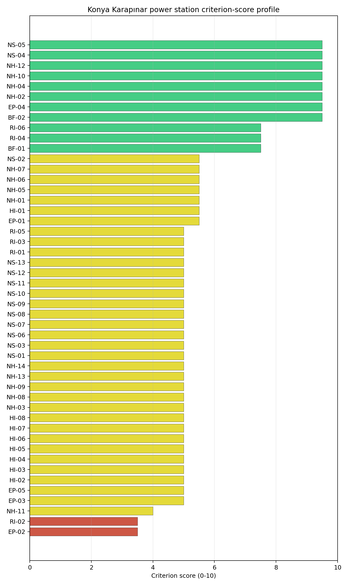
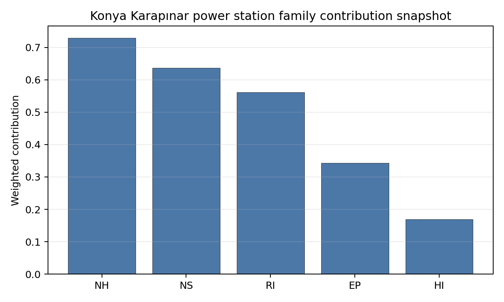

# Konya Karapınar power station Site Profile

Konya Karapınar power station is a coal/thermal site in Türkiye that has been tested against the NuScale VOYGR-6 reference deployment envelope. This profile reads the screening evidence at a level that supports a decision to progress toward Stage 3 characterization. It is not a site-suitability determination, vendor recommendation, or licensing finding.

## Site Snapshot

| Field | Value |
| --- | --- |
| Site name | Konya Karapınar power station |
| Coordinates | 37.6142, 33.5912 |
| Subnational unit | Konya |
| Installed thermal capacity (source data) | 1,000 MW |
| Composite score (baseline weights) | 6.518 (4.317-6.918 MC band) |
| National stability band | A (top-10% hit rate 100%) |
| National rank | 1 |

_See the country status map in_ [Türkiye Country Profile](../TR_country_prototype.md#country-status-map).

## Ownership and Coal-to-Nuclear Context

- **Elektrik Uretim AŞ** (100.00% share), headquartered in Türkiye; immediate operator Elektrik Uretim AŞ. Path: Elektrik Uretim AŞ -> Konya Karapınar power station -- [100.0%]
- **Government of Türkiye** (100.00% share), headquartered in Türkiye; immediate operator Elektrik Uretim AŞ. Path: Government of Türkiye  -> Elektrik Uretim AŞ [100.0%] -> Konya Karapınar power station -- [100.0%]

Generating units on record: 1 cancelled.

## Natural Hazards (NH)

- **Seismic: Ground Motion (NH-01)** - score 5.5/10 (MC 5.0-6.0), weight 0.0396, data quality high. Evidence: PGA at 475-year return period 0.134 g; PGA at 2,475-year return period 0.314 g; Vs30 reference (m/s): 760.0.
- **Seismic: Surface Rupture (NH-02)** - score 9.5/10 (MC 9.0-10.0), weight n/a, data quality screening grade. Evidence: nearest mapped capable fault 50.0 km; fault slip rate 0 mm/yr; fault name: none_in_search_radius.
- **Geotechnical: Liquefaction (NH-03)** - score 5.0/10 (MC 5.0-5.0), weight n/a, data quality medium. Evidence: liquefaction susceptibility: high; dominant soil type: silty_clay_loam.
- **Geotechnical: Slope Stability (NH-04)** - score 9.5/10 (MC 9.0-10.0), weight n/a, data quality screening grade. Evidence: site slope 0.71 deg; max slope in 1 km box 88.7 deg; slope stability class: flat.
- **Geotechnical: Subsidence (NH-05)** - score 5.5/10 (MC 5.0-6.0), weight 0.0308, data quality medium. Evidence: karst present: no; karst severity: none.
- **Geotechnical: Foundation (NH-06)** - score 5.5/10 (MC 5.0-6.0), weight 0.0220, data quality medium. Evidence: bearing capacity 88.7 kPa; depth to bedrock 27.9 m.
- **Volcanism (NH-07)** - score 5.5/10 (MC 5.0-6.0), weight n/a, data quality medium. Evidence: nearest Holocene volcano 76.6 km; volcano name: Hasandag-Keciboyduran Volcanic Complex; volcanic hazard class: low.
- **Coastal Flooding (NH-08)** - score 5.0/10 (MC 5.0-5.0), weight 0.0264, data quality low. Evidence: values not in measurement tables.
- **River Flooding (NH-09)** - score 5.0/10 (MC 5.0-5.0), weight 0.0352, data quality medium. Evidence: flood zone class: negligible.
- **Extreme Winds (NH-10)** - score 9.5/10 (MC 9.0-10.0), weight n/a, data quality medium. Evidence: design wind speed 6.42 m/s.
- **Extreme Precipitation (NH-11)** - score 4.0/10 (MC 4.0-4.0), weight 0.0132, data quality medium. Evidence: extreme daily precipitation 0.12 mm; mean annual precipitation 8.64 mm/yr.
- **Extreme Temperatures (NH-12)** - score 9.5/10 (MC 9.0-10.0), weight 0.0176, data quality medium. Evidence: extreme high temperature 28.4 deg C; extreme low temperature -6.31 deg C.
- **Forest/Wildfire (NH-13)** - score 5.0/10 (MC 5.0-5.0), weight 0.0132, data quality n/a. Evidence: values not in measurement tables.
- **Combined Hazards (NH-14)** - score 5.0/10 (MC 5.0-5.0), weight 0.0132, data quality n/a. Evidence: values not in measurement tables.

### Interpretation - Natural Hazards (NH)

<!-- specialist key=family_natural_hazards scope=site site_id=ad0c8590-c672-43f2-a813-1217a10f7d2d bundle=TR_konya_karapnar_power_station_site_bundle.json status=filled by=cursor-agent filled_at=2026-05-03T18:20:09Z -->
Natural hazards at Konya Karapınar sit in a moderately seismic central-Anatolian plateau envelope at 1,004 m elevation in the Konya Closed Basin, with the principal natural-hazard considerations the moderate NH-01 ground-motion read on the Anatolian tectonic context and the long-distance NH-07 volcanic exposure to the Hasandağ system. **NH-01 Seismic: Ground Motion at 5.5/10** carries a 475-yr PGA of **0.134 g** and a 2,475-yr PGA of **0.314 g** — well below the 0.5 g project Phase-2 avoidance threshold but the moderate-band loading reflects the wider central-Anatolian seismic context (the Tuz Gölü Fault Zone and the Karasu Fault Zone are mapped within ~100 km of the site, but no capable fault is picked up inside the screening 50 km radius). **NH-02 Seismic: Surface Rupture at 9.5/10** carries no mapped capable fault inside the 50 km screening search radius — a clean fault-stand-off envelope at this screening grade, but the central-Anatolian fault network is densely populated outside the radius and the Stage 3 PSHA will need explicit characterisation of the wider source-zone catalogue against the SSR-1 capable-fault stand-off requirement. **NH-04 Geotechnical: Slope Stability at 9.5/10** carries a mean site slope of just **0.71°** on a `flat` slope-stability class — the Konya Closed Basin Karapınar plateau is essentially flat. **NH-03 Geotechnical: Liquefaction at 5.0/10** carries a `high` susceptibility read on a silty-clay-loam profile (the Konya Basin lacustrine sediments are fine-grained and the Stage 3 CPT campaign should characterise the dynamic-loading envelope). NH-05 reads 5.5/10 with `karst not present` and `none` severity in the screening cadastre — but the Konya Closed Basin is the **classical type-locality for the Karapınar Obruk sinkhole field**, where evaporite dissolution and groundwater overpumping have produced a large population of cover-collapse sinkholes; the Stage 3 work will need to commission a substantive site-specific geophysical and hydrogeological survey (seismic refraction, electrical resistivity tomography, and a dedicated piezometer network) to characterise the karst / pseudo-karst envelope and the sinkhole-formation hazard, which the screening cadastre does not pick up. NH-06 reads 5.5/10 on a 88.7 kPa screening-proxy bearing capacity over 27.9 m to bedrock. **NH-07 Volcanism at 5.5/10** carries the **Hasandağ-Keciboyduran Volcanic Complex at 76.6 km** on a `low` volcanic-hazard class — the Hasandağ system is a Holocene stratovolcano with documented eruptions in the late Pleistocene and a long-running pyroclastic and tephra-fall hazard envelope; the Stage 3 work should commission a site-specific tephra-fall hazard assessment with explicit modelling of the prevailing wind directions against the Hasandağ source. Extreme meteorology is favourable: a 50-yr design wind of 6.42 m/s and an extreme temperature range of -6.31 °C to 28.4 °C (NH-10 and NH-12 at 9.5/10), with a low extreme-precipitation read consistent with the semi-arid Konya plateau climate (mean annual precipitation 8.64 mm/yr on the screening proxy, the lowest of the first-batch cohort). NH-09 carries an inconclusive verdict — the Konya Closed Basin has limited surface-runoff but the wider Çumra / May Çayı drainage system would need Stage 3 characterisation. The Stage 3 priority order is therefore: commission a substantive geophysical and hydrogeological survey of the Karapınar Obruk sinkhole field and its relation to the SMR foundation envelope (this is the dominant Stage 3 natural-hazard question and is unique to the Konya Closed Basin context); commission a project-specific PSHA on measured Vs30 against the wider central-Anatolian source-zone catalogue (Tuz Gölü Fault Zone, Karasu Fault Zone, and the East Anatolian Fault); commission a site-specific Hasandağ tephra-fall hazard assessment so NH-07 settles on a defensible volcanic-hazard envelope; and commission a CPT campaign on the lacustrine clay-loam profile so NH-03 settles on a measured liquefaction-susceptibility value.
<!-- /specialist key=family_natural_hazards -->

## Human-Induced and Security-Relevant Hazards (HI)

- **Aircraft Crash (HI-01)** - score 5.5/10 (MC 5.0-6.0), weight 0.0308, data quality high. Evidence: nearest airport 80.1 km; nearest flight path 40.1 km; airports within search radius 0; airport name: Aksaray Airport; airport type: small_airport.
- **Industrial Explosions (HI-02)** - score 5.0/10 (MC 5.0-5.0), weight 0.0308, data quality low. Evidence: values not in measurement tables.
- **Toxic/Gas Releases (HI-03)** - score 5.0/10 (MC 5.0-5.0), weight 0.0308, data quality low. Evidence: values not in measurement tables.
- **External Fires (HI-04)** - score 5.0/10 (MC 5.0-5.0), weight 0.0264, data quality low. Evidence: values not in measurement tables.
- **Transport Hazards (HI-05)** - score 5.0/10 (MC 5.0-5.0), weight 0.0264, data quality n/a. Evidence: values not in measurement tables.
- **Military Installations (HI-06)** - score 5.0/10 (MC 5.0-5.0), weight 0.0264, data quality not_found. Evidence: military installations within radius 0.
- **Electromagnetic Interference (HI-07)** - score 5.0/10 (MC 5.0-5.0), weight 0.0088, data quality medium. Evidence: nearest high-power transmitter 10.8 km; transmitters within radius 16; transmitter type: minaret.
- **Other Nuclear Installations (HI-08)** - score 5.0/10 (MC 5.0-5.0), weight 0.0132, data quality n/a. Evidence: values not in measurement tables.

### Interpretation - Human-Induced and Security-Relevant Hazards (HI)

<!-- specialist key=family_human_hazards scope=site site_id=ad0c8590-c672-43f2-a813-1217a10f7d2d bundle=TR_konya_karapnar_power_station_site_bundle.json status=filled by=cursor-agent filled_at=2026-05-03T18:20:09Z -->
Human-induced and security-relevant hazards at Konya Karapınar are favourable across the family — the central-Anatolian Karapınar plateau is structurally sparse on civil-aviation, military, and industrial-cadastre features, and the screening reads carry no binding cautions. **HI-01 Aircraft Crash at 5.5/10** carries the **Aksaray Airport (`small_airport`) at 80.1 km from the site** with the nearest flight-path projection at **40.1 km** and **0 air features inside the 30 km search radius** — a structurally clean aircraft-crash envelope, the cleanest of the first-batch cohort. Konya itself (with its airport) sits at ~80–95 km from the site, well outside the 30 km screening radius, and the wider central-Anatolian airfield density is low. **HI-06 Military Installations at 5.0/10** carries `not_found` data quality with 0 features inside the screening radius — the Karapınar plateau is structurally outside the active Turkish military estate corridor (the wider Konya regional military estate is concentrated around the city of Konya itself and the 3rd Main Jet Base at Konya, both well outside the 25 km screening radius). The Stage 3 work should commission an authoritative cadastre run with the Turkish General Staff to confirm the favourable screening read against the wider regional military-infrastructure pattern, but the HI-06 envelope is unlikely to be a binding constraint. **HI-02 Industrial Explosions, HI-03 Toxic / Gas Releases, HI-04 External Fires** all sit at the pass-mark default of 5.0/10 on `low` data quality (the Turkish national Seveso and pollutant-release inventories have limited screening coverage on the central-Anatolian plateau); the immediate Karapınar context outside the cancelled lignite-plant footprint is rural-agricultural and the **Karapınar 1.35 GWp utility-scale solar park** (the largest in Türkiye) sits in the wider site environs as the dominant industrial neighbour — the solar park is not an SSG-35 hazard category but the Stage 3 work should run a focused Turkish national Seveso, hazmat-corridor, and pollutant-release cadastre run to confirm the screening default. **HI-05 Transport Hazards** holds at 5.0/10. HI-07 reads 5.0/10 with the nearest broadcast feature at 10.8 km (a minaret) and **16 transmitters inside the EMI search radius** (a structurally clean broadcast environment, reflecting the rural Karapınar plateau context). HI-08 is null. The Stage 3 priority order is therefore: commission a Turkish General Staff cadastre engagement to confirm the HI-06 favourable screening read against the wider Konya regional military estate; commission the Turkish national Seveso, hazmat-corridor, pollutant-release, and external-fire surveys so HI-02 to HI-05 lift off the screening default; commission a focused SSG-79 hazard assessment for the Aksaray and Konya airfields against the wider Anatolian flight-path-corridor catalogue; and commission an EMI envelope study (light-touch given the structurally clean screening read).
<!-- /specialist key=family_human_hazards -->

## Radiological Impact and Emergency Planning (RI / EP)

- **Emergency Planning Feasibility (EP-01)** - score 5.5/10 (MC 5.0-6.0), weight n/a, data quality high. Evidence: EP feasibility composite 57.8 /100; road sub-score 42.6 /100; special-population sub-score 90.0 /100; geography sub-score 95.0 /100; population sub-score 95.0 /100; evacuation feasible: yes.
- **Evacuation Routes (EP-02)** - score 3.5/10 (MC 3.0-4.0), weight 0.0264, data quality medium. Evidence: road density in EPZ 0.344 km/km2; road length in EPZ 674.9 km; motorway access: yes.
- **Physical Geography Constraints (EP-03)** - score 5.0/10 (MC 5.0-5.0), weight 0.0220, data quality medium. Evidence: waterways crossing EPZ 0; major river barrier: no.
- **Special Populations (EP-04)** - score 9.5/10 (MC 9.0-10.0), weight 0.0264, data quality medium. Evidence: hospitals in EPZ 1; prisons in EPZ 0; care homes in EPZ 0.
- **Concurrent Hazard Impact (EP-05)** - score 5.0/10 (MC 5.0-5.0), weight 0.0176, data quality n/a. Evidence: values not in measurement tables.
- **Atmospheric Dispersion (RI-01)** - score 5.0/10 (MC 5.0-5.0), weight 0.0264, data quality medium. Evidence: annual mean wind speed 0.79 m/s; atmospheric mixing height 637.0 m; prevailing wind direction: NW.
- **Surface Water Dispersion (RI-02)** - score 3.5/10 (MC 3.0-4.0), weight 0.0220, data quality n/a. Evidence: values not in measurement tables.
- **Groundwater Dispersion (RI-03)** - score 5.0/10 (MC 5.0-5.0), weight 0.0220, data quality medium. Evidence: aquifer type: volcanic rocks.
- **Population Density at EPZ Radii (RI-04)** - score 7.5/10 (MC 7.0-8.0), weight 0.0352, data quality screening grade. Evidence: population density within 5 km 0.28 /km2; population density within 16 km 47.2 /km2; population density within 25 km 24.4 /km2; population density within 80 km 36.0 /km2; population within 25 km 47,860 people.
- **Distance to Population Centres (RI-05)** - score 5.0/10 (MC 5.0-5.0), weight 0.0441, data quality screening grade. Evidence: values not in measurement tables.
- **Population Projections (RI-06)** - score 7.5/10 (MC 7.0-8.0), weight 0.0220, data quality screening grade. Evidence: annual population growth rate -0.262 %/yr; projected population at 25 km in 60 yr 52,475 people.

### Interpretation - Radiological Impact and Emergency Planning (RI / EP)

<!-- specialist key=family_radiological_emergency scope=site site_id=ad0c8590-c672-43f2-a813-1217a10f7d2d bundle=TR_konya_karapnar_power_station_site_bundle.json status=filled by=cursor-agent filled_at=2026-05-03T18:20:09Z -->
Radiological-impact and emergency-planning conditions at Konya Karapınar are exceptionally favourable on population — the structurally sparsest 5 km and 25 km population envelope of the first-batch cohort by a substantial margin — partially offset by the EP-02 evacuation-route-density caution on the rural Karapınar plateau and the RI-02 small-river dispersion read. The DRV-02 emergency-planning composite reads **57.8/100 with `evacuation feasible: yes`**, supported by sub-scores on geography (95/100), population (95/100), special populations (90/100), and a road sub-score of 42.6/100. **EP-02 Evacuation Routes at 3.5/10** reads on a road density of just **0.344 km/km² inside the 16 km EPZ** with **674.9 km of road length** and motorway access — the road density is the lowest of the Turkish portfolio (the rural Karapınar plateau has limited road-network density outside the Karapınar town centre at ~30 km from the site) and constrains the cross-EPZ evacuation logistics. **EP-04 Special Populations at 9.5/10** carries just **1 hospital inside the 16 km EPZ** with **0 prisons and 0 care homes** — the cleanest special-population envelope of the first-batch cohort. Population context is the dominant favourable RI finding: **5 km density 0.28 p/km² (essentially uninhabited Karapınar plateau)**, rising to 47.2 p/km² at 16 km, **24.4 p/km² at 25 km**, and 36.0 p/km² at 80 km on a 25 km cumulative population of just **47,860 people** — **RI-04 reads 7.5/10**, the strongest population read of the first-batch cohort outside the Romanian sites. The Karapınar town (~52k population) sits at ~30 km from the site, just outside the 25 km radius. The 60-yr projection at 25 km is 52,475 people on a -0.262 %/yr growth track (the rural central-Anatolian plateau is depopulating slowly through internal migration); RI-06 reads 7.5/10. **RI-02 Surface Water Dispersion at 3.5/10** reads on the small unnamed-river cooling envelope (HYRIV-20665450, see NS-01) at 23.9 m³/s flow at 4.61 km abstraction distance — the modest flow and the **Konya Closed Basin's `Extremely High` water-stress label** are structural constraints on routine liquid effluent dispersion (the Konya Closed Basin is one of Türkiye's most water-stressed regions, with substantial historical groundwater overpumping and surface-water deficit). The atmospheric envelope is calm: **0.79 m/s annual mean wind speed** with a **637 m mixing height** (the highest of the Turkish portfolio, reflecting the elevated central-Anatolian plateau context — the high mixing height is a substantively favourable dispersion characteristic) and an **NW prevailing direction** (towards the Tuz Gölü basin and the wider Anatolian plateau interior, away from the Karapınar town and the Konya conurbation); RI-01 sits at 5.0/10. RI-03 reads 5.0/10 on a `volcanic rocks` aquifer (the central-Anatolian volcanic substrate from the Hasandağ / Karapınar volcanic field is generally low-permeability, which is favourable for groundwater-pathway containment but constrains supplementary-cooling abstraction options). RI-05 reads 5.0/10 on `screening grade`. EP-03 reads 5.0/10 (no major river barrier inside the EPZ). EP-05 sits at 5.0/10. The Stage 3 priority order is therefore: commission a Stage 3 surface-water dispersion model on the cooling-source unnamed-river system at 23.9 m³/s with explicit attention to the Konya Closed Basin water-stress envelope so RI-02 lifts off the 3.5/10 caution and the cooling-water dispersion case is settled; commission a 16 km EPZ road-network upgrade plan with the Turkish Ministry of Transport so EP-02 lifts off the binding caution (the rural Karapınar plateau may require new road construction rather than upgrade); commission the project-specific micro-meteorological station so RI-01 settles on a measured wind rose against the favourable plateau-elevation envelope (the 637 m mixing height is substantively favourable); engage the Karapınar regional emergency-planning authority on the 1-hospital EPZ (a light-touch operational evacuation plan); and commission the Stage 3 hydrogeological survey on the volcanic-rock aquifer with explicit characterisation against the Konya Closed Basin groundwater-budget context.
<!-- /specialist key=family_radiological_emergency -->

## Non-Safety and Implementation Considerations (NS)

- **Grid Capacity Basic Filter (BF-01)** - score 7.5/10 (MC 7.0-8.0), weight 0.0352, data quality n/a. Evidence: values not in measurement tables.
- **Land Area Basic Filter (BF-02)** - score 9.5/10 (MC 9.0-10.0), weight 0.0220, data quality n/a. Evidence: values not in measurement tables.
- **Cooling Water Availability (NS-01)** - score 5.0/10 (MC 5.0-5.0), weight n/a, data quality screening grade. Evidence: distance to cooling source 4.61 km; cooling source flow 23.9 m3/s; cooling source type: river; cooling source name: HYRIV-20665450; water stress label: Extremely High.
- **Grid Connection (NS-02)** - score 5.5/10 (MC 3.5-7.5), weight 0.0352, data quality insufficient. Evidence: nearest substation 13.5 km; nearest high-voltage line 14.7 km; highest nearby line voltage 154.0 kV; grid export capacity 1,000 MW; substations within radius 8; HV lines within radius 25.
- **Transport Access (NS-03)** - score 5.0/10 (MC 5.0-5.0), weight 0.0352, data quality low. Evidence: values not in measurement tables.
- **Site Topography (NS-04)** - score 9.5/10 (MC 9.0-10.0), weight 0.0264, data quality medium. Evidence: favourable land cover 85.7 %; moderate land cover 12.6 %; unfavourable land cover 1.7 %; favourable area 270.1 ha; dominant land class: 333.
- **Site Footprint Adequacy (NS-05)** - score 9.5/10 (MC 9.0-10.0), weight 0.0220, data quality screening grade. Evidence: buildable area 314.1 ha; largest contiguous patch 1,235 ha; buildable patch count 1.
- **Existing Infrastructure (NS-06)** - score 5.0/10 (MC 5.0-5.0), weight 0.0220, data quality n/a. Evidence: values not in measurement tables.
- **Environmental Impact (non-rad) (NS-07)** - score 5.0/10 (MC 5.0-5.0), weight 0.0220, data quality n/a. Evidence: values not in measurement tables.
- **Ecological Sensitivity (NS-08)** - score 5.0/10 (MC 5.0-5.0), weight n/a, data quality insufficient. Evidence: natural land cover 1.7 %; distance to nearest protected area 7.94 km; Natura 2000 sensitivity class: unknown; protected-area overlap: no; protected-area sensitivity class: low; Natura 2000 sites within 5 km: 0; nearest protected-area designation: Wetland of International Importance (Ramsar Site).
- **Socioeconomic Impact (NS-09)** - score 5.0/10 (MC 5.0-5.0), weight 0.0220, data quality n/a. Evidence: values not in measurement tables.
- **Workforce Availability (NS-10)** - score 5.0/10 (MC 5.0-5.0), weight 0.0176, data quality n/a. Evidence: values not in measurement tables.
- **Coal-to-Nuclear Synergies (NS-11)** - score 5.0/10 (MC 5.0-5.0), weight 0.0264, data quality n/a. Evidence: values not in measurement tables.
- **Regulatory/Political Environment (NS-12)** - score 5.0/10 (MC 5.0-5.0), weight 0.0264, data quality n/a. Evidence: values not in measurement tables.
- **Construction Logistics (NS-13)** - score 5.0/10 (MC 5.0-5.0), weight 0.0176, data quality n/a. Evidence: values not in measurement tables.

### Interpretation - Non-Safety and Implementation Considerations (NS)

<!-- specialist key=family_infrastructure scope=site site_id=ad0c8590-c672-43f2-a813-1217a10f7d2d bundle=TR_konya_karapnar_power_station_site_bundle.json status=filled by=cursor-agent filled_at=2026-05-03T18:20:10Z -->
Non-safety and implementation conditions at Konya Karapınar are dominated by the exceptionally large buildable footprint and the favourable land-cover envelope on the Karapınar plateau, partially offset by a modest grid-connection cadastre at substantial distance and the Konya Closed Basin's `Extremely High` water-stress context — which is a structural constraint on the cooling-water envelope despite the moderate cooling-source flow. **NS-05 Site Footprint Adequacy at 9.5/10** carries an exceptional **314.1 ha buildable area with a largest contiguous patch of 1,235 ha** as a single contiguous patch — the largest single-patch buildable footprint of the Turkish portfolio and one of the largest of the first-batch cohort by an order of magnitude (Slovak Nováky 198.9 ha, Polish Opole 159.7 ha). The cancelled Konya Karapınar greenfield context means there is no existing brownfield infrastructure to constrain the buildable envelope, but the wider Karapınar plateau provides essentially unlimited contiguous land for SMR deployment with substantial headroom for both the multi-module reactor envelope and supporting infrastructure (cooling towers, water-storage scheme, switchyard expansion, and worker accommodation). **NS-04 Site Topography at 9.5/10** reads on **85.7% favourable land cover, 12.6% moderate, and 1.7% unfavourable** on **270.1 ha of favourable area** in the wider site environs — the dominant land class is `333` (sparsely vegetated areas / steppe, the typical Karapınar plateau land-cover signature). **BF-02 Land Area Basic Filter at 9.5/10 and BF-01 Grid Capacity Basic Filter at 7.5/10** confirm the basic filters with the strongest BF-01 read of the Slovak / Turkish first-batch cohort. **NS-02 Grid Connection at 5.5/10** is the principal NS finding requiring Stage 3 attention: the nearest substation is at **13.5 km from the site** and the nearest high-voltage line is at **14.7 km**, with the **highest nearby line voltage at 154 kV** (the Turkish-grid 154 kV transmission tier is below the 380 kV national-grid backbone) and a measured **grid export capacity of 1,000 MW** matching the cancelled-thermal-block envelope, with **8 substations and 25 HV lines inside the search radius** on `insufficient` data quality. The 13.5 km substation distance is substantial — the SMR deployment will require a substantial new HV-line build to connect into the wider TEİAŞ 154 / 380 kV backbone, but the existing cancelled-project grid infrastructure is likely to have been planned at scale. **NS-01 Cooling Water Availability at 5.0/10** is the substantive NS constraint: the cooling source is a small unnamed river (HYRIV-20665450) at 4.61 km from the site with a measured flow of **23.9 m³/s** on an **`Extremely High` water-stress label** — the Konya Closed Basin is one of Türkiye's most water-stressed regions (the basin has had a chronic groundwater deficit since the 1980s with substantial subsidence and sinkhole formation linked to overpumping, see NH-05). A multi-module SMR deployment will require a substantial cooling-water engineering programme with dry-cooling or supplementary water-storage solutions, and the Stage 3 work should commission a basin-scale water-budget assessment with the Turkish State Hydraulic Works (DSİ) before progressing the cooling-water envelope. **NS-03 Transport Access at 5.0/10** reads on `low` data quality with no measured highway or rail proximity in the screening cadastre — the wider Karapınar plateau is connected by the D-715 / D-330 highway corridor through Karapınar town (~30 km from the site), but the Stage 3 work will need to scope a substantial new access road from the highway corridor to the site for SMR module delivery. **NS-08 Ecological Sensitivity at 5.0/10** carries `insufficient` data quality with the nearest protected area at **7.94 km on the Wetland of International Importance (Ramsar Site) designation** — the site sits adjacent to the wider Tuz Gölü Special Environmental Protection Area or a related Ramsar wetland (the central-Anatolian salt-lake system is a major migratory-bird flyway and a particularly sensitive ecological context); the Stage 3 work should commission an Article 6.3-equivalent appropriate-assessment framework with the Turkish Ministry of Environment, Urbanisation and Climate Change. NS-06, NS-07, NS-09 to NS-13 sit at the pass-mark default of 5.0/10. The Stage 3 priority order is therefore: commission a basin-scale water-budget assessment with DSİ and an explicit engineering scope on dry-cooling or supplementary-water-storage solutions so NS-01 settles against the binding `Extremely High` water-stress envelope (this is the dominant feasibility question for the site, given the Konya Closed Basin context and the Karapınar Obruk sinkhole connection); scope the substation upgrade and new HV-line build to connect into the wider TEİAŞ 154 / 380 kV backbone so NS-02 settles against the multi-module SMR export envelope; commission a Ramsar appropriate-assessment framework so NS-08 settles on a defensible ecological envelope against the Tuz Gölü flyway; commission the construction-logistics survey on the new access road from the D-715 / D-330 corridor; and engage the Turkish General Directorate of State Hydraulic Works (DSİ) on basin-scale management.
<!-- /specialist key=family_infrastructure -->

## Composite Score and Stability

Baseline composite score is 6.518, bracketed by Monte Carlo at 4.317-6.918. National stability band is `A` with a top-10% hit rate of 100% across 16 scored Monte Carlo scenarios.

<!-- specialist key=stability scope=site site_id=ad0c8590-c672-43f2-a813-1217a10f7d2d bundle=TR_konya_karapnar_power_station_site_bundle.json status=filled by=cursor-agent filled_at=2026-05-03T18:20:10Z -->
Konya Karapınar's composite of **6.518 (Monte Carlo 4.317–6.918)** is the strongest Turkish entry of the first-batch cohort and one of the strongest in the regional cohort: the **national stability band is `A`** with top-10% and top-5% hit rates of **100% across 16 scored Monte Carlo scenarios**, and the **regional stability band is also `A`** with a top-10% hit rate of **100%** across the regional Monte Carlo — Konya Karapınar is the unambiguous top Turkish national candidate and a top-tier regional candidate, structurally robust under all explored Monte Carlo perturbations (the Monte Carlo lower bound at 4.317 reflects the dispersion of the screening reads under the explored weight perturbations rather than any plausible parameter combination demoting the site below the upper-tier band). The composite is anchored by BF-01 grid capacity basic filter (contribution 0.264 from the 7.5/10 favourable read), RI-04 population density at EPZ radii (0.264 from the 7.5/10 read on the structurally sparse Karapınar plateau population envelope), EP-04 special populations (0.251 from the 9.5/10 score on the 1-hospital EPZ), NS-04 site topography (0.251 from the 9.5/10 score on the 85.7% favourable land-cover envelope), RI-05 distance to population centres (0.221 from the favourable Karapınar town distance), and NH-01 seismic ground motion (0.218 from the moderate 0.314 g read). The drag features are limited to **EP-02 Evacuation Routes (3.5/10 — rural Karapınar plateau road-network density)** and **RI-02 Surface Water Dispersion (3.5/10 — small unnamed-river cooling envelope on the `Extremely High` water-stress Konya Closed Basin)**. The plain-English read is that **Konya Karapınar is the strongest Turkish brownfield (technically planned-but-cancelled greenfield) SMR candidate and a top-tier regional candidate** — the structurally sparse population envelope (5 km density 0.28 p/km², 25 km cumulative 47,860 people), the exceptional 1,235 ha contiguous buildable patch, the favourable 85.7% land-cover envelope on the central-Anatolian plateau, the high 637 m mixing height for atmospheric dispersion, the favourable Hasandağ tephra-fall geometry, and the structurally clean HI-01 / HI-06 envelope make this a compelling new-build SMR case. The dominant Stage 3 questions are: the **Konya Closed Basin water-stress and Karapınar Obruk sinkhole context** (which couples the NS-01 cooling-water and NH-05 / NH-03 geotechnical envelopes into a single basin-scale Stage 3 question requiring substantial water-budget and geophysical work with DSİ); the **NS-02 substantial new HV-line build** to connect into the TEİAŞ 154 / 380 kV backbone at 13.5–14.7 km distance; the **Tuz Gölü Ramsar appropriate-assessment context** at 7.94 km; and the structurally adverse cancelled-greenfield context (no brownfield-inheritance economic case beyond the planned grid and cooling-water infrastructure). **Recommendation**: advance Konya Karapınar as the leading Turkish national SMR candidate with the basin-scale water-stress and sinkhole assessment as the priority Stage 3 deliverable. The cancelled-greenfield context is a structural disadvantage relative to operating-brownfield candidates but the screening reads across all four families are exceptionally favourable and the candidate-pool case is robust.
<!-- /specialist key=stability -->

## Residual Risk Register

<!-- specialist key=residual_risk scope=site site_id=ad0c8590-c672-43f2-a813-1217a10f7d2d bundle=TR_konya_karapnar_power_station_site_bundle.json status=filled by=cursor-agent filled_at=2026-05-03T18:20:10Z -->
| Criterion | Description | Owner | Resolution path |
| --- | --- | --- | --- |
| NS-01 Cooling Water (Konya Closed Basin) | `Extremely High` water-stress label on Konya Closed Basin (chronic groundwater deficit, sinkhole formation linked to overpumping); 23.9 m³/s small-river cooling envelope. | Cooling Systems | Basin-scale water-budget assessment with Turkish State Hydraulic Works (DSİ); explicit engineering scope on dry-cooling or supplementary-water-storage solutions. |
| NH-05 Karst / Pseudo-karst (Karapınar Obruk sinkholes) | Karapınar Obruk sinkhole field is the classical type-locality; screening cadastre does not pick up cover-collapse hazard from evaporite dissolution and groundwater overpumping. | Geotechnical | Substantive site-specific geophysical and hydrogeological survey (seismic refraction, electrical resistivity tomography, dedicated piezometer network) characterising sinkhole-formation hazard. |
| NS-02 Grid Connection (distance) | Nearest substation 13.5 km, nearest HV line 14.7 km; 154 kV nearby tier below 380 kV national backbone. | Grid/Transmission | Substantial new HV-line build to TEİAŞ 154/380 kV backbone; substation upgrade. |
| NH-07 Volcanism (Hasandağ tephra) | Hasandağ-Keciboyduran Volcanic Complex at 76.6 km on `low` hazard class; Holocene stratovolcano with documented late-Pleistocene eruptions. | Geotechnical/Atmospheric | Site-specific Hasandağ tephra-fall hazard assessment with prevailing-wind modelling against source. |
| NS-08 Ecological Sensitivity (Tuz Gölü Ramsar) | Wetland of International Importance (Ramsar Site) at 7.94 km — central-Anatolian salt-lake migratory-bird flyway. | Environmental | Article 6.3-equivalent appropriate-assessment framework with Turkish Ministry of Environment, Urbanisation and Climate Change. |
| NH-01 Seismic Ground Motion | 2,475-yr PGA 0.314 g — moderate central-Anatolian context; wider Tuz Gölü Fault Zone, Karasu Fault Zone, East Anatolian Fault outside 50 km screening radius. | Geotechnical | Project-specific PSHA on measured Vs30 with explicit characterisation of wider central-Anatolian source-zone catalogue. |
| RI-02 Surface Water Dispersion | Small unnamed-river cooling envelope at 23.9 m³/s in `Extremely High` water-stress basin. | Radiological | Stage 3 surface-water dispersion model with explicit attention to Konya Closed Basin water-stress envelope and seasonal flow minima. |
| EP-02 Evacuation Routes | EPZ road density 0.344 km/km² (lowest of Turkish portfolio); rural Karapınar plateau may require new road construction. | Emergency Planning | EPZ road-network upgrade and possible new construction with Turkish Ministry of Transport. |
| NS-03 Transport Access (greenfield logistics) | No measured highway or rail proximity in screening cadastre; D-715 / D-330 corridor at ~30 km via Karapınar town. | Construction Logistics | New access road from D-715 / D-330 highway corridor for SMR module delivery. |
| Brownfield-inheritance absence | Cancelled-greenfield context with no operating or retired thermal-block infrastructure; entire site preparation is essentially new-build. | Project Economics | Re-evaluate brownfield-inheritance economic case; offset via planned-project infrastructure (grid, cooling) where applicable. |
<!-- /specialist key=residual_risk -->

## Stage 3 Follow-Up Checklist

- [ ] Re-measure **Evacuation Routes (EP-02)** - native score 3.5/10 with confidence medium.
- [ ] Re-measure **Surface Water Dispersion (RI-02)** - native score 3.5/10 with confidence insufficient.
- [ ] Re-measure **Extreme Precipitation (NH-11)** - native score 4.0/10 with confidence medium.
- [ ] Re-measure **Physical Geography Constraints (EP-03)** - native score 5.0/10 with confidence medium.
- [ ] Re-measure **Concurrent Hazard Impact (EP-05)** - native score 5.0/10 with confidence insufficient.
- [ ] Improve data quality for **Geotechnical: Subsidence & Collapse (NH-05b)** - current flag `low`.
- [ ] Improve data quality for **Coastal Flooding (NH-08)** - current flag `low`.
- [ ] Improve data quality for **Industrial Explosions (HI-02)** - current flag `low`.
- [ ] Improve data quality for **Toxic/Gas Releases (HI-03)** - current flag `low`.
- [ ] Improve data quality for **External Fires (HI-04)** - current flag `low`.
- [ ] Improve data quality for **Military Installations (HI-06)** - current flag `not_found`.
- [ ] Improve data quality for **Transport Access (NS-03)** - current flag `low`.

## Evidence Limitations

- Geotechnical: Subsidence & Collapse (NH-05b) - quality `low`.
- Coastal Flooding (NH-08) - quality `low`.
- Industrial Explosions (HI-02) - quality `low`.
- Toxic/Gas Releases (HI-03) - quality `low`.
- External Fires (HI-04) - quality `low`.
- Military Installations (HI-06) - quality `not_found`.
- Transport Access (NS-03) - quality `low`.
