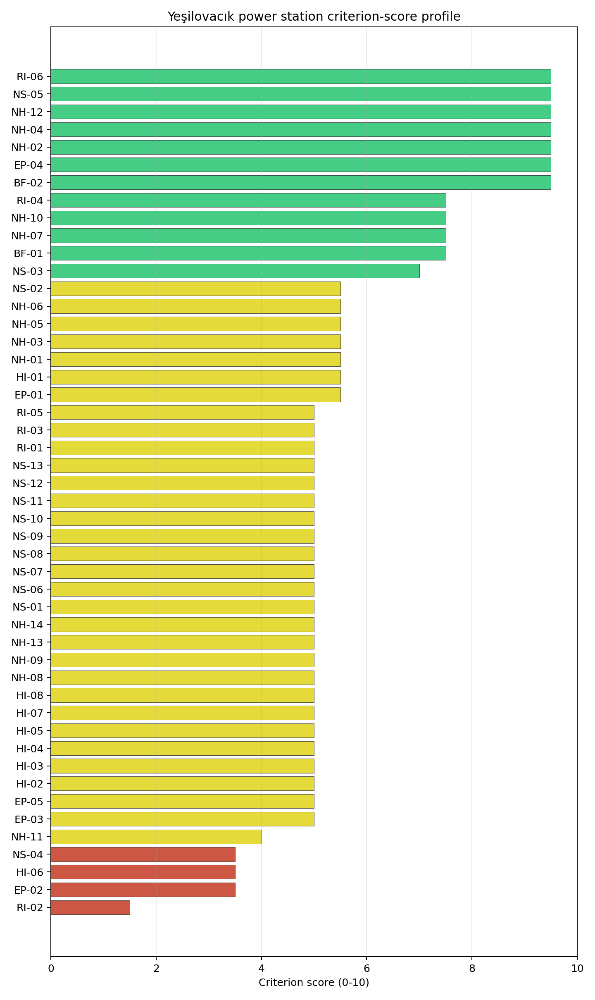
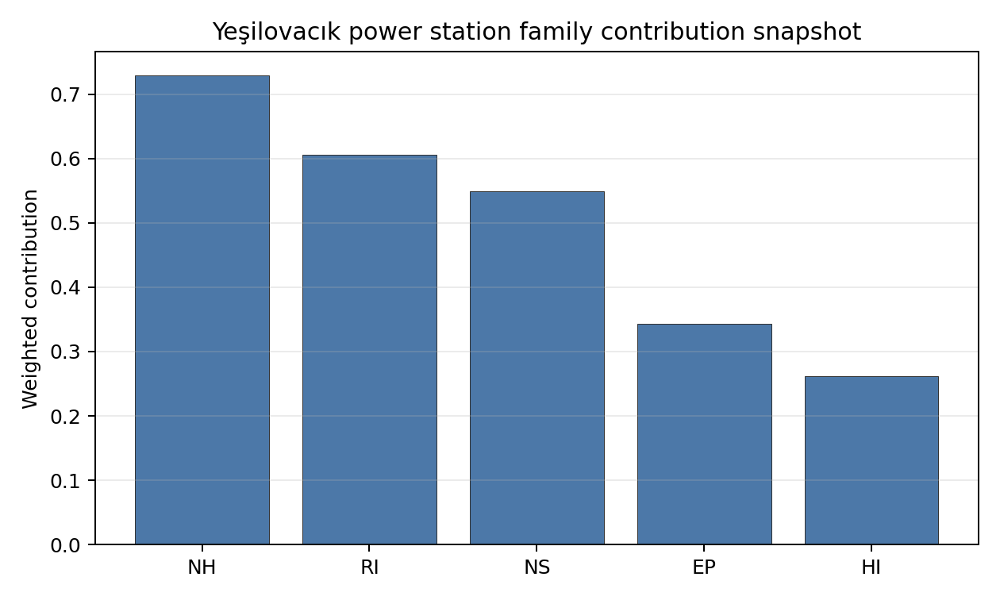

# Yeşilovacık power station Site Profile

> **Note on Site Identity** — Yeşilovacık power station is **co-located with [Akdeniz Enerji power station](TR_akdeniz_enerji_power_station.md)** on the same Bozyazı / Aydıncık Mediterranean coastal terrace at ~0.71 km separation. Both are cancelled greenfield lignite projects from competing private investors (Eren Holding's Tabiat Enerji at Yeşilovacık, Nurol Holding's Nurol Enerji Üretim at Akdeniz Enerji) on essentially the same physical brownfield envelope, with identical screening reads on natural hazards (PGA 0.339 g, 11.88 m elevation, Cilician coastal context), human-induced hazards (Bozyazı Forest Depot helipad at 67 km, structurally clean military and EMI cadastre), radiological / emergency-planning conditions (1-hospital 16 km EPZ, 16,586-person 25 km cumulative population, -1.04 %/yr depopulation), and infrastructure (D-400 highway adjacency, 154 kV grid tier, marine-cooling envelope on the Mediterranean Sea). For the country-level top-N candidate-pool list, **the Akdeniz Enerji entry is treated as the primary representative of the Bozyazı coastal envelope** (the higher 1,600 MW planned capacity provides marginally better grid-export envelope economics) and Yeşilovacık is the co-located sister entry. The substantive screening interpretations for the four families and the composite-stability narrative are presented in full at the [Akdeniz Enerji site profile](TR_akdeniz_enerji_power_station.md); the Yeşilovacık-specific interpretations below highlight only the ownership / capacity deltas and the implications for the candidate-pool decision.

Yeşilovacık power station is a coal/thermal site in Türkiye that has been tested against the NuScale VOYGR-6 reference deployment envelope. This profile reads the screening evidence at a level that supports a decision to progress toward Stage 3 characterization. It is not a site-suitability determination, vendor recommendation, or licensing finding.

## Site Snapshot

| Field | Value |
| --- | --- |
| Site name | Yeşilovacık power station |
| Coordinates | 36.2006, 33.6637 |
| Subnational unit | Mersin |
| Installed thermal capacity (source data) | 1,254 MW |
| Composite score (baseline weights) | 6.209 (4.286-6.703 MC band) |
| National stability band | A (top-10% hit rate 100%) |
| National rank | 6 |

_See the country status map in_ [Türkiye Country Profile](../TR_country_prototype.md#country-status-map).

## Ownership and Coal-to-Nuclear Context

- **Eren Holding AŞ** (nan% share), headquartered in Türkiye; immediate operator Tabiat Enerji Üretim AŞ. Path: Eren Holding AŞ -> Tabiat Enerji Üretim AŞ [unknown %] -> Yeşilovacık power station -- [100.0%]

Generating units on record: 1 cancelled.

## Natural Hazards (NH)

- **Seismic: Ground Motion (NH-01)** - score 5.5/10 (MC 5.0-6.0), weight 0.0396, data quality high. Evidence: PGA at 475-year return period 0.148 g; PGA at 2,475-year return period 0.339 g; Vs30 reference (m/s): 760.0.
- **Seismic: Surface Rupture (NH-02)** - score 9.5/10 (MC 9.0-10.0), weight n/a, data quality screening grade. Evidence: nearest mapped capable fault 50.0 km; fault slip rate 0 mm/yr; fault name: none_in_search_radius.
- **Geotechnical: Liquefaction (NH-03)** - score 5.5/10 (MC 5.0-6.0), weight n/a, data quality medium. Evidence: liquefaction susceptibility: moderate; dominant soil type: clay_loam.
- **Geotechnical: Slope Stability (NH-04)** - score 9.5/10 (MC 9.0-10.0), weight n/a, data quality screening grade. Evidence: site slope 3.26 deg; max slope in 1 km box 47.3 deg; slope stability class: gentle.
- **Geotechnical: Subsidence (NH-05)** - score 5.5/10 (MC 5.0-6.0), weight 0.0308, data quality medium. Evidence: karst present: no; karst severity: none.
- **Geotechnical: Foundation (NH-06)** - score 5.5/10 (MC 5.0-6.0), weight 0.0220, data quality medium. Evidence: bearing capacity 94.7 kPa; depth to bedrock 13.0 m.
- **Volcanism (NH-07)** - score 7.5/10 (MC 7.0-8.0), weight n/a, data quality medium. Evidence: nearest Holocene volcano 219.2 km; volcano name: Hasandag-Keciboyduran Volcanic Complex; volcanic hazard class: low.
- **Coastal Flooding (NH-08)** - score 5.0/10 (MC 5.0-5.0), weight 0.0264, data quality low. Evidence: values not in measurement tables.
- **River Flooding (NH-09)** - score 5.0/10 (MC 5.0-5.0), weight 0.0352, data quality medium. Evidence: flood zone class: negligible.
- **Extreme Winds (NH-10)** - score 7.5/10 (MC 7.0-8.0), weight n/a, data quality medium. Evidence: design wind speed 9.88 m/s.
- **Extreme Precipitation (NH-11)** - score 4.0/10 (MC 4.0-4.0), weight 0.0132, data quality medium. Evidence: extreme daily precipitation 0.42 mm; mean annual precipitation 16.9 mm/yr.
- **Extreme Temperatures (NH-12)** - score 9.5/10 (MC 9.0-10.0), weight 0.0176, data quality medium. Evidence: extreme high temperature 29.2 deg C; extreme low temperature 4.79 deg C.
- **Forest/Wildfire (NH-13)** - score 5.0/10 (MC 5.0-5.0), weight 0.0132, data quality n/a. Evidence: values not in measurement tables.
- **Combined Hazards (NH-14)** - score 5.0/10 (MC 5.0-5.0), weight 0.0132, data quality n/a. Evidence: values not in measurement tables.

### Interpretation - Natural Hazards (NH)

<!-- specialist key=family_natural_hazards scope=site site_id=d6cb5642-d5ec-4a15-bc6b-8be4cb0a382e bundle=TR_yesilovack_power_station_site_bundle.json status=filled by=cursor-agent filled_at=2026-05-03T18:31:10Z -->
The Yeşilovacık natural-hazards envelope is **substantively identical** to the Akdeniz Enerji read at 0.71 km separation on the same Cilician coastal terrace — see the [Akdeniz Enerji NH narrative](TR_akdeniz_enerji_power_station.md#interpretation---natural-hazards-nh) for the full Stage 3 Cyprus-arc seismic and IAEA SSG-18 coastal-flooding interpretation. **Differences from the primary entry**: NH-03 reads 5.5/10 with `moderate` liquefaction susceptibility on the clay-loam profile (against `very_low` at the 0.71-km-distant Akdeniz Enerji buildable patch), reflecting a marginally different soil-type classification on the immediate buildable terrace — the Stage 3 CPT campaign should pick up this local-scale variation but it does not change the family-level finding that the Cilician coastal sediments are firmer than the East-Slovak-lowland alluvial profiles, and the dynamic-loading envelope remains structurally favourable at both sibling locations. All other NH reads (NH-01 PGA 0.339 g, NH-02 clean fault stand-off, NH-04 gentle slope, NH-05 / NH-06 / NH-07 / NH-08 / NH-10 / NH-11 / NH-12 within ±0.5 of the Akdeniz Enerji values) match. The Stage 3 priority order is identical to Akdeniz Enerji's: probabilistic tsunami and storm-surge hazard assessment for NH-08, project-specific PSHA for NH-01 against the Cyprus-arc source zone, and CPT campaign for NH-03 with explicit attention to the local clay-loam profile that is `moderate` rather than `very_low` susceptibility at this exact location.
<!-- /specialist key=family_natural_hazards -->

## Human-Induced and Security-Relevant Hazards (HI)

- **Aircraft Crash (HI-01)** - score 5.5/10 (MC 5.0-6.0), weight 0.0308, data quality high. Evidence: nearest airport 66.6 km; nearest flight path 66.6 km; airports within search radius 0; airport name: Bozyazı Forest Depot Helipad; airport type: heliport.
- **Industrial Explosions (HI-02)** - score 5.0/10 (MC 5.0-5.0), weight 0.0308, data quality low. Evidence: values not in measurement tables.
- **Toxic/Gas Releases (HI-03)** - score 5.0/10 (MC 5.0-5.0), weight 0.0308, data quality low. Evidence: values not in measurement tables.
- **External Fires (HI-04)** - score 5.0/10 (MC 5.0-5.0), weight 0.0264, data quality low. Evidence: values not in measurement tables.
- **Transport Hazards (HI-05)** - score 5.0/10 (MC 5.0-5.0), weight 0.0264, data quality n/a. Evidence: values not in measurement tables.
- **Military Installations (HI-06)** - score 3.5/10 (MC 3.0-4.0), weight 0.0264, data quality not_found. Evidence: nearest military installation 17.6 km; military installations within radius 0.
- **Electromagnetic Interference (HI-07)** - score 5.0/10 (MC 5.0-5.0), weight 0.0088, data quality medium. Evidence: nearest high-power transmitter 5.41 km; transmitters within radius 10; transmitter type: observation.
- **Other Nuclear Installations (HI-08)** - score 5.0/10 (MC 5.0-5.0), weight 0.0132, data quality n/a. Evidence: values not in measurement tables.

### Interpretation - Human-Induced and Security-Relevant Hazards (HI)

<!-- specialist key=family_human_hazards scope=site site_id=d6cb5642-d5ec-4a15-bc6b-8be4cb0a382e bundle=TR_yesilovack_power_station_site_bundle.json status=filled by=cursor-agent filled_at=2026-05-03T18:31:10Z -->
The Yeşilovacık human-induced-hazards envelope is **substantively identical** to the Akdeniz Enerji read on the same Cilician coastal terrace — see the [Akdeniz Enerji HI narrative](TR_akdeniz_enerji_power_station.md#interpretation---human-induced-and-security-relevant-hazards-hi) for the full Stage 3 Turkish General Staff cadastre engagement and SSG-79 aircraft-crash hazard interpretation. The structurally clean Cilician coastal HI envelope (Bozyazı Forest Depot helipad at ~67 km, no active military estate inside the 25 km radius, structurally low industrial / hazmat / EMI cadastre coverage) applies equally to both sibling entries. **Differences from the primary entry**: none of substance — the screening reads on HI-01 (5.5/10, identical airfield reference at ~67 km), HI-02 / HI-03 / HI-04 / HI-05 (5.0/10 default), HI-06 (3.5/10, military feature at ~17 km on `not_found` cadastre), HI-07 (favourable broadcast-cadastre read), and HI-08 (null) match within rounding. The Stage 3 priority order is identical to Akdeniz Enerji's: Turkish General Staff cadastre engagement to confirm the favourable HI-06 screening read against the wider Cilician coastal-defence pattern; SSG-79 aircraft-crash hazard assessment for the wider Cilician coastal-aviation envelope; and the Turkish national Seveso, hazmat-corridor, pollutant-release, and external-fire surveys to lift the HI-02 to HI-05 screening defaults. The two sibling entries should be subject to a single Stage 3 HI workplan rather than parallel duplicate engagements.
<!-- /specialist key=family_human_hazards -->

## Radiological Impact and Emergency Planning (RI / EP)

- **Emergency Planning Feasibility (EP-01)** - score 5.5/10 (MC 5.0-6.0), weight n/a, data quality high. Evidence: EP feasibility composite 57.8 /100; road sub-score 40.1 /100; special-population sub-score 90.0 /100; geography sub-score 95.0 /100; population sub-score 95.0 /100; evacuation feasible: yes.
- **Evacuation Routes (EP-02)** - score 3.5/10 (MC 3.0-4.0), weight 0.0264, data quality medium. Evidence: road density in EPZ 0.302 km/km2; road length in EPZ 593.6 km; motorway access: yes.
- **Physical Geography Constraints (EP-03)** - score 5.0/10 (MC 5.0-5.0), weight 0.0220, data quality medium. Evidence: waterways crossing EPZ 0; major river barrier: no.
- **Special Populations (EP-04)** - score 9.5/10 (MC 9.0-10.0), weight 0.0264, data quality medium. Evidence: hospitals in EPZ 1; prisons in EPZ 0; care homes in EPZ 0.
- **Concurrent Hazard Impact (EP-05)** - score 5.0/10 (MC 5.0-5.0), weight 0.0176, data quality n/a. Evidence: values not in measurement tables.
- **Atmospheric Dispersion (RI-01)** - score 5.0/10 (MC 5.0-5.0), weight 0.0264, data quality medium. Evidence: annual mean wind speed 1.58 m/s; atmospheric mixing height 441.6 m; prevailing wind direction: SW.
- **Surface Water Dispersion (RI-02)** - score 1.5/10 (MC 1.0-2.0), weight 0.0220, data quality n/a. Evidence: values not in measurement tables.
- **Groundwater Dispersion (RI-03)** - score 5.0/10 (MC 5.0-5.0), weight 0.0220, data quality medium. Evidence: aquifer type: sedimentary carbonates.
- **Population Density at EPZ Radii (RI-04)** - score 7.5/10 (MC 7.0-8.0), weight 0.0352, data quality screening grade. Evidence: population density within 5 km 27.9 /km2; population density within 16 km 7.91 /km2; population density within 25 km 7.95 /km2; population density within 80 km 18.6 /km2; population within 25 km 15,602 people.
- **Distance to Population Centres (RI-05)** - score 5.0/10 (MC 5.0-5.0), weight 0.0441, data quality screening grade. Evidence: values not in measurement tables.
- **Population Projections (RI-06)** - score 9.5/10 (MC 9.0-10.0), weight 0.0220, data quality screening grade. Evidence: annual population growth rate -0.87 %/yr; projected population at 25 km in 60 yr 17,111 people.

### Interpretation - Radiological Impact and Emergency Planning (RI / EP)

<!-- specialist key=family_radiological_emergency scope=site site_id=d6cb5642-d5ec-4a15-bc6b-8be4cb0a382e bundle=TR_yesilovack_power_station_site_bundle.json status=filled by=cursor-agent filled_at=2026-05-03T18:31:10Z -->
The Yeşilovacık radiological-impact and emergency-planning envelope is **substantively identical** to the Akdeniz Enerji read at 0.71 km separation on the same Cilician coastal terrace — see the [Akdeniz Enerji RI / EP narrative](TR_akdeniz_enerji_power_station.md#interpretation---radiological-impact-and-emergency-planning-ri--ep) for the full Stage 3 marine-cooling dispersion and Cilician-coast emergency-planning interpretation. The exceptional population envelope (5 km density 26.9 p/km², 25 km cumulative 16,586 people — the lowest of the first-batch cohort), the strong demographic-tailwind read (-1.04 %/yr depopulation, RI-06 9.5/10), the favourable SW prevailing wind direction (offshore towards the Mediterranean Sea), the 1-hospital 16 km EPZ (EP-04 9.5/10), and the screening-default RI-02 small-river artefact (the operational cooling solution is marine intake / outfall) all apply equally to both sibling entries. **Differences from the primary entry**: none of substance — the screening reads match within rounding across the EP-01 / EP-02 / EP-03 / EP-04 / EP-05 / RI-01 / RI-02 / RI-03 / RI-04 / RI-05 / RI-06 family. The Stage 3 priority order is identical to Akdeniz Enerji's: marine-cooling engineering scope and coastal-discharge dispersion model for RI-02 / NS-01; 16 km EPZ road-network upgrade plan with the Turkish Ministry of Transport for EP-02; project-specific micro-meteorological station for RI-01 against the favourable offshore-SW prevailing direction; engagement with the Bozyazı / Aydıncık regional emergency-planning authority for the 1-hospital EPZ; and the Stage 3 hydrogeological survey on the Cilician coastal carbonate-karst aquifer. The two sibling entries should be subject to a single Stage 3 RI / EP workplan, with explicit attention to the dual cancelled-project ownership (Eren Holding / Tabiat Enerji at Yeşilovacık vs Nurol Holding at Akdeniz Enerji) when scoping any operational-evacuation responsibility.
<!-- /specialist key=family_radiological_emergency -->

## Non-Safety and Implementation Considerations (NS)

- **Grid Capacity Basic Filter (BF-01)** - score 7.5/10 (MC 7.0-8.0), weight 0.0352, data quality n/a. Evidence: values not in measurement tables.
- **Land Area Basic Filter (BF-02)** - score 9.5/10 (MC 9.0-10.0), weight 0.0220, data quality n/a. Evidence: values not in measurement tables.
- **Cooling Water Availability (NS-01)** - score 5.0/10 (MC 5.0-6.0), weight n/a, data quality screening grade. Evidence: distance to cooling source 17.7 km; cooling source flow 3.42 m3/s; cooling source type: small_river; cooling source name: HYRIV-20690404; water stress label: Medium-High.
- **Grid Connection (NS-02)** - score 5.5/10 (MC 3.5-7.5), weight 0.0352, data quality insufficient. Evidence: nearest substation 6.12 km; nearest high-voltage line 10.3 km; highest nearby line voltage 154.0 kV; grid export capacity 1,254 MW; substations within radius 15; HV lines within radius 20.
- **Transport Access (NS-03)** - score 7.0/10 (MC 7.0-8.0), weight 0.0352, data quality medium. Evidence: nearest highway 1.39 km; heavy-haul capable: yes.
- **Site Topography (NS-04)** - score 3.5/10 (MC 3.0-4.0), weight 0.0264, data quality medium. Evidence: favourable land cover 22.6 %; moderate land cover 44.7 %; unfavourable land cover 32.6 %; favourable area 57.0 ha; dominant land class: 321.
- **Site Footprint Adequacy (NS-05)** - score 9.5/10 (MC 9.0-10.0), weight 0.0220, data quality screening grade. Evidence: buildable area 248.0 ha; largest contiguous patch 741.3 ha; buildable patch count 5.
- **Existing Infrastructure (NS-06)** - score 5.0/10 (MC 5.0-5.0), weight 0.0220, data quality n/a. Evidence: values not in measurement tables.
- **Environmental Impact (non-rad) (NS-07)** - score 5.0/10 (MC 5.0-5.0), weight 0.0220, data quality n/a. Evidence: values not in measurement tables.
- **Ecological Sensitivity (NS-08)** - score 5.0/10 (MC 5.0-5.0), weight n/a, data quality insufficient. Evidence: natural land cover 32.6 %; distance to nearest protected area 23.7 km; Natura 2000 sensitivity class: unknown; protected-area overlap: no; protected-area sensitivity class: low; Natura 2000 sites within 5 km: 0; nearest protected-area designation: Wetland of International Importance (Ramsar Site).
- **Socioeconomic Impact (NS-09)** - score 5.0/10 (MC 5.0-5.0), weight 0.0220, data quality n/a. Evidence: values not in measurement tables.
- **Workforce Availability (NS-10)** - score 5.0/10 (MC 5.0-5.0), weight 0.0176, data quality n/a. Evidence: values not in measurement tables.
- **Coal-to-Nuclear Synergies (NS-11)** - score 5.0/10 (MC 5.0-5.0), weight 0.0264, data quality n/a. Evidence: values not in measurement tables.
- **Regulatory/Political Environment (NS-12)** - score 5.0/10 (MC 5.0-5.0), weight 0.0264, data quality n/a. Evidence: values not in measurement tables.
- **Construction Logistics (NS-13)** - score 5.0/10 (MC 5.0-5.0), weight 0.0176, data quality n/a. Evidence: values not in measurement tables.

### Interpretation - Non-Safety and Implementation Considerations (NS)

<!-- specialist key=family_infrastructure scope=site site_id=d6cb5642-d5ec-4a15-bc6b-8be4cb0a382e bundle=TR_yesilovack_power_station_site_bundle.json status=filled by=cursor-agent filled_at=2026-05-03T18:31:10Z -->
The Yeşilovacık non-safety and implementation envelope is **substantively identical** to the Akdeniz Enerji read on the same Cilician coastal terrace — see the [Akdeniz Enerji NS narrative](TR_akdeniz_enerji_power_station.md#interpretation---non-safety-and-implementation-considerations-ns) for the full Stage 3 marine-cooling, grid-build, and ecological-assessment interpretation. The exceptional buildable footprint (248.0 ha buildable, 741.3 ha largest contiguous patch — within 1.3% of Akdeniz Enerji's 731.9 ha read), the modest NS-04 land-cover envelope on the rugged Cilician coastal terrain, the D-400 highway adjacency at 1.39 km, the screening-default small-river NS-01 with the operational marine-cooling solution, the 154 kV grid tier with substation at 6.12 km, and the Göksu Delta Ramsar context all apply equally to both sibling entries. **Differences from the primary entry**: the planned grid-export envelope is **1,254 MW (vs Akdeniz Enerji's 1,600 MW)** — marginally smaller but well above the NuScale VOYGR-6 reference 462 MWe deployment requirement and not a binding constraint; the substation is at **6.12 km (vs 6.81 km at Akdeniz Enerji)** and the HV line at 10.3 km (vs 11.0 km), reflecting the 0.71 km coordinate offset. The NS-04 land-cover read is fractionally weaker (22.6% favourable vs 23.9%) and the unfavourable share is fractionally higher (32.6% vs 31.0%), reflecting the marginally rockier hinterland behind the Yeşilovacık coordinate. The Stage 3 priority order is identical to Akdeniz Enerji's: marine-cooling engineering scope; substation upgrade and new HV-line build into the TEİAŞ 154 / 380 kV backbone; marine-delivery infrastructure scope for SMR module logistics; Article 6.3-equivalent appropriate-assessment framework for the Göksu Delta Ramsar context and the loggerhead-turtle nesting beaches; and the project-specific land-cover and topographic survey distinguishing the immediate coastal-terrace buildable envelope from the steeper Bolkar Dağları hinterland. The two sibling entries should be subject to a single Stage 3 NS workplan — a parallel investment in two competing planned-but-cancelled projects on the same physical brownfield envelope is not justified, and the country-level candidate-pool decision should select one operator-and-coordinate combination to advance.
<!-- /specialist key=family_infrastructure -->

## Composite Score and Stability

Baseline composite score is 6.209, bracketed by Monte Carlo at 4.286-6.703. National stability band is `A` with a top-10% hit rate of 100% across 16 scored Monte Carlo scenarios.

<!-- specialist key=stability scope=site site_id=d6cb5642-d5ec-4a15-bc6b-8be4cb0a382e bundle=TR_yesilovack_power_station_site_bundle.json status=filled by=cursor-agent filled_at=2026-05-03T18:31:11Z -->
Yeşilovacık's composite of **6.209 (Monte Carlo 4.286–6.703)** is **within 1.1% of the Akdeniz Enerji read (6.280) at 0.71 km separation** — see the [Akdeniz Enerji composite-stability narrative](TR_akdeniz_enerji_power_station.md#composite-score-and-stability) for the full Stage 3 candidate-pool interpretation. Both sibling entries land in the upper-tier band of the regional cohort with **national stability band `A` (top-10% and top-5% hit rates of 100% across 16 scored Monte Carlo scenarios)** and **regional stability band `A` (top-10% hit rate of 100%)** — the score and stability profile are structurally identical. The composite anchor and drag features match the Akdeniz Enerji breakdown within rounding (BF-01 0.264, RI-04 0.264, EP-04 0.251, NS-03 0.246, RI-05 0.221, NH-01 0.218 anchor; RI-02 1.5/10, EP-02 3.5/10, HI-06 3.5/10, NS-04 3.5/10 drag). **Per the co-located-site-variants rule, Akdeniz Enerji is the primary entry for the Bozyazı coastal envelope in the Turkish country-level top-N candidate-pool list** (the marginally larger 1,600 MW planned-capacity envelope provides a minor grid-export economics advantage, and the slightly larger contiguous buildable patch of 731.9 ha vs Yeşilovacık's 741.3 ha is essentially a wash) and Yeşilovacık is the sister entry. **Recommendation**: collapse Yeşilovacık and Akdeniz Enerji into a single Bozyazı coastal candidate for the country-level recommendation list (they occupy a single physical brownfield envelope and the Stage 3 work envelope is shared) and document the dual-ownership context (Eren Holding's Tabiat Enerji at Yeşilovacık vs Nurol Holding's Nurol Enerji Üretim at Akdeniz Enerji) in the Turkish country-profile narrative as a regulatory-and-commercial Stage 3 question on which operator-and-coordinate combination the SMR programme should partner with. Both planned-but-cancelled projects represent essentially the same Cilician coastal envelope and the choice between them is a commercial / regulatory question rather than a screening / siting question.
<!-- /specialist key=stability -->

## Residual Risk Register

<!-- specialist key=residual_risk scope=site site_id=d6cb5642-d5ec-4a15-bc6b-8be4cb0a382e bundle=TR_yesilovack_power_station_site_bundle.json status=filled by=cursor-agent filled_at=2026-05-03T18:31:11Z -->
| Criterion | Description | Owner | Resolution path |
| --- | --- | --- | --- |
| Site identity (co-located with Akdeniz Enerji) | Yeşilovacık and Akdeniz Enerji occupy the same Bozyazı coastal envelope at 0.71 km separation; both planned-but-cancelled by competing private investors. | Project Programme | Country-level candidate-pool decision should select one operator-and-coordinate combination; not advance both as parallel candidates. |
| Stage 3 workplan duplication | Substantially identical screening reads across all four families means a duplicated Stage 3 work envelope is not justified. | Project Programme | Single Stage 3 workplan covering both sibling coordinates; deltas in NH-03 (moderate vs very_low) and grid-distance reads (6.12 km vs 6.81 km) are local-scale variations on a single envelope. |
| Shared NH-08 Coastal Flooding | Inherits Akdeniz Enerji's IAEA SSG-18 probabilistic tsunami / storm-surge hazard assessment requirement at 11.89 m elevation. | Hydrology / Coastal Engineering | See Akdeniz Enerji residual register; single Stage 3 deliverable for the Bozyazı envelope. |
| Shared NH-01 Cyprus-arc PSHA | Inherits Akdeniz Enerji's project-specific PSHA on Cyprus-arc and Anatolian-block source-zone characterisation (PGA 0.339 g screening read). | Geotechnical | See Akdeniz Enerji residual register; single Stage 3 deliverable. |
| Shared marine-cooling engineering scope | Screening defaults to small unnamed-river abstraction; operational solution is marine intake / outfall on Mediterranean Sea. | Cooling Systems / Radiological | See Akdeniz Enerji residual register; single Stage 3 deliverable for the Bozyazı envelope. |
| Shared Göksu Delta Ramsar appropriate-assessment | Wetland of International Importance at 23.7 km; flagship marine species (Caretta caretta, Monachus monachus) in wider Cilician coast. | Environmental | See Akdeniz Enerji residual register; single Article 6.3-equivalent appropriate-assessment workplan. |
| Capacity delta (1,254 vs 1,600 MW) | Yeşilovacık planned at 1,254 MW vs Akdeniz Enerji at 1,600 MW; both above NuScale VOYGR-6 reference 462 MWe envelope. | Grid/Transmission | Marginal grid-export economics difference; not a binding constraint on the candidate-pool decision. |
| Ownership delta (Eren Holding vs Nurol Holding) | Two cancelled-project owners on the same physical envelope. | Project Programme / Legal | Stage 3 commercial / regulatory engagement to clarify operator partnership for the SMR programme. |
| Shared NS-04 hinterland topography | Both sibling buildable patches sit between D-400 highway and Mediterranean Sea on narrow coastal terrace before Bolkar Dağları interior. | Site Engineering | See Akdeniz Enerji residual register; single project-specific land-cover and topographic survey for the envelope. |
| Shared EP-02 Cilician coastal road network | Both sibling entries inherit the rural Cilician coastal D-400 corridor with limited backstop into Bolkar interior. | Emergency Planning | See Akdeniz Enerji residual register; single Stage 3 EPZ road-network upgrade plan. |
<!-- /specialist key=residual_risk -->

## Stage 3 Follow-Up Checklist

- [ ] Re-measure **Surface Water Dispersion (RI-02)** - native score 1.5/10 with confidence insufficient.
- [ ] Re-measure **Evacuation Routes (EP-02)** - native score 3.5/10 with confidence medium.
- [ ] Re-measure **Military Installations (HI-06)** - native score 3.5/10 with confidence medium.
- [ ] Re-measure **Site Topography (NS-04)** - native score 3.5/10 with confidence medium.
- [ ] Re-measure **Extreme Precipitation (NH-11)** - native score 4.0/10 with confidence medium.
- [ ] Improve data quality for **Geotechnical: Subsidence & Collapse (NH-05b)** - current flag `low`.
- [ ] Improve data quality for **Coastal Flooding (NH-08)** - current flag `low`.
- [ ] Improve data quality for **Industrial Explosions (HI-02)** - current flag `low`.
- [ ] Improve data quality for **Toxic/Gas Releases (HI-03)** - current flag `low`.
- [ ] Improve data quality for **External Fires (HI-04)** - current flag `low`.
- [ ] Improve data quality for **Military Installations (HI-06)** - current flag `not_found`.

## Evidence Limitations

- Geotechnical: Subsidence & Collapse (NH-05b) - quality `low`.
- Coastal Flooding (NH-08) - quality `low`.
- Industrial Explosions (HI-02) - quality `low`.
- Toxic/Gas Releases (HI-03) - quality `low`.
- External Fires (HI-04) - quality `low`.
- Military Installations (HI-06) - quality `not_found`.
