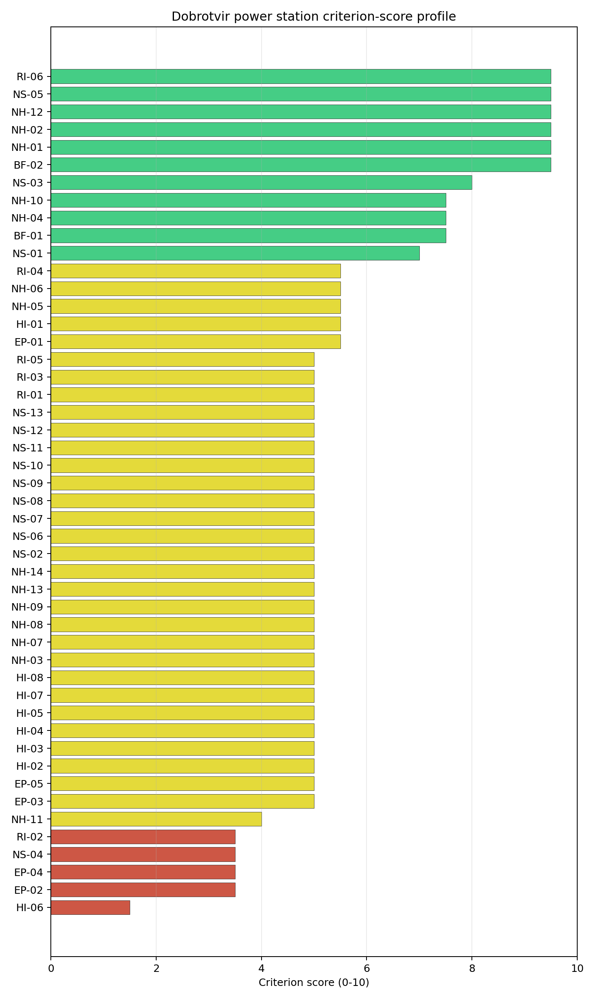
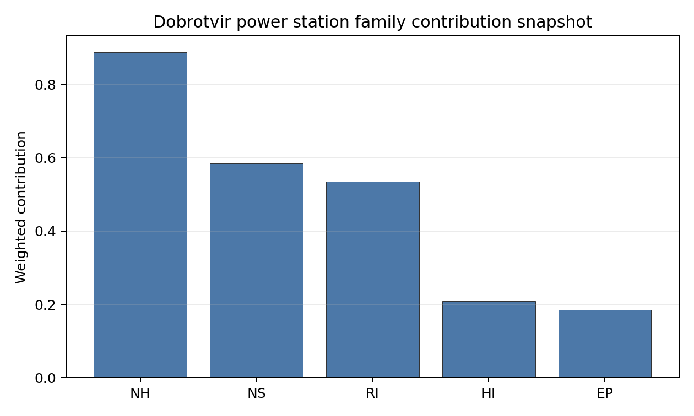

# Dobrotvir power station Site Profile

> **Note on War Context (Ukraine)** — This site profile is presented as a **desk-study screening read only**, under explicit conflict and occupied-territory caveats. Dobrotvir sits in the Lviv oblast of far-western Ukraine, ~70 km from the Ukrainian-Polish border on the Western Bug river (the EU external border with Poland), and although the immediate region has been less directly affected by frontline ground combat than the Kharkiv- and Vinnytsia-oblast sites, the wider Ukrainian energy grid has been a documented target of Russian missile and drone strikes throughout 2022– (the DTEK Dobrotvir complex has been mothballed since the early 2010s for economic reasons, with 4 units mothballed and 1 cancelled). The screening cadastre reflects pre-war or partially updated infrastructure conditions and does not capture current war damage, regulator-access status, emergency-planning continuity, or workforce-availability impacts. Per the [Ukraine occupied-territory caveat plan](../02_ukraine_occupied_territory_caveat_plan.md), **Ukraine includes several high-performing screening records but the current war context prevents these records from being treated as practical near-term progression candidates**; detailed Ukrainian site profiles should be deferred to a post-war review.

Dobrotvir power station is a coal/thermal site in Ukraine that has been tested against the NuScale VOYGR-6 reference deployment envelope. This profile reads the screening evidence at a level that supports a decision to progress toward Stage 3 characterization. It is not a site-suitability determination, vendor recommendation, or licensing finding.

## Site Snapshot

| Field | Value |
| --- | --- |
| Site name | Dobrotvir power station |
| Coordinates | 50.2143, 24.3747 |
| Subnational unit | Lviv |
| Installed thermal capacity (source data) | 1,110 MW |
| Composite score (baseline weights) | 5.989 (4.198-6.396 MC band) |
| National stability band | D (top-10% hit rate 31%) |
| National rank | 2 |

_See the country status map in_ [Ukraine Country Profile](../UA_country_prototype.md#country-status-map).

## Ownership and Coal-to-Nuclear Context

- **DTEK Group BV** (nan% share), headquartered in Netherlands; immediate operator DTEK Westenergy JSC. Path: DTEK Group BV -> DTEK Energy Holdings BV [100.0%] -> DTEK Energy BV [unknown %] -> DTEK Westenergy JSC [100.0%] -> Dobrotvir power station Unit 5 [100.0%]
- **DTEK Energy Holdings BV** (nan% share), headquartered in Netherlands; immediate operator DTEK Westenergy JSC. Path: DTEK Energy Holdings BV -> DTEK Energy BV [unknown %] -> DTEK Westenergy JSC [100.0%] -> Dobrotvir power station Unit 5 [100.0%]
- **DTEK Energy BV** (100.00% share), headquartered in Netherlands; immediate operator DTEK Westenergy JSC. Path: DTEK Energy BV -> DTEK Westenergy JSC [100.0%] -> Dobrotvir power station Unit 5 [100.0%]
- **natural person(s)** (nan% share); immediate operator DTEK Westenergy JSC. Path: natural person(s)  -> System Capital Management Ltd [unknown %] -> DTEK Group BV [100.0%] -> DTEK Energy Holdings BV [100.0%] -> DTEK Energy BV [unknown %] -> DTEK Westenergy JSC [100.0%] -> Dobrotvir power station Unit 5 [100.0%]
- **System Capital Management Ltd** (nan% share), headquartered in Cyprus; immediate operator DTEK Westenergy JSC. Path: System Capital Management Ltd -> DTEK Group BV [100.0%] -> DTEK Energy Holdings BV [100.0%] -> DTEK Energy BV [unknown %] -> DTEK Westenergy JSC [100.0%] -> Dobrotvir power station Unit 5 [100.0%]

Generating units on record: 1 cancelled, 4 mothballed.
Earliest unit commissioning: 1960; most recent: 1964.

## Natural Hazards (NH)

- **Seismic: Ground Motion (NH-01)** - score 9.5/10 (MC 9.0-10.0), weight 0.0396, data quality high. Evidence: PGA at 475-year return period 0.018 g; PGA at 2,475-year return period 0.065 g; Vs30 reference (m/s): 760.0.
- **Seismic: Surface Rupture (NH-02)** - score 9.5/10 (MC 9.0-10.0), weight n/a, data quality screening grade. Evidence: nearest mapped capable fault 50.0 km; fault slip rate 0 mm/yr; fault name: none_in_search_radius.
- **Geotechnical: Liquefaction (NH-03)** - score 5.0/10 (MC 5.0-5.0), weight n/a, data quality medium. Evidence: liquefaction susceptibility: high; dominant soil type: loam.
- **Geotechnical: Slope Stability (NH-04)** - score 7.5/10 (MC 7.0-8.0), weight n/a, data quality screening grade. Evidence: site slope 8.32 deg; max slope in 1 km box 82.4 deg; slope stability class: moderate.
- **Geotechnical: Subsidence (NH-05)** - score 5.5/10 (MC 5.0-6.0), weight 0.0308, data quality medium. Evidence: karst present: no; karst severity: moderate; formation type: carbonate (Continuous carbonate rocks).
- **Geotechnical: Foundation (NH-06)** - score 5.5/10 (MC 5.0-6.0), weight 0.0220, data quality medium. Evidence: bearing capacity 80.7 kPa; depth to bedrock 16.0 m.
- **Volcanism (NH-07)** - score 5.0/10 (MC 5.0-5.0), weight n/a, data quality high. Evidence: volcanic hazard class: negligible.
- **Coastal Flooding (NH-08)** - score 5.0/10 (MC 5.0-5.0), weight 0.0264, data quality low. Evidence: values not in measurement tables.
- **River Flooding (NH-09)** - score 5.0/10 (MC 5.0-5.0), weight 0.0352, data quality insufficient. Evidence: flood zone class: negligible.
- **Extreme Winds (NH-10)** - score 7.5/10 (MC 7.0-8.0), weight n/a, data quality medium. Evidence: design wind speed 10.3 m/s.
- **Extreme Precipitation (NH-11)** - score 4.0/10 (MC 4.0-4.0), weight 0.0132, data quality medium. Evidence: extreme daily precipitation 0.23 mm; mean annual precipitation 24.9 mm/yr.
- **Extreme Temperatures (NH-12)** - score 9.5/10 (MC 9.0-10.0), weight 0.0176, data quality medium. Evidence: extreme high temperature 22.5 deg C; extreme low temperature -8.67 deg C.
- **Forest/Wildfire (NH-13)** - score 5.0/10 (MC 5.0-5.0), weight 0.0132, data quality n/a. Evidence: values not in measurement tables.
- **Combined Hazards (NH-14)** - score 5.0/10 (MC 5.0-5.0), weight 0.0132, data quality n/a. Evidence: values not in measurement tables.

### Interpretation - Natural Hazards (NH)

<!-- specialist key=family_natural_hazards scope=site site_id=5ed0a674-a292-44bc-997f-5c1990da1235 bundle=UA_dobrotvir_power_station_site_bundle.json status=filled by=cursor-agent filled_at=2026-05-03T18:55:50Z -->
**Note: this is a desk-study screening read under war-context caveats — see the [Ukraine caveat plan](../02_ukraine_occupied_territory_caveat_plan.md).** Natural hazards at Dobrotvir sit in the structurally aseismic Ukrainian-Shield Volyn-Podolian envelope on the Western Bug-river right bank at 209 m elevation, with the principal natural-hazard finding the substantive NH-05 carbonate-karst caution on the Continuous-carbonate-rock formation context. **NH-01 Seismic: Ground Motion at 9.5/10** carries a 475-yr PGA of just **0.018 g** and a 2,475-yr PGA of just **0.065 g** — essentially identical to Ladyzhyn's exceptional read on the Ukrainian-Shield aseismic context (the Volyn-Podolian Plateau and the wider far-western-Ukrainian sub-region share the structurally stable Precambrian crystalline basement of the Ukrainian Shield). **NH-02 Seismic: Surface Rupture at 9.5/10** carries no mapped capable fault inside the 50 km screening search radius — a clean fault-stand-off envelope. **NH-04 Geotechnical: Slope Stability at 7.5/10** carries a mean site slope of **8.32°** with a maximum slope of 82.4° on a `moderate` slope-stability class — the immediate buildable terrace on the Western Bug right bank is gentle but the wider 1 km box captures the steeper Volyn-Podolian-plateau valley flanks. **NH-03 Geotechnical: Liquefaction at 5.0/10** carries a `high` susceptibility read on a loam profile — the Western-Bug-valley alluvial sediments are moderately fine-grained, although the structurally aseismic NH-01 envelope reduces the foundation-loading concern. **NH-05 Geotechnical: Subsidence at 5.5/10** is the substantive NH finding: the screening cadastre carries `karst not present` but classifies the formation type as **Continuous carbonate rocks** with `moderate` karst severity — the wider Volyn-Podolian Plateau is a classical Carpathian-foreland carbonate-karst context with documented sinkhole and subsidence hazards in adjacent regions (the Krzemieniec / Kremenets and Pochaiv areas have substantial karst features, and the Lviv-Volyn coal-basin carbonate sub-stratum is karstified at depth). The Stage 3 work will need a substantive site-specific geophysical survey (electrical resistivity tomography, ground-penetrating radar, dedicated piezometer network) to characterise the karst envelope and the subsidence-formation hazard against the SMR foundation envelope. NH-06 reads 5.5/10 on a 80.7 kPa screening-proxy bearing capacity over **just 16.0 m to bedrock** — the shallowest bedrock signature of the Ukrainian portfolio (a structurally favourable foundation envelope, with the Precambrian crystalline basement at relatively shallow depth). NH-07 reads 5.0/10 (`negligible` volcanic hazard); NH-08 (209 m site elevation removes the coastal-flooding case); NH-09 carries an `insufficient` data-quality verdict — the Western Bug-river flood-hazard envelope is a Stage 3 priority and requires explicit characterisation given the cross-border Polish-Ukrainian Bug-basin context. Extreme meteorology is moderate: a 50-yr design wind of **10.3 m/s** (the highest of the Ukrainian portfolio, reflecting the elevated Volyn-Podolian-plateau context) and an extreme temperature range of -8.67 °C to 22.5 °C (NH-10 at 7.5/10 and NH-12 at 9.5/10). NH-11 sits at 4.0/10 on the screening proxy. The Stage 3 priority order — under post-war conditions only — would therefore be: commission a substantive site-specific geophysical and hydrogeological survey of the Volyn-Podolian carbonate-karst context so NH-05 settles on a measured subsidence-and-sinkhole envelope (this is the binding natural-hazard question for the site, given the Continuous-carbonate-rock formation classification and the regional karst precedents); commission a project-specific PSHA on measured Vs30 against the Ukrainian-Shield aseismic source-zone catalogue to confirm the exceptionally favourable 0.065 g screening read; commission the cross-border Polish-Ukrainian Bug-basin flood-hazard study with explicit attention to the Polish Bug-basin reference events; and commission a CPT and dynamic-soil-structure-interaction study against the NH-03 `high` liquefaction read.
<!-- /specialist key=family_natural_hazards -->

## Human-Induced and Security-Relevant Hazards (HI)

- **Aircraft Crash (HI-01)** - score 5.5/10 (MC 5.0-6.0), weight 0.0308, data quality high. Evidence: nearest airport 29.7 km; nearest flight path 14.8 km; airports within search radius 1; airport name: Zhalizhnia; airport type: small_airport.
- **Industrial Explosions (HI-02)** - score 5.0/10 (MC 5.0-5.0), weight 0.0308, data quality screening grade. Evidence: values not in measurement tables.
- **Toxic/Gas Releases (HI-03)** - score 5.0/10 (MC 5.0-5.0), weight 0.0308, data quality screening grade. Evidence: values not in measurement tables.
- **External Fires (HI-04)** - score 5.0/10 (MC 5.0-5.0), weight 0.0264, data quality screening grade. Evidence: values not in measurement tables.
- **Transport Hazards (HI-05)** - score 5.0/10 (MC 5.0-5.0), weight 0.0264, data quality n/a. Evidence: values not in measurement tables.
- **Military Installations (HI-06)** - score 1.5/10 (MC 1.0-2.0), weight 0.0264, data quality medium. Evidence: nearest military installation 12.8 km; military installations within radius 2.
- **Electromagnetic Interference (HI-07)** - score 5.0/10 (MC 5.0-5.0), weight 0.0088, data quality medium. Evidence: nearest high-power transmitter 0.24 km; transmitters within radius 89; transmitter type: communication.
- **Other Nuclear Installations (HI-08)** - score 5.0/10 (MC 5.0-5.0), weight 0.0132, data quality n/a. Evidence: values not in measurement tables.

### Interpretation - Human-Induced and Security-Relevant Hazards (HI)

<!-- specialist key=family_human_hazards scope=site site_id=5ed0a674-a292-44bc-997f-5c1990da1235 bundle=UA_dobrotvir_power_station_site_bundle.json status=filled by=cursor-agent filled_at=2026-05-03T18:55:50Z -->
**Note: this is a desk-study screening read under war-context caveats — see the [Ukraine caveat plan](../02_ukraine_occupied_territory_caveat_plan.md). The HI envelope is materially affected by the ongoing Russia-Ukraine war and the cross-border position with Poland (an EU and NATO member state).** The pre-war HI envelope at Dobrotvir is dominated by the **HI-06 1.5/10 score** for the Volyn-Podolian / Lviv-oblast cross-border military estate. **HI-06 Military Installations at 1.5/10** is the principal HI screening flag: the nearest military feature reads at **12.8 km from the site** with **2 features inside the 25 km screening radius** on `medium` data quality — the screening cadastre captures the wider Lviv-oblast military estate at moderate distance. The **war-context** is significant: the Lviv-oblast region has been the principal Ukrainian Armed Forces' western-Ukrainian logistics, training, and reception corridor since 2022 (with substantial Yavoriv, Starychi, and other training-area expansions), and the wider region has been a documented target of Russian missile and drone strikes against logistics infrastructure. The cross-border position with NATO Poland (~70 km to the EU external border) introduces additional NATO-side military-cadastre considerations: the Polish 21st Podhale Rifles Brigade and the 25th Air Cavalry Brigade are based in eastern Poland with substantial cross-border operational exposure. The Stage 3 work would need a substantive Ukrainian Ministry of Defence cadastre engagement after the war, and a parallel NATO-side cadastre engagement with the Polish Ministry of National Defence. **HI-01 Aircraft Crash at 5.5/10** carries the **Zhalizhnia airfield (`small_airport`) at 29.7 km from the site** with the nearest flight-path projection at **14.8 km** and **1 air feature inside the 30 km search radius** — moderate. The wider Lviv-oblast civil-aviation context includes Lviv International Airport at ~75 km outside the 30 km screening radius. **HI-02 Industrial Explosions, HI-03 Toxic / Gas Releases, HI-04 External Fires** all sit at the pass-mark default of 5.0/10 on `screening grade` data quality (the wider Chervonohrad / Lviv-Volyn coal-basin industrial corridor includes coal-mining, coking, and chemical facilities that the Stage 3 cadastre run will need to characterise). **HI-05 Transport Hazards** holds at 5.0/10 — the M-09 / M-10 highway corridors and the Lviv-Kyiv rail corridor pass through the wider region. HI-07 reads 5.0/10 with the nearest broadcast feature at 0.24 km (a communication mast inside the existing thermal complex) and **89 transmitters inside the EMI search radius** (a moderate broadcast environment). HI-08 is null. The Stage 3 priority order — under post-war conditions only — would therefore be: commission a tripartite Ukrainian-Polish (NATO) bilateral cadastre engagement on the cross-border military estate so HI-06 settles on a defensible measured value for both sides of the EU external border (the cross-border NATO context is structurally different from the Vojany I tripartite Slovak-Hungarian-Ukrainian context but introduces parallel diplomatic infrastructure requirements); commission an SSG-79 hazard assessment for the Zhalizhnia airfield with explicit modelling of the 14.8 km flight-path projection; commission a Stage 3 cadastre run against the historical Lviv-Volyn coal-basin industrial corridor so HI-02 to HI-05 settle on measured values; and commission an EMI envelope study against the 89-transmitter cadastre.
<!-- /specialist key=family_human_hazards -->

## Radiological Impact and Emergency Planning (RI / EP)

- **Emergency Planning Feasibility (EP-01)** - score 5.5/10 (MC 5.0-6.0), weight n/a, data quality high. Evidence: EP feasibility composite 60.9 /100; road sub-score 33.4 /100; special-population sub-score 90.0 /100; geography sub-score 95.0 /100; population sub-score 80.0 /100; evacuation feasible: yes.
- **Evacuation Routes (EP-02)** - score 3.5/10 (MC 3.0-4.0), weight 0.0264, data quality medium. Evidence: road density in EPZ 0.357 km/km2; road length in EPZ 701.7 km; motorway access: no.
- **Physical Geography Constraints (EP-03)** - score 5.0/10 (MC 5.0-5.0), weight 0.0220, data quality medium. Evidence: waterways crossing EPZ 0; major river barrier: no.
- **Special Populations (EP-04)** - score 3.5/10 (MC 3.0-4.0), weight 0.0264, data quality medium. Evidence: hospitals in EPZ 29; prisons in EPZ 0; care homes in EPZ 0.
- **Concurrent Hazard Impact (EP-05)** - score 5.0/10 (MC 5.0-5.0), weight 0.0176, data quality n/a. Evidence: values not in measurement tables.
- **Atmospheric Dispersion (RI-01)** - score 5.0/10 (MC 5.0-5.0), weight 0.0264, data quality medium. Evidence: annual mean wind speed 1.44 m/s; atmospheric mixing height 543.7 m; prevailing wind direction: WSW.
- **Surface Water Dispersion (RI-02)** - score 3.5/10 (MC 3.0-4.0), weight 0.0220, data quality n/a. Evidence: values not in measurement tables.
- **Groundwater Dispersion (RI-03)** - score 5.0/10 (MC 5.0-5.0), weight 0.0220, data quality medium. Evidence: aquifer type: alluvial.
- **Population Density at EPZ Radii (RI-04)** - score 5.5/10 (MC 5.0-6.0), weight 0.0352, data quality screening grade. Evidence: population density within 5 km 109.3 /km2; population density within 16 km 61.5 /km2; population density within 25 km 93.4 /km2; population density within 80 km 102.8 /km2; population within 25 km 183,350 people.
- **Distance to Population Centres (RI-05)** - score 5.0/10 (MC 5.0-5.0), weight 0.0441, data quality screening grade. Evidence: nearest city above 50k people 97.0 km; nearest city population 58,231 people; city name: Zamość.
- **Population Projections (RI-06)** - score 9.5/10 (MC 9.0-10.0), weight 0.0220, data quality screening grade. Evidence: annual population growth rate -1.218 %/yr; projected population at 25 km in 60 yr 109,767 people.

### Interpretation - Radiological Impact and Emergency Planning (RI / EP)

<!-- specialist key=family_radiological_emergency scope=site site_id=5ed0a674-a292-44bc-997f-5c1990da1235 bundle=UA_dobrotvir_power_station_site_bundle.json status=filled by=cursor-agent filled_at=2026-05-03T18:55:50Z -->
**Note: this is a desk-study screening read under war-context caveats — see the [Ukraine caveat plan](../02_ukraine_occupied_territory_caveat_plan.md). The EP envelope is materially affected by the ongoing Russia-Ukraine war and the cross-border position with Poland (the screening cadastre captures Polish healthcare-estate spillover into the EPZ).** The pre-war RI / EP envelope at Dobrotvir carries two binding cautions on EP-02 evacuation routes and EP-04 special populations, both partly driven by the cross-border position with Poland. The DRV-02 emergency-planning composite reads **60.9/100 with `evacuation feasible: yes`**, supported by sub-scores on geography (95/100), special populations (90/100), and population (80/100), with a road sub-score of 33.4/100. **EP-02 Evacuation Routes at 3.5/10** reads on a road density of **0.357 km/km² inside the 16 km EPZ** with **701.7 km of road length** and **`motorway access: no`** — the second no-motorway-access read of the Ukrainian portfolio (after Zmiivska's 1.5/10) and constrains the cross-EPZ evacuation logistics, with the cross-border discontinuity at the Western Bug river / Polish-Ukrainian border further restricting evacuation corridors towards the EU side. **EP-04 Special Populations at 3.5/10** is the second binding caution: **29 hospitals inside the 16 km EPZ** with no prisons or care homes — the second-highest hospital count of the first-batch cohort after Vojany I's cross-border 36, reflecting the cross-border Polish-Ukrainian healthcare-estate spillover into the EPZ (the Polish side of the EPZ envelope captures Tomaszów Lubelski and the wider Roztocze-area healthcare facilities, as well as the Ukrainian Chervonohrad and Sokal regional hospitals on the Ukrainian side). The cross-border emergency-planning matrix at Dobrotvir would require Polish-Ukrainian bilateral or trilateral coordination, complicated by the Polish-Ukrainian border-crossing capacity context. Population context is moderate-to-favourable: **5 km density 109.3 p/km², 16 km 61.5 p/km², 25 km 93.4 p/km², 80 km 102.8 p/km²** on a 25 km cumulative population of **183,350 people** — RI-04 reads 5.5/10. The **nearest city above 50k people is Zamość at 97.0 km on the Polish side with a population of 58,231** — a substantively favourable distance, but the wider cross-border conurbation on the Polish side includes the Roztocze National Park environs and the Polish-Ukrainian border area is an EU external-border infrastructure corridor. **RI-06 Population Projections at 9.5/10** carries a 60-yr projection at 25 km of **109,767 people on a -1.218 %/yr growth track** — a strong demographic-tailwind read consistent with the wider far-western-Ukrainian and eastern-Polish demographic decline. **RI-02 Surface Water Dispersion at 3.5/10** is the third binding RI finding: the cooling source is the **Western Bug (Zakhidnyi Buh) at 14.4 m³/s flow, see NS-01** — a moderate-to-low flow river, particularly compared to Ladyzhyn's Southern Bug at 44.5 m³/s, providing only limited dilution capacity for routine liquid effluent. The atmospheric envelope is moderate: **1.44 m/s annual mean wind speed** with a **543.7 m mixing height** and a **WSW prevailing direction** (towards the Polish-Ukrainian border and the wider Polish Lublin / Roztocze region — a structurally cross-border radiological direction that requires Polish-Ukrainian bilateral characterisation, with the prevailing-wind transport carrying any release across the EU external border into Poland); RI-01 sits at 5.0/10. RI-03 reads 5.0/10 on an alluvial aquifer (the Western-Bug-valley alluvial system, with potential vertical connectivity into the underlying carbonate-karst basement that NH-05 flagged). RI-05 reads 5.0/10 on `screening grade`. EP-03 reads 5.0/10 (no major river barrier inside the EPZ — the Western Bug runs through the EPZ but is not classified as a major barrier). EP-05 sits at 5.0/10. The Stage 3 priority order — under post-war conditions only — would therefore be: commission a substantial 16 km EPZ road-network upgrade plan and motorway-access programme with the Ukrainian Ministry of Infrastructure to lift EP-02 off the binding caution; commission a Polish-Ukrainian bilateral emergency-planning matrix with explicit attention to the 29 hospitals and the cross-border healthcare-estate context (engagement with both Ukrainian Lviv-oblast authorities and Polish Lublin-voivodeship authorities); commission a Stage 3 surface-water dispersion model on the Western Bug at 14.4 m³/s with explicit attention to the cross-border Polish-Ukrainian Bug-basin water-management context; commission the project-specific micro-meteorological station so RI-01 settles on a measured wind rose against the cross-border WSW prevailing direction; and commission the Stage 3 hydrogeological survey on the alluvial-and-karst aquifer system.
<!-- /specialist key=family_radiological_emergency -->

## Non-Safety and Implementation Considerations (NS)

- **Grid Capacity Basic Filter (BF-01)** - score 7.5/10 (MC 7.0-8.0), weight 0.0352, data quality n/a. Evidence: values not in measurement tables.
- **Land Area Basic Filter (BF-02)** - score 9.5/10 (MC 9.0-10.0), weight 0.0220, data quality n/a. Evidence: values not in measurement tables.
- **Cooling Water Availability (NS-01)** - score 7.0/10 (MC 6.0-7.0), weight n/a, data quality screening grade. Evidence: distance to cooling source 1.06 km; cooling source flow 14.4 m3/s; cooling source type: river; cooling source name: Zakhidnyi Buh; water stress label: Low.
- **Grid Connection (NS-02)** - score 5.0/10 (MC 5.0-5.0), weight 0.0352, data quality insufficient. Evidence: nearest substation 0.24 km; nearest high-voltage line 0.27 km; grid export capacity 1,110 MW; substations within radius 428; HV lines within radius 536.
- **Transport Access (NS-03)** - score 8.0/10 (MC 7.0-8.0), weight 0.0352, data quality high. Evidence: nearest highway 7.04 km; nearest rail line 0.05 km; heavy-haul capable: yes.
- **Site Topography (NS-04)** - score 3.5/10 (MC 3.0-4.0), weight 0.0264, data quality medium. Evidence: favourable land cover 35.7 %; moderate land cover 32.3 %; unfavourable land cover 32.0 %; favourable area 77.4 ha; dominant land class: 321.
- **Site Footprint Adequacy (NS-05)** - score 9.5/10 (MC 9.0-10.0), weight 0.0220, data quality screening grade. Evidence: buildable area 215.1 ha; largest contiguous patch 829.1 ha; buildable patch count 7.
- **Existing Infrastructure (NS-06)** - score 5.0/10 (MC 5.0-5.0), weight 0.0220, data quality n/a. Evidence: values not in measurement tables.
- **Environmental Impact (non-rad) (NS-07)** - score 5.0/10 (MC 5.0-5.0), weight 0.0220, data quality n/a. Evidence: values not in measurement tables.
- **Ecological Sensitivity (NS-08)** - score 5.0/10 (MC 5.0-5.0), weight n/a, data quality insufficient. Evidence: natural land cover 32.0 %; distance to nearest protected area 0.634 km; Natura 2000 sensitivity class: unknown; protected-area overlap: no; protected-area sensitivity class: high; Natura 2000 sites within 5 km: 0; nearest protected-area designation: Emerald Network.
- **Socioeconomic Impact (NS-09)** - score 5.0/10 (MC 5.0-5.0), weight 0.0220, data quality n/a. Evidence: values not in measurement tables.
- **Workforce Availability (NS-10)** - score 5.0/10 (MC 5.0-5.0), weight 0.0176, data quality n/a. Evidence: values not in measurement tables.
- **Coal-to-Nuclear Synergies (NS-11)** - score 5.0/10 (MC 5.0-5.0), weight 0.0264, data quality n/a. Evidence: values not in measurement tables.
- **Regulatory/Political Environment (NS-12)** - score 5.0/10 (MC 5.0-5.0), weight 0.0264, data quality n/a. Evidence: values not in measurement tables.
- **Construction Logistics (NS-13)** - score 5.0/10 (MC 5.0-5.0), weight 0.0176, data quality n/a. Evidence: values not in measurement tables.

### Interpretation - Non-Safety and Implementation Considerations (NS)

<!-- specialist key=family_infrastructure scope=site site_id=5ed0a674-a292-44bc-997f-5c1990da1235 bundle=UA_dobrotvir_power_station_site_bundle.json status=filled by=cursor-agent filled_at=2026-05-03T18:55:50Z -->
**Note: this is a desk-study screening read under war-context caveats — see the [Ukraine caveat plan](../02_ukraine_occupied_territory_caveat_plan.md). The Dobrotvir thermal complex has been mothballed since the early 2010s for economic reasons; the screening cadastre reflects the historical 1,110 MW envelope rather than current operational status.** The pre-war NS envelope at Dobrotvir reads as a strong brownfield candidate — the 1,110 MW historical thermal complex (4 mothballed units, 1 cancelled, commissioned 1960–1964) and the dedicated Western-Bug cooling envelope provide a substantial brownfield-inheritance asset, although the long-mothballed status (well before the 2022 war) means the operational continuity questions are different from those at Zmiivska or Ladyzhyn. **NS-05 Site Footprint Adequacy at 9.5/10** carries an exceptional **215.1 ha buildable area as the largest contiguous patch of 829.1 ha** across 7 patches — the largest single-patch buildable footprint of the Ukrainian portfolio and one of the largest of the first-batch cohort (Konya Karapınar 1,235 ha, Zmiivska 625 ha, Ladyzhyn 130 ha). The buildable footprint comfortably accommodates the multi-module SMR deployment envelope with substantial headroom. **NS-04 Site Topography at 3.5/10** is the binding NS finding: the screening cadastre reads **35.7% favourable, 32.3% moderate, and 32.0% unfavourable** on **77.4 ha of favourable area** in the wider site environs, with the dominant land class `321` (natural grasslands / sclerophyllous Volyn-Podolian landscape) — the screening 3.5/10 score reflects the wider envelope rather than the immediate buildable patch (the strong NS-05 read confirms the buildable patch is favourable). **NS-02 Grid Connection at 5.0/10** carries the nearest substation at **0.24 km** from the site and the nearest high-voltage line at **0.27 km**, with the **screening cadastre missing the highest-nearby-line voltage** and a measured **grid export capacity of 1,110 MW** matching the historical thermal-block envelope, with **428 substations and 536 HV lines inside the search radius** on `insufficient` data quality — the highest substation and HV-line counts of the Ukrainian portfolio (reflecting the dense Lviv-oblast Ukrenergo cadastre and the cross-border Polish-Ukrainian transmission infrastructure). The grid-export envelope is generous but the missing voltage value in the screening cadastre is a substantive Stage 3 question — pre-war Dobrotvir was on the Ukrenergo 220 / 330 kV western-Ukrainian backbone with cross-border connections to the Polish PSE grid (which has historically traded electricity through the Khmelnytskyi-Rzeszów cross-border line ~80 km south, and would be a substantial post-war ENTSO-E synchronisation-and-trading asset). **NS-03 Transport Access at 8.0/10** reads on a `high` data quality with the nearest highway at **7.04 km**, the nearest **rail line at 0.05 km** (essentially adjacent — the Lviv-Volyn coal-basin rail spur passes through the existing thermal complex), and **heavy-haul capable: yes** — strong rail-and-highway logistics envelope. **NS-01 Cooling Water Availability at 7.0/10** carries cooling water from the **Western Bug (Zakhidnyi Buh) at 1.06 km** with a measured flow of **14.4 m³/s** on a `Low` water-stress label — adequate but moderate cooling envelope (substantially smaller flow than Zmiivska's Pechenizhske Reservoir at 55.1 m³/s or Ladyzhyn's Southern Bug at 44.5 m³/s, reflecting the upper-Bug-basin context). **NS-08 Ecological Sensitivity at 5.0/10** carries `insufficient` data quality with the nearest protected area at **0.634 km on the Emerald Network designation** with a `high` protected-area sensitivity class — a substantive ecological constraint at very close range, comparable to Zmiivska's 0.442 km and Ladyzhyn's 0.36 km Emerald-Network proximities (the Ukrainian Emerald Network coverage on the Western Bug corridor and the wider Volyn-Podolian sub-region is dense and includes the cross-border Polish-Ukrainian Bug Park ecological corridor). **BF-01 Grid Capacity Basic Filter at 7.5/10 and BF-02 Land Area Basic Filter at 9.5/10** confirm the basic filters. NS-06, NS-07, NS-09 to NS-13 sit at the pass-mark default of 5.0/10. The Stage 3 priority order — under post-war conditions only — would therefore be: commission a Stage 3 grid-cadastre survey to confirm the Ukrenergo 220 / 330 kV transmission tier and the cross-border Polish PSE connection capacity (the cross-border grid-trading asset is a substantial brownfield-inheritance economic case, particularly in the post-2022 ENTSO-E synchronisation context); commission an Emerald-Network appropriate-assessment framework against the 0.634 km protected-area context with explicit attention to the cross-border Polish-Ukrainian Bug Park ecological corridor; commission a multi-year hydrological survey on the Western Bug under climate-projected dry-summer conditions with explicit cross-border Polish-Ukrainian water-management coordination; commission a structural-and-functional condition assessment of the long-mothballed Dobrotvir brownfield assets; and engage the Ukrainian Ministry of Energy and DTEK on the post-war brownfield-inheritance economic case.
<!-- /specialist key=family_infrastructure -->

## Composite Score and Stability

Baseline composite score is 5.989, bracketed by Monte Carlo at 4.198-6.396. National stability band is `D` with a top-10% hit rate of 31% across 16 scored Monte Carlo scenarios.

<!-- specialist key=stability scope=site site_id=5ed0a674-a292-44bc-997f-5c1990da1235 bundle=UA_dobrotvir_power_station_site_bundle.json status=filled by=cursor-agent filled_at=2026-05-03T18:55:50Z -->
**Note: this is a desk-study screening read under war-context caveats — see the [Ukraine caveat plan](../02_ukraine_occupied_territory_caveat_plan.md). The composite score reflects pre-war infrastructure conditions and is not a near-term progression recommendation.** Dobrotvir's pre-war composite of **5.989 (Monte Carlo 4.198–6.396)** matches Ladyzhyn's composite to three decimal places coincidentally, but the stability profile is structurally weaker: the **national stability band is `D`** with a top-10% hit rate of just **31% across 16 scored Monte Carlo scenarios** and a top-5% rate of **12%** — the score is structurally borderline under most explored Monte Carlo perturbations, with the upper-band positioning sensitive to the criterion-weight choices. The **regional stability band is `C`** with a top-10% hit rate of **56%** — moderate regional stability. The composite is anchored by NH-01 seismic ground motion (contribution 0.376 from the exceptional 9.5/10 score on the Ukrainian-Shield aseismic 0.065 g read — identical to Ladyzhyn's anchor), NS-03 transport access (0.282), BF-01 grid capacity basic filter (0.264), RI-05 distance to population centres (0.221), BF-02 land area (0.209), and NS-05 site footprint adequacy (0.209 from the 829 ha contiguous patch — the largest of the Ukrainian portfolio). The drag features are **HI-06 Military Installations (1.5/10 — cross-border Polish-Ukrainian military estate)**, **EP-02 Evacuation Routes (3.5/10 — no motorway access on rural Lviv-oblast network)**, **EP-04 Special Populations (3.5/10 — 29 hospitals from cross-border Polish-Ukrainian healthcare-estate spillover)**, **NS-04 Site Topography (3.5/10 — wider envelope land-cover artefact)**, and **RI-02 Surface Water Dispersion (3.5/10 — moderate Western Bug 14.4 m³/s flow)**. The pre-war plain-English read is that **Dobrotvir is a structurally borderline-strong Ukrainian SMR candidate with a strong cross-border / EU external border regulatory and operational dimension** — the exceptional Ukrainian-Shield seismic envelope (PGA 0.065 g — matching Ladyzhyn), the 829 ha contiguous buildable patch (the largest of the Ukrainian portfolio), the dedicated 1,110 MW thermal-block grid-export envelope with cross-border Polish PSE connection capacity, the rail-and-highway logistics envelope, the long-mothballed brownfield context (well before the 2022 war), and the favourable demographic-tailwind read (-1.218 %/yr depopulation) together make a substantive cross-border SMR portfolio case. The **borderline national stability band (D, top-10% hit rate 31%)** is a substantive caveat — Dobrotvir does not move into the unambiguous national top tier under most explored Monte Carlo perturbations and is sensitive to the weighting of the cross-border EP and HI cautions (which the screening cadastre may also be over-weighting given the cross-border healthcare-estate spillover). **War-context plain-English read**: under the current Russia-Ukraine war the site is **less directly affected by frontline ground combat than Zmiivska or Ladyzhyn** — the Lviv-oblast region has been the principal western-Ukrainian logistics, training, and reception corridor since 2022 with substantial NATO-side material and personnel flows but limited direct physical damage to the Dobrotvir thermal complex itself (which has been long-mothballed for economic reasons). However, the wider Ukrainian energy grid has been a documented target throughout 2022– and the cross-border Polish-Ukrainian regulatory and operational dimension introduces additional Stage 3 questions. **Recommendation**: retain Dobrotvir on the analytical Ukrainian long-list as a moderate-strength pre-war screening candidate with a cross-border European integration dimension (the cross-border Polish PSE connection and the EU external-border location offer a substantive post-war ENTSO-E-integration economic case) but **do not progress to detailed Stage 3 planning under current conditions**; defer the candidate-pool decision to a post-war review against the [Ukraine caveat plan](../02_ukraine_occupied_territory_caveat_plan.md) framework. Of the three Ukrainian sites profiled in this batch, the relative ranking is Zmiivska (composite 6.086, national B, top-10% 94%) > Ladyzhyn (composite 5.989, national B, top-10% 100%, the structurally cleanest seismic envelope) > Dobrotvir (composite 5.989, national D, top-10% 31%, cross-border European candidate with borderline stability).
<!-- /specialist key=stability -->

## Residual Risk Register

<!-- specialist key=residual_risk scope=site site_id=5ed0a674-a292-44bc-997f-5c1990da1235 bundle=UA_dobrotvir_power_station_site_bundle.json status=filled by=cursor-agent filled_at=2026-05-03T18:55:51Z -->
| Criterion | Description | Owner | Resolution path |
| --- | --- | --- | --- |
| War context (overarching) | Less direct frontline impact than Zmiivska / Ladyzhyn but wider Ukrainian energy grid affected by 2022– strikes; long-mothballed since early 2010s. | Project Programme | Defer detailed Stage 3 progression to post-conflict review per [Ukraine caveat plan](../02_ukraine_occupied_territory_caveat_plan.md). |
| Cross-border position (Poland / NATO / EU external border) | Site at ~70 km from EU external border with NATO Poland; cross-border Polish-Ukrainian regulatory, military, healthcare, and ecological coordination required. | Project Programme / Diplomatic | Bilateral Polish-Ukrainian engagement framework covering EP, HI, NS-08, NS-02 cross-border dimensions; potential ENTSO-E synchronisation case for grid trading. |
| NH-05 Carbonate-karst (Volyn-Podolian Plateau) | Continuous carbonate rocks formation classification with `moderate` karst severity; regional Krzemieniec / Pochaiv karst precedents. | Geotechnical | Substantive site-specific geophysical and hydrogeological survey (electrical resistivity tomography, ground-penetrating radar, dedicated piezometer network). |
| EP-04 Special Populations (cross-border healthcare) | 29 hospitals inside 16 km EPZ from cross-border Polish-Ukrainian healthcare-estate spillover (Polish Tomaszów Lubelski / Roztocze + Ukrainian Chervonohrad / Sokal). | Emergency Planning | Polish-Ukrainian bilateral operational evacuation plan; engagement with Polish Lublin-voivodeship and Ukrainian Lviv-oblast authorities. |
| EP-02 Evacuation Routes | EPZ road density 0.357 km/km² with no motorway access; cross-border discontinuity at Western Bug river. | Emergency Planning | Substantial 16 km EPZ road-network upgrade plan with Ukrainian Ministry of Infrastructure; cross-border crossing-capacity assessment. |
| HI-06 Cross-border Military Cadastre | 2 features inside 25 km on `medium` quality; western-Ukrainian logistics and training corridor expanded post-2022; NATO-side estate also relevant. | Security/Safety | Tripartite Ukrainian-Polish (NATO) bilateral cadastre engagement; Ukrainian and Polish Ministries of Defence. |
| RI-02 Surface Water Dispersion | Western Bug at 14.4 m³/s flow — moderate compared to Ladyzhyn's 44.5 m³/s; cross-border Polish-Ukrainian Bug-basin water-management context. | Radiological | Stage 3 surface-water dispersion model with explicit cross-border attention. |
| NS-08 Ecological (Emerald + cross-border Bug Park) | Ukrainian Emerald Network site at 0.634 km on `high` sensitivity; cross-border Polish-Ukrainian Bug Park ecological corridor. | Environmental | Emerald-Network appropriate-assessment framework; cross-border Polish-Ukrainian ecological coordination. |
| NS-02 Grid Connection (cross-border PSE asset) | Screening cadastre missing nearby HV voltage; pre-war Ukrenergo 220/330 kV with cross-border Polish PSE connection capacity. | Grid/Transmission | Stage 3 cadastre confirmation; engagement with Ukrenergo, PSE, and ENTSO-E on post-war synchronisation-and-trading case. |
| NH-09 Cross-border Bug-basin flooding | River flood-hazard envelope is `insufficient`; cross-border Polish-Ukrainian Bug-basin flood-hazard context. | Hydrology | Cross-border Polish-Ukrainian Bug-basin flood-hazard study with Polish reference event modelling. |
| RI-01 Cross-border WSW prevailing wind | Wind direction towards Polish Lublin / Roztocze region; routine releases would cross EU external border. | Radiological | Polish-Ukrainian bilateral atmospheric-dispersion characterisation. |
| Stability borderline (national D, top-10% 31%) | Composite stability is borderline-strong rather than unambiguous; sensitive to cross-border-EP/HI weight choices. | Project Programme | Re-evaluate composite weighting against cross-border-screening artefact context. |
<!-- /specialist key=residual_risk -->

## Stage 3 Follow-Up Checklist

- [ ] Re-measure **Military Installations (HI-06)** - native score 1.5/10 with confidence medium.
- [ ] Re-measure **Evacuation Routes (EP-02)** - native score 3.5/10 with confidence medium.
- [ ] Re-measure **Special Populations (EP-04)** - native score 3.5/10 with confidence medium.
- [ ] Re-measure **Site Topography (NS-04)** - native score 3.5/10 with confidence medium.
- [ ] Re-measure **Surface Water Dispersion (RI-02)** - native score 3.5/10 with confidence insufficient.
- [ ] Improve data quality for **Coastal Flooding (NH-08)** - current flag `low`.

## Evidence Limitations

- Coastal Flooding (NH-08) - quality `low`.
