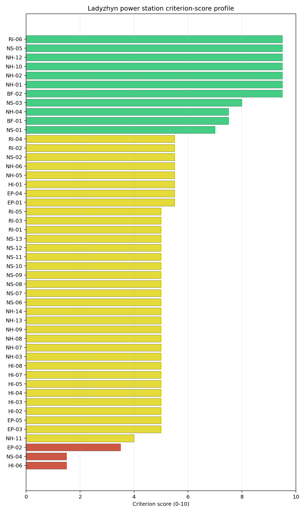
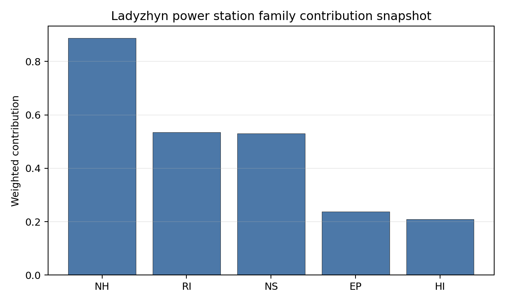

# Ladyzhyn power station Site Profile

> **Note on War Context (Ukraine)** — This site profile is presented as a **desk-study screening read only**, under explicit conflict and occupied-territory caveats. Ladyzhyn sits in the Vinnytsia oblast of central-western Ukraine, ~150 km south-west of Kyiv on the Southern Bug river, and has been a documented target of Russian missile and drone strikes during the 2022– war (the DTEK Ladyzhyn complex sustained substantial damage in October 2022 and subsequent waves; all 6 units are currently mothballed). The screening cadastre reflects pre-war or partially updated infrastructure conditions and does not capture current war damage, regulator-access status, emergency-planning continuity, or workforce-availability impacts. Per the [Ukraine occupied-territory caveat plan](../02_ukraine_occupied_territory_caveat_plan.md), **Ukraine includes several high-performing screening records but the current war context prevents these records from being treated as practical near-term progression candidates**; detailed Ukrainian site profiles should be deferred to a post-war review with updated territorial-control mapping, physical site access, regulator engagement, and infrastructure-condition evidence.

Ladyzhyn power station is a coal/thermal site in Ukraine that has been tested against the NuScale VOYGR-6 reference deployment envelope. This profile reads the screening evidence at a level that supports a decision to progress toward Stage 3 characterization. It is not a site-suitability determination, vendor recommendation, or licensing finding.

## Site Snapshot

| Field | Value |
| --- | --- |
| Site name | Ladyzhyn power station |
| Coordinates | 48.7058, 29.2187 |
| Subnational unit | Vinnytsia |
| Installed thermal capacity (source data) | 1,800 MW |
| Composite score (baseline weights) | 5.989 (4.198-6.484 MC band) |
| National stability band | B (top-10% hit rate 100%) |
| National rank | 3 |

_See the country status map in_ [Ukraine Country Profile](../UA_country_prototype.md#country-status-map).

## Ownership and Coal-to-Nuclear Context

- **DTEK Group BV** (nan% share), headquartered in Netherlands; immediate operator DTEK Westenergy JSC. Path: DTEK Group BV -> DTEK Energy Holdings BV [100.0%] -> DTEK Energy BV [unknown %] -> DTEK Westenergy JSC [100.0%] -> Ladyzhyn power station Unit 4 [100.0%]
- **DTEK Energy Holdings BV** (nan% share), headquartered in Netherlands; immediate operator DTEK Westenergy JSC. Path: DTEK Energy Holdings BV -> DTEK Energy BV [unknown %] -> DTEK Westenergy JSC [100.0%] -> Ladyzhyn power station Unit 4 [100.0%]
- **DTEK Energy BV** (100.00% share), headquartered in Netherlands; immediate operator DTEK Westenergy JSC. Path: DTEK Energy BV -> DTEK Westenergy JSC [100.0%] -> Ladyzhyn power station Unit 4 [100.0%]
- **natural person(s)** (nan% share); immediate operator DTEK Westenergy JSC. Path: natural person(s)  -> System Capital Management Ltd [unknown %] -> DTEK Group BV [100.0%] -> DTEK Energy Holdings BV [100.0%] -> DTEK Energy BV [unknown %] -> DTEK Westenergy JSC [100.0%] -> Ladyzhyn power station Unit 5 [100.0%]
- **System Capital Management Ltd** (nan% share), headquartered in Cyprus; immediate operator DTEK Westenergy JSC. Path: System Capital Management Ltd -> DTEK Group BV [100.0%] -> DTEK Energy Holdings BV [100.0%] -> DTEK Energy BV [unknown %] -> DTEK Westenergy JSC [100.0%] -> Ladyzhyn power station Unit 4 [100.0%]

Generating units on record: 6 mothballed.
Earliest unit commissioning: 1970; most recent: 1971.

## Natural Hazards (NH)

- **Seismic: Ground Motion (NH-01)** - score 9.5/10 (MC 9.0-10.0), weight 0.0396, data quality high. Evidence: PGA at 475-year return period 0.019 g; PGA at 2,475-year return period 0.065 g; Vs30 reference (m/s): 760.0.
- **Seismic: Surface Rupture (NH-02)** - score 9.5/10 (MC 9.0-10.0), weight n/a, data quality screening grade. Evidence: nearest mapped capable fault 50.0 km; fault slip rate 0 mm/yr; fault name: none_in_search_radius.
- **Geotechnical: Liquefaction (NH-03)** - score 5.0/10 (MC 5.0-5.0), weight n/a, data quality medium. Evidence: liquefaction susceptibility: very_low; dominant soil type: silty_clay_loam.
- **Geotechnical: Slope Stability (NH-04)** - score 7.5/10 (MC 7.0-8.0), weight n/a, data quality screening grade. Evidence: site slope 8.59 deg; max slope in 1 km box 84.2 deg; slope stability class: moderate.
- **Geotechnical: Subsidence (NH-05)** - score 5.5/10 (MC 5.0-6.0), weight 0.0308, data quality medium. Evidence: karst present: no; karst severity: none.
- **Geotechnical: Foundation (NH-06)** - score 5.5/10 (MC 5.0-6.0), weight 0.0220, data quality medium. Evidence: bearing capacity 84.0 kPa; depth to bedrock 28.3 m.
- **Volcanism (NH-07)** - score 5.0/10 (MC 5.0-5.0), weight n/a, data quality high. Evidence: volcanic hazard class: negligible.
- **Coastal Flooding (NH-08)** - score 5.0/10 (MC 5.0-5.0), weight 0.0264, data quality low. Evidence: values not in measurement tables.
- **River Flooding (NH-09)** - score 5.0/10 (MC 5.0-5.0), weight 0.0352, data quality medium. Evidence: flood zone class: negligible.
- **Extreme Winds (NH-10)** - score 9.5/10 (MC 9.0-10.0), weight n/a, data quality medium. Evidence: design wind speed 8.31 m/s.
- **Extreme Precipitation (NH-11)** - score 4.0/10 (MC 4.0-4.0), weight 0.0132, data quality medium. Evidence: extreme daily precipitation 0.21 mm; mean annual precipitation 20.5 mm/yr.
- **Extreme Temperatures (NH-12)** - score 9.5/10 (MC 9.0-10.0), weight 0.0176, data quality medium. Evidence: extreme high temperature 23.7 deg C; extreme low temperature -9.66 deg C.
- **Forest/Wildfire (NH-13)** - score 5.0/10 (MC 5.0-5.0), weight 0.0132, data quality n/a. Evidence: values not in measurement tables.
- **Combined Hazards (NH-14)** - score 5.0/10 (MC 5.0-5.0), weight 0.0132, data quality n/a. Evidence: values not in measurement tables.

### Interpretation - Natural Hazards (NH)

<!-- specialist key=family_natural_hazards scope=site site_id=cec871bd-c7f6-4444-b0da-9b3a9ecc6963 bundle=UA_ladyzhyn_power_station_site_bundle.json status=filled by=cursor-agent filled_at=2026-05-03T18:47:02Z -->
**Note: this is a desk-study screening read under war-context caveats — see the [Ukraine caveat plan](../02_ukraine_occupied_territory_caveat_plan.md).** Natural hazards at Ladyzhyn sit in the structurally aseismic Ukrainian-Shield Podolian Upland envelope on the Southern Bug-river right bank at 182 m elevation, with the principal natural-hazard read the exceptionally favourable NH-01 ground-motion envelope. **NH-01 Seismic: Ground Motion at 9.5/10** carries a 475-yr PGA of just **0.019 g** and a 2,475-yr PGA of just **0.065 g** — the lowest seismic loading of the entire first-batch cohort by a substantial margin (Vojany I 0.237 g, Trebišov 0.236 g, Konya Karapınar 0.314 g) and consistent with the structurally aseismic Ukrainian-Shield Precambrian crystalline basement context. The Ukrainian Shield is one of the most tectonically stable cratonic blocks in Europe, and the Vinnytsia / Podolian Upland sub-region has effectively no documented active seismicity over the historical record. **NH-02 Seismic: Surface Rupture at 9.5/10** carries no mapped capable fault inside the 50 km screening search radius — a clean fault-stand-off envelope. **NH-04 Geotechnical: Slope Stability at 7.5/10** carries a mean site slope of **8.59°** with a maximum slope of 84.2° on a `moderate` slope-stability class — the immediate site sits on the gentle right-bank terrace but the wider 1 km box captures the steeper Southern Bug-valley flanks. **NH-03 Geotechnical: Liquefaction at 5.0/10** carries a `very_low` susceptibility read on a silty-clay-loam profile — a structurally favourable foundation envelope on the Ukrainian-Shield Precambrian crystalline basement. **NH-05 Geotechnical: Subsidence at 5.5/10** carries `karst not present` and `none` severity. **NH-06 Geotechnical: Foundation at 5.5/10** reads on a 84.0 kPa screening-proxy bearing capacity over 28.3 m to bedrock — moderate but well above the soft-soil reads at Zmiivska (60.5 kPa) and the screening data-gap at Trebišov. NH-07 reads 5.0/10 (`negligible` volcanic hazard); NH-08 (182 m elevation removes the coastal-flooding case); NH-09 carries an inconclusive verdict but the Southern-Bug-river flood-hazard envelope is a Stage 3 priority — the wider Vinnytsia-oblast Southern Bug experienced major historical flooding in 1957 and 1980 and the Stage 3 work should explicitly model these reference events. Extreme meteorology is calm: a 50-yr design wind of 8.31 m/s and an extreme temperature range of -9.66 °C to 23.7 °C (NH-10 and NH-12 at 9.5/10). NH-11 sits at 4.0/10 on the screening proxy. The Stage 3 priority order — under post-war conditions only — would therefore be: commission a project-specific PSHA on measured Vs30 against the Ukrainian-Shield aseismic source-zone catalogue to confirm the exceptionally favourable 0.065 g screening read as a measured value (this is the cleanest seismic envelope of the first-batch cohort and the Ukrainian-Shield context is structurally robust to source-zone re-characterisation); commission the site-specific Southern-Bug-river flood-hazard study with explicit modelling of historical reference events and climate-projected return periods; commission a CPT campaign to confirm the favourable 84 kPa screening read; and commission a coupled dynamic-soil-structure-interaction study against the favourable NH-03 `very_low` liquefaction read. **All of these Stage 3 deliverables presuppose a post-conflict site-access regime.**
<!-- /specialist key=family_natural_hazards -->

## Human-Induced and Security-Relevant Hazards (HI)

- **Aircraft Crash (HI-01)** - score 5.5/10 (MC 5.0-6.0), weight 0.0308, data quality high. Evidence: nearest airport 15.8 km; nearest flight path 7.91 km; airports within search radius 1; airport name: Haisyn Airfield; airport type: small_airport.
- **Industrial Explosions (HI-02)** - score 5.0/10 (MC 5.0-5.0), weight 0.0308, data quality screening grade. Evidence: values not in measurement tables.
- **Toxic/Gas Releases (HI-03)** - score 5.0/10 (MC 5.0-5.0), weight 0.0308, data quality screening grade. Evidence: values not in measurement tables.
- **External Fires (HI-04)** - score 5.0/10 (MC 5.0-5.0), weight 0.0264, data quality screening grade. Evidence: values not in measurement tables.
- **Transport Hazards (HI-05)** - score 5.0/10 (MC 5.0-5.0), weight 0.0264, data quality n/a. Evidence: values not in measurement tables.
- **Military Installations (HI-06)** - score 1.5/10 (MC 1.0-2.0), weight 0.0264, data quality medium. Evidence: nearest military installation 10.6 km; military installations within radius 2.
- **Electromagnetic Interference (HI-07)** - score 5.0/10 (MC 5.0-5.0), weight 0.0088, data quality medium. Evidence: nearest high-power transmitter 0.67 km; transmitters within radius 140; transmitter type: mast.
- **Other Nuclear Installations (HI-08)** - score 5.0/10 (MC 5.0-5.0), weight 0.0132, data quality n/a. Evidence: values not in measurement tables.

### Interpretation - Human-Induced and Security-Relevant Hazards (HI)

<!-- specialist key=family_human_hazards scope=site site_id=cec871bd-c7f6-4444-b0da-9b3a9ecc6963 bundle=UA_ladyzhyn_power_station_site_bundle.json status=filled by=cursor-agent filled_at=2026-05-03T18:47:02Z -->
**Note: this is a desk-study screening read under war-context caveats — see the [Ukraine caveat plan](../02_ukraine_occupied_territory_caveat_plan.md). The HI envelope is materially affected by the ongoing Russia-Ukraine war and the screening cadastre does not capture the current security context.** The pre-war HI envelope at Ladyzhyn carries two substantive screening flags from local civil aviation and from a moderate military-installation cadastre. **HI-06 Military Installations at 1.5/10** is the principal HI screening flag: the nearest military feature reads at **10.6 km from the site** with **2 features inside the 25 km screening radius** on `medium` data quality — the screening cadastre captures the Vinnytsia-oblast historical military estate at moderate distance (the wider Vinnytsia region is a long-established Ukrainian Air Force corridor, with the Vinnytsia Air Command HQ and the Havryshivka air base at ~75 km from the site, both well outside the 25 km radius but within the wider operational envelope). The 10.6 km nearest-feature distance is just outside the 8 km project A6 trigger. **War-context**: the post-2022 Ukrainian Armed Forces' Vinnytsia-oblast military estate has been substantially expanded with new logistics, air-defence, and reception facilities, and the screening cadastre may not capture this expansion. **HI-01 Aircraft Crash at 5.5/10** carries the **Haisyn Airfield (`small_airport`) at 15.8 km from the site** with the nearest flight-path projection at **7.91 km** — just inside the 8 km project A4 trigger and inside the 5 km regulatory floor — and **1 air feature inside the 30 km search radius**. Haisyn Airfield is a small-aviation facility in the wider Vinnytsia regional context. **HI-02 Industrial Explosions, HI-03 Toxic / Gas Releases, HI-04 External Fires** all sit at the pass-mark default of 5.0/10 on `screening grade` data quality. **HI-05 Transport Hazards** holds at 5.0/10 — the M-12 (Lviv-Kyiv) corridor is north of the site, and the Vinnytsia-Odesa rail freight corridor passes through the wider region. HI-07 reads 5.0/10 with the nearest broadcast feature at 0.67 km (a mast inside the existing thermal complex) and **140 transmitters inside the EMI search radius** (a moderate-to-dense broadcast environment, consistent with the wider Vinnytsia oblast urban-and-industrial cadastre). HI-08 is null. The Stage 3 priority order — under post-war conditions only — would therefore be: commission a Ukrainian Ministry of Defence cadastre engagement on the Vinnytsia-oblast military estate so HI-06 settles on a defensible measured value with explicit attention to the post-2022 estate expansion (the screening read is unlikely to be retirable below the 8 km A6 trigger but the substantive question is the typology classification); commission an SSG-79 hazard assessment for the Haisyn Airfield with explicit modelling of the 7.91 km flight-path projection; commission the Ukrainian national Seveso, hazmat-corridor, and external-fire surveys; and commission an EMI envelope study against the 140-transmitter cadastre. **All of these Stage 3 deliverables presuppose a post-conflict regime and stable Ukrainian regulator engagement.**
<!-- /specialist key=family_human_hazards -->

## Radiological Impact and Emergency Planning (RI / EP)

- **Emergency Planning Feasibility (EP-01)** - score 5.5/10 (MC 5.0-6.0), weight n/a, data quality high. Evidence: EP feasibility composite 52.5 /100; road sub-score 43.5 /100; special-population sub-score 90.0 /100; geography sub-score 95.0 /100; population sub-score 80.0 /100; evacuation feasible: yes.
- **Evacuation Routes (EP-02)** - score 3.5/10 (MC 3.0-4.0), weight 0.0264, data quality medium. Evidence: road density in EPZ 0.359 km/km2; road length in EPZ 704.7 km; motorway access: yes.
- **Physical Geography Constraints (EP-03)** - score 5.0/10 (MC 5.0-5.0), weight 0.0220, data quality medium. Evidence: waterways crossing EPZ 0; major river barrier: no.
- **Special Populations (EP-04)** - score 5.5/10 (MC 5.0-6.0), weight 0.0264, data quality medium. Evidence: hospitals in EPZ 18; prisons in EPZ 1; care homes in EPZ 0.
- **Concurrent Hazard Impact (EP-05)** - score 5.0/10 (MC 5.0-5.0), weight 0.0176, data quality n/a. Evidence: values not in measurement tables.
- **Atmospheric Dispersion (RI-01)** - score 5.0/10 (MC 5.0-5.0), weight 0.0264, data quality medium. Evidence: annual mean wind speed 1.06 m/s; atmospheric mixing height 597.8 m; prevailing wind direction: WNW.
- **Surface Water Dispersion (RI-02)** - score 5.5/10 (MC 5.0-6.0), weight 0.0220, data quality n/a. Evidence: values not in measurement tables.
- **Groundwater Dispersion (RI-03)** - score 5.0/10 (MC 5.0-5.0), weight 0.0220, data quality medium. Evidence: aquifer type: low permeability.
- **Population Density at EPZ Radii (RI-04)** - score 5.5/10 (MC 5.0-6.0), weight 0.0352, data quality screening grade. Evidence: population density within 5 km 175.8 /km2; population density within 16 km 50.9 /km2; population density within 25 km 65.4 /km2; population density within 80 km 54.0 /km2; population within 25 km 128,347 people.
- **Distance to Population Centres (RI-05)** - score 5.0/10 (MC 5.0-5.0), weight 0.0441, data quality screening grade. Evidence: values not in measurement tables.
- **Population Projections (RI-06)** - score 9.5/10 (MC 9.0-10.0), weight 0.0220, data quality screening grade. Evidence: annual population growth rate -1.605 %/yr; projected population at 25 km in 60 yr 76,833 people.

### Interpretation - Radiological Impact and Emergency Planning (RI / EP)

<!-- specialist key=family_radiological_emergency scope=site site_id=cec871bd-c7f6-4444-b0da-9b3a9ecc6963 bundle=UA_ladyzhyn_power_station_site_bundle.json status=filled by=cursor-agent filled_at=2026-05-03T18:47:02Z -->
**Note: this is a desk-study screening read under war-context caveats — see the [Ukraine caveat plan](../02_ukraine_occupied_territory_caveat_plan.md). The EP envelope is materially affected by the ongoing Russia-Ukraine war.** The pre-war RI / EP envelope at Ladyzhyn is dominated by the strong demographic-tailwind read and a binding EP-02 evacuation-route caution on the rural Vinnytsia-oblast road network. The DRV-02 emergency-planning composite reads **52.5/100 with `evacuation feasible: yes`**, supported by sub-scores on geography (95/100), special populations (90/100), and population (80/100), with a road sub-score of 43.5/100. **EP-02 Evacuation Routes at 3.5/10** reads on a road density of **0.359 km/km² inside the 16 km EPZ** with **704.7 km of road length** and motorway access — the road density is moderate by first-batch-cohort standards and stronger than the Zmiivska 1.5/10 but still constrains the cross-EPZ evacuation logistics on the rural Vinnytsia-oblast network. **EP-04 Special Populations at 5.5/10** carries **18 hospitals and 1 prison inside the EPZ** — moderate-to-elevated by first-batch-cohort standards (similar to Polish Polaniec's 19 hospitals and Vojany I's cross-border 36-hospital count); the Vinnytsia-oblast healthcare-estate cadastre is dense and the post-2022 internal-displacement reception infrastructure has further increased the special-population estate. Population context is moderate-to-favourable: **5 km density 175.8 p/km² (the Ladyzhyn town centre is captured inside the 5 km radius)**, dropping to 50.9 p/km² at 16 km, **65.4 p/km² at 25 km**, and 54.0 p/km² at 80 km on a 25 km cumulative population of **128,347 people** — RI-04 reads 5.5/10. **RI-06 Population Projections at 9.5/10** is the strongest demographic-tailwind read of the entire first-batch cohort: the 60-yr projection at 25 km is **76,833 people on a -1.605 %/yr growth track** — the steepest depopulation track of the first-batch cohort, partly reflecting the long-running Vinnytsia-oblast demographic decline (the wider central-Ukrainian region has been depopulating substantially since the 1990s through internal migration and emigration to Kyiv and Western Europe) and partly the post-2022 internal-displacement and emigration impact. Over the 60-year SMR operating envelope, the projected EPZ population would shrink by ~40%, which is a structural radiological-impact tailwind. **RI-02 Surface Water Dispersion at 5.5/10** reads on the Southern Bug hydraulic envelope (44.5 m³/s at 0.87 km, see NS-01) — adequate but not exceptional. The atmospheric envelope is moderate: **1.06 m/s annual mean wind speed** with a **597.8 m mixing height** (the highest of the Ukrainian portfolio, reflecting the Podolian Upland elevation context — the high mixing height is substantively favourable for atmospheric dispersion) and a **WNW prevailing direction** (towards the Polish-Ukrainian border and the wider Carpathian foreland — a structurally cross-border radiological direction that under post-war conditions would require Polish-Ukrainian bilateral characterisation but is less politically sensitive than the Zmiivska ENE-towards-Russia direction); RI-01 sits at 5.0/10. RI-03 reads 5.0/10 on a `low permeability` aquifer (the Ukrainian-Shield Precambrian crystalline basement is structurally tight, which is favourable for groundwater-pathway containment). RI-05 reads 5.0/10 on `screening grade`. EP-03 reads 5.0/10. EP-05 sits at 5.0/10. The Stage 3 priority order — under post-war conditions only — would therefore be: commission a 16 km EPZ road-network upgrade plan with the Ukrainian Ministry of Infrastructure so EP-02 lifts off the binding caution; engage the Vinnytsia-oblast regional emergency-planning authority on the 18 hospitals and 1 prison inside the EPZ and the post-war displaced-population reception context so EP-04 settles on a defensible operational evacuation plan; commission the project-specific micro-meteorological station so RI-01 settles on a measured wind rose against the favourable Podolian Upland envelope (the WNW direction towards the Carpathian foreland is substantively favourable); engage Ukrainian-Polish bilateral emergency-planning channels for the WNW cross-border direction; and commission the Stage 3 hydrogeological survey on the Ukrainian-Shield crystalline basement aquifer.
<!-- /specialist key=family_radiological_emergency -->

## Non-Safety and Implementation Considerations (NS)

- **Grid Capacity Basic Filter (BF-01)** - score 7.5/10 (MC 7.0-8.0), weight 0.0352, data quality n/a. Evidence: values not in measurement tables.
- **Land Area Basic Filter (BF-02)** - score 9.5/10 (MC 9.0-10.0), weight 0.0220, data quality n/a. Evidence: values not in measurement tables.
- **Cooling Water Availability (NS-01)** - score 7.0/10 (MC 6.0-7.0), weight n/a, data quality screening grade. Evidence: distance to cooling source 0.87 km; cooling source flow 44.5 m3/s; cooling source type: river; cooling source name: Southern Bug; water stress label: Medium-High.
- **Grid Connection (NS-02)** - score 5.5/10 (MC 3.5-7.5), weight 0.0352, data quality insufficient. Evidence: nearest substation 0.74 km; nearest high-voltage line 0.32 km; highest nearby line voltage 110.0 kV; grid export capacity 1,800 MW; substations within radius 85; HV lines within radius 212.
- **Transport Access (NS-03)** - score 8.0/10 (MC 8.0-9.0), weight 0.0352, data quality high. Evidence: nearest highway 4.28 km; nearest rail line 0.28 km; nearest waterway 1.27 km; heavy-haul capable: yes.
- **Site Topography (NS-04)** - score 1.5/10 (MC 1.0-2.0), weight 0.0264, data quality medium. Evidence: favourable land cover 19.7 %; moderate land cover 5.5 %; unfavourable land cover 74.8 %; favourable area 19.1 ha; dominant land class: 311.
- **Site Footprint Adequacy (NS-05)** - score 9.5/10 (MC 9.0-10.0), weight 0.0220, data quality screening grade. Evidence: buildable area 95.5 ha; largest contiguous patch 130.0 ha; buildable patch count 23.
- **Existing Infrastructure (NS-06)** - score 5.0/10 (MC 5.0-5.0), weight 0.0220, data quality n/a. Evidence: values not in measurement tables.
- **Environmental Impact (non-rad) (NS-07)** - score 5.0/10 (MC 5.0-5.0), weight 0.0220, data quality n/a. Evidence: values not in measurement tables.
- **Ecological Sensitivity (NS-08)** - score 5.0/10 (MC 5.0-5.0), weight n/a, data quality insufficient. Evidence: natural land cover 74.8 %; distance to nearest protected area 0.36 km; Natura 2000 sensitivity class: unknown; protected-area overlap: no; protected-area sensitivity class: high; Natura 2000 sites within 5 km: 0; nearest protected-area designation: Emerald Network.
- **Socioeconomic Impact (NS-09)** - score 5.0/10 (MC 5.0-5.0), weight 0.0220, data quality n/a. Evidence: values not in measurement tables.
- **Workforce Availability (NS-10)** - score 5.0/10 (MC 5.0-5.0), weight 0.0176, data quality n/a. Evidence: values not in measurement tables.
- **Coal-to-Nuclear Synergies (NS-11)** - score 5.0/10 (MC 5.0-5.0), weight 0.0264, data quality n/a. Evidence: values not in measurement tables.
- **Regulatory/Political Environment (NS-12)** - score 5.0/10 (MC 5.0-5.0), weight 0.0264, data quality n/a. Evidence: values not in measurement tables.
- **Construction Logistics (NS-13)** - score 5.0/10 (MC 5.0-5.0), weight 0.0176, data quality n/a. Evidence: values not in measurement tables.

### Interpretation - Non-Safety and Implementation Considerations (NS)

<!-- specialist key=family_infrastructure scope=site site_id=cec871bd-c7f6-4444-b0da-9b3a9ecc6963 bundle=UA_ladyzhyn_power_station_site_bundle.json status=filled by=cursor-agent filled_at=2026-05-03T18:47:02Z -->
**Note: this is a desk-study screening read under war-context caveats — see the [Ukraine caveat plan](../02_ukraine_occupied_territory_caveat_plan.md). The DTEK Ladyzhyn complex sustained substantial documented damage in October 2022 and subsequent missile / drone wave attacks; all 6 units are mothballed and the screening cadastre reflects pre-war conditions.** The pre-war NS envelope at Ladyzhyn reads as a strong brownfield candidate — the 1,800 MW historical thermal complex (6 mothballed units commissioned 1970–1971) and the dedicated Southern-Bug cooling-water envelope provide a substantial brownfield-inheritance asset — but the **war-context infrastructure damage is material**, with documented hits on the boiler hall, switchyard, and auxiliary infrastructure that the Stage 3 work would need to characterise from a substantive post-war condition assessment. **NS-05 Site Footprint Adequacy at 9.5/10** carries **95.5 ha buildable area as the largest contiguous patch of 130.0 ha** across 23 patches — a strong buildable footprint, comfortably above the project A15 threshold. **NS-04 Site Topography at 1.5/10** is the binding NS finding: the screening cadastre reads only **19.7% favourable land cover, 5.5% moderate, and 74.8% unfavourable** on **19.1 ha of favourable area** in the wider site environs, with the dominant land class `311` (broad-leaved forest — the Vinnytsia-oblast Southern-Bug-valley context is heavily forested, which the screening cadastre reads as `unfavourable` for siting purposes). The 1.5/10 NS-04 score reflects the wider envelope being captured as forest rather than the immediate buildable patch (the NS-05 9.5/10 read confirms the buildable patch on the Southern-Bug right bank is favourable), but the wider site-preparation envelope (cooling-tower expansion, switchyard, worker accommodation, supply infrastructure) will encroach on the surrounding forest cover and require substantial Stage 3 land-cover assessment. **NS-02 Grid Connection at 5.5/10** carries the nearest substation at **0.74 km** from the site and the nearest high-voltage line at **0.32 km**, with the **highest nearby line voltage at 110 kV** and a measured **grid export capacity of 1,800 MW** matching the historical thermal-block envelope, with **85 substations and 212 HV lines inside the search radius** on `insufficient` data quality. The 1,800 MW grid-export envelope is generous but — like Vojany I and Trebišov — the 110 kV nearby-line voltage tier is below the 220 / 330 / 400 kV envelope ideal for a multi-module SMR deployment. The Stage 3 grid-connection survey would need to confirm the actual transmission-tier cadastre against the wider Ukrenergo backbone (Ladyzhyn pre-war was connected to the wider Ukrenergo 330 kV network at the dedicated switchyard, and the screening 110 kV nearby read may be an artefact of the immediate-area distribution lines). **NS-03 Transport Access at 8.0/10** reads on a `high` data quality with the nearest highway at **4.28 km**, the nearest **rail line at 0.28 km**, the nearest **waterway at 1.27 km** (the Southern Bug navigable corridor), and **heavy-haul capable: yes** — a strong logistics envelope including waterway access for SMR module delivery. **NS-01 Cooling Water Availability at 7.0/10** carries cooling water from the **Southern Bug river at 0.87 km** with a measured flow of **44.5 m³/s** on a `Medium-High` water-stress label — adequate cooling envelope. **NS-08 Ecological Sensitivity at 5.0/10** carries `insufficient` data quality with the nearest protected area at just **0.36 km on the Emerald Network designation** with a `high` protected-area sensitivity class — a substantive ecological constraint at very close range, even closer than Zmiivska's 0.442 km Emerald-Network proximity. The Ukrainian Emerald Network coverage on the Southern Bug corridor is dense and the Stage 3 work would need an Emerald-Network-equivalent appropriate-assessment framework. **BF-01 Grid Capacity Basic Filter at 7.5/10 and BF-02 Land Area Basic Filter at 9.5/10** confirm the basic filters. NS-06, NS-07, NS-09 to NS-13 sit at the pass-mark default of 5.0/10. The Stage 3 priority order — under post-war conditions only — would therefore be: commission a substantive post-war structural-and-functional condition assessment of every brownfield asset (plant, switchyard, 110 / 330 kV transmission, cooling-water intake, rail freight, highway access) so the screening reads can be lifted to measured post-war values; commission an Emerald-Network appropriate-assessment framework against the 0.36 km protected-area context (the Ukrainian Southern Bug corridor is one of the most ecologically protected river systems in central Ukraine); scope the substation upgrade and HV connection to the wider Ukrenergo 330 kV backbone so NS-02 settles against the multi-module SMR export envelope; commission a project-specific land-cover survey to distinguish the immediate buildable patch from the wider forested envelope; commission a multi-year hydrological survey on the Southern Bug under climate-projected dry-summer conditions; and engage the Ukrainian Ministry of Energy and DTEK on the post-war brownfield-inheritance economic case (the DTEK ownership context introduces substantive privatisation-and-restitution Stage 3 questions).
<!-- /specialist key=family_infrastructure -->

## Composite Score and Stability

Baseline composite score is 5.989, bracketed by Monte Carlo at 4.198-6.484. National stability band is `B` with a top-10% hit rate of 100% across 16 scored Monte Carlo scenarios.

<!-- specialist key=stability scope=site site_id=cec871bd-c7f6-4444-b0da-9b3a9ecc6963 bundle=UA_ladyzhyn_power_station_site_bundle.json status=filled by=cursor-agent filled_at=2026-05-03T18:47:02Z -->
**Note: this is a desk-study screening read under war-context caveats — see the [Ukraine caveat plan](../02_ukraine_occupied_territory_caveat_plan.md). The composite score reflects pre-war infrastructure conditions and is not a near-term progression recommendation.** Ladyzhyn's pre-war composite of **5.989 (Monte Carlo 4.198–6.484)** is the second-strongest Ukrainian entry of the three sites profiled in this batch (behind Zmiivska's 6.086) and lands in the upper-tier band of the regional cohort: the **national stability band is `B`** with a top-10% hit rate of **100% across 16 scored Monte Carlo scenarios** and a top-5% rate of **69%** — the score is structurally robust for the national top tier under all explored Monte Carlo perturbations and for the top-5% under most. The **regional stability band is also `B`** with a top-10% hit rate of **94%**. The composite is anchored by NH-01 seismic ground motion (contribution 0.376 from the exceptional 9.5/10 score on the Ukrainian-Shield aseismic 0.065 g read — the strongest single-criterion contribution of any Ukrainian site in the cohort), NS-03 transport access (0.282 from the 8.0/10 score on the rail / waterway / highway logistics envelope), BF-01 grid capacity basic filter (0.264), RI-05 distance to population centres (0.221), BF-02 land area (0.209), and NS-05 site footprint adequacy (0.209 from the 130 ha contiguous patch). The drag features are **HI-06 Military Installations (1.5/10 — 2 features inside 25 km on `medium` quality)**, **NS-04 Site Topography (1.5/10 — screening-classification artefact from 74.8% forest envelope)**, and **EP-02 Evacuation Routes (3.5/10 — rural Vinnytsia-oblast road-network density)**. The pre-war plain-English read is that **Ladyzhyn is structurally one of the strongest Ukrainian SMR candidates** — the exceptionally favourable Ukrainian-Shield seismic envelope (PGA 0.065 g — the best of the cohort), the dedicated 1,800 MW thermal-block grid-export envelope, the Southern Bug cooling envelope (44.5 m³/s), the rail / waterway / highway logistics combination (the only first-batch site with all three logistics modes), the structurally aseismic Ukrainian-Shield foundation context, the 130 ha contiguous buildable patch, and the strongest demographic-tailwind read of the cohort (-1.605 %/yr depopulation) together would make this a compelling national candidate under peacetime conditions. **War-context plain-English read**: under the current Russia-Ukraine war the site is **not a practical near-term progression candidate** — the DTEK Ladyzhyn complex sustained substantial documented damage in October 2022 and subsequent missile / drone wave attacks (all 6 units mothballed), the Vinnytsia-oblast region has been a documented target of energy-infrastructure strikes throughout 2022–, the screening-favourable demographic-tailwind read (RI-06 9.5/10 at -1.605 %/yr) is partly a war-driven internal-displacement and emigration signal, the Emerald-Network protected area at just 0.36 km is a substantial ecological constraint that would require careful Stage 3 management, and the DTEK Group BV / System Capital Management Ltd ownership context (Rinat Akhmetov's group via Cyprus and Netherlands holding companies) introduces a substantive Stage 3 privatisation-and-restitution question. **Recommendation**: retain Ladyzhyn on the analytical Ukrainian long-list as a strong pre-war screening candidate (the exceptional NH-01 9.5/10 read on the Ukrainian-Shield aseismic context is structurally the strongest seismic read of the entire first-batch cohort and a substantive long-term portfolio asset) but **do not progress to detailed Stage 3 planning under current conditions**; defer the candidate-pool decision to a post-war review against the [Ukraine caveat plan](../02_ukraine_occupied_territory_caveat_plan.md) framework. Under post-war conditions the site would warrant a substantive Stage 3 work envelope dominated by the structural-and-functional condition assessment of the 1,800 MW thermal complex and the Emerald-Network appropriate-assessment framework.
<!-- /specialist key=stability -->

## Residual Risk Register

<!-- specialist key=residual_risk scope=site site_id=cec871bd-c7f6-4444-b0da-9b3a9ecc6963 bundle=UA_ladyzhyn_power_station_site_bundle.json status=filled by=cursor-agent filled_at=2026-05-03T18:47:02Z -->
| Criterion | Description | Owner | Resolution path |
| --- | --- | --- | --- |
| War context (overarching) | DTEK Ladyzhyn complex sustained substantial documented damage from October 2022 missile / drone strikes; all 6 units mothballed. | Project Programme | Defer detailed Stage 3 progression to post-conflict review per [Ukraine caveat plan](../02_ukraine_occupied_territory_caveat_plan.md). |
| Brownfield-asset condition | Pre-war 1,800 MW thermal complex with Southern-Bug cooling envelope; current operational status materially affected by war damage. | Engineering | Substantive post-war structural-and-functional condition assessment of every brownfield asset. |
| NS-08 Ecological (Emerald Network at 0.36 km, `high` sensitivity) | Ukrainian Emerald Network site at 0.36 km on Southern Bug corridor (high-protected-area sensitivity); closer than Zmiivska. | Environmental | Emerald-Network-equivalent appropriate-assessment framework with Ukrainian Ministry of Environmental Protection. |
| HI-06 Military Installations | 2 features inside 25 km on `medium` quality at 10.6 km nearest; post-2022 estate expansion not captured by screening. | Security/Safety | Ukrainian Ministry of Defence cadastre engagement post-war with explicit attention to post-2022 expansion. |
| HI-01 Haisyn Airfield | Flight-path projection 7.91 km inside 8 km A4 trigger and 5 km regulatory floor. | Security/Safety | SSG-79 hazard assessment with explicit flight-path-geometry modelling. |
| EP-02 Evacuation Routes | EPZ road density 0.359 km/km² on rural Vinnytsia-oblast network. | Emergency Planning | EPZ road-network upgrade plan with Ukrainian Ministry of Infrastructure. |
| EP-04 Special Populations (war-displaced) | 18 hospitals and 1 prison inside 16 km EPZ; post-2022 internal-displacement reception infrastructure. | Emergency Planning | Site-specific operational evacuation plan with Vinnytsia-oblast regional emergency-planning authority and explicit attention to displaced-population reception. |
| NS-04 Forest envelope | 74.8% unfavourable (broad-leaved forest) in wider site envelope; screening-classification artefact for forested context. | Site Engineering | Project-specific land-cover survey distinguishing immediate buildable patch from wider forested envelope. |
| NS-02 Grid Connection (transmission tier) | Highest nearby line voltage 110 kV in screening cadastre; pre-war Ladyzhyn was on Ukrenergo 330 kV at dedicated switchyard. | Grid/Transmission | Stage 3 cadastre confirmation against Ukrenergo 330 kV backbone; substation upgrade as required. |
| Ownership context (DTEK / privatisation) | DTEK Group BV via Cyprus / Netherlands holding companies; Rinat Akhmetov's System Capital Management. | Project Programme / Legal | Stage 3 privatisation-and-restitution engagement with Ukrainian Ministry of Energy, DTEK, and Ukrainian Anti-Trust Committee. |
| RI-01 Cross-border WNW prevailing wind | Wind direction towards Polish-Ukrainian border and Carpathian foreland; Polish-Ukrainian bilateral characterisation required. | Radiological | Cross-border emergency-planning bilateral framework; Polish Ministry of Climate engagement. |
| NH-09 Southern-Bug-river flooding | River flood-hazard envelope is `inconclusive`; 1957 / 1980 reference events available. | Hydrology | Site-specific Southern-Bug flood-hazard study with historical reference event modelling. |
<!-- /specialist key=residual_risk -->

## Stage 3 Follow-Up Checklist

- [ ] Re-measure **Military Installations (HI-06)** - native score 1.5/10 with confidence medium.
- [ ] Re-measure **Site Topography (NS-04)** - native score 1.5/10 with confidence medium.
- [ ] Re-measure **Evacuation Routes (EP-02)** - native score 3.5/10 with confidence medium.
- [ ] Re-measure **Extreme Precipitation (NH-11)** - native score 4.0/10 with confidence medium.
- [ ] Re-measure **Physical Geography Constraints (EP-03)** - native score 5.0/10 with confidence medium.
- [ ] Improve data quality for **Coastal Flooding (NH-08)** - current flag `low`.

## Evidence Limitations

- Coastal Flooding (NH-08) - quality `low`.
