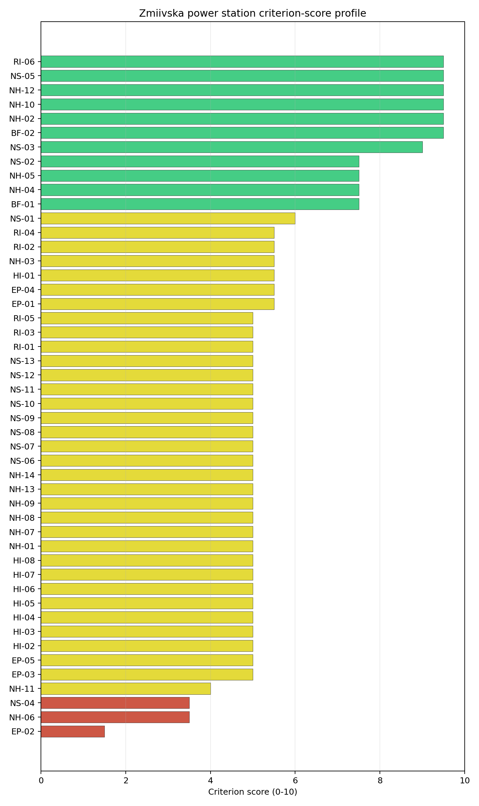
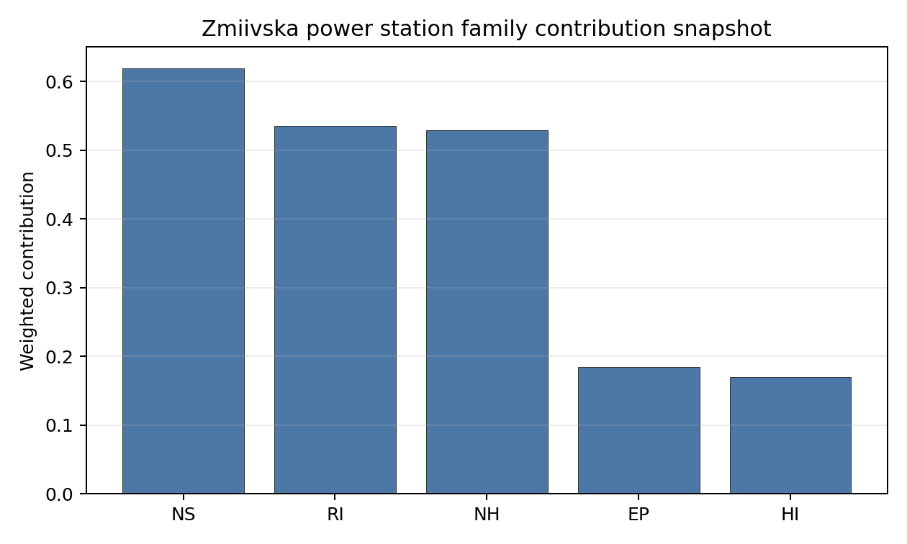

# Zmiivska power station Site Profile

> **Note on War Context (Ukraine)** — This site profile is presented as a **desk-study screening read only**, under explicit conflict and occupied-territory caveats. Zmiivska sits in the Kharkiv oblast of north-eastern Ukraine, ~100 km from the Russian border, and has been a documented target of Russian missile and drone strikes during the 2022– war. The screening cadastre reflects pre-war or partially updated infrastructure conditions and does not capture current war damage, regulator-access status, emergency-planning continuity, or workforce-availability impacts. Per the [Ukraine occupied-territory caveat plan](../02_ukraine_occupied_territory_caveat_plan.md), **Ukraine includes several high-performing screening records but the current war context prevents these records from being treated as practical near-term progression candidates**; detailed Ukrainian site profiles should be deferred to a post-war review with updated territorial-control mapping, physical site access, regulator engagement, and infrastructure-condition evidence. The interpretations below should be read accordingly: they characterise the **screening envelope as a desk-study artefact**, not a near-term progression recommendation.

Zmiivska power station is a coal/thermal site in Ukraine that has been tested against the NuScale VOYGR-6 reference deployment envelope. This profile reads the screening evidence at a level that supports a decision to progress toward Stage 3 characterization. It is not a site-suitability determination, vendor recommendation, or licensing finding.

## Site Snapshot

| Field | Value |
| --- | --- |
| Site name | Zmiivska power station |
| Coordinates | 49.5860, 36.5239 |
| Subnational unit | Kharkiv |
| Installed thermal capacity (source data) | 2,270 MW |
| Composite score (baseline weights) | 6.086 (4.033-6.474 MC band) |
| National stability band | B (top-10% hit rate 94%) |
| National rank | 1 |

_See the country status map in_ [Ukraine Country Profile](../UA_country_prototype.md#country-status-map).

## Ownership and Coal-to-Nuclear Context

- **unknown** (21.71% share); immediate operator Centrenergo PJSC. Path: unknown  -> Centrenergo PJSC [21.71%] -> Zmiivska power station Unit 7 [100.0%]
- **Centrenergo PJSC** (100.00% share), headquartered in Ukraine; immediate operator Centrenergo PJSC. Path: Centrenergo PJSC -> Zmiivska power station Unit 8R [100.0%]
- **State Property Fund of Ukraine** (78.29% share), headquartered in Ukraine; immediate operator Centrenergo PJSC. Path: State Property Fund of Ukraine  -> Centrenergo PJSC [78.29%] -> Zmiivska power station Unit 9 [100.0%]

Generating units on record: 10 mothballed.
Earliest unit commissioning: 1960; most recent: 1969.

## Natural Hazards (NH)

- **Seismic: Ground Motion (NH-01)** - score 5.0/10 (MC 5.0-5.0), weight 0.0396, data quality medium. Evidence: PGA at 475-year return period 0 g; Vs30 reference (m/s): 760.0.
- **Seismic: Surface Rupture (NH-02)** - score 9.5/10 (MC 9.0-10.0), weight n/a, data quality screening grade. Evidence: nearest mapped capable fault 50.0 km; fault slip rate 0 mm/yr; fault name: none_in_search_radius.
- **Geotechnical: Liquefaction (NH-03)** - score 5.5/10 (MC 5.0-6.0), weight n/a, data quality medium. Evidence: liquefaction susceptibility: moderate; dominant soil type: silt_loam.
- **Geotechnical: Slope Stability (NH-04)** - score 7.5/10 (MC 7.0-8.0), weight n/a, data quality screening grade. Evidence: site slope 6.9 deg; max slope in 1 km box 79.2 deg; slope stability class: moderate.
- **Geotechnical: Subsidence (NH-05)** - score 7.5/10 (MC 7.0-8.0), weight 0.0308, data quality medium. Evidence: karst present: no; karst severity: none.
- **Geotechnical: Foundation (NH-06)** - score 3.5/10 (MC 3.0-4.0), weight 0.0220, data quality medium. Evidence: bearing capacity 60.5 kPa; depth to bedrock 32.9 m.
- **Volcanism (NH-07)** - score 5.0/10 (MC 5.0-5.0), weight n/a, data quality high. Evidence: volcanic hazard class: negligible.
- **Coastal Flooding (NH-08)** - score 5.0/10 (MC 5.0-5.0), weight 0.0264, data quality low. Evidence: values not in measurement tables.
- **River Flooding (NH-09)** - score 5.0/10 (MC 5.0-5.0), weight 0.0352, data quality medium. Evidence: flood zone class: negligible.
- **Extreme Winds (NH-10)** - score 9.5/10 (MC 9.0-10.0), weight n/a, data quality medium. Evidence: design wind speed 8.76 m/s.
- **Extreme Precipitation (NH-11)** - score 4.0/10 (MC 4.0-4.0), weight 0.0132, data quality medium. Evidence: extreme daily precipitation 0.15 mm; mean annual precipitation 19.6 mm/yr.
- **Extreme Temperatures (NH-12)** - score 9.5/10 (MC 9.0-10.0), weight 0.0176, data quality medium. Evidence: extreme high temperature 25.8 deg C; extreme low temperature -10.8 deg C.
- **Forest/Wildfire (NH-13)** - score 5.0/10 (MC 5.0-5.0), weight 0.0132, data quality n/a. Evidence: values not in measurement tables.
- **Combined Hazards (NH-14)** - score 5.0/10 (MC 5.0-5.0), weight 0.0132, data quality n/a. Evidence: values not in measurement tables.

### Interpretation - Natural Hazards (NH)

<!-- specialist key=family_natural_hazards scope=site site_id=29b3a802-7ef1-4722-ad59-b1511b1b0075 bundle=UA_zmiivska_power_station_site_bundle.json status=filled by=cursor-agent filled_at=2026-05-03T18:39:09Z -->
**Note: this is a desk-study screening read under war-context caveats — see the [Ukraine caveat plan](../02_ukraine_occupied_territory_caveat_plan.md).** Natural hazards at Zmiivska sit in the structurally aseismic Eastern-European-Platform Donets-basin envelope on the Siverskyi Donets-river floodplain in Kharkiv oblast at 102 m elevation, with the principal natural-hazard finding the binding NH-06 foundation-engineering caution on the soft alluvial profile. **NH-01 Seismic: Ground Motion at 5.0/10** carries a 475-yr PGA of essentially **0 g** with the 2,475-yr value missing from the screening cadastre — the Donets-basin tectonic context is one of the structurally most aseismic in the entire first-batch cohort (the East European Platform interior has effectively no documented active seismicity in the Kharkiv-oblast region), and the screening 5.0/10 score reflects the screening-default rather than a confirmed favourable site characterisation. **NH-02 Seismic: Surface Rupture at 9.5/10** carries no mapped capable fault inside the 50 km screening search radius — a clean fault-stand-off envelope. **NH-04 Geotechnical: Slope Stability at 7.5/10** carries a mean site slope of **6.9°** with a maximum slope of 79.2° on a `moderate` slope-stability class — the immediate buildable terrace on the Siverskyi Donets right bank is gentle but the wider 1 km box captures the higher terrace flanks. **NH-03 Geotechnical: Liquefaction at 5.5/10** carries a `moderate` susceptibility read on a silt-loam profile (the Siverskyi Donets alluvial terrace is fine-grained and the Stage 3 CPT campaign should characterise the dynamic-loading envelope, although the structurally aseismic NH-01 envelope reduces the foundation-loading concern). **NH-06 Geotechnical: Foundation at 3.5/10** is the binding NH finding: the bearing capacity reads at just **60.5 kPa over 32.9 m to bedrock** — the lowest screening-proxy bearing capacity of the first-batch cohort outside the SK Trebišov screening data-gap, reflecting the soft Siverskyi Donets alluvial profile and the deep weathered-overburden cover. The Stage 3 work will need a substantive geotechnical campaign (CPT, deep-borehole drilling, dynamic-soil-loading characterisation, and explicit assessment of pile-foundation alternatives) on the alluvial profile to lift the NH-06 caution and to settle the SMR foundation-engineering case. NH-05 reads 7.5/10 with `karst not present`. NH-07 reads 5.0/10 (`negligible` volcanic hazard); NH-08 (102 m elevation removes the coastal-flooding case); NH-09 carries an inconclusive verdict but the Siverskyi Donets-river flood-hazard envelope is substantial — the wider Kharkiv oblast experienced major Donets-basin flooding in 2010 and 2018 and the Stage 3 work should explicitly model these reference events. Extreme meteorology is calm: a 50-yr design wind of 8.76 m/s and an extreme temperature range of -10.8 °C to 25.8 °C (NH-10 and NH-12 at 9.5/10). NH-11 sits at 4.0/10 on the screening proxy. The Stage 3 priority order is therefore: commission a substantive geotechnical campaign with CPT, deep boreholes, and pile-foundation alternative assessment so NH-06 lifts off the 3.5/10 caution (this is the binding natural-hazard question for the site, given the soft 60.5 kPa screening read); commission the site-specific Siverskyi Donets-river flood-hazard study so NH-09 lifts off the inconclusive read; and commission a project-specific PSHA on measured Vs30 against the structurally aseismic East European Platform source zone to confirm the 5.0/10 favourable seismic envelope as a measured rather than screening-default value. **All of these Stage 3 deliverables presuppose a post-conflict site-access regime** and should not be progressed until the war-context caveats listed in the site-identity note are retired.
<!-- /specialist key=family_natural_hazards -->

## Human-Induced and Security-Relevant Hazards (HI)

- **Aircraft Crash (HI-01)** - score 5.5/10 (MC 5.0-6.0), weight 0.0308, data quality high. Evidence: nearest airport 29.3 km; nearest flight path 14.6 km; airports within search radius 1; airport name: Chuhuiv Air Base; airport type: small_airport.
- **Industrial Explosions (HI-02)** - score 5.0/10 (MC 5.0-5.0), weight 0.0308, data quality screening grade. Evidence: values not in measurement tables.
- **Toxic/Gas Releases (HI-03)** - score 5.0/10 (MC 5.0-5.0), weight 0.0308, data quality screening grade. Evidence: values not in measurement tables.
- **External Fires (HI-04)** - score 5.0/10 (MC 5.0-5.0), weight 0.0264, data quality screening grade. Evidence: values not in measurement tables.
- **Transport Hazards (HI-05)** - score 5.0/10 (MC 5.0-5.0), weight 0.0264, data quality n/a. Evidence: values not in measurement tables.
- **Military Installations (HI-06)** - score 5.0/10 (MC 5.0-5.0), weight 0.0264, data quality not_found. Evidence: military installations within radius 0.
- **Electromagnetic Interference (HI-07)** - score 5.0/10 (MC 5.0-5.0), weight 0.0088, data quality medium. Evidence: nearest high-power transmitter 0.99 km; transmitters within radius 37; transmitter type: communication.
- **Other Nuclear Installations (HI-08)** - score 5.0/10 (MC 5.0-5.0), weight 0.0132, data quality n/a. Evidence: values not in measurement tables.

### Interpretation - Human-Induced and Security-Relevant Hazards (HI)

<!-- specialist key=family_human_hazards scope=site site_id=29b3a802-7ef1-4722-ad59-b1511b1b0075 bundle=UA_zmiivska_power_station_site_bundle.json status=filled by=cursor-agent filled_at=2026-05-03T18:39:09Z -->
**Note: this is a desk-study screening read under war-context caveats — see the [Ukraine caveat plan](../02_ukraine_occupied_territory_caveat_plan.md). The HI envelope is materially affected by the ongoing Russia-Ukraine war and the screening cadastre does not capture the current security context.** The pre-war HI envelope at Zmiivska reads as middle-band across the family on the screening cadastre but the war-context HI questions dominate any practical near-term assessment. **HI-01 Aircraft Crash at 5.5/10** carries the **Chuhuiv Air Base (`small_airport`) at 29.3 km from the site** with the nearest flight-path projection at **14.6 km** and **1 air feature inside the 30 km search radius** — pre-war, Chuhuiv Air Base was a major Ukrainian Air Force tactical-aviation facility (the 92nd Tactical Aviation Brigade was based there) and the screening cadastre captures it as a `small_airport`, but in reality the facility is a high-tempo military air base that under SSG-35 typology should be classified as a major military airfield. The **war-context** is that Chuhuiv Air Base was repeatedly targeted by Russian missile and drone strikes during 2022–, with substantial documented damage; the post-war reconstitution and tempo of Chuhuiv as a military air base will be a material Stage 3 SSG-35 / SSG-79 question. The pre-war 14.6 km flight-path projection is inside the 5 km regulatory floor envelope under the worst-case projection geometry. **HI-06 Military Installations at 5.0/10** carries `not_found` data quality with 0 features inside the screening radius — this is **almost certainly a screening-cadastre artefact** for the Ukrainian context (the Ukrainian Armed Forces' Joint Forces Command and the wider Kharkiv-oblast military estate would have substantial pre-war infrastructure inside the 25 km screening radius, and the post-2022 mobilisation has substantially expanded the Ukrainian military estate); the screening favourable read should not be taken at face value, and the Stage 3 work would require Ukrainian Ministry of Defence engagement after the war for an authoritative cadastre. **HI-02 Industrial Explosions, HI-03 Toxic / Gas Releases, HI-04 External Fires** all sit at the pass-mark default of 5.0/10 on `screening grade` data quality (the Ukrainian national Seveso and pollutant-release inventories have limited screening coverage); the immediate Zmiiv context includes the Zmiiv chemical and engineering industries and the wider Kharkiv-Izyum industrial corridor. **HI-05 Transport Hazards** holds at 5.0/10. HI-07 reads 5.0/10 with the nearest broadcast feature at 0.99 km (a communication mast inside the existing thermal complex) and **37 transmitters inside the EMI search radius** (a moderate broadcast environment for the rural Kharkiv-oblast context). HI-08 is null. The Stage 3 priority order — under post-war conditions only — would therefore be: commission a Ukrainian Ministry of Defence cadastre engagement on the Kharkiv-oblast military estate and the post-war Chuhuiv Air Base reconstitution status so HI-06 and HI-01 settle on defensible measured values (the screening reads are not adequate for either criterion under the current war context); commission a focused SSG-79 hazard assessment on the Chuhuiv Air Base flight-path geometry against the post-war tempo classification; commission the Ukrainian national Seveso, hazmat-corridor, and external-fire surveys; and commission an EMI envelope study against the broadcast cadastre. **All of these Stage 3 deliverables presuppose a post-conflict site-access regime and a stable Ukrainian regulator engagement** which is not feasible under current conditions.
<!-- /specialist key=family_human_hazards -->

## Radiological Impact and Emergency Planning (RI / EP)

- **Emergency Planning Feasibility (EP-01)** - score 5.5/10 (MC 5.0-6.0), weight n/a, data quality high. Evidence: EP feasibility composite 45.2 /100; road sub-score 18.8 /100; special-population sub-score 10.0 /100; geography sub-score 95.0 /100; population sub-score 80.0 /100; evacuation feasible: yes.
- **Evacuation Routes (EP-02)** - score 1.5/10 (MC 1.0-2.0), weight 0.0264, data quality medium. Evidence: road density in EPZ 0.188 km/km2; road length in EPZ 369.8 km; motorway access: no.
- **Physical Geography Constraints (EP-03)** - score 5.0/10 (MC 5.0-5.0), weight 0.0220, data quality medium. Evidence: waterways crossing EPZ 0; major river barrier: no.
- **Special Populations (EP-04)** - score 5.5/10 (MC 5.0-6.0), weight 0.0264, data quality medium. Evidence: hospitals in EPZ 17; prisons in EPZ 1; care homes in EPZ 0.
- **Concurrent Hazard Impact (EP-05)** - score 5.0/10 (MC 5.0-5.0), weight 0.0176, data quality n/a. Evidence: values not in measurement tables.
- **Atmospheric Dispersion (RI-01)** - score 5.0/10 (MC 5.0-5.0), weight 0.0264, data quality medium. Evidence: annual mean wind speed 1.3 m/s; atmospheric mixing height 586.0 m; prevailing wind direction: ENE.
- **Surface Water Dispersion (RI-02)** - score 5.5/10 (MC 5.0-6.0), weight 0.0220, data quality n/a. Evidence: values not in measurement tables.
- **Groundwater Dispersion (RI-03)** - score 5.0/10 (MC 5.0-5.0), weight 0.0220, data quality medium. Evidence: aquifer type: inland water.
- **Population Density at EPZ Radii (RI-04)** - score 5.5/10 (MC 5.0-6.0), weight 0.0352, data quality screening grade. Evidence: population density within 5 km 154.7 /km2; population density within 16 km 52.8 /km2; population density within 25 km 44.4 /km2; population density within 80 km 115.2 /km2; population within 25 km 87,257 people.
- **Distance to Population Centres (RI-05)** - score 5.0/10 (MC 5.0-5.0), weight 0.0441, data quality screening grade. Evidence: values not in measurement tables.
- **Population Projections (RI-06)** - score 9.5/10 (MC 9.0-10.0), weight 0.0220, data quality screening grade. Evidence: annual population growth rate -1.429 %/yr; projected population at 25 km in 60 yr 52,233 people.

### Interpretation - Radiological Impact and Emergency Planning (RI / EP)

<!-- specialist key=family_radiological_emergency scope=site site_id=29b3a802-7ef1-4722-ad59-b1511b1b0075 bundle=UA_zmiivska_power_station_site_bundle.json status=filled by=cursor-agent filled_at=2026-05-03T18:39:09Z -->
**Note: this is a desk-study screening read under war-context caveats — see the [Ukraine caveat plan](../02_ukraine_occupied_territory_caveat_plan.md). The EP envelope is materially affected by the ongoing Russia-Ukraine war and the screening cadastre does not capture current emergency-planning continuity, evacuation feasibility, or the post-2022 displacement context.** The pre-war RI / EP envelope at Zmiivska is dominated by the **binding EP-02 evacuation-route caution** at 1.5/10, the lowest screening read of the entire first-batch cohort, reflecting the rural Kharkiv-oblast road-network density on the screening cadastre. The DRV-02 emergency-planning composite reads **45.2/100 with `evacuation feasible: yes`**, but with substantively low road and special-population sub-scores — the road sub-score reads at just **18.8/100** and the special-population sub-score at **10/100**, both the lowest of the first-batch cohort. **EP-02 Evacuation Routes at 1.5/10** is the principal binding finding: road density of just **0.188 km/km² inside the 16 km EPZ** with **369.8 km of road length** and **`motorway access: no`** — the lowest road density of the first-batch cohort by a substantial margin (Konya Karapınar 0.344, RS Morava 0.397) and the only first-batch site without motorway access. The rural Kharkiv-oblast road network in the Zmiiv area is structurally sparse and the cross-EPZ evacuation logistics are constrained by the absence of a backbone motorway corridor; the **war-context** has further degraded this envelope, with documented road and bridge damage from Russian artillery and missile strikes between 2022 and the present. **EP-04 Special Populations at 5.5/10** carries 17 hospitals and 1 prison inside the EPZ — moderate by first-batch-cohort standards but the EP-01 special-population sub-score of 10/100 suggests that the EP composite is picking up a more substantive special-population concern (likely the Zmiiv town centre and the wider Kharkiv-oblast displaced-population reception infrastructure under war-context conditions). Population context is favourable for radiological impact: **5 km density 154.7 p/km², 16 km 52.8 p/km², 25 km 44.4 p/km²** on a 25 km cumulative population of just **87,257 people** — RI-04 reads 5.5/10. **RI-06 Population Projections at 9.5/10** is the strongest demographic-tailwind read of the first-batch cohort outside RS Morava and TR Akdeniz Enerji: the 60-yr projection at 25 km is **52,233 people on a -1.429 %/yr growth track** — the steepest depopulation track of the first-batch cohort, partly reflecting the long-running East-Ukrainian demographic decline and partly the post-2022 internal displacement and emigration impact on the Kharkiv-oblast region. The atmospheric envelope is moderate: **1.3 m/s annual mean wind speed** with a **586 m mixing height** (the highest of the Ukrainian portfolio, reflecting the elevated Donets-basin terrace context — the high mixing height is a substantively favourable dispersion characteristic) and an **ENE prevailing direction** (towards Russia and the wider Kharkiv-Belgorod border, a structurally adverse cross-border radiological direction that under war-context conditions is even more sensitive than the screening read suggests). RI-02 reads 5.5/10 on the Siverskyi Donets / Pechenizhske Reservoir hydraulic envelope. RI-03 reads 5.0/10 on `inland water` aquifer (the alluvial Donets-basin aquifer system). RI-05 reads 5.0/10 on `screening grade`. EP-03 reads 5.0/10. EP-05 sits at 5.0/10. The Stage 3 priority order — under post-war conditions only — would therefore be: commission a substantial 16 km EPZ road-network upgrade plan and motorway-access programme with the Ukrainian Ministry of Infrastructure to lift EP-02 off the 1.5/10 binding caution (this would require a substantial post-war reconstruction investment); commission an explicit cross-border emergency-planning assessment with explicit attention to the ENE prevailing wind direction towards the Russian Federation (a structurally adverse direction that has no diplomatic path under current conditions); commission a project-specific micro-meteorological station; engage the Kharkiv-oblast regional emergency-planning authority on the 17 hospitals and 1 prison inside the EPZ and the post-war displaced-population reception context; and commission the Stage 3 hydrogeological survey. **All of these Stage 3 deliverables presuppose a post-conflict regime, stable territorial control, restored regulatory access, and substantial post-war reconstruction investment.**
<!-- /specialist key=family_radiological_emergency -->

## Non-Safety and Implementation Considerations (NS)

- **Grid Capacity Basic Filter (BF-01)** - score 7.5/10 (MC 7.0-8.0), weight 0.0352, data quality n/a. Evidence: values not in measurement tables.
- **Land Area Basic Filter (BF-02)** - score 9.5/10 (MC 9.0-10.0), weight 0.0220, data quality n/a. Evidence: values not in measurement tables.
- **Cooling Water Availability (NS-01)** - score 6.0/10 (MC 6.0-6.0), weight n/a, data quality screening grade. Evidence: distance to cooling source 6.41 km; cooling source flow 55.1 m3/s; cooling source type: major_river; cooling source name: Канал водозабора ТЕС; water stress label: Medium-High.
- **Grid Connection (NS-02)** - score 7.5/10 (MC 5.5-9.5), weight 0.0352, data quality insufficient. Evidence: nearest substation 0.28 km; nearest high-voltage line 0.49 km; highest nearby line voltage 330.0 kV; grid export capacity 2,270 MW; substations within radius 341; HV lines within radius 443.
- **Transport Access (NS-03)** - score 9.0/10 (MC 8.0-9.0), weight 0.0352, data quality high. Evidence: nearest highway 0.69 km; nearest rail line 0.32 km; heavy-haul capable: yes.
- **Site Topography (NS-04)** - score 3.5/10 (MC 3.0-4.0), weight 0.0264, data quality medium. Evidence: favourable land cover 36.4 %; moderate land cover 16.0 %; unfavourable land cover 47.6 %; favourable area 62.1 ha; dominant land class: 512.
- **Site Footprint Adequacy (NS-05)** - score 9.5/10 (MC 9.0-10.0), weight 0.0220, data quality screening grade. Evidence: buildable area 172.4 ha; largest contiguous patch 625.3 ha; buildable patch count 7.
- **Existing Infrastructure (NS-06)** - score 5.0/10 (MC 5.0-5.0), weight 0.0220, data quality n/a. Evidence: values not in measurement tables.
- **Environmental Impact (non-rad) (NS-07)** - score 5.0/10 (MC 5.0-5.0), weight 0.0220, data quality n/a. Evidence: values not in measurement tables.
- **Ecological Sensitivity (NS-08)** - score 5.0/10 (MC 5.0-5.0), weight n/a, data quality insufficient. Evidence: natural land cover 47.6 %; distance to nearest protected area 0.442 km; Natura 2000 sensitivity class: unknown; protected-area overlap: no; protected-area sensitivity class: high; Natura 2000 sites within 5 km: 0; nearest protected-area designation: Emerald Network.
- **Socioeconomic Impact (NS-09)** - score 5.0/10 (MC 5.0-5.0), weight 0.0220, data quality n/a. Evidence: values not in measurement tables.
- **Workforce Availability (NS-10)** - score 5.0/10 (MC 5.0-5.0), weight 0.0176, data quality n/a. Evidence: values not in measurement tables.
- **Coal-to-Nuclear Synergies (NS-11)** - score 5.0/10 (MC 5.0-5.0), weight 0.0264, data quality n/a. Evidence: values not in measurement tables.
- **Regulatory/Political Environment (NS-12)** - score 5.0/10 (MC 5.0-5.0), weight 0.0264, data quality n/a. Evidence: values not in measurement tables.
- **Construction Logistics (NS-13)** - score 5.0/10 (MC 5.0-5.0), weight 0.0176, data quality n/a. Evidence: values not in measurement tables.

### Interpretation - Non-Safety and Implementation Considerations (NS)

<!-- specialist key=family_infrastructure scope=site site_id=29b3a802-7ef1-4722-ad59-b1511b1b0075 bundle=UA_zmiivska_power_station_site_bundle.json status=filled by=cursor-agent filled_at=2026-05-03T18:39:09Z -->
**Note: this is a desk-study screening read under war-context caveats — see the [Ukraine caveat plan](../02_ukraine_occupied_territory_caveat_plan.md). The NS envelope is materially affected by the ongoing Russia-Ukraine war, including substantial documented infrastructure damage at the Zmiivska thermal complex itself from 2022– missile strikes; the screening cadastre reflects pre-war infrastructure conditions and not current operational status.** The pre-war NS envelope at Zmiivska reads as the strongest infrastructure read of the Ukrainian portfolio — the 2,270 MW historical thermal complex (10 mothballed units commissioned 1960–1969, with Unit 8R rebuilt) has the largest grid-export envelope of the first-batch cohort, the 330 kV nearby-line voltage tier matches the Ukrainian national-grid backbone, and the rail-and-highway logistics envelope is structurally favourable — but the **war-context infrastructure damage is material** and the Stage 3 work would need to start from a substantive post-war structural-and-functional condition assessment of every brownfield asset. **NS-02 Grid Connection at 7.5/10** is the strongest grid-connection read of the Slovak / Turkish / Ukrainian first-batch cohort: nearest substation at **0.28 km** from the site, nearest high-voltage line at **0.49 km**, **highest nearby line voltage at 330 kV** matching the Ukrenergo national-grid backbone, **measured grid export capacity of 2,270 MW** matching the historical thermal-block envelope, and **341 substations and 443 HV lines inside the search radius** on `insufficient` data quality. Pre-war, this is an exceptional grid-inheritance asset — the 330 kV transmission tier is the standard Ukrainian national-grid backbone tier and the substation density reflects the wider Donbas-Kharkiv industrial-region grid concentration. **War-context**: the Zmiivska switchyard and the 330 kV transmission infrastructure have been documented as repeatedly targeted in 2022– strikes, and the Ukrenergo wider grid network in eastern Ukraine has sustained substantial cumulative damage; the Stage 3 grid-connection assessment would need a substantive post-war condition survey. **NS-03 Transport Access at 9.0/10** reads on a `high` data quality with the nearest highway at **0.69 km**, the nearest **rail line at 0.32 km**, and **heavy-haul capable: yes** — the Kharkiv-Donbas freight corridor passes alongside the site, but the war has substantially degraded the eastern-Ukrainian rail freight network. **NS-05 Site Footprint Adequacy at 9.5/10** carries **172.4 ha buildable area as the largest contiguous patch of 625.3 ha** across 7 patches — a strong buildable footprint, but again the screening cadastre does not capture current war-damage debris-clearance and remediation requirements. **NS-04 Site Topography at 3.5/10** is the binding NS finding on the screening cadastre: **47.6% unfavourable land cover** with a dominant land class of `512` (water bodies — the Pechenizhske Reservoir is partly captured in the wider site envelope as the cooling-water source) and just 36.4% favourable land cover — the screening cadastre reads the cooling-reservoir water surface as `unfavourable` for siting purposes, which is a screening-classification artefact rather than a substantive site finding (the buildable patch on the right bank is favourable, but the wider envelope captures the reservoir surface). **NS-01 Cooling Water Availability at 6.0/10** carries cooling water from the dedicated **plant water-intake canal (Канал водозабора ТЕС, 6.41 km from the site)** drawn from the **Pechenizhske Reservoir on the Siverskyi Donets** with a measured flow of **55.1 m³/s** on a `Medium-High` water-stress label — the Pechenizhske cooling-water envelope is purpose-built for the historical 2,270 MW thermal complex and the cooling-water inheritance is substantial, but the Stage 3 work would need to characterise the reservoir's post-war operational status. **NS-08 Ecological Sensitivity at 5.0/10** carries `insufficient` data quality with the nearest protected area at just **0.442 km on the Emerald Network designation** with a `high` protected-area sensitivity class — a substantive ecological constraint at very close range. The Ukrainian Emerald Network coverage on the Siverskyi Donets corridor is dense and the Stage 3 work would need an Emerald-Network-equivalent appropriate-assessment framework with the Ukrainian Ministry of Environmental Protection. **BF-01 Grid Capacity Basic Filter at 7.5/10 and BF-02 Land Area Basic Filter at 9.5/10** confirm the basic filters. NS-06, NS-07, NS-09 to NS-13 sit at the pass-mark default of 5.0/10. The Stage 3 priority order — under post-war conditions only — would therefore be: commission a substantive post-war structural-and-functional condition assessment of every brownfield asset (plant, switchyard, 330 kV transmission, cooling-water canal, Pechenizhske Reservoir, rail freight, highway access) so the screening reads can be lifted to measured post-war values; commission an Emerald-Network appropriate-assessment framework against the 0.442 km protected-area context (the Ukrainian Siverskyi Donets corridor is one of the most ecologically protected river systems in eastern Ukraine); engage the Ukrenergo, Centrenergo, and Ukrainian Ministry of Energy on the post-war grid-restoration plan and the brownfield-inheritance economic case; and commission the construction-logistics, workforce, and regulatory surveys against the post-war Ukrainian SMR-programme regulatory framework. **All of these Stage 3 deliverables presuppose a post-conflict regime and would only be tractable after the cessation of hostilities.**
<!-- /specialist key=family_infrastructure -->

## Composite Score and Stability

Baseline composite score is 6.086, bracketed by Monte Carlo at 4.033-6.474. National stability band is `B` with a top-10% hit rate of 94% across 16 scored Monte Carlo scenarios.

<!-- specialist key=stability scope=site site_id=29b3a802-7ef1-4722-ad59-b1511b1b0075 bundle=UA_zmiivska_power_station_site_bundle.json status=filled by=cursor-agent filled_at=2026-05-03T18:39:09Z -->
**Note: this is a desk-study screening read under war-context caveats — see the [Ukraine caveat plan](../02_ukraine_occupied_territory_caveat_plan.md). The composite score reflects pre-war infrastructure conditions and is not a near-term progression recommendation.** Zmiivska's pre-war composite of **6.086 (Monte Carlo 4.033–6.474)** is the strongest Ukrainian entry of the three sites profiled in this batch and lands in the upper-tier band of the regional cohort: the **national stability band is `B`** with a top-10% hit rate of **94% across 16 scored Monte Carlo scenarios** and a top-5% rate of **31%** — the score is structurally robust for the national top tier under most explored Monte Carlo perturbations. The **regional stability band is also `B`** with a top-10% hit rate of **94%**. The composite is anchored by NS-03 transport access (contribution 0.317 from the 9.0/10 score — the Kharkiv-Donbas freight-corridor adjacency), BF-01 grid capacity basic filter (0.264 from the favourable read), NS-02 grid connection (0.264 from the strong 7.5/10 read on the 330 kV / 2,270 MW historical thermal-block envelope), NH-05 geotechnical subsidence (0.231 from the karst-free Donets-basin context), RI-05 distance to population centres (0.221), and BF-02 land area (0.209). The drag features are **EP-02 Evacuation Routes (1.5/10 — lowest road-density and only no-motorway read of the cohort)**, **NH-06 Geotechnical Foundation (3.5/10 — soft 60.5 kPa screening proxy on Siverskyi Donets alluvial profile)**, and **NS-04 Site Topography (3.5/10 — screening-classification artefact from the cooling-reservoir water surface)**. The pre-war plain-English read is that **Zmiivska is structurally one of the strongest brownfield candidates in the Ukrainian portfolio** — the 2,270 MW grid-export envelope, the 330 kV transmission tier matching the Ukrenergo backbone, the dedicated Pechenizhske cooling-water canal, the Kharkiv-Donbas freight-corridor adjacency, the 625 ha contiguous buildable patch, and the structurally aseismic Donets-basin context together would make this a compelling national candidate under peacetime conditions. **War-context plain-English read**: under the current Russia-Ukraine war the site is **not a practical near-term progression candidate** — it has been documented as repeatedly targeted by Russian missile and drone strikes (the Centrenergo Zmiivska facility has sustained substantial cumulative damage between 2022 and the present), it sits ~100 km from the Russian border in an active military theatre with ongoing artillery, missile, and drone exchanges, the screening-favourable demographic-tailwind read (RI-06 9.5/10 at -1.429 %/yr) is partly a war-driven internal-displacement and emigration signal, the structurally adverse ENE prevailing wind direction towards the Russian Federation has no diplomatic resolution path, and the EP-02 1.5/10 emergency-planning road-network caution is an additional structural constraint that the war has further degraded. **Recommendation**: retain Zmiivska on the analytical Ukrainian long-list as a strong pre-war screening candidate but **do not progress to detailed Stage 3 planning under current conditions**; defer the candidate-pool decision to a post-war review against the [Ukraine caveat plan](../02_ukraine_occupied_territory_caveat_plan.md) framework with updated territorial-control mapping, physical site access, regulator engagement, and infrastructure-condition evidence. Under post-war conditions the site would warrant a substantive Stage 3 work envelope dominated by the structural-and-functional condition assessment of the 2,270 MW thermal complex and 330 kV switchyard.
<!-- /specialist key=stability -->

## Residual Risk Register

<!-- specialist key=residual_risk scope=site site_id=29b3a802-7ef1-4722-ad59-b1511b1b0075 bundle=UA_zmiivska_power_station_site_bundle.json status=filled by=cursor-agent filled_at=2026-05-03T18:39:09Z -->
| Criterion | Description | Owner | Resolution path |
| --- | --- | --- | --- |
| War context (overarching) | Site sustained substantial documented damage from Russian missile and drone strikes 2022–; ~100 km from Russian border in active military theatre. | Project Programme | Defer detailed Stage 3 progression to post-conflict review per [Ukraine caveat plan](../02_ukraine_occupied_territory_caveat_plan.md). |
| Brownfield-asset condition | Pre-war 2,270 MW thermal complex, 330 kV switchyard, Pechenizhske cooling-water canal — current operational status materially affected by war damage. | Engineering | Substantive post-war structural-and-functional condition assessment of every brownfield asset. |
| EP-02 Evacuation Routes | EPZ road density 0.188 km/km² (lowest of cohort); only no-motorway-access read of cohort; further degraded by war-context road and bridge damage. | Emergency Planning | Substantial 16 km EPZ road-network upgrade and motorway-access programme requiring post-war reconstruction investment. |
| NH-06 Foundation | Bearing capacity 60.5 kPa over 32.9 m to bedrock; soft Siverskyi Donets alluvial profile. | Geotechnical | Substantive geotechnical campaign (CPT, deep boreholes, dynamic-soil characterisation, pile-foundation alternative assessment). |
| NS-08 Ecological (Emerald Network at 0.442 km, `high` sensitivity) | Ukrainian Emerald Network site at 0.442 km on Siverskyi Donets corridor (high-protected-area sensitivity). | Environmental | Emerald-Network-equivalent appropriate-assessment framework with Ukrainian Ministry of Environmental Protection. |
| HI-01 Chuhuiv Air Base (war-tempo) | Chuhuiv at 29.3 km classified as `small_airport` but is major military air base; flight path at 14.6 km; war-context damage and post-war reconstitution status uncertain. | Security/Safety | SSG-79 hazard assessment under post-war Chuhuiv tempo classification. |
| HI-06 Military Cadastre (Ukraine, war-context) | `not_found` data quality with 0 features inside radius — almost certainly a screening-cadastre artefact for Ukrainian context. | Security/Safety | Ukrainian Ministry of Defence cadastre engagement post-war. |
| RI-01 Cross-border ENE prevailing wind | Wind direction towards Russian Federation; no diplomatic resolution path under current war. | Radiological | Cross-border emergency-planning bilateral framework requires post-war diplomatic infrastructure. |
| NH-09 Siverskyi Donets-river flooding | River flood-hazard envelope is `inconclusive`; 2010 / 2018 reference events available. | Hydrology | Site-specific Siverskyi Donets flood-hazard study. |
| NH-01 Aseismic envelope confirmation | 475-yr PGA reads as 0 g on screening default rather than measured value; East European Platform aseismic context strongly favourable but unconfirmed. | Geotechnical | Project-specific PSHA on measured Vs30 against East European Platform source zone characterisation. |
<!-- /specialist key=residual_risk -->

## Stage 3 Follow-Up Checklist

- [ ] Re-measure **Evacuation Routes (EP-02)** - native score 1.5/10 with confidence medium.
- [ ] Re-measure **Geotechnical: Foundation (NH-06)** - native score 3.5/10 with confidence medium.
- [ ] Re-measure **Site Topography (NS-04)** - native score 3.5/10 with confidence medium.
- [ ] Re-measure **Extreme Precipitation (NH-11)** - native score 4.0/10 with confidence medium.
- [ ] Re-measure **Physical Geography Constraints (EP-03)** - native score 5.0/10 with confidence medium.
- [ ] Improve data quality for **Coastal Flooding (NH-08)** - current flag `low`.
- [ ] Improve data quality for **Military Installations (HI-06)** - current flag `not_found`.

## Evidence Limitations

- Coastal Flooding (NH-08) - quality `low`.
- Military Installations (HI-06) - quality `not_found`.
