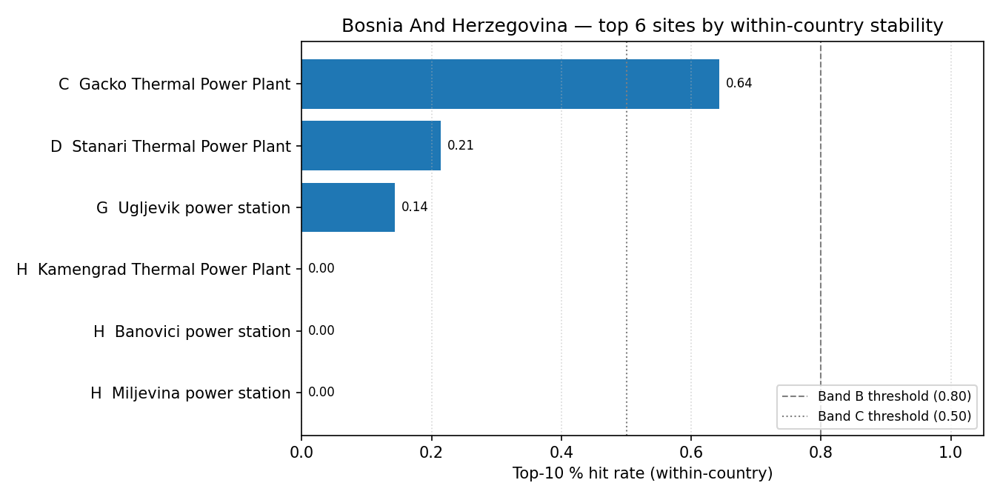

# Bosnia And Herzegovina (BA) — sensitivity shortlist — 20260423

_Generated on 2026-04-24 (UTC)._

## Envelope

- Scored sites (all-SMR pool): **6**.
- Scored sites (NuScale pool): **6**.
- Non-baseline scenarios: **14**.
- Within-country top-5 / 10 / 30 % percentiles are computed on the local pool, so **bands reflect national competitiveness**.

## Ranked shortlist — all SMRs pooled (top 10)

| Rank | Site                          | Country | Band | Top-5 % rate | Top-10 % rate | Top-30 % rate |
| ---: | ----------------------------- | ------- | :--: | -----------: | ------------: | ------------: |
|    1 | Gacko Thermal Power Plant     | BA      |  C   |       0.6429 |        0.6429 |        0.7143 |
|    2 | Stanari Thermal Power Plant   | BA      |  D   |       0.2143 |        0.2143 |        0.9286 |
|    3 | Ugljevik power station        | BA      |  G   |       0.1429 |        0.1429 |        0.3571 |
|    4 | Kamengrad Thermal Power Plant | BA      |  H   |          0.0 |           0.0 |           0.0 |
|    5 | Banovici power station        | BA      |  H   |          0.0 |           0.0 |           0.0 |
|    6 | Miljevina power station       | BA      |  H   |          0.0 |           0.0 |           0.0 |

**Band counts:** A=0, B=0, C=1, D=1, E=0, F=0, G=1, H=3.

## Ranked shortlist — NuScale `nuscale_voygr6` (top 10)

| Rank | Site                          | Country | Band | Top-5 % rate | Top-10 % rate | Top-30 % rate |
| ---: | ----------------------------- | ------- | :--: | -----------: | ------------: | ------------: |
|    1 | Gacko Thermal Power Plant     | BA      |  C   |       0.6429 |        0.6429 |        0.6429 |
|    2 | Stanari Thermal Power Plant   | BA      |  G   |       0.2143 |        0.2143 |        0.2143 |
|    3 | Ugljevik power station        | BA      |  H   |       0.1429 |        0.1429 |        0.1429 |
|    4 | Kamengrad Thermal Power Plant | BA      |  H   |          0.0 |           0.0 |           0.0 |
|    5 | Banovici power station        | BA      |  H   |          0.0 |           0.0 |           0.0 |
|    6 | Miljevina power station       | BA      |  H   |          0.0 |           0.0 |           0.0 |

**NuScale band counts:** A=0, B=0, C=1, D=0, E=0, F=0, G=1, H=4.

## Interpretation

- Sites in Bands A–C (within-country robust top tier): **1**.
- Band A / B sites are in the local top-5 % / 10 % slice in ≥ 80 % of the 14 non-baseline scenarios — the defensible national shortlist under perturbation.
- Sources: `20260423_site_bands_BA.csv`, `20260423_site_bands_BA_nuscale_voygr6.csv`.
