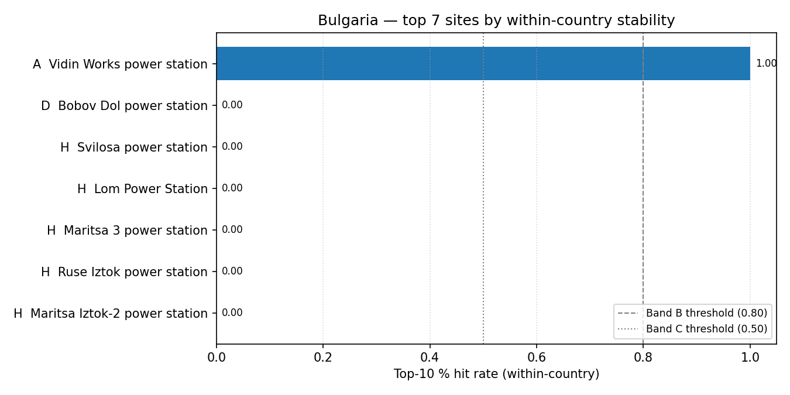

# Bulgaria (BG) — sensitivity shortlist — 20260423

_Generated on 2026-04-24 (UTC)._

## Envelope

- Scored sites (all-SMR pool): **7**.
- Scored sites (NuScale pool): **7**.
- Non-baseline scenarios: **14**.
- Within-country top-5 / 10 / 30 % percentiles are computed on the local pool, so **bands reflect national competitiveness**.

## Ranked shortlist — all SMRs pooled (top 10)

| Rank | Site                          | Country | Band | Top-5 % rate | Top-10 % rate | Top-30 % rate |
| ---: | ----------------------------- | ------- | :--: | -----------: | ------------: | ------------: |
|    1 | Vidin Works power station     | BG      |  A   |          1.0 |           1.0 |           1.0 |
|    2 | Bobov Dol power station       | BG      |  D   |          0.0 |           0.0 |           1.0 |
|    3 | Svilosa power station         | BG      |  H   |          0.0 |           0.0 |           0.0 |
|    4 | Lom Power Station             | BG      |  H   |          0.0 |           0.0 |           0.0 |
|    5 | Maritsa 3 power station       | BG      |  H   |          0.0 |           0.0 |           0.0 |
|    6 | Ruse Iztok power station      | BG      |  H   |          0.0 |           0.0 |           0.0 |
|    7 | Maritsa Iztok-2 power station | BG      |  H   |          0.0 |           0.0 |           0.0 |

**Band counts:** A=1, B=0, C=0, D=1, E=0, F=0, G=0, H=5.

## Ranked shortlist — NuScale `nuscale_voygr6` (top 10)

| Rank | Site                          | Country | Band | Top-5 % rate | Top-10 % rate | Top-30 % rate |
| ---: | ----------------------------- | ------- | :--: | -----------: | ------------: | ------------: |
|    1 | Vidin Works power station     | BG      |  A   |          1.0 |           1.0 |           1.0 |
|    2 | Bobov Dol power station       | BG      |  D   |          0.0 |           0.0 |           1.0 |
|    3 | Svilosa power station         | BG      |  H   |          0.0 |           0.0 |           0.0 |
|    4 | Lom Power Station             | BG      |  H   |          0.0 |           0.0 |           0.0 |
|    5 | Maritsa 3 power station       | BG      |  H   |          0.0 |           0.0 |           0.0 |
|    6 | Ruse Iztok power station      | BG      |  H   |          0.0 |           0.0 |           0.0 |
|    7 | Maritsa Iztok-2 power station | BG      |  H   |          0.0 |           0.0 |           0.0 |

**NuScale band counts:** A=1, B=0, C=0, D=1, E=0, F=0, G=0, H=5.

## Interpretation

- Sites in Bands A–C (within-country robust top tier): **1**.
- Band A / B sites are in the local top-5 % / 10 % slice in ≥ 80 % of the 14 non-baseline scenarios — the defensible national shortlist under perturbation.
- Sources: `20260423_site_bands_BG.csv`, `20260423_site_bands_BG_nuscale_voygr6.csv`.
