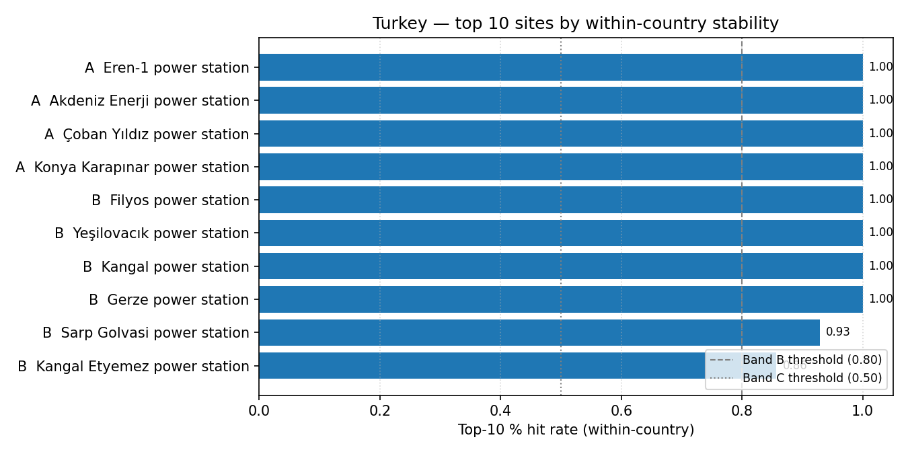

# Turkey (TR) — sensitivity shortlist — 20260423

_Generated on 2026-04-24 (UTC)._

## Envelope

- Scored sites (all-SMR pool): **106**.
- Scored sites (NuScale pool): **106**.
- Non-baseline scenarios: **14**.
- Within-country top-5 / 10 / 30 % percentiles are computed on the local pool, so **bands reflect national competitiveness**.

## Ranked shortlist — all SMRs pooled (top 10)

| Rank | Site | Country | Band | Top-5 % rate | Top-10 % rate | Top-30 % rate |
| ---: | --- | --- | :---: | ---: | ---: | ---: |
| 1 | Eren-1 power station | TR | A | 1.0 | 1.0 | 1.0 |
| 2 | Akdeniz Enerji power station | TR | A | 1.0 | 1.0 | 1.0 |
| 3 | Çoban Yıldız power station | TR | A | 1.0 | 1.0 | 1.0 |
| 4 | Konya Karapınar power station | TR | A | 1.0 | 1.0 | 1.0 |
| 5 | Filyos power station | TR | B | 0.7857 | 1.0 | 1.0 |
| 6 | Yeşilovacık power station | TR | B | 0.7857 | 1.0 | 1.0 |
| 7 | Kangal power station | TR | B | 0.4286 | 1.0 | 1.0 |
| 8 | Gerze power station | TR | B | 0.0 | 1.0 | 1.0 |
| 9 | Sarp Golvasi power station | TR | B | 0.0 | 0.9286 | 1.0 |
| 10 | Kangal Etyemez power station | TR | B | 0.0 | 0.8571 | 1.0 |
| … 96 more | | | | | | |

**Band counts:** A=4, B=6, C=1, D=21, E=0, F=0, G=1, H=73.

## Ranked shortlist — NuScale `nuscale_voygr6` (top 10)

| Rank | Site | Country | Band | Top-5 % rate | Top-10 % rate | Top-30 % rate |
| ---: | --- | --- | :---: | ---: | ---: | ---: |
| 1 | Eren-1 power station | TR | A | 1.0 | 1.0 | 1.0 |
| 2 | Çoban Yıldız power station | TR | A | 1.0 | 1.0 | 1.0 |
| 3 | Konya Karapınar power station | TR | A | 1.0 | 1.0 | 1.0 |
| 4 | Akdeniz Enerji power station | TR | B | 0.7857 | 1.0 | 1.0 |
| 5 | Filyos power station | TR | B | 0.7857 | 1.0 | 1.0 |
| 6 | Kangal power station | TR | B | 0.2857 | 1.0 | 1.0 |
| 7 | Yeşilovacık power station | TR | B | 0.1429 | 1.0 | 1.0 |
| 8 | Gerze power station | TR | B | 0.0 | 1.0 | 1.0 |
| 9 | Kangal Etyemez power station | TR | C | 0.0 | 0.7857 | 1.0 |
| 10 | Sarp Golvasi power station | TR | C | 0.0 | 0.6429 | 1.0 |
| … 96 more | | | | | | |

**NuScale band counts:** A=3, B=5, C=2, D=21, E=0, F=1, G=0, H=74.

## Interpretation

- Sites in Bands A–C (within-country robust top tier): **11**.
- Band A / B sites are in the local top-5 % / 10 % slice in ≥ 80 % of the 14 non-baseline scenarios — the defensible national shortlist under perturbation.
- Sources: `20260423_site_bands_TR.csv`, `20260423_site_bands_TR_nuscale_voygr6.csv`.
