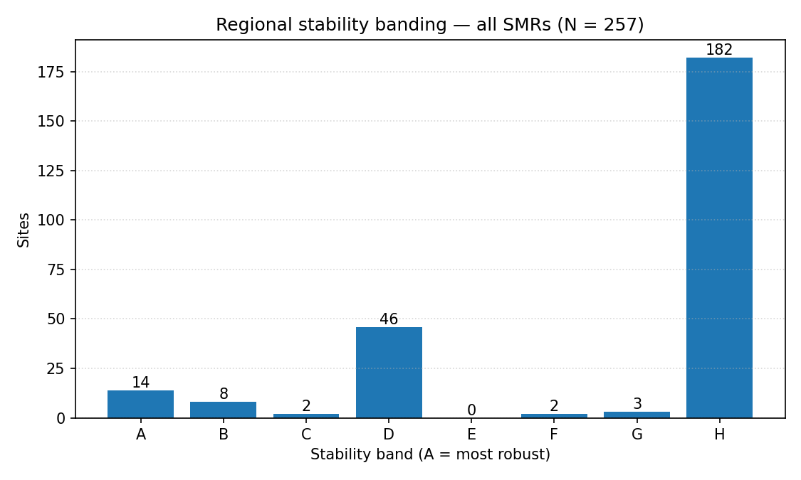
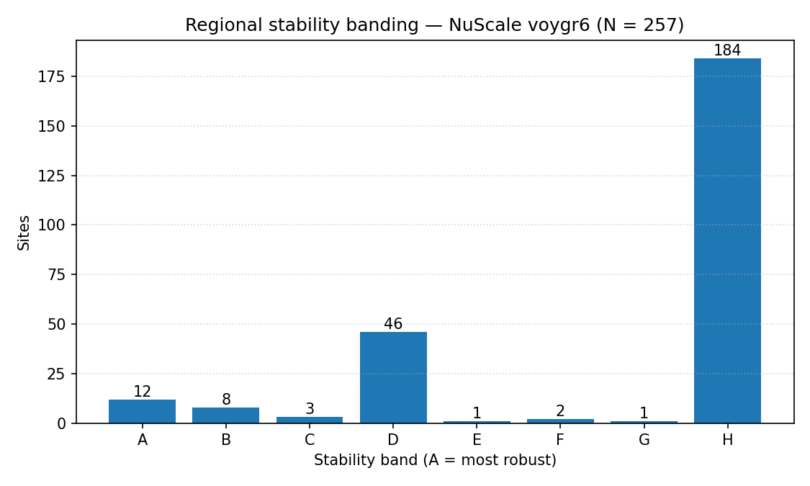

# Regional sensitivity summary — 20260425

_Generated on 2026-04-25 (UTC) from audit CSVs._

This document presents **site stability banding** (A–H) at two scopes:

- **Regional — all SMRs pooled** (257 sites).
- **Regional — NuScale `nuscale_voygr6` only** (257 sites).

Per-country rankings (with local top-K shortlists and within-country bands) live in `national/`.

## 1. Band counts — all SMRs pooled

| Band | Sites | Share |
| --- | ---: | ---: |
| A | 14 | 5.4 % |
| B | 8 | 3.1 % |
| C | 2 | 0.8 % |
| D | 46 | 17.9 % |
| E | 0 | 0.0 % |
| F | 2 | 0.8 % |
| G | 3 | 1.2 % |
| H | 182 | 70.8 % |
| **A–G (named)** | **75** | **29.2 %** |

## 2. Band counts — NuScale `nuscale_voygr6`

| Band | Sites | Share |
| --- | ---: | ---: |
| A | 12 | 4.7 % |
| B | 8 | 3.1 % |
| C | 3 | 1.2 % |
| D | 46 | 17.9 % |
| E | 1 | 0.4 % |
| F | 2 | 0.8 % |
| G | 1 | 0.4 % |
| H | 184 | 71.6 % |
| **A–G (named)** | **73** | **28.4 %** |

## 3. Top sites — NuScale (Band A/B/C, ≤ 25)

| Rank | Site | Country | Band | Top-5 % rate | Top-10 % rate | Top-30 % rate |
| ---: | --- | --- | :---: | ---: | ---: | ---: |
| 1 | Opalenie power station | PL | A | 1.0 | 1.0 | 1.0 |
| 2 | Turceni power station | RO | A | 0.9333 | 1.0 | 1.0 |
| 3 | Dolna Odra power station | PL | A | 0.9333 | 0.9333 | 1.0 |
| 4 | Çoban Yıldız power station | TR | A | 0.9333 | 0.9333 | 1.0 |
| 5 | Puchaczow power station | PL | A | 0.9333 | 0.9333 | 1.0 |
| 6 | Polaniec power station | PL | A | 0.9333 | 0.9333 | 0.9333 |
| 7 | Mohacs power station | HU | A | 0.9333 | 0.9333 | 0.9333 |
| 8 | Eren-1 power station | TR | A | 0.8667 | 0.9333 | 1.0 |
| 9 | Konya Karapınar power station | TR | A | 0.8667 | 0.9333 | 1.0 |
| 10 | Braila power station | RO | A | 0.8667 | 0.9333 | 0.9333 |
| 11 | Akdeniz Enerji power station | TR | A | 0.8667 | 0.9333 | 0.9333 |
| 12 | Yeşilovacık power station | TR | A | 0.8 | 0.9333 | 0.9333 |
| 13 | Zelwa power station | BY | B | 0.7333 | 0.8667 | 0.9333 |
| 14 | Starobesheve power station | UA | B | 0.6 | 0.9333 | 0.9333 |
| 15 | Zarnowiec power station | PL | B | 0.2667 | 0.8667 | 0.9333 |
| 16 | Opole power station | PL | B | 0.2 | 0.9333 | 0.9333 |
| 17 | Chvaletice power station | CZ | B | 0.0667 | 0.8667 | 0.9333 |
| 18 | Pocerady power station | CZ | B | 0.0667 | 0.8 | 0.9333 |
| 19 | Braila power station | RO | B | 0.0 | 0.9333 | 0.9333 |
| 20 | Turów power station | PL | B | 0.0 | 0.8 | 0.9333 |
| 21 | Skawina power station | PL | C | 0.1333 | 0.7333 | 0.9333 |
| 22 | Romag Termo power station | RO | C | 0.0667 | 0.6667 | 0.9333 |
| 23 | Burshtyn power station | UA | C | 0.0 | 0.7333 | 0.9333 |

## 4. Top sites — all SMRs (Band A/B/C, ≤ 25)

| Rank | Site | Country | Band | Top-5 % rate | Top-10 % rate | Top-30 % rate |
| ---: | --- | --- | :---: | ---: | ---: | ---: |
| 1 | Turceni power station | RO | A | 1.0 | 1.0 | 1.0 |
| 2 | Opalenie power station | PL | A | 1.0 | 1.0 | 1.0 |
| 3 | Dolna Odra power station | PL | A | 0.9333 | 0.9333 | 1.0 |
| 4 | Çoban Yıldız power station | TR | A | 0.9333 | 0.9333 | 1.0 |
| 5 | Puchaczow power station | PL | A | 0.9333 | 0.9333 | 1.0 |
| 6 | Polaniec power station | PL | A | 0.9333 | 0.9333 | 0.9333 |
| 7 | Mohacs power station | HU | A | 0.9333 | 0.9333 | 0.9333 |
| 8 | Konya Karapınar power station | TR | A | 0.8667 | 1.0 | 1.0 |
| 9 | Eren-1 power station | TR | A | 0.8667 | 0.9333 | 1.0 |
| 10 | Akdeniz Enerji power station | TR | A | 0.8667 | 0.9333 | 1.0 |
| 11 | Braila power station | RO | A | 0.8667 | 0.9333 | 0.9333 |
| 12 | Yeşilovacık power station | TR | A | 0.8667 | 0.9333 | 0.9333 |
| 13 | Zelwa power station | BY | A | 0.8667 | 0.8667 | 0.9333 |
| 14 | Starobesheve power station | UA | A | 0.8 | 0.9333 | 0.9333 |
| 15 | Zarnowiec power station | PL | B | 0.5333 | 0.8667 | 0.9333 |
| 16 | Opole power station | PL | B | 0.2 | 0.9333 | 0.9333 |
| 17 | Braila power station | RO | B | 0.0667 | 0.9333 | 0.9333 |
| 18 | Chvaletice power station | CZ | B | 0.0667 | 0.8667 | 0.9333 |
| 19 | Pocerady power station | CZ | B | 0.0667 | 0.8 | 0.9333 |
| 20 | Romag Termo power station | RO | B | 0.0667 | 0.8 | 0.9333 |
| 21 | Burshtyn power station | UA | B | 0.0 | 0.8 | 0.9333 |
| 22 | Turów power station | PL | B | 0.0 | 0.8 | 0.9333 |
| 23 | Skawina power station | PL | C | 0.1333 | 0.7333 | 0.9333 |
| 24 | ZW Nowa power station | PL | C | 0.1333 | 0.6667 | 0.9333 |

## 5. Country roll-up (all-SMR)

| Country | n sites | K (shortlist) | Band A | Band B | Band C | Mean Jaccard vs baseline top-K |
| --- | ---: | ---: | ---: | ---: | ---: | ---: |
| AT | 6 | 6 | 0 | 0 | 1 | 0.9333 |
| BA | 6 | 6 | 0 | 0 | 1 | 0.9333 |
| BG | 7 | 7 | 1 | 0 | 0 | 0.9333 |
| BY | 2 | 2 | 1 | 0 | 0 | 0.9667 |
| CZ | 23 | 10 | 2 | 1 | 0 | 0.9333 |
| HR | 1 | 1 | 1 | 0 | 0 | 0.9333 |
| HU | 10 | 10 | 1 | 0 | 0 | 0.9333 |
| LV | 1 | 1 | 1 | 0 | 0 | 0.9333 |
| MD | 1 | 1 | 1 | 0 | 0 | 0.9333 |
| ME | 1 | 1 | 1 | 0 | 0 | 0.9333 |
| MK | 4 | 4 | 1 | 0 | 0 | 0.9333 |
| PL | 41 | 13 | 2 | 2 | 1 | 0.9265 |
| RO | 19 | 10 | 2 | 0 | 1 | 0.9236 |
| RS | 7 | 7 | 1 | 0 | 0 | 0.9524 |
| SK | 5 | 5 | 1 | 0 | 0 | 0.9333 |
| TR | 106 | 32 | 5 | 1 | 2 | 0.8893 |
| UA | 17 | 10 | 1 | 0 | 1 | 0.8218 |

## 6. Source artefacts

- `20260425_site_bands.csv` — all-SMR bands.
- `20260425_site_bands_nuscale_voygr6.csv` — NuScale bands.
- `20260425_country_rankings_summary.csv` — country roll-up.
- Methodology: [`report/methodology/sensitivity_analysis.md`](../../methodology/sensitivity_analysis.md).
