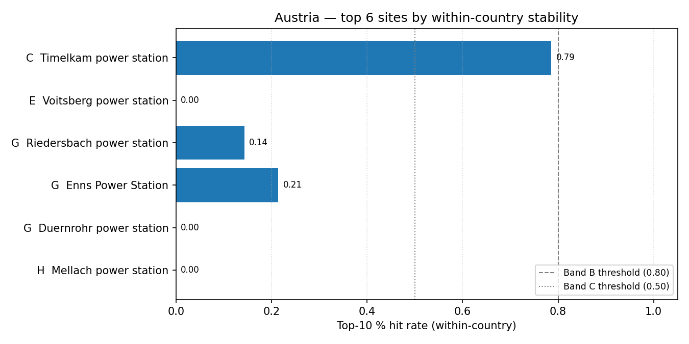

# Austria (AT) — sensitivity shortlist — 20260425

_Generated on 2026-04-25 (UTC)._

## Envelope

- Scored sites (all-SMR pool): **6**.
- Scored sites (NuScale pool): **6**.
- Non-baseline scenarios: **14**.
- Within-country top-5 / 10 / 30 % percentiles are computed on the local pool, so **bands reflect national competitiveness**.

## Ranked shortlist — all SMRs pooled (top 10)

| Rank | Site | Country | Band | Top-5 % rate | Top-10 % rate | Top-30 % rate |
| ---: | --- | --- | :---: | ---: | ---: | ---: |
| 1 | Timelkam power station | AT | C | 0.7857 | 0.7857 | 0.9286 |
| 2 | Voitsberg power station | AT | E | 0.0 | 0.0 | 0.5 |
| 3 | Riedersbach power station | AT | G | 0.1429 | 0.1429 | 0.2857 |
| 4 | Enns Power Station | AT | G | 0.0714 | 0.2143 | 0.3571 |
| 5 | Duernrohr power station | AT | G | 0.0 | 0.0 | 0.2143 |
| 6 | Mellach power station | AT | H | 0.0 | 0.0 | 0.0 |

**Band counts:** A=0, B=0, C=1, D=0, E=1, F=0, G=3, H=1.

## Ranked shortlist — NuScale `nuscale_voygr6` (top 10)

| Rank | Site | Country | Band | Top-5 % rate | Top-10 % rate | Top-30 % rate |
| ---: | --- | --- | :---: | ---: | ---: | ---: |
| 1 | Timelkam power station | AT | C | 0.7857 | 0.7857 | 0.7857 |
| 2 | Enns Power Station | AT | G | 0.0714 | 0.0714 | 0.2143 |
| 3 | Riedersbach power station | AT | H | 0.1429 | 0.1429 | 0.1429 |
| 4 | Duernrohr power station | AT | H | 0.0 | 0.0 | 0.1429 |
| 5 | Mellach power station | AT | H | 0.0 | 0.0 | 0.0 |
| 6 | Voitsberg power station | AT | H | 0.0 | 0.0 | 0.0 |

**NuScale band counts:** A=0, B=0, C=1, D=0, E=0, F=0, G=1, H=4.

## Interpretation

- Sites in Bands A–C (within-country robust top tier): **1**.
- Band A / B sites are in the local top-5 % / 10 % slice in ≥ 80 % of the 14 non-baseline scenarios — the defensible national shortlist under perturbation.
- Sources: `20260425_site_bands_AT.csv`, `20260425_site_bands_AT_nuscale_voygr6.csv`.
