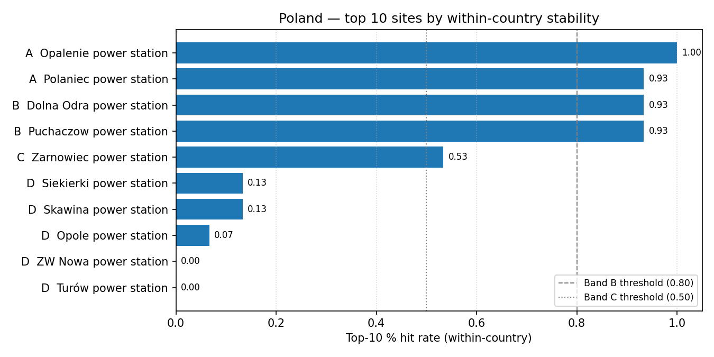

# Poland (PL) — sensitivity shortlist — 20260425

_Generated on 2026-04-25 (UTC)._

## Envelope

- Scored sites (all-SMR pool): **41**.
- Scored sites (NuScale pool): **41**.
- Non-baseline scenarios: **15**.
- Within-country top-5 / 10 / 30 % percentiles are computed on the local pool, so **bands reflect national competitiveness**.

## Ranked shortlist — all SMRs pooled (top 10)

| Rank | Site | Country | Band | Top-5 % rate | Top-10 % rate | Top-30 % rate |
| ---: | --- | --- | :---: | ---: | ---: | ---: |
| 1 | Opalenie power station | PL | A | 1.0 | 1.0 | 1.0 |
| 2 | Polaniec power station | PL | A | 0.9333 | 0.9333 | 0.9333 |
| 3 | Dolna Odra power station | PL | B | 0.6667 | 0.9333 | 0.9333 |
| 4 | Puchaczow power station | PL | B | 0.1333 | 0.9333 | 1.0 |
| 5 | Zarnowiec power station | PL | C | 0.0 | 0.5333 | 0.9333 |
| 6 | Siekierki power station | PL | D | 0.1333 | 0.1333 | 0.8667 |
| 7 | Skawina power station | PL | D | 0.0 | 0.1333 | 0.9333 |
| 8 | Opole power station | PL | D | 0.0 | 0.0667 | 0.9333 |
| 9 | ZW Nowa power station | PL | D | 0.0 | 0.0 | 0.9333 |
| 10 | Turów power station | PL | D | 0.0 | 0.0 | 0.9333 |
| … 31 more | | | | | | |

**Band counts:** A=2, B=2, C=1, D=6, E=0, F=0, G=1, H=29.

## Ranked shortlist — NuScale `nuscale_voygr6` (top 10)

| Rank | Site | Country | Band | Top-5 % rate | Top-10 % rate | Top-30 % rate |
| ---: | --- | --- | :---: | ---: | ---: | ---: |
| 1 | Opalenie power station | PL | A | 1.0 | 1.0 | 1.0 |
| 2 | Polaniec power station | PL | A | 0.9333 | 0.9333 | 0.9333 |
| 3 | Dolna Odra power station | PL | B | 0.0 | 0.9333 | 0.9333 |
| 4 | Puchaczow power station | PL | B | 0.0 | 0.8 | 0.9333 |
| 5 | Skawina power station | PL | D | 0.0 | 0.1333 | 0.9333 |
| 6 | Siekierki power station | PL | D | 0.0 | 0.1333 | 0.8 |
| 7 | Opole power station | PL | D | 0.0 | 0.0 | 0.9333 |
| 8 | ZW Nowa power station | PL | D | 0.0 | 0.0 | 0.9333 |
| 9 | Turów power station | PL | D | 0.0 | 0.0 | 0.9333 |
| 10 | Zarnowiec power station | PL | D | 0.0 | 0.0 | 0.8667 |
| … 31 more | | | | | | |

**NuScale band counts:** A=2, B=2, C=0, D=6, E=0, F=0, G=1, H=30.

## Interpretation

- Sites in Bands A–C (within-country robust top tier): **5**.
- Band A / B sites are in the local top-5 % / 10 % slice in ≥ 80 % of the 14 non-baseline scenarios — the defensible national shortlist under perturbation.
- Sources: `20260425_site_bands_PL.csv`, `20260425_site_bands_PL_nuscale_voygr6.csv`.
