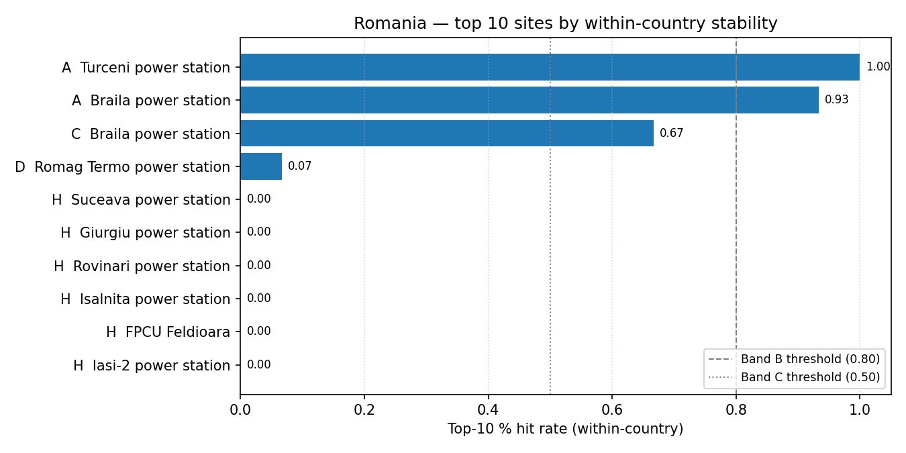

# Romania (RO) — sensitivity shortlist — 20260425

_Generated on 2026-04-25 (UTC)._

## Envelope

- Scored sites (all-SMR pool): **19**.
- Scored sites (NuScale pool): **19**.
- Non-baseline scenarios: **15**.
- Within-country top-5 / 10 / 30 % percentiles are computed on the local pool, so **bands reflect national competitiveness**.

## Ranked shortlist — all SMRs pooled (top 10)

| Rank | Site | Country | Band | Top-5 % rate | Top-10 % rate | Top-30 % rate |
| ---: | --- | --- | :---: | ---: | ---: | ---: |
| 1 | Turceni power station | RO | A | 1.0 | 1.0 | 1.0 |
| 2 | Braila power station | RO | A | 0.9333 | 0.9333 | 0.9333 |
| 3 | Braila power station | RO | C | 0.0 | 0.6667 | 0.9333 |
| 4 | Romag Termo power station | RO | D | 0.0 | 0.0667 | 1.0 |
| 5 | Suceava power station | RO | H | 0.0 | 0.0 | 0.1333 |
| 6 | Giurgiu power station | RO | H | 0.0 | 0.0 | 0.1333 |
| 7 | Rovinari power station | RO | H | 0.0 | 0.0 | 0.1333 |
| 8 | Isalnita power station | RO | H | 0.0 | 0.0 | 0.1333 |
| 9 | FPCU Feldioara | RO | H | 0.0 | 0.0 | 0.0 |
| 10 | Iasi-2 power station | RO | H | 0.0 | 0.0 | 0.0 |
| … 9 more | | | | | | |

**Band counts:** A=2, B=0, C=1, D=1, E=0, F=0, G=0, H=15.

## Ranked shortlist — NuScale `nuscale_voygr6` (top 10)

| Rank | Site | Country | Band | Top-5 % rate | Top-10 % rate | Top-30 % rate |
| ---: | --- | --- | :---: | ---: | ---: | ---: |
| 1 | Turceni power station | RO | A | 1.0 | 1.0 | 1.0 |
| 2 | Braila power station | RO | B | 0.0 | 0.9333 | 0.9333 |
| 3 | Braila power station | RO | D | 0.0 | 0.1333 | 0.9333 |
| 4 | Romag Termo power station | RO | D | 0.0 | 0.0 | 0.9333 |
| 5 | Suceava power station | RO | H | 0.0 | 0.0 | 0.1333 |
| 6 | Giurgiu power station | RO | H | 0.0 | 0.0 | 0.1333 |
| 7 | Rovinari power station | RO | H | 0.0 | 0.0 | 0.1333 |
| 8 | Isalnita power station | RO | H | 0.0 | 0.0 | 0.1333 |
| 9 | FPCU Feldioara | RO | H | 0.0 | 0.0 | 0.0 |
| 10 | Iasi-2 power station | RO | H | 0.0 | 0.0 | 0.0 |
| … 9 more | | | | | | |

**NuScale band counts:** A=1, B=1, C=0, D=2, E=0, F=0, G=0, H=15.

## Interpretation

- Sites in Bands A–C (within-country robust top tier): **3**.
- Band A / B sites are in the local top-5 % / 10 % slice in ≥ 80 % of the 14 non-baseline scenarios — the defensible national shortlist under perturbation.
- Sources: `20260425_site_bands_RO.csv`, `20260425_site_bands_RO_nuscale_voygr6.csv`.
