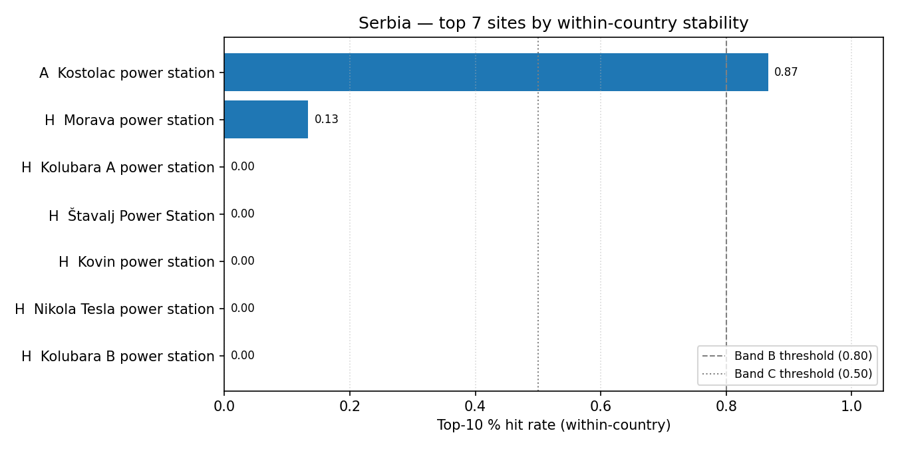

# Serbia (RS) — sensitivity shortlist — 20260425b

_Generated on 2026-04-25 (UTC)._

## Envelope

- Scored sites (all-SMR pool): **7**.
- Scored sites (NuScale pool): **7**.
- Non-baseline scenarios: **15**.
- Within-country top-5 / 10 / 30 % percentiles are computed on the local pool, so **bands reflect national competitiveness**.

## Ranked shortlist — all SMRs pooled (top 10)

| Rank | Site | Country | Band | Top-5 % rate | Top-10 % rate | Top-30 % rate |
| ---: | --- | --- | :---: | ---: | ---: | ---: |
| 1 | Kostolac power station | RS | A | 0.8667 | 0.8667 | 1.0 |
| 2 | Morava power station | RS | H | 0.1333 | 0.1333 | 0.1333 |
| 3 | Kolubara A power station | RS | H | 0.0 | 0.0 | 0.0 |
| 4 | Štavalj Power Station | RS | H | 0.0 | 0.0 | 0.0 |
| 5 | Kovin power station | RS | H | 0.0 | 0.0 | 0.0 |
| 6 | Nikola Tesla power station | RS | H | 0.0 | 0.0 | 0.0 |
| 7 | Kolubara B power station | RS | H | 0.0 | 0.0 | 0.0 |

**Band counts:** A=1, B=0, C=0, D=0, E=0, F=0, G=0, H=6.

## Ranked shortlist — NuScale `nuscale_voygr6` (top 10)

| Rank | Site | Country | Band | Top-5 % rate | Top-10 % rate | Top-30 % rate |
| ---: | --- | --- | :---: | ---: | ---: | ---: |
| 1 | Kostolac power station | RS | A | 0.8667 | 0.8667 | 1.0 |
| 2 | Morava power station | RS | H | 0.1333 | 0.1333 | 0.1333 |
| 3 | Kolubara A power station | RS | H | 0.0 | 0.0 | 0.0 |
| 4 | Štavalj Power Station | RS | H | 0.0 | 0.0 | 0.0 |
| 5 | Kovin power station | RS | H | 0.0 | 0.0 | 0.0 |
| 6 | Nikola Tesla power station | RS | H | 0.0 | 0.0 | 0.0 |
| 7 | Kolubara B power station | RS | H | 0.0 | 0.0 | 0.0 |

**NuScale band counts:** A=1, B=0, C=0, D=0, E=0, F=0, G=0, H=6.

## Interpretation

- Sites in Bands A–C (within-country robust top tier): **1**.
- Band A / B sites are in the local top-5 % / 10 % slice in ≥ 80 % of the 14 non-baseline scenarios — the defensible national shortlist under perturbation.
- Sources: `20260425b_site_bands_RS.csv`, `20260425b_site_bands_RS_nuscale_voygr6.csv`.

## Score provenance

Scores feeding this shortlist follow the project's API-primary / LLM-fallback hierarchy: exclusionary E-codes use Tier 1 (API / open-data) evidence only, while ranking criteria may fall back to Tier 2 (LLM-curated) values when API coverage is absent. See [`sensitivity_analysis.md` §9](../../../methodology/sensitivity_analysis.md#9-score-provenance-hierarchy) for the tier definitions and the per-tier audit rules.
