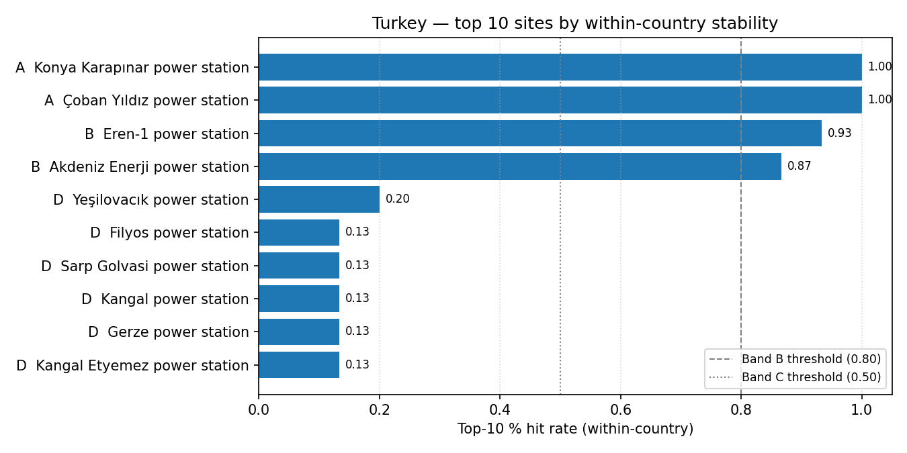

# Turkey (TR) — sensitivity shortlist — 20260425b

_Generated on 2026-04-25 (UTC)._

## Envelope

- Scored sites (all-SMR pool): **106**.
- Scored sites (NuScale pool): **106**.
- Non-baseline scenarios: **15**.
- Within-country top-5 / 10 / 30 % percentiles are computed on the local pool, so **bands reflect national competitiveness**.

## Ranked shortlist — all SMRs pooled (top 10)

| Rank | Site | Country | Band | Top-5 % rate | Top-10 % rate | Top-30 % rate |
| ---: | --- | --- | :---: | ---: | ---: | ---: |
| 1 | Konya Karapınar power station | TR | A | 1.0 | 1.0 | 1.0 |
| 2 | Çoban Yıldız power station | TR | A | 0.9333 | 1.0 | 1.0 |
| 3 | Eren-1 power station | TR | B | 0.1333 | 0.9333 | 1.0 |
| 4 | Akdeniz Enerji power station | TR | B | 0.1333 | 0.8667 | 1.0 |
| 5 | Yeşilovacık power station | TR | D | 0.1333 | 0.2 | 1.0 |
| 6 | Filyos power station | TR | D | 0.1333 | 0.1333 | 0.9333 |
| 7 | Sarp Golvasi power station | TR | D | 0.1333 | 0.1333 | 0.8 |
| 8 | Kangal power station | TR | D | 0.0 | 0.1333 | 0.9333 |
| 9 | Gerze power station | TR | D | 0.0 | 0.1333 | 0.9333 |
| 10 | Kangal Etyemez power station | TR | D | 0.0 | 0.1333 | 0.8667 |
| … 96 more | | | | | | |

**Band counts:** A=2, B=2, C=0, D=12, E=0, F=0, G=1, H=89.

## Ranked shortlist — NuScale `nuscale_voygr6` (top 10)

| Rank | Site | Country | Band | Top-5 % rate | Top-10 % rate | Top-30 % rate |
| ---: | --- | --- | :---: | ---: | ---: | ---: |
| 1 | Konya Karapınar power station | TR | A | 1.0 | 1.0 | 1.0 |
| 2 | Çoban Yıldız power station | TR | A | 0.9333 | 1.0 | 1.0 |
| 3 | Eren-1 power station | TR | B | 0.1333 | 0.9333 | 1.0 |
| 4 | Akdeniz Enerji power station | TR | B | 0.1333 | 0.8667 | 1.0 |
| 5 | Yeşilovacık power station | TR | D | 0.1333 | 0.2 | 1.0 |
| 6 | Filyos power station | TR | D | 0.1333 | 0.1333 | 0.9333 |
| 7 | Kangal power station | TR | D | 0.0 | 0.1333 | 0.9333 |
| 8 | Gerze power station | TR | D | 0.0 | 0.1333 | 0.9333 |
| 9 | Kangal Etyemez power station | TR | D | 0.0 | 0.1333 | 0.8667 |
| 10 | Yüksek Gölovası power station | TR | D | 0.0 | 0.1333 | 0.8 |
| … 96 more | | | | | | |

**NuScale band counts:** A=2, B=2, C=0, D=12, E=0, F=0, G=0, H=90.

## Interpretation

- Sites in Bands A–C (within-country robust top tier): **4**.
- Band A / B sites are in the local top-5 % / 10 % slice in ≥ 80 % of the 14 non-baseline scenarios — the defensible national shortlist under perturbation.
- Sources: `20260425b_site_bands_TR.csv`, `20260425b_site_bands_TR_nuscale_voygr6.csv`.

## Score provenance

Scores feeding this shortlist follow the project's API-primary / LLM-fallback hierarchy: exclusionary E-codes use Tier 1 (API / open-data) evidence only, while ranking criteria may fall back to Tier 2 (LLM-curated) values when API coverage is absent. See [`sensitivity_analysis.md` §9](../../../methodology/sensitivity_analysis.md#9-score-provenance-hierarchy) for the tier definitions and the per-tier audit rules.
