# NuScale (VOYGR-6) — top 10 sites per country (20260425b)

_Generated 2026-04-25 14:23 UTC_  
_Sensitivity run_id_: `p16_20260425T141705_5037b797`  
_Scoring run_id_: `20260425T140231_ff84d75e`  
_git_sha_: `127dde226db40ab2b8d68249445bdb00895ae45c`

## Regional summary

- Global NuScale shortlist: K=6 · scenarios=15 · mean Jaccard@K = 0.93 · bands A=0 · B=0 · C=0
- Weight-profile stability (worst profile): max |Δscore| = 1.01 · mean |Δscore| = 0.34 · Jaccard@5 = 0.56 · Jaccard@10 = 0.49

| Rank | Site                          | Country | Band | Composite | UI low/high |
| ---: | ----------------------------- | :-----: | :--: | --------: | ----------- |
|    1 | Opalenie power station        |   PL    |  A   |      6.61 | 4.77 / 6.99 |
|    2 | Turceni power station         |   RO    |  A   |      6.58 | 4.67 / 6.99 |
|    3 | Çoban Yıldız power station    |   TR    |  A   |      6.57 | 4.42 / 7.06 |
|    4 | Konya Karapınar power station |   TR    |  A   |      6.52 | 4.49 / 7.08 |
|    5 | Dolna Odra power station      |   PL    |  B   |      6.48 | 4.79 / 6.95 |
|    6 | Puchaczow power station       |   PL    |  B   |      6.46 | 4.79 / 6.88 |
|    7 | Eren-1 power station          |   TR    |  B   |      6.44 | 4.62 / 6.93 |
|    8 | Akdeniz Enerji power station  |   TR    |  C   |      6.34 | 4.49 / 6.97 |
|    9 | Zelwa power station           |   BY    |  D   |      6.33 | 4.48 / 6.83 |
|   10 | Braila power station          |   RO    |  D   |      6.31 | 4.62 / 6.72 |

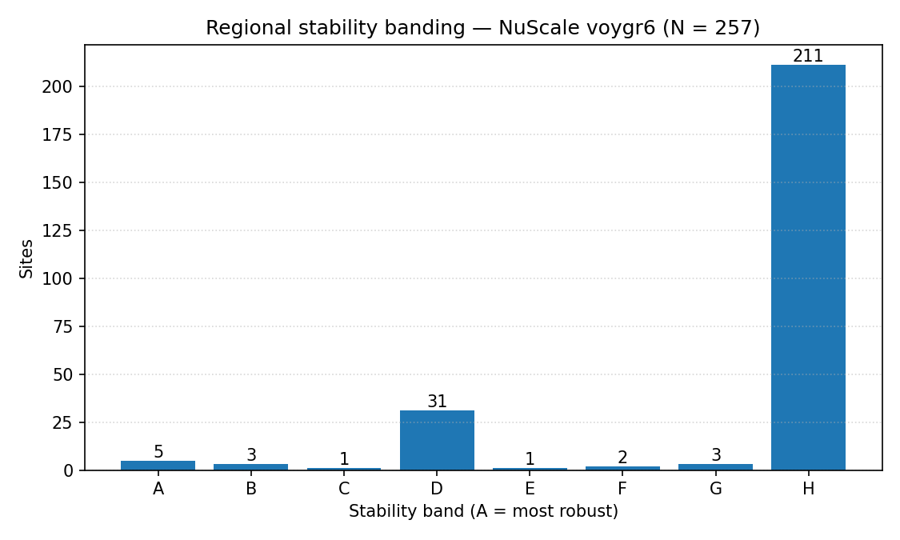
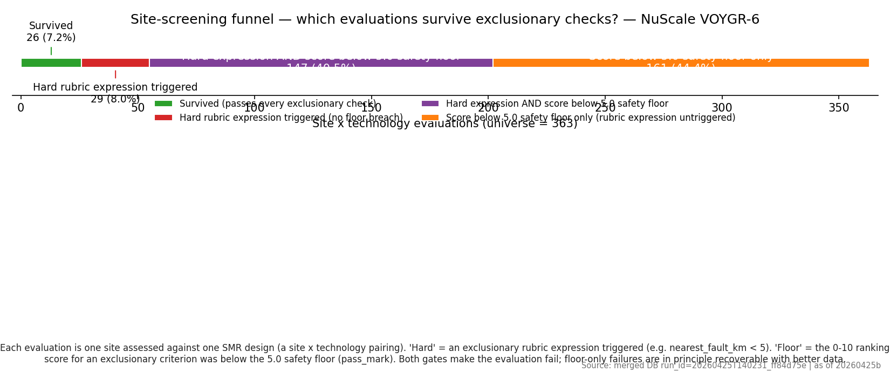

## BY — Belarus

- n_sites=2 · K=2 · scenarios=15 · mean Jaccard@K vs baseline = 0.97 · bands A=0 · B=0 · C=0

| #   | Site                | Band | Composite | UI low/high |  NH |  HI |  RI |  EP |  NS | Top-5% | Top-30% | Coverage |
| --- | ------------------- | :--: | --------: | ----------- | --: | --: | --: | --: | --: | -----: | ------: | -------: |
| 1   | Zelwa power station |  D   |      6.33 | 4.48 / 6.83 | 7.2 | 3.7 | 7.2 | 5.5 | 6.0 |   100% |    100% |      42% |

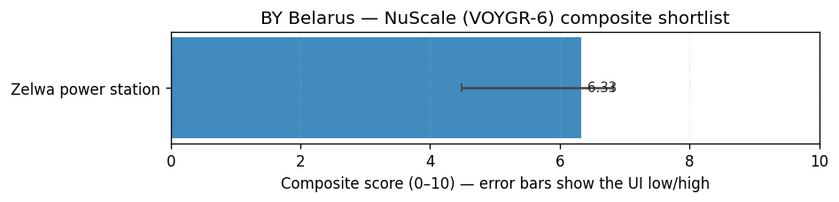
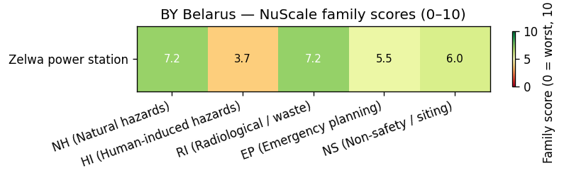
_Cross-link:_ [`national/BY_belarus.md`](national/BY_belarus.md)

## PL — Poland

- n_sites=41 · K=13 · scenarios=15 · mean Jaccard@K vs baseline = 0.93 · bands A=0 · B=0 · C=0

| #   | Site                     | Band | Composite | UI low/high |  NH |  HI |  RI |  EP |  NS | Top-5% | Top-30% | Coverage |
| --- | ------------------------ | :--: | --------: | ----------- | --: | --: | --: | --: | --: | -----: | ------: | -------: |
| 1   | Opalenie power station   |  A   |      6.61 | 4.77 / 6.99 | 7.8 | 5.5 | 5.3 | 5.5 | 6.8 |   100% |    100% |      46% |
| 2   | Dolna Odra power station |  B   |      6.48 | 4.79 / 6.95 | 7.5 | 4.3 | 5.3 | 5.5 | 7.1 |     0% |     93% |      48% |
| 3   | Puchaczow power station  |  B   |      6.46 | 4.79 / 6.88 | 7.0 | 4.3 | 5.9 | 5.5 | 7.4 |     0% |    100% |      48% |
| 4   | Zarnowiec power station  |  D   |      6.28 | 4.68 / 6.74 | 7.8 | 7.0 | 4.8 | 4.6 | 5.3 |     0% |     87% |      48% |

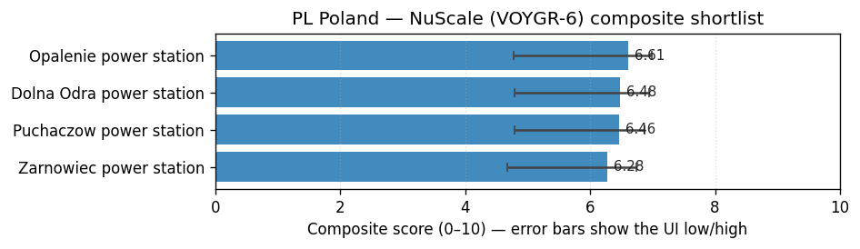
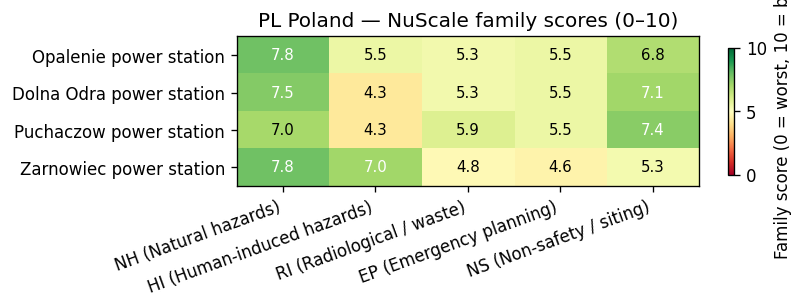
_Cross-link:_ [`national/PL_poland.md`](national/PL_poland.md)

## RO — Romania

- n_sites=19 · K=10 · scenarios=15 · mean Jaccard@K vs baseline = 0.92 · bands A=0 · B=0 · C=0

| #   | Site                      | Band | Composite | UI low/high |  NH |  HI |  RI |  EP |  NS | Top-5% | Top-30% | Coverage |
| --- | ------------------------- | :--: | --------: | ----------- | --: | --: | --: | --: | --: | -----: | ------: | -------: |
| 1   | Turceni power station     |  A   |      6.58 | 4.67 / 6.99 | 7.1 | 3.7 | 7.2 | 4.6 | 7.2 |   100% |    100% |      44% |
| 2   | Braila power station      |  D   |      6.31 | 4.62 / 6.72 | 6.9 | 5.6 | 5.9 | 3.8 | 7.1 |     0% |     93% |      46% |
| 3   | Braila power station      |  D   |      6.21 | 4.58 / 6.62 | 6.6 | 5.6 | 5.9 | 3.8 | 7.1 |     0% |     67% |      46% |
| 4   | Romag Termo power station |  D   |      6.12 | 4.53 / 6.53 | 7.1 | 2.9 | 5.5 | 4.6 | 7.3 |     0% |     27% |      46% |

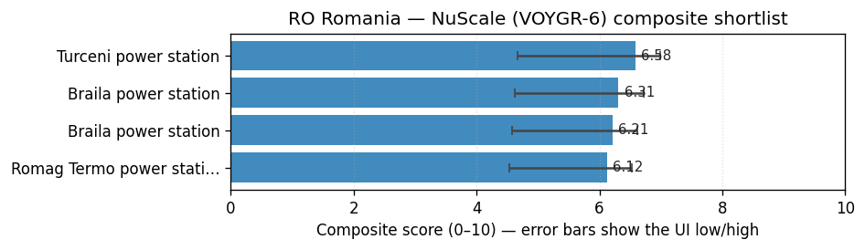
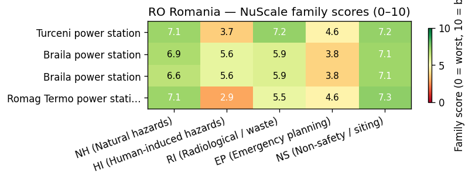
_Cross-link:_ [`national/RO_romania.md`](national/RO_romania.md)

## RS — Serbia

- n_sites=7 · K=7 · scenarios=15 · mean Jaccard@K vs baseline = 0.95 · bands A=0 · B=0 · C=0

| #   | Site                   | Band | Composite | UI low/high |  NH |  HI |  RI |  EP |  NS | Top-5% | Top-30% | Coverage |
| --- | ---------------------- | :--: | --------: | ----------- | --: | --: | --: | --: | --: | -----: | ------: | -------: |
| 1   | Kostolac power station |  D   |      5.91 | 4.37 / 6.44 | 6.8 | 3.5 | 6.4 | 4.6 | 5.7 |    87% |    100% |      44% |
| 2   | Kovin power station    |  G   |      5.83 | 4.33 / 6.30 | 6.6 | 3.5 | 6.4 | 4.6 | 5.8 |     0% |      0% |      44% |

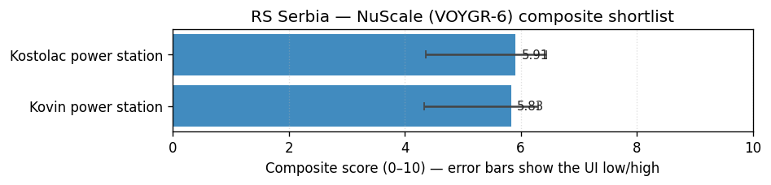
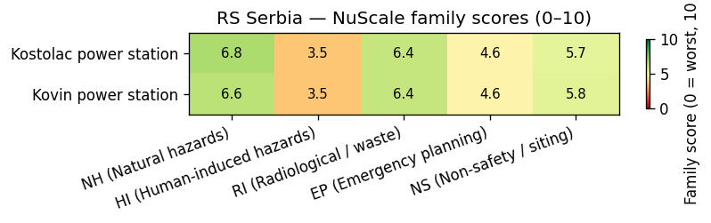
_Cross-link:_ [`national/RS_serbia.md`](national/RS_serbia.md)

## TR — Turkey

- n_sites=106 · K=32 · scenarios=15 · mean Jaccard@K vs baseline = 0.89 · bands A=0 · B=0 · C=0

| #   | Site                                   | Band | Composite | UI low/high |  NH |  HI |  RI |  EP |  NS | Top-5% | Top-30% | Coverage |
| --- | -------------------------------------- | :--: | --------: | ----------- | --: | --: | --: | --: | --: | -----: | ------: | -------: |
| 1   | Çoban Yıldız power station             |  A   |      6.57 | 4.42 / 7.06 | 7.1 | 5.5 | 4.8 | 5.8 | 7.4 |    93% |    100% |      38% |
| 2   | Konya Karapınar power station          |  A   |      6.52 | 4.49 / 7.08 | 7.2 | 5.5 | 6.7 | 4.6 | 6.5 |   100% |    100% |      40% |
| 3   | Eren-1 power station                   |  B   |      6.44 | 4.62 / 6.93 | 6.7 | 5.5 | 5.7 | 5.5 | 7.2 |    13% |    100% |      44% |
| 4   | Akdeniz Enerji power station           |  C   |      6.34 | 4.49 / 6.97 | 7.0 | 5.5 | 7.2 | 4.6 | 6.0 |    13% |    100% |      42% |
| 5   | Yeşilovacık power station              |  D   |      6.30 | 4.55 / 6.92 | 6.8 | 5.5 | 7.2 | 4.6 | 6.0 |    13% |    100% |      44% |
| 6   | Diler (Akbayir) Elbistan power station |  D   |      5.87 | 4.29 / 6.42 | 5.9 | 5.5 | 5.7 | 4.6 | 6.5 |     0% |     93% |      42% |
| 7   | Alpu power station                     |  H   |      5.79 | 4.24 / 6.35 | 5.9 | 5.5 | 5.1 | 4.6 | 6.5 |     0% |     93% |      42% |
| 8   | Çebi Enerji power station              |  H   |      5.79 | 4.31 / 6.29 | 5.8 | 3.7 | 3.1 | 5.5 | 8.1 |     0% |     93% |      44% |
| 9   | İÇDAŞ Bekirli power station            |  H   |      5.57 | 4.14 / 6.13 | 5.8 | 5.5 | 5.1 | 4.6 | 5.8 |     0% |     93% |      42% |
| 10  | Selena power station                   |  H   |      5.49 | 4.11 / 6.09 | 6.1 | 4.6 | 4.0 | 5.5 | 5.9 |     0% |      0% |      42% |

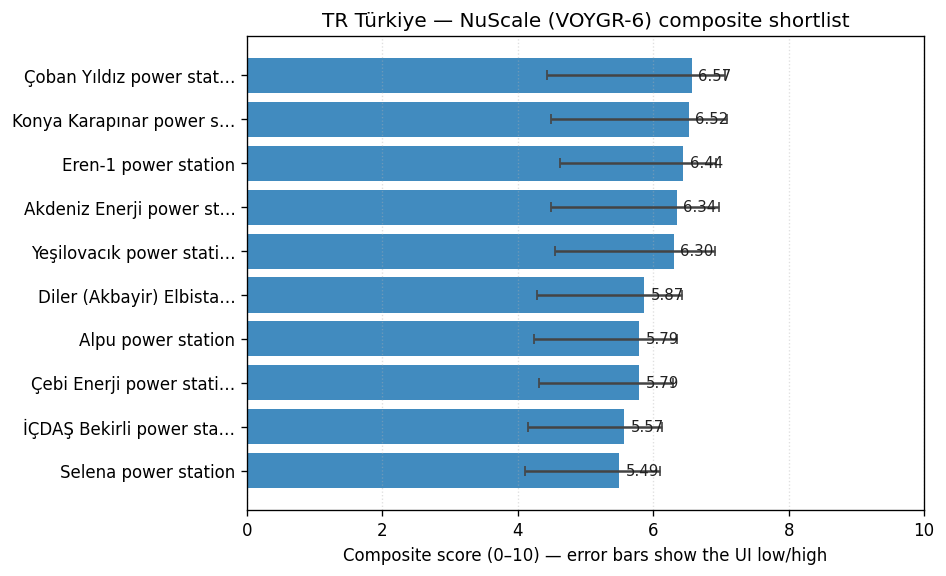
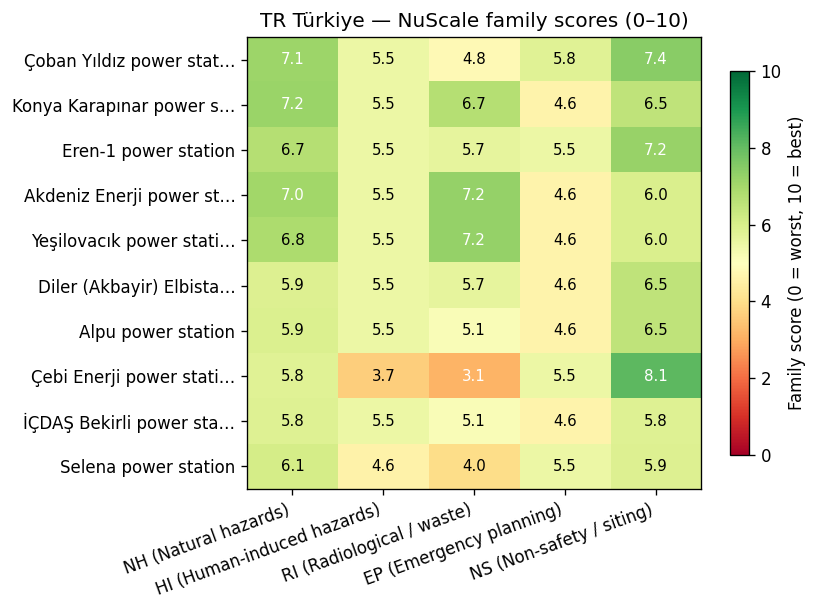
_Cross-link:_ [`national/TR_turkey.md`](national/TR_turkey.md)

## Methodology

- Bands A–H: see `report/methodology/methodology.md` §Stability bands.
- Sensitivity envelope: ±20 % weights, 10 000 Monte-Carlo draws, ±25 % thresholds.
- DB tables consulted: `country_site_rankings`, `composite_rankings`, `composite_score_components`, `site_bands`, `country_rankings_summary`, `weight_profile_stability`.
- Reproduce: `python -m scripts.inspect_run --run-id p16_20260425T141705_5037b797 top-n-per-country --smr nuscale_voygr6 --n 10`
- Scoring run: `20260425T140231_ff84d75e` · sensitivity run: `p16_20260425T141705_5037b797`.
