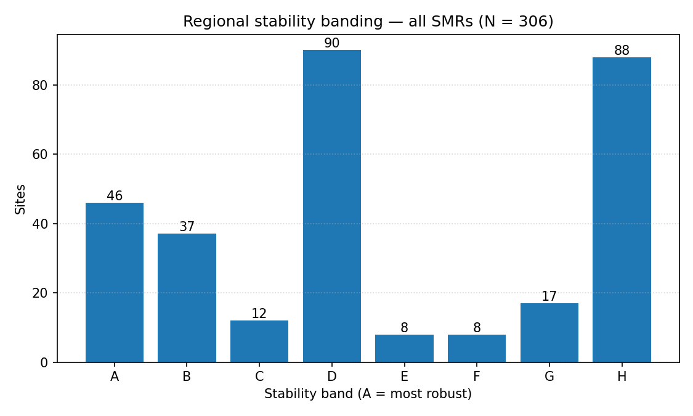
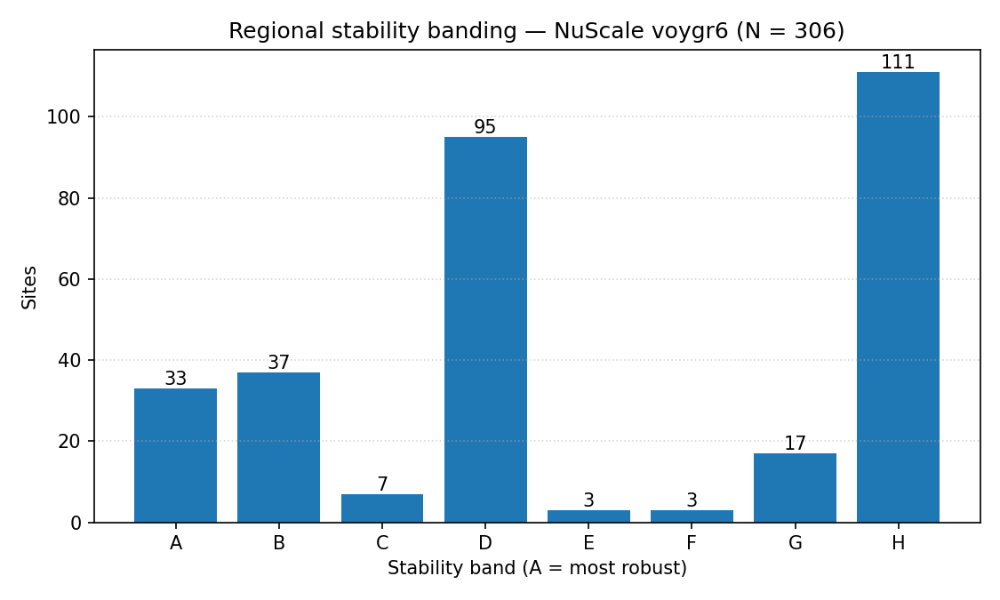

# Regional sensitivity summary — 20260523

_Generated on 2026-05-23 (UTC) from audit CSVs._

This document presents **site stability banding** (A–H) at two scopes:

- **Regional — all SMRs pooled** (306 sites).
- **Regional — NuScale `nuscale_voygr6` only** (306 sites).

Per-country rankings (with local top-K shortlists and within-country bands) live in `national/`.

## 1. Band counts — all SMRs pooled

| Band | Sites | Share |
| --- | ---: | ---: |
| A | 46 | 15.0 % |
| B | 37 | 12.1 % |
| C | 12 | 3.9 % |
| D | 90 | 29.4 % |
| E | 8 | 2.6 % |
| F | 8 | 2.6 % |
| G | 17 | 5.6 % |
| H | 88 | 28.8 % |
| **A–G (named)** | **218** | **71.2 %** |

## 2. Band counts — NuScale `nuscale_voygr6`

| Band | Sites | Share |
| --- | ---: | ---: |
| A | 33 | 10.8 % |
| B | 37 | 12.1 % |
| C | 7 | 2.3 % |
| D | 95 | 31.0 % |
| E | 3 | 1.0 % |
| F | 3 | 1.0 % |
| G | 17 | 5.6 % |
| H | 111 | 36.3 % |
| **A–G (named)** | **195** | **63.7 %** |

## 3. Top sites — NuScale (Band A/B/C, ≤ 25)

| Rank | Site | Country | Band | Top-5 % rate | Top-10 % rate | Top-30 % rate |
| ---: | --- | --- | :---: | ---: | ---: | ---: |
| 1 | Polaniec power station | PL | A | 1.0 | 1.0 | 1.0 |
| 2 | Turceni power station | RO | A | 1.0 | 1.0 | 1.0 |
| 3 | Opalenie power station | PL | A | 1.0 | 1.0 | 1.0 |
| 4 | Dolna Odra power station | PL | A | 1.0 | 1.0 | 1.0 |
| 5 | Mohacs power station | HU | A | 1.0 | 1.0 | 1.0 |
| 6 | Konya Karapınar power station | TR | A | 1.0 | 1.0 | 1.0 |
| 7 | Eren-1 power station | TR | A | 0.9412 | 1.0 | 1.0 |
| 8 | Zmiivska power station | UA | A | 0.9412 | 1.0 | 1.0 |
| 9 | Tunçbilek power station | TR | A | 0.9412 | 1.0 | 1.0 |
| 10 | Çoban Yıldız power station | TR | A | 0.9412 | 1.0 | 1.0 |
| 11 | Vidin Works power station | BG | A | 0.9412 | 1.0 | 1.0 |
| 12 | Karapinar Konya Şeker power station | TR | A | 0.9412 | 1.0 | 1.0 |
| 13 | Ladyzhyn power station | UA | A | 0.9412 | 1.0 | 1.0 |
| 14 | Puchaczow power station | PL | A | 0.9412 | 1.0 | 1.0 |
| 15 | Dobrotvir power station | UA | A | 0.9412 | 0.9412 | 1.0 |
| 16 | Tufanbeyli power station | TR | A | 0.9412 | 0.9412 | 1.0 |
| 17 | Maritsa Iztok-2 power station | BG | A | 0.9412 | 0.9412 | 1.0 |
| 18 | Lom Power Station | BG | A | 0.9412 | 0.9412 | 0.9412 |
| 19 | Rovinari power station | RO | A | 0.8824 | 1.0 | 1.0 |
| 20 | Riedersbach power station | AT | A | 0.8824 | 0.9412 | 1.0 |
| 21 | Çayırhan power station | TR | A | 0.8824 | 0.9412 | 1.0 |
| 22 | Swiecie Pulp Mill power station | PL | A | 0.8824 | 0.9412 | 1.0 |
| 23 | Pólnoc power station | PL | A | 0.8824 | 0.9412 | 1.0 |
| 24 | Turów power station | PL | A | 0.8824 | 0.9412 | 1.0 |
| 25 | Zelwa power station | BY | A | 0.8824 | 0.9412 | 0.9412 |
| … 52 more | | | | | | |

## 4. Top sites — all SMRs (Band A/B/C, ≤ 25)

| Rank | Site | Country | Band | Top-5 % rate | Top-10 % rate | Top-30 % rate |
| ---: | --- | --- | :---: | ---: | ---: | ---: |
| 1 | Polaniec power station | PL | A | 1.0 | 1.0 | 1.0 |
| 2 | Turceni power station | RO | A | 1.0 | 1.0 | 1.0 |
| 3 | Opalenie power station | PL | A | 1.0 | 1.0 | 1.0 |
| 4 | Dolna Odra power station | PL | A | 1.0 | 1.0 | 1.0 |
| 5 | Mohacs power station | HU | A | 1.0 | 1.0 | 1.0 |
| 6 | Vidin Works power station | BG | A | 1.0 | 1.0 | 1.0 |
| 7 | Konya Karapınar power station | TR | A | 1.0 | 1.0 | 1.0 |
| 8 | Eren-1 power station | TR | A | 0.9412 | 1.0 | 1.0 |
| 9 | Zmiivska power station | UA | A | 0.9412 | 1.0 | 1.0 |
| 10 | Tunçbilek power station | TR | A | 0.9412 | 1.0 | 1.0 |
| 11 | Çoban Yıldız power station | TR | A | 0.9412 | 1.0 | 1.0 |
| 12 | Karapinar Konya Şeker power station | TR | A | 0.9412 | 1.0 | 1.0 |
| 13 | Ladyzhyn power station | UA | A | 0.9412 | 1.0 | 1.0 |
| 14 | Puchaczow power station | PL | A | 0.9412 | 1.0 | 1.0 |
| 15 | Opole power station | PL | A | 0.9412 | 0.9412 | 1.0 |
| 16 | Dobrotvir power station | UA | A | 0.9412 | 0.9412 | 1.0 |
| 17 | Tufanbeyli power station | TR | A | 0.9412 | 0.9412 | 1.0 |
| 18 | Turów power station | PL | A | 0.9412 | 0.9412 | 1.0 |
| 19 | Maritsa Iztok-2 power station | BG | A | 0.9412 | 0.9412 | 1.0 |
| 20 | Lom Power Station | BG | A | 0.9412 | 0.9412 | 0.9412 |
| 21 | Tusimice power station | CZ | A | 0.8824 | 1.0 | 1.0 |
| 22 | Kozienice power station | PL | A | 0.8824 | 0.9412 | 1.0 |
| 23 | Riedersbach power station | AT | A | 0.8824 | 0.9412 | 1.0 |
| 24 | Çayırhan power station | TR | A | 0.8824 | 0.9412 | 1.0 |
| 25 | Vojany I power station | SK | A | 0.8824 | 0.9412 | 1.0 |
| … 70 more | | | | | | |

## 5. Country roll-up (all-SMR)

| Country | n sites | K (shortlist) | Band A | Band B | Band C | Mean Jaccard vs baseline top-K |
| --- | ---: | ---: | ---: | ---: | ---: | ---: |
| AT | 6 | 6 | 2 | 0 | 0 | 1.0 |
| BA | 6 | 6 | 2 | 0 | 1 | 1.0 |
| BG | 8 | 8 | 2 | 2 | 0 | 0.9926 |
| BY | 2 | 2 | 1 | 1 | 0 | 0.9706 |
| CZ | 29 | 10 | 3 | 3 | 1 | 0.8093 |
| HR | 1 | 1 | 1 | 0 | 0 | 1.0 |
| HU | 11 | 10 | 2 | 1 | 1 | 0.893 |
| LV | 1 | 1 | 1 | 0 | 0 | 1.0 |
| MD | 1 | 1 | 1 | 0 | 0 | 1.0 |
| ME | 2 | 2 | 0 | 1 | 1 | 1.0 |
| MK | 4 | 4 | 1 | 1 | 0 | 0.9559 |
| PL | 61 | 19 | 9 | 8 | 0 | 0.7632 |
| RO | 22 | 10 | 4 | 2 | 1 | 0.5471 |
| RS | 7 | 7 | 2 | 2 | 1 | 1.0 |
| SK | 5 | 5 | 1 | 1 | 0 | 1.0 |
| TR | 120 | 36 | 21 | 13 | 5 | 0.7776 |
| UA | 20 | 10 | 4 | 2 | 0 | 0.7112 |

## 6. Source artefacts

- `20260523_site_bands.csv` — all-SMR bands.
- `20260523_site_bands_nuscale_voygr6.csv` — NuScale bands.
- `20260523_country_rankings_summary.csv` — country roll-up.
- Methodology: [`report/methodology/sensitivity_analysis.md`](../../methodology/sensitivity_analysis.md).
