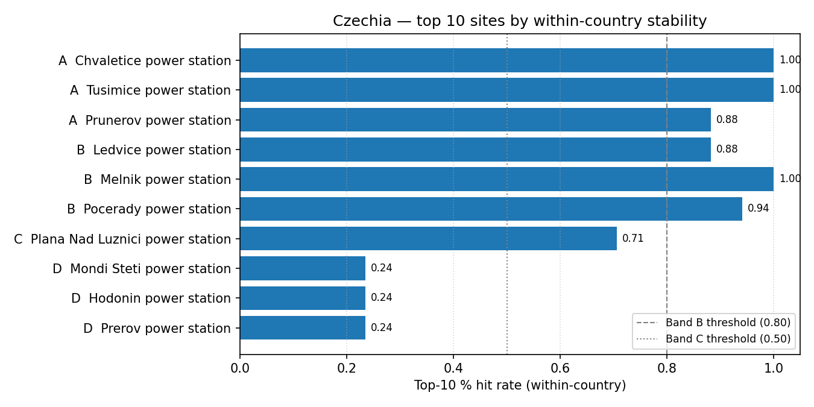

# Czechia (CZ) — sensitivity shortlist — 20260523

_Generated on 2026-05-23 (UTC)._

## Envelope

- Scored sites (all-SMR pool): **29**.
- Scored sites (NuScale pool): **29**.
- Non-baseline scenarios: **17**.
- Within-country top-5 / 10 / 30 % percentiles are computed on the local pool, so **bands reflect national competitiveness**.

## Ranked shortlist — all SMRs pooled (top 10)

| Rank | Site | Country | Band | Top-5 % rate | Top-10 % rate | Top-30 % rate |
| ---: | --- | --- | :---: | ---: | ---: | ---: |
| 1 | Chvaletice power station | CZ | A | 1.0 | 1.0 | 1.0 |
| 2 | Tusimice power station | CZ | A | 0.9412 | 1.0 | 1.0 |
| 3 | Prunerov power station | CZ | A | 0.8824 | 0.8824 | 1.0 |
| 4 | Ledvice power station | CZ | B | 0.7647 | 0.8824 | 1.0 |
| 5 | Melnik power station | CZ | B | 0.5882 | 1.0 | 1.0 |
| 6 | Pocerady power station | CZ | B | 0.4706 | 0.9412 | 1.0 |
| 7 | Plana Nad Luznici power station | CZ | C | 0.0588 | 0.7059 | 0.8824 |
| 8 | Mondi Steti power station | CZ | D | 0.0588 | 0.2353 | 1.0 |
| 9 | Hodonin power station | CZ | D | 0.0 | 0.2353 | 0.9412 |
| 10 | Prerov power station | CZ | D | 0.0 | 0.2353 | 0.9412 |
| … 19 more | | | | | | |

**Band counts:** A=3, B=3, C=1, D=9, E=0, F=2, G=2, H=9.

## Ranked shortlist — NuScale `nuscale_voygr6` (top 10)

| Rank | Site | Country | Band | Top-5 % rate | Top-10 % rate | Top-30 % rate |
| ---: | --- | --- | :---: | ---: | ---: | ---: |
| 1 | Chvaletice power station | CZ | A | 1.0 | 1.0 | 1.0 |
| 2 | Tusimice power station | CZ | A | 0.9412 | 1.0 | 1.0 |
| 3 | Prunerov power station | CZ | A | 0.8235 | 0.8824 | 1.0 |
| 4 | Melnik power station | CZ | B | 0.4118 | 1.0 | 1.0 |
| 5 | Ledvice power station | CZ | B | 0.3529 | 0.8824 | 1.0 |
| 6 | Pocerady power station | CZ | B | 0.2941 | 0.9412 | 1.0 |
| 7 | Mondi Steti power station | CZ | D | 0.0 | 0.2353 | 1.0 |
| 8 | Plana Nad Luznici power station | CZ | D | 0.0 | 0.1765 | 0.8824 |
| 9 | Opatovice power station | CZ | D | 0.0 | 0.0 | 0.9412 |
| 10 | Hodonin power station | CZ | D | 0.0 | 0.0 | 0.9412 |
| … 19 more | | | | | | |

**NuScale band counts:** A=3, B=3, C=0, D=8, E=1, F=1, G=0, H=13.

## Interpretation

- Sites in Bands A–C (within-country robust top tier): **7**.
- Band A / B sites are in the local top-5 % / 10 % slice in ≥ 80 % of the 14 non-baseline scenarios — the defensible national shortlist under perturbation.
- Sources: `20260523_site_bands_CZ.csv`, `20260523_site_bands_CZ_nuscale_voygr6.csv`.

## Score provenance

Scores feeding this shortlist follow the project's API-primary / LLM-fallback hierarchy: exclusionary E-codes use Tier 1 (API / open-data) evidence only, while ranking criteria may fall back to Tier 2 (LLM-curated) values when API coverage is absent. See [`sensitivity_analysis.md` §9](../../../methodology/sensitivity_analysis.md#9-score-provenance-hierarchy) for the tier definitions and the per-tier audit rules.
